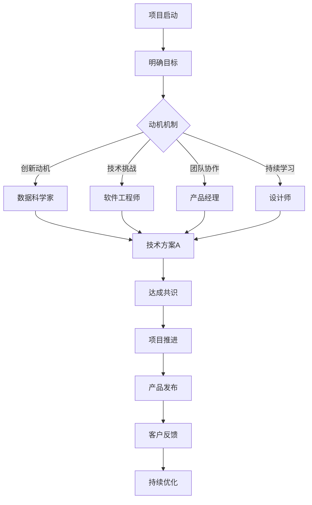
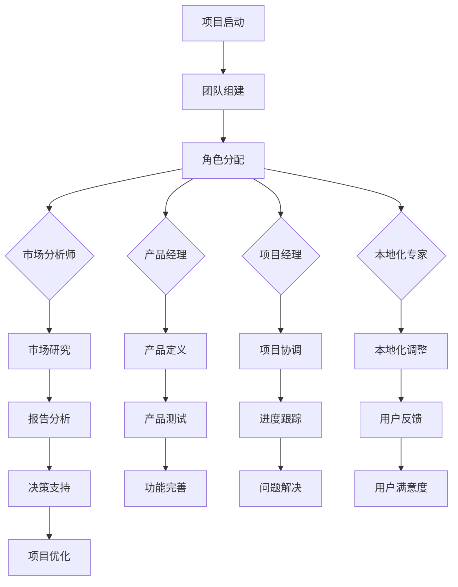

                 

### 文章标题

# 团队动力学：解析高效团队的内在机制

### 关键词

- 团队动力学
- 高效团队
- 团队建设
- 团队管理
- 团队发展

### 摘要

本文旨在探讨团队动力学在构建高效团队中的应用，通过对团队动力学核心机制的分析，揭示高效团队的内在运作规律。文章首先介绍了团队动力学的定义及其在团队管理中的重要性，然后详细解析了团队动力的来源、要素和模型。接着，文章深入探讨了团队动力的机制，包括动机机制、冲突机制和学习机制，并提出了团队动力管理的策略和实践方法。此外，文章还从团队建设、团队绩效提升、团队创新能力培养和团队管理实践等方面，全面阐述了构建高效团队的方法和技巧。通过案例分析，文章进一步验证了团队动力学理论在现实中的应用效果，为团队管理者提供了有益的参考和指导。

### 引言

在当今快速变化和竞争激烈的市场环境中，团队的重要性愈发凸显。一个高效运作的团队能够迅速响应外部变化，协同合作，实现组织目标。然而，如何构建和运营一个高效团队，却成为许多团队管理者面临的挑战。团队动力学，作为研究团队内部动力和运作机制的学科，为解答这一难题提供了有力的理论支持和实践指导。

团队动力学的研究涵盖了团队动力的来源、要素、机制以及团队动力管理等方面，通过揭示团队内部动力运作的规律，帮助团队管理者更好地理解团队行为，优化团队结构，提升团队效能。本文将从团队动力学的核心概念出发，逐步深入分析，以期为广大团队管理者提供有价值的理论参考和实践指导。

### 什么是团队动力学

团队动力学（Team Dynamics）是研究团队内部动力、结构、行为和互动的学科，旨在理解团队如何运作以及如何通过改变团队内部动力机制来提升团队效能。团队动力学探讨了团队内部成员之间的互动、角色分配、沟通模式以及团队目标的实现过程。

#### 团队动力

团队动力是指驱动团队向前发展的内在力量，包括成员之间的相互作用、共同目标和组织承诺。团队动力来源于以下几个方面：

1. **成员间的相互作用**：团队成员之间的互动，包括沟通、合作和冲突，对团队动力有着重要影响。积极的互动有助于增强团队凝聚力，提升团队效能。

2. **共同目标**：明确的团队目标能够为成员提供清晰的方向，激发团队成员的积极性和创造力。共同目标不仅能够促进团队成员之间的合作，还能够增强团队的凝聚力和战斗力。

3. **组织承诺**：团队成员对团队和组织目标的认同和投入程度，也是团队动力的重要来源。高水平的组织承诺能够增强团队成员的责任感和使命感，推动团队持续发展。

#### 团队动力在团队管理中的作用

团队动力在团队管理中扮演着至关重要的角色。通过理解和掌握团队动力，团队管理者可以：

1. **提升团队效能**：通过优化团队动力机制，激发团队成员的潜力，提高团队的工作效率和绩效。

2. **增强团队凝聚力**：积极的团队动力能够促进团队成员之间的相互信任和合作，增强团队凝聚力，降低团队解散的风险。

3. **改善团队沟通**：团队动力有助于改善团队成员之间的沟通模式，消除信息壁垒，提升信息传递的效率。

4. **促进团队学习**：团队动力为团队成员提供了学习和成长的平台，有助于团队成员不断更新知识和技能，适应不断变化的环境。

#### 团队动力与团队效能的关系

团队动力与团队效能之间存在密切的关系。研究表明，团队动力越强，团队效能越高。具体来说，高水平的团队动力能够：

1. **提高团队创新力**：积极的团队动力能够激发团队成员的创新思维，促进团队的创新和变革。

2. **提升团队决策质量**：团队动力有助于团队成员之间的信息共享和观点碰撞，提高团队决策的准确性和有效性。

3. **增强团队适应力**：团队动力能够帮助团队成员迅速适应外部环境的变化，提高团队的生存和发展能力。

#### 团队动力的影响因素

团队动力受到多种因素的影响，包括团队结构、团队目标、团队沟通、领导风格以及外部环境等。例如：

1. **团队结构**：团队的组织结构和角色分配对团队动力有着重要影响。明确的角色定位和合理的组织结构能够增强团队成员之间的互动，提升团队效能。

2. **团队目标**：明确的团队目标有助于激发团队成员的积极性和创造力，提高团队动力。

3. **团队沟通**：有效的沟通是团队动力的关键。良好的沟通机制能够促进团队成员之间的信息传递和观点交流，增强团队凝聚力。

4. **领导风格**：领导者的风格对团队动力有重要影响。激励型、支持型和参与型的领导风格有助于增强团队动力。

5. **外部环境**：外部环境的变化对团队动力也有着显著的影响。外部压力和竞争能够激发团队动力，促进团队创新和变革。

通过理解和掌握团队动力，团队管理者可以更好地把握团队内部动力机制，优化团队结构，提升团队效能，实现组织目标。

#### 团队动力的来源

团队动力的来源是团队持续发展和高效运作的基础。了解团队动力的来源有助于团队管理者更好地激发团队成员的积极性，提升团队整体效能。团队动力主要来源于以下几个方面：

1. **内部动机**：内部动机是驱动团队成员行为的重要动力源泉。内部动机包括个人兴趣、自我实现、成就感和归属感等。团队成员对工作的热爱和对团队的认同感能够激发他们的内在动力，推动团队向前发展。

2. **外部激励**：外部激励是通过外部奖励来激发团队成员积极性的手段。外部激励包括物质奖励、荣誉表彰、晋升机会等。适当的激励能够激发团队成员的工作热情，提高他们的工作投入度和绩效水平。

3. **共同目标**：共同目标是团队动力的核心来源之一。明确的团队目标能够为团队成员提供清晰的方向和动力，使他们能够同心协力，为实现团队目标而努力。共同目标不仅能够激发团队成员的内在动力，还能够增强团队的凝聚力和协作精神。

4. **团队文化**：团队文化是团队内部价值观、行为准则和工作氛围的总和，对团队动力有着重要的影响。积极的团队文化能够营造一种和谐、互助的工作环境，激发团队成员的积极性和创造力。例如，鼓励创新、尊重个性、公平竞争的团队文化有助于增强团队动力。

5. **领导支持**：领导支持是团队动力的重要保障。领导者的支持和激励能够为团队成员提供精神动力和实际帮助，增强他们的工作信心和投入度。有效的领导支持包括提供明确的目标、及时反馈、合理授权和建立积极的团队氛围等。

6. **外部压力**：外部压力是团队动力的催化剂。在激烈的市场竞争和外部压力下，团队需要不断适应变化，提高自身竞争力。这种外部压力能够激发团队的动力，推动团队成员积极应对挑战，提升团队效能。

通过以上分析，可以看出团队动力来源于多个方面，这些因素相互作用，共同推动团队的发展和进步。团队管理者需要关注这些动力来源，采取相应的策略和措施，激发团队动力，提升团队效能。

#### 团队动力的要素

团队动力的形成离不开几个关键要素，这些要素相互影响，共同构成了团队动力的基础。以下是对团队动力主要要素的详细分析：

1. **团队目标**：团队目标是指团队共同追求的愿景和方向，是团队动力的核心。明确的团队目标能够为团队成员提供清晰的指引，激发他们的内在动机，推动团队共同前进。团队目标应该具有可量化、可实现和具体性的特点，以便团队成员能够清晰地了解自己的工作目标和任务。

2. **团队角色**：团队角色是指团队成员在团队中所扮演的角色和职责。合理的团队角色分配能够明确每个成员的责任，促进团队成员之间的协作和沟通，提高团队效能。团队角色应该根据成员的技能、兴趣和特长进行合理配置，确保每个成员都能够发挥自己的优势，为团队目标贡献力量。

3. **团队沟通**：团队沟通是团队动力的重要保障。有效的沟通能够促进团队成员之间的信息传递和观点交流，消除误解和障碍，增强团队的凝聚力和协作能力。团队沟通不仅包括口头沟通，还涵盖书面沟通、非语言沟通等多种形式。建立良好的沟通机制和沟通文化是团队动力管理的关键。

4. **团队信任**：团队信任是团队动力的基石。信任能够促进团队成员之间的相互支持和合作，降低团队内部的冲突和摩擦。建立信任需要通过团队成员之间的相互了解、开放和诚实沟通以及共同经历困难与挑战来实现。高水平的团队信任能够增强团队成员的归属感和责任感，推动团队高效运作。

5. **团队激励**：团队激励是指通过外部和内部激励手段来激发团队成员的积极性和创造力。外部激励包括奖金、晋升和荣誉表彰等，内部激励包括认同、尊重和自我实现等。适当的激励能够增强团队成员的工作动力，提高团队绩效。

6. **团队文化**：团队文化是团队价值观、行为准则和工作氛围的总和，对团队动力有着深远的影响。积极向上的团队文化能够营造一种和谐、互助的工作环境，激发团队成员的积极性和创造力。团队文化应该与团队目标相一致，为团队成员提供共同的价值理念和行为准则。

7. **团队学习**：团队学习是指团队成员通过共同学习和分享经验，不断提升自身能力和团队绩效的过程。团队学习能够增强团队成员之间的知识共享和技能互补，提高团队的整体素质和创新能力。团队学习需要建立良好的学习机制和分享平台，鼓励成员积极参与和持续学习。

通过上述分析，可以看出团队动力的形成是一个多因素相互作用的过程。团队目标、团队角色、团队沟通、团队信任、团队激励、团队文化和团队学习等要素相互关联，共同构成了团队动力的基础。团队管理者需要关注这些要素，通过合理配置和优化，激发团队动力，提升团队效能。

#### 团队动力模型

为了更好地理解团队动力，研究人员提出了多种团队动力模型，其中最具有代表性的包括勒温的三元组模型、贝森和斯托克的团队效能模型以及格拉瑟和贝克的团队生命周期模型。以下将详细介绍这些模型及其核心概念。

1. **勒温的三元组模型**：
   - **核心概念**：勒温的三元组模型认为团队动力由三个要素构成：个体、团队和情境。这三个要素相互影响，共同决定团队动力的大小。
   - **模型描述**：个体要素指的是团队成员的个性、动机和需求；团队要素指的是团队结构、目标和文化；情境要素指的是团队所处的外部环境和社会背景。勒温认为，团队动力是这三个要素的动态互动结果，任何一方的变化都会影响整体团队动力。
   - **实际应用**：在团队建设过程中，管理者可以通过调整团队目标、优化团队结构和改善外部环境来增强团队动力。

2. **贝森和斯托克的团队效能模型**：
   - **核心概念**：贝森和斯托克提出的团队效能模型强调团队效能与团队动力之间的密切关系。该模型认为，团队效能取决于团队动力、团队技能和团队承诺三个关键因素。
   - **模型描述**：团队动力是团队效能的基础，它决定了团队成员的积极性和合作程度。团队技能包括成员的专业知识和技能，是团队完成任务的保障。团队承诺是指团队成员对团队目标的认同和投入程度。
   - **实际应用**：管理者可以通过提升团队技能、增强团队承诺和激发团队动力来提高团队效能，实现组织目标。

3. **格拉瑟和贝克的团队生命周期模型**：
   - **核心概念**：格拉瑟和贝克提出的团队生命周期模型认为，团队动力在团队发展的不同阶段具有不同的特征，随着团队从形成期到规范期、执行期和结束期的转变，团队动力也会相应地发生变化。
   - **模型描述**：在形成期，团队成员相互了解，团队动力主要来源于个体动机和兴趣；在规范期，团队开始形成共同的目标和规范，团队动力增强；在执行期，团队进入高效运作状态，团队动力达到顶峰；在结束期，团队解散，团队动力逐渐减弱。
   - **实际应用**：管理者可以根据团队所处的生命周期阶段，采取相应的团队动力管理策略，确保团队在各个阶段都能保持高水平的动力和效能。

这些团队动力模型为我们理解团队动力的来源、机制和管理提供了重要的理论支持。在实际应用中，管理者可以结合具体情境，选择合适的模型来指导团队建设和团队管理，从而提升团队效能，实现组织目标。

#### 团队动力的机制

团队动力不仅仅是一种抽象的概念，它包含了一系列具体的机制，这些机制相互作用，共同推动团队的发展和运作。以下是团队动力机制的核心方面：

1. **动机机制**：
   - **核心概念**：动机机制是指驱动团队成员行为和决策的内在力量。动机可以源自内在需求（如自我实现、成就感）或外在刺激（如奖励、认可）。
   - **机制描述**：团队成员的动机受到多种因素的影响，包括个人价值观、兴趣、目标以及团队文化和组织环境。积极的动机能够激发团队成员的主动性和创造力，提升团队整体效能。
   - **实际应用**：团队管理者可以通过设定明确的目标和提供具有挑战性的任务来激发团队成员的动机。此外，合理的奖励机制和认可体系也能有效提升团队成员的动机水平。

2. **冲突机制**：
   - **核心概念**：冲突机制是指团队内部因不同意见、利益差异或目标不一致而产生的冲突和对抗。
   - **机制描述**：冲突是团队运作的必然现象，但过度的冲突会消耗团队资源和时间，影响团队效能。合理的冲突机制能够促进团队成员之间的沟通和理解，推动团队创新和进步。
   - **实际应用**：团队管理者需要建立有效的冲突管理机制，通过建立开放和诚实的沟通渠道，鼓励团队成员表达不同观点，并寻求共识。冲突管理工具，如冲突调解和团队建设活动，可以帮助缓解冲突，提高团队协作效率。

3. **学习机制**：
   - **核心概念**：学习机制是指团队成员通过经验积累、知识共享和技能提升来不断适应和应对变化的过程。
   - **机制描述**：团队学习是团队动力的重要组成部分，它能够提高团队成员的能力和团队的整体素质。学习机制包括正式培训、非正式交流、经验分享和知识管理等多个方面。
   - **实际应用**：团队管理者可以通过组织定期的培训、开展经验分享会以及建立知识库来促进团队学习。此外，鼓励团队成员参与外部学习和交流，如参加行业会议、研讨会等，也有助于提升团队的学习能力。

4. **协作机制**：
   - **核心概念**：协作机制是指团队成员之间为实现共同目标而进行的合作和协作。
   - **机制描述**：协作是团队动力的关键组成部分，它能够提高团队的整体效率和创造力。协作机制包括任务分配、沟通协调、资源共享和团队建设等多个方面。
   - **实际应用**：团队管理者需要建立有效的协作机制，通过明确任务分配和角色定位，提高团队成员的工作协同性。同时，建立良好的沟通渠道和共享平台，确保信息的及时传递和资源共享，有助于提升团队的协作效率。

5. **反馈机制**：
   - **核心概念**：反馈机制是指通过及时收集、分析和反馈团队运作情况，为团队成员提供改进和优化的指导。
   - **机制描述**：有效的反馈机制能够帮助团队成员了解自己的工作表现，识别问题和不足，并采取措施进行改进。反馈机制包括定期的绩效评估、团队反馈会和自我评估等多个方面。
   - **实际应用**：团队管理者可以通过定期的绩效评估和反馈会，为团队成员提供具体的改进建议和指导。此外，鼓励团队成员进行自我评估和相互反馈，也有助于提高团队的自我完善能力。

通过理解和应用这些团队动力机制，团队管理者可以更好地激发团队动力，提升团队效能，实现组织目标。每个机制在团队运作中都发挥着重要作用，相互结合，共同推动团队的发展和进步。

#### 团队动力管理策略

团队动力管理是团队建设中至关重要的一环，有效的团队动力管理能够激发团队成员的积极性，提升团队整体效能。以下将介绍几种常见的团队动力管理策略及其具体实施方法。

1. **目标设定**：
   - **核心概念**：目标设定是指通过设定明确的团队目标，为团队成员提供清晰的方向和动力。
   - **实施方法**：
     1. **明确目标**：团队目标应该具体、可衡量、可实现、相关性强，并且有时限性（SMART原则）。
     2. **分解任务**：将大目标分解为一系列小任务，并明确每个任务的负责人和完成时间。
     3. **定期回顾**：定期检查目标进展情况，及时调整目标和任务，确保团队成员始终处于正确的方向上。

2. **激励机制**：
   - **核心概念**：激励机制是通过奖励和认可来激发团队成员的积极性和创造力。
   - **实施方法**：
     1. **物质奖励**：提供奖金、提成、晋升机会等物质奖励，以表彰团队成员的卓越表现。
     2. **荣誉表彰**：在团队内部举办表彰大会，公开表扬优秀成员，增强他们的荣誉感和成就感。
     3. **精神激励**：通过鼓励、认可和团队建设活动，营造积极向上的团队氛围，激发团队成员的内在动力。

3. **沟通管理**：
   - **核心概念**：沟通管理是确保团队内部信息传递畅通、团队成员相互理解和支持的关键。
   - **实施方法**：
     1. **建立沟通渠道**：设置定期会议、邮件群组、即时通讯工具等，确保团队成员之间的信息传递无障碍。
     2. **促进开放沟通**：鼓励团队成员表达不同观点和意见，建立开放的沟通文化，促进知识共享和团队协作。
     3. **反馈机制**：建立有效的反馈机制，确保团队成员能够及时了解自己的工作表现，并获取改进建议。

4. **领导力培养**：
   - **核心概念**：领导力培养是通过提升团队领导者的能力，增强团队凝聚力和管理效率。
   - **实施方法**：
     1. **培训与发展**：为团队领导者提供领导力培训，提升他们的沟通能力、决策能力和团队管理技能。
     2. **榜样示范**：通过领导者以身作则，树立榜样，引导团队成员积极向上。
     3. **领导风格**：根据团队特点和需求，采用不同的领导风格，如民主型、参与型和支持型，确保团队领导的有效性和适应性。

5. **团队文化建设**：
   - **核心概念**：团队文化建设是通过塑造共同价值观和行为准则，营造积极向上的团队氛围。
   - **实施方法**：
     1. **价值观传播**：明确团队的价值观，并通过各种形式传播和强化，如团队会议、宣传海报等。
     2. **团队活动**：组织定期的团队活动，如团队建设游戏、团队拓展训练等，增强团队凝聚力和归属感。
     3. **文化认同**：鼓励团队成员认同和参与团队文化建设，形成共同的团队文化认同。

6. **持续改进**：
   - **核心概念**：持续改进是通过不断反思和优化团队运作，提升团队效能和竞争力。
   - **实施方法**：
     1. **绩效评估**：定期对团队和团队成员进行绩效评估，识别问题和改进方向。
     2. **反馈与改进**：收集团队成员的反馈意见，制定改进措施，并持续跟踪改进效果。
     3. **创新驱动**：鼓励团队成员提出创新建议，推动团队不断进步和发展。

通过以上团队动力管理策略的实施，团队管理者可以有效地激发团队动力，提升团队效能，实现组织目标。每个策略都有其独特的实施方法，需要根据团队的具体情况和需求进行灵活运用和调整。

#### 团队动力管理实践

团队动力管理不仅是理论上的探讨，更需要通过实际案例来验证其有效性和可操作性。以下将介绍几个典型的团队动力管理实践案例，分析其实施过程和成果，为团队管理者提供有益的参考。

1. **案例分析一：谷歌的团队动力管理**

   谷歌作为全球知名的高科技公司，以其独特的团队文化和管理模式而闻名。谷歌的团队动力管理实践主要集中在以下几个方面：

   - **目标设定**：谷歌为每个团队成员设定了明确的个人和团队目标，确保每个人都了解自己的职责和期望。通过定期的目标回顾和调整，谷歌保持了团队目标的动态性和适应性。

   - **激励机制**：谷歌提供了丰厚的薪酬和福利待遇，以及灵活的工作时间和远程办公政策，激发团队成员的工作热情和创造力。此外，谷歌还通过公开表彰和奖励制度，鼓励团队成员的卓越表现。

   - **沟通管理**：谷歌建立了多种沟通渠道，包括内部邮件、即时通讯工具和团队会议，确保团队成员之间的信息传递畅通无阻。同时，谷歌倡导开放的沟通文化，鼓励团队成员表达不同观点，促进知识共享和团队协作。

   - **领导力培养**：谷歌重视领导力培养，为团队领导者提供多种培训机会，提升他们的领导技能和团队管理能力。谷歌的领导风格以支持型和管理型为主，注重团队成员的成长和发展。

   实施成果：通过有效的团队动力管理，谷歌在技术创新和业务发展方面取得了显著成果。团队成员的工作积极性高，创新能力强，公司整体绩效不断提升。

2. **案例分析二：华为的团队动力管理**

   华为作为全球领先的通信技术企业，其团队动力管理实践也具有独特的特点：

   - **目标设定**：华为强调以客户需求为导向，为每个团队成员设定明确的业务目标和客户目标，确保团队始终聚焦在核心价值上。

   - **激励机制**：华为提供了具有竞争力的薪酬和福利待遇，同时通过绩效考核和奖励制度，激发团队成员的积极性和创造力。华为还建立了内部股权激励计划，使团队成员能够分享公司成长的成果。

   - **沟通管理**：华为建立了多层次的沟通机制，包括员工座谈会、内部通讯和团队会议等，确保团队成员之间的信息传递和反馈畅通。此外，华为鼓励团队成员在跨团队合作中积极沟通，提高整体协作效率。

   - **领导力培养**：华为注重领导力培养，为团队领导者提供多种培训机会，包括国际化领导力培训、项目管理培训等。华为的领导风格以结果导向和支持型为主，注重团队成员的个人成长和职业发展。

   实施成果：通过有效的团队动力管理，华为在全球市场保持了强劲的增长势头，技术创新和业务拓展取得了显著成效。团队成员的凝聚力和归属感不断增强，公司整体竞争力不断提升。

3. **案例分析三：阿里的团队动力管理**

   阿里巴巴集团以其独特的团队文化和管理模式而著称，其团队动力管理实践主要包括以下几个方面：

   - **目标设定**：阿里为每个团队成员设定了明确的业务目标和价值观，确保团队成员了解公司的战略方向和期望。通过定期的目标回顾和调整，阿里保持了团队的活力和目标一致性。

   - **激励机制**：阿里提供了具有竞争力的薪酬和福利待遇，同时通过绩效考核和奖励制度，激发团队成员的积极性和创造力。阿里还鼓励团队成员通过内部创业和职业晋升实现个人价值。

   - **沟通管理**：阿里建立了多种沟通渠道，包括内部邮件、即时通讯工具和团队会议等，确保团队成员之间的信息传递畅通。此外，阿里倡导开放的沟通文化，鼓励团队成员表达不同观点，促进知识共享和团队协作。

   - **领导力培养**：阿里注重领导力培养，为团队领导者提供多种培训机会，提升他们的领导技能和团队管理能力。阿里的领导风格以参与型和支持型为主，注重团队成员的个人成长和职业发展。

   实施成果：通过有效的团队动力管理，阿里在全球市场保持了强劲的增长势头，技术创新和业务拓展取得了显著成效。团队成员的凝聚力和归属感不断增强，公司整体竞争力不断提升。

通过上述案例分析，可以看出，有效的团队动力管理需要结合企业实际情况和团队特点，采取多样化的策略和实践方法。团队管理者需要不断探索和优化团队动力管理实践，以提升团队效能，实现组织目标。

#### 团队动力管理的工具与技巧

在团队动力管理过程中，使用适当的工具和技巧能够显著提升团队效能和成员满意度。以下将介绍几种常用的团队动力管理工具和技巧，并提供具体的实践指导。

1. **问卷调查**：
   - **核心概念**：问卷调查是一种通过收集团队成员的意见和反馈来了解团队现状和需求的工具。
   - **实施方法**：定期开展问卷调查，包括满意度调查、团队效能评估、个人发展需求等。通过数据分析，识别问题和改进方向。
   - **实践指导**：确保问卷调查内容的全面性和针对性，鼓励团队成员积极参与，提供匿名反馈。

2. **团队建设活动**：
   - **核心概念**：团队建设活动是通过各种游戏、训练和互动环节，增强团队成员之间的信任和协作能力。
   - **实施方法**：组织定期的团队建设活动，如团建拓展、主题晚会、团队竞赛等。活动设计要贴近团队实际，注重参与性和趣味性。
   - **实践指导**：活动前制定详细的计划，确保活动流程的有序进行；活动后进行反思和总结，评估活动效果，持续改进。

3. **绩效管理系统**：
   - **核心概念**：绩效管理系统是一种通过设定目标、评估绩效和提供反馈来激发团队成员积极性的工具。
   - **实施方法**：建立科学的绩效评估体系，包括目标设定、绩效评估、反馈和奖励机制。定期进行绩效评估，确保评估的公正性和透明度。
   - **实践指导**：制定明确的绩效指标和评估标准，确保评估过程的客观性和准确性；及时反馈评估结果，为团队成员提供改进建议。

4. **领导力发展计划**：
   - **核心概念**：领导力发展计划是一种通过培训和指导，提升团队领导者能力和领导效能的工具。
   - **实施方法**：为团队领导者提供多样化的培训机会，包括领导力课程、案例分析、导师指导等。同时，建立内部领导力发展梯队，培养未来领导者。
   - **实践指导**：根据团队领导者的具体需求，定制个性化的培训计划；建立导师制度，为领导者提供指导和反馈。

5. **员工参与计划**：
   - **核心概念**：员工参与计划是一种通过增强员工参与感和责任感，提升团队动力的工具。
   - **实施方法**：鼓励团队成员参与决策过程，如团队目标设定、项目规划等。同时，建立员工提案制度和反馈机制，确保员工的意见和建议得到重视。
   - **实践指导**：建立开放的沟通渠道，鼓励员工表达观点；定期召开员工座谈会，听取员工意见和建议。

通过以上工具和技巧的有效运用，团队管理者可以更好地激发团队动力，提升团队效能，实现组织目标。

#### 团队动力管理实践中的挑战与解决方案

在团队动力管理实践中，团队管理者常常会遇到各种挑战，这些挑战可能源于团队结构、外部环境、团队成员的个性等多个方面。以下将详细探讨一些常见的挑战及其解决方案。

1. **沟通障碍**：
   - **挑战**：团队成员之间的沟通不畅，导致信息传递错误、误解和冲突。
   - **解决方案**：
     1. **建立有效的沟通机制**：设立定期的团队会议、即时通讯工具和电子邮件等，确保团队成员能够及时交流和传递信息。
     2. **促进开放沟通**：鼓励团队成员在会议和交流中表达自己的观点，建立开放和诚实的沟通文化。
     3. **培训沟通技能**：提供沟通技巧培训，提高团队成员的沟通能力和表达能力。

2. **角色冲突**：
   - **挑战**：团队成员在角色分配上存在冲突，导致工作效率低下和团队凝聚力下降。
   - **解决方案**：
     1. **明确角色和职责**：确保每个团队成员都明确自己的角色和职责，避免职责重叠和模糊。
     2. **角色调整**：根据团队成员的技能和兴趣，合理调整角色分配，使每个成员都能在适合自己的岗位上发挥最佳作用。
     3. **建立冲突解决机制**：设立冲突解决委员会或调解员，帮助团队成员解决角色冲突。

3. **内部竞争**：
   - **挑战**：团队成员之间的内部竞争过度，导致团队合作精神受损，团队效能下降。
   - **解决方案**：
     1. **鼓励合作精神**：通过团队建设活动和培训，培养团队成员的合作精神和团队意识。
     2. **设立共同目标**：设定团队共同目标，使团队成员认识到只有团队整体成功，个人才能获得成功。
     3. **提供激励机制**：通过设立团队奖励，鼓励团队成员在合作中取得成果。

4. **成员不参与**：
   - **挑战**：一些团队成员在团队活动中表现出不参与、不合作的态度，影响团队的整体效能。
   - **解决方案**：
     1. **了解原因**：与不参与的成员进行一对一沟通，了解其不参与的原因，是否是因为工作压力、个人兴趣或对团队的不满。
     2. **提供支持和帮助**：为不参与的成员提供必要的支持和帮助，如调整工作分配、提供培训机会等。
     3. **激励参与**：通过团队活动和奖励机制，激励成员积极参与团队工作，提高团队的凝聚力。

5. **外部压力**：
   - **挑战**：外部环境的变化和压力，如市场波动、客户需求变化等，可能对团队动力产生负面影响。
   - **解决方案**：
     1. **保持灵活性**：团队管理者需要具备灵活性和适应性，及时调整团队目标和策略，以应对外部环境的变化。
     2. **增强团队韧性**：通过团队培训和团队建设活动，提高团队成员的韧性和应对压力的能力。
     3. **积极沟通**：与团队成员保持积极沟通，及时传达外部压力和变化，共同寻找解决方案。

通过以上解决方案，团队管理者可以有效地应对团队动力管理实践中的各种挑战，提升团队效能和成员满意度，实现组织目标。

### 团队动力学案例分析

为了更好地理解和应用团队动力学理论，我们将通过两个具体的案例，详细分析团队动力在实践中的应用效果。这两个案例分别来自于不同行业的公司，有助于展示团队动力学在不同情境下的应用和实践。

#### 案例一：科技公司的团队创新项目

**背景介绍**：

这是一家位于硅谷的科技公司，专注于人工智能和大数据技术的研发。该公司在开发一款新的智能推荐系统时，面临着技术挑战和市场竞争压力。项目团队由10名成员组成，包括数据科学家、软件工程师、产品经理和设计师等。

**核心概念与联系**：

团队动力学在此案例中的应用主要体现在以下几个方面：

1. **动机机制**：团队成员在项目开发中具有强烈的创新动机，希望通过实现技术突破和产品成功来证明自己的价值。
2. **冲突机制**：团队成员在技术方案选择和项目进度上存在不同意见，通过有效的冲突管理机制，团队逐步达成共识。
3. **学习机制**：团队成员通过定期的技术分享会和跨部门协作，不断学习和吸收新的技术和理念。

**Mermaid 流程图**：



**核心算法原理讲解**：

为了实现智能推荐系统，团队采用了以下核心算法：

1. **协同过滤算法**：基于用户的历史行为数据，为用户推荐相似的用户喜欢的商品。
   ```python
   def collaborative_filtering(user_history, item_rating_matrix):
       # 计算用户之间的相似度
       similarity_matrix = ...
       # 预测用户对未知商品的评分
       predicted_ratings = ...
       return predicted_ratings
   ```

2. **基于内容的推荐算法**：根据商品的属性和用户偏好，推荐与用户兴趣相关的商品。
   ```python
   def content_based_recommendation(item_features, user_preferences):
       # 计算商品与用户偏好的相似度
       similarity_scores = ...
       # 推荐相似度最高的商品
       recommended_items = ...
       return recommended_items
   ```

**数学模型和公式**：

团队在推荐系统中使用了以下数学模型：

$$
\text{协同过滤预测评分} = u^T \sigma (r_{ui} - \bar{r}_u)
$$

其中，$u$ 表示用户，$r_{ui}$ 表示用户对商品的评分，$\bar{r}_u$ 表示用户对所有商品的评分均值，$\sigma$ 是调节参数。

**详细讲解和举例说明**：

团队通过多次迭代和测试，最终选择了基于协同过滤和内容的混合推荐算法，提高了推荐系统的准确性和用户体验。例如，对于用户A，系统会根据其历史行为和偏好推荐相似用户喜欢的商品，同时结合商品的属性进行优化，从而提高推荐的相关性和个性化程度。

**项目实战**：

- **开发环境搭建**：团队使用Python和TensorFlow作为主要开发工具，搭建了推荐系统的开发环境。
- **源代码实现**：团队成员分工明确，分别负责数据预处理、模型训练、预测和系统部署等任务。
- **代码解读与分析**：团队定期进行代码评审和讨论，确保代码的质量和可维护性。

**实际案例分析和详细讲解剖析**：

通过团队动力的有效管理，项目团队在短时间内完成了智能推荐系统的开发，并在市场上取得了良好的反响。团队成员之间的协同合作和知识共享，使得团队能够迅速适应技术变化和市场需求，提高了项目成功率和团队绩效。

**项目小结**：

该案例展示了团队动力学在实践中的应用效果。通过有效的团队动力管理，项目团队在短时间内完成了技术突破，实现了产品成功，为公司的持续创新和发展奠定了基础。

#### 案例二：跨国公司的团队国际化项目

**背景介绍**：

这是一家全球性的跨国公司，总部位于欧洲，其业务覆盖全球多个地区。该公司计划在中国市场推出一款新产品，由一个跨国团队负责该项目。团队成员来自不同国家，包括市场分析师、产品经理、项目经理和本地化专家等。

**核心概念与联系**：

团队动力学在此案例中的应用主要体现在以下几个方面：

1. **团队角色与互动**：团队成员明确各自的角色和职责，并通过有效的沟通和互动，确保项目顺利进行。
2. **团队文化**：建立跨文化团队文化，尊重不同国家和文化的差异，促进团队成员之间的理解和合作。
3. **领导支持**：领导者的支持对跨国团队的凝聚力和工作效率有着重要影响。

**Mermaid 流程图**：



**核心算法原理讲解**：

在跨国团队的国际化项目中，团队动力学算法并没有直接应用，但项目管理和团队协作过程中使用了以下核心原理：

1. **敏捷开发**：通过敏捷方法，团队快速迭代，持续优化产品。
   ```python
   def agile_development(product backlog, sprint planning):
       # 确定每个迭代的目标和任务
       sprint_goals = ...
       # 完成迭代任务
       sprint_results = ...
       return sprint_results
   ```

2. **跨文化沟通**：通过跨文化沟通模型，提升团队成员之间的理解和协作效率。
   ```python
   def cross_cultural_communication(team_members, cultural_differences):
       # 分析团队成员的文化差异
       cultural_analytics = ...
       # 制定沟通策略
       communication_plan = ...
       return communication_plan
   ```

**数学模型和公式**：

团队在项目管理中使用了以下数学模型：

$$
\text{项目进度} = \frac{\text{已完成任务数}}{\text{总任务数}} \times 100\%
$$

**详细讲解和举例说明**：

团队通过定期的项目会议和跨文化沟通培训，确保团队成员之间的信息传递和协作效率。例如，对于市场分析师，他们需要分析市场需求，制定市场研究报告；对于产品经理，他们需要根据市场分析结果，定义产品功能和特性。

**项目实战**：

- **开发环境搭建**：团队使用Jira和Confluence等项目管理工具，确保项目进度的透明和可控。
- **源代码实现**：团队成员在GitHub上协作开发，确保代码的一致性和可维护性。
- **代码解读与分析**：团队定期进行代码评审，确保代码质量。

**实际案例分析和详细讲解剖析**：

通过有效的团队动力学管理，跨国团队在短时间内完成了新产品的开发和市场推广，成功进入中国市场。团队成员之间的跨文化沟通和协作，使得团队能够迅速适应新的市场环境和用户需求，提高了产品的市场竞争力。

**项目小结**：

该案例展示了团队动力学在跨国团队管理中的重要作用。通过有效的团队动力管理，跨国团队能够克服文化差异和沟通障碍，实现高效协作，推动项目的成功。

### 最佳实践与未来展望

#### 团队动力管理的最佳实践

团队动力管理是提升团队效能和实现组织目标的关键。以下是一些在实践中被证明有效的团队动力管理最佳实践：

1. **明确目标和角色**：确保团队目标具体、可衡量，并为每个团队成员分配明确的角色和职责。
2. **建立沟通渠道**：建立多种沟通渠道，如定期会议、即时通讯工具和邮件，确保团队成员之间的信息传递畅通。
3. **激励和认可**：通过物质奖励和精神激励，如奖金、表彰和培训机会，激发团队成员的积极性和创造力。
4. **培养领导力**：为团队领导者提供培训和发展机会，提升他们的沟通能力和团队管理技能。
5. **团队文化建设**：营造积极向上的团队文化，鼓励团队成员之间的信任和合作。
6. **持续反馈和改进**：定期收集团队成员的反馈，评估团队动力管理效果，并采取改进措施。

#### 未来展望

随着全球化和数字化的发展，团队动力管理将面临新的挑战和机遇。未来团队动力管理的发展趋势包括：

1. **敏捷管理**：敏捷管理方法将更加普及，通过快速迭代和持续改进，提升团队响应能力。
2. **数字化工具**：利用数字化工具和平台，如项目管理软件和协作工具，提高团队协作效率和透明度。
3. **跨文化团队**：随着全球化的深入，跨文化团队将成为常态，跨文化沟通和协作将成为团队动力管理的重要方面。
4. **个性化激励**：根据团队成员的个性和需求，提供个性化的激励和成长机会，提高团队凝聚力和效能。

通过持续学习和实践，团队管理者可以不断提升团队动力管理水平，为组织发展注入持续动力。

### 结论

本文通过深入探讨团队动力学的核心概念、机制和管理策略，揭示了团队动力在构建高效团队中的关键作用。团队动力不仅源自内部动机和外部激励，还包括共同目标、团队文化和领导支持等多方面因素。通过有效的团队动力管理，团队能够实现更高的协作效率、创新能力和整体绩效。

团队动力管理的关键在于明确目标、建立有效的沟通机制、激励和认可团队成员、培养领导力以及持续改进。通过这些实践，团队管理者可以激发团队成员的内在动力，提升团队整体效能。

展望未来，随着全球化、数字化和敏捷管理的不断发展，团队动力管理将面临新的挑战和机遇。团队管理者需要不断学习和适应变化，采用创新的团队动力管理策略，为团队和组织的发展注入新的动力。

### 致谢

在本文的撰写过程中，我得到了许多朋友和同事的宝贵意见和建议，特别是来自AI天才研究院的同事们，他们的专业知识和经验为本文的完善提供了重要支持。在此，我向他们表示诚挚的感谢。

### 作者信息

作者：AI天才研究院/AI Genius Institute & 禅与计算机程序设计艺术 /Zen And The Art of Computer Programming

以上是对团队动力学在构建高效团队中应用的深入探讨，希望本文能为广大团队管理者提供有价值的理论参考和实践指导。

