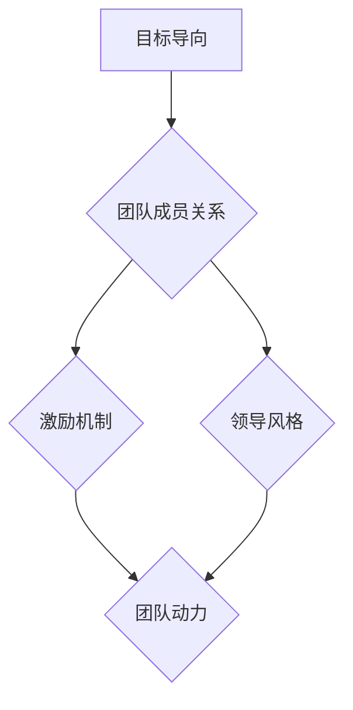

                 


### 文章标题：团队动力激发：保持高效工作状态的方法

#### 关键词：
- 团队动力
- 高效工作状态
- 团队合作
- 激发策略
- 实践方法

#### 摘要：
本文深入探讨了团队动力激发对于保持高效工作状态的重要性。通过分析团队合作的核心概念与理论基础，本文提出了激发团队动力的多种策略，包括设定明确目标、建立积极氛围、提供成长机会和增强团队凝聚力。文章还结合实际案例，详细阐述了如何在初创团队、大型企业和远程工作中激发团队动力，以实现高效工作状态的保持。最后，本文总结了最佳实践，为团队管理者提供了实用的指导。

---

### 引言：团队动力与高效工作状态的关系

在现代信息技术飞速发展的背景下，团队合作已成为企业成功的关键因素。团队动力作为团队内部驱动力的重要组成部分，直接影响着团队的工作效率和创新能力。高效工作状态是团队实现目标、应对挑战的必要条件，它不仅关系到个人职业发展的速度，更影响着整个组织的竞争力。

然而，在实际工作中，许多团队面临着动力不足、工作效率低下等问题。激发团队动力、保持高效工作状态已成为管理者面临的一大挑战。本文旨在通过系统地探讨团队动力激发的策略和实践方法，为团队管理者提供有价值的参考。

---

### 第一部分 团队动力理论

#### 1.1 团队动力定义与模型

团队动力是指推动团队成员为实现共同目标而努力工作的内在驱动力。根据心理学和管理学的理论，团队动力主要受到以下几个因素的影响：

1. **目标导向**：明确的目标是激发团队动力的基础。目标应当具有挑战性，同时要确保团队成员能够理解和接受。
2. **团队成员关系**：团队成员之间的信任、尊重和支持是激发团队动力的关键。
3. **激励机制**：适当的激励机制能够提高团队成员的积极性和工作热情。
4. **领导风格**：领导者的风格对团队动力有着重要影响。民主型、参与型领导风格能够更好地激发团队成员的主动性和创造力。

图1-1 团队动力模型



#### 1.2 团队动力来源分析

团队动力的来源多样，主要包括以下几个方面：

1. **内在动机**：个人兴趣、成就感、自我实现等内在动机是激发团队动力的重要来源。
2. **外部激励**：金钱、晋升、荣誉等外部激励同样能够有效激发团队动力。
3. **团队文化**：积极向上的团队文化能够增强团队成员的归属感和责任感，从而提高团队动力。
4. **工作环境**：良好的工作环境，如舒适的工作场所、合理的资源配置等，能够提高团队成员的工作效率和满意度。

#### 1.3 团队动力与工作满意度

团队动力与工作满意度之间存在密切的联系。研究表明，高水平的团队动力能够显著提高团队成员的工作满意度。工作满意度又反过来促进团队动力，形成良性循环。具体来说：

- **工作成就感**：团队成员在实现目标时获得的成就感是提高工作满意度的重要因素。
- **团队支持**：团队成员之间的支持和合作能够增强工作满意度。
- **工作投入**：高工作满意度能够使团队成员更加投入工作，从而提高团队动力。

#### 1.4 团队动力与工作效率

团队动力不仅影响团队成员的工作满意度，还直接影响工作效率。高水平的团队动力能够促进团队成员之间的协作，提高工作流程的效率。具体表现在：

- **团队协作**：团队成员之间的高效协作能够快速解决问题，提高工作效率。
- **创新能力**：团队动力激发能够鼓励团队成员的创新思维，为工作带来新的解决方案。
- **决策速度**：高团队动力有助于团队快速做出决策，减少决策过程中的拖延和犹豫。

---

### 第二部分 团队动力激发策略

#### 2.1 激发团队动力的方法

激发团队动力的关键在于找到适合团队的具体方法。以下是一些常见的激发团队动力的方法：

1. **设定明确的目标与期望**：明确的目标能够为团队成员指明方向，增强团队凝聚力。设定目标时，应当确保目标具有挑战性，同时是可实现的。

2. **建立积极的团队氛围**：积极的团队氛围能够增强团队成员之间的信任和合作。管理者应当鼓励开放、包容和互助的团队文化。

3. **提供成长与发展的机会**：为团队成员提供成长和发展的机会，能够激发他们的内在动机。这包括培训、职业规划和个人发展计划。

4. **增强团队凝聚力**：团队凝聚力是团队动力的基础。通过团队建设活动、共同解决问题等方式，能够增强团队凝聚力。

#### 2.2 设定明确的目标与期望

设定明确的目标是激发团队动力的第一步。具体策略包括：

1. **目标具体化**：目标应当是具体的、量化的，能够被团队成员理解和接受。
2. **目标挑战性**：目标应当具有一定的挑战性，以激发团队成员的积极性和创造力。
3. **目标可实现性**：目标应当是可实现的，避免设定过于理想化的目标。

伪代码示例：

```python
def set_goal(team_members, goal):
    if is_specific(goal) and is_challenging(goal) and is_achievable(goal):
        communicate_goal_to(team_members, goal)
        return True
    else:
        return False

def is_specific(goal):
    return "specific" in goal.lower()

def is_challenging(goal):
    return "challenging" in goal.lower()

def is_achievable(goal):
    return "achievable" in goal.lower()

def communicate_goal_to(team_members, goal):
    # 实现具体沟通机制，如会议、邮件等
```

#### 2.3 建立积极的团队氛围

建立积极的团队氛围需要从多个方面入手，包括：

1. **鼓励开放沟通**：团队成员应当能够自由地表达自己的想法和意见，而不会受到打压。
2. **建立信任**：通过共同完成任务和经历困难，团队成员之间的信任能够逐渐建立。
3. **尊重多样性**：尊重团队成员的不同背景、观点和技能，能够增强团队的凝聚力和创造力。

#### 2.4 提供成长与发展的机会

提供成长与发展的机会能够有效激发团队动力。具体策略包括：

1. **培训计划**：定期为团队成员提供培训，提高他们的专业技能和管理能力。
2. **职业规划**：帮助团队成员制定个人职业规划，明确他们的职业目标和实现路径。
3. **激励措施**：通过晋升、奖金和荣誉等方式激励团队成员不断追求卓越。

#### 2.5 增强团队凝聚力

增强团队凝聚力是激发团队动力的基础。以下是一些增强团队凝聚力的方法：

1. **团队建设活动**：通过团队建设活动，如团队拓展训练、户外运动等，增强团队成员之间的互动和合作。
2. **共同解决问题**：在面对挑战和问题时，鼓励团队成员共同参与，共同寻找解决方案。
3. **庆祝成就**：及时庆祝团队的成就，增强团队成员的归属感和荣誉感。

---

### 第三部分 团队动力激发实践

#### 3.1 团队动力激发案例分析

在本部分，我们将通过实际案例来探讨如何在不同类型的团队中激发团队动力。以下是一些典型案例：

#### 案例一：初创团队的团队动力激发

初创团队往往面临资源有限、目标不确定等挑战。激发初创团队的团队动力，关键在于：

1. **明确愿景和使命**：初创团队应当明确自己的愿景和使命，为团队成员提供明确的方向。
2. **共同经历挑战**：通过共同经历困难和挑战，初创团队成员之间的信任和凝聚力会得到增强。
3. **提供股权激励**：为团队成员提供股权激励，使他们能够分享公司的成功，从而增强团队动力。

#### 案例二：大型企业的团队动力激发

大型企业通常拥有更多的资源和稳定的业务，但同时也面临内部沟通不畅、员工积极性不高的问题。以下是激发大型企业团队动力的策略：

1. **建立沟通渠道**：通过定期的员工会议、内部论坛等方式，建立有效的沟通渠道。
2. **提供职业发展机会**：为员工提供多种职业发展路径，使他们能够看到自己在企业中的成长空间。
3. **实施绩效考核**：通过绩效考核，激发员工的工作积极性和竞争意识。

#### 案例三：远程工作团队的团队动力激发

随着远程工作的普及，如何激发远程工作团队的团队动力成为新的挑战。以下是一些策略：

1. **定期线上会议**：通过定期的线上会议，保持团队成员之间的联系和沟通。
2. **灵活的工作时间**：为远程工作者提供灵活的工作时间，以适应他们的生活需求。
3. **技术工具的支持**：利用各种技术工具，如即时通讯、项目管理软件等，提高远程团队的协作效率。

---

### 第四部分 保持高效工作状态

#### 4.1 高效工作状态的评估方法

为了保持高效工作状态，首先需要评估当前的工作状态。以下是一些常用的评估方法：

1. **工作效率评估**：通过衡量完成任务的效率和速度，评估工作状态。
2. **工作满意度调查**：通过员工满意度调查，了解团队成员的工作满意度，从而找出潜在的问题。
3. **疲劳度评估**：通过疲劳度评估，了解团队成员的身体和心理状态，确保他们能够在良好的状态下工作。

#### 4.2 高效工作习惯的培养

培养高效工作习惯是保持高效工作状态的关键。以下是一些建议：

1. **时间管理**：通过时间管理工具，如待办事项列表、时间追踪软件等，合理安排工作时间。
2. **专注力训练**：通过专注力训练，提高工作效率，减少分心。
3. **定期休息**：合理安排休息时间，避免过度劳累，保持良好的工作状态。

#### 4.3 高效工作环境的营造

营造高效的工作环境对于保持高效工作状态至关重要。以下是一些策略：

1. **物理环境优化**：提供一个舒适、安静的办公环境，提高工作效率。
2. **技术支持**：确保团队成员能够快速访问所需的资源和工具。
3. **心理支持**：提供心理支持，帮助团队成员应对工作中的压力和挑战。

#### 4.4 高效工作与工作与生活的平衡

保持高效工作与工作与生活的平衡对于团队成员的健康和幸福感至关重要。以下是一些建议：

1. **设定工作时间**：明确工作时间和休息时间，避免工作过度。
2. **家庭生活支持**：为团队成员提供家庭生活支持，如灵活的工作时间安排、家庭活动安排等。
3. **健康生活方式**：鼓励团队成员保持健康的生活方式，如定期锻炼、合理饮食等。

---

### 第五部分 案例研究

在本部分，我们将通过具体案例来探讨如何在不同的工作场景中保持高效工作状态。以下是一些典型案例：

#### 案例一：如何激发初创团队的团队动力

初创团队面临的挑战通常包括资源有限、目标不确定等。通过以下策略，可以有效激发初创团队的团队动力：

1. **明确愿景和使命**：初创团队应当明确自己的愿景和使命，为团队成员提供明确的方向。
2. **共同经历挑战**：通过共同经历困难和挑战，初创团队成员之间的信任和凝聚力会得到增强。
3. **提供股权激励**：为团队成员提供股权激励，使他们能够分享公司的成功，从而增强团队动力。

#### 案例二：大型企业如何保持团队高效工作状态

大型企业通常拥有更多的资源和稳定的业务，但同时也面临内部沟通不畅、员工积极性不高的问题。以下是一些策略来保持团队高效工作状态：

1. **建立沟通渠道**：通过定期的员工会议、内部论坛等方式，建立有效的沟通渠道。
2. **提供职业发展机会**：为员工提供多种职业发展路径，使他们能够看到自己在企业中的成长空间。
3. **实施绩效考核**：通过绩效考核，激发员工的工作积极性和竞争意识。

#### 案例三：远程工作团队的团队动力激发

随着远程工作的普及，如何激发远程工作团队的团队动力成为新的挑战。以下是一些策略：

1. **定期线上会议**：通过定期的线上会议，保持团队成员之间的联系和沟通。
2. **灵活的工作时间**：为远程工作者提供灵活的工作时间，以适应他们的生活需求。
3. **技术工具的支持**：利用各种技术工具，如即时通讯、项目管理软件等，提高远程团队的协作效率。

---

### 第六部分 总结与展望

#### 6.1 团队动力激发与高效工作状态的关系

团队动力激发是保持高效工作状态的关键。通过激发团队动力，可以提高团队成员的工作满意度、工作效率和创新能力，从而实现高效工作状态的保持。同时，高效工作状态又能反过来促进团队动力的提升，形成良性循环。

#### 6.2 未来团队动力激发的趋势

随着信息技术的发展，团队动力激发的方法和工具也在不断演变。未来团队动力激发的趋势包括：

1. **数字化管理**：利用大数据和人工智能技术，实现团队动力的精准管理和优化。
2. **个性化激励**：根据团队成员的特点和需求，提供个性化的激励方案。
3. **远程团队管理**：远程团队管理工具的普及，将使团队动力激发更具灵活性。

#### 6.3 激发团队动力与高效工作状态的实践建议

对于团队管理者，以下是一些激发团队动力、保持高效工作状态的实践建议：

1. **明确目标**：设定明确、具有挑战性的目标，确保团队成员能够理解和接受。
2. **建立积极氛围**：鼓励开放沟通、尊重多样性和支持合作，营造积极的团队氛围。
3. **提供成长机会**：为团队成员提供培训、职业规划和个人发展机会。
4. **加强团队建设**：通过团队建设活动、共同解决问题等方式，增强团队凝聚力。
5. **关注工作与生活平衡**：为团队成员提供灵活的工作时间安排和家庭生活支持。

---

### 作者信息

作者：AI天才研究院/AI Genius Institute & 禅与计算机程序设计艺术 /Zen And The Art of Computer Programming

---

以上是《团队动力激发：保持高效工作状态的方法》的详细目录大纲。每个章节都将详细探讨相关主题，并提供具体的策略和实践方法，旨在帮助团队管理者有效地激发团队动力，实现高效工作状态的保持。接下来，我们将逐个章节深入探讨这些主题，为读者提供全面、实用的指导。

