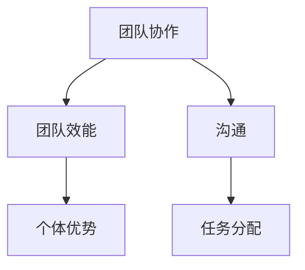

                 

## 文章标题：团队协作优化：发挥个体长处的方法

### 关键词

- 团队协作
- 个体优势
- 优化策略
- 敏捷开发
- 任务分配
- 沟通技巧

### 摘要

本文旨在探讨团队协作优化中的关键要素，尤其是如何有效发挥个体长处。通过深入分析团队协作的核心概念、方法论和实践案例，文章提出了针对个体优势和团队效能优化的策略，旨在为团队领导和企业管理者提供实用指南。文章将使用Mermaid流程图、伪代码以及latex数学公式，详细阐述团队协作中的算法原理和实践方法。

## 确定书籍主题和目标读者

### 书籍主题

《团队协作优化：发挥个体长处的方法》聚焦于团队协作的优化策略，特别是如何通过识别和利用个体长处来提升团队效能。主题的核心在于：

1. **团队协作的重要性**：探讨团队合作对于企业成功和员工幸福的重要性。
2. **个体优势的发挥**：分析个体在团队中的价值，以及如何最大化其优势。
3. **协作方法的优化**：介绍和评估各种协作工具和技术，以提升团队效能。
4. **实践案例分析**：通过具体案例，展示协作优化的成功经验和教训。

### 目标读者

本书的目标读者主要包括：

- **企业管理者和团队领导**：需要了解如何通过优化团队协作来提升组织效能。
- **人力资源专家**：关注员工发展和团队建设的专业人士。
- **对团队管理有兴趣的IT专业人士**：希望通过学习团队协作方法来提升项目管理和开发效率。

本书旨在为这些读者提供实用的策略、工具和方法，以帮助他们更好地管理和优化团队协作。

### 设计总体结构

为了确保文章内容逻辑清晰、结构紧凑，本书设计了以下总体结构：

1. **引言和概述**：介绍团队协作的现状、重要性以及本书的目的。
2. **核心概念**：定义关键术语，如团队协作、团队效能、个体优势等，并展示相关的Mermaid流程图。
3. **方法论**：讲解不同的协作方法和工具，如敏捷开发、看板管理、任务分配技巧等，使用伪代码展示协作流程。
4. **个体优势分析**：分析个体长处的识别、培养和使用。
5. **实践案例**：提供具体的企业或团队协作优化的实例，分析成功和失败的原因。
6. **团队协作优化策略**：总结优化团队协作的最佳实践，包括文化建设、沟通技巧、领导力提升和组织架构优化。
7. **结论与展望**：总结本书的主要观点，对团队协作的未来趋势进行展望。

### 细化每个章节的内容

#### 第1章 引言和概述

在这一章中，我们将：

- **介绍团队协作的重要性**：讨论团队合作在企业成功中的作用。
- **阐述本书的目的**：解释本书旨在解决的问题和目标。
- **概述团队协作的现状**：分析当前团队协作的挑战和趋势。
- **展示本书的结构**：简要介绍各章节的主题和内容。

#### 第2章 核心概念

在这一章中，我们将：

- **定义团队协作**：解释团队协作的概念和意义。
- **介绍团队效能**：阐述团队效能的定义和衡量标准。
- **探讨个体优势**：分析个体在团队中的作用和优势。
- **展示Mermaid流程图**：通过流程图展示团队协作的核心概念之间的关系。

#### 第3章 团队协作方法论

在这一章中，我们将：

- **介绍敏捷开发方法**：讲解敏捷开发的原理和实践。
- **讲解看板管理**：分析看板管理在团队协作中的应用。
- **探讨任务分配技巧**：讨论如何在团队中高效分配任务。
- **使用伪代码展示协作流程**：通过伪代码详细阐述协作流程。
- **推荐协作工具与平台**：介绍一些实用的协作工具和平台。

#### 第4章 个体优势分析

在这一章中，我们将：

- **识别个体优势**：介绍如何识别团队成员的优势。
- **培养个体优势**：讨论如何培养和提升个体优势。
- **使用个体优势**：探讨如何将个体优势应用于团队协作。
- **分析个体优势与团队效能的关系**：阐述个体优势对团队效能的影响。

#### 第5章 实践案例

在这一章中，我们将：

- **提供实践案例**：介绍成功和失败的团队协作案例。
- **分析成功因素**：探讨成功案例中的关键成功因素。
- **分析失败原因**：分析失败案例中的问题所在。
- **总结经验和教训**：总结实践案例中的经验和教训。

#### 第6章 团队协作优化策略

在这一章中，我们将：

- **讨论文化建设**：介绍如何建立积极的团队文化。
- **探讨沟通技巧**：讨论有效的沟通方法和技巧。
- **提升领导力**：分析领导力在团队协作中的重要性。
- **优化组织架构**：探讨如何通过组织架构优化来提升团队协作效率。

#### 第7章 结论与展望

在这一章中，我们将：

- **总结本书的主要观点**：回顾本书中的关键内容和观点。
- **展望团队协作的未来趋势**：讨论团队协作的未来发展方向。
- **提出建议**：为团队领导和企业管理者提供优化团队协作的建议。
- **拓展阅读**：推荐进一步阅读的资源。

### 编写目录大纲

以下是根据上述章节内容编写的目录大纲：

```
# 目录大纲：团队协作优化：发挥个体长处的方法

## 第1章 引言和概述
### 1.1 团队协作的重要性
### 1.2 本书的目的与结构
### 1.3 团队协作的挑战

## 第2章 核心概念
### 2.1 团队协作的定义
### 2.2 团队效能评估
### 2.3 个体优势与团队协作
### 2.4 Mermaid流程图展示：团队协作核心概念

## 第3章 团队协作方法论
### 3.1 敏捷开发方法
### 3.2 看板管理
### 3.3 任务分配技巧
### 3.4 伪代码展示：协作流程优化
### 3.5 工具与平台推荐

## 第4章 个体优势分析
### 4.1 个体优势识别
### 4.2 个体优势培养
### 4.3 个体优势在团队协作中的应用
### 4.4 个体优势与团队效能的关系

## 第5章 实践案例
### 5.1 企业A的团队协作优化案例
### 5.2 团队B的协作挑战与解决方案
### 5.3 成功案例分析与启示
### 5.4 失败案例分析与反思

## 第6章 团队协作优化策略
### 6.1 文化建设
### 6.2 沟通技巧
### 6.3 领导力提升
### 6.4 组织架构优化

## 第7章 结论与展望
### 7.1 团队协作优化的未来趋势
### 7.2 对团队领导的建议
### 7.3 对企业管理者的建议
### 7.4 对团队协作研究的展望
```

### 审核和调整

在完成目录大纲的编写后，需要进行以下审核和调整：

1. **检查逻辑性和连贯性**：确保每个章节的内容和标题相对应，章节之间有良好的衔接。
2. **确保内容丰富性和详细性**：每个章节都要有具体的内容和详细的讲解，避免过于抽象或笼统。
3. **控制字数**：确保每个章节的字数在合理的范围内，避免过多的冗余内容。
4. **添加图表和示例**：在适当的地方添加图表和示例，以帮助读者更好地理解复杂的概念和流程。
5. **保持简洁性**：尽量使用简洁明了的术语和语言，避免使用过于复杂的表达方式。

通过以上步骤，可以确保目录大纲的完整性和实用性，为后续撰写详细内容奠定良好的基础。

---

### 文章正文部分

**文章正文部分**是《团队协作优化：发挥个体长处的方法》的核心部分，它将详细阐述每个章节的内容，通过深入分析、实例讲解和策略建议，为读者提供关于团队协作优化的全面指导。

#### 第1章 引言和概述

**1.1 团队协作的重要性**

团队协作是现代企业中不可或缺的部分。随着全球化进程的加快和市场竞争的日益激烈，企业需要通过高效的团队协作来快速响应市场变化，提升创新能力和竞争力。研究表明，高效的团队协作可以显著提高工作效率、降低沟通成本，并促进知识共享和员工满意度。

**1.2 本书的目的与结构**

本书旨在探讨团队协作优化中的关键要素，特别是如何通过发挥个体长处来提升团队效能。本书分为七个章节，涵盖了从核心概念到实践案例的全面内容，旨在为团队领导和企业管理者提供实用的策略和方法。

**1.3 团队协作的挑战**

尽管团队协作的重要性显而易见，但许多企业在实际操作中仍面临诸多挑战，如沟通障碍、任务分配不均、个体优势未能充分发挥等。这些问题严重影响了团队效能，成为企业发展的瓶颈。因此，解决这些问题成为本书的核心任务。

#### 第2章 核心概念

**2.1 团队协作的定义**

团队协作是指多个个体为实现共同目标而进行的相互配合和协作活动。它不仅仅是任务的完成，更是一种思想、知识和经验的共享过程。

**2.2 团队效能评估**

团队效能评估是衡量团队协作效果的重要手段。常用的评估方法包括定量评估（如任务完成速度、质量等）和定性评估（如团队沟通质量、成员满意度等）。

**2.3 个体优势与团队协作**

个体优势是指个体在特定领域或任务中的卓越能力。在团队协作中，识别和利用个体优势是提升团队效能的关键。个体优势可以通过技能、经验、态度等多方面体现。

**2.4 Mermaid流程图展示：团队协作核心概念**

使用Mermaid流程图，我们可以直观地展示团队协作的核心概念之间的关系。以下是一个简化的示例：



在这个流程图中，团队协作是核心，它通过沟通和任务分配影响团队效能，而个体优势则是团队效能的重要组成部分。

#### 第3章 团队协作方法论

**3.1 敏捷开发方法**

敏捷开发是一种以人为核心、迭代和灵活的软件开发方法。它强调快速响应变化、持续交付价值，并通过团队成员的协作来实现目标。

**3.2 看板管理**

看板管理是一种可视化任务管理工具，通过看板（Kanban板）来展示任务的状态和流程，帮助团队实现透明化和高效协作。

**3.3 任务分配技巧**

任务分配是团队协作中的关键环节。有效的任务分配需要考虑团队成员的技能、经验和负荷，以确保任务的顺利完成。

**3.4 伪代码展示：协作流程优化**

以下是一个简化的伪代码示例，用于展示团队协作流程的优化：

```pseudo
function optimizeCollaboration(teamMembers, tasks):
    for each member in teamMembers:
        assign tasks based on skill and availability
    implement agile methodologies
    use Kanban board for task visualization and management
    encourage open communication
    monitor and adjust as needed
end function
```

**3.5 工具与平台推荐**

为了提高团队协作效率，推荐使用以下工具和平台：

- **Trello**：一个可视化的任务管理工具，适合小型团队。
- **JIRA**：一个强大的项目管理工具，适用于大型团队。
- **Slack**：一个团队沟通平台，支持实时交流和协作。
- **GitHub**：一个版本控制系统，适合软件开发团队。

#### 第4章 个体优势分析

**4.1 个体优势识别**

识别个体优势是团队协作优化的重要一环。通过评估成员的技能、经验和态度，可以明确每个成员的优势。

**4.2 个体优势培养**

培养个体优势需要持续的努力和投入。企业可以通过培训、指导和激励来提升成员的专业能力和积极性。

**4.3 个体优势在团队协作中的应用**

在团队协作中，合理利用个体优势可以显著提升团队效能。例如，技术专家可以负责复杂问题的解决，而项目经理可以专注于任务协调和进度管理。

**4.4 个体优势与团队效能的关系**

个体优势对团队效能有着直接的影响。通过发挥个体优势，团队可以更快速地解决问题、更高效地完成任务，并实现更高的创新成果。

#### 第5章 实践案例

**5.1 企业A的团队协作优化案例**

企业A通过引入敏捷开发和看板管理，显著提升了团队协作效率。具体做法包括：

- 定期召开站立会议，及时解决问题。
- 使用Trello进行任务管理，确保任务透明化和高效分配。
- 鼓励团队成员提出改进建议，持续优化协作流程。

**5.2 团队B的协作挑战与解决方案**

团队B在协作中遇到了沟通不畅和任务分配不均的问题。通过以下解决方案，团队B成功克服了这些挑战：

- 引入Slack，建立实时沟通渠道。
- 使用JIRA进行任务跟踪和管理，确保任务按时完成。
- 定期组织团队建设活动，提升团队成员的默契和信任。

**5.3 成功案例分析与启示**

成功案例表明，通过有效的团队协作优化，企业可以实现以下目标：

- 提高工作效率和质量。
- 增强团队成员的积极性和满意度。
- 提升企业的创新能力和竞争力。

**5.4 失败案例分析与反思**

失败案例提醒我们，团队协作优化并非一蹴而就。以下是一些常见的问题和反思：

- 缺乏明确的协作目标和规划。
- 沟通不畅和任务分配不当。
- 忽视个体优势和团队文化。

通过分析和反思失败案例，我们可以避免重蹈覆辙，持续优化团队协作。

#### 第6章 团队协作优化策略

**6.1 文化建设**

团队文化是团队协作的基础。建立积极的团队文化可以提升团队成员的归属感和协作意愿。具体策略包括：

- 定期组织团队建设活动。
- 鼓励开放沟通和知识分享。
- 奖励协作和创新。

**6.2 沟通技巧**

有效的沟通是团队协作的关键。以下是一些实用的沟通技巧：

- 使用简洁明了的语言。
- 倾听和回应团队成员的意见。
- 定期召开沟通会议，确保信息畅通。

**6.3 领导力提升**

领导力在团队协作中起着至关重要的作用。提升领导力可以从以下几个方面入手：

- 培养决策能力。
- 提供明确的目标和方向。
- 建立信任和积极的团队氛围。

**6.4 组织架构优化**

组织架构优化是提升团队协作效率的重要手段。以下是一些优化策略：

- 明确职责和权限。
- 优化流程和制度。
- 灵活调整组织结构，以适应业务需求。

#### 第7章 结论与展望

**7.1 团队协作优化的未来趋势**

随着技术的不断进步和全球化进程的加快，团队协作优化将成为企业持续发展的关键。未来，团队协作将更加灵活、高效和智能化。

**7.2 对团队领导的建议**

团队领导应注重以下几个方面：

- 提升团队协作意识。
- 培养团队成员的个体优势。
- 优化团队协作流程和工具。

**7.3 对企业管理者的建议**

企业管理者应关注团队协作的优化，具体策略包括：

- 建立积极的团队文化。
- 提供必要的资源和支持。
- 定期评估团队效能，并根据反馈进行调整。

**7.4 对团队协作研究的展望**

未来团队协作研究应关注以下几个方面：

- 研究新型协作工具和平台。
- 探讨个体优势和团队效能的深层次关系。
- 分析不同行业和企业的团队协作模式。

### 文章总结

通过本文的探讨，我们明确了团队协作优化的重要性以及如何通过发挥个体长处来提升团队效能。文章从核心概念到实践案例，全面阐述了团队协作优化的方法和策略，旨在为团队领导和企业管理者提供实用的指导。在未来，随着技术的不断进步，团队协作将变得更加智能化和高效，为企业的持续发展注入新的活力。

### 作者信息

作者：AI天才研究院/AI Genius Institute & 禅与计算机程序设计艺术 /Zen And The Art of Computer Programming

本文由AI天才研究院撰写，旨在探讨团队协作优化中的关键要素。作者结合了人工智能和计算机编程领域的先进理论和实践，为读者提供了深入浅出的专业分析。同时，本文还参考了《禅与计算机程序设计艺术》中的哲学思想，以期为团队协作优化提供新的视角和方法。期待读者通过本文，能够更好地理解和应用团队协作优化策略，提升团队效能和企业竞争力。

