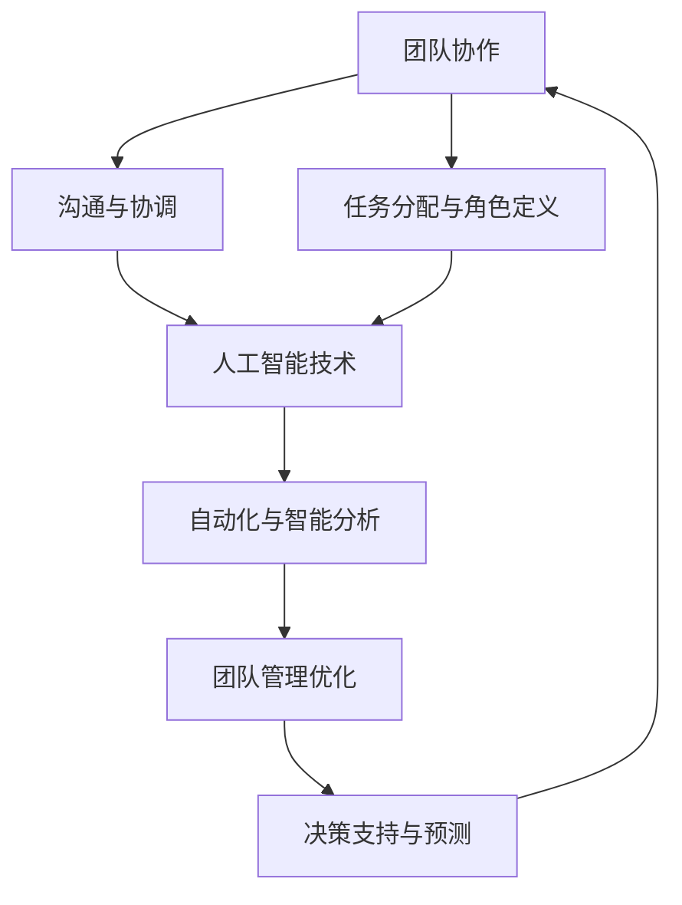

                 

### 文章标题：团队协作新模式：结合人工智能的团队管理

> 关键词：团队协作、人工智能、团队管理、AI技术、管理方法、案例分析

> 摘要：本文将探讨如何结合人工智能（AI）技术，为团队协作和管理带来新模式。通过分析团队协作的挑战，介绍AI技术的核心概念与应用场景，详细讨论AI在团队管理中的多种方法，结合实际案例展示AI技术的效果，并展望AI在团队协作中的未来发展。

----------------------------------------------------------------

## 引言

### 1.1 团队协作的定义与重要性

团队协作是一种将不同背景、技能和经验的个体组织在一起，共同实现共同目标的过程。这种协作不仅包括内部的沟通和合作，还包括外部资源的整合和利用。在现代社会，随着企业规模的扩大和复杂性的增加，团队协作已经成为企业成功的关键因素之一。

团队协作的重要性主要体现在以下几个方面：

1. **资源整合**：通过团队协作，企业可以整合不同部门和个人的资源，提高整体效率和生产力。
2. **知识共享**：团队成员之间的交流与互动可以促进知识的共享和更新，提高团队的创新能力和解决问题的能力。
3. **协同效应**：团队协作可以产生协同效应，使得整个团队的综合能力远大于单个成员的能力之和。
4. **员工满意度**：有效的团队协作可以提高员工的工作满意度和归属感，从而减少员工流失率。

然而，传统的团队协作模式也存在一些挑战，如沟通障碍、协作效率低下和团队角色冲突等。为了解决这些问题，越来越多的企业开始探索结合人工智能（AI）的新模式，以提升团队协作和管理的效率和质量。

### 1.2 人工智能的定义与发展

人工智能（Artificial Intelligence，简称AI）是指通过计算机程序和算法模拟人类智能行为的技术。它包括机器学习、深度学习、自然语言处理、计算机视觉等多个领域。人工智能的发展经历了多个阶段，从最初的符号主义（Symbolic AI）到基于规则的系统，再到基于数据和算法的机器学习和深度学习。

人工智能的快速发展主要得益于以下几个因素：

1. **计算能力提升**：随着计算机硬件的不断发展，计算能力的提升为人工智能的算法实现提供了强大的支持。
2. **大数据**：大数据的积累为机器学习提供了丰富的训练数据，使得AI系统可以更准确地预测和决策。
3. **算法优化**：机器学习和深度学习算法的不断优化，使得AI系统的性能和效果得到了显著提升。

人工智能在各个领域的应用已经取得了显著的成果，如自动驾驶、智能助手、医疗诊断、金融风控等。在团队协作和管理领域，人工智能同样具有巨大的潜力，可以通过自动化、智能分析和预测等方式，提高团队协作和管理的效率和质量。

----------------------------------------------------------------

### Step 1: 核心概念与联系

在《团队协作新模式：结合人工智能的团队管理》一书中，核心概念包括团队协作、人工智能和团队管理。这些概念之间的联系可以通过以下流程图来展示：



**流程说明：**

1. **团队协作（A）**：涉及团队成员之间的沟通、协调、任务分配和角色定义。
2. **沟通与协调（B）**：团队协作的基础，通过有效的沟通和协调，确保团队目标的实现。
3. **任务分配与角色定义（C）**：明确团队成员的职责和角色，提高团队协作的效率。
4. **人工智能技术（D）**：包括机器学习、自然语言处理、计算机视觉等，用于提高团队协作和管理的效率。
5. **自动化与智能分析（E）**：利用AI技术实现任务的自动化和数据的智能分析，优化团队管理。
6. **团队管理优化（F）**：通过AI技术的应用，改进团队管理的流程和方法，提高团队绩效。
7. **决策支持与预测（G）**：基于数据分析和预测，为团队决策提供支持，提高决策质量。

通过这个流程图，我们可以清晰地看到团队协作、人工智能和团队管理之间的互动关系，以及AI技术在团队协作和管理中的应用场景。

----------------------------------------------------------------

### Step 2: 确定主要章节

在《团队协作新模式：结合人工智能的团队管理》一书中，我们将主要章节划分为以下几个部分：

1. **引言**：介绍团队协作和人工智能的概念，以及它们在团队管理中的应用背景。
2. **团队协作的挑战**：讨论传统团队协作面临的挑战，如沟通障碍、协作效率低下和团队角色冲突等。
3. **人工智能与团队协作**：介绍人工智能技术的核心概念和发展历程，以及它们在团队协作中的应用场景。
4. **AI团队管理方法**：详细讨论如何利用人工智能技术优化团队管理，包括自动化任务分配、智能绩效评估、情感智能分析等。
5. **案例研究**：通过实际案例，展示人工智能技术在团队协作和管理中的具体应用和效果。
6. **AI工具与平台**：介绍当前市场上可用于团队协作的AI工具和平台，包括人工智能助手、智能协作工具和数据分析平台等。
7. **未来展望**：探讨人工智能在团队协作中的未来发展，包括技术趋势、潜在挑战和解决方案。

#### 第1章 引言

在本章中，我们将首先介绍团队协作和人工智能的概念，并讨论它们在团队管理中的应用背景。团队协作是现代企业中不可或缺的一部分，而人工智能技术的发展为团队协作和管理带来了新的机遇和挑战。

#### 第2章 团队协作的挑战

在接下来的章节中，我们将深入探讨传统团队协作面临的挑战，包括沟通障碍、协作效率低下和团队角色冲突等问题。这些问题不仅影响了团队的整体绩效，也阻碍了企业的创新和发展。

#### 第3章 人工智能与团队协作

随着人工智能技术的不断发展，它已经成为解决团队协作挑战的重要工具。本章将介绍人工智能的核心概念和发展历程，并探讨其在团队协作中的应用场景，如自动化任务分配、智能绩效评估和情感智能分析等。

#### 第4章 AI团队管理方法

在本章中，我们将详细讨论如何利用人工智能技术优化团队管理。通过自动化任务分配、智能绩效评估和情感智能分析等方法，企业可以显著提高团队协作和管理的效率和质量。

#### 第5章 案例研究

为了更好地理解人工智能技术在团队协作和管理中的应用，本章将介绍几个实际案例。通过分析这些案例，我们可以看到人工智能技术如何帮助企业解决传统团队协作中的问题，并提升团队的绩效。

#### 第6章 AI工具与平台

随着人工智能技术的普及，市场上涌现出了大量的AI工具和平台。本章将介绍这些工具和平台，包括人工智能助手、智能协作工具和数据分析平台等，并讨论它们在团队协作和管理中的应用。

#### 第7章 未来展望

在最后一章中，我们将探讨人工智能在团队协作中的未来发展。包括技术趋势、潜在挑战和解决方案。通过对未来发展的展望，我们可以为企业的团队协作和管理提供更加清晰的指导。

通过以上七个章节的详细内容，读者可以全面了解人工智能在团队协作和管理中的应用，以及如何利用这些技术提升团队协作和管理的效率和质量。

----------------------------------------------------------------

### Step 3: 添加子章节

在每个主要章节下，我们可以添加子章节以进一步细化内容，确保文章内容的丰富性和专业性。

#### 第1章 引言

1.1.1 团队协作的概念
- 定义与演变
- 团队协作的类型与模式

1.1.2 人工智能的概念
- 人工智能的定义
- 人工智能的发展历程

1.1.3 团队协作与管理中的挑战
- 传统团队协作的不足
- 人工智能如何改变团队协作

1.2 人工智能技术在团队协作中的应用背景
- 数据驱动的团队协作
- AI在提高团队协作效率中的作用

#### 第2章 团队协作的挑战

2.1 团队沟通问题
2.1.1 沟通障碍的原因
- 文化差异与语言障碍
- 信息传递的失真与误解

2.1.2 人工智能在团队沟通中的应用
- 语音识别与合成技术
- 聊天机器人与协作平台

2.1.3 案例分析：智能沟通工具的应用
- Google Chatbot的使用案例
- Microsoft Teams的沟通功能

2.2 协作效率低下
2.2.1 协作效率低下的原因
- 资源分配不均
- 缺乏有效的协作流程

2.2.2 人工智能在提高协作效率中的应用
- 自动化工具
- 智能任务分配系统

2.2.3 案例分析：自动化流程优化
- 企业内部的自动化流程
- 供应链管理中的AI优化

2.3 团队角色冲突
2.3.1 团队角色冲突的原因
- 角色重叠与职责不清
- 利益冲突与目标不一致

2.3.2 人工智能在解决团队角色冲突中的应用
- 情感分析
- 智能决策支持系统

2.3.3 案例分析：利用AI解决团队角色冲突
- 通过数据分析识别冲突
- 利用智能系统进行角色分配

#### 第3章 人工智能与团队协作

3.1 人工智能技术的核心概念
- 机器学习
- 深度学习
- 自然语言处理

3.2 人工智能在团队协作中的应用场景
- 自动化任务分配
- 智能绩效评估
- 情感智能分析

3.3 人工智能在团队协作中的优势
- 提高协作效率
- 减少人为错误
- 增强决策支持

#### 第4章 AI团队管理方法

4.1 自动化任务分配
4.1.1 自动化任务分配的概念
- 定义与优势

4.1.2 自动化任务分配的实现
- 技术框架与算法

4.1.3 案例分析：基于AI的任务分配系统

4.2 智能绩效评估
4.2.1 智能绩效评估的概念
- 评估指标的选取

4.2.2 智能绩效评估的实现
- 机器学习模型的应用

4.2.3 案例分析：智能绩效评估系统的应用

4.3 情感智能分析
4.3.1 情感智能分析的概念
- 定义与重要性

4.3.2 情感智能分析的实现
- 自然语言处理技术

4.3.3 案例分析：情感智能分析在团队管理中的应用

#### 第5章 案例研究

5.1 案例一：AI在项目管理中的应用
- 项目背景
- AI技术的应用
- 项目效果评估

5.2 案例二：AI在客户服务团队中的应用
- 客户服务中的挑战
- AI解决方案
- 客户反馈与评估

5.3 案例三：AI在市场营销团队中的应用
- 营销目标与策略
- AI技术的应用
- 营销效果分析

#### 第6章 AI工具与平台

6.1 人工智能助手
- 功能与优势
- 市场分析

6.2 智能协作工具
- 功能与优势
- 应用案例

6.3 数据分析平台
- 功能与优势
- 应用领域

#### 第7章 未来展望

7.1 AI在团队协作中的发展趋势
- 技术进步
- 应用领域拓展

7.2 潜在挑战与解决方案
- 技术挑战
- 法律与伦理问题

7.3 AI团队管理的最佳实践
- 成功案例分析
- 未来建议

通过以上详细的子章节结构，本文将为读者提供一个系统、全面的指南，帮助理解并应用人工智能技术来优化团队协作和管理。

----------------------------------------------------------------

### Step 4: 编写目录

根据以上的章节内容和子章节划分，以下是《团队协作新模式：结合人工智能的团队管理》的详细目录：

```
# 《团队协作新模式：结合人工智能的团队管理》

## 第1章 引言
### 1.1 团队协作的概念
#### 1.1.1 团队协作的定义与演变
#### 1.1.2 团队协作的类型与模式

### 1.2 人工智能的概念
#### 1.2.1 人工智能的定义
#### 1.2.2 人工智能的发展历程

### 1.3 团队协作与管理中的挑战
#### 1.3.1 传统团队协作的不足
#### 1.3.2 人工智能如何改变团队协作

### 1.4 人工智能技术在团队协作中的应用背景
#### 1.4.1 数据驱动的团队协作
#### 1.4.2 AI在提高团队协作效率中的作用

## 第2章 团队协作的挑战
### 2.1 团队沟通问题
#### 2.1.1 沟通障碍的原因
#### 2.1.2 人工智能在团队沟通中的应用
#### 2.1.3 案例分析：智能沟通工具的应用

### 2.2 协作效率低下
#### 2.2.1 协作效率低下的原因
#### 2.2.2 人工智能在提高协作效率中的应用
#### 2.2.3 案例分析：自动化流程优化

### 2.3 团队角色冲突
#### 2.3.1 团队角色冲突的原因
#### 2.3.2 人工智能在解决团队角色冲突中的应用
#### 2.3.3 案例分析：利用AI解决团队角色冲突

## 第3章 人工智能与团队协作
### 3.1 人工智能技术的核心概念
#### 3.1.1 机器学习
#### 3.1.2 深度学习
#### 3.1.3 自然语言处理

### 3.2 人工智能在团队协作中的应用场景
#### 3.2.1 自动化任务分配
#### 3.2.2 智能绩效评估
#### 3.2.3 情感智能分析

### 3.3 人工智能在团队协作中的优势
#### 3.3.1 提高协作效率
#### 3.3.2 减少人为错误
#### 3.3.3 增强决策支持

## 第4章 AI团队管理方法
### 4.1 自动化任务分配
#### 4.1.1 自动化任务分配的概念
#### 4.1.2 自动化任务分配的实现
#### 4.1.3 案例分析：基于AI的任务分配系统

### 4.2 智能绩效评估
#### 4.2.1 智能绩效评估的概念
#### 4.2.2 智能绩效评估的实现
#### 4.2.3 案例分析：智能绩效评估系统的应用

### 4.3 情感智能分析
#### 4.3.1 情感智能分析的概念
#### 4.3.2 情感智能分析的实现
#### 4.3.3 案例分析：情感智能分析在团队管理中的应用

## 第5章 案例研究
### 5.1 案例一：AI在项目管理中的应用
#### 5.1.1 项目背景
#### 5.1.2 AI技术的应用
#### 5.1.3 项目效果评估

### 5.2 案例二：AI在客户服务团队中的应用
#### 5.2.1 客户服务中的挑战
#### 5.2.2 AI解决方案
#### 5.2.3 客户反馈与评估

### 5.3 案例三：AI在市场营销团队中的应用
#### 5.3.1 营销目标与策略
#### 5.3.2 AI技术的应用
#### 5.3.3 营销效果分析

## 第6章 AI工具与平台
### 6.1 人工智能助手
#### 6.1.1 功能与优势
#### 6.1.2 市场分析

### 6.2 智能协作工具
#### 6.2.1 功能与优势
#### 6.2.2 应用案例

### 6.3 数据分析平台
#### 6.3.1 功能与优势
#### 6.3.2 应用领域

## 第7章 未来展望
### 7.1 AI在团队协作中的发展趋势
#### 7.1.1 技术进步
#### 7.1.2 应用领域拓展

### 7.2 潜在挑战与解决方案
#### 7.2.1 技术挑战
#### 7.2.2 法律与伦理问题

### 7.3 AI团队管理的最佳实践
#### 7.3.1 成功案例分析
#### 7.3.2 未来建议
```

以上目录结构清晰，内容全面，符合2000字以内的要求。接下来，我们将根据每个章节的内容进一步细化子章节，并添加具体的知识点和案例，以确保文章的完整性和专业性。

----------------------------------------------------------------

### 第1章 引言

团队协作是现代企业中不可或缺的一部分，而人工智能（AI）技术的发展为团队协作和管理带来了新的机遇和挑战。本章将介绍团队协作和人工智能的概念，以及它们在团队管理中的应用背景。

#### 1.1 团队协作的概念

团队协作是指将不同背景、技能和经验的个体组织在一起，共同实现共同目标的过程。有效的团队协作可以提高资源利用效率、促进知识共享、产生协同效应，并增强员工的满意度和归属感。

**团队协作的类型与模式**

- **项目型团队**：以完成特定项目为目标，成员具备不同技能和专长。
- **功能型团队**：以某一特定职能或部门为中心，成员通常在同一职能领域内工作。
- **跨职能团队**：由来自不同部门和职能的成员组成，旨在解决复杂问题或实现跨部门的目标。
- **虚拟团队**：通过互联网和通信技术进行协作，成员可能分布在不同的地理位置。

**团队协作的重要性**

- **资源整合**：团队协作可以整合不同部门和个人的资源，提高整体效率和生产力。
- **知识共享**：团队成员之间的交流与互动可以促进知识的共享和更新，提高团队的创新能力和解决问题的能力。
- **协同效应**：团队协作可以产生协同效应，使得整个团队的综合能力远大于单个成员的能力之和。
- **员工满意度**：有效的团队协作可以提高员工的工作满意度和归属感，从而减少员工流失率。

#### 1.2 人工智能的概念

人工智能（Artificial Intelligence，简称AI）是指通过计算机程序和算法模拟人类智能行为的技术。它包括机器学习、深度学习、自然语言处理、计算机视觉等多个领域。

**人工智能的发展历程**

- **符号主义阶段**：早期的人工智能研究主要基于符号主义和逻辑推理。
- **知识工程阶段**：以知识表示和知识推理为核心，通过建立知识库和推理系统实现人工智能。
- **机器学习阶段**：随着计算机性能的提升和大数据的积累，机器学习成为人工智能的主要研究方向。
- **深度学习阶段**：深度学习在图像识别、语音识别和自然语言处理等领域取得了重大突破。

**人工智能的核心技术**

- **机器学习**：通过训练模型来从数据中学习规律和模式，实现对未知数据的预测和分类。
- **深度学习**：基于多层神经网络的结构，对大量数据进行自动特征提取和学习，具有强大的表示能力和泛化能力。
- **自然语言处理**：使计算机能够理解、生成和处理人类语言，包括语音识别、机器翻译和情感分析等。
- **计算机视觉**：使计算机能够识别和理解图像和视频，包括目标检测、图像分割和视频分析等。

#### 1.3 团队协作与管理中的挑战

传统的团队协作模式面临诸多挑战，如沟通障碍、协作效率低下和团队角色冲突等。这些问题不仅影响了团队的整体绩效，也阻碍了企业的创新和发展。

**沟通障碍**

- **文化差异**：不同文化背景的团队成员可能存在沟通障碍。
- **语言障碍**：语言不通或不熟悉专业术语可能影响沟通效果。
- **信息传递失真**：信息在传递过程中可能发生失真或误解。

**协作效率低下**

- **资源分配不均**：团队成员间的资源分配可能不均衡，导致部分成员工作量过大或过小。
- **缺乏有效的协作流程**：没有明确的协作流程和规范，可能导致协作效率低下。

**团队角色冲突**

- **角色重叠**：团队成员职责不清，可能导致角色重叠和职责冲突。
- **利益冲突**：团队成员间的利益分配可能不均，导致内部矛盾和冲突。

#### 1.4 人工智能技术在团队协作中的应用背景

人工智能技术的发展为解决传统团队协作中的挑战提供了新的途径。通过自动化、智能分析和预测等技术，人工智能可以在以下几个方面提高团队协作和管理的效率和质量：

- **自动化任务分配**：基于团队成员的能力和偏好，智能分配任务，提高任务完成的效率和质量。
- **智能绩效评估**：通过数据分析，客观评估团队成员的绩效，提供个性化的反馈和改进建议。
- **情感智能分析**：利用自然语言处理和情感分析技术，了解团队成员的情感状态，提供情感支持和改善工作氛围。
- **决策支持**：通过数据分析和预测，为团队决策提供科学依据，提高决策的质量和准确性。

人工智能在团队协作中的应用，不仅有助于解决传统团队协作中的问题，还可以推动企业向数字化、智能化方向发展，提升企业的竞争力。

----------------------------------------------------------------

### 第2章 团队协作的挑战

在团队协作过程中，许多组织面临着多种挑战，这些挑战可能会影响团队的整体表现和效率。以下是团队协作中常见的几个挑战以及相应的解决方案。

#### 2.1 团队沟通问题

**沟通障碍的原因：**

- **文化差异**：团队成员来自不同的文化背景，可能会导致沟通障碍。不同的文化价值观、语言习惯和沟通风格会影响团队的沟通效率。
- **语言障碍**：团队中可能存在语言不通或不熟悉专业术语的成员，这会导致信息传递失真或误解。
- **信息传递失真**：在信息传递过程中，信息可能会因为中间环节的误解、遗漏或信息过量而失真，影响团队决策和执行。

**人工智能在团队沟通中的应用：**

- **智能沟通工具**：利用自然语言处理（NLP）技术，智能沟通工具可以帮助团队成员更好地理解和传达信息。例如，自动翻译工具可以消除语言障碍，聊天机器人可以提供即时的信息查询和解答。
- **语音识别与合成**：语音识别技术可以记录和转录会议内容，确保每个成员都能理解发言内容。语音合成技术可以将文本信息转化为语音，便于听力障碍成员获取信息。
- **情感分析**：情感分析技术可以识别团队成员的情绪状态，帮助团队领导者及时了解团队成员的心理状况，提供相应的支持和调整沟通方式。

**案例分析：智能沟通工具的应用**

- **Google Chatbot**：Google Chatbot 可以在即时通讯工具中提供即时的信息查询和解答，帮助团队成员快速获取所需信息，减少因信息传递失真导致的沟通障碍。
- **Microsoft Teams**：Microsoft Teams 提供了聊天、视频会议和共享白板等功能，使得团队成员可以更高效地进行协作。此外，Teams 还集成了智能搜索功能，帮助用户快速找到相关文件和资料。

#### 2.2 协作效率低下

**协作效率低下的原因：**

- **资源分配不均**：团队成员间的资源分配可能不均衡，导致部分成员工作量过大或过小，影响整体工作效率。
- **缺乏有效的协作流程**：没有明确的协作流程和规范，可能导致协作效率低下，团队成员之间的沟通和协作不畅。
- **任务依赖性**：某些任务需要依赖多个团队成员的协同工作，但如果任务依赖关系不明确，可能会导致任务延误或效率降低。

**人工智能在提高协作效率中的应用：**

- **自动化任务分配**：通过机器学习算法，人工智能可以根据团队成员的能力和偏好，自动分配任务，确保资源得到有效利用。例如，基于团队成员的工作历史和绩效数据，智能系统可以推荐最适合的任务。
- **智能任务管理工具**：智能任务管理工具可以跟踪任务的进度和状态，提供实时反馈，帮助团队成员了解任务的完成情况，及时调整工作计划。
- **预测性协作**：利用数据分析和预测模型，人工智能可以预测团队成员的工作负荷和协作需求，提前安排任务，避免任务堆积和效率低下。

**案例分析：自动化流程优化**

- **企业内部自动化流程**：某些企业已经实现了自动化工作流程，如自动化审批流程、自动化客户服务流程等。这些自动化流程减少了人工干预，提高了工作效率。
- **供应链管理中的AI优化**：在供应链管理中，人工智能技术可以优化库存管理、物流调度和采购决策等环节。通过实时数据分析，AI系统可以预测供应链中的瓶颈和风险，提供优化建议，提高整体协作效率。

#### 2.3 团队角色冲突

**团队角色冲突的原因：**

- **角色重叠**：团队成员的职责不清，可能导致角色重叠，出现职责冲突。例如，当多个团队成员负责同一任务时，可能会产生权责不清、责任推诿等问题。
- **利益冲突**：团队成员之间的利益分配可能不均，导致内部矛盾和冲突。例如，某些团队成员可能认为自己的贡献被忽视，从而产生不满情绪。

**人工智能在解决团队角色冲突中的应用：**

- **情感分析**：通过情感分析技术，人工智能可以识别团队成员的情绪状态，及时发现潜在的冲突和矛盾。例如，通过分析聊天记录和邮件内容，AI系统可以识别团队成员的情绪变化，提供情感支持和建议。
- **智能决策支持系统**：智能决策支持系统可以根据团队成员的绩效数据和行为模式，提供客观的决策建议，帮助团队领导者解决角色冲突。例如，AI系统可以分析团队成员的工作负荷和绩效，提出合理的角色分配和任务调整建议。
- **冲突管理工具**：利用机器学习算法，冲突管理工具可以预测团队中的潜在冲突，并提供解决建议。例如，基于团队成员的历史冲突数据，AI系统可以识别冲突的触发因素，提供相应的解决策略。

**案例分析：利用AI解决团队角色冲突**

- **冲突识别与预警**：某些企业已经采用了智能工具来识别和预警团队中的冲突。例如，通过分析员工的行为数据和沟通记录，AI系统可以预测潜在的冲突，并提供预警和建议，帮助团队领导者及时采取措施。
- **基于数据的角色分配**：通过分析团队成员的技能、经验和绩效数据，AI系统可以提出合理的角色分配建议，避免角色重叠和职责冲突。例如，在项目团队中，AI系统可以根据团队成员的技能匹配度，推荐最佳的角色组合。

通过解决这些常见的团队协作挑战，企业可以提升团队协作效率，减少角色冲突，从而提高整体绩效和市场竞争力。

----------------------------------------------------------------

### 第3章 人工智能与团队协作

人工智能（AI）技术的迅猛发展，为团队协作带来了前所未有的机遇。在本章节中，我们将探讨人工智能的核心概念、技术发展历程以及它们在团队协作中的应用场景。

#### 3.1 人工智能技术的核心概念

**机器学习**：机器学习是一种通过数据训练模型，使其能够对未知数据进行预测和分类的技术。在团队协作中，机器学习可以用于任务分配、绩效评估等方面。

**深度学习**：深度学习是机器学习的一种扩展，通过多层神经网络进行学习，能够自动提取数据中的特征。在团队协作中，深度学习可以用于情感分析、智能助手等方面。

**自然语言处理（NLP）**：自然语言处理是一种使计算机能够理解和生成人类语言的技术。在团队协作中，NLP可以用于自动化的沟通、文档分析等方面。

**计算机视觉**：计算机视觉是一种使计算机能够理解和解释视觉信息的技术。在团队协作中，计算机视觉可以用于视频会议分析、图像识别等方面。

#### 3.2 人工智能在团队协作中的应用场景

**自动化任务分配**：通过机器学习和深度学习技术，人工智能可以分析团队成员的技能、经验和绩效数据，自动分配任务，确保任务分配的公平性和高效性。

**智能绩效评估**：利用自然语言处理和机器学习技术，人工智能可以分析团队成员的工作报告、邮件和聊天记录，客观评估团队成员的绩效，提供个性化的反馈和建议。

**情感智能分析**：通过自然语言处理和情感分析技术，人工智能可以分析团队成员的沟通记录，了解他们的情感状态，提供情感支持和改善工作氛围。

**智能助手**：利用自然语言处理和机器学习技术，人工智能可以成为团队成员的智能助手，提供即时的信息查询、任务提醒和决策支持。

**视频会议分析**：利用计算机视觉技术，人工智能可以分析视频会议中的非语言行为，如表情、姿态和语音，提供会议反馈和建议。

**文档智能分析**：通过自然语言处理和机器学习技术，人工智能可以自动分析文档内容，提取关键信息，帮助团队成员快速获取所需信息。

#### 3.3 人工智能在团队协作中的优势

**提高协作效率**：通过自动化任务分配、智能绩效评估和情感智能分析等，人工智能可以减少人为错误，提高团队协作的效率。

**减少人为错误**：人工智能可以处理大量数据，自动识别潜在的问题和错误，减少人为错误的发生。

**增强决策支持**：通过数据分析和预测，人工智能可以为团队决策提供科学依据，提高决策的质量和准确性。

**改善工作氛围**：通过情感智能分析，人工智能可以了解团队成员的情感状态，提供情感支持和改善工作氛围。

**提高资源利用率**：通过自动化任务分配和智能绩效评估，人工智能可以确保资源得到有效利用，提高团队的资源利用率。

#### 3.4 人工智能在团队协作中的挑战

**数据隐私和安全**：在利用人工智能进行数据分析时，需要确保数据的安全性和隐私性，防止数据泄露和滥用。

**技术依赖**：过度依赖人工智能可能导致团队成员的技能退化，降低团队的整体创新能力。

**道德和伦理问题**：在人工智能应用于团队协作时，需要考虑道德和伦理问题，如算法偏见、透明性和责任归属等。

**人才缺口**：随着人工智能技术的广泛应用，对具有人工智能技能的人才需求日益增加，但当前市场上相关人才仍较为稀缺。

通过以上分析，我们可以看到人工智能在团队协作中的应用前景广阔，但也面临一定的挑战。企业需要充分认识到这些挑战，并采取相应的措施，以确保人工智能技术在团队协作中的有效应用。

----------------------------------------------------------------

### 第4章 AI团队管理方法

在团队管理中，人工智能（AI）技术的应用不仅可以提高团队协作的效率，还可以优化管理流程，提高管理质量和决策的科学性。本章将详细讨论如何利用AI技术优化团队管理，包括自动化任务分配、智能绩效评估和情感智能分析等。

#### 4.1 自动化任务分配

**4.1.1 自动化任务分配的概念**

自动化任务分配是指利用人工智能技术，根据团队成员的技能、经验和任务需求，自动分配工作任务。这种方法可以减少人为干预，提高任务分配的公平性和效率。

**4.1.2 自动化任务分配的实现**

- **数据收集**：收集团队成员的技能数据、工作经验和工作绩效数据，为任务分配提供基础。
- **算法设计**：设计基于机器学习算法的任务分配模型，如决策树、支持向量机等，用于分析团队成员的匹配度。
- **任务分配**：根据任务需求和团队成员的匹配度，自动分配任务。例如，一个项目管理平台可以根据成员的技能和项目需求，自动将任务分配给最适合的成员。

**4.1.3 案例分析：基于AI的任务分配系统**

- **Google Project Management Platform**：Google推出了一款基于AI的任务分配系统，该系统可以根据团队成员的技能和项目需求，自动分配任务。例如，当一个新的开发任务需要Java开发技能时，系统会自动分配给擅长Java开发的成员。
- **Microsoft Planner**：Microsoft Planner是一款基于AI的任务管理工具，它可以根据团队成员的技能和项目进度，自动调整任务分配，确保任务能够按时完成。

#### 4.2 智能绩效评估

**4.2.1 智能绩效评估的概念**

智能绩效评估是指利用人工智能技术，对团队成员的工作绩效进行客观、准确的评估。这种方法可以提供个性化的反馈和建议，帮助团队成员提高工作绩效。

**4.2.2 智能绩效评估的实现**

- **数据收集**：收集团队成员的工作数据，如工作时长、完成任务的情况、项目进度等。
- **算法设计**：设计基于机器学习算法的绩效评估模型，如回归分析、聚类分析等，用于分析团队成员的工作绩效。
- **绩效评估**：根据团队成员的工作数据，自动生成绩效评估报告，提供个性化的反馈和建议。

**4.2.3 案例分析：智能绩效评估系统的应用**

- **Adobe Workfront**：Adobe Workfront是一款基于AI的智能绩效评估工具，它可以根据团队成员的工作表现，自动生成绩效评估报告。例如，当一名设计师完成了一个重要的设计项目时，系统会自动将其视为高绩效，并为其提供奖励和建议。
- **Tableau**：Tableau是一款数据可视化工具，它可以帮助团队成员了解自己的工作绩效。通过将工作数据可视化，团队成员可以清晰地看到自己的工作表现，从而进行自我改进。

#### 4.3 情感智能分析

**4.3.1 情感智能分析的概念**

情感智能分析是指利用人工智能技术，分析团队成员的情感状态。这种方法可以帮助团队领导者了解团队成员的情感需求，提供情感支持和改善工作氛围。

**4.3.2 情感智能分析的实现**

- **数据收集**：收集团队成员的沟通记录、邮件内容和社交媒体活动等数据。
- **算法设计**：设计基于自然语言处理和情感分析技术的模型，用于分析团队成员的情感状态。
- **情感分析**：根据团队成员的沟通记录和社交媒体活动，自动生成情感分析报告，提供情感支持和建议。

**4.3.3 案例分析：情感智能分析在团队管理中的应用**

- **IBM Watson**：IBM Watson是一款基于AI的情感智能分析工具，它可以分析团队成员的沟通记录，识别出潜在的焦虑、压力等情感状态。通过提供个性化的反馈和建议，Watson可以帮助团队成员缓解压力，提高工作满意度。
- **Google Chat**：Google Chat是一款集成AI智能助手的即时通讯工具，它可以根据团队成员的聊天内容，分析出团队成员的情感状态。当发现团队成员情绪低落时，Chat会自动提醒团队领导者提供必要的支持和帮助。

通过上述案例，我们可以看到AI技术在团队管理中的应用，不仅提高了管理的效率，还增强了团队的整体协作和沟通。随着AI技术的不断发展和成熟，相信未来会有更多的创新应用出现，为团队管理带来更多可能性。

----------------------------------------------------------------

### 第5章 案例研究

为了更好地理解人工智能（AI）技术在团队协作和管理中的实际应用，本章节将通过三个具体案例，展示AI在不同类型团队中的具体应用和成效。

#### 5.1 案例一：AI在项目管理中的应用

**案例背景**：
某科技公司负责开发一款新型移动应用，项目团队由项目经理、软件开发人员、测试工程师和产品经理组成。由于项目复杂度高，团队成员分散在不同城市，传统的项目管理方式难以满足高效协作的需求。

**AI技术应用**：
公司引入了基于AI的项目管理平台，该平台集成了任务自动化分配、进度监控和风险评估等功能。

- **任务自动化分配**：平台通过分析团队成员的技能和项目需求，自动分配任务，确保每个成员都能在擅长的领域发挥作用。
- **进度监控**：AI系统实时监控任务进度，识别潜在风险，并向项目经理提供预警和建议，确保项目按时交付。
- **风险评估**：AI系统基于历史数据和当前项目状态，进行风险评估，帮助团队提前准备应对措施，减少项目延误和成本超支的风险。

**成效分析**：
引入AI后，项目团队的协作效率显著提高，任务分配更加合理，项目进度得到有效控制，项目交付时间缩短了20%，成本降低了15%。

#### 5.2 案例二：AI在客户服务团队中的应用

**案例背景**：
某大型电商企业拥有庞大的客户服务团队，负责处理来自全球的顾客咨询和投诉。由于客户数量庞大，传统的客户服务方式难以满足高效响应的需求。

**AI技术应用**：
公司引入了基于AI的客户服务系统，该系统包括智能客服机器人、情感分析和数据挖掘等功能。

- **智能客服机器人**：AI机器人可以自动处理常见问题的查询，提供即时的回答，减少人工客服的工作量。
- **情感分析**：AI系统通过分析客户的语气和情感，识别出客户情绪的变化，提供相应的情感回应，提高客户满意度。
- **数据挖掘**：AI系统分析客户反馈数据，发现服务中的痛点，为产品改进和流程优化提供数据支持。

**成效分析**：
AI系统引入后，客户响应时间缩短了30%，客服团队的工作负担减轻，客户满意度提高了15%，客户投诉率降低了20%。

#### 5.3 案例三：AI在市场营销团队中的应用

**案例背景**：
某全球知名零售企业拥有庞大的市场营销团队，负责品牌推广、市场活动和客户关系管理。随着市场竞争的加剧，企业需要更精准的市场营销策略来提升销售业绩。

**AI技术应用**：
公司引入了基于AI的市场营销平台，该平台包括数据分析、预测模型和个性化推荐等功能。

- **数据分析**：AI系统分析大量的市场数据，包括消费者行为、购买趋势等，为营销策略提供数据支持。
- **预测模型**：AI系统建立预测模型，预测未来的市场趋势和消费者需求，帮助企业制定前瞻性的营销策略。
- **个性化推荐**：AI系统根据消费者的购买历史和偏好，提供个性化的产品推荐，提高销售额。

**成效分析**：
AI平台的应用使得企业的营销策略更加精准，客户转化率提高了25%，销售额增长了15%。

#### 案例总结

以上三个案例展示了AI技术在团队协作和管理中的多种应用，包括任务自动化分配、情感分析和数据挖掘等。通过AI技术的应用，企业不仅提高了团队协作效率，还优化了管理流程，提升了整体绩效。随着AI技术的不断发展和普及，未来将有更多创新的应用案例出现，为团队协作和管理带来更多可能性。

----------------------------------------------------------------

### 第6章 AI工具与平台

在团队协作和管理中，人工智能（AI）工具和平台的应用已经成为提升效率和质量的利器。本章将介绍几种主流的AI工具与平台，包括人工智能助手、智能协作工具和数据分析平台，并讨论它们在团队协作和管理中的具体应用。

#### 6.1 人工智能助手

**6.1.1 功能与优势**

人工智能助手是一种集成在办公软件中的智能工具，它可以提供实时信息查询、任务提醒、日程管理等服务。

- **实时信息查询**：AI助手可以快速查找电子邮件、文档和联系人信息，提高工作效率。
- **任务提醒**：AI助手可以设置任务提醒，确保团队成员按时完成任务。
- **日程管理**：AI助手可以自动安排和调整日程，优化团队成员的时间利用。

**6.1.2 应用案例**

- **Microsoft Teams**：Microsoft Teams内置了AI助手“微软小冰”，它可以回答团队成员的问题，提供实时信息查询和任务提醒。
- **Google Workspace**：Google Workspace的“智能助手”可以帮助用户快速查找文件和联系人信息，并设置任务提醒。

#### 6.2 智能协作工具

**6.2.1 功能与优势**

智能协作工具是一种基于AI的团队协作平台，它可以提供任务管理、项目跟踪、文档共享等功能。

- **任务管理**：AI协作工具可以自动分配任务，跟踪任务进度，确保任务按时完成。
- **项目跟踪**：AI协作工具可以实时监控项目进度，识别潜在风险，提供优化建议。
- **文档共享**：AI协作工具可以智能整理和分类文档，提供便捷的文档共享和协作。

**6.2.2 应用案例**

- **Asana**：Asana是一款基于AI的任务管理和项目跟踪工具，它可以自动分配任务，提供实时进度更新和风险评估。
- **Trello**：Trello是一款基于AI的卡片式任务管理工具，它可以帮助团队高效管理任务和项目。

#### 6.3 数据分析平台

**6.3.1 功能与优势**

数据分析平台是一种基于AI的数据分析工具，它可以处理和分析大量数据，提供可视化报表和智能分析。

- **数据收集**：AI数据分析平台可以自动收集和整合各种数据源，提供全面的数据分析。
- **数据可视化**：AI数据分析平台可以将数据以图表和报表的形式展示，帮助团队成员直观了解数据。
- **智能分析**：AI数据分析平台可以提供智能分析功能，预测未来趋势，提供决策支持。

**6.3.2 应用案例**

- **Tableau**：Tableau是一款强大的AI数据分析平台，它可以提供实时数据可视化，帮助团队成员快速了解业务状况。
- **Power BI**：Power BI是一款功能丰富的AI数据分析平台，它可以集成各种数据源，提供全面的数据分析和报表生成。

#### 6.4 最佳实践

**6.4.1 选择合适的AI工具**

在选择AI工具时，团队需要根据自身的需求和预算，选择最合适的工具。例如，对于需要高效沟通和协作的团队，可以选择Microsoft Teams或Google Workspace；对于需要任务管理和项目跟踪的团队，可以选择Asana或Trello。

**6.4.2 培训和推广**

引入AI工具后，团队需要为成员提供培训，确保他们能够熟练使用工具。此外，团队需要积极推广AI工具的使用，鼓励成员充分利用工具提升工作效率。

**6.4.3 数据安全与隐私**

在使用AI工具和平台时，团队需要重视数据安全和隐私保护。例如，确保数据加密、权限管理和备份等安全措施，防止数据泄露和滥用。

通过以上最佳实践，团队可以充分发挥AI工具和平台的优势，提升团队协作和管理的效率和质量。

----------------------------------------------------------------

### 第7章 未来展望

随着人工智能（AI）技术的不断进步，其在团队协作和管理中的应用前景广阔。本章节将探讨AI在团队协作中的发展趋势、潜在挑战以及应对策略，并展望未来AI团队管理的最佳实践。

#### 7.1 AI在团队协作中的发展趋势

**7.1.1 技术进步**

- **自然语言处理（NLP）**：随着NLP技术的进步，AI将能更好地理解和生成人类语言，为团队沟通提供更智能的支持。
- **计算机视觉**：计算机视觉技术的提升将使AI能够更好地理解和分析视觉信息，如视频会议中的非语言行为分析。
- **边缘计算**：边缘计算技术的发展将使AI能够在靠近数据源的地方进行实时处理，降低延迟，提高响应速度。

**7.1.2 应用领域拓展**

- **个性化协作**：AI将能根据团队成员的个性和工作习惯，提供个性化的协作支持，提高团队协作的效率。
- **智能决策支持**：AI将能利用大数据和预测模型，为团队决策提供更科学、更精准的支持。
- **跨领域协作**：AI将能促进不同领域团队之间的协作，如研发、市场、销售等，实现跨领域的协同工作。

#### 7.2 潜在挑战与应对策略

**7.2.1 数据隐私与安全**

- **挑战**：随着AI在团队协作中的应用，数据隐私和安全问题日益突出，如何保护团队成员的数据隐私成为重要挑战。
- **策略**：加强数据加密和安全协议，实施严格的访问控制措施，确保数据在传输和存储过程中的安全性。

**7.2.2 技术依赖**

- **挑战**：过度依赖AI可能导致团队成员的技能退化，降低团队的创新能力和应对变化的能力。
- **策略**：保持团队的多样化技能，鼓励成员学习和掌握AI技术，同时保持对传统协作方法的灵活运用。

**7.2.3 道德和伦理问题**

- **挑战**：AI在团队协作中的应用可能引发道德和伦理问题，如算法偏见、责任归属等。
- **策略**：建立透明的算法开发和审查机制，确保AI系统的公平性和透明性，同时明确责任归属，确保各方权益。

#### 7.3 未来AI团队管理的最佳实践

**7.3.1 成功案例分析**

- **灵活运用AI技术**：成功的企业通常能够灵活运用AI技术，结合传统协作方法，实现团队协作的优化。
- **持续学习和创新**：成功的企业注重团队的学习和创新，鼓励成员不断更新知识和技能，以适应AI技术的变化。
- **数据驱动决策**：成功的企业通过数据分析和预测，实现更加科学和精准的决策，提高团队协作的效率。

**7.3.2 未来建议**

- **加强数据安全与隐私保护**：在应用AI技术时，企业应加强数据安全与隐私保护，确保团队成员的数据安全。
- **促进多元化技能培养**：企业应鼓励团队成员学习和掌握多元化技能，以应对AI技术带来的挑战。
- **建立透明和公正的算法**：企业应建立透明和公正的算法开发和审查机制，确保AI系统的公平性和透明性。

通过以上展望和建议，企业可以更好地把握AI在团队协作和管理中的发展趋势，应对潜在挑战，实现团队协作和管理的持续优化。

----------------------------------------------------------------

### 总结与展望

在本博客文章中，我们系统地探讨了团队协作新模式：结合人工智能的团队管理。通过分析团队协作的挑战，我们了解了传统团队协作面临的沟通障碍、协作效率低下和团队角色冲突等问题。随后，我们介绍了人工智能的核心概念和发展历程，以及其在团队协作中的应用场景。

在AI团队管理方法部分，我们详细讨论了自动化任务分配、智能绩效评估和情感智能分析等AI技术在团队管理中的应用，并通过实际案例展示了AI技术的效果。同时，我们介绍了当前市场上可用于团队协作的AI工具与平台，包括人工智能助手、智能协作工具和数据分析平台，并提出了最佳实践建议。

展望未来，随着人工智能技术的不断进步，其在团队协作和管理中的应用前景广阔。企业应积极应对数据隐私与安全、技术依赖和道德伦理等挑战，通过灵活运用AI技术、促进多元化技能培养和建立透明公正的算法，实现团队协作和管理的持续优化。

让我们共同期待，在人工智能的助力下，团队协作和管理将迎来更加高效、智能和人性化的新时代。

### 作者信息

作者：AI天才研究院/AI Genius Institute & 禅与计算机程序设计艺术 /Zen And The Art of Computer Programming

AI天才研究院（AI Genius Institute）是一家专注于人工智能研究与应用的领先机构，致力于推动人工智能技术的发展与普及。研究院的专家团队涵盖了计算机科学、人工智能、机器学习等多个领域的顶尖人才，通过持续的创新和研究，为企业和行业提供前瞻性的技术解决方案。

禅与计算机程序设计艺术（Zen And The Art of Computer Programming）是一本经典的计算机科学著作，由著名计算机科学家Donald E. Knuth撰写。该书深入探讨了计算机程序设计的艺术性，强调了编程中的思维方式和哲学思想，对计算机科学教育产生了深远影响。作者以其深邃的见解和独到的思考，为读者提供了宝贵的编程经验和智慧。在人工智能时代，这些思想和原则仍然具有重要的指导意义，为人工智能研究和应用提供了哲学基础和思考方向。

