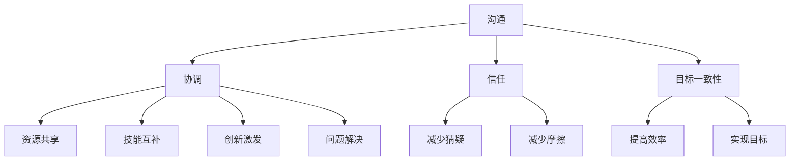
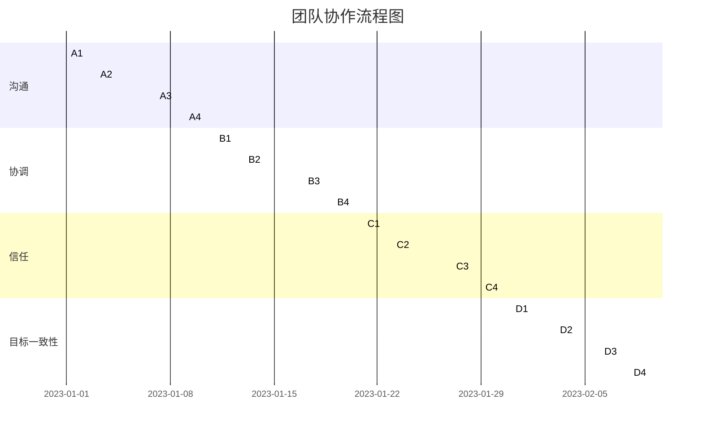
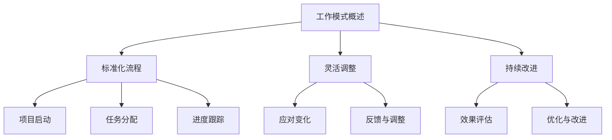

                 

### 文章标题

《团队协作能力：培养默契配合的工作模式》

---

#### 关键词：
- 团队协作
- 默契配合
- 工作模式
- 算法原理
- 数学模型
- 项目实战

---

#### 摘要：
本文旨在探讨团队协作能力的重要性，以及如何通过培养默契配合的工作模式来提高团队效能。文章首先介绍了团队协作的基本原理，随后详细阐述了培养团队默契的策略和工作模式的实施与调整。通过团队协作工具和技术介绍，文章进一步讲解了实际项目中的实战案例与分析。最后，文章总结了最佳实践，为团队协作能力提升提供了实用建议。

---

### 第一步：理解团队协作的重要性

在现代企业中，团队协作已经成为提高组织效率和创新能力的关键因素。有效的团队协作不仅能加快项目进度，还能提升团队的整体满意度和成员的个人成长。然而，团队协作并非易事，它涉及到成员之间的沟通、协调和信任等多个方面。

团队协作的重要性体现在以下几个方面：

1. **资源共享**：团队成员可以共享知识和资源，从而提高整体工作效率。
2. **技能互补**：团队成员各有所长，通过协作可以实现技能互补，提高项目质量。
3. **创新激发**：团队协作能够激发成员之间的创意碰撞，促进创新思维的发展。
4. **问题解决**：面对复杂问题时，团队成员可以共同分析和解决，提高问题解决的效率。

然而，团队协作也面临着诸多挑战：

1. **沟通障碍**：团队成员之间的沟通不畅可能导致误解和冲突。
2. **目标不一致**：团队成员对项目目标的理解可能存在差异，影响协作效果。
3. **资源竞争**：团队成员之间的资源竞争可能导致合作关系的紧张。
4. **个人差异**：团队成员的个性、价值观和工作风格不同，可能影响团队凝聚力。

为了克服这些挑战，我们需要通过培养默契配合的工作模式来提升团队协作能力。

---

### 第二步：团队协作的基本原理

团队协作的原理涉及到多个方面，包括沟通、协调、信任和目标一致性等。理解这些基本原理对于培养默契配合的工作模式至关重要。

#### 核心概念与联系

首先，我们需要明确几个核心概念：

1. **沟通**：沟通是团队协作的基础。有效的沟通能够确保信息传递的准确性，减少误解和冲突。
2. **协调**：协调是指团队成员之间的协同工作，通过统一行动和相互支持来实现共同目标。
3. **信任**：信任是团队协作的重要支柱。团队成员之间的信任能够减少猜疑和摩擦，提高协作效率。
4. **目标一致性**：团队目标一致性是指团队成员对项目目标的共同理解和认同，是实现高效协作的前提。

这些核心概念之间存在着紧密的联系。例如，良好的沟通有助于建立信任，而信任又能促进协调和目标一致性的实现。

#### 团队协作模式概述

为了更好地理解团队协作模式，我们可以使用Mermaid流程图来展示其基本架构。以下是一个简化的团队协作模式流程图：

在这个流程图中，沟通、协调、信任和目标一致性是团队协作的核心要素，它们相互关联，共同作用于团队协作的各个方面。

#### 团队协作的Mermaid流程图

为了更直观地展示团队协作模式，我们可以使用Mermaid语法绘制一个更详细的流程图。以下是一个示例：

这个流程图展示了团队协作的各个环节，包括沟通、协调、信任和目标一致性。通过这个流程图，我们可以更清晰地了解团队协作的动态过程。

---

### 第三步：培养团队默契的策略

要培养团队默契，需要从多个方面着手，包括建立信任、明确目标、优化沟通和强化技能互补等。以下是一些具体的策略：

#### 建立信任

1. **共同目标**：确保团队成员有共同的目标和价值观，这是建立信任的基础。
2. **透明沟通**：保持沟通的透明性，让每个成员都能了解项目的进展和问题。
3. **相互尊重**：尊重每个成员的意见和贡献，避免个人偏见和歧视。

#### 明确目标

1. **明确任务**：为每个成员分配明确的具体任务，确保任务与团队目标一致。
2. **定期回顾**：定期回顾任务完成情况，及时调整目标和计划。
3. **激励机制**：设立合理的激励机制，鼓励成员为实现目标而努力。

#### 优化沟通

1. **有效沟通**：使用适当的沟通工具和方法，确保信息的有效传递。
2. **倾听与反馈**：鼓励团队成员倾听他人意见，并提供及时、具体的反馈。
3. **冲突解决**：建立冲突解决机制，及时处理和化解团队内部的矛盾。

#### 强化技能互补

1. **技能培训**：为团队成员提供技能培训，提高团队的整体技能水平。
2. **资源整合**：合理分配资源，确保每个成员都能发挥自己的优势。
3. **跨职能合作**：鼓励团队成员跨职能合作，促进知识共享和技能互补。

---

### 第四步：实施与调整工作模式

要实施和调整工作模式，需要从以下几个方面进行：

#### 工作模式概述

1. **标准化流程**：制定标准化的工作流程，确保团队成员都能按照统一的方法进行工作。
2. **灵活调整**：根据项目实际情况，灵活调整工作模式，以适应不同阶段的需求。
3. **持续改进**：定期评估工作模式的实施效果，不断优化和改进。

#### 实施与调整的Mermaid流程图

以下是一个简化的工作模式实施与调整的Mermaid流程图：

这个流程图展示了工作模式从实施到调整的各个环节，包括标准化流程、灵活调整和持续改进。

---

### 第五步：团队协作工具与技术

在现代企业中，团队协作工具和技术发挥着重要作用。以下是一些常用的团队协作工具和技术：

#### 常用团队协作工具

1. **沟通工具**：如Slack、Microsoft Teams、WhatsApp等，用于实时沟通和协作。
2. **项目管理工具**：如JIRA、Trello、Asana等，用于任务分配、进度跟踪和项目协作。
3. **文档管理工具**：如Google Docs、Microsoft Office 365等，用于文档共享和协作编辑。
4. **代码管理工具**：如Git、GitHub、GitLab等，用于代码托管和版本控制。

#### 技术栈与架构设计

1. **前端技术**：HTML、CSS、JavaScript等，用于网页设计和开发。
2. **后端技术**：如Java、Python、Node.js等，用于服务器端开发和数据处理。
3. **数据库技术**：如MySQL、PostgreSQL、MongoDB等，用于数据存储和管理。
4. **云计算与容器化**：如AWS、Azure、Docker等，用于云服务和容器化部署。

#### 技术选型与优化策略

1. **需求分析**：根据项目需求和团队技能，选择合适的技术栈和工具。
2. **性能优化**：对系统进行性能测试和优化，确保系统的高效稳定运行。
3. **安全性保障**：确保系统的安全性，防止数据泄露和攻击。

---

### 第六步：实战案例与经验分享

为了更好地理解团队协作能力的重要性，我们来看一个实际的案例。

#### 案例介绍

某互联网公司开发了一款社交应用，项目团队成员包括前端开发、后端开发、测试工程师和产品经理。项目初期，团队成员之间的沟通不畅，导致项目进度缓慢，质量问题频出。为了改善这种情况，团队决定通过培养默契配合的工作模式来提高协作效率。

#### 案例分析

1. **建立信任**：团队首先通过组织团队建设活动，增进成员之间的了解和信任。团队成员开始更加开放地分享自己的想法和意见，减少误解和冲突。
2. **明确目标**：团队明确了项目的目标和里程碑，确保每个成员都对项目目标有清晰的认识。同时，制定了详细的任务分配和进度跟踪计划。
3. **优化沟通**：团队引入了Slack作为主要的沟通工具，建立了多个工作频道，用于讨论项目进展、任务分配和问题解决。团队成员也开始定期举行团队会议，确保信息的及时传递和反馈。
4. **强化技能互补**：团队鼓励成员参加技能培训，提高整体技能水平。同时，通过跨职能合作，实现了知识共享和技能互补，提高了项目的质量。

#### 经验分享与启示

通过这次实践，团队取得了显著的成果。项目进度加快，质量得到提升，团队成员之间的沟通和协作更加顺畅。以下是一些经验分享和启示：

1. **建立信任是关键**：信任是团队协作的基石，只有建立了信任，团队才能更加高效地协作。
2. **明确目标是前提**：明确的目标能够帮助团队成员更好地理解项目的方向和目标，提高工作积极性。
3. **优化沟通是手段**：良好的沟通能够减少误解和冲突，提高团队协作的效率。
4. **强化技能互补是手段**：通过技能互补和知识共享，团队能够更好地应对复杂的问题，提高项目的质量。

---

### 第七步：总结与展望

通过本文的探讨，我们可以看到团队协作能力对于现代企业的重要性。通过培养默契配合的工作模式，团队能够实现资源共享、技能互补、创新激发和问题解决，从而提高整体效能。

在未来，随着技术的不断进步，团队协作模式也将不断演进。企业需要不断创新和优化团队协作模式，以适应不断变化的市场环境和业务需求。

同时，我们鼓励读者在团队协作过程中，不断总结经验，优化工作模式，提升团队协作能力。只有这样，团队才能在激烈的市场竞争中立于不败之地。

---

#### 作者信息：

作者：AI天才研究院/AI Genius Institute & 禅与计算机程序设计艺术 /Zen And The Art of Computer Programming

---

以上是《团队协作能力：培养默契配合的工作模式》的详细目录大纲和初步内容，我们将根据这个大纲继续细化每个章节的内容，确保文章的逻辑清晰、内容丰富，并符合字数要求。在后续的编写过程中，我们还将不断优化和完善文章，为读者提供有价值的技术博客文章。

