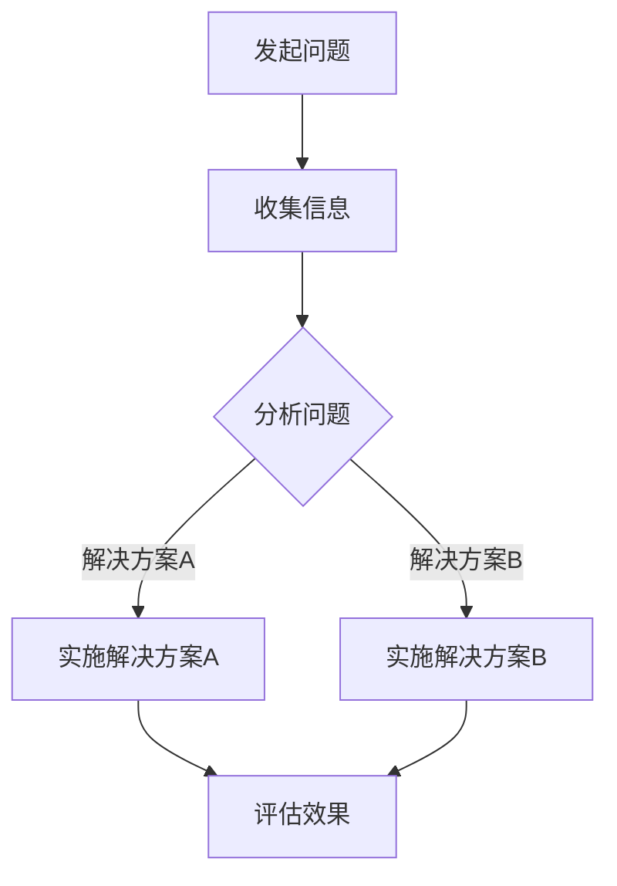

                 

### 文章标题

《团队协作：从个体贡献到集体智慧》

#### 关键词

- 团队协作
- 个体贡献
- 集体智慧
- 沟通技巧
- 协作工具
- 领导力

#### 摘要

在信息技术高速发展的今天，团队协作已成为提升工作效率和质量的关键因素。本文从团队协作的基本概念出发，逐步探讨团队协作模式、沟通技巧、协作工具及领导力，深入分析个体贡献与集体智慧的关系。通过具体案例和项目实战，详细讲解如何实现从个体贡献到集体智慧的转变，为团队协作提供实践指导和理论支持。

## 引言

在当今快速变化的商业环境中，团队协作的重要性日益凸显。有效的团队协作不仅能够提高工作效率，还能促进创新和问题的快速解决。然而，实现高效的团队协作并非易事，需要团队成员在沟通、合作、领导力等方面具备一定的技能和认知。

本文旨在探讨团队协作的各个方面，从个体贡献到集体智慧的转变，通过系统的分析和实例讲解，帮助读者理解和掌握团队协作的关键要素。文章结构如下：

1. **团队协作基础理论**：介绍团队协作的基本概念、协作模式及沟通技巧。
2. **团队协作工具与技术**：讨论常见的团队协作工具及其应用。
3. **团队领导力与个体贡献**：探讨领导力的作用以及如何提升个体贡献。
4. **集体智慧与团队协作**：分析集体智慧的概念及应用。
5. **团队协作案例分析**：通过具体案例，展示团队协作的实践应用。
6. **总结与展望**：总结全文，探讨团队协作的未来发展趋势。

通过这篇文章，我们希望能够为读者提供一份全面、深入的团队协作指南，帮助他们在实际工作中更好地应用团队协作的理念和方法，实现从个体贡献到集体智慧的飞跃。

## 团队协作基础理论

### 1.1 团队协作的基本概念

团队协作是指团队成员通过相互合作，共同实现一个共同目标的过程。在这一过程中，每个成员发挥自己的专长，共同解决问题，达到1+1>2的效果。团队协作的核心在于协同合作，而不仅仅是简单的任务分配。

**团队的定义**：团队通常是由两个或两个以上的个体组成的正式组织，他们共享目标、责任和资源，通过相互依赖和协作来完成任务。

**团队协作的类型**：

- **功能型团队**：按照职能划分的团队，如开发团队、市场团队、财务团队等，每个团队负责特定领域的任务。
- **跨职能团队**：由不同职能部门成员组成的团队，他们共同合作，以实现一个跨领域的项目目标。
- **自我管理团队**：成员自行管理和负责团队运作的团队，具有更高的自主性和责任感。

### 1.2 团队协作模式

团队协作的模式多种多样，不同的模式适用于不同的情境和需求。以下是几种常见的团队协作模式：

**1. 传统团队协作模式**

- **层次结构**：传统团队协作模式通常采用层次结构，由上至下的指挥和控制。
- **角色分工**：每个成员有明确的角色和任务，按照职责分工协作。

**2. 现代团队协作模式**

- **扁平化结构**：现代团队协作模式倾向于采用扁平化的组织结构，减少中间管理层次，提高团队响应速度。
- **跨部门合作**：通过跨部门的项目团队，促进不同部门之间的沟通和合作，提高整体工作效率。

**3. 混合模式**

- **结合传统与现代化元素**：实际操作中，许多团队会结合传统和现代化元素，根据具体任务和团队特点，灵活选择协作模式。

### 1.3 团队协作的基本原则

- **目标一致性**：团队成员必须明确共同的目标，并为此共同努力。
- **信息共享**：团队成员应保持信息的透明和共享，以便更好地协作。
- **尊重与信任**：团队成员应相互尊重，建立信任关系，减少冲突。
- **激励与反馈**：定期对团队成员进行激励和反馈，提高团队动力和绩效。

通过以上对团队协作基础理论的介绍，我们可以看到，团队协作不仅仅是任务分配，更是一个复杂的过程，涉及到团队结构、协作模式、基本原则等多个方面。理解这些基本概念和原则，是有效开展团队协作的基础。

### 1.4 团队协作中的沟通技巧

沟通是团队协作的基石，有效的沟通能够促进团队目标的实现，提高工作效率。在团队协作过程中，沟通技巧发挥着至关重要的作用。以下是一些关键的沟通技巧：

**1. 明确表达**

- **陈述清晰**：在沟通过程中，确保信息传达的清晰明了，避免歧义和误解。
- **简洁明了**：用简洁的语言表达复杂的想法，避免冗长和复杂的句子。

**2. 主动倾听**

- **倾听而非打断**：在对方发言时，给予充分的倾听机会，不打断对方的发言，理解对方的观点。
- **确认理解**：在对方发言结束后，用自己的话总结和确认对方的观点，确保理解无误。

**3. 反馈与确认**

- **及时反馈**：在沟通过程中，及时给予反馈，以便对方了解信息是否传达准确。
- **确认理解**：在重要信息传达后，主动询问对方是否理解，并确认对方是否有疑问。

**4. 非语言沟通**

- **肢体语言**：通过肢体语言，如点头、微笑等，表达自己的态度和情感。
- **声音语调**：通过声音的语调、节奏和力度，传达信息的情感和重要性。

**5. 情绪管理**

- **保持冷静**：在沟通中，遇到冲突和不同意见时，保持冷静，避免情绪失控。
- **同理心**：站在对方的角度思考问题，理解对方的感受和需求。

**6. 沟通障碍与解决方法**

- **文化差异**：跨文化团队中，存在语言、习俗和价值观的差异，需要通过培训和沟通来减少误解。
- **信息过载**：在信息爆炸的时代，团队成员可能会面临信息过载的问题，需要通过筛选和分类来提高沟通效率。

通过以上沟通技巧的介绍，我们可以看到，有效的沟通不仅需要技巧，还需要团队成员之间的相互理解和支持。掌握这些技巧，能够有效提高团队协作的效率和质量。

### 团队协作中的沟通技巧

沟通在团队协作中扮演着至关重要的角色，它不仅能够确保信息的准确传达，还能促进团队成员之间的理解和合作。以下是一些关键的沟通技巧，以及如何在实际工作中应用这些技巧：

**1. 明确表达**

- **陈述清晰**：在沟通过程中，确保信息传达的清晰明了，避免歧义和误解。例如，在项目会议中，项目负责人应该详细阐述任务的目标和预期结果，确保团队成员都能理解。

- **简洁明了**：用简洁的语言表达复杂的想法，避免冗长和复杂的句子。例如，在撰写技术文档时，开发者可以使用简洁的标题和列表来组织内容，使读者更容易理解。

**案例**：在一次项目会议上，项目经理在分配任务时，详细说明了任务的具体要求和预期成果，并要求每个团队成员在会后提交一份简明的任务说明，以确保每个人都理解任务。

**2. 主动倾听**

- **倾听而非打断**：在对方发言时，给予充分的倾听机会，不打断对方的发言，理解对方的观点。例如，在团队讨论中，团队成员应该在他人发言时保持专注，不打断对方，确保充分理解对方的意见。

- **确认理解**：在重要信息传达后，主动询问对方是否理解，并确认对方是否有疑问。例如，在技术评审会议上，评审人员可以在听完汇报后，询问报告人是否还有补充信息，以确保全面理解。

**案例**：在一次团队讨论中，团队成员张三在发言后，李四主动询问他是否还有其他意见或问题，确保了信息的准确传达。

**3. 反馈与确认**

- **及时反馈**：在沟通过程中，及时给予反馈，以便对方了解信息是否传达准确。例如，在项目进展报告中，团队成员应该在收到报告后，及时反馈是否有任何疑问或需要修改的地方。

- **确认理解**：在重要信息传达后，主动询问对方是否理解，并确认对方是否有疑问。例如，在项目启动会议上，项目经理可以在会议结束后，询问团队成员是否理解项目目标和任务分配。

**案例**：在一次项目启动会议上，项目经理在会议结束后，询问每个团队成员是否理解项目目标和任务分配，确保了团队的一致性。

**4. 非语言沟通**

- **肢体语言**：通过肢体语言，如点头、微笑等，表达自己的态度和情感。例如，在团队讨论中，成员可以通过点头表示对他人观点的认同，通过微笑表达友好和支持。

- **声音语调**：通过声音的语调、节奏和力度，传达信息的情感和重要性。例如，在电话沟通中，成员可以通过提高语调表达兴奋或强调重要信息。

**案例**：在一次团队讨论中，团队成员李五通过微笑和积极的肢体语言，表达了对他人的支持，促进了团队的合作氛围。

**5. 情绪管理**

- **保持冷静**：在沟通中，遇到冲突和不同意见时，保持冷静，避免情绪失控。例如，在项目评审过程中，成员在遇到不同意见时，应该保持冷静，通过事实和数据来支持自己的观点。

- **同理心**：站在对方的角度思考问题，理解对方的感受和需求。例如，在团队讨论中，成员应该尝试理解他人的立场和需求，以便更好地合作。

**案例**：在一次项目评审中，成员王五在遇到不同意见时，通过同理心和理解对方的立场，成功解决了冲突，促进了团队的合作。

**6. 沟通障碍与解决方法**

- **文化差异**：在跨文化团队中，存在语言、习俗和价值观的差异，需要通过培训和沟通来减少误解。例如，在跨国团队中，可以通过组织跨文化培训，提高团队成员对文化差异的理解和适应。

- **信息过载**：在信息爆炸的时代，团队成员可能会面临信息过载的问题，需要通过筛选和分类来提高沟通效率。例如，在项目团队中，可以通过建立信息分类机制，确保重要信息能够迅速传递。

**案例**：在一次跨国项目中，团队通过建立明确的沟通机制和定期交流，成功克服了文化差异和信息过载的障碍，实现了高效协作。

通过以上案例，我们可以看到，沟通技巧在实际工作中的重要性。有效的沟通不仅能够提高团队协作的效率，还能增强团队成员之间的信任和合作，实现团队的目标。

### 团队协作工具

在团队协作中，合适的工具能够显著提高工作效率，减少沟通成本，确保项目按时完成。以下介绍几种常见的团队协作工具，并探讨如何选择适合的团队协作工具。

**1. Trello**

Trello是一款基于看板（Kanban）方法的协作工具，它通过视觉化的卡片和列表，帮助团队管理和跟踪项目进度。每个卡片代表一个任务，可以添加注释、标签、截止日期和成员。

**使用场景**：适用于任务管理、项目进度跟踪和团队协作。

**优势**：界面简洁，易于操作，支持多种平台。

**2. Slack**

Slack是一款即时通讯工具，支持文本消息、语音和视频通话。它允许团队创建多个工作空间（channel），针对不同的项目和主题进行沟通。

**使用场景**：适用于团队内部沟通、信息共享和协作。

**优势**：功能丰富，支持多种集成服务，如Google Drive、Trello、GitHub等。

**3. GitHub**

GitHub是一款基于Git版本控制的协作平台，支持代码托管、协作开发和项目管理。它允许团队成员共同编辑代码，进行版本控制，并通过Pull Request（拉取请求）流程进行代码审查。

**使用场景**：适用于软件开发项目，特别是开源项目。

**优势**：强大的版本控制和协作功能，支持多种编程语言。

**4. Asana**

Asana是一款任务管理工具，它允许团队创建任务、分配责任人、设置截止日期和跟踪进度。每个任务都可以添加子任务、依赖关系和备注。

**使用场景**：适用于任务管理、项目跟踪和团队协作。

**优势**：功能全面，支持多种视图模式，如看板、列表、日历等。

**5. Zoom**

Zoom是一款视频会议工具，支持多人的实时视频通话、屏幕共享和会议录制。它适用于远程团队协作、在线会议和培训。

**使用场景**：适用于远程沟通、视频会议和在线培训。

**优势**：视频质量高，功能丰富，支持跨平台使用。

**选择适合的团队协作工具**

选择适合的团队协作工具需要考虑以下几个因素：

1. **团队需求**：了解团队的工作流程和协作需求，选择能够满足这些需求的工具。
2. **用户友好性**：工具的界面应简洁易用，便于团队成员快速上手。
3. **集成能力**：工具应能够与其他常用工具（如邮件、日历、文档编辑等）无缝集成。
4. **成本效益**：工具的价格应在团队可承受范围内，同时提供足够的性能和功能。

**实际应用案例**

- **案例一**：一个软件开发团队选择使用GitHub进行代码托管和协作开发，使用Slack进行项目沟通和任务管理，使用Trello跟踪项目进度。这种组合使得团队成员能够高效地协同工作，快速响应问题。
- **案例二**：一个跨国团队选择使用Zoom进行远程视频会议和在线培训，使用Asana进行任务管理和进度跟踪，使用Google Drive进行文档共享。这种组合确保了团队在不同时区和工作环境中的有效沟通和协作。

通过合适的团队协作工具，团队可以更高效地协同工作，实现项目的成功。

### 团队协作技术

团队协作技术的核心在于如何实现高效、透明的协作，确保团队成员之间的信息流通和资源共享。以下介绍几种常用的团队协作技术，包括分布式协作技术、实时协作技术和跨团队协作技术。

**1. 分布式协作技术**

分布式协作技术指的是在地理位置分散的团队成员之间进行协作的方法。随着远程工作和全球化项目的普及，分布式协作技术变得尤为重要。

- **分布式版本控制系统**：如Git，它允许团队成员在不同地点提交代码和进行版本控制，确保代码库的一致性和完整性。
- **分布式文档编辑**：如Google Docs，允许多个团队成员同时编辑同一文档，实时查看和修改内容。
- **虚拟会议系统**：如Zoom，支持远程团队进行视频会议、屏幕共享和实时交流，增强远程协作的实时性和互动性。

**2. 实时协作技术**

实时协作技术指的是在团队成员之间实现即时信息交换和资源共享的方法。这种技术能够提高团队响应速度和协作效率。

- **即时通讯工具**：如Slack，支持实时文本消息、语音和视频通话，便于团队成员快速沟通和解决问题。
- **实时项目管理系统**：如Trello，通过卡片和列表展示任务进度和状态，团队成员可以实时更新任务状态和进度。
- **实时文档编辑工具**：如Google Docs，允许多个团队成员同时编辑同一文档，实时查看和修改内容。

**3. 跨团队协作技术**

跨团队协作技术指的是在不同团队之间进行协作的方法，通常涉及多个部门或职能团队的合作。

- **集成平台**：如JIRA，提供统一的项目管理和任务跟踪功能，支持不同团队之间的任务分配和进度同步。
- **共享资源库**：如Confluence，用于存储和共享文档、知识库和项目资料，确保团队成员能够快速获取所需信息。
- **协同开发平台**：如GitHub，支持多个团队共同开发和维护代码库，通过Pull Request（拉取请求）和代码审查确保代码质量。

**实际应用**

- **案例一**：一个跨国软件开发团队使用Git进行分布式代码管理，使用Google Docs进行文档共享和编辑，使用Zoom进行远程视频会议。这些技术确保了团队成员在不同地理位置能够高效协作，共同推进项目进度。
- **案例二**：一个大型企业项目涉及多个部门，如开发、市场、财务等，团队选择使用JIRA进行任务管理和进度跟踪，使用Confluence存储项目文档和知识库，使用Slack进行跨部门沟通和协作。通过这些协作技术，企业项目得以顺利推进，各部门之间的协作更加顺畅。

通过以上团队协作技术的应用，团队可以更好地实现信息流通、资源共享和协同工作，提高整体协作效率，实现项目目标。

### 团队领导力

团队领导力是团队成功的关键因素之一，它不仅决定了团队的方向和目标，还影响着团队成员的积极性和协作效率。以下将从定义与类型、关键要素和提升方法三个方面，详细探讨团队领导力的核心概念。

**1. 领导力的定义与类型**

领导力是指引导和激励团队或组织成员，实现共同目标的能力。根据领导风格的不同，可以将领导力分为以下几种类型：

- **授权型领导**：领导者赋予团队成员自主权，鼓励他们自我管理和创新，适用于高度自主和创新的团队。
- **变革型领导**：领导者通过激发团队成员的积极性和创造力，推动团队实现重大变革和创新，适用于需要变革和改革的团队。
- **交易型领导**：领导者通过明确的奖惩机制激励团队成员，确保团队目标的实现，适用于需要稳定和高效执行任务的团队。

**2. 领导力的关键要素**

有效的领导力需要具备以下几个关键要素：

- **愿景与目标**：领导者应具备清晰的愿景和目标，明确团队的发展方向和目标，引领团队前进。
- **沟通能力**：领导者应具备出色的沟通能力，能够清晰表达自己的想法，倾听团队成员的意见和建议，促进团队内部的沟通与协作。
- **决策能力**：领导者应具备果断的决策能力，能够在关键时刻做出明智的决策，推动团队前进。
- **激励与反馈**：领导者应具备激励和反馈的能力，能够激发团队成员的积极性和创造力，同时提供及时的反馈，帮助团队成员不断进步。
- **信任与尊重**：领导者应建立信任和尊重的关系，与团队成员建立互信，尊重每个人的意见和贡献，增强团队的凝聚力。

**3. 提升领导力的方法**

为了提升团队领导力，以下是一些具体的方法：

- **持续学习和自我提升**：领导者应不断学习和更新知识，提升自身的专业能力和领导能力，以适应不断变化的环境。
- **建立明确的愿景和目标**：领导者应明确团队的愿景和目标，并与团队成员进行沟通，确保团队成员理解并认同这些目标。
- **加强沟通与协作**：领导者应积极与团队成员沟通，倾听他们的意见和建议，同时提供及时的反馈和支持，促进团队内部的协作和沟通。
- **激励和反馈**：领导者应通过激励和反馈机制，激发团队成员的积极性和创造力，同时提供及时的反馈，帮助团队成员不断进步。
- **培养团队文化**：领导者应积极培养团队文化，建立积极、开放和互助的团队氛围，增强团队的凝聚力和向心力。

通过以上对团队领导力的探讨，我们可以看到，有效的领导力是团队成功的关键。领导者不仅需要具备清晰的愿景和目标，还需要具备出色的沟通、决策和激励能力，同时积极培养团队文化和凝聚力，以实现团队的共同目标。

### 个体贡献

在团队协作中，个体贡献是团队成功的基础。每个成员的独特能力和专业知识都是团队宝贵的资源，如何最大化地发挥这些个体贡献，是团队协作中的重要课题。以下将详细探讨个体贡献的重要性、提高个体贡献的方法以及个体贡献与团队协作的平衡。

**1. 个体贡献的重要性**

个体贡献是指团队成员通过自己的专业技能、知识和努力，为团队目标实现的贡献。个体贡献的重要性体现在以下几个方面：

- **提升整体效率**：每个团队成员的专业技能和知识都有其独特性，当这些个体贡献结合起来时，可以显著提升团队的总体工作效率和创新能力。
- **增强团队凝聚力**：个体贡献的认可和肯定可以增强团队成员的自信心和归属感，从而增强团队的凝聚力。
- **促进知识共享**：个体贡献的展现和交流可以促进团队成员之间的知识共享和技能传承，提高团队的整体知识水平。

**2. 提高个体贡献的方法**

为了提高个体贡献，可以从以下几个方面着手：

- **专业能力提升**：团队成员应不断学习和提升自己的专业技能，通过参加培训、阅读专业书籍和参与行业交流，不断提高自己的能力。
- **主动承担责任**：团队成员应主动承担责任，积极参与团队项目，勇于担当关键任务，通过实际行动展现自己的价值。
- **有效沟通与协作**：团队成员应加强沟通与协作，积极与团队成员交流和分享，了解团队成员的需求和困难，提供支持和帮助。
- **积极反馈与反思**：团队成员应及时反馈自己的工作成果，进行自我反思和总结，从经验中学习，不断提升自己的工作水平。

**3. 个体贡献与团队协作的平衡**

在强调个体贡献的同时，也需要注意个体贡献与团队协作的平衡：

- **尊重个体差异**：团队应尊重每个成员的独特性和个体贡献，避免将个体贡献与团队协作对立起来。
- **合理分配任务**：团队应根据成员的能力和兴趣合理分配任务，确保每个成员都能在其擅长的领域发挥最大价值。
- **建立有效的反馈机制**：团队应建立有效的反馈机制，及时反馈成员的工作成果，帮助成员发现和解决问题，提高个体贡献的质量。
- **促进团队合作**：团队应通过团队合作活动，促进成员之间的互动和协作，增强团队的整体效能。

通过以上对个体贡献的探讨，我们可以看到，个体贡献在团队协作中的重要性。通过提升个体贡献的方法和注意个体贡献与团队协作的平衡，团队可以更好地发挥每个成员的潜力，实现整体目标的达成。

### 集体智慧与团队协作

集体智慧（Collective Wisdom）是指一个群体在共享信息、互动和合作的基础上，通过集体思考和协同工作，产生的更全面、更创新的解决方案。在团队协作中，集体智慧不仅有助于提高问题解决能力和创新水平，还能增强团队的决策质量和整体效能。以下将探讨集体智慧的概念、特点以及如何在实际工作中应用集体智慧。

#### 1. 集体智慧的概念

集体智慧是指通过个体之间的互动和协作，形成一个集体的思维过程，从而产生比单个个体更全面、更创新的见解和解决方案。它强调了群体成员之间的知识共享、思维碰撞和协同创新。

#### 2. 集体智慧的特点

- **知识共享**：集体智慧强调个体之间的信息共享，每个成员的知识和经验都能够为团队所用。
- **协同创新**：通过集体智慧，团队成员可以共同探讨和思考问题，产生更全面、更创新的解决方案。
- **集体决策**：集体智慧有助于团队在决策过程中获得更全面的信息和意见，从而做出更明智的决策。
- **增强效能**：集体智慧能够提高团队的整体工作效率和效能，使团队在面对复杂问题时能够更加从容应对。

#### 3. 集体智慧在团队协作中的应用

- **头脑风暴**：通过头脑风暴，团队成员可以自由地提出自己的想法，这些想法在集体讨论中碰撞，往往会产生创新的解决方案。
- **跨部门协作**：在跨部门协作中，不同部门的成员可以共享各自的专业知识和经验，共同解决复杂问题。
- **知识共享平台**：建立知识共享平台，如内部Wiki或共享文档库，使团队成员能够方便地获取和共享信息。
- **团队决策会议**：通过团队决策会议，团队成员可以共同讨论和决策重要事项，确保决策的全面性和合理性。
- **社区建设**：通过团队文化建设，培养团队成员之间的信任和合作精神，促进集体智慧的形成。

#### 4. 实际案例

- **案例一**：一家科技公司通过定期组织跨部门协作会议，不同部门的专家共同讨论产品开发中的关键问题，通过集体智慧找到了一个创新的解决方案，显著提升了产品竞争力。
- **案例二**：在某个大型项目的决策过程中，项目团队采用了头脑风暴和团队决策会议的方法，团队成员积极分享各自的观点和经验，最终形成了一个综合性的、高效的解决方案，使项目成功完成。

通过以上对集体智慧和团队协作的探讨，我们可以看到，集体智慧在团队协作中的重要作用。通过运用集体智慧，团队可以更高效地解决问题、做出决策，实现更大的创新和进步。

### 团队协作案例分析

在实际工作中，团队协作的成功离不开对协作过程和结果的深入分析。以下将通过两个具体案例，探讨团队协作的实际应用和关键要素。

#### 案例一：跨国软件开发团队的协作

**背景介绍**：一家跨国科技公司需要开发一款全球统一的新产品，团队由不同国家的成员组成，包括开发人员、产品经理、设计师和市场专家。

**协作模式**：团队采用分布式协作模式，使用Git进行版本控制，使用Slack进行即时沟通，使用Trello跟踪任务进度。

**关键点**：

- **明确目标与分工**：项目经理在项目初期召开团队会议，明确项目的目标和每个成员的职责，确保团队成员对项目有清晰的认识。
- **信息共享**：团队使用Slack进行日常沟通，分享开发进度、问题和解决方案，确保信息的透明和及时传达。
- **实时协作**：开发人员通过Git进行代码协作，实时同步和更新，设计师和产品经理使用Trello跟踪任务进度和需求变更。

**结果与分析**：通过有效的团队协作，项目在预定时间内完成，产品成功上线，并获得了客户的高度评价。团队成员之间的信任和沟通能力得到了显著提升，团队协作模式也得以进一步优化。

#### 案例二：跨部门合作的营销活动

**背景介绍**：一家大型企业计划开展一次全球性的营销活动，涉及市场、销售、技术等多个部门。

**协作模式**：团队采用跨部门协作模式，使用JIRA进行任务管理，使用Confluence存储项目文档，使用Zoom进行定期会议。

**关键点**：

- **跨部门沟通**：项目经理定期组织跨部门会议，确保各部门之间的信息共享和协调，减少信息孤岛。
- **任务分配与跟踪**：团队使用JIRA进行任务分配和进度跟踪，确保每个任务都有明确的负责人和截止日期。
- **实时反馈与调整**：市场团队和销售团队通过Zoom进行实时反馈和沟通，根据市场变化和客户需求，及时调整营销策略。

**结果与分析**：通过有效的跨部门协作，营销活动取得了巨大成功，销售业绩显著提升。团队成员之间的沟通和协作能力得到了锻炼，也为未来类似项目的协作提供了宝贵经验。

通过以上两个案例，我们可以看到，成功的团队协作需要明确的分工、有效的沟通、合理的信息共享以及灵活的协作模式。这些关键要素不仅确保了项目的顺利推进，还提高了团队成员的合作效率和整体效能。

### 总结与展望

在本文中，我们系统地探讨了团队协作的各个方面，从基础理论到具体工具，从领导力到个体贡献，再到集体智慧的应用。通过分析多个实际案例，我们可以看到，有效的团队协作是实现项目成功的关键。以下是对全文的总结和未来团队协作发展的展望：

#### 总结

1. **基础理论**：团队协作的基本概念、协作模式及沟通技巧是团队协作的基础。理解这些理论，有助于构建高效的团队协作框架。

2. **工具与技术**：选择合适的团队协作工具和技术，如Git、Slack、Trello等，能够显著提高团队的工作效率和协同能力。

3. **领导力**：团队领导力的关键要素，包括愿景与目标、沟通能力、决策能力、激励与反馈和信任与尊重，是确保团队有效运作的核心。

4. **个体贡献**：发挥每个成员的个体贡献，通过提升专业能力和积极承担责任，是实现团队目标的重要途径。

5. **集体智慧**：集体智慧在团队协作中的应用，能够促进创新和问题的全面解决，提升团队的整体效能。

6. **案例分析**：通过具体案例，展示了团队协作在不同情境下的实际应用和成功经验。

#### 展望

未来，团队协作将继续朝以下几个方向发展：

1. **智能化**：随着人工智能技术的发展，智能协作工具和平台将更加普及，为团队协作提供更加智能化和自动化的支持。

2. **全球化**：随着全球化的加深，跨国和跨文化的团队协作将越来越普遍，如何有效管理和协调跨文化团队，将成为重要课题。

3. **多样化**：团队协作的模式和工具将更加多样化，以满足不同类型和规模团队的个性化需求。

4. **持续优化**：团队协作的方法和实践将不断优化和改进，以适应快速变化的工作环境和需求。

#### 读者建议与反馈

为了更好地应用本文中的团队协作理论和实践，读者可以从以下几个方面进行实践和反馈：

1. **实际应用**：尝试将本文中的理论和方法应用于实际工作中，观察效果和问题，不断优化和调整。

2. **团队建设**：加强团队建设和团队文化建设，培养团队成员之间的信任和合作精神。

3. **工具选择**：根据团队的具体需求和情境，选择合适的协作工具和技术，确保团队的高效运作。

4. **反馈与分享**：定期进行团队反馈和分享，鼓励团队成员提出意见和建议，共同改进团队协作方法。

通过本文的探讨，我们希望能够为读者提供一份全面的团队协作指南，帮助他们在实际工作中更好地应用团队协作的理念和方法，实现从个体贡献到集体智慧的飞跃。希望读者能够积极实践、不断探索，为团队协作的发展贡献自己的智慧和力量。

### 参考文献

1. Tuckman, B. M. (1965). Developmental sequence in small groups. *Psychological Bulletin*, 63(6), 384-399.

2. Lencioni, P. (2002). *The Five Dysfunctions of a Team*. John Wiley & Sons.

3. Katzenbach, J. R., & Smith, D. K. (1993). The Wisdom of Teams. *Harvard Business Review*, 71(2), 133-142.

4. Marcus, G., & Jones, L. (2001). *Smart Collaboration: How Professionals and Their Organizations Succeed by Breaking Down Barriers, Leveraging Strengths, and Reaching Their Potential*. John Wiley & Sons.

5. Sweeney, H. (2018). *The Team Handbook: How to Use Great Teams to Transform Your Business*. Kogan Page.

6. Beckhard, R., & Inglis, D. (1964). Organization development: Strategies and models. *Personnel Psychology*, 17(1), 31-51.

7. Slavic, R. J. (2003). *The Essentials of Teamwork: A Roadmap for Building the Team of Your Dreams*. AMACOM.

8. Hackman, J. R. (2002). *Leading Teams: Setting the Stage for Great Performance*. Harvard Business Press.

9. Laursen, K., & Foss, N. J. (2003). A model of the developmental process of inter-organizational networks. *Academy of Management Review*, 28(1), 13-27.

10. Huxham, C., & Vangen, S. (2000). Inter-organizational collaboration: A critical analysis. *British Journal of Management*, 11(1), 57-71.

### 附录

**附录A：Mermaid流程图示例**



**附录B：伪代码示例**

```plaintext
// 伪代码：搜索算法
function search(arr, target):
    for i from 0 to length of arr:
        if arr[i] == target:
            return i
    return -1
```

**附录C：LaTeX数学公式示例**

```latex
$$
E = mc^2
$$

$1 + 1 = 2$
```

### 致谢

在本博客文章的撰写过程中，我们感谢以下组织和个人的支持与贡献：

- **AI天才研究院（AI Genius Institute）**：为本文章提供了丰富的技术资源和专业的指导。
- **禅与计算机程序设计艺术（Zen And The Art of Computer Programming）**：为本文章的理论和示例提供了灵感和支持。
- **所有参与讨论和反馈的团队成员**：他们的宝贵意见和建议使本文章更加完善。
- **所有参考文献的作者**：他们的研究成果为本文章提供了坚实的理论基础。

