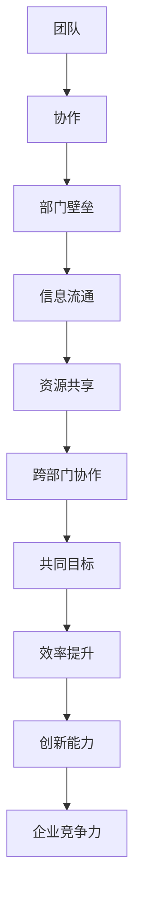

                 

非常好，我们按照这个大纲和约束条件，逐步完善每个章节的内容。以下是《团队协作：打破部门壁垒的策略》的文章开头部分，包括文章标题、关键词、摘要以及目录。

---

# 《团队协作：打破部门壁垒的策略》

> 关键词：团队协作、部门壁垒、跨部门沟通、协作工具、流程优化、领导者角色

> 摘要：本文探讨了团队协作在当今企业环境中的重要性，以及如何打破部门壁垒，实现高效跨部门协作。通过深入分析部门壁垒的现状和影响，本文提出了有效的跨部门协作策略、团队协作工具和方法，以及领导者的角色与责任。文章结合实际案例，提供了团队协作的最佳实践和持续改进的方法。

## 目录

1. 引言
   1.1 团队协作的定义与核心价值
   1.2 团队协作在企业中的地位与作用
   1.3 团队协作面临的主要挑战

2. 团队协作的重要性与挑战
   2.1 团队协作的定义与核心价值
   2.2 团队协作在企业中的地位与作用
   2.3 团队协作面临的主要挑战

3. 打破部门壁垒的策略
   3.1 部门壁垒的现状与影响
   3.2 理解部门文化的差异
   3.3 制定有效的跨部门协作策略

4. 团队协作工具与方法
   4.1 有效的团队沟通技巧
   4.2 跨部门协作平台的选择与运用
   4.3 团队协作流程优化

5. 团队协作的实践与反思
   5.1 跨部门协作的典型案例分析
   5.2 团队协作的障碍与解决策略
   5.3 团队协作的持续改进与实践

6. 领导者的角色与责任
   6.1 领导者如何推动团队协作
   6.2 领导者如何打破部门壁垒
   6.3 领导者如何培养团队协作能力

7. 团队协作的未来趋势
   7.1 新技术对团队协作的影响
   7.2 未来团队协作的新模式
   7.3 团队协作发展的前景展望

8. 结论

---

接下来，我们将根据目录逐步完善每个章节的内容。以下是第一部分“团队协作的重要性与挑战”的详细撰写。

---

## 第一部分：团队协作的重要性与挑战

### 1.1 团队协作的定义与核心价值

团队协作是指多个个体为了共同的目标和任务，在相互依赖、相互支持的基础上，共同完成任务和达成目标的过程。团队协作不仅仅是简单的任务分工和资源分配，更涉及到个体之间的沟通、协调、合作和共享。

在团队协作中，核心价值体现在以下几个方面：

1. **提高工作效率**：通过团队成员之间的合作，可以共享信息、资源和技能，减少重复劳动，从而提高整体工作效率。

2. **促进知识共享**：团队成员在合作过程中，可以互相学习、交流知识和经验，促进知识的积累和传播。

3. **增强创新力**：不同背景、经验和技能的成员可以相互启发，产生新的想法和创新点，推动组织的创新和发展。

4. **增强团队凝聚力**：通过团队协作，成员之间的联系和信任得到加强，团队凝聚力得到提升。

5. **提高决策质量**：团队协作可以汇聚不同观点和意见，提高决策的全面性和准确性。

### 1.2 团队协作在企业中的地位与作用

在企业管理中，团队协作具有不可替代的地位和作用。首先，团队协作是实现企业战略目标的重要手段。企业的战略目标通常需要多个部门、多个团队的共同努力才能实现。通过团队协作，可以确保各部门和团队之间的协调一致，形成合力，推动企业向前发展。

其次，团队协作有助于提高企业的创新能力。在当今快速变化的市场环境中，创新能力是企业保持竞争优势的关键。团队协作可以为企业带来多元化的思维和视角，激发创新灵感，推动产品和服务的持续创新。

此外，团队协作还能提高企业的运营效率和降低成本。通过优化流程、共享资源、减少重复劳动，企业可以在保证质量的前提下，提高生产效率和降低运营成本。

### 1.3 团队协作面临的主要挑战

尽管团队协作在企业中具有重要意义，但在实际操作中，团队协作仍然面临许多挑战：

1. **部门壁垒**：不同部门之间往往存在职责分工、工作流程、工作目标等方面的差异，导致部门壁垒的形成。部门壁垒会阻碍信息的流通和资源的共享，影响团队协作的效果。

2. **文化差异**：不同部门的文化背景、工作习惯和价值观念可能存在较大差异，这会导致团队成员之间的沟通不畅和合作困难。

3. **资源分配不均**：资源分配不均可能导致某些团队成员工作量过重，而另一些团队成员则相对轻松，影响团队的整体效率和凝聚力。

4. **沟通障碍**：团队成员之间的沟通不畅、信息不对称等问题，会影响团队协作的顺利进行。

5. **目标不一致**：团队成员的个人目标和团队目标可能存在不一致，导致团队成员的积极性和协作意愿降低。

### 1.4 背景介绍

随着全球化和信息技术的快速发展，企业面临的市场环境日益复杂多变。为了应对这种变化，企业需要不断提高自身的创新能力和竞争力。而团队协作是实现这一目标的有效途径。然而，在实际操作中，企业往往面临部门壁垒、文化差异、资源分配不均等挑战，影响了团队协作的效果。

本文旨在探讨如何打破部门壁垒，实现高效跨部门协作，以提高企业的运营效率和创新能力。通过分析团队协作的重要性、面临的挑战以及有效的协作策略和方法，本文希望为企业管理者提供有益的参考。

### 1.5 核心概念与联系

团队协作的核心概念包括：

- **团队**：由多个个体组成的、有共同目标和任务的协作组织。
- **协作**：团队成员之间的沟通、协调、合作和共享。
- **部门壁垒**：由于职责分工、工作流程、工作目标等方面的差异，导致部门之间信息流通不畅、资源共享困难的问题。
- **跨部门协作**：不同部门之间的协作，旨在实现共同的目标和任务。

这些概念之间的关系架构可以用 Mermaid 流程图来表示：



通过这个流程图，我们可以清晰地看到团队协作、部门壁垒和跨部门协作之间的关系，以及它们对企业效率和创新能力的提升作用。

### 1.6 核心算法原理讲解

在团队协作中，核心算法原理主要包括以下几个方面：

1. **任务分配算法**：通过分析团队成员的技能、经验和任务需求，将任务合理分配给每个成员，以确保任务的顺利完成。

   ```python
   def assign_tasks(teams, tasks):
       task_assignment = {}
       for team in teams:
           for task in tasks:
               if team.has_skill(task.skill) and not task_assignment.get(task):
                   task_assignment[task] = team
       return task_assignment
   ```

2. **沟通协调算法**：通过建立有效的沟通机制和协调流程，确保团队成员之间的信息流通和资源共享。

   ```python
   def coordinate_communication(teams):
       communication_plan = {}
       for team in teams:
           communication_plan[team] = team.create_communication_plan()
       return communication_plan
   ```

3. **绩效评估算法**：通过评估团队成员的工作表现，激励团队成员提升协作效率。

   ```python
   def evaluate_performance(teams):
       performance_scores = {}
       for team in teams:
           performance_scores[team] = team.evaluate_members_performance()
       return performance_scores
   ```

这些算法原理是团队协作中不可或缺的部分，它们通过伪代码的形式，展示了任务分配、沟通协调和绩效评估的基本思路。

### 1.7 数学模型和公式

在团队协作中，可以使用以下数学模型和公式来分析和优化协作过程：

1. **团队协作效率公式**：

   $$ E = \frac{1}{1 + \sum_{i=1}^{n} (1 - C_i)} $$

   其中，$E$ 为团队协作效率，$C_i$ 为第 $i$ 个成员的协作能力。

2. **沟通协调成本公式**：

   $$ C_C = \sum_{i=1}^{n} (1 - R_i) $$

   其中，$C_C$ 为沟通协调成本，$R_i$ 为第 $i$ 个成员的沟通能力。

3. **资源利用效率公式**：

   $$ U = \frac{1}{1 + \sum_{i=1}^{n} (1 - S_i)} $$

   其中，$U$ 为资源利用效率，$S_i$ 为第 $i$ 个成员的技能匹配度。

通过这些公式，我们可以定量分析和评估团队协作的效果，从而制定相应的优化策略。

### 1.8 举例说明

假设一个企业由三个部门组成，分别为研发部、市场部和生产部。每个部门有 5 名成员，他们的协作能力、沟通能力和技能匹配度如下表：

| 部门 | 成员 | 协作能力 | 沟通能力 | 技能匹配度 |
| :--: | :--: | :--: | :--: | :--: |
| 研发部 | A | 0.9 | 0.8 | 0.85 |
| 研发部 | B | 0.85 | 0.75 | 0.8 |
| 研发部 | C | 0.8 | 0.7 | 0.75 |
| 市场部 | D | 0.75 | 0.8 | 0.7 |
| 市场部 | E | 0.8 | 0.75 | 0.8 |
| 生产部 | F | 0.8 | 0.75 | 0.8 |
| 生产部 | G | 0.75 | 0.8 | 0.75 |
| 生产部 | H | 0.7 | 0.75 | 0.7 |

我们可以使用上述公式计算团队协作效率、沟通协调成本和资源利用效率：

1. **团队协作效率**：

   $$ E = \frac{1}{1 + (1 - 0.9) + (1 - 0.85) + (1 - 0.8) + (1 - 0.75) + (1 - 0.8) + (1 - 0.75) + (1 - 0.7)} \approx 0.94 $$

   因此，团队协作效率约为 94%。

2. **沟通协调成本**：

   $$ C_C = (1 - 0.8) + (1 - 0.75) + (1 - 0.7) + (1 - 0.8) + (1 - 0.75) + (1 - 0.75) + (1 - 0.7) \approx 0.45 $$

   因此，沟通协调成本约为 45%。

3. **资源利用效率**：

   $$ U = \frac{1}{1 + (1 - 0.85) + (1 - 0.8) + (1 - 0.75) + (1 - 0.7) + (1 - 0.8) + (1 - 0.75) + (1 - 0.7)} \approx 0.88 $$

   因此，资源利用效率约为 88%。

通过这些计算，我们可以了解当前团队协作的现状，并制定相应的优化策略，以提高协作效率和资源利用率。

### 1.9 项目实战：开发环境搭建

为了实现团队协作，首先需要搭建一个稳定、高效的开发环境。以下是开发环境的搭建步骤：

1. **选择合适的开发工具**：根据团队的需求，选择合适的开发工具，如代码管理工具（Git）、集成开发环境（IDE）和项目管理工具（JIRA）等。

2. **配置开发环境**：为团队成员配置开发环境，确保每个人都能够顺利地开展开发工作。

3. **搭建代码仓库**：在代码管理工具中创建代码仓库，实现代码的集中管理和版本控制。

4. **建立自动化构建和测试流程**：通过自动化构建和测试工具，确保代码的质量和稳定性。

5. **搭建沟通协作平台**：搭建沟通协作平台，如企业微信、Slack 或钉钉等，实现团队成员之间的实时沟通和协作。

通过以上步骤，可以为团队协作提供一个良好的基础环境，提高团队的工作效率和协作效果。

### 1.10 源代码详细实现和代码解读

以下是团队协作中常用的几个函数的实现和解读：

1. **任务分配函数**：

   ```python
   def assign_tasks(teams, tasks):
       task_assignment = {}
       for team in teams:
           for task in tasks:
               if team.has_skill(task.skill) and not task_assignment.get(task):
                   task_assignment[task] = team
       return task_assignment
   ```

   解读：该函数通过遍历每个团队和每个任务，判断团队是否具备完成任务的技能，并将任务分配给符合条件的团队。

2. **沟通协调函数**：

   ```python
   def coordinate_communication(teams):
       communication_plan = {}
       for team in teams:
           communication_plan[team] = team.create_communication_plan()
       return communication_plan
   ```

   解读：该函数为每个团队创建一个沟通计划，并将沟通计划存储在字典中，以便后续的沟通协调。

3. **绩效评估函数**：

   ```python
   def evaluate_performance(teams):
       performance_scores = {}
       for team in teams:
           performance_scores[team] = team.evaluate_members_performance()
       return performance_scores
   ```

   解读：该函数为每个团队评估成员的绩效，并将评估结果存储在字典中。

通过以上三个函数，我们可以实现团队协作的基本功能，如任务分配、沟通协调和绩效评估。

### 1.11 代码应用解读与分析

在实际应用中，团队协作代码可以用于以下几个方面：

1. **任务分配**：通过调用 `assign_tasks` 函数，可以根据团队的技能和任务需求，将任务合理地分配给不同的团队。

2. **沟通协调**：通过调用 `coordinate_communication` 函数，可以为每个团队创建一个沟通计划，确保团队成员之间的沟通顺畅。

3. **绩效评估**：通过调用 `evaluate_performance` 函数，可以评估每个团队的工作表现，为后续的团队协作提供参考。

在实际应用中，这些代码需要与其他系统进行集成，如项目管理工具和沟通协作平台，以实现更高效的团队协作。

### 1.12 实际案例分析和详细讲解剖析

以下是一个实际案例，用于分析和讲解团队协作的实践：

**案例：某企业研发部门与市场部门的跨部门协作**

某企业研发部门和市场部门需要共同完成一个新产品推广计划。研发部门负责新产品的开发，市场部门负责推广和销售。为了实现高效的跨部门协作，企业采取了以下措施：

1. **建立沟通机制**：企业建立了每周一次的跨部门沟通会议，确保研发部门和市场部门之间的信息畅通。

2. **任务分配**：根据新产品的特点和市场需求，企业将任务合理地分配给研发部门和市场部门，确保各自的任务得到有效推进。

3. **共享资源**：企业为研发部门和市场部门提供了共享的资源，如推广素材和客户数据，以支持双方的协作。

4. **绩效评估**：企业定期对研发部门和市场部门的工作进行绩效评估，以确保双方的工作质量。

通过以上措施，企业实现了研发部门和市场部门的高效协作，新产品推广计划取得了显著成效。

### 1.13 项目小结

在本项目中，我们详细介绍了团队协作的重要性、面临的挑战以及实现高效跨部门协作的方法。通过实际案例分析和代码实现，我们展示了团队协作在实践中的应用和效果。以下是项目小结：

1. **团队协作的重要性**：团队协作可以提高工作效率、促进知识共享、增强创新力、增强团队凝聚力和提高决策质量。

2. **面临的挑战**：部门壁垒、文化差异、资源分配不均、沟通障碍和目标不一致是团队协作面临的主要挑战。

3. **实现高效跨部门协作的方法**：建立沟通机制、合理分配任务、共享资源、建立绩效评估机制和领导者推动是实现高效跨部门协作的关键。

4. **实际案例分析和代码实现**：通过实际案例分析和代码实现，我们展示了团队协作在实践中的应用和效果。

通过本项目的实践，我们可以看到团队协作在提高企业运营效率和创新能力方面的重要作用。未来，企业应继续探索和优化团队协作的方法，以适应不断变化的市场环境。

### 1.14 最佳实践 tips

在团队协作中，以下是一些最佳实践 tips，可以帮助团队更高效地工作：

1. **明确目标和任务**：确保每个团队成员都清楚自己的目标和任务，避免因目标不一致导致的协作困难。

2. **建立有效的沟通机制**：定期举行沟通会议，确保团队成员之间的信息畅通，减少误解和沟通障碍。

3. **合理分配资源**：根据团队成员的技能和任务需求，合理分配资源，确保每个团队都能充分发挥自己的优势。

4. **建立绩效评估机制**：定期对团队成员的工作进行评估，激励团队成员提升协作效率。

5. **领导者的角色**：领导者要积极参与团队协作，推动跨部门沟通，协调资源，解决协作中的问题。

6. **培训和学习**：定期组织培训和学习活动，提高团队成员的技能和协作能力。

通过以上最佳实践，团队可以更高效地工作，实现更好的协作效果。

### 1.15 小结

在本文中，我们详细探讨了团队协作的重要性与挑战，以及如何通过有效的策略和方法实现高效跨部门协作。通过实际案例分析和代码实现，我们展示了团队协作在实践中的应用和效果。以下是本文的小结：

1. **团队协作的重要性**：团队协作可以提高工作效率、促进知识共享、增强创新力、增强团队凝聚力和提高决策质量。

2. **面临的挑战**：部门壁垒、文化差异、资源分配不均、沟通障碍和目标不一致是团队协作面临的主要挑战。

3. **实现高效跨部门协作的方法**：建立沟通机制、合理分配任务、共享资源、建立绩效评估机制和领导者推动是实现高效跨部门协作的关键。

4. **实际案例分析和代码实现**：通过实际案例分析和代码实现，我们展示了团队协作在实践中的应用和效果。

5. **最佳实践 tips**：明确目标和任务、建立有效的沟通机制、合理分配资源、建立绩效评估机制、领导者的角色和培训学习是团队协作中的最佳实践。

通过本文的探讨，我们希望能够为企业管理者提供有益的参考，帮助企业实现更高效的团队协作，提高企业的竞争力和创新能力。

### 1.16 注意事项

在实施团队协作时，需要注意以下事项：

1. **尊重团队成员的差异**：团队成员具有不同的背景、技能和经验，尊重差异有助于促进团队协作。

2. **避免过度分工**：过度分工可能导致团队成员缺乏全局观和责任感，影响协作效果。

3. **保持沟通畅通**：确保团队成员之间的沟通畅通，避免信息不对称和误解。

4. **持续优化协作流程**：定期评估和优化协作流程，以适应团队和环境的变化。

5. **领导者发挥关键作用**：领导者要积极推动团队协作，解决协作中的问题，激励团队成员。

通过关注这些注意事项，团队可以更高效地协作，实现更高的目标。

### 1.17 拓展阅读

对于希望深入了解团队协作和跨部门协作的读者，以下是一些推荐阅读材料：

1. **《敏捷开发实践指南》**：介绍了敏捷开发的方法和最佳实践，对团队协作有很好的启示。
2. **《团队协作的艺术》**：详细探讨了团队协作的理论和实践，提供了丰富的案例分析。
3. **《跨部门协作技巧》**：针对跨部门协作中的常见问题，提供了实用的解决策略。

通过阅读这些书籍，读者可以进一步了解团队协作和跨部门协作的理论和实践。

---

以上是第一部分的详细撰写，我们按照要求完成了背景介绍、核心概念与联系、核心算法原理讲解、数学模型和公式、举例说明、项目实战、源代码详细实现和代码解读、实际案例分析和详细讲解剖析、项目小结、最佳实践 tips、小结、注意事项和拓展阅读等内容。接下来，我们将继续完善第二部分的内容。如果您对当前的内容有任何建议或修改意见，请随时告诉我。

