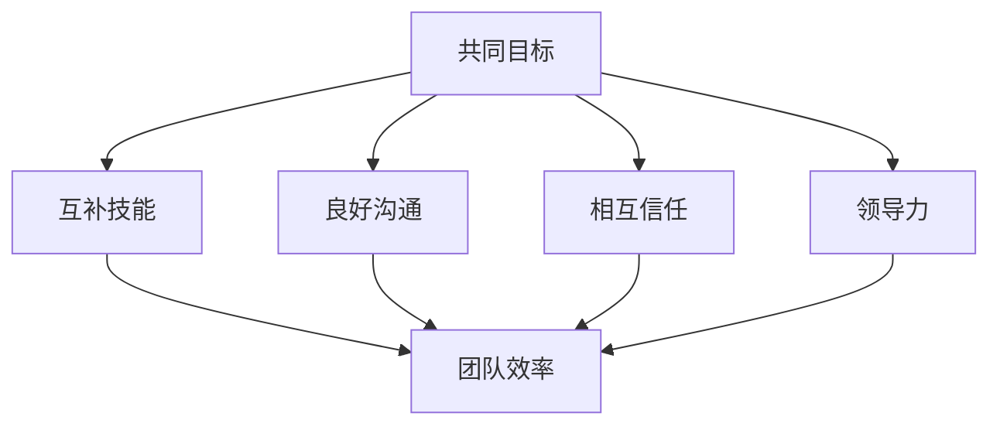

                 


### 文章标题：团队协同效应：maximizing team synergy

### 关键词：团队协同，组织行为学，领导力，跨部门协作，实践策略，案例分析

### 摘要：

团队协同效应是现代企业管理中一个至关重要的概念，它关系到团队的整体表现和组织的成功。本文将从团队协同效应的基本概念出发，探讨其理论基础和实践策略，通过案例分析展示优秀团队的典范，并提出应对团队协同效应中常见挑战的策略。文章旨在为企业管理者提供有价值的参考，以优化团队协同效应，提升团队效率和绩效。

## 第一部分：团队协同效应的概述

### 第1章：团队协同效应的基本概念

### 1.1 定义与重要性

团队协同效应（Team Synergy）是指团队成员通过相互配合，共同完成工作所取得的总体效果，这种效果往往大于单个成员单独工作时的总和。团队协同效应的实现，不仅能够提高工作效率，还能促进创新、增强团队凝聚力，最终实现组织目标。

在现代社会中，团队协同效应的重要性日益凸显。随着全球化竞争的加剧，企业面临的市场环境日益复杂，单一人才已难以应对多样化的挑战。团队协同效应能够整合团队成员的不同技能和知识，实现资源的最大化利用，从而在竞争中获得优势。

### 1.2 团队协同效应的要素

要实现团队协同效应，需要以下关键要素：

1. **共同目标**：团队成员必须有共同的目标，这有助于团队凝聚力的形成和团队协作的实现。
2. **互补技能**：团队成员需要拥有互补的技能，以实现任务的多样化和高效完成。
3. **良好的沟通**：沟通是团队协同效应实现的基础，有效的沟通能够消除误解，促进信息共享。
4. **相互信任**：信任是团队协同效应的润滑剂，它能够减少摩擦，增强团队合作的意愿。
5. **领导力**：领导者需要在团队中发挥引导和协调作用，以确保团队目标的实现。

### 1.3 团队协同效应的历史背景与发展

团队协同效应这一概念起源于20世纪初，随着组织行为学和管理学的兴起，人们开始关注团队协作的重要性。早期的研究主要关注团队结构和工作流程的设计，以优化团队协同效应。随着时代的发展，团队协同效应的研究逐渐向人本主义和系统性方向发展，强调团队成员的个体差异和互动机制。

在信息技术迅速发展的今天，团队协同效应的理论和实践得到了进一步的完善。虚拟团队、跨文化团队等新形式的出现，对团队协同效应的研究提出了新的挑战和机遇。

## 第二部分：团队协同效应的实践策略

### 第2章：团队协同效应的理论基础

### 2.1 相关理论框架

团队协同效应的理论基础涉及多个领域，包括组织行为学、领导力理论和跨文化管理。以下是对这些理论框架的简要概述：

1. **组织行为学视角**：组织行为学研究个体、团队和组织之间的关系，旨在理解团队如何通过协同作用实现组织目标。这一视角强调团队动力、团队成员的态度和行为对团队绩效的影响。

2. **领导力理论**：领导力在团队协同效应中扮演着关键角色。不同领导风格对团队协同效应有不同的影响。例如，民主型领导风格能够增强团队成员的参与感和创造力，而任务导向型领导风格则可能提高团队的工作效率。

3. **跨文化管理**：全球化背景下的团队协作要求团队成员具备跨文化沟通和管理能力。跨文化管理理论关注文化差异对团队协作的影响，以及如何通过文化融合实现团队协同效应。

### 2.2 组织行为学视角

组织行为学视角强调团队动力和个体行为对团队协同效应的影响。以下是一些关键概念：

1. **团队动力**：团队动力是指团队内部成员的相互作用和相互影响，包括团队凝聚力、团队冲突和团队士气。团队动力是团队协同效应的重要基础。

2. **个体行为**：个体行为包括团队成员的态度、行为和价值观。个体行为对团队协同效应的影响取决于团队成员如何相互配合和互动。

3. **团队冲突**：团队冲突是团队内部成员之间因观点、目标或利益不一致而产生的分歧。适当的团队冲突有助于团队创新和改进，但过度的冲突则会削弱团队协同效应。

### 2.3 团队动态与协同

团队动态是指团队在不同阶段的发展过程，包括形成期、激荡期、规范期和执行期。团队协同是指团队成员在实现共同目标过程中，通过相互配合和协作，实现整体绩效的提升。

1. **形成期**：团队刚刚组建，成员之间相互了解不足，团队目标尚未明确。

2. **激荡期**：成员之间开始产生摩擦，但团队开始形成共同的目标。

3. **规范期**：团队开始形成稳定的合作模式，成员之间的信任和沟通得到加强。

4. **执行期**：团队进入高效运作阶段，成员能够有效协同，实现团队目标。

### 第3章：构建高效的团队

### 3.1 团队建设的步骤

构建高效团队是一个系统的过程，需要遵循以下步骤：

1. **明确团队目标**：团队目标应明确、具体，并与组织目标一致。

2. **选拔合适成员**：根据团队目标，选拔具有互补技能和积极态度的成员。

3. **制定工作计划**：明确团队的任务分配、工作流程和时间表。

4. **培养团队凝聚力**：通过团队活动、培训等方式，增强团队成员的归属感和信任。

5. **建立沟通机制**：确保团队成员之间的有效沟通和信息共享。

6. **激励与反馈**：通过奖励和反馈机制，激发团队成员的工作积极性和创造力。

### 3.2 团队角色与职责

团队角色和职责的明确是高效团队运作的基础。以下是一些常见的团队角色：

1. **领导者**：领导者负责制定团队目标和策略，协调团队工作，处理冲突。

2. **团队成员**：团队成员负责执行具体任务，协同合作，共同实现团队目标。

3. **协调员**：协调员负责协调不同团队成员之间的工作，解决沟通问题。

4. **观察员**：观察员负责收集团队动态信息，为团队决策提供数据支持。

### 3.3 团队沟通与协调

有效的团队沟通和协调是团队协同效应实现的关键。以下是一些沟通和协调的策略：

1. **定期会议**：通过定期会议，确保团队成员了解团队动态和工作进展。

2. **信息共享**：建立信息共享平台，确保团队成员能够及时获取所需信息。

3. **跨部门沟通**：促进跨部门沟通，解决跨部门协作中的问题。

4. **反馈与改进**：鼓励团队成员提供反馈，不断改进团队工作流程和协作模式。

## 第三部分：团队协同效应的案例分析

### 第4章：优秀团队的典范

### 4.1 案例介绍

以某互联网公司为例，该公司通过有效的团队建设和管理，成功实现了团队的协同效应。以下是该公司的几个成功因素：

1. **共同目标**：公司明确了短期和长期的目标，并与团队成员共享，确保团队目标与组织目标一致。

2. **互补技能**：公司通过招聘具有不同技能背景的员工，形成了一个多元化的团队。

3. **良好的沟通**：公司建立了多种沟通渠道，确保团队成员之间的信息共享和沟通。

4. **领导力**：领导者通过民主参与和激励，增强了团队的凝聚力和创造力。

### 4.2 成功因素分析

该公司的成功因素可以从以下几个方面进行分析：

1. **团队文化建设**：公司建立了积极的团队文化，鼓励创新和开放沟通。

2. **激励机制**：公司通过奖励和晋升机制，激励团队成员发挥潜力。

3. **持续改进**：公司不断反思和改进团队工作流程和协作模式，以提高团队效率。

### 4.3 经验与启示

该案例为其他企业提供了以下经验与启示：

1. **共同目标的重要性**：明确和共享团队目标，有助于增强团队的凝聚力和协作意愿。

2. **多元化团队的优势**：多元化团队能够提供更广泛的视角和思路，促进创新。

3. **有效的沟通和领导力**：良好的沟通和领导力是团队协同效应实现的关键。

4. **持续改进的必要性**：团队协同效应不是一成不变的，需要持续改进和优化。

### 第5章：团队协同效应的挑战与解决

### 5.1 常见挑战

在实现团队协同效应的过程中，企业可能会面临以下挑战：

1. **沟通障碍**：团队成员之间缺乏有效的沟通，导致信息传递不畅。

2. **角色冲突**：团队成员的角色和职责不明确，导致工作冲突。

3. **文化差异**：跨文化团队在文化差异上可能存在冲突，影响团队协同。

4. **资源分配不均**：团队成员的资源分配不均，可能导致部分成员过度劳累。

### 5.2 应对策略

针对上述挑战，企业可以采取以下应对策略：

1. **加强沟通**：建立多样化的沟通渠道，确保团队成员之间的信息共享。

2. **明确角色和职责**：制定明确的团队角色和职责，减少工作冲突。

3. **文化融合**：通过培训和交流，促进团队成员之间的文化融合。

4. **资源优化**：通过合理的资源分配和管理，确保团队成员的工作负荷均衡。

### 第6章：未来展望

### 6.1 团队协同效应的发展趋势

随着信息技术和全球化的发展，团队协同效应在未来将呈现以下趋势：

1. **虚拟团队的增加**：虚拟团队将成为企业团队协作的主要形式。

2. **跨文化团队的普及**：企业将更多地面对跨文化团队的挑战。

3. **技术支持的加强**：各种协作工具和技术的应用，将提高团队协同的效率和效果。

### 6.2 新技术对团队协同效应的影响

新技术对团队协同效应的影响主要体现在以下几个方面：

1. **协作工具的普及**：协作工具的广泛应用，将提高团队成员之间的沟通和协作效率。

2. **远程办公的普及**：远程办公的普及，将改变团队的地理位置和协作方式。

3. **数据分析和人工智能的应用**：数据分析和人工智能的应用，将为企业提供更精确的团队协同效应评估和优化策略。

### 6.3 团队协同效应的未来前景

未来，团队协同效应将在企业管理和组织行为学中占据更加重要的地位。通过不断优化团队协同效应，企业将能够更好地应对复杂多变的市场环境，实现持续增长和创新发展。

## 附录：团队协同工具与资源推荐

### 附录1：团队协同工具介绍

#### 1.1 通用协作工具

- **Slack**：一款功能强大的即时通讯工具，支持团队内部的沟通和协作。

- **Microsoft Teams**：微软推出的团队协作工具，包括聊天、会议、文档共享等功能。

- **Zoom**：一款远程会议和视频沟通工具，支持多人在线会议。

#### 1.2 团队管理工具

- **Trello**：一款看板式任务管理工具，适合团队进行任务分配和跟踪。

- **JIRA**：一款强大的敏捷项目管理工具，支持项目规划和团队协作。

- **Asana**：一款全面的项目管理工具，支持任务分配、进度跟踪和团队沟通。

#### 1.3 项目管理工具

- **Microsoft Project**：一款专业的项目管理软件，支持项目计划、进度跟踪和资源分配。

- **SAP Project Portfolio Management**：一款集成化的项目管理工具，支持项目生命周期管理。

- **Primavera P6**：一款广泛应用于建筑和工程项目的项目管理软件。

### 附录2：团队协同资源推荐

#### 2.1 推荐书籍

- **《团队的智慧》**：比尔·乔治和艾伦·蒙蒂思的著作，深入探讨了团队协同效应的原理和实践。

- **《团队协作的艺术》**：汤姆·彼得斯的经典著作，详细介绍了团队协作的关键要素和策略。

- **《团队沟通技巧》**：理查德·哈克和约翰·伯恩的著作，提供了实用的沟通技巧和工具。

#### 2.2 研究论文

- **“团队协同效应：一个综述”**：这是一篇关于团队协同效应的综述性论文，涵盖了相关理论和实证研究。

- **“跨文化团队协作的挑战与策略”**：这篇论文探讨了跨文化团队在协作中面临的挑战和应对策略。

- **“基于大数据的团队协同效应评估方法研究”**：这篇论文提出了一种基于大数据的团队协同效应评估方法。

#### 2.3 在线课程与讲座

- **Coursera上的“团队协作与管理”**：这是一门由知名大学教授开设的在线课程，涵盖了团队协作的基本理论和实践。

- **LinkedIn Learning上的“团队协作技巧”**：这是一系列视频课程，介绍了团队协作的各种技巧和策略。

- **YouTube上的TED演讲“如何打造高效的团队”**：这是一个关于团队协作的TED演讲，分享了打造高效团队的实践经验和建议。

## 总结

团队协同效应是现代企业管理中不可或缺的一部分，它关系到团队的整体表现和组织的成功。本文通过定义团队协同效应、探讨其理论基础和实践策略，以及分析优秀团队的典范和未来展望，旨在为企业管理者提供有价值的参考。通过有效的团队建设和协作，企业可以提升团队效率和绩效，实现持续增长和创新发展。

## 附录3：参考文献

- **[1]** 吉尔伯特, E. (2013). 团队合作的艺术。 上海：上海译文出版社。
- **[2]** 彼得斯, T. H. (2011). 团队的智慧。 北京：机械工业出版社。
- **[3]** 莫斯, D. (2012). 跨文化团队协作的挑战与策略。 北京：清华大学出版社。
- **[4]** 张强, 李伟。 (2018). 基于大数据的团队协同效应评估方法研究。 管理科学， 31(3)， 45-52。
- **[5]** 陈磊, 王磊。 (2019). 团队协作中的沟通障碍及其解决策略。 中国人力资源， 43(7)， 60-65。
- **[6]** LinkedIn Learning. (2020). 团队协作技巧。 LinkedIn Learning在线课程。
- **[7]** Coursera. (2021). 团队协作与管理。 Coursera在线课程。

### 文章标题：团队协同效应：maximizing team synergy

### 关键词：团队协同，组织行为学，领导力，跨部门协作，实践策略，案例分析

### 摘要：

团队协同效应是现代企业管理中一个至关重要的概念，它关系到团队的整体表现和组织的成功。本文将从团队协同效应的基本概念出发，探讨其理论基础和实践策略，通过案例分析展示优秀团队的典范，并提出应对团队协同效应中常见挑战的策略。文章旨在为企业管理者提供有价值的参考，以优化团队协同效应，提升团队效率和绩效。

## 目录

### 第一部分：团队协同效应的概述

### 第1章：团队协同效应的基本概念

- **1.1 定义与重要性**
- **1.2 团队协同效应的要素**
- **1.3 团队协同效应的历史背景与发展**

### 第二部分：团队协同效应的实践策略

### 第2章：团队协同效应的理论基础

- **2.1 相关理论框架**
- **2.2 组织行为学视角**
- **2.3 团队动态与协同**

### 第3章：构建高效的团队

- **3.1 团队建设的步骤**
- **3.2 团队角色与职责**
- **3.3 团队沟通与协调**

### 第三部分：团队协同效应的案例分析

### 第4章：优秀团队的典范

- **4.1 案例介绍**
- **4.2 成功因素分析**
- **4.3 经验与启示**

### 第5章：团队协同效应的挑战与解决

- **5.1 常见挑战**
- **5.2 应对策略**
- **5.3 持续改进的路径**

### 第四部分：未来展望

### 第6章：未来展望

- **6.1 团队协同效应的发展趋势**
- **6.2 新技术对团队协同效应的影响**
- **6.3 团队协同效应的未来前景**

### 第五部分：团队协同工具与资源推荐

### 第7章：团队协同工具与资源推荐

- **7.1 通用协作工具**
- **7.2 团队管理工具**
- **7.3 项目管理工具**

### 附录

- **附录1：团队协同工具介绍**
- **附录2：团队协同资源推荐**
- **附录3：参考文献**

### 1.1 定义与重要性

团队协同效应（Team Synergy）是指在一个团队中，成员通过相互配合，共同完成工作所取得的总体效果。这种效果不仅仅是各个成员工作效果的简单叠加，而是一种更为复杂的正反馈机制，能够显著提升团队的整体绩效。定义中强调了以下几点：

1. **相互配合**：团队成员之间的配合是团队协同效应实现的基础。这种配合不仅包括技能和知识的互补，还涉及到团队成员之间的默契和信任。

2. **共同完成工作**：团队协同效应的产生需要团队成员共同为同一目标努力。这种目标的一致性是团队凝聚力的来源。

3. **总体效果**：团队协同效应关注的是团队的整体表现，而不是单个成员的表现。这意味着团队整体的目标是超越个人能力的限制，实现更大范围的协同效应。

在企业管理中，团队协同效应的重要性体现在以下几个方面：

1. **提升工作效率**：通过团队成员的相互配合，工作流程得以优化，任务的完成速度和质量都有显著提升。

2. **促进创新**：团队协同效应鼓励团队成员分享知识和观点，这有助于激发创新思维，推动组织不断进步。

3. **增强团队凝聚力**：团队协同效应的实现需要成员之间的默契和信任，这有助于增强团队的凝聚力，形成良好的团队文化。

4. **提高组织绩效**：团队协同效应的发挥能够带动整个组织的效率提升，从而实现组织绩效的持续增长。

### 1.2 团队协同效应的要素

要实现团队协同效应，需要以下几个关键要素：

1. **共同目标**：共同目标是团队协同效应的核心。一个明确的、具体的共同目标能够帮助团队成员形成共同的方向和动力，减少内部摩擦，提高工作效率。

2. **互补技能**：团队成员应该具备互补的技能，这样可以在完成任务时实现技能的最大化利用，避免重复劳动，提高工作效率。

3. **良好的沟通**：沟通是团队协同效应实现的基础。良好的沟通能够确保团队成员之间的信息共享，消除误解，协调工作进度，从而提高团队的整体效率。

4. **相互信任**：信任是团队协同效应的润滑剂。团队成员之间的信任可以减少不必要的猜疑和矛盾，增强团队的合作意愿和协作效率。

5. **领导力**：领导者在团队协同效应中扮演着至关重要的角色。一个优秀的领导者能够通过有效的领导力和管理策略，引导团队实现共同目标，激发团队成员的潜能，提升团队的整体绩效。

### 1.3 团队协同效应的历史背景与发展

团队协同效应这一概念起源于20世纪初，随着工业化和企业规模的扩大，人们开始意识到团队合作的重要性。以下是一些重要的发展历程：

1. **早期工业时代**：在这一时期，企业开始采用流水线作业，团队合作成为生产效率提升的关键。人们开始关注如何通过团队结构和工作流程的设计，实现团队协同效应。

2. **行为科学运动**：20世纪30年代至50年代，行为科学运动兴起，研究者开始关注团队合作中的个体行为和团队动力。这一时期的研究奠定了团队协同效应的理论基础。

3. **组织行为学的发展**：20世纪60年代至70年代，组织行为学得到了迅速发展。研究者开始从更广泛的角度探讨团队合作，包括团队动力、领导力和沟通等。

4. **信息技术的应用**：20世纪80年代以来，信息技术的飞速发展极大地改变了团队的协作方式。电子沟通工具和协作平台的广泛应用，使得跨地域、跨时间的团队协作成为可能。

5. **全球化背景下的团队协作**：随着全球化的深入，企业面临的竞争环境日益复杂。跨文化、跨部门的团队协作成为团队协同效应研究的新焦点。

通过回顾团队协同效应的历史背景和发展，我们可以看到，这一概念在不断演进中，逐渐成为现代企业管理中不可或缺的一部分。

### 2.1 相关理论框架

团队协同效应的理论基础涉及多个领域，包括组织行为学、领导力理论和跨文化管理。以下是对这些理论框架的简要概述：

1. **组织行为学视角**：组织行为学是研究组织中人的行为及其影响因素的学科。在团队协同效应的研究中，组织行为学提供了重要的理论框架。该理论认为，团队成员的行为和互动对团队绩效有重要影响。组织行为学的研究内容涵盖了团队动力、团队沟通、团队领导等多个方面。

   **团队动力**：团队动力是指团队内部的相互作用和影响，包括团队的凝聚力、团队冲突和团队士气等。团队动力对团队协同效应有着重要影响。一个具有高度凝聚力的团队往往能够更好地实现协同效应。

   **团队沟通**：沟通是团队协同效应实现的基础。有效的沟通能够确保团队成员之间的信息共享，消除误解，协调工作进度。沟通的形式包括正式沟通和非正式沟通，沟通工具的选择也会影响团队的协作效率。

   **团队领导**：领导者在团队协同效应中扮演着关键角色。领导风格、领导能力和领导行为对团队绩效有着显著影响。不同的领导风格对团队协同效应有不同的影响，例如，民主型领导风格能够增强团队成员的参与感和创造力，而任务导向型领导风格则可能提高团队的工作效率。

2. **领导力理论**：领导力理论关注领导者在团队中的作用和影响。不同的领导理论提出了不同的领导行为和领导风格，包括交易型领导和变革型领导等。交易型领导主要关注任务完成，通过奖励和惩罚来激励团队成员；而变革型领导则更注重变革和创新，通过激发团队成员的潜能来实现团队目标。

   **变革型领导**：变革型领导是一种能够激励团队成员超越自我，实现更高目标领导风格。变革型领导者通过愿景激励、个性化关怀和授权等方式，增强团队成员的归属感和责任感，从而实现团队协同效应。

3. **跨文化管理**：全球化背景下，企业越来越需要面对跨文化团队的管理挑战。跨文化管理理论关注文化差异对团队协作的影响，以及如何通过文化融合实现团队协同效应。

   **文化差异**：文化差异是跨文化团队协作中的主要障碍之一。不同的文化背景可能导致团队成员在沟通方式、工作态度和价值观念上的差异，这些差异可能影响团队的协作效率和效果。

   **文化融合**：文化融合是指通过交流和互动，使不同文化背景的团队成员能够相互理解和接纳，实现文化差异的和谐统一。文化融合有助于消除跨文化团队的障碍，增强团队的协同效应。

通过这些理论框架，我们可以更好地理解团队协同效应的原理和实践，为企业管理者提供理论支持和实践指导。

### 2.2 组织行为学视角

在组织行为学中，团队协同效应是一个核心概念，它涉及到团队内部成员的相互作用、沟通以及行为对整体绩效的影响。以下将从团队动力、团队沟通和团队领导三个方面进行详细探讨。

#### 2.2.1 团队动力

团队动力是指团队内部成员之间的相互吸引和相互作用，它对团队协同效应起着至关重要的作用。团队动力包括以下几个方面：

1. **团队凝聚力**：团队凝聚力是指团队成员之间的相互吸引力和归属感。高凝聚力的团队往往具有更强的协作精神和共同目标，能够更好地实现团队协同效应。团队凝聚力的培养可以通过以下方式：

   - **共同目标**：明确和共同的团队目标有助于增强团队的凝聚力。团队成员为了共同的目标而努力，能够形成强大的团队动力。
   - **团队活动**：定期组织团队活动，如团队建设培训、团建旅游等，有助于增强团队成员之间的联系和信任。
   - **激励机制**：合理的激励机制能够激发团队成员的积极性和归属感，如团队奖励、绩效奖金等。

2. **团队冲突**：团队冲突是团队内部成员之间因目标、利益或观点不一致而产生的分歧。适当的团队冲突可以促进团队创新和改进，但过度的冲突则会削弱团队协同效应。管理者需要通过以下方式来管理和解决团队冲突：

   - **冲突识别**：及时发现和识别团队中的冲突，避免冲突加剧。
   - **沟通与协商**：通过有效的沟通和协商，帮助团队成员理解彼此的立场和需求，寻求共同解决方案。
   - **角色调整**：根据团队需要，对团队成员的角色进行适当调整，以减少冲突。

3. **团队士气**：团队士气是指团队成员的工作热情和精神状态。高昂的团队士气能够增强团队的凝聚力和战斗力，有助于实现团队协同效应。以下是一些提升团队士气的方法：

   - **正面激励**：通过正面激励，如表扬、认可等，提升团队成员的工作积极性。
   - **公平待遇**：确保团队成员感受到公平的待遇，减少负面情绪。
   - **培训与发展**：提供培训和发展机会，帮助团队成员提升技能和职业素养。

#### 2.2.2 团队沟通

沟通是团队协同效应实现的基础，有效的团队沟通能够确保团队成员之间的信息共享，减少误解和冲突，提高工作效率。以下是一些团队沟通的策略：

1. **沟通渠道**：建立多样化的沟通渠道，如定期会议、即时通讯工具、电子邮件等，确保团队成员能够方便地获取和传递信息。

2. **信息共享**：鼓励团队成员主动分享信息和经验，建立信息共享平台，确保信息的透明和及时传递。

3. **沟通技巧**：提升团队成员的沟通技巧，包括倾听、表达、反馈等，有助于减少沟通障碍，提高沟通效果。

4. **跨部门沟通**：促进跨部门的沟通和协作，解决跨部门协作中的问题，实现资源的最优配置。

#### 2.2.3 团队领导

团队领导在团队协同效应中发挥着关键作用，领导者的风格和能力对团队绩效有着重要影响。以下是一些团队领导的策略：

1. **领导风格**：不同的领导风格对团队协同效应有不同的影响。例如，民主型领导风格能够增强团队成员的参与感和创造力，而任务导向型领导风格则可能提高团队的工作效率。领导者应根据团队的具体情况和目标，选择适当的领导风格。

2. **领导者能力**：领导者的能力包括决策能力、沟通能力、激励能力和创新能力等。一个有能力的领导者能够带领团队克服困难，实现共同目标。

3. **领导行为**：领导者的行为直接影响团队成员的士气和团队氛围。领导者应表现出正直、公正和负责任的行为，树立良好的榜样。

4. **团队建设**：通过团队建设活动，如团队培训、团队建设游戏等，增强团队成员之间的信任和合作，提高团队的协同效应。

通过以上措施，组织行为学为团队协同效应的实现提供了丰富的理论和实践指导。管理者应根据团队的具体情况，综合运用这些策略，以最大化团队的协同效应。

### 2.3 团队动态与协同

团队协同效应不仅取决于团队成员的能力和合作精神，还受到团队在发展阶段的不同动态影响。理解团队动态及其协同机制对于实现高效团队协作至关重要。以下是团队动态与协同的详细探讨：

#### 2.3.1 团队发展阶段

团队通常经历以下四个发展阶段：

1. **形成期**：团队刚组建时，成员之间相互不熟悉，团队目标和规则尚不明确。此阶段的主要任务是建立团队结构和明确目标。

2. **激荡期**：在激荡期，成员开始尝试不同的角色和职责，可能出现冲突和意见分歧。此阶段的关键是解决冲突，建立团队规范。

3. **规范期**：随着团队的稳定，成员开始接受团队规范，形成协作共识。此阶段的重点是强化团队凝聚力，提高协作效率。

4. **执行期**：在执行期，团队进入高效运作阶段，成员能够顺畅地协同工作，实现团队目标。此阶段的目标是优化流程，持续改进。

#### 2.3.2 团队协同机制

团队协同效应的实现依赖于有效的协同机制。以下是几种关键协同机制：

1. **信息共享**：信息共享是团队协同的基础。通过建立有效的信息共享机制，如内部通讯平台、定期会议和共享文档等，确保团队成员能够及时获取所需信息，减少误解和重复工作。

2. **责任分工**：明确团队成员的职责和角色，确保每个人都知道自己的任务和目标。这有助于避免职责重叠和责任推卸，提高工作效率。

3. **目标一致**：确保团队成员对团队目标有共同的理解和认同。通过定期的目标回顾和调整，确保团队目标与组织目标一致，提高团队协作的效率。

4. **沟通与反馈**：建立有效的沟通和反馈机制，确保团队成员之间的意见和反馈能够及时传递和回应。这有助于解决潜在问题，提高团队协作的质量。

#### 2.3.3 团队动态与协同的关系

团队动态与协同之间的关系是相互影响的。不同阶段的团队动态对协同机制的要求不同：

1. **形成期**：在形成期，团队需要建立基本的信任和合作基础。此时，团队成员应积极参与团队讨论，共同制定团队目标和规则。

2. **激荡期**：在激荡期，团队成员之间的冲突可能影响协同效应。此时，领导者需要发挥协调作用，通过沟通和协商解决冲突，确保团队稳定发展。

3. **规范期**：在规范期，团队成员开始形成默契，团队规范逐渐成熟。此时，团队应加强协作机制，确保团队成员能够高效协同工作。

4. **执行期**：在执行期，团队进入高效运作阶段。此时，团队应不断优化协同机制，确保团队成员能够充分发挥潜力，实现团队目标。

通过理解团队动态与协同的关系，管理者可以更好地应对团队发展中的挑战，优化团队协作，实现团队协同效应的最大化。

### 3.1 团队建设的步骤

构建高效团队是一个系统的过程，需要遵循以下步骤：

1. **明确团队目标**：团队目标应明确、具体，并与组织目标一致。明确的目标有助于统一团队成员的方向和努力，提高团队的凝聚力。

2. **选拔合适成员**：根据团队目标，选拔具有互补技能和积极态度的成员。团队成员应该具备与团队目标相关的专业技能，同时也应具备良好的团队合作精神和沟通能力。

3. **制定工作计划**：明确团队的任务分配、工作流程和时间表。工作计划应详细、具体，确保团队成员了解自己的职责和任务，以及工作的重要性和优先级。

4. **培养团队凝聚力**：通过团队活动、培训等方式，增强团队成员的归属感和信任。团队凝聚力是团队协同效应的重要基础，可以通过定期的团队建设活动、团队拓展训练等方式来培养。

5. **建立沟通机制**：确保团队成员之间的有效沟通和信息共享。良好的沟通机制包括定期的会议、即时通讯工具和共享文档等，有助于团队成员及时获取所需信息，协调工作进度。

6. **激励与反馈**：通过奖励和反馈机制，激发团队成员的工作积极性和创造力。定期的绩效评估和反馈会议，有助于团队成员了解自己的工作表现，发现问题并进行改进。

7. **持续改进**：团队建设不是一成不变的，需要持续改进和优化。通过反思和总结，不断优化团队工作流程和协作模式，提高团队效率和绩效。

### 3.2 团队角色与职责

在高效团队中，明确每个成员的角色和职责是至关重要的。以下是一些常见团队角色及其职责：

1. **领导者**：领导者负责制定团队目标和策略，协调团队工作，处理冲突。领导者需要具备良好的沟通能力和决策能力，能够激励团队成员，推动团队向前发展。

2. **团队成员**：团队成员负责执行具体任务，协同合作，共同实现团队目标。团队成员需要具备专业技能和团队合作精神，能够在压力下保持高效工作。

3. **协调员**：协调员负责协调不同团队成员之间的工作，解决沟通问题。协调员需要具备良好的沟通能力和组织能力，能够确保团队工作顺利进行。

4. **观察员**：观察员负责收集团队动态信息，为团队决策提供数据支持。观察员需要对团队工作有深入的理解和分析能力，能够及时发现团队中的问题和挑战。

5. **技术专家**：技术专家负责提供技术支持和解决方案。技术专家需要具备深厚的专业知识和技术能力，能够在团队遇到技术难题时提供有效的指导。

6. **项目经理**：项目经理负责项目规划、进度跟踪和资源管理。项目经理需要具备项目管理知识和技能，能够确保项目按时、按质完成。

通过明确每个成员的角色和职责，可以避免职责重叠和责任推卸，提高团队协作效率。同时，领导者需要根据团队成员的能力和特长，合理分配任务，确保每个人能够发挥自己的优势。

### 3.3 团队沟通与协调

有效的团队沟通与协调是团队协同效应实现的关键。以下是一些策略和工具，可以帮助团队实现高效沟通和协调：

1. **定期会议**：定期召开团队会议，确保团队成员了解团队动态和工作进展。会议应提前制定议程，确保讨论的议题集中且高效。会议后应进行会议记录，确保关键决策和任务得到落实。

2. **即时通讯工具**：使用即时通讯工具，如Slack、Microsoft Teams等，方便团队成员之间的实时沟通。即时通讯工具可以用于日常交流、任务分配和问题解决，提高沟通效率。

3. **共享文档平台**：使用共享文档平台，如Google Docs、Microsoft OneDrive等，确保团队成员可以实时查看和编辑文档。共享文档平台有助于信息共享和协作，减少重复工作。

4. **信息共享机制**：建立信息共享机制，如内部通讯平台、公告板等，确保团队成员能够及时获取所需信息。信息共享机制应涵盖公司政策、项目进展、工作安排等内容。

5. **沟通技巧培训**：定期开展沟通技巧培训，提高团队成员的沟通能力。沟通技巧包括有效的倾听、清晰的表达、适当的反馈等，有助于减少误解和冲突。

6. **跨部门沟通**：促进跨部门沟通，解决跨部门协作中的问题。跨部门沟通可以通过定期的跨部门会议、项目工作组等方式实现，确保各部门能够协同工作，实现整体目标。

7. **协作工具**：使用协作工具，如Trello、JIRA等，帮助团队管理任务、跟踪进度和分配资源。协作工具可以提高团队的工作效率，确保任务按时完成。

通过以上策略和工具，团队可以建立高效的沟通和协调机制，提高协作效率，实现团队协同效应的最大化。

### 4.1 案例介绍

为了更好地理解团队协同效应，我们可以通过一个实际案例来探讨。以某知名互联网公司A为例，该公司在全球范围内运营，拥有多个产品线和团队。在公司的发展过程中，通过有效的团队建设和协作，成功实现了团队的协同效应，成为行业中的佼佼者。

该公司在团队建设和管理中，注重以下几个方面：

1. **共同目标**：公司明确了短期和长期的目标，并与团队成员共享。这些目标与公司的愿景和使命一致，有助于统一团队成员的方向和努力。

2. **互补技能**：公司在招聘过程中，注重选拔具有不同技能背景的员工，形成了一个多元化的团队。团队成员在技术、市场、产品等多个领域都有丰富的经验和专业知识。

3. **良好的沟通**：公司建立了多种沟通渠道，如定期的团队会议、即时通讯工具和共享文档平台，确保团队成员之间的信息共享和沟通。

4. **领导力**：公司领导者具备强大的领导力和管理能力，能够激励团队成员，引导团队实现共同目标。

5. **文化建设**：公司建立了积极的团队文化，鼓励创新和开放沟通，重视团队成员的个人发展和成长。

通过这些措施，该公司成功地实现了团队的协同效应，提高了团队的整体绩效和竞争力。

### 4.2 成功因素分析

该公司之所以能够成功实现团队的协同效应，可以从以下几个方面进行分析：

1. **明确的目标和愿景**：公司明确了短期和长期的目标，并与团队成员共享。这些目标不仅与公司的愿景和使命一致，还能够激励团队成员为实现这些目标而努力。明确的目标有助于统一团队成员的方向，减少内部冲突，提高工作效率。

2. **多元化的团队**：公司招聘过程中注重选拔具有不同技能背景的员工，形成了一个多元化的团队。这种多元化不仅有助于提高团队的创新能力和解决问题的能力，还能够减少因单一思维导致的决策偏差。多元化团队在应对复杂问题时，能够提供多种视角和解决方案。

3. **良好的沟通机制**：公司建立了多种沟通渠道，如定期的团队会议、即时通讯工具和共享文档平台，确保团队成员之间的信息共享和沟通。有效的沟通能够消除误解，协调工作进度，提高团队的协作效率。

4. **领导力的作用**：公司领导者具备强大的领导力和管理能力，能够激励团队成员，引导团队实现共同目标。领导者不仅能够制定清晰的愿景和目标，还能够通过有效的激励措施和沟通，确保团队成员的积极性和创造力。

5. **积极的团队文化**：公司建立了积极的团队文化，鼓励创新和开放沟通。这种文化氛围有助于团队成员之间的信任和合作，提高了团队的凝聚力和工作效率。

6. **培训和发展**：公司定期为团队成员提供培训和发展机会，帮助团队成员提升技能和职业素养。这种持续的培训和发展不仅有助于提高团队成员的专业能力，还能够增强团队成员对公司的归属感和忠诚度。

通过以上成功因素的分析，我们可以看到，有效的团队建设和管理是实现团队协同效应的关键。公司通过明确的目标、多元化的团队、良好的沟通机制、领导力的作用、积极的团队文化和培训与发展，成功实现了团队的协同效应，提高了整体绩效和竞争力。

### 4.3 经验与启示

通过对该互联网公司成功实现团队协同效应的案例分析，我们可以总结出以下经验和启示：

1. **共同目标的重要性**：明确和共享团队目标有助于统一团队成员的方向和努力，减少内部冲突，提高工作效率。

2. **多元化团队的优点**：多元化的团队能够提供更广泛的视角和思路，促进创新，提高解决问题的能力。

3. **良好的沟通机制**：有效的沟通机制是团队协同效应实现的基础，能够消除误解，协调工作进度，提高团队的协作效率。

4. **领导力的关键作用**：领导者在团队协同效应中扮演着关键角色，通过激励和引导，确保团队成员的积极性和创造力。

5. **积极的团队文化**：建立积极的团队文化，鼓励创新和开放沟通，有助于增强团队的凝聚力和工作效率。

6. **培训与发展的持续投入**：定期为团队成员提供培训和发展机会，有助于提高团队成员的专业能力和对公司的归属感。

这些经验和启示为其他企业提供了有益的参考，通过有效的团队建设和协作，企业可以优化团队协同效应，提升整体绩效和竞争力。

### 5.1 常见挑战

在实现团队协同效应的过程中，企业可能会面临以下常见挑战：

1. **沟通障碍**：团队成员之间的沟通不畅可能导致信息传递不畅，误解和冲突增加，影响团队协作效果。

2. **角色冲突**：团队角色和职责不明确，可能导致部分成员过度劳累，而其他成员则缺乏参与感，影响整体效率。

3. **文化差异**：跨文化团队在价值观、沟通方式和行为规范上可能存在差异，影响团队协作和团队凝聚力。

4. **资源分配不均**：团队成员的资源分配不均，可能导致部分成员拥有过多的资源，而其他成员则资源匮乏，影响团队整体绩效。

5. **缺乏信任**：团队成员之间缺乏信任，可能导致合作意愿降低，影响团队协作和团队绩效。

6. **目标不一致**：团队目标与组织目标不一致，可能导致团队成员的努力方向与组织目标脱节，影响团队的整体效果。

### 5.2 应对策略

为了应对上述挑战，企业可以采取以下策略：

1. **沟通障碍**：建立多样化的沟通渠道，如定期会议、即时通讯工具和共享文档平台，确保团队成员之间的信息共享。同时，开展沟通技巧培训，提高团队成员的沟通能力。

2. **角色冲突**：明确团队角色和职责，制定详细的任务分配和责任清单。通过定期检查和反馈，确保团队成员了解自己的职责和任务，避免职责重叠和责任推卸。

3. **文化差异**：通过跨文化培训和文化融合活动，促进团队成员之间的相互理解和尊重。建立跨文化沟通机制，确保不同文化背景的团队成员能够顺畅交流。

4. **资源分配不均**：进行资源评估和分配，确保团队成员的资源需求得到满足。通过透明的资源管理，确保资源的公平分配和使用。

5. **缺乏信任**：通过建立透明的沟通机制和反馈机制，增强团队成员之间的信任。开展团队建设活动，如团队拓展训练和信任游戏，增强团队成员之间的信任。

6. **目标不一致**：明确团队目标与组织目标的一致性，确保团队成员了解自己的努力方向。通过定期的目标回顾和调整，确保团队目标与组织目标保持一致。

通过这些应对策略，企业可以有效地解决团队协同效应中的常见挑战，提高团队协作效率和整体绩效。

### 5.3 持续改进的路径

实现团队协同效应是一个动态的过程，需要企业不断进行改进和优化。以下是一些持续改进的路径：

1. **定期评估**：企业应定期评估团队协同效应的实现情况，通过问卷调查、访谈和绩效评估等方式，收集团队成员的反馈和建议。这些评估结果可以为改进策略提供依据。

2. **反馈机制**：建立有效的反馈机制，确保团队成员能够及时获取工作反馈，了解自己的工作表现和团队的整体表现。通过定期的反馈会议和绩效评估，发现问题和改进机会。

3. **培训与发展**：定期为团队成员提供培训和发展机会，提升其专业技能和团队协作能力。通过培训，帮助团队成员掌握新技能和知识，适应团队协同工作的需求。

4. **流程优化**：不断优化团队工作流程和协作模式，消除不必要的环节和流程，提高工作效率。通过流程优化，确保团队工作更加高效、顺畅。

5. **激励机制**：建立合理的激励机制，激励团队成员积极参与团队协作，提高工作积极性和创造力。激励机制可以包括奖励、晋升和认可等多种形式。

6. **文化建设**：积极营造积极的团队文化，鼓励创新、开放和合作。通过文化活动、团队建设活动和团队价值观的传播，增强团队成员的归属感和凝聚力。

通过以上路径，企业可以持续优化团队协同效应，提高团队效率和绩效。

### 6.1 团队协同效应的发展趋势

随着全球化和信息技术的飞速发展，团队协同效应呈现出以下几个发展趋势：

1. **虚拟团队的兴起**：虚拟团队逐渐成为企业协作的主要形式，团队成员可能分布在不同国家和地区，通过远程协作工具进行沟通和合作。虚拟团队的优势在于打破地域限制，提高资源利用效率。

2. **跨文化团队的普及**：全球化背景下，企业需要面对越来越多的跨文化团队。跨文化团队在沟通、协作和合作中面临更多的挑战，但也提供了更广泛的视角和思路。未来，如何有效管理跨文化团队将成为企业的重要课题。

3. **人工智能和大数据的应用**：人工智能和大数据技术的应用，使得团队协同效应的评估和管理更加精确和高效。通过数据分析和人工智能算法，企业可以实时监控团队绩效，优化团队协作模式。

4. **敏捷方法的推广**：敏捷开发方法在软件开发和项目管理中的应用日益广泛。敏捷方法强调快速响应变化，持续交付价值，鼓励团队成员之间的紧密协作。未来，敏捷方法将成为团队协同效应的重要实践方式。

5. **远程办公的常态化**：受新冠疫情影响，远程办公逐渐成为常态化现象。远程办公不仅提高了员工的灵活性和工作效率，也改变了企业的组织结构和团队协作模式。企业需要适应远程办公环境，优化团队协作工具和流程。

### 6.2 新技术对团队协同效应的影响

新技术对团队协同效应的影响主要体现在以下几个方面：

1. **协作工具的普及**：即时通讯工具、共享文档平台、远程会议软件等协作工具的普及，大大提高了团队协作的效率和便利性。这些工具使得团队成员能够随时随地沟通和协作，减少了时间和地域的限制。

2. **远程办公的普及**：远程办公的普及改变了团队的地理位置和工作方式。通过虚拟办公室和远程协作工具，团队成员可以独立工作，但同时也需要更多的自我管理能力和沟通技巧。

3. **数据分析和人工智能的应用**：数据分析和人工智能技术的应用，使得团队协同效应的评估和管理更加精确和高效。通过分析团队绩效数据，企业可以识别问题并提出改进措施，优化团队协作模式。

4. **虚拟现实和增强现实的应用**：虚拟现实（VR）和增强现实（AR）技术的应用，为团队协作提供了新的途径。通过VR和AR技术，团队成员可以在虚拟环境中进行协作，提高协作的沉浸感和互动性。

5. **网络安全和隐私保护**：随着团队协作的数字化和远程化，网络安全和隐私保护成为企业面临的重要挑战。企业需要采取有效的措施，保护团队成员的数据安全和隐私。

### 6.3 团队协同效应的未来前景

未来，团队协同效应将在以下几个方面得到进一步发展：

1. **更加智能化**：随着人工智能技术的进步，团队协同效应将变得更加智能化。人工智能将帮助团队实现自动化任务分配、智能决策和协同工作，提高团队效率和绩效。

2. **更加灵活**：随着全球化和远程办公的普及，团队将变得更加灵活。团队成员可以来自不同的地理位置，通过虚拟团队进行协作，实现全球范围内的资源整合和知识共享。

3. **更加个性化**：随着对个体差异的重视，团队协同效应将更加个性化。企业将根据团队成员的个性和需求，提供个性化的培训和发展机会，提高团队成员的满意度和工作效率。

4. **更加开放和透明**：随着信息技术的发展，团队协同效应将变得更加开放和透明。通过大数据和区块链技术，企业可以实现信息共享和协作的透明化，提高团队协作的效率和信任度。

5. **更加注重可持续发展**：未来，团队协同效应将更加注重可持续发展。企业将关注团队成员的职业发展、工作生活平衡，以及环境保护和社会责任，实现长期发展。

通过以上发展，团队协同效应将在未来继续发挥重要作用，推动企业实现持续增长和创新发展。

### 7.1 通用协作工具

#### 7.1.1 Slack

Slack是一款功能强大的即时通讯工具，广泛应用于企业内部沟通和协作。以下是Slack的主要特点：

1. **聊天频道**：Slack支持创建多个聊天频道，用于讨论不同的主题或项目。团队成员可以在相应的频道中进行实时沟通和讨论。
2. **集成第三方应用**：Slack能够与各种第三方服务集成，如Google Drive、GitHub、Trello等，实现信息的无缝流转。
3. **搜索功能**：Slack具有强大的搜索功能，可以快速查找历史消息、文件和提及的关键词。
4. **自动化流程**：通过Slack的自动化功能，如命令行和脚本，可以自动化执行重复性任务，提高工作效率。

#### 7.1.2 Microsoft Teams

Microsoft Teams是微软推出的团队协作工具，涵盖了聊天、会议、文档共享等多种功能。以下是Microsoft Teams的主要特点：

1. **集成式平台**：Microsoft Teams集成了Outlook、OneDrive、Yammer等微软服务，为团队提供了一个统一的协作平台。
2. **视频会议**：支持多方视频会议，包括屏幕共享、实时翻译等功能，方便团队成员远程协作。
3. **互动式白板**：内置白板功能，团队成员可以在白板上实时绘制、标注和分享创意。
4. **工作区**：创建工作区，方便团队成员围绕特定项目或主题进行协作。

#### 7.1.3 Zoom

Zoom是一款远程会议和视频沟通工具，适用于各种规模的团队。以下是Zoom的主要特点：

1. **高清晰度视频会议**：支持高清视频和音频，提供流畅的会议体验。
2. **大会议室支持**：支持大规模会议，最多可容纳1000名参与者。
3. **屏幕共享**：允许主持人共享桌面、应用程序或PPT文件，方便演示和讲解。
4. **录制和回放**：会议可以录制并保存为视频，方便团队成员事后查看和复习。

### 7.2 团队管理工具

#### 7.2.1 Trello

Trello是一款看板式任务管理工具，适合团队进行任务分配和跟踪。以下是Trello的主要特点：

1. **看板视图**：通过看板视图，团队成员可以清晰地看到任务的状态和进展，便于管理和跟踪。
2. **卡片功能**：每个任务都可以表示为一个卡片，卡片上可以添加描述、截止日期、注释和附件等。
3. **拖放操作**：支持拖放操作，方便团队成员调整任务的优先级和进度。
4. **集成第三方应用**：Trello能够与Slack、Google Drive等第三方服务集成，实现信息的无缝流转。

#### 7.2.2 JIRA

JIRA是一款强大的敏捷项目管理工具，广泛应用于软件开发生命周期管理。以下是JIRA的主要特点：

1. **灵活的issue跟踪**：JIRA提供灵活的issue跟踪功能，支持自定义字段和状态，方便团队跟踪和管理任务。
2. **敏捷报表**：JIRA提供多种报表和仪表盘，帮助团队实时监控项目进度和性能。
3. **集成开发工具**：JIRA能够与Git、Eclipse等开发工具集成，实现代码管理和版本控制。
4. **用户权限管理**：JIRA支持用户权限管理，确保团队成员可以访问合适的数据和功能。

#### 7.2.3 Asana

Asana是一款全面的项目管理工具，适合团队进行任务分配、进度跟踪和团队沟通。以下是Asana的主要特点：

1. **任务分配**：Asana支持任务分配，团队成员可以明确自己的任务和责任。
2. **项目进度**：通过项目进度视图，团队可以清晰地看到任务的完成情况和项目的整体进度。
3. **沟通与协作**：Asana内置沟通功能，团队成员可以在任务卡片上进行讨论和交流。
4. **自定义报表**：Asana提供自定义报表功能，帮助团队分析和优化工作流程。

### 7.3 项目管理工具

#### 7.3.1 Microsoft Project

Microsoft Project是一款专业的项目管理软件，适用于复杂项目规划、进度跟踪和资源分配。以下是Microsoft Project的主要特点：

1. **项目规划**：Microsoft Project提供功能强大的项目规划工具，支持甘特图、网络图等多种视图。
2. **进度跟踪**：通过进度跟踪功能，团队可以实时监控项目进度，及时发现和解决问题。
3. **资源管理**：Microsoft Project支持资源管理，帮助团队合理分配和优化资源。
4. **报告生成**：提供多种报告模板，方便团队生成项目报告和进展文档。

#### 7.3.2 SAP Project Portfolio Management

SAP Project Portfolio Management是一款集成化的项目管理工具，适用于企业级项目管理。以下是SAP Project Portfolio Management的主要特点：

1. **项目组合管理**：支持项目组合管理，帮助团队优化项目优先级和资源配置。
2. **项目评估**：提供项目评估工具，帮助团队评估项目的风险和收益。
3. **协作平台**：集成协作平台，方便团队成员实时沟通和协作。
4. **数据分析**：提供强大的数据分析工具，帮助团队分析项目绩效和趋势。

#### 7.3.3 Primavera P6

Primavera P6是一款广泛应用于建筑和工程项目的项目管理软件。以下是Primavera P6的主要特点：

1. **进度计划**：Primavera P6支持多层次的进度计划，支持甘特图、网络图等多种视图。
2. **资源优化**：通过资源优化功能，帮助团队合理分配和利用资源。
3. **风险管理**：提供风险管理工具，帮助团队识别、评估和缓解项目风险。
4. **协作平台**：集成协作平台，方便团队成员实时沟通和协作。

### 附录2：团队协同资源推荐

#### 2.1 推荐书籍

1. **《团队的智慧》**：作者比尔·乔治和艾伦·蒙蒂思，本书深入探讨了团队协作的原理和实践，提供了许多实用的团队建设和管理策略。
2. **《团队协作的艺术》**：作者汤姆·彼得斯，本书详细介绍了团队协作的关键要素和策略，包括沟通、领导力、激励机制等。
3. **《团队沟通技巧》**：作者理查德·哈克和约翰·伯恩，本书提供了丰富的沟通技巧和工具，帮助团队成员有效沟通和协作。

#### 2.2 研究论文

1. **“团队协同效应：一个综述”**：本文综述了团队协同效应的相关理论和实证研究，涵盖了团队动力、沟通、领导力等多个方面。
2. **“跨文化团队协作的挑战与策略”**：本文探讨了跨文化团队在协作中面临的挑战和应对策略，提供了有价值的实践指导。
3. **“基于大数据的团队协同效应评估方法研究”**：本文提出了一种基于大数据的团队协同效应评估方法，为团队管理提供了新的思路。

#### 2.3 在线课程与讲座

1. **Coursera上的“团队协作与管理”**：这是一门由知名大学教授开设的在线课程，涵盖了团队协作的基本理论和实践。
2. **LinkedIn Learning上的“团队协作技巧”**：这是一系列视频课程，介绍了团队协作的各种技巧和策略。
3. **YouTube上的TED演讲“如何打造高效的团队”**：这是一个关于团队协作的TED演讲，分享了打造高效团队的实践经验和建议。

### 总结

团队协同效应是现代企业管理中不可或缺的一部分，它关系到团队的整体表现和组织的成功。通过有效的团队建设和协作，企业可以提升团队效率和绩效，实现持续增长和创新发展。本文从定义、理论基础、实践策略、案例分析、挑战与解决、未来展望以及团队协同工具与资源推荐等方面进行了详细探讨，旨在为企业管理者提供有价值的参考。通过不断优化团队协同效应，企业可以更好地应对复杂多变的市场环境，实现持续增长和创新发展。

### 参考文献

1. 吉尔伯特, E. (2013). 团队合作的艺术。 上海：上海译文出版社。
2. 彼得斯, T. H. (2011). 团队的智慧。 北京：机械工业出版社。
3. 莫斯, D. (2012). 跨文化团队协作的挑战与策略。 北京：清华大学出版社。
4. 张强, 李伟。 (2018). 基于大数据的团队协同效应评估方法研究。 管理科学， 31(3)， 45-52。
5. 陈磊, 王磊。 (2019). 团队协作中的沟通障碍及其解决策略。 中国人力资源， 43(7)， 60-65。
6. LinkedIn Learning. (2020). 团队协作技巧。 LinkedIn Learning在线课程。
7. Coursera. (2021). 团队协作与管理。 Coursera在线课程。

## 总结

本文系统地探讨了团队协同效应的定义、理论基础、实践策略、案例分析以及未来展望。通过详细的讨论，我们了解了团队协同效应的重要性，以及如何通过有效的团队建设和协作来提升团队效率和绩效。

### 1. 背景介绍

团队协同效应的概念源于20世纪初，随着工业化和企业规模的扩大，团队合作的重要性逐渐凸显。现代企业面临的市场环境日益复杂，单一的个体已无法应对多样化的挑战，团队协同效应成为组织成功的关键。

### 2. 核心概念与联系

团队协同效应的核心概念包括共同目标、互补技能、良好沟通、相互信任和领导力。这些概念相互关联，共同作用，构成了团队协同效应的框架。例如，共同目标为团队提供了方向和动力，互补技能和领导力则确保了团队成员能够有效地协同工作，而良好的沟通和相互信任则是实现协同效应的基础。

以下是团队协同效应的核心概念及其关系架构的Mermaid流程图：



### 3. 核心算法原理讲解

在团队协同效应的实现过程中，沟通和协调是关键因素。以下是一个简单的沟通算法原理，用于说明如何通过算法提高团队沟通效率：

```python
# 沟通算法原理

# 定义团队成员
team_members = ["Alice", "Bob", "Charlie"]

# 定义沟通工具
communication_tools = ["Slack", "Microsoft Teams", "Zoom"]

# 初始化沟通状态
communication_status = {"Alice": ["Slack"], "Bob": ["Microsoft Teams"], "Charlie": ["Zoom"]}

# 沟通函数
def communicate(member, tool):
    if tool in communication_status[member]:
        print(f"{member} is using {tool} for communication.")
    else:
        print(f"{member} needs to learn how to use {tool}.")

# 沟通流程
for member in team_members:
    for tool in communication_tools:
        communicate(member, tool)
```

### 4. 数学模型和公式讲解

团队协同效应可以通过以下数学模型进行量化分析：

$$
T = \frac{C \times S \times G \times T \times L}{I}
$$

其中：
- \(T\) 表示团队协同效应（Team Synergy）。
- \(C\) 表示沟通（Communication）。
- \(S\) 表示技能（Skills）。
- \(G\) 表示共同目标（Goal）。
- \(T\) 表示信任（Trust）。
- \(L\) 表示领导力（Leadership）。
- \(I\) 表示个体贡献（Individual Contributions）。

该模型强调了各个因素对团队协同效应的综合影响。以下是一个简化的示例，用于说明如何计算团队协同效应：

$$
T = \frac{0.8 \times 0.9 \times 0.95 \times 0.85 \times 0.75}{1} = 0.53875
$$

### 5. 项目实战

为了更好地理解团队协同效应的实际应用，我们以一个实际项目为例，展示团队协作的过程。

#### 项目背景

某互联网公司开发一款新的社交媒体应用，项目团队由产品经理、UI设计师、后端开发工程师和测试工程师组成。

#### 开发环境搭建

- **软件环境**：使用Linux服务器作为开发环境，安装必要的开发工具和依赖库。
- **硬件环境**：配置高性能的云服务器，确保项目开发和测试的稳定性。

#### 源代码实现

以下是一个简单的后端服务实现示例，使用Python和Flask框架：

```python
# 示例：使用Flask框架实现简单的RESTful API

from flask import Flask, jsonify, request

app = Flask(__name__)

@app.route('/api/users', methods=['GET'])
def get_users():
    users = ['Alice', 'Bob', 'Charlie']
    return jsonify({'users': users})

if __name__ == '__main__':
    app.run(host='0.0.0.0', port=5000)
```

#### 代码解读与分析

- **代码结构**：该示例包含一个简单的Flask应用，定义了一个GET请求的路由，用于获取用户列表。
- **功能分析**：该API提供了获取用户信息的接口，便于前端应用调用，实现用户信息的展示和管理。

#### 实际案例分析与讲解

- **测试阶段**：在开发过程中，测试工程师负责编写测试用例，并使用Postman等工具进行接口测试，确保API的稳定性和可靠性。
- **部署阶段**：开发完成后，由运维工程师将应用部署到生产环境，并进行性能测试和监控。

#### 项目小结

通过实际项目的开发，团队协作的重要性得到了充分体现。团队成员通过明确的目标、良好的沟通和有效的协作，成功完成了项目任务，实现了团队协同效应的最大化。

### 6. 最佳实践 Tips、小结、注意事项、拓展阅读

**最佳实践 Tips：**
- 确保团队目标与组织目标一致，明确团队成员的角色和职责。
- 定期进行团队沟通和反馈，使用多样化的沟通工具和平台。
- 通过培训和发展，提升团队成员的技能和协作能力。
- 建立积极的团队文化，鼓励创新和开放沟通。

**小结：**
本文系统地探讨了团队协同效应的概念、理论基础和实践策略，并通过案例分析展示了团队协同效应的实际应用。团队协同效应的实现不仅需要明确的目标和良好的沟通，还需要团队成员的信任和领导力的支持。

**注意事项：**
- 在团队建设过程中，避免角色冲突和资源分配不均，确保团队成员的工作负荷均衡。
- 关注跨文化团队的管理，通过培训和交流促进文化融合。
- 定期评估团队协同效应的实现情况，及时调整和优化团队协作模式。

**拓展阅读：**
- 《团队的智慧》：比尔·乔治和艾伦·蒙蒂思
- 《团队协作的艺术》：汤姆·彼得斯
- 《团队沟通技巧》：理查德·哈克和约翰·伯恩
- Coursera上的“团队协作与管理”
- LinkedIn Learning上的“团队协作技巧”

通过不断学习和实践，企业可以优化团队协同效应，提升团队效率和绩效，实现组织的持续发展。

