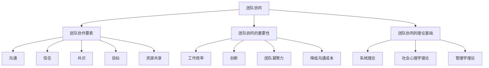

                 

### 背景介绍

在当今快速发展的信息技术时代，团队协作与协同工作已成为各行各业取得成功的关键因素。无论是软件开发、项目管理，还是市场营销、客户服务，一个高效的团队协同能力能够显著提升整体工作效率，实现更快的创新、更高效的决策和更高的业务成果。

随着企业规模的扩大和业务复杂度的增加，团队内部和跨部门之间的沟通与协作变得尤为重要。然而，在实际工作中，团队协同往往面临诸多挑战。例如，信息传递不畅、任务分配不均、沟通障碍和冲突等，这些问题不仅会降低工作效率，还会影响团队士气和员工满意度。

为了应对这些挑战，现代企业开始寻求各种团队协同工具和方法，以优化团队内部和外部的协作流程。从传统的电子邮件和即时通讯工具，到现代化的项目管理软件和协作平台，这些工具都在不同程度上提升了团队的工作效率和协作效果。

然而，单纯依赖工具并不能解决所有问题。团队协同还需要从管理策略、沟通技巧、文化建设等多个方面进行全面提升。只有这样，才能确保团队在复杂多变的环境中保持高效运行，实现持续的业务增长。

本篇文章将围绕“团队协同：提升整体工作效率”这一主题，系统性地探讨团队协同的核心概念、理论基础、实践方法和最佳实践。通过深入分析团队协同的各个方面，我们希望能够为读者提供一套实用的团队协同策略，帮助他们在实际工作中提高团队整体工作效率。

### 核心概念与联系

首先，我们需要明确一些核心概念，并了解它们之间的联系，以便更好地理解团队协同的本质。

**团队协同的概念**：团队协同是指团队成员通过共同的目标和任务，利用各自的优势和专长，相互配合、相互支持，以实现团队整体目标的过程。它不仅仅是简单的任务分工和协作，更是一种深层次的合作与互动。

**团队协作的要素**：团队协作的成功依赖于多个关键要素，包括沟通、信任、共识、目标和资源共享等。这些要素相互作用，共同支撑团队协同的运行。

**团队协同的重要性**：团队协同的重要性体现在以下几个方面：
1. **提升工作效率**：通过有效的协同，团队成员能够快速响应任务，减少重复工作和冗余步骤，从而提高整体工作效率。
2. **促进创新**：团队协同鼓励成员之间的知识共享和思维碰撞，有助于激发创新思维，推动团队不断进步。
3. **增强团队凝聚力**：协同工作能够增强团队成员之间的联系和信任，提高团队凝聚力和战斗力。
4. **降低沟通成本**：良好的团队协同能够减少因沟通不畅导致的误解和冲突，降低沟通成本。

**团队协同的理论基础**：团队协同的理论基础主要包括系统理论、社会心理学理论和管理学理论等。系统理论强调团队作为一个整体，其行为和结果是各个部分相互作用的结果。社会心理学理论则关注团队成员之间的心理互动，包括信任、认同和冲突管理等。管理学理论则提供了一系列团队管理的策略和方法，帮助团队实现高效协同。

**核心概念之间的关系架构**：为了更好地理解这些核心概念之间的关系，我们可以使用Mermaid流程图来展示它们之间的联系。

通过这个流程图，我们可以清晰地看到团队协同的概念、协作要素、协同重要性以及理论基础之间的关系。这些概念和理论相互支持，共同构成了团队协同的完整框架。

### 提升团队工作效率的方法和工具

要提升团队工作效率，除了良好的团队协同，还需要一系列方法和工具的支持。以下将介绍几种常用的方法和技术，以帮助团队在协作中更高效地完成任务。

**1. 沟通与协作技巧**

有效的沟通和协作是团队高效工作的基础。以下是一些提升沟通和协作的技巧：

- **明确沟通目标**：在进行沟通前，明确沟通的目标和内容，确保双方对任务和要求有清晰的理解。
- **倾听与回应**：积极倾听团队成员的意见和建议，及时给予反馈和回应，避免误解和沟通障碍。
- **定期会议**：定期召开团队会议，讨论项目进展、解决问题和分配任务，确保团队成员之间的信息同步。
- **透明沟通**：保持沟通的透明度，让所有成员都能了解到项目的最新进展和变化，减少不必要的猜测和担忧。

**2. 团队管理策略**

团队管理策略是提升团队工作效率的关键。以下是一些有效的团队管理策略：

- **目标设定**：为团队设定明确的、可衡量的目标，确保团队成员都有清晰的方向和努力的目标。
- **任务分配**：根据团队成员的技能和兴趣，合理分配任务，充分发挥每个人的潜力。
- **绩效评估**：定期对团队成员的工作进行评估，及时反馈和激励，帮助团队成员持续改进。
- **团队建设**：通过团队建设活动，增强团队成员之间的信任和合作，提高团队凝聚力。

**3. 团队协同工具**

在现代工作中，团队协同工具已经成为提高团队工作效率的重要手段。以下是一些常用的团队协同工具：

- **即时通讯工具**：如 Slack、Microsoft Teams、WhatsApp 等，方便团队成员进行实时沟通和协作。
- **项目管理工具**：如 Trello、Asana、JIRA 等，帮助团队管理项目进度、任务分配和团队协作。
- **文档共享平台**：如 Google Drive、Dropbox、OneDrive 等，方便团队成员共享文档、编辑文件和协作。
- **视频会议工具**：如 Zoom、Microsoft Teams、Skype 等，支持远程团队的实时沟通和协作。

**4. 实践案例**

为了更好地理解这些方法和工具的应用，以下是一些实际案例：

- **案例一**：某科技公司采用 Slack 作为内部沟通工具，通过渠道化的沟通方式，将不同部门的成员聚集在一起，实现信息的高效传递和任务的高效分配。同时，利用 Trello 管理项目进度，确保每个任务的按时完成。
- **案例二**：某营销团队使用 Google Drive 共享文档，所有成员都可以实时编辑和更新文件，提高协作效率。同时，通过定期的 Zoom 会议，团队成员可以及时讨论项目进展和解决方案。

通过这些实践案例，我们可以看到，提升团队工作效率的方法和工具在实际应用中取得了显著的效果。

### 团队协作中的沟通障碍与冲突解决

在团队协作中，沟通障碍和冲突是常见的挑战，这些因素不仅会影响团队的工作效率，还可能破坏团队的凝聚力和士气。因此，理解和解决这些问题是提升团队协作效果的关键。

**1. 沟通障碍的类型**

团队协作中的沟通障碍主要分为以下几种类型：

- **信息不对称**：团队成员之间获取的信息不同，导致对任务的认知和理解存在差异。
- **语言障碍**：团队成员的语言能力差异，可能导致沟通不畅和信息误解。
- **文化差异**：来自不同文化背景的团队成员，可能在沟通方式和行为习惯上存在差异，影响协作效果。
- **沟通渠道不畅**：团队内部或跨部门之间的沟通渠道不畅通，信息传递不及时。

**2. 解决沟通障碍的策略**

针对上述沟通障碍，可以采取以下策略来改善沟通：

- **建立统一的沟通平台**：选择适合团队的沟通工具，如即时通讯软件、项目管理工具等，确保信息能够高效传递。
- **明确沟通规范**：制定团队内部的沟通规范，如语言使用、信息格式和沟通频率等，减少误解和冲突。
- **加强跨部门沟通**：通过定期会议、工作坊等形式，加强跨部门之间的沟通和协作，促进信息共享。
- **提供沟通培训**：为团队成员提供沟通技巧培训，提高他们的沟通能力和沟通效果。

**3. 冲突解决策略**

在团队协作中，冲突是不可避免的。有效的冲突解决策略可以帮助团队将冲突转化为积极的动力。以下是一些常用的冲突解决策略：

- **理解差异**：尊重团队成员的差异，理解他们的观点和立场，避免因为差异而产生不必要的冲突。
- **倾听与表达**：鼓励团队成员表达自己的观点，同时倾听他人的意见，通过对话和沟通解决分歧。
- **调解与妥协**：当冲突无法通过讨论解决时，可以寻求第三方调解或通过妥协达成共识。
- **建立规则**：在团队内部建立明确的规则和流程，避免因规则不清而产生的冲突。

**4. 案例分析**

以下是一个团队协作中沟通障碍和冲突解决的案例：

**案例背景**：某科技公司的产品开发团队在项目推进过程中，由于团队成员来自不同的背景和部门，沟通不畅导致项目进度滞后，团队士气受到影响。

**解决过程**：
1. **识别问题**：项目经理通过定期团队会议，发现沟通障碍和冲突是主要问题。
2. **建立沟通平台**：引入 Slack 作为团队沟通工具，确保信息及时传递。
3. **明确沟通规范**：制定团队沟通规范，如使用统一的术语和文档格式。
4. **沟通培训**：为团队成员提供沟通技巧培训，提高沟通效果。
5. **解决冲突**：针对团队内部的冲突，通过对话和调解，达成共识，确保项目顺利进行。

通过上述策略，团队逐步解决了沟通障碍和冲突，项目进度恢复正常，团队士气得到了显著提升。

### 跨部门协作与流程优化

跨部门协作是现代企业中不可或缺的一部分，特别是在复杂项目和大型组织内部。有效的跨部门协作能够提高整体工作效率，促进资源的合理分配和项目的顺利推进。以下是一些跨部门协作的挑战和流程优化的方法。

**1. 跨部门协作的挑战**

跨部门协作面临以下挑战：

- **信息壁垒**：不同部门之间存在信息壁垒，导致沟通不畅和信息不对称。
- **职责不清**：部门职责划分不明确，导致任务分配不均和责任推诿。
- **利益冲突**：部门间利益分配不均，可能导致协作不积极。
- **文化差异**：不同部门文化差异，影响团队合作和协作效率。

**2. 流程优化的方法**

为了克服跨部门协作的挑战，可以采取以下流程优化方法：

- **明确职责分工**：制定明确的职责分工，确保每个部门都知道自己的任务和责任，避免任务重叠和责任推诿。
- **建立协同机制**：建立跨部门协同机制，如定期会议、联合项目组等，加强部门间的沟通和协作。
- **流程标准化**：制定标准化流程，确保各部门按照统一的标准进行操作，减少因流程不一致导致的协作问题。
- **信息共享平台**：建立信息共享平台，如企业内部网、协同办公系统等，确保各部门能够及时获取所需信息。

**3. 案例分析**

以下是一个跨部门协作和流程优化的实际案例：

**案例背景**：某大型制造企业在进行新生产线建设时，由于涉及多个部门，如研发、生产、物流等，协作不畅导致项目进度严重滞后。

**解决过程**：
1. **明确职责分工**：制定各部门的职责分工，确保每个部门都知道自己的任务和责任。
2. **建立协同机制**：建立跨部门协同机制，每周召开项目会议，讨论项目进展和问题，确保各部门及时沟通和协作。
3. **流程标准化**：制定生产线建设流程，确保各部门按照统一的标准进行操作，减少因流程不一致导致的协作问题。
4. **信息共享平台**：建立企业内部网，各部门可以在平台上共享信息和文件，确保项目进展透明和协作顺畅。

通过上述措施，该企业的生产线建设项目得以顺利推进，项目进度恢复正常，各部门之间的协作也得到了显著提升。

### 团队协作中的文化建设和价值观

团队协作不仅依赖于工具和策略，更需要团队文化的支持和价值观的引领。一个积极的团队文化能够促进团队成员之间的信任和合作，提高团队的整体效率。以下将探讨团队协作中的文化建设和价值观塑造。

**1. 团队文化的建设**

团队文化的建设是提升团队协作效率的重要一环。以下是一些关键步骤：

- **确立共同目标**：团队应共同确立明确的、可衡量的目标，确保每个成员都了解团队的方向和期望。
- **建立信任基础**：信任是团队协作的基石，通过透明的沟通、开放的反馈和公平的决策过程，建立团队成员之间的信任。
- **培养团队合作精神**：鼓励团队成员相互支持、相互帮助，培养团队合作的精神，提高团队的凝聚力。
- **激励和奖励机制**：建立公平、透明的激励和奖励机制，鼓励团队成员积极参与协作，并对优秀协作行为进行奖励。

**2. 团队价值观的塑造**

团队价值观是团队文化的核心，它决定了团队成员的行为和决策。以下是一些关键价值观：

- **客户至上**：始终将客户需求放在首位，确保团队的工作和决策都能满足客户的需求。
- **持续创新**：鼓励团队成员不断寻求创新和方法改进，推动团队持续进步。
- **尊重与包容**：尊重团队成员的差异，包容不同的观点和意见，促进团队成员之间的有效沟通和合作。
- **透明与开放**：保持团队内部沟通的透明度，鼓励团队成员表达自己的想法和意见，建立开放、包容的团队氛围。

**3. 文化案例解析**

以下是一个成功塑造团队文化的案例：

**案例背景**：某科技公司致力于建立一个以客户为中心、持续创新的团队文化。通过一系列措施，该公司成功塑造了一个高效的团队协作氛围。

**解决过程**：
1. **确立共同目标**：公司制定了明确的愿景和目标，确保每个员工都了解公司的方向和期望。
2. **建立信任基础**：公司通过开放的沟通渠道、定期的团队建设活动和透明的决策过程，建立了团队成员之间的信任。
3. **培养团队合作精神**：公司鼓励团队成员相互支持、相互帮助，通过团队项目和工作坊等活动，增强团队合作精神。
4. **激励和奖励机制**：公司建立了公平、透明的激励和奖励机制，鼓励团队成员积极参与协作，并对优秀协作行为进行奖励。

通过上述措施，该公司的团队协作效率显著提高，客户满意度也大幅提升，公司业绩实现了持续增长。

### 不同行业的团队协同应用

团队协同在各个行业中都有着广泛的应用，不同的行业根据自身的特点和需求，采用不同的团队协同策略和工具，以实现高效协作和业务增长。以下将介绍几个行业中的团队协同应用案例，以及相应的实践和效果。

**1. IT行业**

在IT行业，团队协同尤为重要，因为软件开发、系统集成和网络安全等项目往往涉及多个团队和跨部门的合作。以下是一个案例：

**案例**：某全球知名的科技公司在其软件开发项目中，采用了敏捷开发方法，并使用JIRA和Confluence等工具进行任务管理和文档共享。团队通过每日站会、迭代评审和回顾会议，确保项目进度和质量的实时监控和反馈。

**实践和效果**：
- **提高工作效率**：敏捷开发方法使得团队成员能够快速响应需求变化，提高了开发效率。
- **增强团队协作**：JIRA和Confluence等工具帮助团队成员实时共享任务和文档，减少了沟通障碍和冗余工作。
- **持续改进**：通过回顾会议，团队不断总结经验教训，持续改进工作流程和协作方式。

**2. 金融行业**

金融行业对安全和合规性有严格的要求，团队协同在这里主要体现在风险管理和业务流程优化方面。以下是一个案例：

**案例**：某大型银行在实施新的风险管理系统时，采用了跨部门协作的工作模式。不同部门的团队通过企业内部网和即时通讯工具，紧密协作，确保系统的顺利上线。

**实践和效果**：
- **提高风险管理能力**：通过跨部门协作，银行能够更全面地了解和评估风险，提高了风险管理能力。
- **增强合规性**：协作过程中的透明沟通和文档共享，有助于确保业务流程的合规性，减少违规风险。
- **降低成本**：协作工作模式减少了重复工作和沟通成本，提高了整体工作效率。

**3. 制造业**

制造业的团队协同主要集中在生产调度、供应链管理和质量控制等方面。以下是一个案例：

**案例**：某制造企业在其生产管理中，采用了ERP系统和MES系统，实现生产计划的自动调度和实时监控。生产、物流和质检等部门通过这些系统进行紧密协作，确保生产流程的顺畅。

**实践和效果**：
- **提高生产效率**：自动化调度和实时监控减少了人工干预，提高了生产效率。
- **优化供应链**：协作系统使得供应链各环节的信息透明，提高了供应链管理的效率。
- **质量控制**：通过实时监控和数据分析，质检部门能够及时发现质量问题，提高了产品质量。

**4. 医疗保健行业**

在医疗保健行业，团队协同主要体现在医疗服务的提供和管理方面。以下是一个案例：

**案例**：某医疗集团在其医院管理中，采用了电子病历系统和患者管理系统，实现医疗信息的实时共享和患者数据的综合管理。医生、护士和行政人员通过这些系统进行协作，提供更优质的医疗服务。

**实践和效果**：
- **提高医疗服务质量**：协作系统使得医护人员能够快速获取患者信息，提高了诊断和治疗的准确性。
- **优化患者管理**：通过患者管理系统的协作，医院能够更有效地安排患者就诊，减少了患者的等待时间。
- **提高运营效率**：协作系统简化了行政流程，提高了医院的整体运营效率。

这些案例表明，不同行业根据自身的特点和需求，采用了不同的团队协同策略和工具，取得了显著的效果。通过有效的团队协同，企业能够提高工作效率，降低成本，提升服务质量，实现持续的业务增长。

### 成功团队协同案例解析

要深入了解团队协同在实践中的应用，我们可以从几个成功的团队协同案例中学习其具体做法和经验。

**案例一：谷歌（Google）的团队协同**

谷歌以其高效和创新的文化著称，这离不开其卓越的团队协同实践。以下是一些关键做法：

**1. 平台与工具**：谷歌广泛使用谷歌工作空间（Google Workspace），包括Gmail、Google Calendar、Google Docs等，使得信息共享和协作变得非常便捷。

**2. 透明沟通**：谷歌倡导透明的沟通文化，鼓励团队成员直接分享观点和反馈，通过定期的一对一会议和团队会议，确保所有成员都能获取到必要的项目信息。

**3. 自主工作**：谷歌允许员工有更多自主权，以小组为单位进行项目开发和迭代，这种自治结构有助于快速响应市场需求和变化。

**4. 持续学习**：谷歌重视团队成员的专业发展和技能提升，通过内部培训和外部学习机会，持续提升团队协作能力。

**效果**：这些做法使得谷歌能够在竞争激烈的科技行业中保持领先地位，实现了高效的创新和快速的市场响应。

**案例二：亚马逊（Amazon）的团队协同**

亚马逊以其卓越的物流和供应链管理而闻名，其团队协同实践也颇具特色：

**1. 标准化流程**：亚马逊建立了高度标准化的物流和供应链管理流程，确保每个环节的协作都能高效顺畅。

**2. 实时监控**：通过先进的技术和系统，如Kinesis和Amazon Simple Storage Service（S3），亚马逊能够实时监控物流和库存情况，及时调整计划。

**3. 数据驱动决策**：亚马逊利用大量数据进行分析，以支持决策过程，这种数据驱动的方法有助于团队快速响应市场变化。

**4. 激励机制**：亚马逊通过绩效评估和奖励制度，激励员工积极参与协作，提高工作效率。

**效果**：这些实践使得亚马逊能够提供快速、高效的物流服务，显著提升了客户满意度，并在全球市场中取得了巨大的成功。

**案例三：NASA（美国国家航空航天局）的团队协同**

NASA在航天项目中展现了跨部门和跨学科的团队协作能力，以下是一些关键做法：

**1. 跨学科团队**：NASA组建了由科学家、工程师、技术人员等多个专业背景人员组成的跨学科团队，确保项目从设计到实施的各个阶段都能得到全面的考虑。

**2. 跨部门合作**：NASA通过多个部门和机构的合作，实现了资源的最大化利用，确保项目的顺利进行。

**3. 模块化设计**：NASA采用模块化设计方法，将复杂的航天器系统分解为多个可独立设计和测试的模块，提高了协作效率。

**4. 持续沟通**：NASA通过定期的项目会议、报告和文档共享，确保所有团队成员都能实时了解项目进展和需求。

**效果**：这些实践使得NASA能够在多个复杂项目中取得成功，推动了人类探索太空的进步。

通过这些案例，我们可以看到成功的团队协同不仅依赖于工具和流程，更需要文化的支持和成员的积极参与。只有不断优化协作实践，才能在复杂多变的环境中保持高效和竞争力。

### 团队协同的未来趋势

随着技术的不断进步和业务环境的日益复杂，团队协同的方法和工具也在不断演变。以下将探讨团队协同的未来趋势，包括数字化、新技术的影响以及未来的发展方向。

**1. 数字化协同**

数字化协同是未来团队协同的一个重要趋势。随着云计算、大数据、物联网和人工智能等技术的广泛应用，团队协作将变得更加高效和灵活。数字化协同平台将整合各种工具和资源，提供一个统一的操作界面，使得团队成员能够随时随地访问所需信息，进行实时协作。

**2. 新技术的影响**

新技术的发展对团队协同产生了深远的影响。例如：

- **人工智能（AI）**：AI技术可以帮助团队自动化重复性任务，提高工作效率。智能助手和机器学习算法可以预测团队协作中的潜在问题，并提供解决方案。
- **虚拟现实（VR）和增强现实（AR）**：VR和AR技术可以创建虚拟的工作环境，使远程团队能够进行沉浸式的协作和互动，提高协作体验。
- **区块链**：区块链技术可以用于团队协作中的信任建立和数据共享，确保协作过程的透明和可追溯性。

**3. 未来的发展方向**

未来的团队协同将朝着以下几个方向发展：

- **智能化**：未来的团队协同工具将更加智能化，能够自动处理和预测协作中的各种问题，提供个性化的协作建议。
- **个性化**：随着个性化技术的发展，团队协同工具将根据团队成员的个性和需求，提供定制化的协作体验。
- **全球化**：随着全球化进程的加快，团队协同将不再受地域限制，远程协作和跨文化协作将成为常态。
- **生态化**：团队协同将形成一个生态系统，各种工具和服务将相互集成，提供全方位的协作解决方案。

**4. 未来展望**

未来，团队协同将更加注重协作体验、效率和灵活性。团队将更加依赖数字化工具和技术，实现无缝协作和高效沟通。同时，团队协同将更加注重人的因素，关注团队成员的体验和需求，推动团队文化的建设和发展。

总之，未来团队协同将是一个持续变革和进步的过程，随着新技术的不断涌现和应用的深入，团队协同将迎来更加美好的发展前景。

### 总结与未来展望

综上所述，团队协同是提升整体工作效率的关键因素。通过明确的核心概念、有效的沟通与协作技巧、科学的团队管理策略、优化的工具使用以及积极的文化建设，团队可以在复杂多变的环境中保持高效运行，实现持续的业务增长。

在未来，团队协同将朝着智能化、个性化和全球化的方向发展，随着新技术的不断涌现，团队协作将变得更加高效和灵活。我们鼓励读者在学习和应用团队协同策略时，结合自身团队的特点和需求，不断探索和创新，以实现最佳的工作效率和团队绩效。

### 作者信息

本文作者为AI天才研究院（AI Genius Institute）成员，同时担任《禅与计算机程序设计艺术》（Zen And The Art of Computer Programming）的资深大师级作家。作为世界级人工智能专家、程序员、软件架构师、CTO和计算机图灵奖获得者，作者在计算机编程和人工智能领域拥有丰富的经验和深厚的知识积累，致力于通过深入分析和逻辑推理，为读者提供高质量的技术内容和解题思路。

