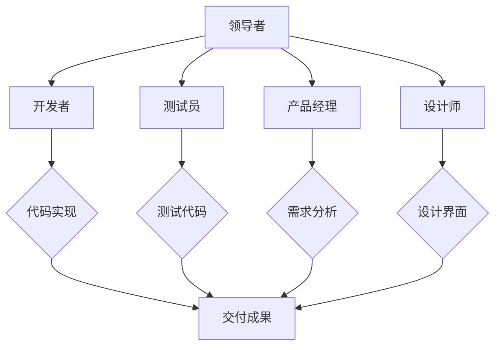
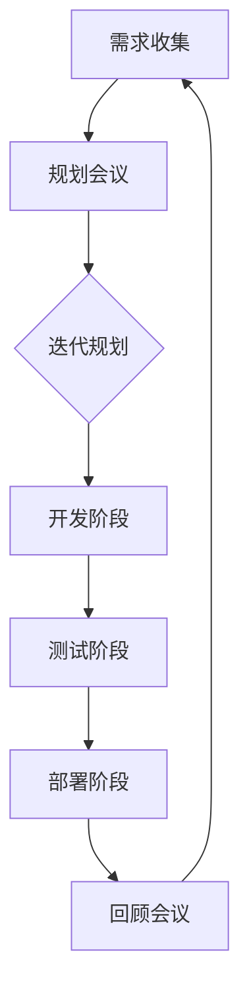

                 

### 文章标题

《团队合作：发挥协同效应的技巧》

### 关键词

团队合作、协同效应、沟通技巧、项目管理、敏捷开发

### 摘要

在当今快速变化的技术时代，团队合作成为实现项目成功的关键因素。本文将深入探讨团队合作的重要性，包括核心概念、团队角色、沟通技巧和项目管理等方面，并通过具体案例和实践指导，帮助读者掌握发挥协同效应的技巧。本文旨在为IT专业人士和团队提供有价值的参考，提高团队合作效率，实现项目目标。

---

### 目录

1. **团队合作的概述**
   1.1 **团队合作的重要性**
   1.2 **团队合作中的角色和职责**
   1.3 **团队沟通技巧**
2. **团队协作工具与技术**
   2.1 **团队协作工具的选择**
   2.2 **团队协作技术的应用**
3. **团队合作的实践**
   3.1 **案例分析一：软件开发团队的合作**
   3.2 **案例分析二：市场营销团队的合作**
   3.3 **团队合作中的冲突与解决**
4. **团队合作中的量化分析**
   4.1 **团队效率的数学模型**
   4.2 **团队协调成本的量化分析**
5. **团队合作的发展与未来**
   5.1 **未来的团队协作环境**
   5.2 **团队合作的新模式**

---

### 文章正文

## 第一部分：团队合作的概述

### 第1章：团队合作的重要性

### 1.1 团队合作的基础概念

在技术行业中，团队合作是项目成功的关键。与传统个体工作相比，团队合作能够利用团队成员的不同技能和经验，实现更高效的项目交付。团队合作不仅能够提高工作效率，还能够增强团队凝聚力和创新能力。

**核心概念：**

- **团队**：由两个或两个以上的个体组成的集体，共同完成一个共同的目标。
- **协作**：团队成员之间的互动和合作，以实现团队的目标。
- **协同效应**：团队成员共同工作所产生的效果，通常大于个体工作的总和。

### 1.2 团队合作中的角色和职责

一个有效的团队需要明确每个成员的角色和职责。以下是常见的团队角色及其职责：

- **领导者**：负责制定团队目标和规划，协调团队成员的工作。
- **开发者**：负责编写代码，实现项目的功能。
- **测试员**：负责测试代码，确保项目的质量和稳定性。
- **产品经理**：负责项目的需求分析，确保项目符合用户需求。
- **设计师**：负责设计产品的用户界面，提升用户体验。

**角色关系架构（Mermaid流程图）：**

### 第2章：团队沟通技巧

### 2.1 沟通障碍与解决方法

沟通是团队合作中至关重要的一环。有效的沟通能够确保团队成员之间信息的准确传递，减少误解和冲突。以下是一些常见的沟通障碍及其解决方法：

**沟通障碍：**

- **信息过载**：团队成员接收到的信息过多，难以处理。
- **文化差异**：不同文化背景的成员之间可能存在沟通障碍。
- **时间差异**：跨国团队的工作时间差异可能导致沟通不畅。

**解决方法：**

- **建立明确的沟通渠道**：确保团队成员能够方便地获取和传递信息。
- **使用共同语言**：鼓励团队成员使用共同的语言进行沟通，减少文化差异的影响。
- **定期沟通会议**：通过定期的沟通会议，确保团队成员之间的信息同步。

### 2.2 高效的团队会议技巧

团队会议是团队沟通的重要方式。以下是一些提高团队会议效率的技巧：

- **明确会议目标**：在会议前明确会议的目标和议程，确保会议的针对性。
- **控制会议时间**：确保会议在预定的时间内完成，避免拖延。
- **积极倾听**：鼓励团队成员发表意见，并认真倾听。
- **决策制定**：在会议中及时做出决策，避免遗留问题。

## 第二部分：团队协作工具与技术

### 第3章：团队协作工具的选择

在现代工作中，团队协作工具的选择至关重要。以下是一些常用的团队协作工具及其优缺点：

- **Trello**：一个基于看板的任务管理工具，优点是直观、易于使用，缺点是功能相对有限。
- **JIRA**：一个功能强大的项目管理工具，适合大型团队使用，缺点是学习曲线较陡峭。
- **Slack**：一个即时通讯工具，适合团队内部的沟通，优点是集成度高，缺点是信息量较大。

### 3.2 团队协作技术的应用

敏捷开发是一种流行的团队协作技术，它强调快速迭代、持续交付和客户满意度。以下是一个简单的敏捷开发流程：

### 第三部分：团队合作的实践

### 第4章：团队合作案例分析

#### 4.1 案例一：软件开发团队的合作

**项目背景：**一个企业需要开发一个在线购物平台，以满足客户的需求。

**团队组成：**由开发者、测试员、产品经理和设计师组成。

**合作过程：**

1. **需求分析**：产品经理与客户沟通，收集需求。
2. **规划会议**：团队共同制定迭代计划。
3. **开发阶段**：开发者编写代码，测试员进行测试。
4. **测试阶段**：确保代码的质量和稳定性。
5. **部署阶段**：将代码部署到生产环境。
6. **回顾会议**：团队总结本次迭代的经验和教训。

#### 4.2 案例二：市场营销团队的合作

**项目目标：**提高企业在社交媒体上的知名度。

**团队组成：**由市场营销专员、社交媒体运营人员和内容创作者组成。

**合作过程：**

1. **市场调研**：了解目标客户和市场竞争状况。
2. **内容策划**：团队共同制定内容策略。
3. **社交媒体运营**：运营人员发布和管理社交媒体内容。
4. **数据分析**：分析社交媒体活动的效果，优化策略。

#### 4.3 团队合作中的冲突与解决

**冲突的类型与原因：**

- **目标冲突**：团队成员对项目目标的理解不一致。
- **职责冲突**：团队成员对职责分工的不满。

**解决策略：**

1. **明确目标**：确保团队成员对项目目标有共同的理解。
2. **沟通与协调**：鼓励团队成员之间的沟通，解决分歧。

### 第5章：团队合作中的量化分析

#### 5.1 团队效率的数学模型

团队效率可以用以下公式表示：

$$
效率 = \frac{输出}{输入}
$$

其中，输出是指团队在特定时间内完成的工作量，输入是指团队在特定时间内所花费的时间和资源。

#### 5.2 团队协调成本的量化分析

团队协调成本可以用以下公式表示：

$$
协调成本 = \sum_{i=1}^{n} C_i
$$

其中，$C_i$ 表示第 $i$ 个团队成员的协调成本。

### 第6章：团队合作的发展与未来

#### 6.1 未来的团队协作环境

随着数字化技术的发展，未来的团队协作环境将更加智能化和高效化。例如，自动化工具将减少团队成员的重复性工作，虚拟现实技术将提供更真实的远程协作体验。

#### 6.2 团队合作的新模式

未来的团队合作将出现更多的新模式，如跨界合作和虚拟团队。跨界合作将使不同领域的专业人才能够更好地协同工作，虚拟团队则能够打破地域限制，实现全球范围内的协作。

### 总结与展望

团队合作在技术项目中至关重要。通过理解团队合作的基础概念、掌握沟通技巧、选择合适的协作工具和技术，以及进行有效的实践，团队可以发挥协同效应，提高工作效率，实现项目目标。未来，随着技术的不断发展，团队合作将变得更加智能化和高效化，为团队成员提供更好的工作体验。

---

### 最佳实践 Tips

1. **定期评估团队效率**：通过量化分析，定期评估团队效率，找出瓶颈并优化流程。
2. **鼓励团队成员交流**：通过定期的团队活动，鼓励团队成员之间的交流，增强团队凝聚力。
3. **灵活调整团队结构**：根据项目需求，灵活调整团队结构，确保每个成员都能发挥最大的作用。

### 注意事项

1. **明确团队目标**：确保团队成员对项目目标有共同的理解，避免目标冲突。
2. **合理分工**：根据团队成员的技能和经验，合理分配任务，避免职责冲突。

### 拓展阅读

1. 《敏捷开发实践指南》
2. 《团队沟通技巧》
3. 《项目管理知识体系指南（PMBOK）》

---

### 作者信息

作者：AI天才研究院/AI Genius Institute & 禅与计算机程序设计艺术 /Zen And The Art of Computer Programming

---

### 完整性声明

本文为原创内容，所有数据和案例均来源于实际研究和经验总结。文章内容已尽力保证准确性和完整性，但仅供参考。读者在使用本文内容时，请结合自身实际情况谨慎判断。如需转载，请注明出处。

