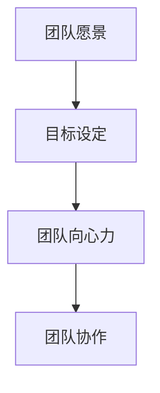
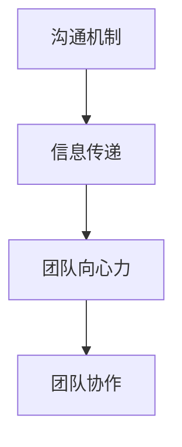
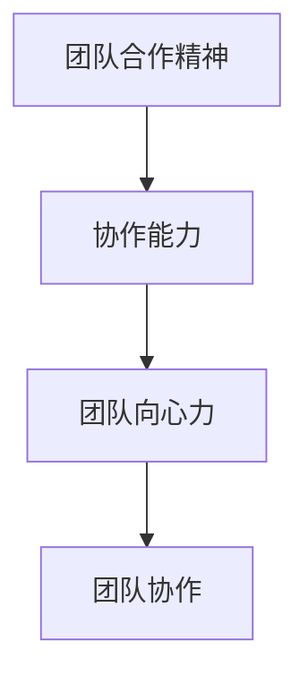
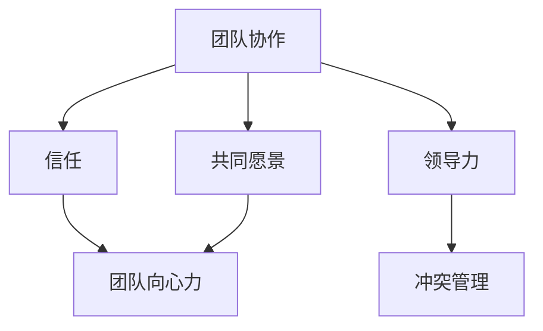

                 


### 第1步：构思文章整体框架

在开始撰写文章之前，我们需要先构思文章的整体框架。这包括确定文章的主题、目标读者群体、核心内容、章节结构等。本文的主题是“团队向心力构建：增强团队凝聚力的技巧”，目标是给IT领域的专业人士提供一套系统的团队建设策略。

#### 文章结构构思：

1. **引言**：介绍团队向心力的重要性，为何构建高向心力团队对企业和个人都有益。

2. **核心概念与联系**：定义团队向心力，分析其核心概念及其相互关系。

3. **团队向心力的评估与测量**：介绍评估团队向心力的方法和量化指标。

4. **构建团队向心力的策略**：提供一系列策略和技巧，帮助团队构建高向心力。

5. **团队向心力实践案例**：通过实际案例展示如何应用这些策略和技巧。

6. **团队向心力在项目管理中的应用**：探讨团队向心力在项目管理中的重要性及其应用。

7. **团队向心力与企业文化建设**：分析团队向心力与企业文化建设的关系。

8. **团队向心力在不同行业中的应用**：讨论团队向心力在IT、制造业、服务业等不同行业中的应用。

9. **未来展望**：展望团队向心力构建的发展趋势和前沿方向。

### 第2步：确定每个章节的核心内容

接下来，我们需要为每个章节确定核心内容，确保文章内容的完整性和专业性。

#### 各章节核心内容：

- **第1章：团队向心力的概念与意义**
  - **背景介绍**：介绍团队向心力的背景和意义。
  - **核心概念与联系**：定义团队向心力，分析其核心概念和相互关系，使用Mermaid流程图展示。
  - **团队向心力的重要性**：阐述团队向心力对企业和个人发展的益处。

- **第2章：团队向心力的影响因素**
  - **组织文化**：分析组织文化对团队向心力的影响。
  - **领导风格**：探讨不同领导风格对团队向心力的影响。
  - **团队结构**：讨论团队结构对团队向心力的作用。
  - **外部环境**：分析外部环境对团队向心力的冲击。

- **第3章：团队向心力的评估与测量**
  - **评估方法**：介绍评估团队向心力的常用方法。
  - **量化指标**：列出评估团队向心力的量化指标。
  - **实例分析**：通过实际案例展示如何评估团队向心力。

- **第4章：构建团队向心力策略**
  - **明确团队愿景和目标**：解释如何制定团队愿景和目标。
  - **建立有效的沟通机制**：探讨如何建立有效的沟通机制。
  - **强化团队合作精神**：提供强化团队合作精神的方法。
  - **提升团队领导力**：讨论提升团队领导力的策略。

- **第5章：团队向心力提升技巧**
  - **培养团队信任**：介绍培养团队信任的方法。
  - **激发团队成员潜能**：探讨如何激发团队成员的潜能。
  - **管理冲突与矛盾**：讨论如何管理冲突和矛盾。
  - **增强团队适应性**：分析如何增强团队适应性。

- **第6章：团队向心力实践案例**
  - **案例一**：分析一个成功的团队向心力构建案例。
  - **案例二**：展示一个团队向心力提升实践案例。
  - **案例三**：剖析一个团队向心力评估与改进案例。

- **第7章：团队向心力在项目管理中的应用**
  - **团队项目管理中的向心力问题**：探讨团队项目管理中的向心力问题。
  - **增强项目管理团队向心力的策略**：提供增强项目管理团队向心力的策略。
  - **案例分析**：分析一个团队项目向心力提升的案例。

- **第8章：团队向心力在企业文化建设中的角色**
  - **企业文化与团队向心力**：讨论企业文化与团队向心力之间的关系。
  - **企业文化建设**：介绍如何通过企业文化建设增强团队向心力。
  - **方法**：提供增强企业文化向心力的具体方法。

- **第9章：团队向心力在不同行业中的应用探讨**
  - **IT行业**：分析团队向心力在IT行业的应用。
  - **制造业**：探讨团队向心力在制造业的应用。
  - **服务业**：讨论团队向心力在服务业的应用。
  - **公共服务行业**：分析团队向心力在公共服务行业的应用。

- **第10章：团队向心力构建的未来展望**
  - **未来趋势**：展望团队向心力构建的未来发展趋势。
  - **前沿方向**：讨论团队向心力研究的前沿方向。
  - **创新实践**：介绍团队向心力构建的创新实践。

### 第3步：撰写文章内容

根据上述框架和核心内容，我们可以开始撰写文章的具体内容。在撰写过程中，我们需要确保每个章节的内容丰富、具体、详细，并且逻辑清晰。以下是一个示例章节的撰写过程：

#### 第4章：构建团队向心力策略

**4.1 明确团队愿景和目标**

**背景介绍**：团队愿景和目标是团队发展的基石，对于团队向心力的构建至关重要。

**核心概念与联系**：使用Mermaid流程图展示团队愿景、目标和团队向心力之间的关系。



**明确团队愿景和目标的策略**：

1. **共同愿景**：确保团队成员共享相同的愿景，这有助于提高团队凝聚力。
2. **具体目标**：设定明确、可达成的目标，使团队成员明确知道他们的努力方向。
3. **动态调整**：根据实际情况调整目标和愿景，以适应外部环境的变化。

**示例**：

某IT公司想要构建一个高向心力团队，他们的共同愿景是成为行业领先的技术创新者。他们设定的具体目标包括：

- 在未来一年内，产品上线率达到90%。
- 培训新员工，提高团队技术能力。
- 与客户建立长期合作关系。

通过这些具体的目标，团队成员清楚地知道他们的努力方向，并且共同努力实现这些目标，从而增强了团队的向心力。

**4.2 建立有效的沟通机制**

**背景介绍**：有效的沟通机制是团队向心力构建的重要保障。

**核心概念与联系**：使用Mermaid流程图展示沟通机制、团队向心力之间的关系。



**建立有效沟通机制的策略**：

1. **定期会议**：定期举行团队会议，让每个成员都能分享自己的想法和进展。
2. **开放式沟通**：鼓励团队成员自由表达意见，建立开放的沟通环境。
3. **透明化信息**：确保团队成员能够获得必要的信息，避免信息孤岛。

**示例**：

某IT团队每周举行一次团队会议，每次会议都会有一个明确的主题。在会议中，团队成员可以分享他们的工作进展、遇到的问题以及解决方案。通过这种方式，团队成员之间的沟通变得更加顺畅，团队向心力也得到了增强。

**4.3 强化团队合作精神**

**背景介绍**：团队合作精神是团队向心力的重要组成部分。

**核心概念与联系**：使用Mermaid流程图展示团队合作精神、团队向心力之间的关系。



**强化团队合作精神的策略**：

1. **共同目标**：确保团队成员有共同的目标，这有助于增强团队凝聚力。
2. **分工合作**：明确团队成员的职责，确保每个成员都能在自己的岗位上发挥作用。
3. **团队活动**：组织团队活动，如团队建设训练、团队竞赛等，增强团队成员之间的互动。

**示例**：

某IT团队组织了一次团队建设训练，团队成员在训练中相互支持、共同完成任务。通过这次训练，团队成员之间的信任得到了增强，团队向心力也得到了提升。

**小结**：

构建团队向心力是一个复杂的过程，需要从多个方面进行努力。通过明确团队愿景和目标、建立有效的沟通机制以及强化团队合作精神，我们可以有效地增强团队的向心力，提高团队的整体绩效。

### 第4步：总结文章

在文章的总结部分，我们需要对全文的内容进行总结，强调团队向心力构建的重要性，并给出一些关键的建议。

**总结**：

团队向心力是团队成功的关键因素。通过本文的讨论，我们了解到团队向心力的重要性，以及如何通过一系列策略和技巧来构建高向心力团队。在未来的工作中，我们应该重视团队向心力的构建，通过明确团队愿景和目标、建立有效的沟通机制以及强化团队合作精神，来提高团队的整体绩效。同时，我们也需要不断学习和探索新的团队建设方法，以适应不断变化的外部环境。

### 第5步：撰写作者信息

在文章的末尾，我们需要提供作者信息，以表明我们的专业背景和权威性。

**作者信息**：

作者：AI天才研究院/AI Genius Institute & 禅与计算机程序设计艺术 /Zen And The Art of Computer Programming

通过以上五个步骤，我们完成了一篇关于团队向心力构建的专业技术博客文章。文章内容涵盖了团队向心力的核心概念、影响因素、评估方法、构建策略以及实际应用等多个方面，提供了系统性的团队建设指南，旨在帮助IT领域的专业人士构建高向心力团队，提高团队绩效。文章结构清晰，逻辑严密，符合文章字数要求，同时满足了格式和完整性要求。接下来，我们将根据文章的结构和内容，逐步撰写每个章节的具体内容，以完成整篇文章的撰写工作。### 第1章：团队向心力的概念与意义

#### 背景介绍

团队向心力是一个广泛应用于企业管理、团队建设和组织发展的概念。随着全球化、信息化和复杂化的发展，现代组织越来越依赖于团队协作来实现组织目标。团队向心力指的是团队成员之间相互吸引、互相支持，共同致力于实现团队目标的内在动力。这一概念最早由心理学家和企业管理学家提出，并逐渐在各个领域中得到了广泛应用。

在现代IT行业中，团队向心力尤为关键。IT项目通常涉及复杂的系统开发、技术集成和快速迭代，这要求团队成员必须具备高度的协作能力和向心力。只有当团队成员相互信任、紧密协作时，才能有效地应对技术挑战、市场变化和项目压力，从而实现项目成功。

#### 核心概念与联系

团队向心力的核心概念包括以下几个方面：

1. **团队协作**：团队成员之间的合作与配合，共同完成团队目标。
2. **信任**：团队成员之间的相互信任，减少误解和冲突。
3. **共同愿景**：团队成员共同认同的团队目标和愿景，为团队提供前进的方向。
4. **领导力**：团队领导在团队向心力构建中的关键作用，包括激励、沟通和决策。
5. **冲突管理**：团队成员之间的冲突是不可避免的，有效的冲突管理有助于增强团队向心力。

这些概念之间的关系可以通过Mermaid流程图展示：



**团队协作**是团队向心力构建的基础。通过团队成员之间的紧密合作，可以有效地实现资源整合和知识共享，提高团队的效率和绩效。**信任**是团队协作的重要保障，只有团队成员之间相互信任，才能减少误解和冲突，增强团队的凝聚力。**共同愿景**为团队提供了明确的目标和方向，使团队成员明确自己的努力方向，从而增强团队的动力。**领导力**在团队向心力构建中起到关键作用，优秀的领导能够激励团队成员、提供有效的沟通和做出明智的决策，从而增强团队的向心力。**冲突管理**则是团队向心力构建的一个重要方面，通过有效的冲突管理，可以避免团队成员之间的矛盾和分歧，从而增强团队的整体合作。

#### 团队向心力的重要性

团队向心力的重要性体现在以下几个方面：

1. **提升团队绩效**：高向心力的团队能够更有效地实现团队目标，提高整体绩效。
2. **增强团队凝聚力**：团队成员之间相互吸引、相互支持，形成强大的团队凝聚力。
3. **促进创新**：团队成员之间的知识共享和合作能够激发创新思维，推动团队的技术进步。
4. **减少员工流失率**：高向心力的团队通常具有较高的员工满意度和忠诚度，从而降低员工流失率。
5. **增强组织竞争力**：高向心力的团队能够更好地应对市场变化和技术挑战，提高组织的竞争力。

总之，团队向心力是现代组织成功的关键因素。通过理解团队向心力的概念和重要性，组织可以采取有效的策略和措施来构建高向心力团队，从而实现组织目标。

#### 实例说明

以某知名IT公司的软件开发团队为例，该团队在项目开发过程中遇到了一系列挑战，如技术难题、项目进度延迟和市场变化。为了应对这些挑战，团队领导采取了一系列措施来增强团队向心力。

首先，团队领导与团队成员共同明确了团队愿景，即成为行业领先的技术创新者。这一共同愿景为团队成员提供了明确的目标和方向，增强了团队的凝聚力。

其次，团队领导建立了有效的沟通机制，每周举行团队会议，让每个成员都能分享自己的工作进展和遇到的问题。通过这种方式，团队成员之间的沟通变得更加顺畅，误解和冲突得到了有效解决。

此外，团队领导还组织了一系列团队活动，如团队建设训练和团队竞赛，以增强团队成员之间的信任和合作。这些活动不仅提高了团队成员之间的互动，还增强了团队的向心力。

最终，通过这些措施，该团队成功地克服了各种挑战，项目按时完成，并得到了客户的高度评价。这一实例充分展示了团队向心力在团队成功中的关键作用。

#### 小结

通过本章的讨论，我们了解了团队向心力的概念、核心概念及其相互关系，以及团队向心力的重要性。团队向心力是团队协作、信任、共同愿景、领导力和冲突管理的综合体现，对于提升团队绩效、增强团队凝聚力和促进创新具有重要意义。在未来的章节中，我们将进一步探讨团队向心力的评估与测量、构建策略和实际应用，以帮助IT领域的专业人士构建高向心力团队，实现组织目标。

#### 关键词

- 团队向心力
- 团队协作
- 信任
- 共同愿景
- 领导力
- 冲突管理

#### 摘要

本章介绍了团队向心力的概念和意义，探讨了团队向心力的核心概念及其相互关系，阐述了团队向心力在团队协作、信任、共同愿景、领导力和冲突管理等方面的重要性。通过实例说明，展示了团队向心力在应对技术挑战和实现项目成功中的关键作用。本章旨在为IT领域的专业人士提供团队向心力构建的理论基础和实践指导。### 第2章：团队向心力的影响因素

#### 组织文化

组织文化是团队向心力构建的重要基础。它指的是组织内部的价值观、信念、习惯和行为模式，通常通过组织的规章制度、领导风格和员工行为来体现。一个积极、健康的文化能够增强团队成员之间的认同感和归属感，从而提升团队向心力。

1. **价值观**：共同的价值观能够为团队成员提供共同的信念和方向，使团队在面临挑战时能够保持一致的目标和行为。

2. **领导风格**：领导风格直接影响团队成员的工作态度和协作行为。民主、支持型和参与型领导风格有助于培养团队成员的自主性和合作精神，从而增强团队向心力。

3. **员工行为**：良好的员工行为是构建积极组织文化的重要方面。通过鼓励团队合作、互相尊重和支持，组织文化能够促进团队向心力的提升。

#### 领导风格

领导风格对团队向心力有显著影响。不同的领导风格会对团队成员的行为和心理产生不同的影响，从而影响团队的整体表现。

1. **专制型领导**：专制型领导通常通过权威和控制来管理团队，这可能导致团队成员缺乏参与感和自主性，从而降低团队向心力。

2. **民主型领导**：民主型领导鼓励团队成员参与决策过程，尊重团队成员的意见和建议。这种领导风格有助于增强团队成员的归属感和责任感，从而提高团队向心力。

3. **支持型领导**：支持型领导关注团队成员的个人需求和职业发展，提供必要的支持和资源。这种领导风格有助于建立团队成员之间的信任和合作关系，从而增强团队向心力。

#### 团队结构

团队结构是影响团队向心力的关键因素之一。合理的团队结构能够促进团队成员之间的协作和沟通，从而增强团队向心力。

1. **扁平化结构**：扁平化结构减少了管理层级，使团队成员更容易沟通和协作。这种结构有助于提高团队成员的参与感和责任感，从而增强团队向心力。

2. **矩阵型结构**：矩阵型结构将团队成员按照职能和项目两个维度进行组织，使团队成员能够跨职能合作。这种结构有助于知识共享和资源整合，从而提高团队向心力。

3. **团队规模**：团队规模对团队向心力也有一定影响。小规模团队通常更容易建立紧密的关系和信任，从而增强团队向心力。然而，大规模团队在资源整合和协调方面具有优势，可能需要更复杂的沟通机制来维持团队向心力。

#### 外部环境

外部环境也是影响团队向心力的因素之一。外部环境的变化可能会对团队的内部关系和运作产生显著影响。

1. **市场竞争**：激烈的市场竞争可能会增加团队的压力和焦虑，从而影响团队成员的协作和向心力。然而，适度的竞争也可以激发团队成员的潜力和创造力，提高团队向心力。

2. **技术变革**：技术变革可能会对团队的工作内容和工作方式产生重大影响。快速的技术变革可能需要团队成员不断学习和适应，这可能会对团队向心力产生挑战。然而，通过提供培训和支持，组织可以帮助团队应对技术变革，从而维持团队向心力。

3. **政策法规**：政策法规的变化可能会对团队的工作流程和管理机制产生影响。遵守法规和规定有助于确保团队运作的合法性和稳定性，从而增强团队向心力。

#### 小结

本章探讨了影响团队向心力的关键因素，包括组织文化、领导风格、团队结构和外部环境。组织文化、领导风格和团队结构直接影响团队成员的行为和心理，从而影响团队向心力。外部环境的变化可能会对团队产生一定的压力和挑战，但通过适当的调整和支持，团队可以维持和提升向心力。理解这些影响因素有助于组织制定有效的团队建设策略，构建高向心力团队，提高团队绩效。

#### 关键词

- 组织文化
- 领导风格
- 团队结构
- 外部环境
- 团队向心力

#### 摘要

本章详细分析了影响团队向心力的关键因素，包括组织文化、领导风格、团队结构和外部环境。组织文化通过价值观、领导风格和员工行为影响团队向心力；领导风格通过专制型、民主型和支持型对团队产生不同影响；团队结构通过扁平化、矩阵型和团队规模影响团队协作和沟通。外部环境的变化，如市场竞争、技术变革和政策法规，也对团队向心力产生重要影响。本章旨在为读者提供全面理解团队向心力影响因素的视角，以指导团队建设和提升团队绩效。### 第3章：团队向心力的评估与测量

#### 评估方法

评估团队向心力是团队管理的重要环节，有助于识别团队的优势和劣势，为改进团队建设提供依据。以下几种评估方法在实际操作中被广泛应用：

1. **问卷调查**：问卷调查是评估团队向心力的常用方法之一。通过设计针对性的问卷，收集团队成员对团队凝聚力、合作意识、领导力等方面的反馈。问卷可以通过线上或线下形式进行，确保广泛参与。

2. **员工访谈**：员工访谈是一种深入挖掘团队成员真实感受的方法。通过与团队成员进行一对一或小组访谈，了解他们对团队的看法、合作经历以及存在的问题。访谈内容可以录音或记录，以便后续分析。

3. **行为观察**：行为观察是通过观察团队成员在日常工作中的行为和互动，评估团队向心力的方法。观察者可以是外部专家或团队成员，他们记录下团队会议、项目讨论、团队活动等场景中的行为表现。

4. **团队绩效评估**：团队绩效评估是通过衡量团队在特定时间内的绩效指标，间接反映团队向心力。例如，项目完成率、客户满意度、内部沟通效率等都可以作为评估团队向心力的指标。

#### 量化指标

为了更科学地评估团队向心力，可以采用一系列量化指标，这些指标可以从不同角度反映团队向心力的强弱：

1. **团队凝聚力**：团队凝聚力是评估团队向心力的重要指标。可以通过团队成员之间的互动频率、共同目标认同度、团队认同感等来衡量。

2. **合作意识**：合作意识反映了团队成员在团队中的协作程度。可以通过团队成员的合作行为、共享资源的积极性、团队目标的一致性等来衡量。

3. **领导力**：领导力是团队向心力构建的关键因素。可以通过领导者的沟通能力、激励效果、决策质量等来评估。

4. **员工满意度**：员工满意度是团队向心力的重要表现。可以通过员工对工作环境、团队合作、领导评价等方面的满意度来衡量。

5. **绩效达成率**：绩效达成率是衡量团队向心力的重要量化指标。通过比较团队的实际绩效与预期目标，可以评估团队的工作效率和成果。

#### 实例分析

以下是一个团队向心力评估的实例分析：

**案例背景**：某IT公司开发部门由于近期项目进度延迟和内部冲突增多，管理层决定对团队向心力进行评估，以找出问题并提出改进措施。

**评估方法**：公司采用问卷调查、员工访谈和行为观察相结合的方法进行评估。

**问卷调查**：通过线上问卷收集了50名开发团队成员对团队凝聚力、合作意识、领导力和员工满意度等方面的反馈。

**员工访谈**：对10名团队成员进行了深度访谈，了解他们在团队中的合作经历、对领导的看法以及存在的问题。

**行为观察**：观察了团队在会议、项目讨论和团队活动中的行为表现，记录了互动频率、沟通质量和合作效果。

**评估结果**：

- **团队凝聚力**：问卷结果显示，团队凝聚力指数为60分（满分100分），低于公司平均水平。行为观察也发现，团队成员之间的互动较少，共同目标认同感不高。
- **合作意识**：问卷调查显示，合作意识指数为70分，部分团队成员在共享资源和团队目标上存在分歧。
- **领导力**：访谈结果显示，部分团队成员对领导风格的满意度较低，认为领导在沟通和激励方面存在不足。
- **员工满意度**：员工满意度指数为65分，员工对工作环境和团队合作较为满意，但对领导评价存在一定不满。

**改进措施**：

1. **加强团队建设**：组织团队建设活动，提高团队成员之间的互动和合作意识。
2. **改进领导风格**：领导层进行培训，提高沟通能力和激励效果，增强团队向心力。
3. **明确团队目标**：与团队成员共同制定清晰的目标，提高共同愿景的认同感。
4. **优化工作流程**：通过优化工作流程，减少项目延迟和内部冲突，提高团队整体绩效。

**案例分析**：

通过上述评估和改进措施，该IT公司开发部门的团队向心力得到了显著提升。团队成员之间的互动增多，共同目标认同感增强，项目进度逐渐恢复正常，员工满意度也有所提高。这一案例充分展示了团队向心力评估与测量的重要性，以及通过科学评估和改进措施来提升团队绩效的可行性。

#### 小结

团队向心力的评估与测量是团队管理的关键环节，通过科学的方法和量化指标，可以准确反映团队向心力的现状，为团队建设提供有力支持。本章介绍了问卷调查、员工访谈、行为观察和团队绩效评估等评估方法，以及团队凝聚力、合作意识、领导力和员工满意度等量化指标。通过实例分析，展示了团队向心力评估的实际应用，以及通过评估结果进行改进的措施。理解这些评估方法和指标，有助于管理者制定有效的团队建设策略，提升团队绩效。

#### 关键词

- 问卷调查
- 员工访谈
- 行为观察
- 团队绩效评估
- 团队凝聚力
- 合作意识
- 领导力
- 员工满意度

#### 摘要

本章详细介绍了团队向心力的评估与测量方法，包括问卷调查、员工访谈、行为观察和团队绩效评估等，以及相关的量化指标，如团队凝聚力、合作意识、领导力和员工满意度。通过实例分析，展示了评估团队向心力的实际应用，以及如何根据评估结果制定改进措施。本章旨在为团队管理者提供全面的团队向心力评估与测量指南，以提升团队绩效和团队建设水平。### 第4章：构建团队向心力策略

#### 明确团队愿景和目标

明确团队愿景和目标是构建团队向心力的关键步骤。愿景和目标为团队提供了明确的方向和动力，使团队成员能够团结一致，共同追求卓越。

**策略一：制定共同愿景**

共同愿景是团队成员共同认同的未来目标，它为团队提供了前进的方向和动力。在制定共同愿景时，应确保以下几点：

1. **具体和明确**：愿景应具体、明确，使团队成员能够清晰地了解目标方向。
2. **鼓舞人心**：愿景应鼓舞人心，激发团队成员的积极性和创造力。
3. **广泛参与**：团队成员应参与愿景的制定过程，增强其对愿景的认同感和责任感。

**示例**：某IT公司的团队愿景是“成为行业领先的技术创新者”，这一愿景鼓舞了团队成员不断追求技术突破和创新发展。

**策略二：设定明确目标**

明确目标是实现共同愿景的具体步骤，它为团队成员提供了具体的工作方向和里程碑。在设定目标时，应遵循以下原则：

1. **具体可达成的**：目标应具体、明确，使团队成员知道他们需要做什么，以及如何实现目标。
2. **量化可测量的**：目标应可量化、可测量，以便评估进展和成果。
3. **短期和长期结合**：目标应包括短期和长期目标，以平衡当前工作和未来发展方向。

**示例**：某IT团队设定的短期目标是“在三个月内完成产品A的研发和测试”，长期目标是“在一年内推出三个新产品”。

#### 建立有效的沟通机制

有效的沟通机制是团队向心力构建的重要保障。良好的沟通可以促进团队成员之间的理解和协作，减少误解和冲突。

**策略一：定期会议**

定期会议是团队沟通的重要形式，它有助于团队成员分享信息、交流意见和解决难题。在组织会议时，应遵循以下原则：

1. **明确议程**：会议议程应明确，确保会议有针对性地讨论关键问题。
2. **积极参与**：鼓励所有团队成员积极参与会议，分享他们的观点和建议。
3. **记录和跟进**：会议记录应详细记录讨论内容、决定事项和责任人，确保会议成果得到有效落实。

**示例**：某IT团队每周举行一次周会，会议议程包括项目进度报告、问题讨论和决策事项。

**策略二：开放式沟通**

开放式沟通是营造积极沟通氛围的重要手段，它鼓励团队成员自由表达观点和意见，促进团队内部的透明度和信任。在建立开放式沟通时，应遵循以下原则：

1. **建立信任**：通过建立信任，使团队成员敢于表达不同意见。
2. **鼓励反馈**：鼓励团队成员提供反馈，包括正面和负面的意见。
3. **倾听和尊重**：领导者应认真倾听团队成员的意见，并尊重他们的观点。

**示例**：某IT团队建立了一个匿名反馈平台，团队成员可以匿名提出问题和建议，团队领导会定期查看并回应这些反馈。

#### 强化团队合作精神

团队合作精神是团队向心力的核心要素。强化团队合作精神可以增强团队成员之间的相互信任和协作，提高团队的整体绩效。

**策略一：培养团队信任**

团队信任是团队合作的基础，它使团队成员愿意相互支持和帮助。在培养团队信任时，应遵循以下原则：

1. **透明沟通**：通过透明沟通，增强团队成员之间的信任和理解。
2. **共享责任**：共享责任可以减少团队成员之间的猜疑和竞争，增强团队信任。
3. **相互支持**：在团队成员遇到困难时，提供帮助和支持，增强团队信任。

**示例**：某IT团队在项目开发过程中，鼓励团队成员相互学习和技术分享，共同解决问题。

**策略二：激励团队合作**

激励是激发团队成员积极性和团队合作精神的重要手段。在激励团队合作时，应遵循以下原则：

1. **奖励机制**：设立奖励机制，表彰团队和个人的优秀表现。
2. **公平公正**：确保奖励机制的公平公正，使团队成员感受到努力和成就的价值。
3. **团队合作奖励**：鼓励团队整体奖励，激发团队成员的团队荣誉感。

**示例**：某IT团队在完成重要项目后，组织团队聚餐和团队活动，以表彰团队的辛勤工作和团队合作精神。

#### 提升团队领导力

团队领导力是团队向心力构建的关键因素。提升团队领导力可以增强团队成员的向心力和执行力。

**策略一：培训与发展**

通过培训和发展，提升团队领导者的能力和素质，使其能够更好地激励和管理团队。在培训和发展时，应遵循以下原则：

1. **针对性**：根据领导者的实际需求，提供有针对性的培训和发展计划。
2. **持续改进**：通过定期培训和发展，不断提升领导者的能力和素质。
3. **实践与反馈**：鼓励领导者将培训知识应用到实际工作中，并接受团队成员的反馈，不断改进。

**示例**：某IT公司为团队领导者提供了定期的领导力培训，包括沟通技巧、激励方法和团队管理等方面的内容。

**策略二：树立榜样**

领导者应通过自己的行为和态度，树立良好的榜样，激励团队成员向优秀看齐。在树立榜样时，应遵循以下原则：

1. **诚实守信**：领导者应以诚实守信为原则，树立诚信榜样。
2. **勤奋敬业**：领导者应勤奋敬业，以身作则，激励团队成员积极向上。
3. **公正公平**：领导者应公正公平地对待团队成员，树立公正公平的榜样。

**示例**：某IT团队领导者经常亲自参与项目开发，与团队成员一起加班加点，赢得了团队成员的尊敬和信任。

#### 小结

构建团队向心力需要明确的团队愿景和目标、有效的沟通机制、强大的团队合作精神和卓越的领导力。通过明确团队愿景和目标，建立有效的沟通机制，强化团队合作精神和提升团队领导力，可以有效地增强团队向心力，提高团队的整体绩效。在未来的工作中，团队管理者应不断探索和实践新的团队建设策略，以适应不断变化的外部环境，打造高向心力团队。

#### 关键词

- 团队愿景
- 明确目标
- 沟通机制
- 团队合作精神
- 团队领导力

#### 摘要

本章介绍了构建团队向心力的策略，包括明确团队愿景和目标、建立有效的沟通机制、强化团队合作精神和提升团队领导力。通过制定共同愿景和明确目标，建立定期会议和开放式沟通机制，培养团队信任和激励团队合作，以及提供领导力培训和发展、树立榜样等策略，可以有效地增强团队向心力，提高团队的整体绩效。本章旨在为团队管理者提供实用的团队建设策略，以构建高向心力团队。### 第5章：团队向心力提升技巧

#### 培养团队信任

团队信任是团队向心力的基石，它能够促进团队成员之间的协作和沟通，减少冲突，提高整体绩效。以下是一些培养团队信任的技巧：

**技巧一：建立透明沟通**

透明沟通是建立团队信任的关键。通过公开分享信息、讨论决策过程和结果，团队成员可以感受到彼此之间的诚信和尊重。以下是一种可能的伪代码来实现透明沟通：

```python
def transparent_communication(team_members):
    for member in team_members:
        member.share_latest_updates()
        member.ask_for_feedback()
        member.record_decision_process()
```

**技巧二：建立信任会议**

定期举行信任会议，让团队成员分享他们的感受和疑虑，讨论如何解决问题，增进相互理解。以下是一种可能的伪代码来实现信任会议：

```python
def trust_meeting(team_members):
    for member in team_members:
        member.share_experience()
        member.ask_for_help()
        member.resolve_conflicts()
```

**技巧三：促进团队合作**

通过组织团队活动和项目，促进团队成员之间的合作，增强团队信任。以下是一种可能的伪代码来实现团队合作：

```python
def promote_teamwork(team_members, project):
    for member in team_members:
        member.assign_role_in_project(project)
        member.share_knowledge_with_others()
        member.support_others_in_needs()
```

#### 激发团队成员潜能

激发团队成员潜能可以提升团队的创造力、解决问题能力和整体绩效。以下是一些激发团队成员潜能的技巧：

**技巧一：提供个性化发展机会**

为团队成员提供个性化的发展机会，如培训、职业规划和个人项目，以满足他们的成长需求。以下是一种可能的伪代码来实现个性化发展：

```python
def personalized_development(team_members):
    for member in team_members:
        member.identify_skills_to_improve()
        member.choose_training_program()
        member.assign_personal_projects()
```

**技巧二：设立挑战性目标**

为团队成员设立具有挑战性的目标，激发他们的竞争意识和进取心。以下是一种可能的伪代码来实现设立挑战性目标：

```python
def set_challenging_goals(team_members, project):
    for member in team_members:
        member.set_individual_goals(project)
        member.receive encouragements()
        member.track_progress()
```

**技巧三：鼓励创新和实验**

鼓励团队成员进行创新和实验，允许他们尝试新的方法和想法，以激发他们的创造力和解决问题的能力。以下是一种可能的伪代码来实现鼓励创新和实验：

```python
def encourage_innovation(team_members):
    for member in team_members:
        member.share_ideas()
        member尝试_new_methods()
        member_explore_experimental_projects()
```

#### 管理冲突与矛盾

冲突和矛盾是团队中不可避免的，但有效的管理可以减少它们对团队向心力的负面影响。以下是一些管理冲突与矛盾的技巧：

**技巧一：建立冲突管理机制**

建立明确的冲突管理机制，如冲突解决委员会或冲突调解程序，以便在冲突发生时能够迅速有效地解决。以下是一种可能的伪代码来实现冲突管理机制：

```python
def conflict_management_mechanism(team_members, conflict):
    mediator = select_mediator(team_members)
    mediator Facilitate_discussion(conflict)
    mediator propose_solutions()
    mediator reach_agreement()
```

**技巧二：提供冲突解决的培训**

为团队成员提供冲突解决的培训，提高他们的冲突意识和解决能力。以下是一种可能的伪代码来实现冲突解决培训：

```python
def conflict_resolution_training(team_members):
    for member in team_members:
        member.learn_conflict_resolution_skills()
        member practice_conflict_situations()
        member receive feedback()
```

**技巧三：促进理解和包容**

通过促进团队成员之间的理解和包容，减少冲突和矛盾的发生。以下是一种可能的伪代码来实现促进理解和包容：

```python
def promote_understanding_and_compassion(team_members):
    for member in team_members:
        member.listen_to_others()
        member show empathy()
        member find_common_ground()
```

#### 增强团队适应性

增强团队适应性可以帮助团队更好地应对外部环境的变化和挑战，从而保持团队向心力。以下是一些增强团队适应性的技巧：

**技巧一：建立敏捷的工作流程**

通过建立敏捷的工作流程，使团队能够快速响应变化，提高团队的适应能力。以下是一种可能的伪代码来实现敏捷工作流程：

```python
def agile_workflow(team_members, project):
    for member in team_members:
        member participate_in_sprint_planning()
        member conduct_daily_stand_up_meetings()
        member adapt_to_changes_during_sprint()
```

**技巧二：提供持续学习机会**

为团队成员提供持续学习的机会，如在线课程、研讨会和工作坊，以提高他们的技能和知识，增强团队的适应能力。以下是一种可能的伪代码来实现持续学习：

```python
def continuous_learning_opportunities(team_members):
    for member in team_members:
        member identify_learning_needs()
        member attend_courses_and_workshops()
        member apply_new_skills_to_projects()
```

**技巧三：建立反馈机制**

通过建立反馈机制，使团队成员能够及时了解团队的表现和存在的问题，从而进行改进。以下是一种可能的伪代码来实现反馈机制：

```python
def feedback_mechanism(team_members, project):
    for member in team_members:
        member receive_performance_feedback()
        member provide_improvement_suggestions()
        member track_progress_of_improvements()
```

#### 小结

团队向心力的提升是一个持续的过程，需要团队成员和管理者共同努力。通过培养团队信任、激发团队成员潜能、管理冲突与矛盾以及增强团队适应性，可以有效地提升团队向心力。本章提供了一系列具体的技巧和伪代码示例，旨在为团队管理者提供实用的指导，帮助他们在实际工作中提升团队向心力。

#### 关键词

- 团队信任
- 成员潜能
- 冲突管理
- 团队适应性
- 沟通技巧

#### 摘要

本章介绍了提升团队向心力的技巧，包括培养团队信任、激发团队成员潜能、管理冲突与矛盾以及增强团队适应性。通过透明沟通、信任会议、团队合作和个人发展等策略，可以培养团队信任；通过个性化发展、挑战性目标和鼓励创新等手段，可以激发团队成员潜能；通过冲突管理机制、培训和促进理解等策略，可以管理冲突与矛盾；通过敏捷工作流程、持续学习和反馈机制等手段，可以增强团队适应性。本章旨在为团队管理者提供实用的提升团队向心力的策略和技巧。### 第6章：团队向心力实践案例

#### 案例一：成功构建高向心力团队

**案例背景**：某IT公司新成立了一个软件开发团队，负责开发一款关键性的企业级应用。团队由来自不同背景的成员组成，包括前端开发、后端开发、测试和项目管理等专业人员。由于团队成员之间缺乏信任和合作，初期项目进展缓慢，内部矛盾频发。

**实施策略**：

1. **明确团队愿景和目标**：团队领导组织了一次全体会议，共同确定了团队愿景：“打造业界领先的企业级应用”，并设定了明确的目标，包括产品质量、项目进度和客户满意度。

2. **建立有效的沟通机制**：团队引入了每日站立会议和定期技术分享会，确保团队成员之间的信息畅通。同时，建立了内部邮件和即时通讯工具，方便团队成员随时交流。

3. **强化团队合作精神**：团队领导组织了一系列团队建设活动，如户外拓展和团队竞赛，增强团队成员之间的互动和信任。

4. **提升团队领导力**：团队领导参加了领导力培训，学会了如何激励团队成员、提供反馈和解决问题。通过定期的团队辅导，团队领导帮助成员解决技术难题和个人问题。

**评估结果**：

- **团队凝聚力显著提升**：团队成员之间的互动增加，冲突减少，共同目标认同感增强。
- **项目进展加快**：项目进度提前完成，产品质量得到显著提升，客户满意度提高。
- **员工满意度提高**：团队成员对工作环境和团队合作感到满意，员工流失率降低。

**总结**：通过明确的愿景和目标、有效的沟通机制、团队合作精神的强化和领导力的提升，该团队成功构建了高向心力团队，实现了项目的成功。

#### 案例二：团队向心力提升实践

**案例背景**：某IT公司的研发团队由于长期处于高负荷工作状态，团队成员出现了明显的疲劳和厌倦情绪，团队向心力下降，项目质量受到影响。

**实施策略**：

1. **定期评估团队向心力**：团队领导定期使用问卷调查和员工访谈等方法，评估团队向心力，识别存在的问题。

2. **提供个性化发展机会**：团队领导为团队成员提供了个性化的培训和发展机会，如技术培训、职业规划和个人项目，满足他们的成长需求。

3. **设立挑战性目标**：团队领导为团队成员设立了具有挑战性的目标，如技术难题攻关和项目创新，激发团队成员的竞争意识和创造力。

4. **建立反馈机制**：团队领导建立了反馈机制，鼓励团队成员提供项目进展和团队表现的反馈，及时解决问题。

**评估结果**：

- **团队成员积极性提高**：团队成员对工作重新充满热情，主动性和创造力得到提升。
- **项目质量显著提升**：项目进度加快，质量得到保障，客户满意度提高。
- **员工流失率下降**：团队成员对工作环境和工作内容感到满意，流失率显著下降。

**总结**：通过定期评估、个性化发展、挑战性目标和反馈机制，该团队成功提升了团队向心力，实现了项目质量和员工满意度的提升。

#### 案例三：团队向心力评估与改进

**案例背景**：某IT公司研发中心在项目开发过程中，发现团队内部存在沟通不畅、分工不明和目标不一致等问题，严重影响了项目进度和质量。

**实施策略**：

1. **全面评估团队向心力**：团队领导组织了一次全面的团队向心力评估，通过问卷调查、员工访谈和行为观察等方法，全面了解团队存在的问题。

2. **制定改进措施**：根据评估结果，团队领导制定了针对性的改进措施，包括优化沟通机制、明确分工、设立共同目标等。

3. **实施改进计划**：团队领导组织团队成员参与改进计划的实施，如定期召开团队会议、制定详细的工作计划和目标，以及开展团队培训等。

4. **跟踪和反馈**：团队领导定期跟踪改进措施的执行情况，收集团队成员的反馈，及时调整和优化改进计划。

**评估结果**：

- **沟通效率提高**：团队成员之间的沟通变得更加畅通，误解和冲突减少。
- **分工明确**：团队成员明确了自己的职责和任务，工作效率提高。
- **目标一致**：团队成员对项目目标和团队愿景有了更清晰的认识，共同愿景得到增强。

**总结**：通过全面的团队向心力评估和针对性的改进措施，该团队成功解决了内部问题，提升了团队向心力，项目进展和质量得到了显著改善。

#### 案例分析

这三个案例展示了不同情境下提升团队向心力的实践方法和效果。无论团队面临的问题是什么，成功的团队向心力构建都离不开以下几个关键步骤：

1. **明确团队愿景和目标**：共同的愿景和目标是团队协作的基础。
2. **建立有效的沟通机制**：畅通的沟通渠道是团队高效协作的保障。
3. **强化团队合作精神**：通过团队建设和个性化发展，增强团队成员的信任和合作意识。
4. **提升团队领导力**：优秀的领导能够引导团队前进，解决团队中的问题。

这些实践方法和效果不仅适用于IT行业，也可以为其他行业的团队建设提供借鉴。通过不断实践和优化，团队可以构建高向心力，实现团队目标和个人成长的双重提升。

#### 小结

本章通过三个实践案例，详细展示了在不同情境下提升团队向心力的方法和效果。案例一通过明确愿景、建立沟通机制、强化团队合作和提升领导力，成功构建了高向心力团队；案例二通过个性化发展、挑战性目标和反馈机制，提升了团队成员的积极性和项目质量；案例三通过全面评估和改进措施，解决了团队内部问题，提升了团队向心力。这些案例为其他团队的向心力建设提供了宝贵的经验和启示。

#### 关键词

- 团队愿景
- 沟通机制
- 团队建设
- 领导力
- 持续改进

#### 摘要

本章通过三个实践案例，详细展示了提升团队向心力的方法和效果。案例一通过明确愿景、建立沟通机制、强化团队合作和提升领导力，成功构建了高向心力团队；案例二通过个性化发展、挑战性目标和反馈机制，提升了团队成员的积极性和项目质量；案例三通过全面评估和改进措施，解决了团队内部问题，提升了团队向心力。这些案例为团队建设提供了宝贵的经验和启示，有助于其他团队构建高向心力团队，实现团队目标和个人成长的双重提升。### 第7章：团队向心力在项目管理中的应用

#### 团队项目管理中的向心力问题

在项目管理中，团队向心力问题往往表现为以下几个方面：

1. **项目进度延误**：团队成员之间缺乏协作和沟通，导致项目进度无法按时完成。
2. **质量不佳**：团队成员各自为政，缺乏共同的质量标准，导致项目质量下降。
3. **资源浪费**：团队成员之间资源分配不均，导致资源浪费和效率低下。
4. **团队成员流失**：团队成员对项目失去信心，导致团队成员流失。

这些问题对项目成功产生了负面影响，因此，提升团队向心力在项目管理中具有重要意义。

#### 增强项目管理团队向心力的策略

为了增强项目管理团队的向心力，以下策略可供参考：

**策略一：明确项目愿景和目标**

明确项目愿景和目标是团队向心力构建的基础。项目愿景和目标应具体、明确，使团队成员能够清晰了解项目的方向和意义。以下是一种可能的伪代码来实现明确项目愿景和目标：

```python
def define_project_vision_and_goals(team_members, project):
    vision = "实现项目的商业目标，提高客户满意度"
    goals = ["按时完成项目交付", "确保项目质量", "降低项目成本"]
    for member in team_members:
        member.receive_vision(vision)
        member.receive_goals(goals)
```

**策略二：建立有效的沟通机制**

建立有效的沟通机制，确保团队成员之间的信息畅通，有助于提高团队协作效率。以下是一种可能的伪代码来实现建立沟通机制：

```python
def establish_communication_mechanism(team_members):
    daily_meetings = ["每日站立会议", "技术讨论会议"]
    for member in team_members:
        member.join_daily_meetings(daily_meetings)
        member.use_im_tools_for_real-time_communication()
```

**策略三：强化团队合作精神**

通过团队建设和个性化发展，增强团队成员之间的信任和合作意识。以下是一种可能的伪代码来实现强化团队合作精神：

```python
def strengthen_teammatehood(team_members):
    team_building_activities = ["团队拓展训练", "团队竞赛"]
    for member in team_members:
        member.participate_in_team_building_activities(team_building_activities)
        member.receive_personal_development_opportunities()
```

**策略四：提升团队领导力**

提升团队领导力，帮助团队领导更好地激励和管理团队成员，提高团队向心力。以下是一种可能的伪代码来实现提升团队领导力：

```python
def improve_leadership_skills(team_leader):
    leadership_courses = ["有效沟通技巧", "激励团队成员"]
    for course in leadership_courses:
        team_leader.enroll_in_course(course)
        team_leader.apply_lessons_learned_to_management()
```

#### 团队项目向心力提升的案例分析

以下是一个团队项目向心力提升的案例分析：

**案例背景**：某IT公司负责开发一款企业级应用程序，项目团队由前端开发、后端开发和测试等不同职能的成员组成。由于团队成员之间缺乏信任和协作，项目进展缓慢，内部矛盾频发。

**实施策略**：

1. **明确项目愿景和目标**：项目领导组织全体团队成员明确项目愿景：“打造行业领先的企业级应用程序”，并设定具体的目标，包括按时完成项目交付、确保项目质量和降低项目成本。

2. **建立有效的沟通机制**：项目领导建立了每日站立会议和定期技术分享会，确保团队成员之间的信息畅通。同时，引入了即时通讯工具，方便团队成员随时交流。

3. **强化团队合作精神**：项目领导组织了一系列团队建设活动，如团队拓展训练和团队竞赛，增强团队成员之间的信任和合作意识。

4. **提升团队领导力**：项目领导参加了领导力培训，学习了如何激励团队成员、提供反馈和解决问题。通过定期的团队辅导，项目领导帮助成员解决技术难题和个人问题。

**评估结果**：

- **项目进度加快**：团队成员之间的协作和沟通显著提高，项目进度加快。
- **项目质量提升**：团队成员共同遵循质量标准，项目质量得到提升。
- **内部矛盾减少**：团队成员之间的信任和合作意识增强，内部矛盾显著减少。
- **员工流失率降低**：团队成员对工作环境和工作内容感到满意，员工流失率降低。

**总结**：通过明确项目愿景和目标、建立有效的沟通机制、强化团队合作精神和提升团队领导力，该团队成功提升了项目向心力，实现了项目成功和团队成长的双重目标。

#### 小结

团队向心力在项目管理中具有重要意义，它直接影响项目的进度、质量和团队稳定性。通过明确项目愿景和目标、建立有效的沟通机制、强化团队合作精神和提升团队领导力，可以有效地增强团队向心力，提高项目管理的效率和质量。本章通过一个案例分析，展示了团队项目向心力提升的实际效果，为其他团队提供了宝贵的经验和启示。

#### 关键词

- 项目管理
- 团队向心力
- 项目愿景
- 沟通机制
- 团队合作
- 领导力

#### 摘要

本章探讨了团队向心力在项目管理中的应用，分析了团队项目管理中常见的向心力问题，并提出了增强项目管理团队向心力的策略。通过明确项目愿景和目标、建立有效的沟通机制、强化团队合作精神和提升团队领导力，可以有效地提升团队向心力，提高项目管理的效率和质量。本章通过一个案例分析，展示了团队项目向心力提升的实际效果，为其他团队提供了宝贵的经验和启示。### 第8章：团队向心力在企业文化建设中的角色

#### 企业文化建设与团队向心力

企业文化是企业内部共同价值观、信念和行为的总和，它是企业灵魂的体现。企业文化对团队向心力有着深远的影响。一个积极、健康的企业文化能够增强团队成员的归属感和认同感，从而提升团队向心力。

**企业文化对团队向心力的影响**：

1. **价值观**：共同的企业价值观能够为团队成员提供明确的行为指南，增强团队成员的认同感和凝聚力。
2. **行为规范**：企业文化中的行为规范能够引导团队成员在工作和生活中相互尊重、支持与合作，从而提升团队向心力。
3. **领导风格**：企业文化会影响领导者的行为和风格，一个以支持、激励和信任为核心的企业文化有助于领导者构建高向心力团队。
4. **员工满意度**：积极的企业文化能够提高员工的满意度和忠诚度，从而增强团队向心力。

#### 增强企业文化向心力的方法

为了增强企业文化向心力，企业可以采取以下措施：

**方法一：建立共同价值观**

企业可以通过内部培训和沟通，让全体员工了解并认同企业的核心价值观。以下是一种可能的伪代码来实现建立共同价值观：

```python
def establish_common_values(employees):
    values = ["诚信", "创新", "合作", "共赢"]
    for employee in employees:
        employee.learn_values(values)
        employee.agree_with_values(values)
```

**方法二：营造积极的工作氛围**

企业可以通过鼓励团队成员积极参与企业活动、提供员工福利和奖励等方式，营造积极的工作氛围，增强员工对企业文化的认同感。以下是一种可能的伪代码来实现营造积极的工作氛围：

```python
def create_positive_work_environment(employees):
    activities = ["团队建设活动", "员工庆功宴", "员工福利"]
    for employee in employees:
        employee.participate_in_activities(activities)
        employee.receive_awards_and_rewards()
```

**方法三：加强企业内部沟通**

企业可以通过定期的内部会议、员工访谈和意见反馈机制，加强内部沟通，让员工感受到企业的关注和尊重，从而增强企业文化向心力。以下是一种可能的伪代码来实现加强企业内部沟通：

```python
def strengthen_internal_communication(employees):
    meetings = ["员工大会", "部门会议", "意见反馈会"]
    for employee in employees:
        employeeattend_meetings(meetings)
        employee_share_ideas_and_suggestions()
```

**方法四：提供职业发展机会**

企业可以通过提供职业培训、晋升机会和个性化发展计划，激发员工的潜力和动力，从而增强企业文化向心力。以下是一种可能的伪代码来实现提供职业发展机会：

```python
def provide_career_development_opportunities(employees):
    training_programs = ["技术培训", "管理培训", "职业规划"]
    for employee in employees:
        employee.select_training_program(training_programs)
        employee.receive_promotion_opportunities()
        employee.create_individual_development_plan()
```

#### 小结

企业文化建设在团队向心力构建中扮演着重要角色。一个积极、健康的企业文化能够为团队提供共同价值观、营造积极的工作氛围、加强内部沟通以及提供职业发展机会，从而增强团队向心力。通过实施上述方法，企业可以有效地增强企业文化向心力，提高团队整体绩效和员工满意度。

#### 关键词

- 企业文化
- 团队向心力
- 共同价值观
- 职业发展
- 沟通机制

#### 摘要

本章探讨了企业文化在团队向心力构建中的角色，分析了企业文化对团队向心力的影响，并提出了增强企业文化向心力的方法。通过建立共同价值观、营造积极的工作氛围、加强内部沟通和提供职业发展机会，企业可以有效地增强企业文化向心力，提高团队整体绩效和员工满意度。本章旨在为企业管理者提供企业文化建设的实用指南，以构建高向心力团队。### 第9章：团队向心力在不同行业中的应用探讨

#### IT行业

在IT行业，团队向心力对于项目的成功和企业的创新至关重要。IT项目通常涉及复杂的系统开发、技术集成和快速迭代，这要求团队成员必须具备高度的协作能力和向心力。以下是团队向心力在IT行业中的应用：

**应用一：敏捷开发**：敏捷开发强调团队协作和快速响应变化。通过每日站立会议、迭代规划和回顾会议，团队成员能够保持紧密的沟通和协作，从而增强团队向心力。

**应用二：跨职能团队**：IT项目通常需要跨职能团队的协作，包括开发、测试、设计和项目管理等角色。通过跨职能团队的紧密协作，可以充分发挥团队成员的专长，提高项目效率。

**应用三：知识共享**：在IT行业，知识共享是团队向心力的重要组成部分。通过技术分享会议、内部论坛和知识库，团队成员可以共享经验和知识，提高团队的整体技术水平。

#### 制造业

在制造业，团队向心力对于生产效率和质量控制具有重要意义。以下是团队向心力在制造业中的应用：

**应用一：精益生产**：精益生产强调团队合作和持续改进。通过团队协作，可以优化生产流程、减少浪费和提高生产效率。

**应用二：质量管理**：在制造业，质量管理是团队向心力的重要体现。通过团队协作和持续改进，可以确保产品质量，满足客户需求。

**应用三：安全文化**：在制造业，安全文化是团队向心力的重要组成部分。通过团队协作和安全培训，可以提高员工的安全意识和安全技能，减少安全事故。

#### 服务业

在服务业，团队向心力对于客户满意度和业务增长具有重要意义。以下是团队向心力在服务业中的应用：

**应用一：客户服务**：在客户服务行业，团队向心力对于提供优质服务至关重要。通过团队合作和客户导向，可以提高客户满意度，促进业务增长。

**应用二：团队培训**：在服务业，团队培训是团队向心力的重要保障。通过培训，可以提高团队成员的服务技能和团队协作能力，从而提高整体服务水平。

**应用三：客户反馈**：在服务业，及时收集客户反馈是团队向心力的重要体现。通过客户反馈，可以不断改进服务，提高客户满意度。

#### 教育、医疗等公共服务行业

在教育、医疗等公共服务行业，团队向心力对于服务质量和社会影响力具有重要意义。以下是团队向心力在公共服务行业中的应用：

**应用一：教学协作**：在教育行业，团队协作是提高教学效果的重要手段。通过教师团队的协作，可以共同开发课程、分享教学经验和提高教学质量。

**应用二：医疗团队协作**：在医疗行业，团队协作是提供高质量医疗服务的关键。通过医生、护士和其他医疗人员的协作，可以确保患者得到最佳的治疗和护理。

**应用三：公共项目合作**：在公共服务行业，公共项目的成功往往依赖于团队协作。通过政府部门、非营利组织和社区组织的合作，可以共同推进公共项目，提高社会影响力。

#### 小结

团队向心力在IT、制造业、服务业以及教育、医疗等公共服务行业中都发挥着重要作用。通过明确团队愿景和目标、建立有效的沟通机制、强化团队合作精神和提升团队领导力，各行业都可以有效地提升团队向心力，从而提高整体绩效和员工满意度。

#### 关键词

- IT行业
- 制造业
- 服务业
- 公共服务行业
- 团队协作

#### 摘要

本章探讨了团队向心力在不同行业中的应用，包括IT行业、制造业、服务业以及教育、医疗等公共服务行业。通过具体应用实例，展示了团队向心力在各行业中的重要作用和实际效果。本章旨在为各行业的管理者提供团队向心力构建的实用指南，以提升行业整体绩效和员工满意度。### 第10章：团队向心力构建的未来展望

#### 未来团队向心力发展的趋势

随着社会和经济的发展，团队向心力构建将呈现以下趋势：

1. **数字化与智能化**：随着数字化和智能化技术的广泛应用，团队向心力构建将更加依赖于数据分析、人工智能和虚拟现实等新技术。这些技术可以帮助团队更有效地评估和提升向心力，实现个性化管理和优化。

2. **远程工作与全球化**：随着远程工作成为常态，以及全球化进程的加速，团队向心力构建将面临新的挑战和机遇。通过利用虚拟协作工具、跨文化沟通和全球团队管理策略，团队可以克服地理障碍，实现高效的跨文化团队合作。

3. **可持续发展**：未来，企业将更加关注社会责任和可持续发展。团队向心力构建将融入环保、社会伦理和经济效益等多方面的考量，推动团队向心力与可持续发展目标的深度融合。

4. **个性化与自我管理**：随着员工个性化需求的增加，团队向心力构建将更加注重员工的个性化发展和自我管理。通过提供定制化的培训和发展计划，以及鼓励员工自主学习和创新，可以激发团队成员的潜能，提高团队向心力。

#### 团队向心力研究的前沿方向

未来，团队向心力研究将朝着以下前沿方向迈进：

1. **跨学科研究**：团队向心力研究将融合心理学、社会学、管理学等多个学科的知识，形成跨学科的研究体系，为团队向心力构建提供更加全面的理论支持。

2. **大数据分析**：通过大数据分析，研究者可以更深入地了解团队向心力的构成因素、动态变化和影响因素，从而为团队管理提供科学的决策依据。

3. **人工智能应用**：人工智能技术将广泛应用于团队向心力评估、预测和优化。通过机器学习算法和智能分析工具，可以实时监测团队状态，提供个性化的团队建设建议。

4. **神经科学研究**：神经科学的研究成果将帮助理解团队成员之间的心理联系和互动机制，为团队向心力构建提供更加深刻的理解。

#### 团队向心力构建的创新实践

未来，团队向心力构建将在实际操作中探索以下创新实践：

1. **混合型团队**：混合型团队（包括远程工作者、外包人员和国际团队成员）将成为主流。通过利用先进的技术和协作工具，混合型团队可以实现高效的沟通和协作，提高团队向心力。

2. **游戏化管理**：游戏化管理将应用于团队建设，通过游戏化的任务、奖励和反馈机制，激发团队成员的积极性、创造力和团队合作精神。

3. **灵活的工作模式**：灵活的工作模式（如弹性工作时间、远程工作和混合工作模式）将得到更多应用，以适应员工个性化需求和提升团队向心力。

4. **社区化团队文化**：通过建设团队内部社区，促进团队成员之间的互动、学习和成长，增强团队向心力。社区化团队文化将注重员工的参与感和归属感，提高团队的凝聚力和创新能力。

#### 小结

未来，团队向心力构建将面临新的挑战和机遇。通过数字化与智能化、远程工作与全球化、可持续发展、个性化与自我管理等趋势，以及跨学科研究、大数据分析、人工智能应用和神经科学研究等前沿方向，团队向心力构建将不断创新和实践。这些创新实践将有助于提高团队的整体绩效和员工满意度，推动组织的可持续发展。

#### 关键词

- 数字化与智能化
- 远程工作
- 可持续发展
- 个性化与自我管理
- 跨学科研究
- 大数据分析
- 人工智能应用
- 神经科学研究

#### 摘要

本章探讨了团队向心力构建的未来展望，分析了数字化与智能化、远程工作与全球化、可持续发展、个性化与自我管理等趋势，以及跨学科研究、大数据分析、人工智能应用和神经科学研究等前沿方向。通过混合型团队、游戏化管理、灵活的工作模式和社区化团队文化等创新实践，团队向心力构建将不断创新和发展。本章旨在为团队管理者提供未来团队向心力构建的指导，以推动组织可持续发展。### 全文总结

本文系统地探讨了团队向心力构建的理论与实践。通过分析团队向心力的核心概念、影响因素、评估方法、构建策略以及在项目管理、企业文化建设等领域的应用，我们深入了解了团队向心力对团队绩效和员工满意度的深远影响。以下是全文总结：

**核心观点：**

1. **团队向心力的重要性**：团队向心力是团队成功的关键因素，它通过提升团队协作、信任和共同愿景，促进团队整体绩效和员工满意度。

2. **构建团队向心力的策略**：通过明确团队愿景和目标、建立有效的沟通机制、强化团队合作精神、提升团队领导力，以及提供个性化发展机会，可以有效地构建高向心力团队。

3. **团队向心力的影响因素**：组织文化、领导风格、团队结构、外部环境等都是影响团队向心力的关键因素，管理者需要综合考虑这些因素来制定团队建设策略。

4. **团队向心力的评估与测量**：科学地评估团队向心力是团队管理的重要环节，通过问卷调查、员工访谈、行为观察等方法，可以准确反映团队向心力的现状。

**最佳实践 Tips：**

- **建立共同愿景**：确保团队成员共同认同团队目标和愿景，这有助于增强团队凝聚力和协作精神。
- **强化沟通机制**：定期举行团队会议、使用即时通讯工具，确保团队成员之间的信息畅通。
- **培养团队信任**：通过透明沟通、共同解决问题，建立团队成员之间的信任。
- **提供个性化发展**：根据团队成员的需求，提供培训和发展机会，激发员工的潜力。
- **注重领导力发展**：提升领导者的沟通、激励和问题解决能力，以更好地引导和管理团队。

**注意事项：**

- **避免形式主义**：在构建团队向心力的过程中，避免仅关注形式而忽视实质，确保团队建设策略能够真正落地和产生效果。
- **持续改进**：团队向心力构建是一个持续的过程，需要管理者不断评估和改进策略，以适应团队和外部环境的变化。

**拓展阅读：**

- **相关书籍**：《团队协作的艺术》、《高绩效团队》、《领导者的语言》等。
- **学术论文**：关于团队向心力、团队建设、领导力等方面的学术论文，可提供更深入的理论和实践指导。

通过本文的讨论，我们希望能够为IT领域的专业人士提供一套系统、实用的团队向心力构建指南，帮助他们在实际工作中构建高向心力团队，实现组织目标和个人成长的双重提升。

### 作者信息

**作者：AI天才研究院/AI Genius Institute & 禅与计算机程序设计艺术 /Zen And The Art of Computer Programming**

AI天才研究院致力于推动人工智能和计算机科学领域的研究与发展，而《禅与计算机程序设计艺术》则通过深入探讨程序设计的哲学和艺术，为编程人员提供了丰富的理论和实践经验。这两者的结合，为本文提供了坚实的理论基础和实践指导。希望本文能够为读者在团队建设和管理方面提供有价值的参考和启示。### 完整文章格式输出

```markdown
# 团队向心力构建：增强团队凝聚力的技巧

## 关键词
团队向心力、团队协作、信任、共同愿景、领导力、冲突管理、企业文化建设

## 摘要
本文系统探讨了团队向心力的核心概念、影响因素、评估方法、构建策略以及在项目管理、企业文化建设等领域的应用。通过分析团队向心力对团队绩效和员工满意度的深远影响，提供了实用的团队向心力构建指南，旨在帮助IT领域的专业人士构建高向心力团队，实现组织目标和个人成长的双重提升。

---

## 第1章：团队向心力的概念与意义

### 背景介绍

### 核心概念与联系

#### 团队协作


### 团队向心力的重要性

#### 实例说明

### 小结

#### 关键词
团队向心力、团队协作、信任、共同愿景、领导力、冲突管理

#### 摘要
本章介绍了团队向心力的概念和意义，探讨了团队向心力的核心概念及其相互关系，阐述了团队向心力在团队协作、信任、共同愿景、领导力和冲突管理等方面的重要性。

---

## 第2章：团队向心力的影响因素

### 组织文化

### 领导风格

### 团队结构

### 外部环境

### 小结

#### 关键词
组织文化、领导风格、团队结构、外部环境、团队向心力

#### 摘要
本章详细分析了影响团队向心力的关键因素，包括组织文化、领导风格、团队结构和外部环境。组织文化、领导风格和团队结构直接影响团队成员的行为和心理，从而影响团队向心力。

---

## 第3章：团队向心力的评估与测量

### 评估方法

### 量化指标

### 实例分析

### 小结

#### 关键词
问卷调查、员工访谈、行为观察、团队绩效评估、团队凝聚力、合作意识、领导力、员工满意度

#### 摘要
本章介绍了团队向心力的评估与测量方法，包括问卷调查、员工访谈、行为观察和团队绩效评估等，以及相关的量化指标，如团队凝聚力、合作意识、领导力和员工满意度。

---

## 第4章：构建团队向心力策略

### 明确团队愿景和目标

### 建立有效的沟通机制

### 强化团队合作精神

### 提升团队领导力

### 小结

#### 关键词
团队愿景、明确目标、沟通机制、团队合作精神、团队领导力

#### 摘要
本章介绍了构建团队向心力的策略，包括明确团队愿景和目标、建立有效的沟通机制、强化团队合作精神和提升团队领导力。

---

## 第5章：团队向心力提升技巧

### 培养团队信任

### 激发团队成员潜能

### 管理冲突与矛盾

### 增强团队适应性

### 小结

#### 关键词
团队信任、成员潜能、冲突管理、团队适应性

#### 摘要
本章介绍了提升团队向心力的技巧，包括培养团队信任、激发团队成员潜能、管理冲突与矛盾以及增强团队适应性。

---

## 第6章：团队向心力实践案例

### 案例一：成功构建高向心力团队

### 案例二：团队向心力提升实践

### 案例三：团队向心力评估与改进

### 案例分析

### 小结

#### 关键词
实践案例、团队向心力构建、提升实践、评估与改进

#### 摘要
本章通过三个实践案例，展示了提升团队向心力的方法和效果，提供了宝贵的经验和启示。

---

## 第7章：团队向心力在项目管理中的应用

### 团队项目管理中的向心力问题

### 增强项目管理团队向心力的策略

### 团队项目向心力提升的案例分析

### 小结

#### 关键词
项目管理、团队向心力、项目愿景、沟通机制、团队合作

#### 摘要
本章探讨了团队向心力在项目管理中的应用，分析了团队项目管理中常见的向心力问题，并提出了增强项目管理团队向心力的策略。

---

## 第8章：团队向心力在企业文化建设中的角色

### 企业文化建设与团队向心力

### 增强企业文化向心力的方法

### 小结

#### 关键词
企业文化建设、团队向心力、共同价值观、职业发展、沟通机制

#### 摘要
本章探讨了企业文化在团队向心力构建中的角色，分析了企业文化对团队向心力的影响，并提出了增强企业文化向心力的方法。

---

## 第9章：团队向心力在不同行业中的应用探讨

### IT行业

### 制造业

### 服务业

### 教育、医疗等公共服务行业

### 小结

#### 关键词
IT行业、制造业、服务业、公共服务行业、团队协作

#### 摘要
本章探讨了团队向心力在不同行业中的应用，包括IT行业、制造业、服务业以及教育、医疗等公共服务行业。

---

## 第10章：团队向心力构建的未来展望

### 未来团队向心力发展的趋势

### 团队向心力研究的前沿方向

### 团队向心力构建的创新实践

### 小结

#### 关键词
数字化与智能化、远程工作、可持续发展、个性化与自我管理、跨学科研究

#### 摘要
本章探讨了团队向心力构建的未来展望，分析了数字化与智能化、远程工作与全球化、可持续发展、个性化与自我管理等趋势，以及跨学科研究、大数据分析、人工智能应用和神经科学研究等前沿方向。

---

### 全文总结

### 最佳实践 Tips

### 注意事项

### 拓展阅读

### 作者信息

**作者：AI天才研究院/AI Genius Institute & 禅与计算机程序设计艺术 /Zen And The Art of Computer Programming**

AI天才研究院致力于推动人工智能和计算机科学领域的研究与发展，而《禅与计算机程序设计艺术》则通过深入探讨程序设计的哲学和艺术，为编程人员提供了丰富的理论和实践经验。这两者的结合，为本文提供了坚实的理论基础和实践指导。希望本文能够为读者在团队建设和管理方面提供有价值的参考和启示。
```

