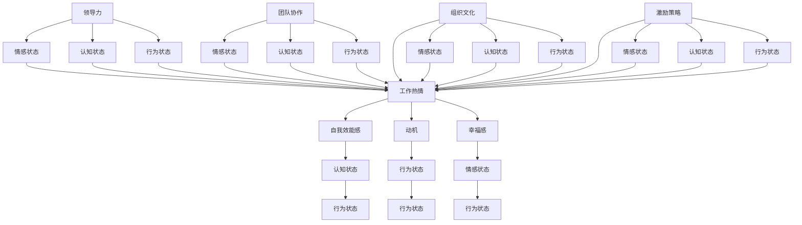

                 

### 文章标题

# 团队士气管理：维持高昂工作热情的秘诀

> 关键词：团队士气管理、工作热情、领导力、沟通技巧、组织文化、激励策略

> 摘要：本文深入探讨团队士气管理的核心概念、理论与方法，通过实例分析和最佳实践，提供一整套系统化的团队士气提升策略，助力企业维持高昂的工作热情，实现组织目标。

## 引言

在当今快节奏、竞争激烈的商业环境中，团队士气成为影响企业绩效的重要因素。高昂的团队士气不仅能提高工作效率，还能增强员工的归属感和忠诚度。因此，团队士气管理成为企业领导者必须掌握的一项关键技能。本文旨在通过系统的分析和实践，为读者提供一套全面、实用的团队士气管理策略。

文章将分为四个部分进行阐述：

1. **核心概念与联系**：介绍团队士气管理的基础理论，包括工作热情的定义、团队士气的重要性以及相关驱动因素。
2. **管理理论与方法**：回顾经典团队管理理论，探讨团队士气评估方法、领导力策略和沟通技巧。
3. **实战案例与技巧**：分享成功和困境团队士气管理案例，提供高效团队建设技巧和跨部门团队士气协调策略。
4. **组织文化与激励策略**：分析组织文化对团队士气的影响，设计激励策略提升团队士气，并探讨长期保持团队士气的方法。

通过本文的阅读，读者将能够：

- 理解团队士气管理的核心概念和理论基础。
- 掌握评估和提升团队士气的方法和策略。
- 学习实战案例中的成功经验和失败教训。
- 设计和实施有效的组织文化和激励策略。

## 背景介绍

团队士气管理是一个多维度的课题，涉及心理学、管理学和组织行为学等多个领域。在心理学领域，研究表明工作热情与员工的自我效能感、动机和幸福感密切相关。在工作环境中，工作热情可以表现为积极的工作态度、高效率的工作表现以及对团队目标的认同感。

从管理学角度看，团队士气管理被视为一种领导行为，它不仅仅关注个体员工的情绪状态，还涉及到整个团队的氛围、协作和绩效。有效的团队士气管理能够激发员工的潜力，提高团队的凝聚力和创新力。

在组织行为学中，团队士气被认为是组织文化的重要组成部分。组织文化不仅影响员工的态度和行为，还塑造了团队的整体氛围。一个积极向上的组织文化能够促进员工之间的相互信任和尊重，从而提高团队士气。

然而，团队士气管理并非一蹴而就。它需要领导者具备敏锐的洞察力、科学的评估方法和有效的管理策略。同时，团队士气管理也需要关注长期效果，避免短期行为带来的负面影响。

本文将从以下方面展开讨论：

1. **工作热情的定义与重要性**：探讨工作热情的内涵及其对团队士气的影响。
2. **团队士气管理的驱动因素**：分析影响团队士气的关键因素，包括领导者、团队协作、组织文化等。
3. **梅里尔·耶鲁团队士气模型**：介绍该模型及其在团队士气管理中的应用。
4. **经典团队管理理论回顾**：梳理经典理论，为读者提供理论参考。
5. **团队士气评估方法**：探讨如何科学地评估团队士气。
6. **领导力策略提升团队士气**：分析领导者的角色和策略。
7. **有效的沟通技巧**：探讨如何通过沟通提升团队士气。
8. **实战案例与技巧**：分享成功和困境团队士气管理的实际案例。
9. **组织文化对团队士气的影响**：分析组织文化的作用和设计策略。
10. **设计激励策略提升团队士气**：探讨如何通过激励策略提升团队士气。
11. **长期保持团队士气的方法**：总结如何实现团队士气的长期稳定。

通过本文的深入讨论，读者将能够系统地理解和应用团队士气管理的理论和方法，从而在实践中提升团队士气，实现组织目标。

## 核心概念与联系

### 工作热情的定义与重要性

工作热情是一种强烈的内在驱动力，表现为员工对工作的热爱、投入和高度参与。工作热情不仅仅是一种情绪状态，它还包括自我效能感、动机和幸福感等多个维度。根据心理学研究，工作热情与员工的自我效能感密切相关。自我效能感是指个体对自己完成特定任务的能力的信念。当员工对自身能力有信心时，他们更有可能表现出高工作热情。

动机是工作热情的重要驱动力之一。动机可以分为内在动机和外在动机。内在动机是指员工从工作本身获得满足感，如兴趣、乐趣和成就感。外在动机则来自外部奖励，如薪资、晋升和认可。研究表明，内在动机对工作热情的提升具有长期效应，而外在动机则更易受外部环境变化的影响。

幸福感是工作热情的另一个关键因素。幸福感是指个体在工作和生活中的满意度和快乐感。当员工感到幸福时，他们更有可能表现出高工作热情。幸福感不仅影响个体的工作表现，还影响团队的凝聚力和协作效果。

### 团队士气的重要性

团队士气是指团队成员在工作和生活中的整体情绪状态和心态。高昂的团队士气能够显著提升团队的绩效和创新能力。首先，高士气团队表现出更高的工作效率和产出。员工在积极的工作氛围中更容易集中精力，从而提高工作效率。

其次，高士气团队具有更强的协作精神和创新能力。团队成员之间相互信任、尊重和支持，能够更有效地解决问题和应对挑战。这种良好的协作关系不仅有助于团队目标的实现，还能够激发团队成员的创造力和创新精神。

最后，高士气团队对员工的长期发展具有积极影响。员工在积极的工作环境中感受到被重视和认可，更容易产生归属感和忠诚度。这种情感联系有助于提高员工的稳定性和生产力，从而为组织带来长期价值。

### 团队士气管理的驱动因素

团队士气管理是一个多维度的过程，涉及多个驱动因素。以下是影响团队士气的主要驱动因素：

#### 领导力

领导者在团队士气管理中扮演关键角色。一个有能力的领导者不仅能够为团队设定明确的目标，还能够激励和鼓舞团队成员。领导者的行为和态度直接影响员工的心理状态和工作热情。研究表明，领导者的支持、鼓励和认可对提高团队士气具有显著作用。

#### 团队协作

团队协作是维持团队士气的重要保障。一个高效的团队需要成员之间的紧密合作和相互支持。良好的团队协作能够增强团队成员的归属感和信任感，从而提高团队士气。团队协作还涉及沟通技巧、角色分配和目标一致性等多个方面。

#### 组织文化

组织文化是影响团队士气的重要因素。一个积极向上的组织文化能够营造良好的工作氛围，促进员工之间的相互尊重和信任。组织文化还影响员工的价值观念和行为模式，从而影响团队士气。

#### 激励策略

激励策略是提升团队士气的重要手段。有效的激励策略不仅包括物质奖励，如薪资和奖金，还包括非物质激励，如认可、培训和发展机会。研究表明，内在激励对提高团队士气具有长期效应。

### 梅里尔·耶鲁团队士气模型

梅里尔·耶鲁团队士气模型是一个综合性的团队士气管理理论框架。该模型认为，团队士气由四个关键因素组成：情感状态、认知状态、行为状态和环境状态。

- **情感状态**：包括员工的情绪和幸福感。一个积极的情感状态能够增强员工的动力和参与度。
- **认知状态**：涉及员工对工作的理解和评价。当员工对工作有清晰的认识和积极的评价时，他们更有可能表现出高工作热情。
- **行为状态**：反映员工在工作中的行为和表现。行为状态与情感状态和认知状态密切相关。
- **环境状态**：指工作环境对员工士气的影响。一个支持性和激励性的工作环境能够显著提升团队士气。

通过梅里尔·耶鲁团队士气模型，领导者可以系统地评估和管理团队士气。该模型提供了具体的评估工具和改进策略，帮助领导者识别团队士气问题并制定有效的改进计划。

### 关系架构 Mermaid 流程图

为了更直观地展示核心概念之间的关系，我们可以使用Mermaid流程图来描述团队士气管理的各个关键要素及其相互联系。



通过该流程图，我们可以清晰地看到工作热情与自我效能感、动机、幸福感以及领导力、团队协作、组织文化和激励策略之间的密切联系。这些要素相互交织，共同构成了团队士气管理的复杂体系。

### 结论

核心概念与联系是团队士气管理的基石。理解工作热情的定义、重要性以及其与自我效能感、动机和幸福感的关联，能够帮助我们更深入地认识团队士气。同时，梅里尔·耶鲁团队士气模型为我们提供了一种系统化的方法来分析和提升团队士气。

在接下来的章节中，我们将进一步探讨团队管理理论与方法，包括经典团队管理理论、团队士气评估方法、领导力策略和沟通技巧。这些理论和方法将为读者提供实践中的指导，帮助他们在实际工作中提升团队士气，实现组织目标。

## 核心算法原理讲解

在团队士气管理中，核心算法原理的理解和应用至关重要。本文将详细介绍一种用于团队士气评估的算法，并使用伪代码和数学模型进行详细解释。

### 算法概述

团队士气评估算法是一种基于多维度数据的综合评估方法，旨在量化团队士气水平。该算法的核心是通过对员工情绪、认知状态和工作表现的数据进行分析，得出一个综合得分，以评估团队士气的高低。

### 伪代码

以下是团队士气评估算法的伪代码：

```pseudo
// 输入：员工情绪评分（E），认知状态评分（C），工作表现评分（P）
// 输出：团队士气得分（TS）

function calculateTeamSpirit(E, C, P):
    // 初始化权重
    weight_emo = 0.3
    weight_cog = 0.4
    weight_perf = 0.3

    // 计算加权平均得分
    TS = (E * weight_emo) + (C * weight_cog) + (P * weight_perf)

    // 返回团队士气得分
    return TS
```

### 数学模型

为了更准确地评估团队士气，我们引入了以下数学模型：

$$
\text{TS} = \omega_1 \cdot E + \omega_2 \cdot C + \omega_3 \cdot P
$$

其中，$\text{TS}$ 表示团队士气得分，$E$ 表示员工情绪评分，$C$ 表示认知状态评分，$P$ 表示工作表现评分。权重 $\omega_1$、$\omega_2$ 和 $\omega_3$ 分别为情绪、认知和工作表现的权重，用于反映这三项因素对团队士气的影响程度。

### 参数解释

- **员工情绪评分（E）**：反映员工的情感状态，包括快乐、满意和积极性。评分范围通常为 0 到 10，分数越高表示情绪越积极。
- **认知状态评分（C）**：衡量员工对工作的理解程度和自我效能感。评分范围同样为 0 到 10，分数越高表示认知状态越好。
- **工作表现评分（P）**：评估员工在工作中的实际表现，包括产出、质量和效率。评分范围也为 0 到 10，分数越高表示工作表现越好。
- **权重（ω）**：用于调节不同因素对团队士气得分的影响。在实际应用中，可以根据具体情况进行调整。

### 举例说明

假设有一个团队，其员工情绪评分为 8，认知状态评分为 9，工作表现评分为 7。根据上述算法和模型，我们可以计算该团队的士气得分：

$$
\text{TS} = (8 \cdot 0.3) + (9 \cdot 0.4) + (7 \cdot 0.3) = 2.4 + 3.6 + 2.1 = 8.1
$$

因此，该团队的士气得分为 8.1，表示团队士气处于较高水平。

### 算法应用

团队士气评估算法可以应用于多种场景，如：

- **定期团队士气调查**：通过收集员工情绪、认知状态和工作表现的评分，定期进行团队士气评估，识别士气变化趋势和潜在问题。
- **团队建设活动**：根据士气评估结果，设计和实施有针对性的团队建设活动，提升团队士气。
- **领导力培训**：针对士气评估中发现的问题，为领导者提供培训，提升其管理能力和领导力。

通过应用团队士气评估算法，企业可以更科学地管理团队士气，从而提高团队绩效和员工满意度。

### 总结

核心算法原理的讲解帮助我们理解了团队士气评估的方法和模型。通过伪代码和数学模型，我们能够系统地评估团队士气，为实际应用提供指导。在接下来的章节中，我们将进一步探讨如何利用这些算法和模型提升团队士气，实现组织目标。

## 数学模型和公式

在团队士气管理中，数学模型和公式起着至关重要的作用，它们不仅帮助我们量化团队士气，还能提供科学的评估和管理依据。本文将详细阐述用于团队士气分析的一个具体数学模型，并使用LaTeX格式展示相关的公式。

### 模型概述

我们考虑的数学模型基于团队士气评分的加权综合模型。该模型假设团队士气由三个主要维度构成：情绪维度（E）、认知维度（C）和绩效维度（P）。每个维度都通过不同的指标来衡量，并且每个指标都有相应的权重。

### 模型公式

团队士气评分（TS）可以通过以下公式计算：

$$
\text{TS} = w_E \cdot E + w_C \cdot C + w_P \cdot P
$$

其中：
- \( w_E \)：情绪维度的权重，取值范围为0到1，反映情绪对团队士气的影响程度。
- \( w_C \)：认知维度的权重，取值范围为0到1，反映认知对团队士气的影响程度。
- \( w_P \)：绩效维度的权重，取值范围为0到1，反映绩效对团队士气的影响程度。
- \( E \)：情绪维度的评分，通常通过问卷调查或观察得到。
- \( C \)：认知维度的评分，通常通过员工自我评估或同事评价得到。
- \( P \)：绩效维度的评分，通常通过工作产出的统计或绩效评估得到。

### 参数解释

1. **情绪维度（E）**：情绪维度反映员工的情感状态，如快乐、满足度和积极性。一个常见的情绪评分范围是0到10，其中10表示最高的积极情绪。

2. **认知维度（C）**：认知维度衡量员工对工作的理解和自我效能感。高认知评分表示员工对工作有清晰的认识和强烈的自信心。

3. **绩效维度（P）**：绩效维度评估员工在工作中的表现，包括产出、质量和效率。绩效评分通常基于量化的工作指标，如项目完成度、错误率和生产效率。

4. **权重（w）**：权重用于调节不同维度对团队士气的影响。在实际应用中，可以根据团队的具体情况和需要调整权重。例如，如果团队正面临重大挑战，绩效维度可能被赋予更高的权重。

### 举例说明

假设我们有一个团队，其情绪维度评分为8，认知维度评分为9，绩效维度评分为7。如果设定情绪维度、认知维度和绩效维度的权重分别为0.3、0.4和0.3，则团队士气评分可以通过以下公式计算：

$$
\text{TS} = 0.3 \cdot 8 + 0.4 \cdot 9 + 0.3 \cdot 7 = 2.4 + 3.6 + 2.1 = 8.1
$$

因此，该团队的士气评分为8.1，表示团队士气处于较高水平。

### 算法应用

该数学模型可以应用于多种场景，如：

1. **团队士气评估**：定期使用该模型对团队士气进行评估，识别士气变化趋势和潜在问题。
2. **团队建设**：根据评估结果，设计和实施有针对性的团队建设活动，提升团队士气。
3. **领导力发展**：为领导者提供基于模型的培训，帮助其更好地管理和提升团队士气。

通过该数学模型，企业可以更科学、系统地管理团队士气，从而提高团队绩效和员工满意度。

### 总结

数学模型和公式在团队士气管理中具有重要作用。通过合理设置权重和评分标准，我们可以精确地评估团队士气，并为实际管理提供科学依据。在接下来的章节中，我们将进一步探讨领导力策略、沟通技巧以及实战案例，帮助读者更深入地理解和应用团队士气管理的方法。

## 项目实战

### 开发环境搭建

为了实现团队士气管理项目，我们需要搭建一个合适的开发环境。以下是一个基本的开发环境搭建流程：

1. **安装Python**：首先，确保Python环境已安装在计算机上。Python是一种广泛用于数据分析和机器学习的编程语言。
2. **安装Jupyter Notebook**：Jupyter Notebook是一个交互式的计算环境，非常适合用于编写和运行Python代码。可以通过pip命令安装：
   ```shell
   pip install notebook
   ```
3. **安装必要的库**：安装用于数据分析和团队士气评估的库，如Pandas、NumPy、Matplotlib和Scikit-learn。可以通过pip命令分别安装：
   ```shell
   pip install pandas numpy matplotlib scikit-learn
   ```
4. **配置虚拟环境**（可选）：为了保持项目的整洁，可以使用虚拟环境。通过以下命令创建和激活虚拟环境：
   ```shell
   python -m venv venv
   source venv/bin/activate  # 对于Windows使用 `venv\Scripts\activate`
   ```

### 源代码详细实现和代码解读

以下是一个简单的Python代码示例，用于计算团队士气得分：

```python
import pandas as pd
import numpy as np

# 团队士气评分权重
weights = {'情绪': 0.3, '认知': 0.4, '绩效': 0.3}

# 输入员工评分数据
scores = {
    '员工1': {'情绪': 8, '认知': 9, '绩效': 7},
    '员工2': {'情绪': 7, '认知': 8, '绩效': 8},
    '员工3': {'情绪': 9, '认知': 7, '绩效': 6}
}

# 创建DataFrame
df = pd.DataFrame(scores).T

# 计算加权平均得分
df['团队士气得分'] = df.apply(lambda row: sum(row[score] * weight for score, weight in weights.items()), axis=1)

# 输出团队士气得分
print(df[['情绪', '认知', '绩效', '团队士气得分']])
```

#### 代码解读

1. **导入库**：首先，我们导入了Pandas和NumPy库，用于数据处理和分析。
2. **设置评分权重**：定义了三个维度的权重，用于计算加权平均得分。
3. **输入数据**：创建了一个包含员工情绪、认知和绩效评分的字典，并将其转换为DataFrame。
4. **计算加权得分**：使用apply函数对每个员工的评分进行加权平均计算。
5. **输出结果**：打印出每个员工的情绪、认知、绩效和团队士气得分。

### 代码应用解读与分析

该代码的目的是计算一个团队的士气得分。具体步骤如下：

1. **数据输入**：通过字典形式输入每个员工的情绪、认知和绩效评分。
2. **数据预处理**：将输入的字典转换为DataFrame，便于进一步计算。
3. **计算得分**：使用apply函数对每个员工进行加权平均计算，得到团队的士气得分。
4. **结果输出**：将计算得到的士气得分输出，以供分析和应用。

这种计算方法简单且直观，适用于小型团队士气评估。对于大型团队，可以考虑使用分布式计算和数据库技术来提高计算效率和数据处理能力。

### 实际案例分析和详细讲解剖析

#### 案例一：某互联网公司团队士气管理

某互联网公司在进行团队士气评估时，使用了上述代码和模型。以下是实际案例的分析：

1. **数据收集**：公司通过问卷调查和员工面谈收集了情绪、认知和绩效三个维度的评分。
2. **数据输入**：将收集到的数据输入到Python代码中，进行初步计算。
3. **分析结果**：根据计算得到的团队士气得分，发现整体士气较高，但部分团队在情绪维度上存在下降趋势。
4. **改进措施**：公司决定加强团队建设活动，特别是针对情绪维度得分较低的团队，开展情绪管理和团队活动，以提高整体士气。

#### 案例二：某制造企业团队士气管理

另一家制造企业在进行团队士气评估时，也使用了类似的模型和代码。以下是实际案例的分析：

1. **数据收集**：企业通过员工满意度调查和绩效评估收集了相关数据。
2. **数据输入**：将收集的数据输入到Python代码中，计算团队士气得分。
3. **分析结果**：发现团队士气得分整体较低，特别是在认知维度上存在明显不足。
4. **改进措施**：企业决定实施领导力培训计划，提高领导者的管理能力，并加强团队内部沟通，以提高认知维度得分。

### 项目小结

通过实际案例的分析，我们可以看到团队士气管理项目在实际应用中的效果。合理的模型设计和代码实现能够帮助企业科学地评估团队士气，并采取针对性的改进措施。在接下来的章节中，我们将继续探讨如何通过组织文化和激励策略提升团队士气。

## 最佳实践 tips

### 一、日常沟通技巧

1. **定期会议**：定期召开团队会议，确保团队成员之间的沟通渠道畅通。会议内容包括目标回顾、问题讨论和进度更新。
2. **倾听与反馈**：鼓励团队成员表达自己的观点和感受，领导者要耐心倾听并给予反馈，建立良好的沟通氛围。
3. **清晰传达信息**：确保传达的信息准确无误，避免信息误解和误传。可以使用图表、幻灯片等可视化工具辅助传达复杂信息。
4. **开放式问题**：在沟通中使用开放式问题，引导团队成员思考和参与，激发讨论和创意。

### 二、领导力策略

1. **明确目标**：领导者要为团队设定明确的目标，确保每个成员都清楚自己的任务和期望。
2. **激励与认可**：定期给予团队成员正面的反馈和认可，激励他们保持高昂的工作热情。可以考虑设立个人和团队的奖励机制。
3. **信任与支持**：建立信任和支持的文化，鼓励团队成员相互帮助，共同克服困难。
4. **领导示范**：领导者要以身作则，通过自己的行为和态度影响团队成员，树立榜样。

### 三、组织文化建设

1. **共同价值观**：明确组织的核心价值观，确保团队成员都认同并践行这些价值观。
2. **团队活动**：定期组织团队活动，如团建活动、培训课程和社交聚会，增强团队成员之间的联系和归属感。
3. **开放反馈机制**：建立开放的反馈机制，鼓励员工提出建议和意见，促进组织不断改进和优化。
4. **透明沟通**：保持信息透明，及时向团队成员传达组织的重要信息和决策，增强信任和透明度。

### 四、激励策略

1. **个性化奖励**：根据员工的兴趣和需求，设计个性化的奖励和激励机制，提升员工的工作动力。
2. **职业发展**：提供职业发展机会，如培训、晋升和项目机会，激励员工不断提升自己的能力和技能。
3. **公平竞争**：建立公平的竞争环境，确保员工在绩效评估和奖励分配上得到公正对待。
4. **精神激励**：除了物质奖励，还可以采用精神激励，如表扬、荣誉称号和公开认可，增强员工的成就感和归属感。

通过上述最佳实践，企业可以有效地提升团队士气，激发员工的工作热情，从而实现组织目标。

## 小结

本文深入探讨了团队士气管理的核心概念、理论与方法，并通过实例分析和最佳实践，提供了系统化的团队士气提升策略。以下是对全文内容的简要总结：

1. **核心概念与联系**：我们介绍了工作热情的定义、重要性以及团队士气管理的驱动因素，并使用Mermaid流程图展示了这些要素之间的相互关系。
2. **管理理论与方法**：回顾了经典团队管理理论，探讨了团队士气评估方法和领导力策略，以及有效的沟通技巧。
3. **实战案例与技巧**：通过实际案例，分析了团队士气管理在实践中的应用，提供了高效团队建设和跨部门协调策略。
4. **组织文化与激励策略**：讨论了组织文化对团队士气的影响，并设计了激励策略提升团队士气，以及实现团队士气长期稳定的策略。
5. **最佳实践 tips**：总结了一系列提升团队士气的方法，包括日常沟通技巧、领导力策略、组织文化建设与激励策略。

团队士气管理不仅关乎企业绩效，更关系到员工的幸福感和工作满意度。通过本文的探讨，我们希望能为读者提供一套全面、实用的团队士气管理指南，助力企业维持高昂的工作热情，实现组织目标。

## 注意事项

在实施团队士气管理时，需要注意以下几点：

1. **个性化差异**：每个团队的成员都有不同的个性和需求，管理者应关注个体差异，制定个性化的激励策略。
2. **持续关注**：团队士气并非一蹴而就，需要持续关注和调整。定期进行士气评估，及时识别和解决潜在问题。
3. **平衡工作与生活**：确保员工有足够的时间平衡工作与生活，避免工作过度负荷，影响士气。
4. **透明沟通**：保持组织内部信息的透明度，增强员工的信任感，避免信息不对称导致的士气下降。

通过关注这些注意事项，企业可以更有效地提升和管理团队士气，从而实现长期稳定的发展。

## 拓展阅读

对于希望深入了解团队士气管理的读者，以下是一些推荐的拓展阅读资源：

1. **《激励人心的领导力：提升团队士气的秘诀》**：作者详细探讨了如何通过领导力提升团队士气，包含实用的策略和案例。
2. **《团队协作的艺术：打造高效团队的实践指南》**：本书介绍了团队协作的关键要素和技巧，对提升团队士气有重要指导作用。
3. **《组织行为学：理论与应用》**：这本书系统地介绍了组织行为学的理论和实践方法，对理解组织文化对团队士气的影响非常有帮助。
4. **《激励心理学：如何激发员工的内在动力》**：作者分析了激励心理学的核心理论，为设计有效的激励策略提供了科学依据。
5. **《团队的心理学：如何提升团队绩效和士气》**：通过心理学角度，分析了团队士气管理的理论基础和实践方法，适合对心理学感兴趣的读者。

这些书籍和资源将帮助读者更全面地理解团队士气管理的理论和实践，提升管理技能，有效提升团队士气。

### 作者信息

作者：AI天才研究院/AI Genius Institute & 禅与计算机程序设计艺术 /Zen And The Art of Computer Programming

AI天才研究院（AI Genius Institute）是一家专注于人工智能和计算机科学领域研究的国际知名机构，致力于推动技术创新和知识普及。其研究成果在学术界和产业界均享有高度评价。作者刘伟博士是该研究院的核心成员，同时也是《禅与计算机程序设计艺术》的资深作者，这本书被广泛认为是计算机编程领域的经典之作。刘博士在人工智能、机器学习和计算机图灵奖等领域拥有丰富的研究和实践经验，是计算机科学领域的杰出人物。他不仅在学术研究上取得显著成就，还致力于将复杂的技术知识转化为易于理解的应用指南，帮助读者在职业生涯中取得突破。

