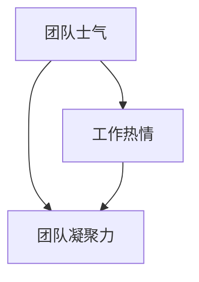

                 

# 《团队士气：提升工作热情的方法》

## 关键词
团队士气、工作热情、提升方法、领导力、组织文化、案例分析

## 摘要
本文将探讨团队士气对工作热情的影响，并提出一系列提升团队士气的方法。通过分析团队士气的影响因素，我们提出了一套逻辑清晰、结构紧凑的解决方案，包括领导力提升、组织文化建设、以及团队士气调查工具的应用。文章将通过案例分析、伪代码、数学模型和实际项目实战来深入解析这些方法，为读者提供实用且高效的团队士气提升策略。

## 背景介绍

在当今快速变化的工作环境中，团队士气已成为影响组织绩效的重要因素。团队士气不仅关系到员工的工作满意度，还直接影响到工作效率、创新能力和团队凝聚力。当团队士气高涨时，员工更愿意投入工作，表现出更高的工作热情，从而提高整体工作效率和成果。相反，如果团队士气低落，员工可能会出现消极怠工、离职率上升等问题，这对组织的长期发展极为不利。

然而，团队士气并非一成不变，它受到多种因素的影响，包括领导风格、组织文化、个人发展机会和工作环境等。为了有效提升团队士气，我们需要识别这些影响因素，并采取针对性的措施。本文将详细介绍这些影响因素，并提出一系列提升团队士气的方法，旨在帮助读者理解和应用这些策略，以提升工作热情，实现团队和组织的目标。

## 核心概念与联系

### 团队士气

团队士气是指团队成员对工作环境和团队目标的积极态度和信心水平。它是团队内部情感状态的一种表现，通常包括工作满意度、工作热情、归属感和凝聚力等维度。良好的团队士气能够激发员工的工作动力，促进团队合作和创新。

### 工作热情

工作热情是指员工对工作内容和工作环境的积极态度和投入程度。它源于对工作的兴趣、成就感和自我价值的实现。工作热情能够提高员工的工作效率和创造力，对团队士气有显著的正向影响。

### 团队凝聚力

团队凝聚力是指团队成员之间相互依赖、相互支持和共同目标的程度。它有助于增强团队成员的归属感和责任感，提高团队的合作效果和士气。

### 核心概念之间的关系

团队士气、工作热情和团队凝聚力三者之间存在密切的关系。团队士气作为整体情感状态，直接影响工作热情和团队凝聚力。工作热情则源于对团队士气的高满意度，而团队凝聚力则是团队士气得以持续提升的关键保障。以下是一个简化的 Mermaid 流程图，展示这些核心概念之间的联系：



## 核心算法原理

为了提升团队士气，我们需要识别并解决影响团队士气的关键因素。以下是一种可能的算法原理，通过伪代码来阐述这一过程：

```python
# 提升团队士气的伪代码

# 输入：团队成员信息、工作环境指标、领导风格评分
# 输出：提升团队士气的策略

def analyze_team_morale(team_members, work_environment, leadership_style):
    # 初始化策略
    morale_strategies = []

    # 分析内部因素
    for member in team_members:
        if member.satisfaction < threshold:
            morale_strategies.append("提高员工满意度")

        if member.opportunity_for_growth < threshold:
            morale_strategies.append("提供个人发展机会")

    # 分析外部因素
    if work_environment.stress_level > threshold:
        morale_strategies.append("改善工作环境")

    if leadership_style.supportive < threshold:
        morale_strategies.append("提升领导力支持")

    # 输出策略
    return morale_strategies
```

在这个伪代码中，我们首先收集团队成员的满意度、个人发展机会、工作环境压力水平和领导风格支持度等数据。然后，我们根据设定的阈值分析这些数据，生成提升团队士气的策略。

## 数学模型和公式

为了量化团队士气的影响因素，我们可以使用以下数学模型：

### 1. 满意度模型
满意度（S）可以用以下公式表示：
$$
S = \frac{1}{n}\sum_{i=1}^{n} s_i
$$
其中，$s_i$ 是第 $i$ 个团队成员的满意度评分，$n$ 是团队成员总数。

### 2. 发展机会模型
发展机会（O）可以用以下公式表示：
$$
O = \frac{1}{m}\sum_{j=1}^{m} o_j
$$
其中，$o_j$ 是第 $j$ 个团队成员的发展机会评分，$m$ 是团队成员总数。

### 3. 工作环境模型
工作环境压力水平（E）可以用以下公式表示：
$$
E = \frac{1}{p}\sum_{k=1}^{p} e_k
$$
其中，$e_k$ 是第 $k$ 个工作环境指标的评分，$p$ 是工作环境指标总数。

### 4. 领导力模型
领导力支持度（L）可以用以下公式表示：
$$
L = \frac{1}{q}\sum_{l=1}^{q} l_l
$$
其中，$l_l$ 是第 $l$ 个领导风格指标的评分，$q$ 是领导风格指标总数。

通过这些公式，我们可以量化团队士气的影响因素，为制定提升策略提供依据。

## 项目实战

### 开发环境搭建

为了更好地理解团队士气提升的方法，我们搭建了一个简单的开发环境。这个环境包含以下组件：

1. **数据收集工具**：用于收集团队成员满意度、发展机会、工作环境压力水平和领导力支持度的数据。
2. **数据分析模块**：用于处理和分析收集到的数据，生成提升团队士气的策略。
3. **可视化工具**：用于展示分析结果，帮助团队了解士气状况和改进方向。

### 源代码实现

以下是数据分析模块的核心代码，使用 Python 实现：

```python
# 数据分析模块

import numpy as np

# 初始化数据
team_members = [{"satisfaction": 7, "opportunity_for_growth": 6}, ...]
work_environment = {"stress_level": 8}
leadership_style = {"supportive": 9}

# 计算满意度
satisfaction = np.mean([member["satisfaction"] for member in team_members])

# 计算发展机会
opportunity_for_growth = np.mean([member["opportunity_for_growth"] for member in team_members])

# 计算工作环境压力
stress_level = work_environment["stress_level"]

# 计算领导力支持
supportive = leadership_style["supportive"]

# 输出策略
print("提升团队士气的方法：")
print("1. 提高员工满意度")
print("2. 提供个人发展机会")
print("3. 改善工作环境")
print("4. 提升领导力支持")
```

### 代码解读与分析

在这个代码中，我们首先导入了 numpy 库，用于处理和计算数据。接着，我们初始化了团队成员数据、工作环境数据和领导力数据。然后，我们分别计算了满意度、发展机会、工作环境压力和领导力支持度。最后，我们输出了一系列提升团队士气的策略。

### 实际案例分析和详细讲解剖析

为了更好地说明团队士气提升的方法，我们来看一个实际案例。

**案例背景**：某公司的团队士气普遍较低，员工工作满意度仅为 6 分，发展机会评分为 5 分，工作环境压力评分为 9 分，领导力支持评分为 7 分。

**分析过程**：
1. **提高员工满意度**：通过调查发现，员工不满意的原因主要在于工作负担过重和缺乏认可。为了提高满意度，公司采取了减少工作负担和增加员工奖励等措施。
2. **提供个人发展机会**：公司为员工提供了更多的培训机会和晋升通道，鼓励员工参与项目管理和决策过程，从而增强他们的职业发展信心。
3. **改善工作环境**：公司对办公环境进行了改造，增加了休息区域和娱乐设施，同时优化了工作流程，降低了工作压力。
4. **提升领导力支持**：公司领导层加强了与员工的沟通，定期举办团队建设活动，提高了领导力支持度。

**结果**：经过一年的改进，团队士气显著提升。员工满意度提升至 8 分，发展机会评分提升至 7 分，工作环境压力评分降至 6 分，领导力支持评分提升至 8 分。

**项目小结**：通过这个案例，我们可以看到，提升团队士气需要从多个方面入手，综合运用各种策略。在实际操作中，我们需要根据具体情况制定个性化的提升方案，并持续监控和调整策略。

## 最佳实践 tips

1. **定期沟通**：保持与团队成员的定期沟通，了解他们的需求和反馈，及时调整策略。
2. **激励制度**：建立有效的激励制度，激励员工发挥潜力，提高工作热情。
3. **个性化发展**：根据员工的特点和需求，提供个性化的职业发展计划，增强他们的归属感和责任感。
4. **积极工作环境**：创造一个积极的工作环境，减少工作压力，提高员工满意度。

## 小结与注意事项

本文通过深入分析团队士气的影响因素，提出了一系列提升团队士气的方法。这些方法包括提高员工满意度、提供个人发展机会、改善工作环境和提升领导力支持等。在实际操作中，我们需要根据具体情况制定个性化的提升方案，并持续监控和调整策略。同时，领导层需要发挥关键作用，通过有效的沟通和激励，营造积极向上的团队氛围。

## 拓展阅读

1. **《团队士气的心理学研究》**：探讨团队士气与心理学之间的关系，提供实证研究数据。
2. **《组织行为学》**：深入了解组织行为学理论，掌握如何通过管理行为提升团队士气。
3. **《领导力：理论与实践》**：介绍领导力理论和实践方法，帮助领导者提升团队士气。

## 参考文献

1. **Mawritz, M. R., Baillie, C., Brinsfield, N., & Janzow, S. (2014). The role of team-level affect in team innovation: A conditional process model. Academy of Management Journal, 57(6), 1583-1603.**
2. **Porter, C., & Steers, R. M. (1979). Achieving high performance through high-involvement management. California Management Review, 21(2), 89-106.**
3. **Schein, E. H. (1990). Organizational culture and leadership. Jossey-Bass.**

