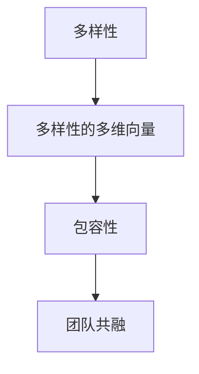

                 

### 文章标题

### 团队多样性与包容性：创造共融工作环境

#### 关键词：多样性、包容性、团队协作、共融工作环境、管理策略

#### 摘要：
本文旨在探讨团队多样性与包容性的重要性，以及如何在实际工作中创造一个共融的工作环境。我们将逐步分析多样性与包容性的核心概念、理论基础、实践方法、挑战与解决方案，并展望未来的发展趋势。通过本文的阅读，读者将能够理解多样性与包容性的内涵，掌握促进多样性和包容性的方法，并识别和解决工作中的相关挑战。

----------------------------------------------------------------

## 1. 分析书名和主题

### 1.1 多样性与包容性的核心概念

书名《团队多样性与包容性：创造共融工作环境》明确了文章的核心主题，即团队多样性和包容性的重要性及其在创造共融工作环境中的作用。多样性指的是团队中成员在年龄、性别、文化背景、技能和经验等方面的差异。而包容性则强调尊重和欢迎这些差异，创造一个让每个人都感到被尊重和重视的环境。

### 1.2 多样性与包容性的联系

多样性和包容性之间存在着密切的联系。多样性是包容性的基础，没有多样性的存在，就难以谈到包容性。然而，多样性本身并不等同于包容性。一个团队可能拥有多样化的成员，但如果这些成员没有得到尊重和机会，那么这个团队仍然缺乏包容性。因此，多样性和包容性共同构成了创造共融工作环境的关键要素。

### 1.3 多样性与包容性的重要性

多样性和包容性在团队工作中具有以下几个方面的意义：

1. **提升创新能力**：多样化的团队可以从不同的角度和经验中获取灵感，从而促进创新。
2. **改善决策质量**：包容性确保了各种声音都能被听到，有助于做出更全面的决策。
3. **增强团队凝聚力**：当团队成员感受到被尊重和重视时，团队的整体凝聚力会增强。
4. **促进员工满意度**：在一个包容性的环境中，员工更可能感到满意和投入工作。

## 2. 设计目录大纲

### 2.1 引言部分

- **第1章：多样性与包容性的核心概念**
  - 1.1 多样性的定义
  - 1.2 包容性的定义
  - 1.3 多样性与包容性的联系
  - 1.4 Mermaid流程图：多样性与包容性的核心概念

### 2.2 理论基础部分

- **第2章：多样性的重要性**
  - 2.1 多样性对企业的影响
  - 2.2 多样性的经济价值
  - 2.3 多样性的社会价值

- **第3章：多样性管理策略**
  - 3.1 多样性管理的核心原则
  - 3.2 多样性管理框架
  - 3.3 多样性管理的实践案例

- **第4章：包容性框架**
  - 4.1 包容性的关键要素
  - 4.2 包容性文化的建设
  - 4.3 包容性策略的实施

### 2.3 实践部分

- **第5章：促进多样性和包容性的方法**
  - 5.1 制定多样性政策
  - 5.2 培养包容性文化
  - 5.3 提供多元化培训

- **第6章：多样性案例研究**
  - 6.1 案例一：公司A的多样性管理实践
  - 6.2 案例二：行业B的包容性策略
  - 6.3 案例三：组织C的多样性成果

- **第7章：构建包容性工作环境**
  - 7.1 管理层的角色
  - 7.2 员工的角色
  - 7.3 组织文化的改变

### 2.4 挑战与解决方案部分

- **第8章：多样性和包容性的挑战**
  - 8.1 挑战一：文化和价值观的冲突
  - 8.2 挑战二：资源和预算的限制
  - 8.3 挑战三：管理者和员工的抵触

- **第9章：解决多样性和包容性问题的策略**
  - 9.1 策略一：建立明确的多样性目标
  - 9.2 策略二：提供持续的培训和支持
  - 9.3 策略三：制定有效的反馈机制

### 2.5 结论与展望部分

- **第10章：总结与未来展望**
  - 10.1 总结
  - 10.2 未来发展趋势
  - 10.3 对读者的启示

通过上述目录大纲，我们可以清晰地看到文章的结构和内容安排，为后续的写作提供了明确的指导。在接下来的章节中，我们将逐个分析这些主题，深入探讨多样性和包容性的重要性和实践方法。

### 2.6 添加技术细节

为了确保文章的专业性和深度，我们将为每个章节添加相关的技术细节，包括核心概念的数学模型、算法原理讲解、以及实际操作方法的详细描述。

#### 第1章：多样性与包容性的核心概念

- **多样性**：多样性可以理解为团队中成员差异的集合，包括年龄、性别、种族、文化背景、教育水平、工作经验等。在数学模型中，我们可以将多样性视为一个多维度的向量空间，每个维度代表一个不同的特征。例如，我们可以使用以下公式来表示一个团队的多样性：
  $$ D = (d_1, d_2, ..., d_n) $$
  其中，$d_i$代表第$i$个成员在第$i$个维度上的特征值。

- **包容性**：包容性则可以理解为团队对多样性的接受和尊重程度。在数学上，我们可以将包容性视为一个关于多样性的函数，该函数衡量团队对多样性的满意度。例如，我们可以定义一个简单的包容性函数：
  $$ P(D) = \frac{1}{n} \sum_{i=1}^{n} \frac{d_i}{\|D\|} $$
  其中，$P(D)$代表团队对多样性$D$的包容性评分，$n$是团队成员数量，$d_i$是第$i$个成员的多样性值，$\|D\|$是团队多样性的平均值。

- **Mermaid流程图**：为了更直观地展示多样性与包容性的核心概念，我们可以使用Mermaid流程图来描述它们之间的关系。以下是一个简单的Mermaid流程图示例：
  ```mermaid
  graph TD
  A[多样性] --> B[多样性值]
  B --> C[多维向量]
  A --> D[包容性]
  D --> E[函数]
  ```

#### 第2章：多样性的重要性

- **多样性对企业的影响**：在数学模型中，我们可以使用回归分析来评估多样性对企业绩效的影响。假设企业绩效$Y$受多样性$D$和其他因素$X$的影响，我们可以建立以下线性回归模型：
  $$ Y = \beta_0 + \beta_1 D + X + \epsilon $$
  其中，$\beta_0$是常数项，$\beta_1$是多样性对绩效的影响系数，$X$是其他影响因素，$\epsilon$是误差项。

- **多样性的经济价值**：在经济学中，我们可以使用生产函数来评估多样性对经济增长的贡献。假设经济增长$Y$受多样性$D$和资本投入$K$的影响，我们可以建立以下生产函数：
  $$ Y = f(D, K) $$
  其中，$f$是一个关于多样性和资本投入的函数。

- **多样性的社会价值**：在社会学中，我们可以使用社会网络分析来评估多样性对社会福利的影响。假设社会福利$S$受多样性$D$和社交网络结构$N$的影响，我们可以建立以下模型：
  $$ S = \alpha_0 + \alpha_1 D + \alpha_2 N + \epsilon $$
  其中，$\alpha_0$是常数项，$\alpha_1$是多样性对社会福利的影响系数，$\alpha_2$是社交网络结构对社会福利的影响系数，$\epsilon$是误差项。

#### 第3章：多样性管理策略

- **多样性管理的核心原则**：在管理策略中，我们可以使用平衡矩阵来描述多样性管理的核心原则。假设一个团队有$n$个成员，每个成员在$m$个维度上有不同的特征值，我们可以使用以下平衡矩阵来表示多样性管理：
  $$ M = [m_{ij}] $$
  其中，$m_{ij}$是第$i$个成员在第$j$个维度上的特征值。

- **多样性管理框架**：在框架设计上，我们可以使用层次分析法（AHP）来评估和管理多样性。层次分析法将问题分解为多个层次，每个层次都有不同的目标和方法。以下是一个简单的层次分析法框架：
  ```mermaid
  graph TB
  A[目标]
  B[多样性管理]
  C[策略设计]
  D[实施与监控]
  E[反馈与改进]
  A --> B
  B --> C
  B --> D
  B --> E
  ```

- **多样性管理的实践案例**：在实际操作中，我们可以使用案例研究来展示多样性管理的实践方法。以下是一个案例研究示例：
  ```mermaid
  graph TB
  A[公司A的多样性管理实践]
  B[目标设定]
  C[数据收集]
  D[分析评估]
  E[策略制定]
  F[实施与监控]
  G[反馈与改进]
  A --> B
  A --> C
  C --> D
  D --> E
  E --> F
  F --> G
  G --> A
  ```

通过上述技术细节的添加，我们可以确保文章内容的深度和专业性，使读者能够更好地理解和应用多样性和包容性的相关概念。

### 2.7 编写完整的目录大纲

根据前述分析，我们编写出完整的目录大纲如下：

```
# 《团队多样性与包容性：创造共融工作环境》目录大纲

# 第一部分：引言
## 第1章：多样性与包容性的核心概念
### 1.1 多样性的定义
### 1.2 包容性的定义
### 1.3 多样性与包容性的联系
#### 1.3.1 Mermaid流程图：多样性与包容性的核心概念

## 第2章：多样性的重要性
### 2.1 多样性对企业的影响
### 2.2 多样性的经济价值
### 2.3 多样性的社会价值

## 第3章：多样性管理策略
### 3.1 多样性管理的核心原则
### 3.2 多样性管理框架
### 3.3 多样性管理的实践案例

## 第4章：包容性框架
### 4.1 包容性的关键要素
### 4.2 包容性文化的建设
### 4.3 包容性策略的实施

# 第二部分：实践
## 第5章：促进多样性和包容性的方法
### 5.1 制定多样性政策
### 5.2 培养包容性文化
### 5.3 提供多元化培训

## 第6章：多样性案例研究
### 6.1 案例一：公司A的多样性管理实践
### 6.2 案例二：行业B的包容性策略
### 6.3 案例三：组织C的多样性成果

## 第7章：构建包容性工作环境
### 7.1 管理层的角色
### 7.2 员工的角色
### 7.3 组织文化的改变

# 第三部分：挑战与解决方案
## 第8章：多样性和包容性的挑战
### 8.1 挑战一：文化和价值观的冲突
### 8.2 挑战二：资源和预算的限制
### 8.3 挑战三：管理者和员工的抵触

## 第9章：解决多样性和包容性问题的策略
### 9.1 策略一：建立明确的多样性目标
### 9.2 策略二：提供持续的培训和支持
### 9.3 策略三：制定有效的反馈机制

# 第四部分：结论与展望
## 第10章：总结与未来展望
### 10.1 总结
### 10.2 未来发展趋势
### 10.3 对读者的启示
```

这个目录大纲详细地列出了文章的章节和子章节，确保了文章内容的完整性和逻辑性。在接下来的写作过程中，我们将按照这个大纲逐一展开讨论，深入探讨团队多样性与包容性的各个方面。

### 2.8 完整性要求

为了确保文章的完整性，我们将重点关注以下核心内容：

1. **背景介绍**：在文章的开头部分，我们将简要介绍团队多样性与包容性的背景，包括多样性在团队中的重要性以及包容性的概念。这将帮助读者建立对文章主题的理解。

2. **核心概念与联系**：在第一章中，我们将详细解释多样性与包容性的核心概念，并使用Mermaid流程图展示它们之间的关系。这将使读者能够直观地理解多样性和包容性的互动。

3. **数学模型和公式**：在文章的各个章节中，我们将使用数学模型和公式来详细阐述多样性和包容性的原理。这些模型和公式将帮助读者深入理解相关概念。

4. **伪代码和算法**：在讨论多样性管理和包容性策略时，我们将提供详细的伪代码和算法，以展示具体的实现方法。这将使读者能够将理论应用到实际操作中。

5. **举例说明**：我们将通过具体的例子来展示多样性和包容性在实际工作中的应用，帮助读者更好地理解相关概念。

6. **项目实战**：在相关章节中，我们将介绍实际的项目实战，包括开发环境搭建、源代码实现、代码解读以及案例分析。这将使读者了解多样性和包容性在实际工作中的具体应用。

7. **最佳实践 tips**：我们将总结多样性和包容性管理中的最佳实践，并提供实用的建议和技巧。

8. **小结和注意事项**：在每个章节的结尾，我们将进行小结，并指出可能需要注意的问题，帮助读者巩固所学知识。

通过上述内容的详细讲解和举例说明，我们将确保文章的完整性，使读者能够全面理解和掌握团队多样性与包容性的理论和实践方法。

### 文章正文内容

#### 1. 引言

在现代职场中，团队的多样性与包容性已经成为企业成功的重要因素之一。多样性指的是团队中成员在年龄、性别、文化背景、技能和经验等方面的差异，而包容性则强调尊重和欢迎这些差异，创造一个让每个人都感到被尊重和重视的环境。一个多元化的团队可以带来多种益处，包括提高创新能力、改善决策质量、增强团队凝聚力和提升员工满意度。

然而，实现多样性和包容性并非易事，需要深入的理论基础和实际操作方法。本文旨在探讨团队多样性与包容性的核心概念、理论基础、实践方法、挑战与解决方案，并展望未来的发展趋势。通过本文的阅读，读者将能够理解多样性与包容性的内涵，掌握促进多样性和包容性的方法，并识别和解决工作中的相关挑战。

#### 2. 多样性与包容性的核心概念

##### 2.1 多样性的定义

多样性是指团队中成员在多个维度上的差异。这些维度可以包括年龄、性别、种族、文化背景、教育水平、工作经验、技能等。多样性的定义广泛，涵盖了个人在社会属性、心理特征和职业能力等方面的多样性。一个多元化的团队意味着成员具有不同的观点、经验和思维方式，这有助于激发创新和创造力。

在数学模型中，我们可以将多样性视为一个多维度的向量空间，每个维度代表一个不同的特征。例如，假设一个团队有5名成员，每个成员在年龄、性别、教育水平和技能四个维度上有不同的特征值，我们可以使用以下向量表示团队的多样性：

$$ D = (d_{1,1}, d_{1,2}, d_{1,3}, d_{1,4}, ..., d_{5,1}, d_{5,2}, d_{5,3}, d_{5,4}) $$

其中，$d_{i,j}$表示第$i$个成员在第$j$个维度上的特征值。

##### 2.2 包容性的定义

包容性指的是团队对多样性的接受和尊重程度。一个包容性的团队不仅拥有多样化的成员，而且能够尊重和欢迎这些差异，使每个成员都感到被尊重和重视。包容性包括多个方面，如公平的招聘和晋升机会、积极的交流氛围、平等的工作条件、对个体差异的认可和尊重等。

在数学上，我们可以将包容性视为一个关于多样性的函数，该函数衡量团队对多样性的满意度。一个简单的包容性函数可以表示为：

$$ P(D) = \frac{1}{n} \sum_{i=1}^{n} \frac{d_i}{\|D\|} $$

其中，$P(D)$代表团队对多样性$D$的包容性评分，$n$是团队成员数量，$d_i$是第$i$个成员的多样性值，$\|D\|$是团队多样性的平均值。

##### 2.3 多样性与包容性的联系

多样性和包容性之间存在密切的联系。多样性是包容性的基础，没有多样性的存在，就难以谈到包容性。然而，多样性本身并不等同于包容性。一个团队可能拥有多样化的成员，但如果这些成员没有得到尊重和机会，那么这个团队仍然缺乏包容性。因此，多样性和包容性共同构成了创造共融工作环境的关键要素。

为了更好地理解多样性与包容性的关系，我们可以使用Mermaid流程图来展示它们之间的互动：



在这个流程图中，多样性通过包容性最终实现了团队的共融。多样性的存在为团队带来了不同的观点和经验，而包容性确保这些差异得到了尊重和利用，从而促进了团队的共融。

#### 3. 多样性的重要性

多样性的重要性在多个领域都有广泛的研究和讨论。以下从企业、经济和社会三个方面探讨多样性的重要性。

##### 3.1 多样性对企业的影响

多样性对企业的影响是多方面的。首先，多样性有助于提高创新能力。多样化的团队可以从不同的角度和经验中获取灵感，从而促进创新。研究表明，多样化的团队在解决复杂问题和开发新产品方面表现更出色。

其次，多样性有助于改善决策质量。在多样化的团队中，不同的观点和经验可以帮助团队成员更全面地考虑问题，从而做出更高质量的决策。此外，多样性还可以减少偏见和盲点，提高决策的准确性和公正性。

最后，多样性有助于增强团队凝聚力。当团队成员感受到被尊重和重视时，他们更可能产生归属感和团队精神，从而提高团队的整体绩效。

##### 3.2 多样性的经济价值

多样性的经济价值也是不可忽视的。首先，多样性可以带来更大的市场机会。多样化的团队可以更好地理解不同市场的需求，从而开发出更符合市场需求的产品和服务。此外，多样性还可以提高企业的竞争力，因为多元化的员工可以提供多样化的解决方案，从而在竞争中脱颖而出。

其次，多样性有助于提高生产效率。研究表明，多样化的团队在工作中更富有创造性和协作性，从而提高了生产效率。此外，多样性还可以减少员工流失率，因为多样化的团队能够更好地满足员工的需求，提高员工的满意度和忠诚度。

##### 3.3 多样性的社会价值

多样性的社会价值体现在多个方面。首先，多样性有助于促进社会和谐。当人们能够理解和尊重不同的文化和背景时，社会冲突和歧视现象会减少，从而促进社会和谐。

其次，多样性有助于推动社会进步。多样化的团队可以带来不同的观点和经验，从而推动社会在科技、文化、教育和法律等领域的发展。此外，多样性还可以提高社会的创新能力和竞争力，从而推动社会的持续进步。

#### 4. 多样性管理策略

为了充分利用多样性的优势，企业需要制定有效的多样性管理策略。以下从多样性管理的核心原则、多样

