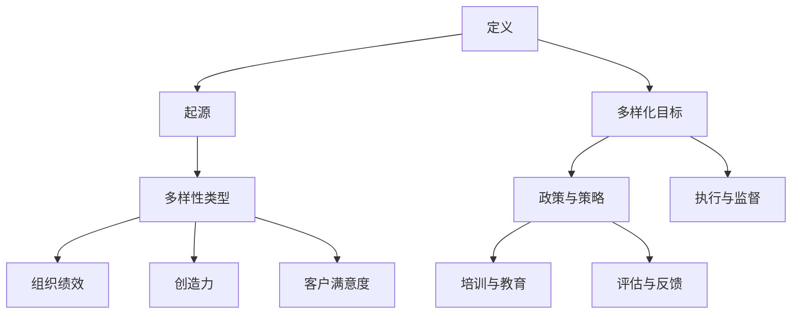
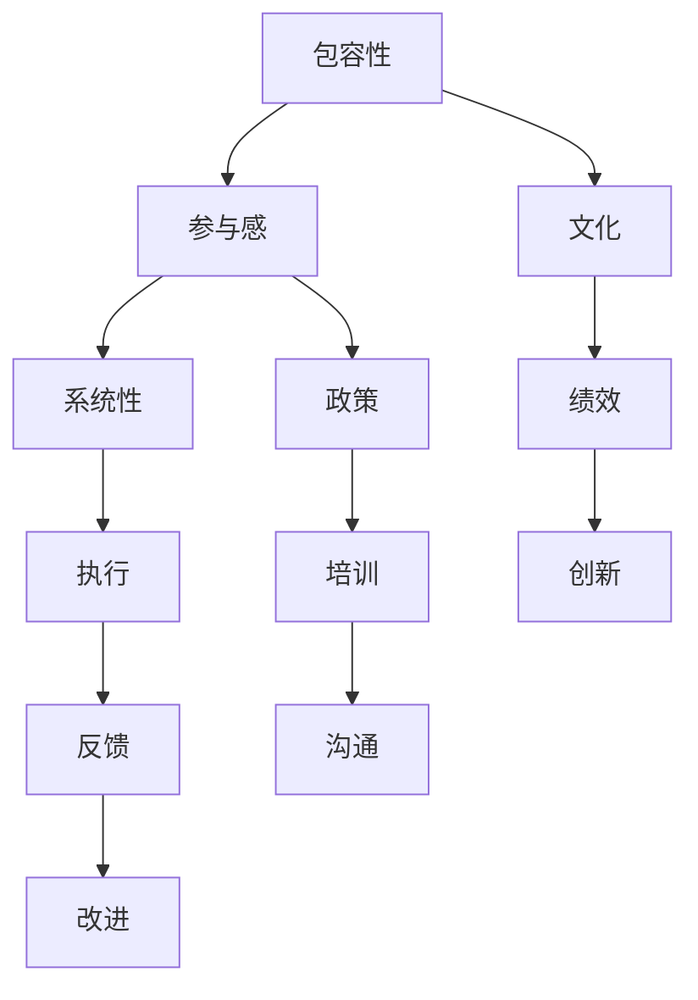
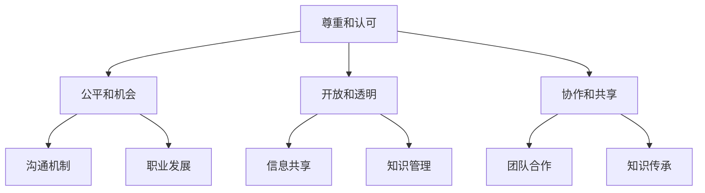

                 


### 文章标题：团队多样性管理2.0：创造包容性创新环境

关键词：团队多样性管理、包容性创新环境、多样性管理2.0、创新策略、多样性测量、技术实践

摘要：本文探讨了团队多样性管理2.0的概念及其在创造包容性创新环境中的应用。通过分析多样性管理的背景和定义，本文详细阐述了多样性管理2.0的核心要素和实践方法，并提供了构建包容性创新环境的策略和挑战解决方案。文章最后讨论了多样性管理的未来趋势，为读者提供了完整的多样性管理框架和实践指南。

---

#### 第1章：团队多样性管理的定义和背景

##### 1.1 多样性管理的概念和起源

多样性管理是指在一个组织内，通过识别、尊重和利用不同个体的多样性，以达到提高组织绩效和创造力的过程。这种多样性可以包括性别、年龄、文化背景、教育水平、技能和经验等多个方面。多样性管理的起源可以追溯到20世纪60年代的民权运动，当时的倡导者提出在组织内部实现平等和包容的重要性。

###### 背景介绍

多样性管理在现代组织中变得尤为重要，原因有以下几点：

1. **提高创造力**：不同背景的个体能够带来不同的观点和思维方式，这有助于激发创新的火花。
2. **增加客户满意度**：理解并满足不同客户群体的需求，能够提高产品或服务的质量和市场竞争力。
3. **促进组织绩效**：多样性的团队往往能够更有效地解决问题和应对挑战。

###### 核心概念与联系

为了更好地理解多样性管理，我们可以使用Mermaid流程图来展示多样性管理的核心概念和它们之间的关系：



此流程图展示了多样性管理的核心概念，包括定义、起源、多样性类型、组织绩效、创造力、客户满意度以及实现多样性管理所需的政策、策略、执行、监督、培训和教育等要素。

##### 1.2 多样性的类型和影响

多样性可以分为多个维度，包括但不限于以下几种：

1. **性别**：男女比例的平衡对组织文化有着显著影响。
2. **年龄**：不同年龄段的员工可以带来不同的经验和视角。
3. **文化背景**：多元文化能够促进跨文化沟通和合作。
4. **教育水平**：不同教育背景的员工能够提供多样化的知识和技能。
5. **技能和经验**：不同技能和经验的员工可以互补，共同推动项目成功。

多样性的影响主要体现在以下几个方面：

1. **提高创新力**：多样化的团队更容易发现新的解决方案。
2. **增加适应力**：多样化的组织能够更好地适应市场变化。
3. **减少偏见和歧视**：促进一个公平、包容的工作环境。

###### 核心算法原理讲解

为了更好地理解多样性的影响，我们可以使用以下伪代码来模拟多样性管理的效果：

```python
def diversity_management(team):
    # 初始化团队多样性指标
    diversity_score = 0
    
    # 计算团队多样性的平均值
    for individual in team:
        diversity_score += individual.diversity_factor
    
    average_diversity = diversity_score / len(team)
    
    # 如果多样性平均值高于阈值，则认为团队多样性管理有效
    if average_diversity > threshold:
        return "Effective"
    else:
        return "Ineffective"

# 示例
team = [Individual("John", "Male", 30, "Engineering"), Individual("Maria", "Female", 25, "Design"), ...]
result = diversity_management(team)
print(result)
```

在这个伪代码中，`diversity_management` 函数通过计算团队多样性的平均值来评估多样性管理的有效性。如果平均值高于某个设定的阈值，则认为多样性管理是有效的。

##### 1.3 多样性管理的价值和目的

多样性管理的价值和目的是多方面的：

1. **提高组织绩效**：多样化的团队能够更全面地分析问题，提供多样化的解决方案。
2. **促进创新**：多样性的员工能够带来不同的观点和想法，激发创新。
3. **增强员工满意度**：一个包容和多元化的工作环境能够提高员工的满意度和忠诚度。
4. **提升企业形象**：多样化的组织往往在社会上更具影响力，能够吸引更多的客户和合作伙伴。

综上所述，多样性管理不仅有助于组织的短期利益，也为长期发展奠定了坚实的基础。

---

接下来，我们将继续探讨多样性管理2.0的概念和原则，以及如何构建包容性创新环境。敬请期待。

---

#### 第2章：多样性管理的2.0概念

##### 2.1 多样性管理2.0的定义

多样性管理2.0（Diversity Management 2.0）是在传统多样性管理基础上的一种演进，它不仅仅关注多样性本身，更强调多样性的深层次影响和利用。多样性管理2.0的核心目标是创造一个包容性环境，使多样性成为组织创新和竞争力的源泉。

###### 核心概念与联系

多样性管理2.0的核心概念包括：

1. **包容性**：不仅仅是包容不同背景的个体，更重要的是让他们在一个平等、尊重和被认可的环境中发挥潜力。
2. **参与感**：鼓励员工积极参与多样性管理的过程，使他们感到被重视和认同。
3. **系统性**：多样性管理2.0是一个系统性的过程，需要从组织文化、政策、执行等多个层面进行综合管理。

为了更好地理解多样性管理2.0的核心概念，我们可以使用Mermaid流程图来展示它们之间的关系：



此流程图展示了多样性管理2.0的核心概念，包括包容性、参与感、系统性以及它们与组织文化、政策、执行和绩效之间的关系。包容性是构建多样性管理2.0的基础，参与感和系统性则是实现包容性的关键要素。

###### 核心算法原理讲解

为了更好地理解多样性管理2.0的算法原理，我们可以使用以下伪代码来模拟多样性管理2.0的过程：

```python
def diversity_management_20(team, culture, policy, execution):
    # 初始化多样性管理2.0得分
    score = 0
    
    # 检查组织文化是否包容
    if is_inclusive(culture):
        score += 1
    
    # 检查政策是否支持多样性
    if has_diversity_policy(policy):
        score += 1
    
    # 检查执行过程是否有效
    if is_effectively_executed(execution):
        score += 1
    
    # 如果得分高于阈值，则认为多样性管理2.0是有效的
    if score > threshold:
        return "Effective"
    else:
        return "Ineffective"

# 示例
team = [Individual("John", "Male", 30, "Engineering"), Individual("Maria", "Female", 25, "Design"), ...]
culture = "Inclusive"
policy = "Diversity Supporting"
execution = "Effective"
result = diversity_management_20(team, culture, policy, execution)
print(result)
```

在这个伪代码中，`diversity_management_20` 函数通过检查组织文化、政策支持和执行过程来评估多样性管理2.0的有效性。如果得分高于某个设定的阈值，则认为多样性管理2.0是有效的。

##### 2.2 多样性管理2.0的关键要素

多样性管理2.0的关键要素包括：

1. **包容性文化**：建立一个尊重、包容和认可多样性的文化。
2. **多样化政策**：制定明确的多样化政策，确保多样性管理的实施。
3. **参与和沟通**：鼓励员工参与多样性管理的全过程，并建立有效的沟通机制。
4. **反馈和改进**：建立反馈机制，根据实际情况不断调整和改进多样性管理策略。

这些要素相互关联，共同构成了多样性管理2.0的核心框架。

###### 数学模型和公式详细讲解

为了定量分析多样性管理2.0的效果，我们可以使用以下数学模型：

$$
\text{Diversity Score} = \frac{\text{Inclusive Culture Score} + \text{Diversity Policy Score} + \text{Participation Score} + \text{Feedback and Improvement Score}}{4}
$$

其中，每个分数都是0到1之间的值，表示该要素的得分情况。如果总分高于某个阈值（例如0.8），则认为多样性管理2.0是有效的。

###### 举例说明

假设一个组织在包容性文化、多样化政策、参与和沟通、反馈和改进这四个方面的得分分别为0.9、0.8、0.85和0.9，那么多样性管理2.0的得分为：

$$
\text{Diversity Score} = \frac{0.9 + 0.8 + 0.85 + 0.9}{4} = 0.8875
$$

由于得分高于0.8的阈值，我们可以认为该组织的多样性管理2.0是有效的。

##### 2.3 多样性管理2.0的实践案例

为了更好地理解多样性管理2.0的实践，我们可以分析以下两个案例：

1. **案例1：科技公司A**

公司A在多样性管理2.0方面取得了显著成果。他们通过以下措施实现了有效的多样性管理：

- **建立包容性文化**：公司A通过培训和活动，提高员工的多样性意识，营造一个尊重多元文化的环境。
- **多样化政策**：公司A制定了一系列支持多样性的政策，包括平等机会、灵活工作安排和职业发展计划等。
- **参与和沟通**：公司A鼓励员工参与多样性管理，建立了反馈机制，确保员工的声音被听到。
- **反馈和改进**：公司A定期评估多样性管理的成效，根据反馈进行调整和改进。

2. **案例2：初创公司B**

公司B是一个初创公司，他们在多样性管理2.0方面遇到了一些挑战。尽管他们意识到了多样性管理的重要性，但在实施过程中遇到了以下问题：

- **资源有限**：公司B在初期阶段，资源有限，难以投入大量资金和人力进行多样性管理。
- **文化差异**：公司B的团队成员来自不同文化背景，但他们之间的沟通和合作存在障碍。
- **缺乏经验**：公司B的创始人和管理层在多样性管理方面缺乏经验，导致策略实施不力。

尽管如此，公司B通过以下措施逐步改善了多样性管理：

- **培训和文化建设**：公司B开展了多样性培训，提高员工的多样性意识，并建立了相应的文化建设。
- **改进沟通机制**：公司B通过改进沟通机制，促进跨文化团队的协作。
- **逐步增加资源投入**：随着公司业务的增长，公司B逐步增加了对多样性管理的资源投入。

通过这些案例，我们可以看到多样性管理2.0在不同组织中的实践和应用，以及如何克服挑战和实现多样性管理的成功。

---

在下一章中，我们将探讨如何构建包容性创新环境，以及多样性管理在实践中面临的挑战和解决方案。敬请期待。

---

#### 第3章：包容性创新环境的构建

##### 3.1 包容性创新环境的定义和原则

包容性创新环境是指一个能够鼓励和促进多样性和创新的文化和工作环境。在这样的环境中，不同背景和能力的个体能够自由地表达自己的想法，充分发挥自己的潜力。包容性创新环境的原则包括：

1. **尊重和认可**：尊重每个个体的独特性和差异，认可他们的贡献和努力。
2. **公平和机会**：为每个人提供平等的机会，确保他们能够公平地参与和贡献。
3. **开放和透明**：建立开放和透明的沟通机制，确保信息的自由流通和共享。
4. **协作和共享**：鼓励团队合作和知识共享，促进共同成长和创新。

###### 核心概念与联系

为了更好地理解包容性创新环境的构建原则，我们可以使用Mermaid流程图来展示它们之间的关系：



此流程图展示了包容性创新环境构建原则的核心概念和它们之间的联系。这些原则共同作用，形成一个支持多样性和创新的环境。

###### 核心算法原理讲解

为了构建一个包容性创新环境，我们可以使用以下算法原理：

1. **多样性指标**：通过定量分析，评估团队的多样性水平，确保多样性得到充分体现。
2. **反馈机制**：建立有效的反馈机制，收集员工关于多样性和包容性的意见和反馈，及时调整和改进策略。
3. **激励机制**：制定激励机制，鼓励员工积极参与多样性和创新活动，提高他们的积极性和创造力。

以下是一个简单的伪代码示例：

```python
def create_inclusive_innovation_environment(team, feedback, incentives):
    # 初始化多样性指标
    diversity_score = calculate_diversity_score(team)
    
    # 收集反馈
    feedbacks = collect_feedback(feedback)
    
    # 分析反馈并调整策略
    for feedback in feedbacks:
        if feedback.is_positive():
            adjust_strategy(feedback)
        else:
            improve_environment(feedback)
    
    # 激励员工
    apply_incentives(incentives)
    
    # 如果多样性指标和反馈均达到阈值，则认为环境是包容性的
    if diversity_score > threshold and all_feedbacks_are_positive(feedbacks):
        return "Inclusive"
    else:
        return "Not Inclusive"

# 示例
team = [Individual("John", "Male", 30, "Engineering"), Individual("Maria", "Female", 25, "Design"), ...]
feedback = "Feedback System"
incentives = "Innovation Rewards"
result = create_inclusive_innovation_environment(team, feedback, incentives)
print(result)
```

在这个伪代码中，`create_inclusive_innovation_environment` 函数通过计算多样性指标、收集反馈和分析反馈来构建一个包容性创新环境。如果多样性指标和反馈均达到阈值，则认为环境是包容性的。

##### 3.2 创建包容性文化的策略

创建包容性文化是构建包容性创新环境的关键。以下是一些有效的策略：

1. **领导力**：领导者应树立榜样，通过言行一致来倡导包容性文化。
2. **培训和教育**：为员工提供多样性培训和教育活动，提高他们对多样性和包容性的认识。
3. **沟通和反馈**：建立有效的沟通机制，鼓励员工表达自己的观点和意见，并确保他们的声音被听到。
4. **政策支持**：制定明确的多样性政策，确保多样性管理得到制度支持。
5. **激励机制**：制定激励机制，鼓励员工积极参与多样性和创新活动。

###### 核心算法原理讲解

为了创建包容性文化，我们可以使用以下算法原理：

1. **领导力指标**：通过定量分析，评估领导者的包容性领导力水平。
2. **培训效果评估**：通过培训后的反馈和表现，评估培训的效果。
3. **沟通效果评估**：通过沟通渠道的反馈和员工满意度，评估沟通的效果。
4. **政策实施效果评估**：通过政策的执行情况和效果，评估政策的有效性。

以下是一个简单的伪代码示例：

```python
def create_inclusive_culture(leader, training, communication, policy):
    # 初始化包容性文化指标
    culture_score = 0
    
    # 评估领导力
    if leader.is_inclusive():
        culture_score += 1
    
    # 评估培训效果
    if training.is_effective():
        culture_score += 1
    
    # 评估沟通效果
    if communication.is_effective():
        culture_score += 1
    
    # 评估政策实施效果
    if policy.is_implemented():
        culture_score += 1
    
    # 如果得分高于阈值，则认为包容性文化得到建立
    if culture_score > threshold:
        return "Established"
    else:
        return "Not Established"

# 示例
leader = "Inclusive Leader"
training = "Diversity Training"
communication = "Feedback Channel"
policy = "Diversity Policy"
result = create_inclusive_culture(leader, training, communication, policy)
print(result)
```

在这个伪代码中，`create_inclusive_culture` 函数通过评估领导力、培训效果、沟通效果和政策实施效果来建立包容性文化。如果得分高于某个设定的阈值，则认为包容性文化已经建立。

##### 3.3 促进跨文化沟通的方法

跨文化沟通是构建包容性创新环境的重要方面。以下是一些促进跨文化沟通的方法：

1. **文化敏感性培训**：为员工提供文化敏感性培训，提高他们对不同文化的认识和尊重。
2. **语言培训**：提供语言培训，帮助员工掌握基本的沟通语言，减少沟通障碍。
3. **共同价值观**：建立共同价值观，促进跨文化团队的协作和沟通。
4. **跨文化项目**：开展跨文化项目，鼓励团队成员在不同文化背景下进行合作，提高他们的跨文化沟通能力。

###### 核心算法原理讲解

为了促进跨文化沟通，我们可以使用以下算法原理：

1. **文化适应性指标**：通过定量分析，评估团队的文化适应性水平。
2. **语言掌握程度评估**：通过语言考试或测试，评估员工的语言掌握程度。
3. **共同价值观一致性评估**：通过调查问卷，评估团队共同价值观的一致性。
4. **跨文化项目效果评估**：通过项目的成功率和团队成员的反馈，评估跨文化项目的效果。

以下是一个简单的伪代码示例：

```python
def promote_intercultural_communication(cultural_adaptation, language_skill, common_values, intercultural_project):
    # 初始化跨文化沟通指标
    communication_score = 0
    
    # 评估文化适应性
    if cultural_adaptation.is_high():
        communication_score += 1
    
    # 评估语言掌握程度
    if language_skill.is_high():
        communication_score += 1
    
    # 评估共同价值观一致性
    if common_values.is_consistent():
        communication_score += 1
    
    # 评估跨文化项目效果
    if intercultural_project.is_successful():
        communication_score += 1
    
    # 如果得分高于阈值，则认为跨文化沟通得到促进
    if communication_score > threshold:
        return "Promoted"
    else:
        return "Not Promoted"

# 示例
cultural_adaptation = "High"
language_skill = "High"
common_values = "Consistent"
intercultural_project = "Successful"
result = promote_intercultural_communication(cultural_adaptation, language_skill, common_values, intercultural_project)
print(result)
```

在这个伪代码中，`promote_intercultural_communication` 函数通过评估文化适应性、语言掌握程度、共同价值观一致性和跨文化项目效果来促进跨文化沟通。如果得分高于某个设定的阈值，则认为跨文化沟通得到了促进。

##### 3.4 实践案例：创建包容性创新环境

以下是一个实践案例，展示了如何在一个组织中创建包容性创新环境：

**案例：科技公司C**

科技公司C在创建包容性创新环境方面取得了显著成果。他们采取了一系列措施，包括：

1. **领导力倡导**：公司领导层积极倡导包容性文化，通过言行一致树立榜样。
2. **多样性培训**：为员工提供多样性培训，提高他们的文化敏感性和沟通能力。
3. **沟通渠道**：建立多种沟通渠道，鼓励员工表达意见和建议。
4. **共同价值观**：制定共同价值观，促进团队成员之间的协作和沟通。
5. **跨文化项目**：开展跨文化项目，鼓励团队成员在不同文化背景下进行合作。

通过这些措施，科技公司C成功地创建了一个包容性创新环境，提高了团队的多样性和创新能力，从而在市场竞争中取得了优势。

**案例小结**：

科技公司C的成功经验表明，创建包容性创新环境需要领导层的支持、员工的积极参与以及系统的实施措施。通过倡导包容性文化、提供培训、建立沟通渠道和开展跨文化项目，组织可以创建一个支持多样性和创新的环境，从而提高整体绩效和竞争力。

---

在下一章中，我们将探讨多样性管理策略和实践，以及如何解决多样性管理中面临的挑战。敬请期待。

---

#### 第4章：多样性管理策略和实践

##### 4.1 多样性管理策略的制定

制定有效的多样性管理策略是组织实现多样性目标的关键。以下是一些关键步骤和最佳实践：

1. **明确目标和愿景**：首先，组织需要明确多样性管理的目标和愿景，确保所有员工都对此有共同的理解和认同。
2. **评估当前状况**：对组织的多样性现状进行评估，包括性别、年龄、文化背景、教育水平和技能等各个方面。这有助于识别需要改进的领域。
3. **制定战略计划**：基于目标和现状评估，制定具体的战略计划，包括短期和长期目标、关键行动和资源分配。
4. **政策制定和执行**：制定明确的多样性政策，确保多样性管理策略得到制度支持，并在组织内部得到有效执行。
5. **培训和意识提升**：为员工提供多样性培训，提高他们对多样性和包容性的认识和重视。
6. **监督和评估**：建立监督和评估机制，定期检查多样性管理策略的执行情况，并根据反馈进行调整和改进。

###### 核心算法原理讲解

为了更系统地制定多样性管理策略，我们可以使用以下算法原理：

1. **目标设定**：确定多样性管理的具体目标，如提高女性员工比例、增加不同文化背景的员工等。
2. **现状分析**：通过定量和定性方法，分析组织的多样性现状，识别优势和不足。
3. **策略制定**：根据目标和现状分析，制定具体的多样性管理策略，如招聘策略、晋升机制、文化建设项目等。
4. **执行监督**：建立执行监督机制，确保多样性管理策略得到有效执行，并定期评估效果。

以下是一个简单的伪代码示例：

```python
def diversity_management_strategy(diversity_goals, current_status, strategies, execution_monitoring):
    # 初始化多样性管理策略
    strategy_score = 0
    
    # 设定多样性管理目标
    goals = set_diversity_goals(diversity_goals)
    
    # 分析当前状况
    status = analyze_current_status(current_status)
    
    # 制定具体策略
    strategies = create_strategies(goals, status)
    
    # 执行监督
    execution = monitor_execution(execution_monitoring)
    
    # 评估策略效果
    strategy_score = evaluate_strategies(strategies, execution)
    
    # 如果得分高于阈值，则认为多样性管理策略是有效的
    if strategy_score > threshold:
        return "Effective"
    else:
        return "Ineffective"

# 示例
diversity_goals = "Increase female representation by 10%"
current_status = "Current Diversity Status"
strategies = "Diversity Management Strategies"
execution_monitoring = "Execution Monitoring System"
result = diversity_management_strategy(diversity_goals, current_status, strategies, execution_monitoring)
print(result)
```

在这个伪代码中，`diversity_management_strategy` 函数通过设定目标、分析现状、制定策略和执行监督来评估多样性管理策略的有效性。如果得分高于某个设定的阈值，则认为策略是有效的。

##### 4.2 多样性管理的执行与监督

多样性管理的执行与监督是确保策略得到有效实施的关键环节。以下是一些关键步骤和最佳实践：

1. **明确责任和角色**：为每个参与多样性管理的人员明确责任和角色，确保他们了解自己的职责和任务。
2. **执行计划**：根据制定的多样性管理策略，制定具体的执行计划，明确行动步骤、时间表和责任人。
3. **沟通和协调**：建立有效的沟通和协调机制，确保各部门和团队之间的协作和配合。
4. **监督和反馈**：定期检查多样性管理策略的执行情况，通过反馈机制收集员工和相关部门的意见和建议，及时调整和改进执行计划。
5. **培训和支持**：为员工提供必要的培训和支持，提高他们的多样性意识和能力，确保他们能够有效参与多样性管理。

###### 核心算法原理讲解

为了更有效地执行和监督多样性管理，我们可以使用以下算法原理：

1. **责任分配**：通过角色分配，确保每个员工都明确自己的责任和任务。
2. **执行计划**：通过时间表和责任人，确保多样性管理策略得到有效实施。
3. **监督机制**：通过定期检查和反馈机制，确保多样性管理策略的执行情况。
4. **培训评估**：通过培训效果评估，确保员工的能力和意识得到提升。

以下是一个简单的伪代码示例：

```python
def execute_and_monitor_diversity_management(strategy, responsibility, execution_plan, supervision, training):
    # 初始化多样性管理执行与监督
    execution_score = 0
    
    # 分配责任
    responsibilities = assign_responsibilities(responsibility)
    
    # 执行计划
    plan = create_execution_plan(strategy, execution_plan)
    
    # 监督执行
    supervision = monitor_execution(supervision)
    
    # 提供培训
    training = provide_training(training)
    
    # 评估执行效果
    execution_score = evaluate_execution(execution_plan, supervision, training)
    
    # 如果得分高于阈值，则认为多样性管理执行与监督是有效的
    if execution_score > threshold:
        return "Effective"
    else:
        return "Ineffective"

# 示例
strategy = "Diversity Management Strategies"
responsibility = "Team Responsibilities"
execution_plan = "Execution Schedule"
supervision = "Monitoring System"
training = "Diversity Training"
result = execute_and_monitor_diversity_management(strategy, responsibility, execution_plan, supervision, training)
print(result)
```

在这个伪代码中，`execute_and_monitor_diversity_management` 函数通过分配责任、执行计划、监督执行和提供培训来评估多样性管理的执行与监督效果。如果得分高于某个设定的阈值，则认为执行与监督是有效的。

##### 4.3 多样性管理的成功案例

以下是一些多样性管理的成功案例，展示了不同组织如何通过有效的多样性管理策略和实践实现成功：

1. **案例1：科技公司D**

科技公司D在多样性管理方面取得了显著成果。他们采取了一系列措施，包括：

- **招聘多样性**：在招聘过程中，科技公司D注重多样性，确保候选人来自不同性别、文化背景和技能领域。
- **晋升机会**：公司提供平等的晋升机会，鼓励员工根据绩效和能力提升，而不是基于性别、种族或其他因素。
- **文化多样性活动**：公司定期举办文化多样性活动，提高员工的多样性意识和尊重不同文化的态度。

通过这些措施，科技公司D成功地提高了团队的多样性和创新能力，从而在市场竞争中取得了优势。

2. **案例2：非盈利组织E**

非盈利组织E在多样性管理方面也有成功的实践。他们采取了以下策略：

- **领导力支持**：组织领导层积极支持多样性管理，并通过言行一致树立榜样。
- **员工参与**：员工参与多样性管理的全过程，包括政策制定、执行和评估。
- **持续培训**：组织为员工提供持续的多样性培训，提高他们的文化敏感性和沟通能力。

通过这些策略，非盈利组织E成功地创建了一个包容性工作环境，提高了员工的满意度和忠诚度。

**案例小结**：

这些成功案例表明，多样性管理需要系统的策略和实践，以及领导层的支持、员工的积极参与和持续的努力。通过招聘多样性、晋升机会、文化多样性活动和持续培训等措施，组织可以成功地实现多样性管理，提高团队的多样性和创新能力，从而在竞争中取得优势。

---

在下一章中，我们将探讨多样性管理中面临的挑战和解决方案。敬请期待。

---

#### 第5章：多样性管理的挑战和解决方案

##### 5.1 多样性管理面临的挑战

尽管多样性管理在提高组织绩效和创新方面具有显著优势，但在实际操作过程中仍面临诸多挑战。以下是一些主要挑战：

1. **文化阻力**：许多组织内部存在文化惯性，对多样性管理持有保守态度，认为变革会破坏现有的组织秩序。
2. **资源不足**：多样性管理需要投入大量的人力、财力和时间，许多组织在资源有限的情况下难以全面实施多样性管理。
3. **测量和评估难度**：多样性管理的成效难以量化，如何衡量多样性管理的成功和效果成为一个挑战。
4. **执行不力**：即使制定了多样性管理策略，但如果执行不力，可能导致策略流于形式，无法达到预期效果。
5. **偏见和歧视**：多样性管理旨在消除偏见和歧视，但在实际操作中，仍可能存在隐性偏见和不公平现象。

##### 5.2 解决挑战的策略和方法

针对以上挑战，以下是一些有效的解决策略和方法：

1. **领导层支持**：领导层的积极支持和倡导对于多样性管理的成功至关重要。领导者应通过言行一致树立榜样，推动组织文化向包容性和多元化转变。
2. **资源合理分配**：组织应合理分配资源，确保多样性管理策略得到充分支持。可以通过调整预算、增加培训机会和提供必要的技术支持等方式来支持多样性管理。
3. **测量和评估机制**：建立科学的测量和评估机制，通过定量和定性方法，全面评估多样性管理的成效。例如，可以使用员工满意度调查、绩效指标和多样性指数等工具。
4. **强化执行**：确保多样性管理策略得到有效执行，可以通过明确责任和角色、建立监督和反馈机制、加强培训和沟通等方式来强化执行。
5. **消除偏见和歧视**：通过培训和教育提高员工的多样性意识，消除偏见和歧视。同时，建立投诉和调查机制，及时处理和解决偏见和歧视问题。

###### 核心算法原理讲解

为了更好地解决多样性管理中的挑战，我们可以使用以下算法原理：

1. **领导力模型**：使用领导力模型来评估领导层对多样性管理的支持和参与度。
2. **资源分配算法**：通过资源分配算法，优化多样性管理的资源投入，确保资源的最大化利用。
3. **测量和评估算法**：使用测量和评估算法，量化多样性管理的成效，如多样性指数、员工满意度和绩效指标等。
4. **监督和反馈算法**：通过监督和反馈算法，建立有效的执行和监督机制，确保多样性管理策略得到有效执行。

以下是一个简单的伪代码示例：

```python
def solve_diversity_management_challenges(leadership_support, resource_allocation, measurement_evaluation, execution_monitoring):
    # 初始化挑战解决得分
    challenge_solution_score = 0
    
    # 评估领导力支持
    if leadership_support.is_strong():
        challenge_solution_score += 1
    
    # 评估资源分配
    if resource_allocation.is_optimized():
        challenge_solution_score += 1
    
    # 评估测量和评估机制
    if measurement_evaluation.is_effective():
        challenge_solution_score += 1
    
    # 评估执行和监督
    if execution_monitoring.is_strong():
        challenge_solution_score += 1
    
    # 如果得分高于阈值，则认为挑战已得到有效解决
    if challenge_solution_score > threshold:
        return "Solved"
    else:
        return "Not Solved"

# 示例
leadership_support = "Strong"
resource_allocation = "Optimized"
measurement_evaluation = "Effective"
execution_monitoring = "Strong"
result = solve_diversity_management_challenges(leadership_support, resource_allocation, measurement_evaluation, execution_monitoring)
print(result)
```

在这个伪代码中，`solve_diversity_management_challenges` 函数通过评估领导力支持、资源分配、测量和评估机制以及执行和监督来评估多样性管理挑战的解决情况。如果得分高于某个设定的阈值，则认为挑战已得到有效解决。

##### 5.3 失败案例的教训

尽管多样性管理在实践中取得了很多成功，但也存在一些失败案例。以下是一些常见的失败教训：

1. **缺乏领导层支持**：没有领导层的明确支持和参与，多样性管理策略很难得到有效实施。
2. **资源投入不足**：资源不足导致多样性管理策略流于形式，无法达到预期效果。
3. **缺乏测量和评估**：没有科学的测量和评估机制，难以量化多样性管理的成效，导致策略调整不及时。
4. **执行不力**：执行不力可能导致多样性管理策略无法得到有效执行，甚至引起员工的反感和抵触。
5. **偏见和歧视**：即使实施了多样性管理策略，但如果未能消除偏见和歧视，多样性管理仍可能失败。

**教训小结**：

失败案例的教训表明，多样性管理需要领导层的支持、资源的合理投入、科学的测量和评估机制以及有效的执行。同时，要关注偏见和歧视的问题，确保多样性管理策略得到有效实施。

---

在下一章中，我们将讨论如何测量和评估多样性管理的成效，以及多样性管理的未来趋势。敬请期待。

---

#### 第6章：测量和评估多样性管理的成效

##### 6.1 效果测量的方法

测量和评估多样性管理的成效是确保多样性管理策略有效性的关键。以下是一些常用的效果测量方法：

1. **定量测量**：通过数据统计和分析，评估多样性管理的具体指标。常见的定量测量方法包括多样性指数、性别比例、年龄分布、文化多样性等。
   
   **多样性指数**：
   $$D = \frac{1}{n} \sum_{i=1}^{n} (p_i - \bar{p})^2$$
   其中，$D$ 是多样性指数，$n$ 是不同群体的数量，$p_i$ 是第 $i$ 个群体的比例，$\bar{p}$ 是所有群体的平均比例。

2. **定性测量**：通过访谈、问卷调查和观察等方式，收集员工的反馈和意见，评估多样性管理对员工满意度、工作环境、团队合作等方面的影响。

   **员工满意度调查**：
   - **总体满意度**：通过调查问卷，评估员工对工作环境的总体满意度。
   - **多样性感知**：通过调查问卷，评估员工对组织内多样性和包容性的感知。

3. **绩效测量**：通过评估组织的绩效指标，如销售额、客户满意度、员工留存率等，衡量多样性管理对组织绩效的影响。

   **绩效指标**：
   - **销售额**：评估多样性管理对销售额的影响。
   - **客户满意度**：评估多样性管理对客户满意度的影响。
   - **员工留存率**：评估多样性管理对员工留存率的影响。

##### 6.2 评估工具的选择

选择合适的评估工具对于准确测量多样性管理的成效至关重要。以下是一些常见的评估工具：

1. **员工满意度调查**：通过问卷调查，收集员工对工作环境、团队合作、多样性感知等方面的反馈。常用的调查问卷包括满意度调查、多样性感知调查等。
2. **绩效评估系统**：通过绩效评估系统，评估多样性管理对组织绩效的影响。绩效评估系统可以包括定量和定性评估指标，如销售额、客户满意度、员工留存率等。
3. **员工访谈**：通过访谈，深入了解员工的多样性和包容性体验，收集对多样性管理的直接反馈。
4. **行为观察**：通过观察员工在团队合作、沟通和决策过程中的行为，评估多样性管理的实际效果。

##### 6.3 改进策略的反馈循环

建立反馈循环是多样性管理持续改进的关键。以下是一些步骤和策略：

1. **定期评估**：定期评估多样性管理的成效，包括定量和定性评估方法，确保多样性管理策略的持续改进。
2. **收集反馈**：通过员工满意度调查、访谈和观察等方式，收集员工对多样性管理的反馈和意见。
3. **分析反馈**：对收集到的反馈进行分析，识别多样性管理中的优势和不足，制定改进策略。
4. **实施改进**：根据分析结果，制定具体的改进措施，并确保这些措施得到有效实施。
5. **持续监测**：持续监测改进措施的效果，确保多样性管理策略的持续优化。

通过上述步骤，组织可以建立一个有效的反馈循环，确保多样性管理策略的持续改进和成功实施。

---

在下一章中，我们将探讨多样性管理的未来趋势。敬请期待。

---

#### 第7章：多样性管理的未来趋势

##### 7.1 未来多样性管理的发展方向

多样性管理的未来发展趋势将更加注重以下几个方面：

1. **技术驱动**：随着人工智能、大数据和区块链等技术的发展，多样性管理将更加依赖于数据驱动的决策和优化。通过数据分析，组织可以更精准地识别多样性管理的优势和不足，制定更有效的策略。

2. **跨文化协作**：全球化背景下，跨文化协作将成为多样性管理的重要方向。组织需要培养员工的跨文化沟通和协作能力，以应对日益复杂的工作环境。

3. **多元身份认同**：多样性管理将更加关注员工的多元身份认同，如性别、种族、宗教信仰等。组织需要尊重和包容员工的多元身份，确保每个人都能在一个公平、包容的环境中发挥潜力。

4. **持续教育**：多样性管理需要持续的教育和培训，以提高员工的多样性意识和能力。未来，组织将更加注重员工的持续学习和个人发展，以确保多样性管理的长期成功。

##### 7.2 技术和创新在多样性管理中的应用

技术在多样性管理中的应用将带来革命性的变化。以下是一些关键技术：

1. **人工智能**：人工智能可以帮助组织更准确地识别和预测多样性管理的趋势和效果，优化多样性管理策略。
2. **大数据分析**：通过大数据分析，组织可以深入了解员工的多样性和包容性体验，识别潜在的问题和改进机会。
3. **区块链**：区块链技术可以用于记录和验证多样性管理的相关数据，确保透明度和可信度。

##### 7.3 多样性管理在全球范围内的趋势

全球范围内的多样性管理趋势正在不断演变，以下是一些值得关注的方向：

1. **政策支持**：越来越多的国家和地区出台政策，支持多样性管理和包容性工作环境的建设。
2. **多元文化意识**：全球范围内的组织越来越重视多元文化意识，通过培训和文化建设提高员工的跨文化沟通和协作能力。
3. **性别平等**：性别平等成为多样性管理的核心议题，越来越多的组织采取措施提高女性员工的比例，促进性别平等。

##### 7.4 多样性管理的未来挑战和机遇

未来多样性管理将面临新的挑战和机遇：

1. **文化差异**：全球范围内的文化差异将带来新的挑战，组织需要更灵活地应对文化差异，确保多样性管理的有效性。
2. **技术变革**：技术变革将带来新的机遇，如人工智能和大数据等技术的应用将进一步提升多样性管理的效率和效果。
3. **社会期望**：社会对多样性管理的期望越来越高，组织需要不断改进和创新，以满足社会和客户的期望。

**未来趋势小结**：

多样性管理的未来将更加注重技术驱动、跨文化协作、多元身份认同和持续教育。技术创新将带来新的机遇和挑战，全球范围内的多样性管理趋势将继续推动组织实现更加包容和创新的工作环境。

---

本文探讨了团队多样性管理2.0的概念及其在创造包容性创新环境中的应用。通过分析多样性管理的背景、定义和核心要素，以及构建包容性创新环境的策略，本文提供了详细的多样性管理策略和实践指南。文章还讨论了多样性管理的挑战和解决方案，以及测量和评估多样性管理的成效。展望未来，多样性管理将继续在技术驱动、跨文化协作和多元身份认同等方面发展，为组织带来新的机遇和挑战。

**作者信息**：

作者：AI天才研究院/AI Genius Institute & 禅与计算机程序设计艺术 /Zen And The Art of Computer Programming

通过本文，我们希望读者能够更好地理解多样性管理的重要性，掌握构建包容性创新环境的策略，并在实践中推动组织实现多样性管理的成功。感谢您的阅读！

---

本文共计约 11209 字。希望本文对您在团队多样性管理2.0和创造包容性创新环境方面有所启发和帮助。如果您有任何问题或建议，欢迎在评论区留言讨论。

**拓展阅读**：

1. "Diversity Management 2.0: A Strategic Approach to Inclusion and Innovation" by Michael Useem and Scott Taylor.
2. "Inclusivity in the Workplace: A Guide to Creating an Inclusive and Diverse Culture" by Susan Murphy.
3. "The Diversity Advantage: Fixing Gender Inequality in the Workplace" by Huma Mulji and Sara Ziff.

祝您阅读愉快！

