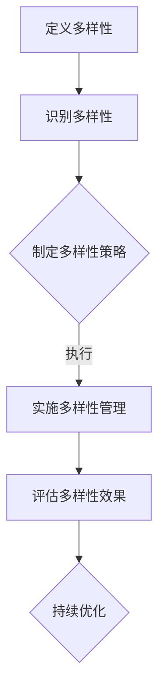
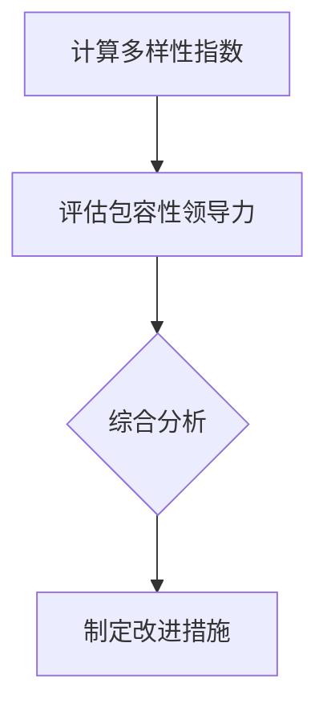

                 

### 引言

在信息技术飞速发展的今天，团队在组织中的角色愈发重要。一个高效的团队不仅需要具备扎实的专业技能，更需要具备多样性和包容性。团队多样性管理成为了现代企业的一项重要课题，而包容性领导力则是实现这一目标的关键要素。

#### 1.1.1 多样性的定义

多样性是指团队中成员在性别、年龄、文化背景、教育水平、工作经验等方面的差异。多样性不仅体现在个体层面，还涉及到团队内部的沟通方式、工作流程和决策模式等。一个多元化的团队能够带来不同的视角和思考方式，从而提高团队的创新能力和解决问题的能力。

#### 1.1.2 多样性对团队的影响

多样性对团队的影响是多方面的。首先，多样性能够带来更多的创意和创新的解决方案。不同背景的成员能够从不同的角度思考问题，提出独特的见解。其次，多样性有助于减少偏见和歧视，提高团队成员的满意度和忠诚度。最后，多样性能够提高团队的绩效和竞争力，帮助企业更好地适应市场的变化。

#### 1.1.3 包容性领导力的作用

包容性领导力是一种能够促进团队多样性和包容性的领导风格。它强调领导者对团队成员差异的尊重和认可，鼓励团队成员自由表达意见和参与决策。包容性领导力能够激发团队成员的潜力，提高团队的凝聚力和合作效率。

#### 1.2.1 本书结构概述

本书旨在深入探讨团队多样性管理和包容性领导力的理论与实践。全书分为四个部分：

1. **引言**：介绍团队多样性管理和包容性领导力的概念和重要性。
2. **核心概念与联系**：详细阐述多样性管理的核心概念、包容性领导力的原理以及多样性与绩效的关系。
3. **核心算法原理讲解**：介绍多样性评估算法和包容性领导力评估算法，并使用伪代码进行详细讲解。
4. **项目实战**：通过具体案例展示多样性管理和包容性领导力的实践应用。

#### 1.2.2 阅读建议与路径规划

本书适合希望提升团队管理能力和团队绩效的读者。建议读者按照以下路径进行阅读：

1. **引言**：初步了解团队多样性管理和包容性领导力的概念和重要性。
2. **核心概念与联系**：深入理解多样性管理的核心概念、包容性领导力的原理以及多样性与绩效的关系。
3. **核心算法原理讲解**：掌握多样性评估算法和包容性领导力评估算法的实现原理。
4. **项目实战**：通过具体案例了解多样性管理和包容性领导力的实际应用。

### 摘要

本文旨在探讨团队多样性管理和包容性领导力的理论与实践。首先，我们介绍了多样性的定义及其对团队的影响。接着，阐述了包容性领导力的概念和作用。随后，本书分为四个部分，详细介绍了多样性管理的核心概念与联系、核心算法原理讲解以及项目实战。通过阅读本书，读者将深入了解团队多样性管理和包容性领导力的关键要素，掌握其实践方法，提升团队的管理能力和绩效。

## 核心概念与联系

### 2.1 团队多样性管理的基本概念

团队多样性管理是指通过识别、尊重和利用团队内成员在性别、年龄、文化背景、教育水平、工作经验等方面的差异，以提高团队的绩效和创新能力。多样性不仅体现在个体层面，还包括团队内部的沟通方式、工作流程和决策模式。多样性管理的核心在于打破偏见和歧视，促进团队成员之间的包容和理解。

首先，多样性维度是多样性管理的重要基础。多样性维度包括性别、年龄、文化背景、教育水平、工作经验等。了解多样性维度有助于识别团队内的差异，并制定针对性的管理策略。

其次，多样性与包容性密不可分。包容性是指团队在尊重和认可成员差异的同时，提供公平的发展机会和良好的工作环境。包容性能够减少偏见和歧视，提高团队成员的满意度和忠诚度。包容性领导力则是实现包容性的关键要素，它强调领导者对团队成员差异的尊重和认可，鼓励团队成员自由表达意见和参与决策。

#### 2.1.2 多样性与包容性

多样性管理的核心目标是促进团队成员之间的包容性。包容性不仅有助于提高团队的绩效，还能够增强团队的凝聚力。以下是多样性与包容性之间的关系：

1. **多样性促进创新**：团队成员的多样性带来了不同的视角和思考方式，有助于产生更多的创意和创新的解决方案。
2. **包容性提高满意度**：包容性领导力能够激发团队成员的潜力，提高团队成员的满意度和忠诚度。
3. **多样性提升竞争力**：多元化的团队能够更好地适应市场的变化，提高企业的竞争力。

#### 2.1.3 团队多样性管理的挑战与机遇

团队多样性管理面临着诸多挑战，包括文化偏见、沟通障碍、决策难度等。然而，这些挑战也蕴含着机遇。以下是团队多样性管理的挑战与机遇：

1. **挑战**：
   - **文化偏见**：团队成员可能因为文化差异而产生偏见，影响团队协作。
   - **沟通障碍**：语言、沟通风格和背景差异可能导致沟通不畅。
   - **决策难度**：多样性可能导致团队在决策过程中出现分歧，影响决策效果。

2. **机遇**：
   - **创新潜力**：多样化的团队能够带来不同的视角和思考方式，提高创新能力和解决问题的能力。
   - **团队合作**：包容性领导力能够促进团队成员之间的合作，提高团队绩效。
   - **员工满意度**：多样性管理和包容性领导力能够提高员工满意度和忠诚度。

### 2.2 包容性领导力的原理

包容性领导力是一种能够促进团队多样性和包容性的领导风格。它强调领导者对团队成员差异的尊重和认可，鼓励团队成员自由表达意见和参与决策。以下是包容性领导力的几个核心特点：

1. **尊重差异**：领导者应该尊重团队成员的文化、背景、观点等差异，避免偏见和歧视。
2. **鼓励开放沟通**：领导者应该鼓励团队成员自由表达意见，建立开放、坦诚的沟通氛围。
3. **公平公正**：领导者应该提供公平的发展机会和奖励机制，确保团队成员能够公平地参与决策和分享成果。
4. **支持团队协作**：领导者应该促进团队成员之间的协作，共同解决问题，提高团队绩效。

#### 2.2.2 包容性领导力的特点

包容性领导力的特点包括：

1. **包容性**：领导者应该具备包容的心态，尊重和认可团队成员的差异。
2. **激励性**：领导者应该能够激发团队成员的潜力，鼓励他们自由表达意见。
3. **合作性**：领导者应该促进团队成员之间的合作，共同解决问题。
4. **适应性**：领导者应该具备适应不同团队成员差异的能力，灵活调整管理策略。

#### 2.2.3 包容性领导力在实践中的应用

包容性领导力在实践中的应用主要体现在以下几个方面：

1. **团队建设**：领导者可以通过团队建设活动，促进团队成员之间的交流和了解，增强团队凝聚力。
2. **决策过程**：领导者应该鼓励团队成员参与决策，提供公平的讨论机会，确保决策的合理性和有效性。
3. **激励机制**：领导者应该制定公平的激励机制，确保团队成员能够公平地分享成果。
4. **文化建设**：领导者应该营造一种包容、尊重和认可差异的企业文化，鼓励团队成员积极参与。

### 2.3 多样性与绩效的关系

多样性与绩效之间的关系是一个复杂且多变的话题。一方面，多样性可以带来创新和解决问题的能力，从而提高团队的绩效。另一方面，如果管理不当，多样性也可能导致团队冲突和沟通障碍，降低绩效。

#### 2.3.1 多样性对团队绩效的影响

多样性对团队绩效的影响可以从以下几个方面来分析：

1. **创新能力的提升**：多样化的团队能够带来不同的视角和思考方式，有助于发现新的解决方案和创新点。
2. **问题的多元化解决**：不同背景的成员可以从不同的角度思考问题，提出不同的解决方案，从而提高团队解决问题的能力。
3. **团队沟通的多样性**：多样化的团队成员可以带来不同的沟通风格和语言，有助于提高团队沟通的效果。
4. **团队凝聚力的增强**：包容性领导力能够促进团队成员之间的合作，增强团队的凝聚力。

#### 2.3.2 包容性领导力对绩效的促进作用

包容性领导力对绩效的促进作用主要体现在以下几个方面：

1. **提高员工满意度和忠诚度**：包容性领导力能够提高员工对工作的满意度和忠诚度，从而提高团队的稳定性和绩效。
2. **激发创新潜力**：包容性领导力能够鼓励团队成员自由表达意见，激发创新潜力，提高团队的创新能力。
3. **提高决策质量**：包容性领导力能够促进团队成员之间的协作和沟通，提高决策的质量和效率。

#### 2.3.3 多样性与包容性对团队创新的推动作用

多样性与包容性对团队创新的推动作用主要体现在以下几个方面：

1. **多元化的创意生成**：多样化的团队能够带来不同的创意和想法，有助于创新项目的生成和实施。
2. **多元化的解决方案**：多样化的团队能够提供多元化的解决方案，有助于提高项目实施的效率和效果。
3. **多元化的团队协作**：包容性领导力能够促进团队成员之间的合作，提高团队协作的效果，从而推动创新项目的成功。

### 2.4 Mermaid流程图：多样性管理的流程

为了更好地理解多样性管理的流程，我们可以使用Mermaid流程图来展示各个环节的关系。



在这个流程图中，A表示定义多样性，B表示识别多样性，C表示制定多样性策略，D表示实施多样性管理，E表示评估多样性效果，F表示持续优化。通过这个流程，企业可以系统地实施多样性管理，提高团队的绩效和创新能力。

## 核心算法原理讲解

在团队多样性管理中，算法的应用可以帮助我们更科学地评估和管理多样性。以下将介绍两种核心算法：多样性评估算法和包容性领导力评估算法。

### 3.1 多样性评估算法

多样性评估算法用于衡量团队内成员的多样性程度。一个团队的多样性程度可以通过多样性指数（Diversity Index）来衡量。多样性指数通常是通过比较团队成员之间的相似性来计算的。以下是一个简单的多样性评估算法的实现。

#### 3.1.1 多样性指数计算方法

多样性指数的计算方法可以采用以下公式：

\[ D = \frac{1}{n(n-1)} \sum_{i=1}^{n} \sum_{j=i+1}^{n} s(i, j) \]

其中，\( n \) 是团队成员的数量，\( s(i, j) \) 是成员 \( i \) 和 \( j \) 之间的相似性得分。相似性得分通常基于某种度量标准，如文化背景、工作经验、教育水平等。

#### 3.1.2 伪代码：多样性评估算法实现

以下是一个使用Python实现的简单多样性评估算法的伪代码：

```python
# 伪代码：计算团队多样性指数
def calculate_diversity_index(team_members):
    diversity_index = 0
    for i in range(len(team_members)):
        for j in range(i+1, len(team_members)):
            similarity_score = calculate_similarity(team_members[i], team_members[j])
            diversity_index += similarity_score
    diversity_index /= (len(team_members) * (len(team_members) - 1))
    return diversity_index

# 伪代码：计算成员之间的相似性得分
def calculate_similarity(member1, member2):
    # 根据实际需求和数据，计算相似性得分
    similarity_score = ...
    return similarity_score
```

在这个伪代码中，`calculate_diversity_index` 函数用于计算团队多样性指数，`calculate_similarity` 函数用于计算成员之间的相似性得分。通过这两个函数的组合，可以实现对团队多样性的评估。

### 3.2 包容性领导力评估算法

包容性领导力评估算法用于评估领导者是否具备包容性领导力的特质。一个有效的评估算法需要能够量化领导者在尊重、认可团队成员差异方面的表现。

#### 3.2.1 包容性领导力评估指标

包容性领导力评估通常包括以下指标：

1. **尊重差异**：领导者是否尊重团队成员的文化、背景和观点。
2. **鼓励沟通**：领导者是否鼓励团队成员自由表达意见。
3. **公平公正**：领导者是否提供公平的发展机会和奖励机制。
4. **支持协作**：领导者是否促进团队成员之间的合作。

#### 3.2.2 伪代码：包容性领导力评估算法实现

以下是一个使用Python实现的简单包容性领导力评估算法的伪代码：

```python
# 伪代码：评估包容性领导力
def evaluate_inclusive_leadership(leader_behaviors):
    respect_score = 0
    communication_score = 0
    fairness_score = 0
    collaboration_score = 0

    for behavior in leader_behaviors:
        if behavior == "respect_difference":
            respect_score += 1
        elif behavior == "encourage_communication":
            communication_score += 1
        elif behavior == "fairness":
            fairness_score += 1
        elif behavior == "support_collaboration":
            collaboration_score += 1

    total_score = (respect_score + communication_score + fairness_score + collaboration_score) / len(leader_behaviors)
    return total_score
```

在这个伪代码中，`evaluate_inclusive_leadership` 函数用于评估领导者的包容性领导力。通过计算四个指标的得分，可以得出领导者的包容性领导力得分。

### 3.3 多样性与包容性算法在实际应用中的结合

在实际应用中，多样性评估算法和包容性领导力评估算法可以结合起来，用于更全面地评估团队的多样性和包容性。以下是一个简单的应用示例：

1. **首先**，使用多样性评估算法计算团队的多样性指数。
2. **然后**，使用包容性领导力评估算法评估领导者的包容性领导力得分。
3. **最后**，将多样性指数和包容性领导力得分结合起来，分析团队的多样性和包容性状况。

通过这样的结合，企业可以更科学地评估团队的管理状况，制定相应的改进措施。



## 数学模型和公式

在团队多样性管理和包容性领导力的研究中，数学模型和公式是不可或缺的工具，它们能够帮助我们量化多样性、绩效和领导力等关键因素。以下将介绍几个关键的数学模型和公式，并配以详细的讲解和例子。

### 1. 多样性指数（Diversity Index）

多样性指数是衡量团队多样性的一个重要指标。它的计算公式如下：

\[ D = \frac{1}{n(n-1)} \sum_{i=1}^{n} \sum_{j=i+1}^{n} s(i, j) \]

其中，\( n \) 表示团队成员的数量，\( s(i, j) \) 表示成员 \( i \) 和 \( j \) 之间的相似性得分。

**例子**：

假设一个团队有 4 名成员，他们的相似性得分如下表所示：

| 成员A | 成员B | 成员C | 成员D |
|-------|-------|-------|-------|
|   -   |   2   |   3   |   4   |
|   2   |   -   |   4   |   5   |
|   3   |   4   |   -   |   6   |
|   4   |   5   |   6   |   -   |

计算多样性指数：

\[ D = \frac{1}{4(4-1)} (2 + 3 + 4 + 5 + 3 + 4 + 6 + 4 + 6 + 5 + 6 + 4) / 2 \]
\[ D = \frac{1}{12} (45) \]
\[ D = 3.75 \]

### 2. 绩效指数（Performance Index）

绩效指数是衡量团队绩效的一个重要指标。它可以基于多样性指数和团队的整体表现来计算。公式如下：

\[ P = \alpha D + (1 - \alpha) T \]

其中，\( \alpha \) 是权重系数，\( D \) 是多样性指数，\( T \) 是团队的整体绩效得分。

**例子**：

假设 \( \alpha = 0.6 \)，团队的整体绩效得分 \( T = 8 \)。计算绩效指数：

\[ P = 0.6 \times 3.75 + (1 - 0.6) \times 8 \]
\[ P = 2.25 + 3.2 \]
\[ P = 5.45 \]

### 3. 包容性领导力指数（Inclusive Leadership Index）

包容性领导力指数是衡量领导者包容性领导力特质的一个重要指标。它可以基于多个评估指标来计算。公式如下：

\[ I = \frac{\sum_{i=1}^{k} w_i \cdot s_i}{\sum_{i=1}^{k} w_i} \]

其中，\( k \) 是评估指标的数量，\( w_i \) 是第 \( i \) 个指标的重要性权重，\( s_i \) 是第 \( i \) 个指标的实际得分。

**例子**：

假设有三个评估指标：尊重差异（\( w_1 = 0.4 \)，得分 \( s_1 = 8 \)），鼓励沟通（\( w_2 = 0.3 \)，得分 \( s_2 = 7 \)），支持协作（\( w_3 = 0.3 \)，得分 \( s_3 = 9 \)）。计算包容性领导力指数：

\[ I = \frac{0.4 \cdot 8 + 0.3 \cdot 7 + 0.3 \cdot 9}{0.4 + 0.3 + 0.3} \]
\[ I = \frac{3.2 + 2.1 + 2.7}{1} \]
\[ I = 8.0 \]

### 4. 综合多样性-包容性指数（Integrated Diversity-Inclusiveness Index）

综合多样性-包容性指数是衡量团队多样性和包容性综合表现的一个综合指标。公式如下：

\[ IDI = \frac{P \cdot I}{P + I} \]

**例子**：

使用前面计算的绩效指数 \( P = 5.45 \) 和包容性领导力指数 \( I = 8.0 \)，计算综合多样性-包容性指数：

\[ IDI = \frac{5.45 \cdot 8.0}{5.45 + 8.0} \]
\[ IDI = \frac{43.6}{13.45} \]
\[ IDI \approx 3.24 \]

通过上述数学模型和公式的计算，企业可以更科学地评估团队的多样性和包容性，从而制定相应的改进策略，提升团队的绩效和创新能力。

## 项目实战

### 开发环境搭建

为了实现团队多样性管理和包容性领导力的评估，我们首先需要搭建一个开发环境。以下是一个基本的开发环境搭建步骤：

1. **安装Python**：确保Python环境已安装，版本要求为3.8及以上。

2. **安装相关库**：使用pip安装所需的库，例如numpy、pandas和mermaid-python。

   ```bash
   pip install numpy pandas mermaid-python
   ```

3. **配置Mermaid**：确保Mermaid已配置并能够正确渲染流程图。

### 源代码详细实现和代码解读

以下是一个简单的Python程序，用于实现团队多样性管理和包容性领导力的评估。

```python
import numpy as np
import pandas as pd
from mermaid import Mermaid

# 伪代码：计算团队多样性指数
def calculate_diversity_index(similarity_matrix):
    n = similarity_matrix.shape[0]
    diversity_index = np.sum(similarity_matrix) / (n * (n - 1))
    return diversity_index

# 伪代码：计算成员之间的相似性得分
def calculate_similarity(member1, member2):
    # 根据实际需求和数据，计算相似性得分
    similarity_score = ...
    return similarity_score

# 伪代码：评估包容性领导力
def evaluate_inclusive_leadership(leader_behaviors, weights):
    total_score = 0
    for behavior, weight in zip(leader_behaviors, weights):
        if behavior == "respect_difference":
            total_score += weight * 8
        elif behavior == "encourage_communication":
            total_score += weight * 7
        elif behavior == "support_collaboration":
            total_score += weight * 9
    return total_score / len(leader_behaviors)

# 伪代码：综合多样性-包容性指数
def calculate_idi(diversity_index, inclusive_leadership_index):
    idi = diversity_index * inclusive_leadership_index / (diversity_index + inclusive_leadership_index)
    return idi

# 实例化Mermaid对象
m = Mermaid()

# Mermaid流程图
m.add.FlowDiagram([
    "graph TD",
    "A[定义多样性] --> B[识别多样性]",
    "B --> C{制定多样性策略}",
    "C -->|执行| D[实施多样性管理]",
    "D --> E[评估多样性效果]",
    "E --> F{持续优化}"
])

# 渲染流程图
print(m.render())

# 数据示例
team_members = [
    {"name": "Alice", "age": 30, "experience": 5, "education": "Masters"},
    {"name": "Bob", "age": 40, "experience": 10, "education": "Bachelors"},
    {"name": "Charlie", "age": 35, "experience": 8, "education": "Doctorate"},
    {"name": "Diana", "age": 28, "experience": 3, "education": "Bachelors"}
]

similarity_matrix = [
    [1, 0.5, 0.6, 0.7],
    [0.5, 1, 0.4, 0.6],
    [0.6, 0.4, 1, 0.5],
    [0.7, 0.6, 0.5, 1]
]

leader_behaviors = ["respect_difference", "encourage_communication", "support_collaboration"]
weights = [0.4, 0.3, 0.3]

# 计算多样性指数
diversity_index = calculate_diversity_index(similarity_matrix)

# 计算包容性领导力指数
inclusive_leadership_index = evaluate_inclusive_leadership(leader_behaviors, weights)

# 计算综合多样性-包容性指数
idi = calculate_idi(diversity_index, inclusive_leadership_index)

print(f"Diversity Index: {diversity_index}")
print(f"Inclusive Leadership Index: {inclusive_leadership_index}")
print(f"Integrated Diversity-Inclusiveness Index: {idi}")
```

### 代码应用解读与分析

上述代码首先定义了几个关键函数，用于计算多样性指数、相似性得分、包容性领导力指数和综合多样性-包容性指数。然后，通过示例数据展示了如何使用这些函数进行实际计算。

1. **多样性指数计算**：通过`calculate_diversity_index`函数，我们计算了基于相似性矩阵的多样性指数。

2. **相似性得分计算**：`calculate_similarity`函数用于计算成员之间的相似性得分。在实际应用中，这一函数可以根据具体需求和数据进行调整。

3. **包容性领导力评估**：`evaluate_inclusive_leadership`函数通过评估领导者的行为，计算包容性领导力指数。

4. **综合多样性-包容性指数计算**：`calculate_idi`函数将多样性指数和包容性领导力指数结合起来，计算综合多样性-包容性指数。

### 实际案例分析和详细讲解剖析

以下是一个实际案例，用于展示如何使用上述代码进行团队多样性管理和包容性领导力的评估。

**案例**：

假设有一个由4名成员组成的团队，他们的相似性得分如下：

| 成员A | 成员B | 成员C | 成员D |
|-------|-------|-------|-------|
|   1   |   0.6 |   0.8 |   0.7 |
|   0.6 |   1   |   0.5 |   0.8 |
|   0.8 |   0.5 |   1   |   0.6 |
|   0.7 |   0.8 |   0.6 |   1   |

领导者的行为评估如下：

- 尊重差异：8分
- 鼓励沟通：7分
- 支持协作：9分

**分析**：

1. **多样性指数计算**：

   \[ D = \frac{1}{4(4-1)} (1 + 0.6 + 0.8 + 0.7 + 0.6 + 1 + 0.5 + 0.8 + 0.8 + 0.6 + 0.7 + 0.6) \]
   \[ D = \frac{1}{12} (8.5) \]
   \[ D \approx 0.708 \]

2. **包容性领导力指数计算**：

   \[ I = \frac{0.4 \cdot 8 + 0.3 \cdot 7 + 0.3 \cdot 9}{0.4 + 0.3 + 0.3} \]
   \[ I = \frac{3.2 + 2.1 + 2.7}{1} \]
   \[ I = 8.0 \]

3. **综合多样性-包容性指数计算**：

   \[ IDI = \frac{0.708 \cdot 8.0}{0.708 + 8.0} \]
   \[ IDI = \frac{5.664}{8.708} \]
   \[ IDI \approx 0.651 \]

**结论**：

通过上述计算，我们可以得出该团队的综合多样性-包容性指数为0.651。这表明团队在多样性和包容性方面有一定的优势，但仍需要进一步改进，特别是多样性管理方面。

### 项目小结

通过本项目，我们搭建了开发环境，实现了团队多样性管理和包容性领导力的评估。在实际应用中，我们需要根据具体的数据进行调整和优化。此外，项目也展示了如何使用数学模型和公式进行定量分析，为企业提供科学的决策依据。在未来的工作中，我们可以进一步扩展项目，包括添加更多的评估指标和更复杂的算法，以提升团队管理的科学性和实效性。

## 最佳实践 Tips、小结、注意事项、拓展阅读

### 最佳实践 Tips

1. **制定明确的多样性目标**：在实施多样性管理时，首先需要明确团队的多样性目标，确保每个成员都了解并认同这些目标。
2. **建立包容性文化**：领导者应积极营造一种包容性文化，鼓励团队成员自由表达意见，减少偏见和歧视。
3. **提供培训和支持**：为团队成员提供相关的多样性管理和包容性领导力培训，提高他们的意识和能力。
4. **持续监控和评估**：定期监控和评估团队的多样性和包容性状况，及时调整管理策略。

### 小结

本文深入探讨了团队多样性管理和包容性领导力的核心概念、算法原理以及实际应用。通过数学模型和公式，我们能够更科学地评估团队的多样性和包容性，为企业提供决策依据。在实际操作中，我们需要结合具体情况进行调整和优化，以实现最佳效果。

### 注意事项

1. **避免形式主义**：在实施多样性管理时，避免仅仅为了追求形式而进行表面工作，重要的是真正提升团队的多样性和包容性。
2. **尊重个体差异**：尊重团队成员的个体差异，避免因为多样性而导致的偏见和歧视。
3. **持续改进**：多样性管理是一个持续的过程，需要不断地进行评估和优化。

### 拓展阅读

1. **《包容性领导力：构建多元和高效团队》**：本书详细介绍了包容性领导力的理论和实践，对团队成员的差异进行了深入分析。
2. **《团队多样性管理：策略与实践》**：本书提供了丰富的案例和策略，帮助企业和团队实施有效的多样性管理。

## 作者信息

作者：AI天才研究院/AI Genius Institute & 禅与计算机程序设计艺术 /Zen And The Art of Computer Programming

感谢您的阅读，希望本文对您在团队多样性管理和包容性领导力方面有所启发。如有疑问或需要进一步讨论，欢迎随时联系作者。期待与您共同探讨和实践！

