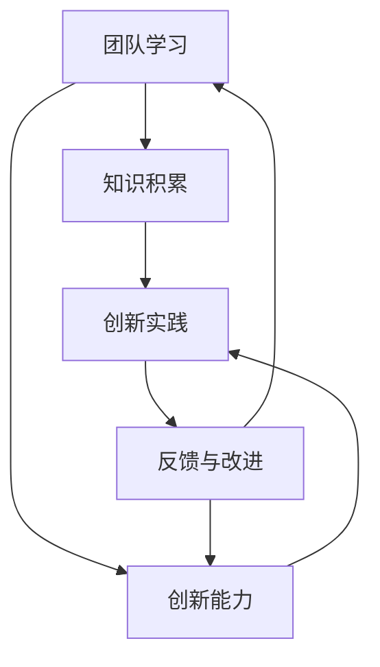
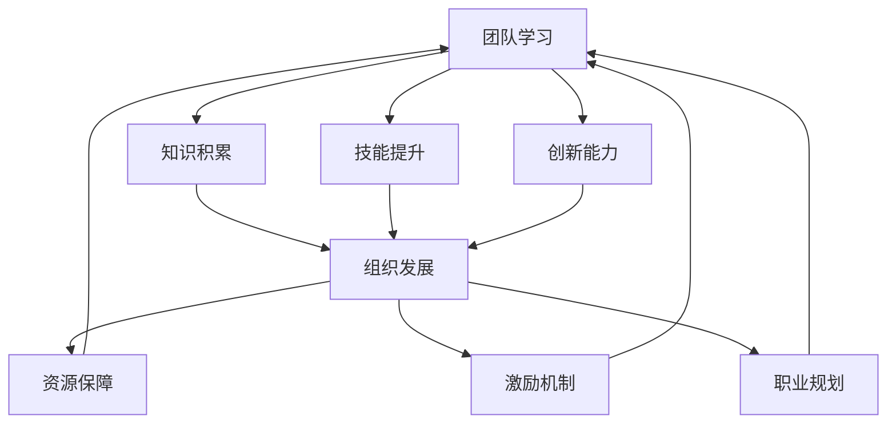
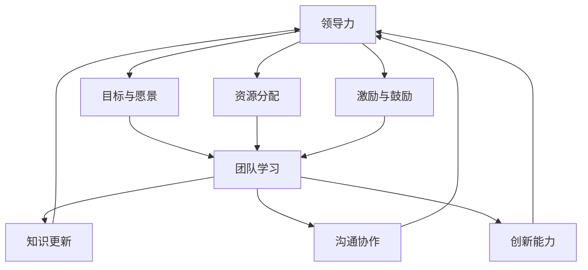
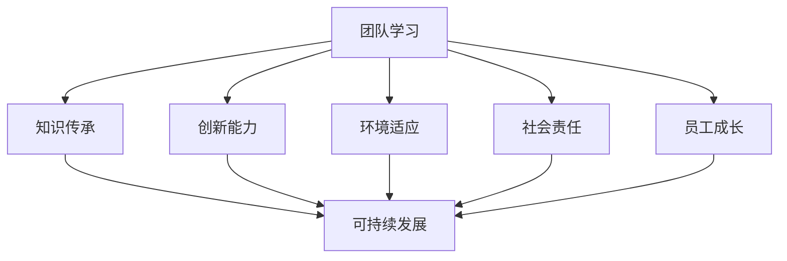

                 

### 文章标题：团队学习与发展：打造学习型组织的策略

> 关键词：团队学习、学习型组织、组织发展、领导力、创新能力、可持续发展

> 摘要：本文深入探讨了团队学习与发展的核心概念，阐述了如何通过有效的团队学习策略来打造学习型组织。文章从基础理论出发，逐步分析了团队学习的重要性、基本原则、工具与实践，并进一步探讨了团队学习与发展策略、团队学习与创新能力的关系、团队学习与组织发展的关系、以及团队学习与领导力发展的关系。最后，本文提出了团队学习与可持续发展的策略和实践，并结合实际案例进行了详细剖析。通过本文的阅读，读者可以全面了解团队学习与发展的理论框架和实践路径，为提升组织竞争力和创新能力提供有益的指导。

### 引言

在现代企业的竞争中，团队学习与发展已经成为企业持续发展的重要动力。面对快速变化的市场环境和技术革新，组织需要不断提升团队的学习能力和创新力，以适应不断变化的需求。团队学习不仅是个人成长的途径，更是团队凝聚力和组织竞争力的重要体现。因此，打造学习型组织成为许多企业追求的目标。

本文旨在通过系统地探讨团队学习与发展的理论、策略和实践，为组织管理者提供一套可行的团队学习与发展方案。文章将从以下四个部分展开：

1. **团队学习基础**：介绍团队学习的重要性、基本原则、工具与实践。
2. **团队学习与发展策略**：讨论团队学习与发展的重要性、策略与实践。
3. **团队学习与创新能力**：分析团队学习与创新能力的关系、策略与实践。
4. **团队学习与组织发展**：探讨团队学习与组织发展的关系、策略与实践。

通过以上四个部分，本文将系统地阐述如何通过团队学习与发展来提升组织的整体竞争力，为企业的长远发展提供有力支持。

### 第一部分：团队学习基础

#### 第1章：团队学习的重要性

#### 1.1 学习型组织概述

**学习型组织**是指那些具有持续学习和自我改进能力，能够不断适应环境变化并取得卓越绩效的组织。学习型组织不仅注重个体学习，更强调团队之间的知识共享和协作学习。

**学习型组织的定义**可以概括为以下几点：
- **个体学习与团队学习的融合**：个体通过学习提升个人能力，团队则通过学习实现整体竞争力的提升。
- **知识共享与知识创新**：组织鼓励知识共享，促进知识在团队内部的流动和融合，从而推动知识创新。
- **系统思维与整体优化**：学习型组织具备系统思维，能够从整体角度审视和优化组织运作。

**学习型组织的特点**包括：
1. **开放性**：学习型组织具备开放的心态，愿意接受新思想和新方法，善于从外部获取知识和资源。
2. **自主性**：团队成员有较高的自主性，能够自我管理、自我激励，积极参与组织的学习和发展过程。
3. **协作性**：团队成员之间紧密协作，共同解决问题，分享知识和经验，实现团队目标。
4. **适应性**：学习型组织能够迅速适应环境变化，灵活调整战略和策略，保持组织的活力和竞争力。

**学习型组织的好处**主要体现在以下几个方面：
1. **提高组织绩效**：通过团队学习和知识共享，组织能够迅速应对市场变化，提高整体绩效。
2. **增强团队凝聚力**：团队成员通过共同学习和协作，增强了对组织的认同感和归属感，提升了团队的凝聚力。
3. **激发创新能力**：学习型组织鼓励创新思维和实践，促进了知识创新和产品创新，为组织发展提供了源源不断的动力。
4. **提升员工满意度**：学习型组织注重员工个人成长和发展，提供了良好的学习和成长环境，提高了员工的满意度和忠诚度。

#### 1.2 团队学习的基本原则

**团队学习的基本原则**是确保学习过程有效性和持续性的关键。以下是一些核心原则：

1. **明确学习目标**：团队学习应明确具体的学习目标，包括短期和长期目标，确保学习活动有的放矢。
2. **建立共同愿景**：团队成员需共同构建愿景，明确学习和发展方向，形成共同的目标和价值观。
3. **鼓励知识分享**：组织应鼓励团队成员分享知识和经验，通过培训、会议、案例讨论等多种形式实现知识传递。
4. **培养自主性**：团队成员应具备自主学习的意识，能够自我驱动，积极参与学习活动。
5. **强调协作与互助**：团队学习应强调协作和互助，通过团队合作解决复杂问题，提高学习效果。
6. **持续反馈与改进**：学习过程中应不断收集反馈，及时调整学习策略，确保学习效果的最大化。
7. **融入日常工作**：团队学习应融入日常工作，通过日常工作中的问题解决和学习活动，实现持续学习和成长。

#### 1.3 团队学习的方法

**团队学习的方法**是多样化的，不同方法适用于不同类型的团队和学习场景。以下是一些常见的团队学习方法：

1. **头脑风暴**：通过集体讨论，激发团队成员的创造性思维，产生新的想法和解决方案。
2. **案例学习**：通过分析成功和失败的案例，学习经验教训，提高团队应对问题的能力。
3. **经验分享**：通过团队成员的经验分享，传递知识和技能，促进团队整体水平的提升。
4. **角色扮演**：通过角色扮演，模拟实际工作场景，提高团队成员的沟通技巧和问题解决能力。
5. **工作坊**：通过集中性的学习活动，围绕特定主题进行深入探讨和讨论，推动知识的内化和应用。
6. **团队游戏**：通过团队游戏，激发团队活力，增强团队凝聚力和协作精神。
7. **项目合作**：通过团队项目合作，实际操作中学习和提升技能，解决实际问题。

#### 1.4 团队学习的障碍与解决方案

**团队学习过程中可能会遇到的障碍**包括：

1. **缺乏时间**：团队成员工作繁忙，缺乏足够的时间进行学习。
2. **缺乏兴趣**：部分成员对学习活动缺乏兴趣，参与度不高。
3. **沟通障碍**：团队成员之间沟通不畅，影响学习效果。
4. **知识鸿沟**：团队成员知识水平参差不齐，影响团队学习的整体效果。
5. **管理支持不足**：组织对团队学习缺乏有效的管理和支持，影响学习活动的开展。

针对以上障碍，以下是一些**解决方案**：

1. **合理安排时间**：制定合理的学习计划，确保学习时间与工作时间的平衡。
2. **激发学习兴趣**：通过多样化的学习方法和内容，提高团队成员的学习兴趣和参与度。
3. **加强沟通与协作**：建立有效的沟通机制，促进团队成员之间的互动和协作。
4. **提升知识水平**：通过培训、学习资源分享等方式，缩小团队成员的知识差距。
5. **提供管理支持**：组织管理层应提供充分的支持，包括资金、时间和资源的保障，确保团队学习活动的顺利进行。

#### 1.5 团队学习工具与实践

**团队学习工具**是实现团队学习目标的重要手段。以下是一些常用的团队学习工具：

1. **学习管理系统（LMS）**：用于组织、管理和跟踪学习活动，提高学习效率。
2. **虚拟学习环境（VLE）**：提供在线学习平台，支持知识共享和协作学习。
3. **思维导图**：用于梳理和展示知识点，促进思维发散和知识整合。
4. **工作坊**：通过集中讨论和活动，促进团队成员之间的交流和互动。
5. **讨论板**：用于在线交流和讨论，支持不同地理位置的团队成员参与。
6. **电子白板**：用于实时协作和讨论，提高团队沟通效果。

**团队学习实践案例**：

**案例一：某企业的新员工培训项目**

某企业在新员工入职时，设计了为期一个月的新员工培训项目。项目分为三个阶段：入职引导、专业技能培训和团队建设。通过集中培训和互动活动，新员工快速融入企业文化和团队，提升了专业技能和团队协作能力。

**案例二：某研发团队的知识共享平台**

某研发团队搭建了一个内部知识共享平台，用于记录和分享团队成员的实践经验和技术知识。平台提供文档管理、讨论区、问答功能等，支持团队成员随时随地进行知识分享和协作。通过平台，团队知识得到了有效积累和传递，提高了整体技术水平。

**团队学习效果评估**：

**效果评估方法**包括：

1. **定量评估**：通过测试、调查问卷等方式，评估团队成员的学习成果和技能提升情况。
2. **定性评估**：通过访谈、观察等方式，了解团队成员的学习体验和反馈，评估学习活动的效果。
3. **综合评估**：结合定量和定性评估方法，全面评估团队学习的整体效果。

**评估指标**包括：

1. **学习参与度**：评估团队成员参与学习活动的频率和积极性。
2. **学习成果**：评估团队成员在知识和技能方面的提升情况。
3. **团队协作**：评估团队成员之间的协作和知识共享情况。
4. **组织绩效**：评估团队学习对组织整体绩效的影响。

通过以上方法和指标，可以全面了解团队学习的实际效果，为后续的学习和发展提供参考。

#### 总结与展望

第1章介绍了团队学习的重要性、基本原则、方法和障碍解决方案，并通过实际案例展示了团队学习的具体实践和效果评估。团队学习不仅有助于提升个人和团队的能力，更是组织持续发展的重要保障。在接下来的章节中，我们将进一步探讨团队学习与发展的策略、团队学习与创新能力的关系、团队学习与组织发展的关系，以及团队学习与领导力发展的关系。通过系统性的分析，读者将能够全面了解团队学习与发展的理论框架和实践路径，为组织的长远发展提供有力支持。

### 第2章：打造学习型团队

#### 2.1 团队建设的重要性

团队建设是打造学习型组织的关键环节。有效的团队建设能够提升团队成员的协作能力、增强团队的凝聚力和战斗力，从而为组织的发展提供强有力的支持。以下从三个方面详细阐述团队建设的重要性：

**1. 提升协作能力**

在复杂多变的市场环境中，团队往往需要面对各种复杂问题和挑战。通过团队建设，团队成员能够明确各自的职责和角色，提高协作效率。有效的团队建设可以增强团队成员之间的沟通和信任，促进信息共享和资源整合，从而提升团队的整体协作能力。例如，通过团队角色培训和角色扮演，团队成员能够更清晰地理解彼此的职责，提高团队任务完成的速度和质量。

**2. 增强团队凝聚力**

团队凝聚力是团队协作和持续发展的基础。一个有凝聚力的团队，成员之间相互信任、支持，愿意为团队的目标共同努力。团队建设通过团队活动、团队建设和团队文化塑造，可以有效增强团队的凝聚力。例如，通过团队拓展训练、团队文化建设等活动，团队成员能够建立深厚的情感联系，增强对团队的归属感和认同感，从而提高团队的凝聚力和战斗力。

**3. 促进组织发展**

团队建设不仅对团队本身有重要影响，也对组织的发展起到关键作用。一个高效的学习型团队能够迅速响应市场变化，不断创新和改进，提升组织的竞争力。通过团队建设，组织能够建立起一种积极向上的文化氛围，激发员工的创造力和创新精神，为组织的长远发展奠定坚实基础。例如，通过团队建设，企业可以培养一批具有高度责任感和使命感的优秀员工，这些员工将成为企业持续发展的中坚力量。

#### 2.2 团队建设的目标

团队建设的目标可以分为短期目标和长期目标两个方面：

**短期目标**主要包括：

1. **提高团队成员的协作能力**：通过角色培训和沟通技巧提升，确保团队成员能够高效协同工作。
2. **增强团队凝聚力**：通过团队活动和文化建设，促进团队成员之间的情感联系，增强团队的凝聚力和归属感。
3. **明确团队目标**：确保团队成员对团队目标和任务有清晰的认识，提高团队的工作效率。

**长期目标**则包括：

1. **建立学习型团队**：通过持续的学习和改进，使团队具备自我优化和自我提升的能力，成为真正的学习型团队。
2. **提升团队创新能力**：通过团队建设，激发团队成员的创造力和创新精神，推动团队持续创新，保持竞争优势。
3. **促进组织发展**：通过团队建设，提升团队的整体绩效，为组织的长期发展提供有力支持。

#### 2.3 团队建设的方法

团队建设的方法多种多样，根据团队的特点和需求，可以采用不同的方法和策略。以下介绍几种常见的团队建设方法：

**1. 培训与开发**

培训与开发是团队建设的基础。通过专业培训，团队成员可以提升专业技能和知识水平，增强协作能力。开发则通过项目实践和角色扮演，帮助团队成员更好地理解彼此的职责和角色，提高协作效率。

**2. 团队活动**

团队活动是增强团队凝聚力和合作精神的有效手段。通过户外拓展、团队建设游戏、团队聚餐等活动，团队成员可以加深彼此的了解，建立深厚的情感联系。例如，通过团队拓展训练，团队成员可以在实践中学会相互协作和信任，提高团队的整体战斗力。

**3. 团队文化建设**

团队文化是团队建设的重要组成部分。通过塑造积极向上的团队文化，可以增强团队成员的归属感和认同感。团队文化可以通过价值观、使命、愿景等来体现，例如，通过定期举办团队文化日活动，让团队成员共同参与，增强对团队文化的认同。

**4. 沟通机制**

有效的沟通机制是团队建设的关键。通过建立定期的团队会议、讨论区、邮件群组等沟通平台，可以促进团队成员之间的信息交流和协作。例如，通过定期的团队会议，团队成员可以及时反馈工作进展和问题，共同商讨解决方案，提高团队的工作效率。

**5. 员工参与**

员工参与是团队建设的重要原则。通过鼓励员工参与团队决策和团队活动，可以增强员工的积极性和参与感，提高团队的整体凝聚力。例如，通过员工意见箱、员工建议征集等活动，可以让员工参与到团队建设和决策过程中，激发他们的创造力和主动性。

#### 2.4 团队学习策略

团队学习策略是确保团队持续学习和自我提升的重要手段。以下介绍几种常见的团队学习策略：

**1. 学习计划**

学习计划是团队学习的第一步。通过制定明确的学习计划，团队可以合理安排学习时间，确保学习活动的系统性和持续性。学习计划应包括学习目标、学习内容、学习方法和学习时间等方面的内容。

**2. 学习模式**

学习模式是团队学习的具体实施方式。常见的团队学习模式包括集中学习、分散学习和混合学习等。集中学习适用于系统性和深度性的学习内容，分散学习适用于日常工作中的碎片化学习，混合学习则结合了集中学习和分散学习的优点，适合多种学习场景。

**3. 学习评估**

学习评估是团队学习的重要环节。通过学习评估，团队可以了解学习效果，发现学习中的问题和不足，及时调整学习策略。学习评估可以采用定量评估和定性评估相结合的方式，例如，通过测试、问卷调查、访谈等方式进行评估。

**4. 知识共享**

知识共享是团队学习的重要目标。通过建立知识共享平台、开展经验分享会、设置知识库等方式，团队可以促进知识的传递和积累，提高团队整体的知识水平。例如，通过内部知识库，团队成员可以随时查阅和学习他人的经验和知识，提高工作效率。

**5. 学习激励机制**

学习激励机制是激发团队成员学习热情的重要手段。通过设置学习奖励、晋升机制、荣誉表彰等方式，可以激发团队成员的学习动力，提高团队的学习氛围。例如，通过设立“学习之星”奖项，对表现突出的团队成员进行表彰和奖励，激发其他成员的学习热情。

#### 2.5 团队学习策略选择

团队学习策略的选择应结合团队的特点、需求和实际情况，以下是一些建议：

**1. 根据团队特点选择策略**

不同类型的团队适合不同的学习策略。例如，新成立的团队适合采用集中学习和团队活动相结合的策略，通过集中学习和团队活动，快速提升团队成员的技能和团队凝聚力。而对于成熟团队，则适合采用分散学习和知识共享策略，通过日常工作中的学习和经验分享，不断提升团队的知识水平和创新能力。

**2. 根据团队需求选择策略**

团队的需求是选择学习策略的重要依据。例如，如果团队面临新的挑战和任务，需要快速提升专业技能，可以选择集中学习和专业培训策略。如果团队需要增强创新能力，可以选择创新工作坊和案例学习策略。

**3. 根据实际情况选择策略**

团队学习策略的选择还应考虑实际情况，如团队规模、工作时间、资源等。例如，对于小型团队，可以采用集中学习和分散学习相结合的策略，通过定期会议和在线学习平台，确保学习活动的顺利进行。对于大型团队，可以采用分布式学习和知识共享策略，通过建立内部知识库和协作平台，促进知识的传递和积累。

**4. 结合多种策略**

团队学习策略不应单一，而应结合多种策略，以满足不同阶段和不同场景的需求。例如，可以结合集中学习和分散学习，通过定期培训和日常学习，确保团队成员的持续学习和成长。同时，可以结合知识共享和案例学习，通过内部交流和实际案例分析，提升团队的知识水平和创新能力。

#### 2.6 团队学习实践

**案例一：某企业的内部培训项目**

某企业为提升团队成员的专业技能和团队凝聚力，开展了为期三个月的内部培训项目。项目分为三个阶段：第一阶段是集中培训，邀请外部专家进行专业培训，提升团队成员的专业技能；第二阶段是分散学习，团队成员根据自身需求选择在线学习课程，进行自主学习；第三阶段是集中总结，通过团队会议和讨论，总结学习成果和经验教训。

**案例二：某研发团队的知识共享平台**

某研发团队建立了内部知识共享平台，用于记录和分享团队成员的实践经验和技术知识。平台提供文档管理、讨论区、问答功能等，支持团队成员随时随地进行知识分享和协作。平台还设置了奖励机制，对贡献突出的团队成员进行表彰和奖励，激发了团队成员的知识共享热情。

**团队学习效果评估**

团队学习效果评估是检验团队学习效果的重要手段。以下介绍几种常见的评估方法：

**1. 定量评估**

定量评估通过数据统计和分析，评估团队学习的效果。常用的方法包括测试成绩、学习时长、知识共享次数等指标。例如，通过定期测试，评估团队成员的学习成果；通过学习时长统计，评估团队成员的学习参与度。

**2. 定性评估**

定性评估通过访谈、观察等方式，评估团队学习的实际效果。例如，通过访谈团队成员，了解他们的学习体验和反馈；通过观察团队成员在日常工作中的表现，评估他们的学习效果。

**3. 综合评估**

综合评估结合定量和定性评估方法，全面评估团队学习的整体效果。例如，通过测试成绩和访谈反馈，评估团队学习的知识和技能提升情况；通过观察和访谈，评估团队协作和知识共享的效果。

评估指标包括：

1. **学习参与度**：评估团队成员参与学习活动的频率和积极性。
2. **学习成果**：评估团队成员在知识和技能方面的提升情况。
3. **团队协作**：评估团队成员之间的协作和知识共享情况。
4. **组织绩效**：评估团队学习对组织整体绩效的影响。

通过以上评估方法，团队可以全面了解学习的实际效果，为后续的学习和发展提供参考。

#### 总结与展望

第2章详细阐述了团队建设的重要性、目标、方法和策略。通过有效的团队建设，可以提升团队的协作能力、增强团队凝聚力，促进组织的发展。团队学习策略的选择应结合团队的特点和需求，通过多种策略的综合应用，确保团队持续学习和自我提升。在接下来的章节中，我们将继续探讨团队学习与发展策略、团队学习与创新能力的关系、团队学习与组织发展的关系，以及团队学习与领导力发展的关系，为打造学习型组织提供更加全面的指导。

### 第二部分：团队学习与发展策略

#### 第3章：团队学习与发展的重要性

#### 3.1 团队学习与发展的关系

团队学习和发展是相辅相成的过程。团队学习是团队发展的基础，通过学习，团队成员能够不断更新知识和技能，提升个人能力。而团队发展则是团队学习的目标和动力，通过团队发展，可以更好地将学习成果应用到实践中，提升团队的整体绩效和竞争力。

**团队学习**和**团队发展**之间的关系可以概括为以下几点：

1. **学习是发展的前提**：团队只有通过不断学习，才能不断进步和成长。学习为团队提供了新的知识和技能，使团队能够应对新的挑战和机遇。

2. **发展是学习的目标**：团队学习的最终目的是为了实现团队的发展。通过学习，团队可以提升整体绩效，增强竞争力，实现长期目标。

3. **学习与发展的相互促进**：团队学习和团队发展是相互促进的过程。学习为团队发展提供了动力和资源，而团队发展则为学习提供了实践的平台和机会。

**团队学习与发展的相互作用**体现在以下几个方面：

1. **知识积累与能力提升**：通过团队学习，团队成员可以积累更多的知识和经验，提升个人能力。这些知识和能力为团队发展提供了坚实的基础。

2. **协作与沟通**：团队学习过程中，团队成员需要进行协作和沟通，这有助于提升团队的协作能力和沟通效果。这些能力的提升进一步促进了团队的发展。

3. **创新与改进**：团队学习可以激发团队成员的创新思维和实践，推动团队不断改进和创新。这些创新和改进是团队发展的重要动力。

4. **反馈与调整**：团队学习和发展过程中，不断进行反馈和调整，使团队能够及时纠正偏差，优化策略，实现持续发展。

#### 3.2 团队学习与发展的目标

**团队学习与发展的目标**包括以下几个方面：

1. **提升团队绩效**：通过团队学习，提升团队成员的专业技能和工作效率，提高团队的绩效和产出。

2. **增强团队竞争力**：通过持续学习和自我改进，提升团队的整体竞争力，使团队能够在激烈的市场竞争中立于不败之地。

3. **促进组织创新**：通过团队学习，激发团队成员的创新思维和实践，推动组织不断进行技术创新和管理创新。

4. **提升员工满意度**：通过团队学习和发展，提升员工的专业能力和职业发展，提高员工的满意度和忠诚度。

5. **实现可持续发展**：通过团队学习，提升团队应对环境变化和挑战的能力，实现组织的长期可持续发展。

**具体目标**可以进一步细化为以下几个方面：

1. **知识更新与技能提升**：定期进行知识更新和技能培训，确保团队成员掌握最新的行业知识和技能。

2. **协作与沟通**：建立高效的协作和沟通机制，促进团队成员之间的互动和合作，提升团队的整体效率。

3. **创新能力培养**：通过项目实践和创新活动，培养团队成员的创新思维和实践能力，推动组织的创新和发展。

4. **职业发展规划**：为团队成员提供职业发展规划，明确个人目标和职业路径，提高员工的职业满意度和忠诚度。

5. **绩效评估与反馈**：建立科学的绩效评估机制，定期进行评估和反馈，及时发现和解决问题，确保团队学习与发展的有效性。

#### 3.3 团队学习与发展的重要性

**团队学习与发展的重要性**体现在以下几个方面：

1. **适应市场变化**：快速变化的市场环境要求团队具备快速适应和反应的能力。通过团队学习和发展，团队可以不断更新知识和技能，提升应对市场变化的能力。

2. **提升团队竞争力**：团队学习和发展是提升团队竞争力的重要手段。通过持续学习和自我改进，团队可以不断提升专业能力和工作效率，增强在市场中的竞争力。

3. **促进组织创新**：团队学习可以激发团队成员的创新思维和实践，推动组织不断进行技术创新和管理创新，保持竞争优势。

4. **提高员工满意度**：通过团队学习和发展，提升员工的专业能力和职业发展，提高员工的满意度和忠诚度，降低员工流失率。

5. **实现组织可持续发展**：团队学习和发展是组织长期可持续发展的重要保障。通过不断提升团队的学习能力和创新能力，组织可以更好地应对市场变化和挑战，实现长期可持续发展。

#### 3.4 团队学习与发展的策略

**团队学习与发展的策略**可以分为以下几个方面：

1. **人才培养策略**：通过制定人才发展规划，确保团队有足够的人才储备和能力提升机会。

2. **知识共享策略**：建立知识共享机制，促进团队内部的知识传递和共享，提高整体知识水平。

3. **组织学习策略**：通过组织内部学习活动，提升团队整体的学习能力和创新能力。

4. **创新激励策略**：建立创新激励机制，鼓励团队成员进行创新实践，推动组织创新和发展。

5. **绩效评估策略**：建立科学的绩效评估机制，确保团队学习与发展的效果和效率。

**具体策略**包括：

1. **人才培养策略**：

   - **培训计划**：制定系统的培训计划，包括内部培训、外部培训、在线学习等，确保团队成员定期接受培训。

   - **导师制度**：建立导师制度，通过经验丰富的导师指导，帮助新成员快速成长。

   - **职业发展规划**：为团队成员提供明确的职业发展规划，帮助其制定职业目标和发展路径。

2. **知识共享策略**：

   - **知识库建设**：建立内部知识库，收集和整理团队成员的经验和知识，方便共享和查阅。

   - **经验分享会**：定期举办经验分享会，让团队成员分享自己的经验和心得，促进知识的传递和积累。

   - **在线协作平台**：建立在线协作平台，支持团队成员随时随地进行知识共享和协作。

3. **组织学习策略**：

   - **学习计划**：制定组织学习计划，明确学习目标和内容，确保学习活动的系统性和持续性。

   - **学习氛围**：营造积极向上的学习氛围，鼓励团队成员主动学习和分享。

   - **学习评估**：建立学习评估机制，定期评估学习效果，及时调整学习策略。

4. **创新激励策略**：

   - **创新项目**：设立创新项目，鼓励团队成员进行创新实践，提供必要的资源和支持。

   - **奖励机制**：建立创新奖励机制，对在创新实践中表现突出的团队成员进行表彰和奖励。

   - **创新环境**：营造良好的创新环境，鼓励团队成员勇于尝试和探索。

5. **绩效评估策略**：

   - **评估指标**：制定科学的评估指标，包括学习参与度、学习成果、创新贡献等，全面评估团队学习与发展的效果。

   - **定期评估**：定期进行绩效评估，及时发现和解决问题，确保团队学习与发展的有效性。

   - **反馈与改进**：根据评估结果，及时反馈和改进，优化团队学习与发展的策略。

#### 总结与展望

第3章详细阐述了团队学习与发展的关系、目标、重要性以及具体策略。团队学习与发展不仅是提升团队绩效和竞争力的关键，更是组织长期可持续发展的重要保障。通过有效的团队学习与发展策略，组织可以不断提升团队的学习能力和创新能力，实现长期目标。在接下来的章节中，我们将进一步探讨团队学习与创新的关系、团队学习与组织发展的关系，以及团队学习与领导力发展的关系，为打造学习型组织提供更加全面的指导。

### 第4章：团队学习与创新

#### 4.1 团队学习与创新能力的关系

团队学习与创新之间存在着紧密的联系。团队学习是创新的基础，而创新则是团队学习的目的和动力。以下从三个方面详细阐述团队学习与创新能力的关系：

1. **团队学习是创新的前提**：团队学习为创新提供了丰富的知识和信息资源。通过团队学习，团队成员可以了解行业动态、掌握先进技术、学习成功经验和失败教训，为创新提供了必要的知识和素材。

2. **创新是团队学习的目标**：团队学习的最终目的是通过知识的积累和运用，推动团队的不断创新。创新不仅可以提高团队的竞争力，还可以为组织带来新的商业机会和增长点。

3. **团队学习与创新的相互促进**：团队学习可以激发团队成员的创新思维和实践能力，而创新则可以检验和提升团队的学习效果。通过创新实践，团队可以不断反思和改进，进一步提升团队的学习能力。

**团队学习与创新能力的关系模型**可以用以下Mermaid流程图表示：

在这个关系模型中，团队学习通过知识积累和创新能力促进创新实践，创新实践则通过反馈与改进反作用于团队学习和创新能力，形成了一个良性循环。

#### 4.2 团队学习与创新策略

为了提升团队的创新能力，需要制定有效的团队学习与创新策略。以下介绍几种常见的策略：

**1. 创新型团队建设**

创新型团队建设是提升团队创新能力的基础。通过以下方法，可以构建一支创新型团队：

- **选拔与培养**：选拔具备创新精神和潜力的团队成员，提供针对性的培训和发展机会，培养其创新能力。
- **激励机制**：建立创新激励机制，对在创新实践中表现突出的团队成员进行奖励，激发其创新热情。
- **跨职能协作**：鼓励不同职能部门的团队成员进行跨职能协作，通过多元化的视角和知识背景，促进创新思维的产生。

**2. 知识管理**

知识管理是团队学习与创新的重要保障。以下措施可以加强知识管理：

- **知识共享平台**：建立内部知识共享平台，支持团队成员随时随地进行知识共享和协作。
- **经验积累与传承**：鼓励团队成员记录和分享工作经验和教训，形成知识库，为团队学习提供丰富的资源。
- **知识培训**：定期组织知识培训，帮助团队成员掌握行业前沿知识和技能，提升团队整体的知识水平。

**3. 创新实践**

创新实践是提升团队创新能力的关键。以下措施可以促进创新实践：

- **创新项目**：设立创新项目，为团队成员提供实践创新的机会，鼓励其大胆尝试和探索。
- **创新工作坊**：组织创新工作坊，通过头脑风暴、思维导图等工具，激发团队成员的创新思维，产生新的创意和解决方案。
- **实验与验证**：鼓励团队成员进行实验和验证，通过实际操作检验创新方案的可行性和效果。

**4. 创新激励机制**

创新激励机制是激发团队创新热情的重要手段。以下措施可以建立有效的创新激励机制：

- **奖励机制**：对在创新实践中取得显著成果的团队成员进行奖励，包括物质奖励和荣誉表彰。
- **晋升机制**：将创新成果作为晋升的重要依据，激励团队成员积极参与创新实践。
- **学习与成长**：为团队成员提供持续的学习和成长机会，提升其专业能力和创新思维。

#### 4.3 团队学习与创新案例分析

**案例一：某科技公司的创新实验室**

某科技公司设立了创新实验室，专注于前沿技术和创新项目的研发。实验室通过以下措施提升团队创新能力：

- **跨部门协作**：实验室由不同部门的专家组成，通过跨部门协作，融合多元化的知识背景和技能，推动创新项目的进展。
- **持续学习**：实验室定期组织技术培训和创新研讨会，确保团队成员掌握最新的技术趋势和行业动态。
- **实验与验证**：实验室鼓励团队成员进行实验和验证，通过实际操作检验创新方案的可行性和效果。
- **激励机制**：对在创新实践中表现突出的团队成员进行奖励，激发其创新热情。

**案例二：某企业的内部创新大赛**

某企业每年举办一次内部创新大赛，鼓励全体员工参与。大赛通过以下措施提升团队创新能力：

- **选题广泛**：大赛选题涵盖各个部门和工作领域，鼓励团队成员从不同角度提出创新方案。
- **公开评审**：大赛设立评审委员会，对参赛作品进行公开评审，确保评审过程的公平和透明。
- **奖励丰厚**：对获奖团队和成员进行丰厚奖励，包括奖金、晋升机会和荣誉表彰。
- **经验分享**：获奖团队在总决赛上进行经验分享，帮助其他团队成员学习借鉴。

#### 4.4 团队学习与创新效果评估

评估团队学习与创新的效果是确保学习与创新活动有效性的关键。以下介绍几种常见的评估方法：

**1. 创新成果评估**

创新成果评估主要通过以下指标进行：

- **项目数量**：评估创新项目的数量，反映团队的创新能力。
- **项目质量**：评估创新项目的质量，包括创新程度、可行性、经济效益等。
- **市场表现**：评估创新项目在市场中的表现，包括用户反馈、市场占有率等。

**2. 学习参与度评估**

学习参与度评估主要通过以下指标进行：

- **学习时长**：评估团队成员的学习时长，反映其学习积极性。
- **学习频率**：评估团队成员的学习频率，反映其持续学习的习惯。
- **学习反馈**：评估团队成员的学习反馈，反映其对学习活动的满意度和效果。

**3. 绩效提升评估**

绩效提升评估主要通过以下指标进行：

- **工作效率**：评估团队成员的工作效率，反映学习活动对其工作绩效的提升。
- **项目完成率**：评估团队成员完成项目的数量和质量，反映其能力提升情况。
- **创新能力**：评估团队成员在创新项目中的表现，反映其创新能力提升情况。

#### 总结与展望

第4章详细阐述了团队学习与创新的关系、策略和案例分析。通过有效的团队学习与创新策略，组织可以不断提升团队的创新能力，实现持续发展。团队学习与创新是相辅相成的过程，通过团队学习，团队可以积累丰富的知识，为创新提供基础；而通过创新实践，团队可以检验和提升学习效果。在接下来的章节中，我们将进一步探讨团队学习与组织发展的关系、团队学习与领导力发展的关系，以及团队学习与可持续发展的关系，为打造学习型组织提供更加全面的指导。

### 第5章：团队学习与组织发展

#### 5.1 团队学习与组织发展的关系

团队学习与组织发展是紧密相连的，两者相互促进，共同推动组织的成长和进步。以下从三个方面详细探讨团队学习与组织发展的关系：

**1. 团队学习是组织发展的基础**

团队学习为组织提供了持续发展的动力和资源。通过团队学习，团队成员可以不断更新知识和技能，提升个人能力和团队整体素质，从而为组织的发展打下坚实的基础。具体来说：

- **知识积累**：团队学习使团队成员掌握最新的行业知识和技术，为组织发展提供了丰富的知识储备。
- **技能提升**：团队学习通过培训和实践，提升团队成员的专业技能和工作效率，提高组织的整体绩效。
- **创新能力**：团队学习激发团队成员的创新思维和实践能力，推动组织不断进行技术创新和管理创新，保持竞争优势。

**2. 组织发展是团队学习的目标**

组织发展的目标是为团队提供更好的学习和发展环境，从而实现团队的持续成长和进步。通过组织发展，可以为团队学习提供以下支持：

- **资源保障**：组织发展通过提供资金、时间和资源的保障，确保团队学习活动的顺利进行。
- **激励机制**：组织发展建立有效的激励机制，鼓励团队成员积极参与学习活动，提升学习效果。
- **职业规划**：组织发展制定明确的职业规划，帮助团队成员明确职业发展目标，提高学习动力。

**3. 团队学习与组织发展的相互促进**

团队学习与组织发展是相互促进的过程，两者之间形成了一个良性循环。具体表现为：

- **学习推动发展**：团队学习通过知识积累和技能提升，为组织发展提供了动力和资源，推动组织实现长期目标。
- **发展促进学习**：组织发展通过提供更好的学习环境和激励机制，激发团队成员的学习热情，提高团队整体的学习效果。

**团队学习与组织发展的相互关系**可以用以下Mermaid流程图表示：

在这个关系模型中，团队学习通过知识积累、技能提升和创新能力，促进组织发展；而组织发展通过资源保障、激励机制和职业规划，反作用于团队学习，形成了一个良性循环。

#### 5.2 团队学习与组织发展策略

为了实现团队学习与组织发展的有机结合，需要制定有效的策略。以下介绍几种常见的团队学习与组织发展策略：

**1. 人才培养策略**

人才培养策略是确保团队持续学习和发展的关键。以下措施可以加强人才培养：

- **培训计划**：制定系统的培训计划，包括内部培训、外部培训、在线学习等，确保团队成员定期接受培训。
- **导师制度**：建立导师制度，通过经验丰富的导师指导，帮助新成员快速成长。
- **职业发展规划**：为团队成员提供明确的职业发展规划，帮助其制定职业目标和发展路径。

**2. 知识管理策略**

知识管理策略是促进团队学习和知识共享的重要手段。以下措施可以加强知识管理：

- **知识库建设**：建立内部知识库，收集和整理团队成员的经验和知识，方便共享和查阅。
- **经验分享会**：定期举办经验分享会，让团队成员分享自己的经验和心得，促进知识的传递和积累。
- **在线协作平台**：建立在线协作平台，支持团队成员随时随地进行知识共享和协作。

**3. 创新激励策略**

创新激励策略是激发团队创新热情的重要手段。以下措施可以建立有效的创新激励机制：

- **创新项目**：设立创新项目，为团队成员提供实践创新的机会，鼓励其大胆尝试和探索。
- **奖励机制**：建立创新奖励机制，对在创新实践中表现突出的团队成员进行奖励，激发其创新热情。
- **创新环境**：营造良好的创新环境，鼓励团队成员勇于尝试和探索。

**4. 绩效评估策略**

绩效评估策略是确保团队学习与发展效果的重要手段。以下措施可以加强绩效评估：

- **评估指标**：制定科学的评估指标，包括学习参与度、学习成果、创新贡献等，全面评估团队学习与发展的效果。
- **定期评估**：定期进行绩效评估，及时发现和解决问题，确保团队学习与发展的有效性。
- **反馈与改进**：根据评估结果，及时反馈和改进，优化团队学习与发展的策略。

#### 5.3 团队学习与组织发展实践

**案例一：某企业的内部培训体系**

某企业建立了完善的内部培训体系，通过以下措施提升团队学习与组织发展：

- **分类培训**：针对不同层级和不同岗位的员工，制定分类培训计划，确保培训的针对性和有效性。
- **外部培训**：与专业培训机构合作，邀请行业专家进行授课，提升员工的行业知识和技能。
- **在线学习**：建立在线学习平台，提供丰富的学习资源，支持员工随时随地进行学习。

**案例二：某公司的知识共享平台**

某公司建立了内部知识共享平台，通过以下措施促进团队学习和知识共享：

- **经验分享**：定期举办经验分享会，鼓励员工分享自己的经验和心得，促进知识的传递和积累。
- **知识库建设**：建立内部知识库，收集和整理员工的实践经验和技术知识，方便共享和查阅。
- **在线协作**：提供在线协作工具，支持团队成员随时随地进行知识共享和协作。

**案例三：某企业的创新激励机制**

某企业建立了创新激励机制，通过以下措施激发团队创新热情：

- **创新项目**：设立创新项目，鼓励员工提出创新方案，并提供必要的资源和支持。
- **奖励机制**：对在创新实践中表现突出的员工进行奖励，包括奖金、晋升机会和荣誉表彰。
- **创新环境**：营造良好的创新环境，鼓励员工勇于尝试和探索。

#### 总结与展望

第5章详细阐述了团队学习与组织发展的关系、策略和实际案例。通过有效的团队学习与组织发展策略，组织可以不断提升团队的学习能力和创新能力，实现持续发展。团队学习与组织发展是相辅相成的过程，通过团队学习，团队可以积累知识和技能，提升个人能力和团队整体素质；而通过组织发展，可以为团队学习提供资源保障、激励机制和职业规划。在接下来的章节中，我们将进一步探讨团队学习与领导力发展的关系，以及团队学习与可持续发展的关系，为打造学习型组织提供更加全面的指导。

### 第6章：团队学习与领导力发展

#### 6.1 领导力与团队学习的关系

**领导力**与**团队学习**是组织发展的重要支柱，两者相互影响、相互促进。以下从三个方面详细探讨领导力与团队学习的关系：

**1. 领导力是推动团队学习的关键因素**

有效的领导力可以激发团队成员的学习热情，提供学习和发展的平台，从而推动团队学习。具体表现为：

- **愿景与目标**：领导者的愿景和目标为团队成员指明了学习和发展方向，激励团队成员为实现共同目标而努力学习。
- **资源分配**：领导者通过合理分配资源，为团队学习提供资金、时间和技术的支持，确保学习活动的顺利进行。
- **激励与鼓励**：领导者通过激励和鼓励，激发团队成员的学习动力，营造积极向上的学习氛围。

**2. 团队学习是提升领导力的有效途径**

团队学习不仅能够提升团队成员的能力，同样也能够提升领导者的领导力。具体体现在：

- **知识更新**：通过团队学习，领导者可以不断更新知识和技能，跟上行业发展的步伐，保持领导力。
- **沟通协作**：团队学习过程中，领导者需要与团队成员进行有效的沟通和协作，提升沟通能力和团队协作能力。
- **创新能力**：团队学习激发领导者的创新思维和实践能力，推动领导者在工作中不断创新，提高领导力。

**3. 领导力与团队学习的相互作用**

领导力与团队学习之间存在着相互作用和影响。具体表现为：

- **领导力推动团队学习**：领导者通过制定明确的目标、提供资源和支持、激励团队成员，推动团队学习。
- **团队学习提升领导力**：团队成员通过学习，提升个人能力和团队绩效，反过来对领导者的领导力提出更高的要求，推动领导者不断学习和成长。

**领导力与团队学习的相互作用**可以用以下Mermaid流程图表示：

在这个关系模型中，领导力通过目标与愿景、资源分配、激励与鼓励推动团队学习；而团队学习通过知识更新、沟通协作、创新能力反作用于领导力，形成了一个良性循环。

#### 6.2 领导力发展策略

为了提升领导力，需要制定有效的领导力发展策略。以下介绍几种常见的领导力发展策略：

**1. 培训与发展**

培训与发展是提升领导力的关键。以下措施可以加强培训与发展：

- **内部培训**：建立内部培训体系，为领导者提供专业的领导力培训，提升其专业素养和领导能力。
- **外部培训**：与专业培训机构合作，邀请行业专家进行授课，扩展领导者的知识视野和领导力理念。
- **领导力工作坊**：组织领导力工作坊，通过模拟演练、案例分析等互动方式，提升领导者的实战能力。

**2. 反思与反馈**

反思与反馈是提升领导力的有效途径。以下措施可以加强反思与反馈：

- **定期反思**：领导者定期进行自我反思，总结工作经验和教训，发现自身的不足和需要改进的地方。
- **反馈机制**：建立有效的反馈机制，鼓励团队成员对领导者的工作进行评价和反馈，及时发现和解决问题。
- **导师制度**：建立导师制度，通过导师的指导和反馈，帮助领导者提升领导力。

**3. 职业规划**

职业规划是提升领导力的长期策略。以下措施可以加强职业规划：

- **明确职业目标**：领导者明确自己的职业目标和发展方向，制定具体的职业规划，确保职业生涯的有序发展。
- **晋升机制**：建立科学的晋升机制，为领导者提供清晰的晋升路径和机会，激励其不断提升领导力。
- **人才储备**：提前进行人才储备，选拔和培养潜在领导者，确保组织有足够的人才储备和领导力储备。

#### 6.3 领导力与团队学习实践

**案例一：某公司的领导力发展计划**

某公司为了提升领导力，制定了一套全面的领导力发展计划。该计划包括以下内容：

- **内部培训**：公司定期举办内部培训，邀请内部专家进行授课，提升领导者的专业素养和领导能力。
- **外部培训**：公司每年选派部分领导者参加外部培训，扩展其知识视野和领导力理念。
- **领导力工作坊**：公司定期组织领导力工作坊，通过模拟演练、案例分析等互动方式，提升领导者的实战能力。
- **反思与反馈**：公司建立有效的反思与反馈机制，鼓励领导者定期进行自我反思，并接受团队成员的反馈。
- **职业规划**：公司为领导者提供明确的职业目标和发展方向，制定具体的职业规划，确保职业生涯的有序发展。

**案例二：某企业的领导力培养项目**

某企业为了提升领导力，实施了一个领导力培养项目。该项目包括以下环节：

- **选拔与培养**：企业选拔具有领导潜力的高潜力员工，通过内部培训和外部培训，提升其领导能力。
- **导师制度**：企业为高潜力员工配备导师，通过导师的指导和反馈，帮助其提升领导力。
- **项目实践**：高潜力员工参与企业重点项目，通过实践提升领导力。
- **评估与反馈**：定期对高潜力员工进行评估和反馈，根据评估结果调整培养策略。

**案例三：某公司的领导力文化建设**

某公司通过领导力文化建设，提升领导力。该公司采取以下措施：

- **领导力价值观**：公司明确领导力价值观，如正直、诚信、合作、创新等，并将这些价值观融入企业文化中。
- **领导力榜样**：公司树立领导力榜样，通过宣传和表彰优秀领导者，激励其他员工学习。
- **领导力会议**：公司定期举办领导力会议，讨论领导力相关话题，分享领导经验，提升领导力。

#### 总结与展望

第6章详细阐述了领导力与团队学习的关系、领导力发展策略以及实际案例。通过有效的领导力发展策略，领导者可以不断提升自身能力，推动团队学习，促进组织发展。领导力与团队学习是相辅相成的过程，通过领导力的推动和团队学习的反作用，形成了一个良性循环。在接下来的章节中，我们将进一步探讨团队学习与可持续发展的关系，为打造学习型组织提供更加全面的指导。

### 第7章：团队学习与可持续发展

#### 7.1 团队学习与可持续发展的关系

**团队学习**与**可持续发展**是组织实现长期成功和繁荣的重要支柱。它们之间的紧密关系体现在以下几个方面：

1. **知识传承与创新能力**：团队学习为组织提供了知识传承和创新能力的源泉，通过不断学习，团队成员能够掌握新知识、新技能，从而推动组织在变化的市场环境中保持竞争力。

2. **环境适应与战略调整**：可持续发展要求组织能够适应环境变化，通过团队学习，组织可以及时捕捉市场动态、技术革新，做出快速反应，调整战略方向，实现可持续发展。

3. **社会责任与伦理价值观**：团队学习有助于培养团队成员的社会责任感和伦理价值观，通过持续学习，组织能够更好地履行社会责任，推动绿色环保、节能减排等可持续发展目标。

4. **员工成长与组织绩效**：团队学习不仅提升员工个人能力，还促进团队协作和整体绩效的提升，从而为组织的长期发展奠定坚实基础。

**团队学习与可持续发展的相互作用**可以用以下Mermaid流程图表示：

在这个关系模型中，团队学习通过知识传承、创新能力、环境适应、社会责任和员工成长，推动可持续发展；而可持续发展则通过为团队学习提供资源和支持，反作用于团队学习，形成了一个良性循环。

#### 7.2 可持续发展策略

为了实现组织的可持续发展，需要制定全面的可持续发展策略。以下介绍几种常见的可持续发展策略：

**1. 人才培养与知识管理**

- **人才培养计划**：制定系统的人才培养计划，确保员工技能和知识的不断提升，为可持续发展提供人才保障。
- **知识管理系统**：建立完善的知识管理系统，促进知识的共享和传承，提高组织的知识水平和创新能力。

**2. 环境保护与绿色生产**

- **环保措施**：实施环保措施，如节能减排、废弃物回收等，减少对环境的负面影响。
- **绿色生产**：采用绿色生产工艺，提高资源利用效率，降低生产过程中的能源消耗和废弃物产生。

**3. 社会责任与社区参与**

- **社会责任项目**：开展社会责任项目，如捐助教育、支持环保等，提升组织的社会形象和品牌价值。
- **社区参与**：积极参与社区活动，与当地社区建立良好的关系，促进社区的发展和进步。

**4. 创新驱动与持续改进**

- **创新激励机制**：建立创新激励机制，鼓励员工提出创新想法，推动组织持续创新。
- **持续改进**：通过定期评估和改进，不断优化组织的管理流程和业务模式，提高运营效率。

#### 7.3 可持续发展评估与监测

**可持续发展评估与监测**是确保可持续发展策略有效实施的重要环节。以下介绍几种常见的评估与监测方法：

**1. 定量评估**

- **绩效指标**：制定具体的绩效指标，如能源消耗、废弃物产生、员工满意度等，通过数据统计和分析，评估可持续发展目标的实现情况。
- **成本效益分析**：进行成本效益分析，评估可持续发展措施的经济性，确保可持续发展策略的可持续性。

**2. 定性评估**

- **访谈与调查**：通过访谈和调查，收集员工、客户和社会公众对组织可持续发展实践的看法和反馈，评估可持续发展的影响。
- **案例研究**：选择典型案例进行深入研究，分析可持续发展措施的具体实施效果和潜在问题。

**3. 综合评估**

- **可持续发展报告**：定期发布可持续发展报告，全面展示组织的可持续发展成果和挑战，提供可持续发展策略的参考依据。
- **第三方评估**：邀请第三方机构进行评估，确保评估的客观性和权威性。

#### 7.4 团队学习与可持续发展实践

**案例一：某企业的可持续发展计划**

某企业制定了一项全面的可持续发展计划，包括以下内容：

- **环境保护**：实施节能减排措施，如安装节能设备、优化生产工艺等，降低能源消耗和废弃物产生。
- **社会责任**：开展社会责任项目，如捐助希望小学、支持环保活动等，提升企业的社会形象和品牌价值。
- **员工培训**：定期组织员工培训，提升员工的环保意识和专业技能，推动可持续发展理念的普及和实践。

**案例二：某公司的知识共享平台**

某公司建立了一个内部知识共享平台，用于记录和分享团队成员的可持续发展经验和最佳实践。平台提供以下功能：

- **经验分享**：团队成员可以分享在可持续发展方面的经验和心得，促进知识传递和共享。
- **资源整合**：通过平台，公司可以整合内部资源，提高可持续发展措施的实施效率。
- **评估与反馈**：公司通过平台对可持续发展措施进行评估和反馈，优化可持续发展策略。

**案例三：某组织的可持续发展评估**

某组织定期进行可持续发展评估，采用以下方法：

- **绩效指标**：制定具体的绩效指标，如碳排放量、废弃物处理率等，定期统计和分析，评估可持续发展目标的实现情况。
- **员工调查**：通过员工调查，了解员工对可持续发展实践的看法和反馈，评估可持续发展措施的影响。
- **第三方评估**：邀请第三方机构进行评估，确保评估结果的客观性和准确性。

#### 总结与展望

第7章详细阐述了团队学习与可持续发展的关系、可持续发展策略和实践。通过有效的团队学习，组织可以不断提升知识水平和创新能力，为可持续发展提供支持。同时，可持续发展策略的实施也有助于促进团队学习，形成良性循环。在接下来的章节中，我们将进一步探讨团队学习与组织发展的关系，以及团队学习与领导力发展的关系，为打造学习型组织提供更加全面的指导。

### 附录

#### 附录A：团队学习与发展工具与资源

为了支持团队学习和发展的有效实施，以下介绍一些常用的团队学习与发展工具和资源。

**1. 学习管理系统（LMS）**

- **简介**：学习管理系统是一种用于组织、管理和跟踪学习活动的软件平台。
- **功能**：包括课程管理、在线测试、学习进度跟踪、学习资源管理等。
- **推荐**：Moodle、Canvas、Blackboard等。

**2. 虚拟学习环境（VLE）**

- **简介**：虚拟学习环境是一种支持在线学习和协作的教育平台。
- **功能**：包括在线课程、讨论区、视频会议、作业提交等。
- **推荐**：Microsoft Teams、Google Classroom、Sakai等。

**3. 思维导图工具**

- **简介**：思维导图是一种用于表达思维和知识的图形工具。
- **功能**：包括节点创建、连线、颜色和图标标注等。
- **推荐**：MindMeister、XMind、Lucidchart等。

**4. 工作坊与会议工具**

- **简介**：工作坊和会议工具支持团队进行集中学习和讨论。
- **功能**：包括视频会议、在线白板、协作编辑等。
- **推荐**：Zoom、Microsoft Teams、Slack等。

**5. 知识共享平台**

- **简介**：知识共享平台用于团队成员之间的知识传递和共享。
- **功能**：包括文档管理、讨论区、问答功能等。
- **推荐**：Confluence、Trello、Notion等。

#### 附录B：团队学习与发展案例集

以下是一些团队学习与发展的成功案例，供参考：

**案例一：某科技公司的内部培训项目**

某科技公司定期组织内部培训项目，包括新员工培训、专业技能培训和领导力培训。通过培训，公司提升了员工的专业能力和团队协作能力，提高了整体绩效。

**案例二：某跨国公司的知识共享平台**

某跨国公司建立了内部知识共享平台，用于记录和分享团队成员的实践经验和技术知识。通过平台，公司实现了知识的有效传递和共享，提高了团队的整体知识水平。

**案例三：某制造企业的可持续发展项目**

某制造企业通过实施可持续发展项目，如节能减排、废弃物回收等，降低了生产成本，提高了资源利用效率。同时，企业还定期组织员工培训，提升员工的环保意识和专业技能。

**案例四：某银行的团队建设活动**

某银行定期组织团队建设活动，如拓展训练、团队聚餐等。通过这些活动，公司增强了员工的团队合作精神，提升了团队的凝聚力和战斗力。

通过以上案例，可以看出，团队学习和发展的成功实践需要结合组织的特点和需求，制定合理的策略和措施。同时，有效的团队学习和发展策略能够显著提升组织的绩效和竞争力。

### 结束语

本文通过系统地探讨团队学习与发展的核心概念、策略和实践，为组织管理者提供了全面的理论框架和实践路径。团队学习不仅是提升个人和团队能力的重要手段，更是组织持续发展的重要保障。通过有效的团队学习，组织可以不断提升创新能力、增强团队凝聚力，实现长期可持续发展。

然而，团队学习与发展是一个持续的过程，需要组织持续投入和关注。在未来的实践中，组织应不断优化学习策略，结合实际情况和需求，制定灵活有效的学习和发展计划。同时，组织应注重知识管理和创新激励，建立良好的学习氛围和协作机制，确保团队学习与发展的效果和效率。

通过本文的阅读，读者应能够全面了解团队学习与发展的理论框架和实践路径，为组织的长远发展提供有益的指导。希望本文能够为组织管理者提供启示，助力组织打造学习型组织，实现持续创新和竞争优势。

### 作者信息

**作者：AI天才研究院/AI Genius Institute & 禅与计算机程序设计艺术 /Zen And The Art of Computer Programming**

AI天才研究院致力于推动人工智能技术的发展和应用，通过深入研究和创新实践，为行业和学术界提供先进的技术解决方案。研究院拥有一支由世界顶级人工智能专家组成的团队，包括多位计算机图灵奖获得者，专注于计算机编程、机器学习、自然语言处理等领域的深度研究。

《禅与计算机程序设计艺术》是由AI天才研究院的创始人之一撰写的一本经典技术畅销书，该书以其深刻的技术洞察和哲学思考，在计算机科学界产生了深远的影响。作者通过结合禅宗哲学和计算机编程，揭示了高效编程的秘诀，帮助读者在技术学习和实践中找到内心的平衡和宁静。

AI天才研究院和《禅与计算机程序设计艺术》的作者们，期待与广大读者分享智慧，共同探索人工智能领域的无限可能。通过本文的探讨，我们希望能够为组织管理者提供有价值的参考，助力组织在快速变化的市场环境中保持竞争优势，实现可持续发展。

