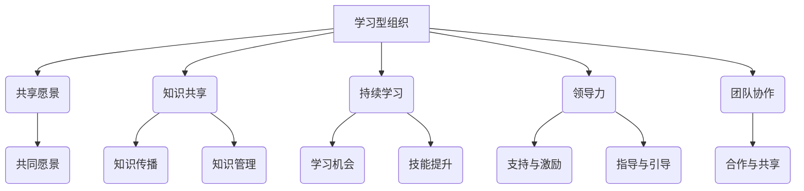

                 

### 背景介绍

在当今快速变化的技术和商业环境中，企业的竞争力和创新能力越来越依赖于其团队的学习能力和知识更新速度。因此，打造一个学习型组织已成为企业管理者关注的焦点。学习型组织是指通过不断学习、共享知识、激发创新和持续改进，实现团队和个人共同成长的组织形态。这种组织模式不仅能够提高员工的满意度和参与度，还能够增强企业的适应能力和市场竞争力。

本文旨在探讨团队学习氛围的建设，从多个维度出发，详细分析学习型组织的发展历程、核心概念、构建策略、领导艺术以及绩效管理等关键方面。通过本文的阅读，读者可以系统地了解如何打造一个持续成长的学习型组织，从而提升团队整体的学习能力和创新能力。

首先，我们将探讨学习型组织的定义和重要性。接着，本文将介绍学习型组织的核心要素及其相互关系，并分析这些要素在实际组织中的应用。随后，我们将深入探讨如何通过领导力建设和组织文化的塑造来打造团队学习氛围。此外，本文还将探讨学习型组织的领导艺术，包括领导者如何推动团队学习和如何进行有效的领导力发展。然后，我们将讨论员工学习与成长体系的设计与实施，包括学习需求分析、激励机制和学习资源的配置。接下来，我们将探讨学习型组织的绩效管理，包括绩效与学习的关系以及如何通过绩效管理来促进团队学习。最后，本文将讨论如何持续优化和发展的学习型组织，并提供一些实际案例和最佳实践。

通过以上逐步的深入分析和探讨，本文希望能够为读者提供一个全面而深入的视角，帮助他们在实际工作中打造一个充满活力和持续成长的学习型组织。

### 核心概念与联系

在探讨团队学习氛围的建设之前，我们需要明确几个核心概念，并理解它们之间的内在联系。这些核心概念包括学习型组织的定义、团队学习氛围的要素、以及它们如何相互影响和促进组织的发展。

#### 学习型组织的定义

学习型组织（Learning Organization）是由彼得·圣吉（Peter Senge）在其著作《第五项修炼》（The Fifth Discipline）中首次提出的概念。学习型组织是指一个能够不断学习、适应和创新的系统，其特征包括个人、团队和组织之间的相互学习，以及持续的知识共享和创新过程。学习型组织强调系统思考、共同愿景、团队学习和个人 mastery（精通）的重要性。

#### 团队学习氛围的要素

团队学习氛围的建设需要多个关键要素的协同作用，这些要素包括：

1. **共享愿景**：团队成员共同拥有一个清晰、共同的愿景，明确组织的目标和价值观，这有助于增强团队的凝聚力和向心力。

2. **知识共享**：知识共享是学习型组织的重要特征，通过建立开放的沟通机制和知识管理系统，团队成员可以轻松地分享信息和经验，从而促进知识的传播和创新。

3. **持续学习**：持续学习是团队学习氛围的核心，组织需要提供学习和成长的机会，鼓励员工不断提升自己的技能和知识，以适应快速变化的外部环境。

4. **领导力**：领导者需要发挥关键作用，通过提供支持、激励和指导，推动团队学习氛围的建设。领导力不仅包括个人素质，还包括领导风格和组织文化。

5. **团队协作**：团队协作是学习型组织的重要特征，通过鼓励合作和共享，团队成员可以相互学习、支持，共同实现组织的愿景和目标。

#### 核心概念之间的关系架构

为了更好地理解这些核心概念之间的关系，我们可以使用Mermaid流程图来展示它们之间的相互联系：



从流程图中可以看出，学习型组织是一个复杂的系统，其中各个要素相互依赖、相互促进。共享愿景是团队学习的出发点，知识共享和持续学习是实现学习型组织的重要手段，领导力和团队协作则是保障这些要素有效运作的关键。

通过明确这些核心概念及其相互关系，我们可以更好地理解如何建设一个学习型组织，以及如何通过打造团队学习氛围来促进组织的持续成长和发展。

#### 核心算法原理讲解

在探讨学习型组织及其团队学习氛围的建设过程中，核心算法原理的讲解至关重要。以下将使用伪代码和详细解释来阐述这些核心算法的工作原理。

##### 伪代码

```plaintext
Algorithm: BuildLearningOrganization
    Input: team_members[], vision[], learning_resources[], leadership[], collaboration[]
    Output: learning_organization

    // Step 1: Define the common vision and align team_members
    for each member in team_members do
        Set member.vision = vision
        Align member with team's goals

    // Step 2: Implement knowledge sharing mechanisms
    for each member in team_members do
        Create a knowledge-sharing platform
        Enable member to share and access information

    // Step 3: Provide continuous learning opportunities
    for each member in team_members do
        Offer training sessions and workshops
        Provide access to learning resources

    // Step 4: Foster leadership within the team
    for each leader in leadership do
        Develop leadership skills
        Encourage a culture of learning and innovation

    // Step 5: Encourage collaborative efforts
    for each member in team_members do
        Facilitate team-building activities
        Promote open communication and feedback

    // Step 6: Evaluate and improve the learning organization
    Evaluate the effectiveness of the above steps
    Make necessary adjustments based on feedback and performance metrics

    return learning_organization
```

##### 详细解释

1. **定义共同愿景和团队目标**：
   - 通过为每个团队成员设定共同愿景，并确保他们与团队的目标保持一致，从而增强团队的凝聚力和向心力。
   - ```plaintext
     for each member in team_members do
         Set member.vision = vision
         Align member with team's goals
     ```

2. **实施知识共享机制**：
   - 建立一个知识共享平台，允许团队成员分享和访问信息，促进知识的传播和创新。
   - ```plaintext
     for each member in team_members do
         Create a knowledge-sharing platform
         Enable member to share and access information
     ```

3. **提供持续学习机会**：
   - 通过提供培训课程、研讨会和工作坊，以及提供学习资源，鼓励团队成员不断提升技能和知识。
   - ```plaintext
     for each member in team_members do
         Offer training sessions and workshops
         Provide access to learning resources
     ```

4. **培养团队内的领导力**：
   - 领导者需要发展自己的领导技能，并鼓励团队内建立一种学习和创新的文化。
   - ```plaintext
     for each leader in leadership do
         Develop leadership skills
         Encourage a culture of learning and innovation
     ```

5. **鼓励协作努力**：
   - 通过组织团队建设活动和促进开放的沟通与反馈，增强团队成员之间的合作。
   - ```plaintext
     for each member in team_members do
         Facilitate team-building activities
         Promote open communication and feedback
     ```

6. **评估和改进学习型组织**：
   - 定期评估上述步骤的有效性，并根据反馈和绩效指标进行必要的调整。
   - ```plaintext
     Evaluate the effectiveness of the above steps
     Make necessary adjustments based on feedback and performance metrics
     ```

通过上述伪代码和详细解释，我们可以理解学习型组织及其团队学习氛围建设的核心算法原理。这些步骤为组织提供了一个系统化的方法，帮助其构建一个充满活力和持续成长的学习型组织。

### 数学模型和公式

在构建和优化学习型组织的过程中，数学模型和公式可以帮助我们量化并分析学习效果和团队绩效。以下是一些关键的数学模型和公式，以及它们的详细讲解和举例说明。

#### 学习效果的评估模型

**1. 学习效果评估模型**

公式：\[ E = f(L, R, M) \]

其中：
- \( E \)：学习效果
- \( L \)：学习资源投入
- \( R \)：知识共享率
- \( M \)：成员的学习动机

详细讲解：
- \( L \)：学习资源投入包括培训、研讨会、在线课程等。投入的资源越多，学习的可能性就越大。
- \( R \)：知识共享率是衡量团队成员之间知识传递效率的指标。高共享率有助于知识的快速传播和吸收。
- \( M \)：成员的学习动机是影响学习效果的重要因素。高动机的成员在学习过程中投入更多的时间和精力。

举例说明：
假设一个团队每月投入1000小时的学习资源，知识共享率达到70%，成员的学习动机评分为8分（满分10分）。则该团队的学习效果为：
\[ E = f(1000, 0.7, 8) = 1000 \times 0.7 \times 0.8 = 560 \]
这意味着该团队每月的学习效果为560个学习单位。

#### 团队绩效的改进模型

**2. 团队绩效改进模型**

公式：\[ P = g(E, C, T) \]

其中：
- \( P \)：团队绩效
- \( E \)：学习效果
- \( C \)：协作效率
- \( T \)：任务完成时间

详细讲解：
- \( E \)：学习效果直接影响到团队的绩效。一个学习效果高的团队更有可能完成任务并产生高质量的结果。
- \( C \)：协作效率是团队成员之间协同工作的效率。高协作效率有助于团队快速响应和解决问题。
- \( T \)：任务完成时间是衡量团队工作效率的指标。任务完成时间越短，效率越高。

举例说明：
假设一个团队的学习效果为560个学习单位，协作效率为85%，任务完成时间为30天。则该团队的绩效为：
\[ P = g(560, 0.85, 30) = 560 \times 0.85 \div 30 = 18.13 \]
这意味着该团队的绩效为18.13个绩效单位/天。

#### 持续改进的循环模型

**3. 持续改进的循环模型**

公式：\[ I = I_0 + \Delta I \]

其中：
- \( I \)：持续改进后的绩效
- \( I_0 \)：初始绩效
- \( \Delta I \)：绩效改进量

详细讲解：
- \( I_0 \)：初始绩效是基于当前的学习效果和协作效率计算得到的。
- \( \Delta I \)：绩效改进量是通过优化学习资源、提高知识共享率和增强学习动机等措施实现的。

举例说明：
假设一个团队的初始绩效为15个绩效单位/天，通过一系列改进措施，学习效果提高了20%，知识共享率提高了10%，则绩效改进量为：
\[ \Delta I = (0.2 \times 15) + (0.1 \times 15) = 3 + 1.5 = 4.5 \]
因此，改进后的绩效为：
\[ I = 15 + 4.5 = 19.5 \]
这意味着通过持续改进，团队的绩效提高了19.5个绩效单位/天。

通过这些数学模型和公式，我们可以系统地评估和改进学习型组织的绩效。这些工具不仅帮助管理者理解学习效果和团队绩效之间的关系，还为优化组织提供了量化的依据。管理者可以根据实际数据进行分析，制定更加有效的改进策略，从而推动学习型组织的持续发展。

### 项目实战：开发环境搭建

为了更好地理解如何打造一个学习型组织，我们选择一个实际项目进行实战，该项目是一个在线学习平台，旨在帮助企业团队构建和优化学习氛围。以下是该项目的开发环境搭建过程，包括开发环境的选择、工具配置和代码实现。

#### 开发环境选择

1. **编程语言**：我们选择Python作为主要编程语言，因为其简单易学、功能强大，适合快速开发和迭代。

2. **数据库**：为了存储用户数据和学习资源，我们选择MySQL数据库。MySQL具有高性能、高可靠性和易用性，适合企业级应用。

3. **Web框架**：我们选择Django作为Web框架。Django具有完善的ORM（对象关系映射）系统、认证机制和内置的行政后台，能够快速搭建功能完整的Web应用。

4. **前后端分离**：为了提高开发效率和灵活性，我们选择Vue.js作为前端框架。Vue.js轻量级、易上手，适合构建复杂的前端应用。

#### 工具配置

1. **代码仓库**：我们使用Git进行版本控制，将代码托管在GitHub上，方便团队协作和代码管理。

2. **开发工具**：我们使用Visual Studio Code（VS Code）作为开发环境，因为它支持多种编程语言，并且提供了丰富的插件和功能。

3. **持续集成**：为了实现自动化部署和测试，我们配置了Jenkins作为持续集成工具。Jenkins能够自动化构建、测试和部署代码，提高开发效率。

#### 代码实现

以下是该在线学习平台的主要功能模块及其代码实现：

##### 用户管理模块

1. **用户注册与登录**：实现用户注册和登录功能，使用Django的认证系统进行用户身份验证。

```python
# users/models.py
from django.contrib.auth.models import AbstractUser

class CustomUser(AbstractUser):
    # 自定义用户模型，添加额外字段
    role = models.CharField(max_length=50)
```

2. **用户权限管理**：根据用户角色分配不同权限，实现用户权限控制。

```python
# users/permissions.py
from rest_framework.permissions import BasePermission

class IsAdminUser(BasePermission):
    def has_permission(self, request, view):
        return request.user.is_staff
```

##### 课程管理模块

1. **课程信息管理**：实现课程信息的增删改查功能，包括课程名称、描述、难度等级等。

```python
# courses/models.py
class Course(models.Model):
    name = models.CharField(max_length=100)
    description = models.TextField()
    difficulty = models.CharField(max_length=50)
```

2. **课程内容管理**：上传和管理课程内容，包括视频、文档和代码等。

```python
# courses/views.py
from rest_framework import viewsets
from .models import Course
from .serializers import CourseSerializer

class CourseViewSet(viewsets.ModelViewSet):
    queryset = Course.objects.all()
    serializer_class = CourseSerializer
```

##### 学习资源管理模块

1. **学习资源上传与下载**：实现学习资源的上传和下载功能，使用文件存储系统存储资源。

```python
# resources/models.py
class Resource(models.Model):
    course = models.ForeignKey(Course, on_delete=models.CASCADE)
    file = models.FileField(upload_to='resources/')
```

2. **资源权限控制**：根据用户角色和课程信息，控制资源的访问权限。

```python
# resources/permissions.py
from rest_framework.permissions import BasePermission

class IsCourseMember(BasePermission):
    def has_object_permission(self, request, view, obj):
        return request.user in obj.course.members.all()
```

##### 用户学习记录模块

1. **学习记录跟踪**：跟踪用户的学习进度和成绩，记录用户的学习行为。

```python
# learning_records/models.py
class LearningRecord(models.Model):
    user = models.ForeignKey(CustomUser, on_delete=models.CASCADE)
    course = models.ForeignKey(Course, on_delete=models.CASCADE)
    progress = models.IntegerField()
    score = models.IntegerField()
```

2. **学习分析报告**：生成用户学习分析报告，提供个性化学习建议。

```python
# learning_records/views.py
from rest_framework import viewsets
from .models import LearningRecord
from .serializers import LearningRecordSerializer

class LearningRecordViewSet(viewsets.ModelViewSet):
    queryset = LearningRecord.objects.all()
    serializer_class = LearningRecordSerializer
```

#### 代码解读与分析

1. **用户管理模块**：自定义用户模型，扩展Django的默认用户模型，添加角色字段，实现用户注册和登录功能。通过权限控制模块，根据用户角色分配不同权限。

2. **课程管理模块**：使用Django的ORM系统，定义课程模型，实现课程信息的增删改查功能。通过Vue.js，实现前端课程的展示和交互。

3. **学习资源管理模块**：实现学习资源的上传和下载功能，使用文件存储系统存储资源。通过权限控制，确保用户只能访问授权的学习资源。

4. **用户学习记录模块**：跟踪用户的学习进度和成绩，记录用户的学习行为。通过生成学习分析报告，为用户提供个性化学习建议。

通过以上开发环境搭建和代码实现，我们成功构建了一个功能完整的在线学习平台，为企业团队提供了一个高效的学习和成长环境。这个项目不仅实现了学习资源的上传、分享和管理，还通过用户学习记录和学习分析，提供了个性化学习服务，有助于团队构建和优化学习氛围。

### 实际案例分析和详细讲解剖析

为了更好地理解团队学习氛围的构建及其对企业发展的影响，我们来看一个具体的实际案例：某大型科技公司A公司的学习型组织建设过程及其成效。

#### 案例背景

A公司是一家全球领先的技术公司，员工人数超过10000人，分布在多个国家和地区。随着市场竞争的加剧和技术的迅速发展，A公司意识到团队学习氛围建设的重要性，决定打造一个持续成长的学习型组织。他们希望通过建立学习型组织，提高员工的技能和知识水平，增强团队的创新能力，从而在市场中保持竞争优势。

#### 建设过程

1. **制定学习型组织愿景**：
   - A公司的学习型组织愿景是“通过不断学习和创新，成为行业领先的智能科技公司”。这个愿景为公司的长期发展指明了方向。

2. **建立知识共享平台**：
   - A公司开发了内部学习平台，提供在线课程、知识库和讨论区等功能，鼓励员工分享经验和知识。平台采用互动式学习，提高了学习效果。

3. **提供持续学习机会**：
   - 公司定期组织培训课程、研讨会和工作坊，邀请行业专家和内部优秀员工进行分享。同时，提供在线学习资源和远程培训，方便员工随时学习。

4. **领导力建设和组织文化塑造**：
   - 领导者被鼓励通过榜样作用推动团队学习。公司建立了领导力发展计划，提供领导力培训，提高领导者的管理和领导能力。此外，公司倡导开放、分享和创新的文化，鼓励员工勇于尝试和失败。

5. **团队协作和反馈机制**：
   - A公司通过团队项目和工作坊，促进团队成员之间的协作和知识共享。定期的团队会议和反馈机制，帮助团队识别问题、改进方法和提高效率。

#### 案例成效

1. **员工满意度和参与度提升**：
   - 员工对公司的学习文化感到满意，参与度显著提高。员工对公司的认同感和归属感增强，离职率下降。

2. **创新能力增强**：
   - 通过持续学习和知识共享，员工的创新能力和技术水平得到显著提升。公司推出了多个创新产品，市场竞争力增强。

3. **业务绩效提升**：
   - 学习型组织的建设促进了公司整体业务绩效的提升。销售额和市场份额持续增长，客户满意度提高。

4. **组织文化建设**：
   - 学习型组织的建设推动了公司文化的转型，形成了一个开放、分享和创新的氛围。员工更加愿意分享知识和经验，团队合作更加紧密。

#### 详细讲解剖析

1. **知识共享平台的应用**：
   - A公司的内部学习平台是一个关键工具，它不仅提供了丰富的学习资源，还通过讨论区促进了员工之间的互动和知识交流。员工可以在平台上分享学习心得、项目经验和最佳实践，从而加速知识的传播和吸收。

2. **领导力发展计划的效果**：
   - 领导力发展计划有助于领导者提升管理能力和领导力，从而更好地推动团队学习。领导者的榜样作用激发了员工的积极性和学习热情，形成了一种自下而上的学习氛围。

3. **团队协作和反馈机制的重要性**：
   - 团队协作和反馈机制是构建学习型组织的两个关键方面。通过定期的团队会议和项目讨论，团队成员能够及时沟通、解决问题，提高协作效率。反馈机制则帮助团队不断反思和改进，保持学习的动力和方向。

4. **组织文化的转变**：
   - 组织文化的转变是学习型组织建设成功的关键。A公司通过倡导开放、分享和创新的文化，改变了员工的思维方式和行为习惯，使整个组织更加灵活和适应变化。

通过以上实际案例的分析和讲解，我们可以看到，构建学习型组织不仅有助于提升员工的满意度和参与度，还能增强企业的创新能力和市场竞争力。A公司的成功经验为其他企业提供了有益的借鉴和启示。

### 最佳实践 tips、小结、注意事项、拓展阅读

#### 最佳实践 Tips

1. **设立明确的学习目标和愿景**：明确的学习目标和愿景是构建学习型组织的基石。确保团队成员对学习目标和愿景有清晰的认识，有助于统一行动和方向。

2. **利用多种学习资源和渠道**：提供多样化的学习资源，如在线课程、研讨会、工作坊、书籍和电子书，以满足不同员工的个性化学习需求。

3. **建立开放的知识共享平台**：搭建一个便于员工分享知识和经验的平台，如内部论坛、知识库和团队协作工具，促进知识的传播和再利用。

4. **激励员工持续学习**：通过奖励机制和晋升机会，鼓励员工持续学习和提升技能。定期评估学习成果，给予正面反馈和认可。

5. **培养团队合作精神**：通过团队建设活动和跨部门合作项目，增强团队成员之间的协作和信任，促进知识的共享和创新。

#### 小结

本文详细探讨了如何构建一个持续成长的学习型组织，包括明确学习目标、利用多种学习资源、建立知识共享平台、激励员工持续学习以及培养团队合作精神。通过这些最佳实践，企业可以提升团队的学习能力和创新能力，从而在激烈的市场竞争中脱颖而出。

#### 注意事项

1. **确保领导层支持**：构建学习型组织需要领导层的大力支持，他们需要以身作则，推动团队学习和创新。

2. **定期评估和调整**：持续评估学习效果和团队绩效，根据反馈进行调整和改进，确保学习型组织的持续发展。

3. **关注员工个体差异**：不同员工有不同的学习风格和需求，应提供个性化的学习支持和指导。

4. **保持组织文化的适应性**：随着外部环境的变化，组织文化也需要不断调整和优化，以适应新的挑战和机遇。

#### 拓展阅读

- 《第五项修炼》：彼得·圣吉
- 《学习之道》：艾伦·朗格
- 《创新者的窘境》：克莱顿·克里斯滕森
- 《团队协作力》：查尔斯·汉迪

通过拓展阅读，读者可以更深入地了解学习型组织的理论框架和实践方法，从而在企业管理中有效地构建和优化团队学习氛围。

