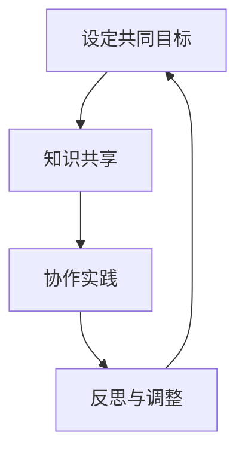

                 


## 文章标题

《团队学习氛围：打造持续成长的组织》

## 关键词

团队学习、学习型组织、组织文化、知识共享、领导力、沟通与协作

## 摘要

在当今快速变化的技术时代，持续学习已经成为企业成功的关键因素。本文将探讨如何构建团队学习氛围，打造一个持续成长的组织。通过深入分析团队学习的核心概念、构建团队学习氛围的基础、促进团队学习的策略与工具，以及实践中的挑战和解决方案，本文旨在为IT团队提供一套系统的团队学习指南，帮助他们在不断变化的市场环境中保持竞争优势。

---

### 目录

**第一部分：团队学习氛围的构建**

1. [团队学习的核心概念](#团队学习的核心概念)
2. [构建团队学习氛围的基础](#构建团队学习氛围的基础)
3. [促进团队学习的策略与工具](#促进团队学习的策略与工具)

**第二部分：团队学习的实践方法**

4. [团队学习过程的管理](#团队学习过程的管理)
5. [团队学习中的沟通与协作](#团队学习中的沟通与协作)
6. [团队学习的领导力与团队动力](#团队学习的领导力与团队动力)

**第三部分：团队学习的案例与实践**

7. [团队学习案例分析](#团队学习案例分析)
8. [团队学习的持续改进](#团队学习的持续改进)

**附录**

9. [团队学习资源与工具推荐](#团队学习资源与工具推荐)

---

### 第1章：团队学习的核心概念

#### 1.1 团队学习的定义与价值

团队学习是指团队成员在共同的目标下，通过知识的共享、协作和反思，不断提升自身能力和组织整体效能的过程。其核心在于：

- **知识共享**：团队成员之间通过交流、讨论和协作，将各自的知识和经验进行分享和融合。
- **协作实践**：通过实际项目或任务，将学习到的知识和技能应用到实践中，不断迭代和完善。
- **反思与调整**：团队成员在学习和实践过程中不断反思，发现不足，进行调整和优化。

团队学习的价值体现在以下几个方面：

- **提高团队整体能力**：通过共同学习和实践，团队成员的能力得到全面提升，从而提高团队的执行力和竞争力。
- **促进创新**：团队学习鼓励创新思维，通过知识的碰撞和融合，产生新的想法和解决方案。
- **增强团队凝聚力**：共同的学习过程有助于团队成员之间的相互了解和信任，增强团队凝聚力。

#### 1.2 学习型组织的特征与重要性

学习型组织是指那些致力于通过不断学习和适应变革来保持竞争优势的组织。其特征包括：

- **共同愿景**：组织成员共同追求的目标和价值观。
- **团队学习**：组织鼓励成员之间的知识共享和协作学习。
- **自主管理**：团队成员具备自我管理和自我约束的能力。
- **改变心智模式**：组织成员愿意挑战传统思维，拥抱变化和创新。
- **系统思考**：从整体角度看待问题，寻找系统性的解决方案。

学习型组织的重要性在于：

- **增强组织适应能力**：学习型组织能够快速适应市场变化，保持竞争优势。
- **提高组织创新能力**：通过团队学习和知识共享，组织能够不断产生新的创意和解决方案。
- **促进组织可持续发展**：持续学习和改进是组织持续发展的动力。

#### 1.3 团队学习型团队的核心要素

一个学习型团队需要具备以下几个核心要素：

- **共同目标**：团队明确共同的目标和愿景，确保团队成员的行动方向一致。
- **知识共享**：建立有效的知识共享机制，鼓励团队成员分享知识和经验。
- **协作实践**：通过协作项目或任务，将学习到的知识和技能应用到实践中。
- **反思与调整**：团队成员在学习和实践过程中不断反思，发现不足，进行调整和优化。

### Mermaid 流程图

下面是一个简化的团队学习过程流程图：



### 伪代码

```python
def team_learning(process):
    # 设定共同目标
    set_common_goal()

    # 知识共享
    share_knowledge()

    # 协作实践
    execute_project()

    # 反思与调整
    reflect_and_adjust()

    # 迭代学习过程
    process.append(team_learning)
```

### 数学模型和公式

团队学习效益 \( B \) 可以表示为：

$$
B = f(\text{知识共享程度}, \text{协作效率}, \text{反思能力})
$$

### 举例说明

假设一个IT团队在开发一个新项目时，通过以下步骤进行团队学习：

1. **设定共同目标**：团队确定开发项目的目标，包括功能需求和项目时间表。
2. **知识共享**：团队成员分享各自的专业知识和经验，确保项目顺利进行。
3. **协作实践**：团队成员分工合作，完成项目的开发和测试。
4. **反思与调整**：项目完成后，团队进行反思，发现不足并调整改进方案。

通过这样的团队学习过程，团队不仅完成了项目，还提高了成员的技能和协作能力。

---

以上是第1章的内容，接下来将继续深入探讨构建团队学习氛围的基础、促进团队学习的策略与工具，以及实践中的挑战和解决方案。通过逐步分析，我们将为IT团队提供一套完整的团队学习指南。

