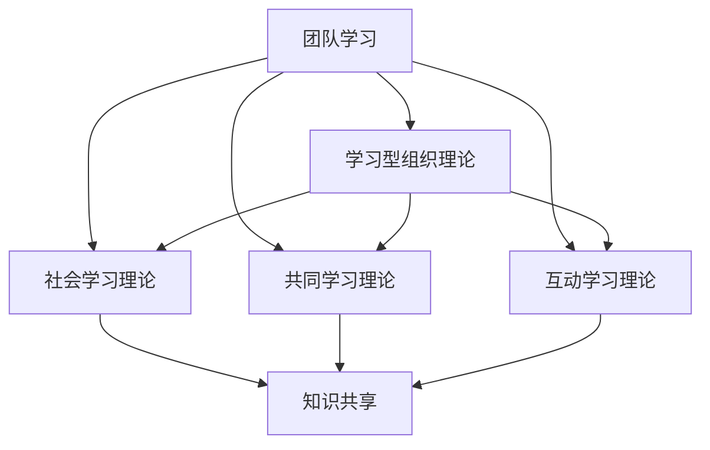

                 

### 背景介绍

在现代信息技术高速发展的时代，企业组织面临着日益复杂的市场环境和快速变化的技术趋势。为了在这种动态环境中保持竞争力，组织必须具备快速学习、适应和创新的 capability。团队学习作为一种促进组织学习与创新的重要策略，逐渐受到企业界和学术界的广泛关注。

团队学习是指团队成员通过共享知识、经验与想法，共同探索问题、解决问题的过程。学习型组织则是一种致力于持续学习和知识创造的组织形态，其核心特征是成员之间的高度协作和共同愿景。团队学习与学习型组织之间的关系紧密，团队学习是学习型组织构建的基础，而学习型组织则为团队学习提供了良好的生态环境。

本文将深入探讨团队学习的重要性及其在打造学习型组织中的应用。首先，我们将介绍团队学习的核心概念和理论，包括社会学习理论、共同学习理论和互动学习理论。接着，我们将分析学习型组织的构建原则，如共同愿景、团队合作和个体成长。随后，我们将提供具体的团队学习策略和实践方法，以及如何营造支持团队学习的组织文化。此外，本文还将通过案例研究，展示成功的学习型组织案例，并详细讲解如何在实际工作中实施团队学习。最后，我们将总结全文，提出未来研究方向，并给出一些建议。

通过本文的深入分析，希望能够为读者提供一套系统的团队学习与实践指南，助力组织构建学习型组织，提升整体竞争力。

### 核心概念与联系

在探讨团队学习及其在构建学习型组织中的应用之前，我们首先需要明确几个核心概念及其相互之间的关系。这些概念包括：社会学习理论、共同学习理论、互动学习理论，以及学习型组织理论。下面，我们将通过一个Mermaid流程图来展示这些概念之间的关系。



**社会学习理论（Social Learning Theory）**：社会学习理论认为，个体的行为、态度和技能是通过观察和模仿他人的行为来学习的。在团队学习中，社会学习理论强调成员通过观察同事的学习行为和成果，从而提高自己的学习效果。知识共享（F）是这一理论的核心机制，团队成员通过分享知识、经验和技巧，实现共同进步。

**共同学习理论（Collective Learning Theory）**：共同学习理论强调，当多个个体在一个团队中共同学习时，通过协作和互动，可以产生比单个个体学习更加显著的学习效果。这一理论关注团队成员之间的互动和协作，通过共同解决问题和讨论，实现知识的整合和创新。

**互动学习理论（Interactive Learning Theory）**：互动学习理论认为，学习是一个互动过程，个体通过与其他个体或环境互动，来获取、处理和应用知识。在团队学习中，互动学习理论强调团队成员之间的交流和讨论，通过相互启发和反馈，促进深层次的学习和理解。

**学习型组织理论（Learning Organization Theory）**：学习型组织理论提出，一个组织如果能够实现持续学习和知识创造，就可以称之为学习型组织。学习型组织强调组织成员的共同愿景、团队协作和个体成长，通过建立学习机制和文化，实现组织的可持续发展。

通过上述流程图，我们可以看到，这些核心概念之间是相互关联的。社会学习理论、共同学习理论和互动学习理论共同构成了团队学习的基础，而学习型组织理论则为团队学习提供了更高层次的理论框架。在构建学习型组织的过程中，这些理论为我们提供了宝贵的指导，帮助我们理解和实现团队学习的目标。

### 社会学习理论

社会学习理论是由心理学家阿尔伯特·班杜拉（Albert Bandura）提出的，它强调个体通过观察和模仿他人的行为来学习。在团队学习的背景下，社会学习理论的重要性尤为突出。团队成员通过观察同事的学习行为和成果，可以获取新的知识、技能和态度，从而提升自身的学习效果。

社会学习理论的核心机制是知识共享。在团队学习中，知识共享不仅仅是指信息的传递，更是一种深层次的知识交换和共创过程。团队成员通过分享个人经验、专业知识和创新想法，可以互相启发，实现知识的整合和创新。这种共享机制有助于打破信息孤岛，促进团队整体学习效率的提升。

具体来说，社会学习理论在团队学习中的应用可以从以下几个方面体现：

1. **观察学习**：团队成员通过观察同事的学习行为，可以了解不同学习策略和方法的有效性。例如，一个团队成员可能会观察到另一位同事在解决问题时采用了一种新的技术方法，从而激发自己尝试这种方法。

2. **模仿学习**：团队成员可以在观察他人的学习行为后，尝试模仿这些行为。例如，一个团队成员可能会模仿另一位同事的沟通技巧，从而提升自己在团队协作中的表达能力。

3. **反思学习**：团队成员在模仿他人的学习行为后，可以对自己的学习过程进行反思，从而进一步优化自己的学习方法。通过反思，团队成员可以发现自己在学习过程中的优点和不足，并采取相应的改进措施。

4. **强化学习**：团队成员在学习过程中，会获得来自团队其他成员的反馈和认可。这种反馈和认可是强化学习的重要手段，可以激励团队成员持续学习和进步。

为了更好地理解社会学习理论在团队学习中的应用，我们可以通过以下伪代码来描述一个简单的学习过程：

```python
def observe_and_learn(observer, subject):
    # 观察学习
    observer.behavior = subject.behavior
    
    # 模仿学习
    observer模仿subject的行为
    
    # 反思学习
    observer反思学习过程，优化学习方法
    
    # 强化学习
    observer获得反馈，激励持续学习
```

在这个伪代码中，`observer` 代表观察学习的团队成员，`subject` 代表被观察的团队成员。通过这个简单的模型，我们可以看到社会学习理论在团队学习中的具体应用。

总之，社会学习理论为团队学习提供了重要的理论基础，通过观察、模仿、反思和强化，团队成员可以实现知识的共享和创新，从而提升整体学习效果。在构建学习型组织的过程中，充分利用社会学习理论，可以有效地促进团队学习和组织发展。

### 共同学习理论

共同学习理论强调，当多个个体在一个团队中共同学习时，通过协作和互动，可以产生比单个个体学习更加显著的学习效果。这一理论的核心在于团队协作和知识整合，通过团队成员之间的互动和合作，实现知识的共创和共享。

共同学习理论认为，知识在团队中的创造和传播是一个动态的过程。团队成员通过合作解决问题、讨论和分享经验，可以促进知识的深度理解和广泛应用。在这个过程中，每个成员都扮演着知识创造者和知识接受者的双重角色，彼此之间的互动和交流是知识共享的关键。

以下是一个简单的共同学习流程：

1. **问题识别**：团队首先需要识别出需要解决的问题或需要学习的新知识。
2. **分工协作**：团队成员根据各自的专长和经验，分工合作，共同探讨解决方案或学习内容。
3. **互动交流**：在讨论过程中，团队成员分享各自的见解、经验和知识，通过互动和交流，实现知识的整合和创新。
4. **反思与优化**：学习完成后，团队成员对学习过程进行反思，评估学习效果，并针对发现的问题进行优化。

为了更好地理解共同学习理论，我们可以通过以下伪代码来描述一个共同学习的例子：

```python
def collaborative_learning(team_members):
    # 问题识别
    problem = identify_problem()
    
    # 分工协作
    for member in team_members:
        member.take_responsibility(problem部分)
    
    # 互动交流
    for member in team_members:
        member.share_knowledge()
        member.listen_to_others()
    
    # 反思与优化
    for member in team_members:
        member.reflect_learning()
        member.improve_solution()
```

在这个伪代码中，`team_members` 代表团队中的所有成员，`identify_problem()` 函数用于识别需要解决的问题，`take_responsibility()` 函数表示成员分工合作，`share_knowledge()` 和 `listen_to_others()` 函数表示互动交流，`reflect_learning()` 和 `improve_solution()` 函数表示反思与优化。

共同学习理论强调，通过团队合作和知识整合，可以实现知识的深度理解和广泛应用。团队成员之间的协作和互动是共同学习的核心，通过这种互动，团队成员可以相互启发，共同创造新的知识。这种学习方式不仅提高了团队成员的个人能力，也提升了整个团队的学习效率和创新能力。

总之，共同学习理论为团队学习提供了重要的指导，通过团队成员之间的协作和互动，实现知识的共创和共享，从而提升团队的整体学习效果。在构建学习型组织的过程中，充分利用共同学习理论，可以有效地促进团队学习和组织发展。

### 互动学习理论

互动学习理论强调，学习是一个互动过程，个体通过与他人的互动以及与环境的互动，来获取、处理和应用知识。在团队学习的背景下，互动学习理论尤为重要，因为它揭示了团队成员之间互动和协作在知识获取和创新中的关键作用。

互动学习理论的核心在于以下几个方面：

1. **沟通与交流**：团队成员之间的沟通和交流是实现互动学习的基础。通过沟通，团队成员可以分享各自的观点、知识和经验，从而促进知识的传递和共享。良好的沟通能够打破信息孤岛，提高团队的整体学习效率。

2. **反馈与反馈循环**：互动学习过程中的反馈机制对于知识的深化和应用至关重要。团队成员通过相互反馈，可以及时了解自己在学习过程中的优点和不足，并进行相应的调整和改进。这种反馈循环有助于团队成员持续学习和进步。

3. **协作与共同创造**：互动学习理论强调，通过协作和共同创造，团队成员可以实现知识的整合和创新。在团队项目中，成员之间通过分工合作，共同解决问题，可以产生比单个个体学习更丰富的知识和见解。

4. **情境与情境构建**：互动学习理论认为，学习发生在特定的情境中，情境对于知识的获取和应用有着重要影响。通过构建有意义的情境，团队成员可以更好地理解和应用所学知识，从而提高学习效果。

为了更好地理解互动学习理论在团队学习中的应用，我们可以通过以下伪代码来描述一个简单的互动学习过程：

```python
def interactive_learning(team_members, environment):
    # 沟通与交流
    for member in team_members:
        member.share_insights()
    
    # 反馈与反馈循环
    for member in team_members:
        member.give_feedback()
    
    # 协作与共同创造
    for member in team_members:
        member.work_together()
    
    # 情境与情境构建
    environment.create_meaningful_context()
    
    # 学习与应用
    for member in team_members:
        member.apply_knowledge()
```

在这个伪代码中，`team_members` 代表团队中的所有成员，`environment` 代表学习环境。`share_insights()` 函数表示成员之间的沟通和交流，`give_feedback()` 函数表示反馈与反馈循环，`work_together()` 函数表示协作与共同创造，`create_meaningful_context()` 函数表示情境与情境构建，`apply_knowledge()` 函数表示学习与应用。

通过这个简单的模型，我们可以看到互动学习理论在团队学习中的具体应用。互动学习不仅有助于知识的传递和共享，还可以激发团队成员的创造力和创新能力，从而提升团队的整体学习效果。

总之，互动学习理论为团队学习提供了重要的指导，通过沟通、反馈、协作和情境构建，实现知识的获取和创新。在构建学习型组织的过程中，充分利用互动学习理论，可以有效地促进团队学习和组织发展。

### 学习型组织理论

学习型组织理论是由彼得·圣吉（Peter Senge）在其著作《第五项修炼》中首次提出的。这一理论认为，一个组织如果能够实现持续学习和知识创造，就可以称之为学习型组织。学习型组织强调组织成员之间的协作、共同愿景和系统思维，通过不断学习和适应变化，实现组织的可持续发展。

**学习型组织的核心特征**包括：

1. **共同愿景**：共同愿景是学习型组织的基石。它是一种强烈的内在动力，能够引导和激励组织成员朝着共同的目标努力。共同愿景不仅仅是一个口号或目标，而是一种深层次的信仰和使命感。

2. **系统思维**：系统思维是学习型组织的重要方法论。它强调组织成员要具备整体观念，从系统的角度分析和解决问题，而不是片面地看待问题。通过系统思维，组织成员能够更好地理解组织内部和外部的相互关系，从而做出更明智的决策。

3. **团队协作**：学习型组织强调团队协作，认为团队是知识创造和传播的基本单位。团队成员通过相互合作、分享知识和经验，可以提升整体学习效果。团队协作不仅是完成任务的手段，更是组织文化的重要组成部分。

4. **个体成长**：学习型组织重视个体成长，认为个体的发展是组织成功的关键。组织通过为成员提供学习机会和发展平台，帮助成员实现自我提升和职业发展。

**学习型组织的构建原则**包括：

1. **建立共同愿景**：组织需要通过沟通和讨论，共同制定一个明确的愿景，并确保所有成员对愿景有共同的理解和认同。

2. **培养团队协作**：组织要通过建立团队文化、设立协作机制和提供协作工具，促进团队成员之间的互动和合作。

3. **推动系统思维**：组织需要通过培训和教育，帮助成员掌握系统思维的方法，并在实际工作中运用。

4. **鼓励个体成长**：组织要为成员提供成长机会，包括培训、指导和支持，帮助成员不断提升个人能力和职业素养。

**学习型组织与团队学习的关系**：

学习型组织为团队学习提供了良好的生态环境。首先，共同愿景和系统思维能够引导团队朝着共同的目标努力，使团队学习具有明确的方向和目标。其次，团队协作和个体成长为团队学习提供了强有力的支持，使团队成员能够在协作和互动中实现知识的共享和创新。此外，学习型组织的文化氛围也为团队学习创造了良好的条件，鼓励成员敢于尝试、勇于创新。

总之，学习型组织理论为团队学习提供了重要的理论指导。通过构建学习型组织，组织可以培养团队学习的文化，提升整体学习效果，从而实现组织的可持续发展。

### 实践策略

在了解了团队学习及其与学习型组织的关系后，我们需要探讨具体的实践策略，以在实际工作中有效实施团队学习。以下是一些关键的策略和方法：

#### 1. 训练与发展

**员工培训**是团队学习的重要环节，旨在提高团队成员的专业技能和知识水平。培训内容应包括最新的行业趋势、技术更新以及团队协作技巧。培训形式可以多样化，如内部讲座、外部专家讲座、在线课程、工作坊和实地考察等。此外，组织还应鼓励员工参加外部培训和认证，以提升个人能力和职业素养。

**发展计划**则是针对团队成员的长期成长规划，包括职业规划、技能提升和跨部门交流。组织可以通过导师制度、轮岗机会和跨部门项目，帮助成员获得多方面的经验和技能，促进团队成员之间的相互了解和协作。

#### 2. 反思与反馈

**反思**是团队学习的重要步骤，它帮助团队成员审视自己的学习过程和成果，发现优点和不足。组织可以定期组织反思会议，鼓励团队成员分享自己的学习心得和体会，从不同角度探讨问题解决方案。反思不仅有助于团队成员个人成长，也有助于团队整体能力的提升。

**反馈**是团队学习中不可或缺的环节。组织应建立有效的反馈机制，确保团队成员能够及时获得来自同事、上级和下属的反馈。反馈内容应具体、建设性，不仅指出问题，还应提供改进建议。通过定期反馈，团队成员可以不断调整自己的学习策略和方法，提高学习效果。

#### 3. 模式与机制

为了确保团队学习能够持续进行，组织需要建立一系列**学习模式和机制**。以下是一些常用的模式与机制：

- **学习小组**：组织可以成立学习小组，由具有共同兴趣或目标的团队成员组成。小组成员定期聚会，分享学习心得和研究成果，共同探讨问题解决方案。
- **知识库**：组织应建立一个集中的知识库，用于存储和管理团队成员的知识和经验。知识库可以包括文档、教程、案例研究、视频和音频资料等，方便成员随时查阅和学习。
- **学习平台**：组织可以建立内部学习平台，如在线课程管理系统（LMS）、知识共享论坛和协作工具，为团队成员提供便捷的学习资源和交流渠道。
- **知识分享会**：定期举办知识分享会，邀请团队成员分享自己的专业知识和经验。知识分享会不仅可以提高团队成员的交流能力，还可以激发新的灵感和创意。
- **评估与奖励**：组织应设立学习评估机制，对团队成员的学习成果进行评估，并给予适当的奖励和认可。评估内容可以包括知识掌握程度、项目贡献和团队协作表现等。

通过以上策略和方法，组织可以有效地促进团队学习，提高整体学习效果和创新能力。在实践中，组织应根据自身情况和需求，灵活选择和组合这些策略，以实现最佳效果。

### 实践步骤

构建学习型组织并不仅仅是理论上的追求，更需要通过具体的实践步骤来落地实施。以下是构建学习型组织的六个关键步骤：

#### 1. 制定学习计划

制定学习计划是构建学习型组织的第一步。组织需要明确学习目标、学习内容和学习时间，确保所有成员都明确自己的学习方向。学习计划应包括以下几个方面：

- **目标设定**：明确学习计划的目标，如提高专业技能、增强团队协作能力或掌握新知识。
- **内容规划**：根据目标，规划具体的学习内容，包括培训课程、在线学习资源和专业书籍等。
- **时间安排**：合理规划学习时间，确保成员能够在工作与学习之间找到平衡。

#### 2. 建立学习平台

建立学习平台是支持团队学习的重要基础。组织可以采用以下几种方式来搭建学习平台：

- **内部培训系统**：建立内部培训系统，提供在线课程和学习资源，方便成员随时学习。
- **知识共享论坛**：搭建知识共享论坛，鼓励成员分享自己的经验和见解，促进知识的传播和共享。
- **协作工具**：引入协作工具，如项目管理系统、即时通讯工具和文档共享平台，提高团队协作效率。

#### 3. 创造学习氛围

创造良好的学习氛围是促进团队学习的重要条件。组织可以通过以下措施来营造积极的学习氛围：

- **领导示范**：领导层应积极参与学习活动，通过自身的榜样作用激发员工的学习热情。
- **鼓励探索**：鼓励员工尝试新事物、勇于探索，提供必要的支持和资源，减少员工在学习过程中的顾虑。
- **奖励机制**：建立奖励机制，对在学习和创新方面表现优秀的员工给予奖励和认可，激励员工持续学习和进步。

#### 4. 培养团队协作

团队协作是学习型组织的核心特征。组织可以通过以下方式来培养团队协作：

- **团队建设活动**：定期举办团队建设活动，如团队拓展训练、团建活动和集体讨论等，增强团队成员之间的信任和沟通。
- **跨部门项目**：通过跨部门项目，促进不同部门之间的协作和交流，实现知识共享和创新。
- **协作机制**：建立有效的协作机制，如设立项目组、定期召开项目会议和制定明确的协作流程，确保团队协作高效有序。

#### 5. 设立学习评估机制

学习评估机制是确保学习效果的重要手段。组织可以通过以下方式来设立学习评估机制：

- **定期评估**：定期对团队成员的学习效果进行评估，包括知识掌握程度、项目贡献和团队协作表现等。
- **反馈与改进**：根据评估结果，提供反馈和建议，帮助成员发现不足并采取改进措施，持续提升学习效果。
- **奖励与激励**：对在评估中表现优异的成员给予奖励和激励，激发学习动力。

#### 6. 持续改进与优化

构建学习型组织是一个持续的过程，组织需要不断进行改进和优化。以下是一些持续改进的措施：

- **反馈循环**：建立反馈循环机制，及时收集和分析成员的反馈，识别问题和改进机会。
- **创新文化**：鼓励创新思维和创意，为员工提供实验和创新的空间，支持他们进行尝试和探索。
- **学习与发展**：为员工提供持续的学习和发展机会，如外部培训、专业认证和职业规划等，帮助员工不断提升个人能力和职业素养。

通过以上六个步骤，组织可以逐步构建起学习型组织，促进团队成员的持续学习和创新，提高整体竞争力和适应能力。

### 组织文化

组织文化是构建学习型组织的核心要素，它直接影响团队成员的学习动机、参与度和创新力。一个积极、开放和支持学习的组织文化能够为团队学习提供良好的生态环境，促进知识的共享和创新。以下是如何培养支持团队学习的组织文化的几个关键方面：

#### 1. 领导力与价值观

领导力是塑造组织文化的关键因素。领导者应树立积极的学习价值观，并将其融入日常管理中。以下是一些领导者可以采取的措施：

- **以身作则**：领导者应通过自身的榜样作用，展示对学习的重视和承诺。例如，通过参加培训、阅读专业书籍和分享学习心得，向团队成员传递学习的重要性。
- **鼓励探索**：领导者应鼓励员工勇于尝试新事物，支持他们在工作中进行创新和实验。这可以通过提供资源支持、减少失败风险和提供反馈与指导来实现。
- **建立共同愿景**：领导者应与团队成员共同制定组织的愿景和目标，使每个成员都能理解并认同组织的价值观。这有助于增强团队凝聚力，促进共同学习。

#### 2. 信任与开放

信任和开放是支持团队学习的重要基础。以下是一些措施来建立信任和开放的团队环境：

- **促进沟通**：组织应提供多种沟通渠道，如定期的团队会议、工作坊和开放式论坛，鼓励团队成员分享想法和经验。通过透明沟通，团队成员可以更好地理解彼此的观点和需求，建立信任关系。
- **鼓励反馈**：组织应建立反馈文化，鼓励成员之间提供具体、建设性的反馈。这种反馈可以是正面的鼓励，也可以是建设性的批评，帮助成员不断提升个人和团队的表现。
- **减少恐惧**：组织应采取措施减少员工在学习和创新过程中的恐惧感。例如，通过设定合理的错误容忍度，鼓励员工敢于尝试和犯错误，从错误中学习。

#### 3. 共享与创新

共享和创新是团队学习的核心目标。以下是一些措施来促进知识共享和创新：

- **知识管理**：组织应建立有效的知识管理体系，包括知识库、文档管理工具和共享平台。这有助于团队成员快速获取所需的知识和资源，提高学习效率。
- **奖励与认可**：组织应设立奖励和认可机制，对在知识共享和创新方面表现突出的成员给予奖励和认可，激发团队成员的积极性。
- **跨部门合作**：组织应促进跨部门合作，通过跨部门项目和团队建设活动，增强不同部门之间的交流和合作。这有助于知识的跨部门共享和创新。

#### 4. 持续发展

持续发展是组织文化的关键特征，它要求组织不断适应变化，保持学习和创新能力。以下是一些持续发展的措施：

- **培训与发展**：组织应提供持续的培训和发展机会，帮助员工提升个人能力和职业素养。这包括内部培训、外部培训和在线学习等。
- **创新文化**：组织应鼓励创新思维，提供实验和创新的空间，支持员工进行尝试和探索。这可以通过设立创新实验室、提供创新奖金和设立创新项目来实现。
- **反馈与改进**：组织应建立反馈和改进机制，及时收集和分析成员的反馈，识别问题和改进机会。这有助于组织不断优化学习和工作流程，保持持续发展的动力。

通过以上措施，组织可以逐步培养起支持团队学习的文化，促进知识的共享和创新，提高整体竞争力和适应能力。

### 案例研究

在本节中，我们将通过分析三个具体的学习型组织案例，探讨这些组织在构建和维持学习型组织过程中所采取的策略和措施。这些案例将展示成功的关键因素以及可能遇到的挑战，为其他组织提供有价值的参考。

#### 案例一：公司A的团队学习实践

**公司背景**：公司A是一家跨国科技公司，主要从事软件开发和信息技术服务。公司A在快速变化的市场环境中，面临着技术更新迅速、客户需求多样化的挑战。

**团队学习策略**：

1. **共同愿景**：公司A的领导层明确了“成为行业领先的创新者”的共同愿景，并通过定期的全体会议和团队讨论，确保所有员工对愿景有共同的理解和认同。

2. **培训与发展**：公司A建立了完善的员工培训体系，包括内部培训课程、外部培训机会和专业认证。公司鼓励员工参加各类培训，并提供时间和支持，确保员工能够不断提升自己的技能和知识。

3. **知识共享**：公司A建立了内部知识库和协作平台，鼓励员工分享经验和最佳实践。公司定期组织知识分享会，邀请员工分享自己的专业知识和创新成果。

4. **创新文化**：公司A鼓励创新思维，通过设立创新实验室和创新奖金，支持员工进行技术探索和实验。公司还设立了创新项目，鼓励员工跨部门合作，共同解决复杂问题。

**挑战与解决方案**：

- **挑战**：在快速变化的市场环境中，如何确保员工的学习与公司的业务需求保持同步？

- **解决方案**：公司A通过定期评估员工的学习成果和项目表现，确保学习与业务需求紧密结合。公司还设立了跨部门的项目组，通过项目实践，使员工能够在实际工作中应用所学知识，提高学习效果。

**总结**：公司A的成功经验表明，共同愿景、培训与发展、知识共享和创新文化是构建学习型组织的核心要素。通过这些措施，公司A不仅提升了员工的学习能力和创新能力，还增强了团队凝聚力和整体竞争力。

#### 案例二：学校B的学习型组织建设

**学校背景**：学校B是一所知名的高中，以其创新的教育理念和卓越的教学质量而闻名。学校B注重培养学生的创新能力和批判性思维。

**团队学习策略**：

1. **共同愿景**：学校B的领导层明确了“培养具有全球视野的创新人才”的共同愿景，并通过全校师生的讨论和共识，确保愿景的落实。

2. **教师培训**：学校B重视教师的培训和发展，通过定期的教师研讨会、专业发展课程和外部培训，提升教师的教学技能和专业素养。

3. **知识共享**：学校B建立了教师交流平台，鼓励教师分享教学经验、教学方法和学生评价。学校还定期组织教学研讨会，为教师提供交流和学习的机会。

4. **学生参与**：学校B鼓励学生参与课程设计和项目研究，通过项目式学习和跨学科合作，培养学生的创新能力和团队合作精神。

**挑战与解决方案**：

- **挑战**：如何平衡学生的个性发展和团队合作，确保每个学生都能在团队学习中获得成长？

- **解决方案**：学校B通过设定明确的学习目标和评价标准，确保学生在团队学习中有所收获。同时，学校引入了导师制度，为每个学生配备导师，提供个性化的指导和反馈，帮助学生克服困难，实现个人成长。

**总结**：学校B的成功经验表明，共同愿景、教师培训、知识共享和学生参与是构建学习型学校的关键。通过这些措施，学校B不仅提升了教师的教学水平，还培养了学生的创新能力和团队合作精神，实现了教育质量的持续提升。

#### 案例三：政府C的团队学习策略

**政府背景**：政府C是一个市政府，负责城市规划和公共服务。随着城市化进程的加速，政府C面临着不断变化的公众需求和日益复杂的管理挑战。

**团队学习策略**：

1. **共同愿景**：政府C的领导层明确了“建设智慧城市，提升市民生活质量”的共同愿景，并通过政策文件和公众沟通，确保愿景的传播和落实。

2. **专业培训**：政府C为公务员提供了系统的培训计划，包括信息技术、城市管理、数据分析等课程，提升公务员的专业技能和知识水平。

3. **跨部门协作**：政府C建立了跨部门协作机制，通过定期召开跨部门会议、项目小组和联合调研，促进各部门之间的交流和合作，共同解决复杂问题。

4. **公众参与**：政府C鼓励公众参与城市规划和政策制定，通过公开听证会、在线调查和社交媒体，收集公众意见和建议，提升决策的透明度和公众满意度。

**挑战与解决方案**：

- **挑战**：如何在快速变化的环境中，确保政策的制定和实施能够及时回应公众需求？

- **解决方案**：政府C通过建立数据分析和智能决策系统，实时监测和分析公众需求和城市运行状况，为政策制定和实施提供科学依据。同时，政府C加强了公众沟通，通过多种渠道及时回应公众关切，提升政策的公众接受度。

**总结**：政府C的成功经验表明，共同愿景、专业培训、跨部门协作和公众参与是构建学习型政府的关键。通过这些措施，政府C不仅提升了公务员的专业能力和协作效率，还增强了公众对政府的信任和支持，实现了城市治理的持续改进。

通过以上案例研究，我们可以看到，无论是企业、学校还是政府，构建学习型组织的关键在于共同愿景、专业培训、知识共享和团队协作。同时，每个组织都应根据自身特点，灵活采取适当的策略和措施，以实现团队学习的目标。

### 团队学习在实际工作中的实施

在实际工作中，团队学习不仅仅是理论上的追求，更需要通过具体的实施步骤来落地。以下是一些建议，帮助团队在实际工作中有效开展团队学习。

#### 1. 项目启动与团队组建

**项目启动**是团队学习的第一步。项目启动阶段需要明确项目目标、任务分工和时间安排。以下是一些关键步骤：

- **目标设定**：明确项目目标，确保所有团队成员对项目目标有共同的理解和认同。项目目标应具体、可衡量，并具有实际意义。
- **任务分工**：根据项目目标，明确团队成员的任务和职责，确保每个成员都清楚自己的工作内容和要求。任务分工应充分发挥每个成员的专长和优势。
- **时间安排**：合理规划项目时间，设定关键里程碑和截止日期，确保项目按计划进行。

#### 2. 学习内容选择与安排

**学习内容选择**是团队学习的关键。学习内容应与项目目标紧密相关，并具备实际应用价值。以下是一些建议：

- **技能培训**：根据项目需求，选择必要的技能培训，如编程技能、项目管理工具使用等。培训可以采用内部培训、外部培训或在线课程等多种形式。
- **知识分享**：组织定期的知识分享会，邀请团队成员分享自己的专业知识和经验。知识分享会可以是专题讲座、研讨会或小组讨论等形式。
- **项目复盘**：在项目完成后，组织项目复盘会议，总结项目经验，讨论项目中的成功和失败之处，提炼最佳实践和改进措施。

#### 3. 学习效果评估与反馈

**学习效果评估**是确保团队学习有效性的重要手段。以下是一些评估方法：

- **测试与考核**：通过定期的测试和考核，评估团队成员对所学知识的掌握程度。测试和考核可以采用在线测试、书面考试或实操考核等多种形式。
- **项目评估**：在项目完成后，对项目的整体效果进行评估，包括项目质量、进度、成本和团队协作等方面。项目评估可以通过项目报告、客户反馈和团队讨论等形式进行。
- **反馈与改进**：根据评估结果，提供具体、建设性的反馈，帮助团队成员发现不足并采取改进措施。反馈应注重鼓励和激励，同时指出改进方向。

#### 4. 实际案例解析

以下是一个实际案例，展示了团队学习在项目实施中的应用：

**案例背景**：某科技公司开发一个大型企业级软件系统，项目团队由10名成员组成，包括项目经理、开发人员、测试人员和产品经理等。

**学习内容选择与安排**：

- **技能培训**：项目开始前，组织了为期两周的技能培训，包括最新的编程语言、数据库管理和项目管理工具的使用。
- **知识分享**：项目进行过程中，每周举行一次知识分享会，团队成员分享自己在项目中的心得体会和经验教训。
- **项目复盘**：项目完成后，组织了项目复盘会议，讨论项目中的成功经验和失败教训，并制定改进措施。

**学习效果评估与反馈**：

- **测试与考核**：在项目过程中，定期进行代码审查和功能测试，确保团队成员对项目目标的掌握程度。
- **项目评估**：项目完成后，客户对项目进行了评价，并提出了改进建议。项目团队根据客户反馈，对项目进行了评估和改进。
- **反馈与改进**：根据项目评估和客户反馈，项目团队制定了详细的改进计划，并在后续项目中加以实施。

通过上述案例，我们可以看到，团队学习在项目实施中发挥了重要作用。通过合理的培训安排、定期的知识分享和项目复盘，项目团队不仅提高了专业技能和知识水平，还增强了团队协作和项目执行力。同时，通过有效的评估和反馈机制，项目团队能够及时发现和解决问题，持续改进项目质量。

总之，在实际工作中，通过科学的团队学习实施，团队可以不断提升自身能力，提高项目成功率，实现组织目标。

### 学习型组织建设指南

构建学习型组织是一个复杂而持续的过程，需要组织在多个层面上进行系统化的规划和实施。以下是一些建议，旨在帮助组织有效推进学习型组织的建设。

#### 1. 组织变革与适应

**组织变革**是构建学习型组织的前提。以下是一些关键步骤：

- **领导层的支持**：领导者必须明确表达对学习型组织的承诺，并采取具体行动，如参加相关培训、倡导学习文化等。
- **愿景与目标**：组织应明确学习型组织的愿景和目标，并确保所有成员对愿景有共同的理解和认同。
- **文化转变**：学习型组织强调合作、共享和创新，组织需要逐步改变传统的权威文化和竞争文化，鼓励开放、包容和互助的氛围。
- **机制调整**：组织应调整现有机制，如考核体系、奖励制度等，以适应学习型组织的要求。例如，增加对学习成果的考核，设立创新奖励等。

#### 2. 资源配置与支持

**资源配置**是学习型组织建设的重要保障。以下是一些资源配置的要点：

- **人力投入**：组织应确保有足够的人力资源投入学习型组织的建设，包括内部培训、外部学习和人才培养。
- **技术支持**：组织应提供必要的技术支持，如学习平台、协作工具和知识库，确保团队成员能够便捷地获取和分享知识。
- **时间安排**：组织应合理安排工作时间和学习时间，确保团队成员有足够的时间进行学习和创新。
- **资金投入**：组织应提供足够的资金支持，用于培训、学习资源采购和创新项目。

#### 3. 长期规划与持续发展

**长期规划**是学习型组织持续发展的基础。以下是一些长期规划的建议：

- **战略规划**：组织应制定长期的学习战略规划，明确学习目标和关键里程碑，确保学习活动与组织战略目标相一致。
- **能力建设**：组织应持续关注团队成员的能力提升，通过多种培训和发展机会，提高团队成员的专业技能和综合素质。
- **文化传承**：学习型组织的文化需要不断传承和发扬，组织应通过故事分享、案例研究和文化活动，将学习型组织的价值观和行为准则传递给新成员。
- **持续改进**：组织应建立持续改进机制，通过定期评估和反馈，不断优化学习过程和效果，确保学习型组织的持续发展。

#### 4. 领导力培养

**领导力培养**是学习型组织的核心要素。以下是一些领导力培养的建议：

- **领导者的示范作用**：领导者应通过自身的行动，展示对学习的重视和承诺，成为学习型组织的榜样。
- **领导力培训**：组织应提供针对领导力的培训，帮助领导者掌握学习型组织的管理技能和方法。
- **团队建设**：领导者应积极推动团队建设，鼓励团队成员之间的合作和沟通，建立信任和尊重的文化。
- **激励与认可**：组织应建立激励与认可机制，对在学习和创新方面表现突出的成员给予奖励和认可，激发学习动力。

通过以上建议，组织可以逐步构建起学习型组织，促进团队成员的持续学习和创新，提高整体竞争力和适应能力。在快速变化的市场环境中，学习型组织将成为组织持续发展的关键优势。

### 全书总结

本文通过深入探讨团队学习及其在构建学习型组织中的应用，提出了一系列系统的实践策略和建设指南。从核心概念如社会学习理论、共同学习理论和互动学习理论，到实际操作如培训与发展、反思与反馈、模式与机制，再到组织文化的培养与支持，本文为读者提供了一套全面、实用的团队学习与实践指南。

团队学习的重要性在于，它能够促进知识的共享和创新，提高团队成员的专业技能和综合素质，从而增强组织的竞争力和适应能力。学习型组织则通过建立共同愿景、系统思维、团队协作和个体成长，实现了组织的可持续发展。

未来的研究方向可以进一步探讨团队学习在不同组织类型中的适用性，以及如何通过技术手段如人工智能和大数据分析，提升团队学习的效率和效果。此外，还可以深入研究团队学习对组织绩效和文化的影响，以及在不同文化背景下的适应性。

对读者而言，构建学习型组织不仅是一项挑战，更是一个机遇。通过本文的指导，读者可以更好地理解和实践团队学习，推动组织持续进步，迎接未来的挑战。

### 结语

构建学习型组织是一项长期而复杂的任务，它需要组织在多个层面上进行系统化的规划和实施。本文通过深入探讨团队学习的核心概念、理论和方法，结合实际案例，为读者提供了一套全面的团队学习与实践指南。通过共同愿景、系统思维、团队协作和个体成长的有机结合，学习型组织不仅能够提升团队成员的专业技能和创新能力，还能增强组织的整体竞争力和适应能力。

在快速变化的市场环境中，学习型组织已经成为企业、学校和政府等组织持续发展的关键优势。本文的研究成果为组织管理者提供了宝贵的参考和指导，帮助他们更好地理解和实践团队学习，推动组织不断进步。

然而，团队学习与学习型组织的构建是一个持续的过程，需要组织在实践过程中不断优化和调整。希望读者能够将本文的理论和方法应用于实际工作中，不断探索和尝试，共同推动组织的发展与变革。通过共同努力，我们期待能够建设出更加高效、创新和可持续发展的学习型组织。

### 拓展阅读

1. **彼得·圣吉（Peter Senge）**，《第五项修炼：学习型组织的艺术与实务》，机械工业出版社，2006年。本书详细阐述了学习型组织的核心概念和实践方法，对理解学习型组织的构建具有重要指导意义。

2. **戴明（W. Edwards Deming）**，《走出危机：质量、竞争与大学教育的未来》，清华大学出版社，2006年。本书介绍了质量管理的重要原则，对组织内部的知识管理和团队学习具有启示作用。

3. **约翰·惠特默（John Whale）**，《团队协作的艺术》，人民邮电出版社，2010年。本书深入探讨了团队协作的关键要素和策略，对提升团队学习效果具有重要参考价值。

4. **阿尔伯特·班杜拉（Albert Bandura）**，《社会学习理论》，人民邮电出版社，2008年。本书系统阐述了社会学习理论的基本原理，为理解团队学习中的知识共享和互动提供了理论支持。

5. **马克斯·范梅南（Max Van Manen）**，《教育作为一门实践的艺术》，教育科学出版社，2004年。本书探讨了教育实践中的反思性思维和行动研究，对教育领域的团队学习具有重要启发作用。

通过阅读这些书籍，读者可以进一步深化对团队学习和学习型组织的理解，获取更多的实践经验和启示。希望这些拓展阅读能够为读者提供更多的思考和学习的动力。

