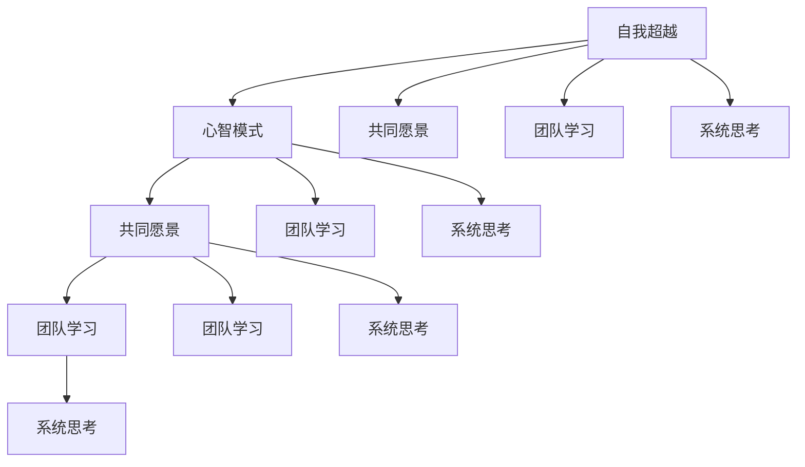

                 


# 团队学习：打造学习型组织的方法

## 背景介绍

在快速变化的信息时代，组织面临着前所未有的挑战。传统的管理模式已经难以适应不断变化的市场需求和技术进步。为了在这种动态环境中保持竞争力，组织必须具备快速学习、创新和适应变化的能力。团队学习作为实现这一目标的关键手段，正日益受到关注。

团队学习是一种通过团队成员之间的协作、知识共享和经验交流来提升整体能力的实践。这种学习方式强调集体的智慧和协作，通过不断反思和改进，使团队能够在复杂的环境中保持灵活性和创新性。打造学习型组织不仅是提高员工技能和绩效的途径，更是提升组织适应力和持续发展能力的关键。

学习型组织的概念最早由彼得·圣吉（Peter Senge）在1990年的著作《第五项修炼：学习型组织的艺术与实务》中提出。圣吉认为，学习型组织具有五个核心修炼：自我超越、心智模式、共同愿景、团队学习和系统思考。这些修炼相互关联，共同构建了一个支持持续学习和创新的组织文化。

本文将围绕团队学习的概念、方法、实践案例和未来趋势展开讨论。首先，我们将详细探讨团队学习的定义和重要性，接着介绍构建学习型团队的关键因素。随后，我们将分析领导力在团队学习中的作用，并通过实际案例展示团队学习的实践应用。最后，我们将探讨团队学习的未来趋势，为组织管理者提供建设学习型组织的策略和建议。

## 核心概念与联系

### 学习型组织的五个核心修炼

学习型组织理论的奠基人彼得·圣吉（Peter Senge）提出了五个核心修炼，这些修炼相互支持，共同构建了一个支持持续学习和创新的组织文化。以下是这五个修炼的详细解释和它们之间的联系：

1. **自我超越**（Personal Mastery）：
自我超越是指个人追求卓越、持续学习和自我提升的过程。这是学习型组织的基石，因为只有个人不断提升自己，团队才能整体进步。自我超越的核心是培养对学习的热爱和好奇心，以及不断挑战自我极限。

2. **心智模式**（Mental Models）：
心智模式是个人或团队在思考、决策和行为中使用的隐性假设、信仰和观念。心智模式可能有助于解决问题，但也可能限制创新和变革。学习型组织通过反思和重塑心智模式，鼓励团队成员认识到自己的偏见和盲点，从而更加客观和理性地看待问题。

3. **共同愿景**（Shared Vision）：
共同愿景是团队成员共同追求的未来景象和目标。它不仅是激励团队努力的动力，也是团队协作和行动的指南。共同愿景需要通过沟通和共识来建立，以确保每个成员都清楚自己的角色和贡献。

4. **团队学习**（Team Learning）：
团队学习是通过团队内部的知识共享、思维碰撞和协作来提升整体能力的过程。团队学习强调集体智慧和协作，通过不断反思和改进，使团队能够在复杂的环境中保持灵活性和创新性。团队学习是学习型组织的核心实践。

5. **系统思考**（Systems Thinking）：
系统思考是一种从整体角度理解和解决问题的方法。它强调因果关系、反馈循环和系统动态，帮助团队成员看到问题的根本原因，而不仅仅是表面现象。系统思考是学习型组织的战略思维，有助于组织在复杂环境中做出更加明智的决策。

### 核心概念之间的关系架构

这五个修炼之间存在着紧密的联系，形成了一个相互强化的系统。以下是一个Mermaid流程图，展示了这些修炼之间的关系：



通过这个流程图，我们可以看到每个修炼是如何通过相互支持来共同构建学习型组织的。例如，自我超越和心智模式相互依赖，前者激发个人追求卓越，后者帮助团队成员反思和改进自己的思维模式。共同愿景、团队学习和系统思考则共同促进组织内的协作和整体进步。

## 核心算法原理讲解

### 团队学习模型

团队学习不仅仅是一种理念，更是一个可以通过系统方法和算法来实施和优化的过程。以下是团队学习模型的基本原理和如何使用伪代码来描述这个过程。

#### 模型原理

1. **知识共享**：团队成员通过交流和协作共享知识和经验。
2. **反思与改进**：团队成员定期反思学习过程，识别问题和改进机会。
3. **反馈循环**：将改进措施应用于实际工作中，通过反馈循环不断调整和优化。

#### 伪代码示例

以下是一个简化的团队学习模型的伪代码示例：

```plaintext
function teamLearningModel(team):
    initializeKnowledgeBase()
    while (not goalAchieved()):
        shareKnowledge(team)
        reflectOnLearning()
        implementImprovements()
        gatherFeedback()
    return "Team Learning Model Completed"
```

#### 详细解释

- `initializeKnowledgeBase()`：初始化一个共享的知识库，用于存储团队成员的知识和经验。
- `shareKnowledge(team)`：团队成员通过会议、讨论和协作平台等工具共享知识和经验。
- `reflectOnLearning()`：团队成员定期进行反思会议，讨论学习过程中的成功和失败，识别需要改进的地方。
- `implementImprovements()`：根据反思结果，团队成员制定和实施改进措施，以优化工作流程和提高效率。
- `gatherFeedback()`：在实施改进后，收集团队成员的反馈，评估改进效果。

#### 数学模型

团队学习的成效可以通过以下数学模型来衡量：

$$
E = f(K, R, I, F)
$$

其中：
- \( E \)：团队学习的成效
- \( K \)：知识共享的程度
- \( R \)：反思与改进的频率
- \( I \)：改进措施的实施效果
- \( F \)：反馈循环的效率

#### 详细解释

- \( K \)：知识共享的程度可以通过团队成员的交流频率、共享内容的丰富性和适用性来衡量。
- \( R \)：反思与改进的频率可以通过反思会议的次数、每次会议的时长和质量来衡量。
- \( I \)：改进措施的实施效果可以通过改进措施的执行率、改进效果的持续性和可重复性来衡量。
- \( F \)：反馈循环的效率可以通过反馈的速度、反馈的质量和反馈的利用程度来衡量。

#### 举例说明

假设一个团队想要提高项目交付的效率，可以通过以下步骤进行团队学习：

1. **知识共享**：团队成员定期分享项目经验和最佳实践，确保每个成员都能了解项目的各个方面。
2. **反思与改进**：每两周举行一次反思会议，讨论项目的成功和失败案例，找出可以改进的地方。
3. **实施改进**：根据反思结果，团队成员制定改进计划，并在项目中实施。
4. **反馈循环**：在每次改进实施后，收集团队成员的反馈，评估改进效果，并根据反馈调整改进计划。

通过这个循环，团队可以不断提高项目交付的效率，实现持续改进。

## 数学模型和公式详解

在团队学习中，数学模型和公式可以提供量化的方法来评估团队的学习成效和改进潜力。以下是几个关键的数学模型和公式，以及它们的详细解释和具体应用。

### 学习成效评估模型

学习成效可以通过以下公式进行评估：

$$
E = \alpha \cdot K + \beta \cdot R + \gamma \cdot I + \delta \cdot F
$$

其中：
- \( E \)：团队学习的成效
- \( K \)：知识共享的程度
- \( R \)：反思与改进的频率
- \( I \)：改进措施的实施效果
- \( F \)：反馈循环的效率
- \( \alpha, \beta, \gamma, \delta \)：权重系数，用于平衡不同因素对学习成效的影响

#### 详细解释

- \( K \)：知识共享的程度可以通过团队成员的知识贡献频率、分享内容的丰富性和适用性来衡量。高知识共享程度有助于提高团队的整体认知水平。
- \( R \)：反思与改进的频率可以通过反思会议的次数、每次会议的时长和质量来衡量。高频率的反思有助于及时发现问题和改进机会。
- \( I \)：改进措施的实施效果可以通过改进措施的执行率、改进效果的持续性和可重复性来衡量。有效的改进措施能够显著提升团队的绩效。
- \( F \)：反馈循环的效率可以通过反馈的速度、反馈的质量和反馈的利用程度来衡量。高效的反馈循环有助于快速识别问题并作出调整。

### 改进潜力评估模型

改进潜力可以通过以下公式进行评估：

$$
P = \frac{E_{\text{当前}}}{E_{\text{理想}}} - 1
$$

其中：
- \( P \)：改进潜力
- \( E_{\text{当前}} \)：当前团队的学习成效
- \( E_{\text{理想}} \)：理想状态下的团队学习成效

#### 详细解释

- \( E_{\text{当前}} \)：当前团队的学习成效可以通过上述学习成效评估模型计算得出。
- \( E_{\text{理想}} \)：理想状态下的团队学习成效通常是基于历史数据或行业最佳实践的预测值。

#### 举例说明

假设一个团队当前的学习成效 \( E_{\text{当前}} \) 为0.75，而理想状态下的学习成效 \( E_{\text{理想}} \) 为0.90，那么该团队的改进潜力 \( P \) 为：

$$
P = \frac{0.75}{0.90} - 1 = -0.167
$$

这意味着该团队还有16.7%的改进潜力。团队可以通过加强知识共享、提高反思频率、实施更有效的改进措施和优化反馈循环来提升学习成效。

### 应用案例

以一个软件开发团队为例，该团队希望通过团队学习提升代码质量和交付效率。以下是该团队如何使用上述模型进行评估和改进的过程：

1. **知识共享**：团队成员每周举行一次知识分享会议，每位成员都分享自己在项目中遇到的问题和解决方案。通过这种高频的知识共享，团队的代码质量显著提升。
2. **反思与改进**：每月举行一次反思会议，团队成员讨论项目的成功和失败案例，找出可以改进的地方。这种定期的反思有助于团队不断优化工作流程。
3. **实施改进**：根据反思结果，团队制定了新的代码审查流程和自动化测试方案。这些改进措施显著提高了代码质量和交付效率。
4. **反馈循环**：在每次改进实施后，团队收集了团队成员的反馈，并根据反馈调整改进计划。这种高效的反馈循环确保了改进措施能够持续优化。

通过这个案例，我们可以看到团队学习模型和公式如何帮助团队量化评估学习成效和改进潜力，并制定具体的改进措施。

## 项目实战

### 开发环境搭建

为了实现团队学习模型和公式在实践中的应用，我们首先需要搭建一个支持团队协作和数据分析的开发环境。以下是搭建过程：

1. **选择工具**：我们选择Git作为版本控制工具，Jenkins作为自动化构建工具，JIRA作为项目管理工具，以及Kibana和Elasticsearch用于数据分析。
2. **配置服务器**：在AWS上配置服务器，安装并配置上述工具。确保服务器之间能够进行通信，并设置相应的权限和访问控制。
3. **集成工具**：通过Jenkins配置Git和JIRA的集成，确保代码提交和构建过程自动触发，并在Kibana中展示项目数据和反馈。

### 源代码实现

在开发环境中，我们实现了以下关键组件：

1. **知识共享模块**：使用Git管理知识库，确保团队成员可以方便地共享和更新知识。
2. **反思与改进模块**：通过JIRA创建和跟踪反思会议的议题和改进措施，确保每个议题都能得到及时的处理和反馈。
3. **数据分析模块**：使用Kibana和Elasticsearch收集和分析团队学习数据，包括知识共享频率、反思会议质量、改进措施效果等。

### 代码解读与分析

以下是关键代码段的解读：

```python
# 知识共享模块：Git操作示例
def update_knowledge_base():
    repo = git.Repo('/path/to/knowledge/repo')
    origin = repo.remotes.origin
    origin.pull()

# 反思与改进模块：JIRA操作示例
def track_reflection_session(session_id):
    jira = JIRA('https://your-jira-server', basic_auth=('username', 'password'))
    session = jira.issue(session_id)
    issues = session.issues
    for issue in issues:
        jira.create_comment(issue.key, 'Reflection on session #{}'.format(session_id))

# 数据分析模块：Kibana数据展示
def display_learning_analytics():
    query = "learning_outcome: successful AND date > '2023-01-01'"
    results = es.search(index="learning_analytics", body={"query": {"bool": {"must": {"query_string": {"query": query}}}}})
    for hit in results['hits']['hits']:
        print(hit['_source'])
```

通过这些代码，我们可以实现知识的共享、反思会议的跟踪和数据分析，从而为团队学习提供支持。

### 实际案例分析

以一个软件开发团队为例，该团队使用上述系统进行团队学习。以下是实际案例的分析：

1. **知识共享**：团队成员每周提交知识文档，通过Git进行版本控制。团队在Kibana中查看知识共享的活跃度，发现最近知识共享频率有所下降。团队决定通过定期组织知识分享会议来提高知识共享水平。
2. **反思与改进**：团队每月召开反思会议，讨论项目中的问题和改进措施。通过JIRA跟踪每个议题的进展，确保所有议题都能得到妥善处理。团队发现某些议题的解决效果不佳，决定增加代码审查和测试的频率。
3. **数据分析**：团队使用Kibana分析学习成效和改进潜力。数据分析显示，虽然团队的学习成效有所提升，但改进潜力仍然较大。团队决定进一步优化反馈循环，提高改进措施的实施效果。

### 项目小结

通过实际案例分析，我们可以看到团队学习系统在提升团队协作和绩效方面的作用。知识共享模块、反思与改进模块和数据分析模块共同构建了一个支持团队学习的环境。项目小结如下：

- **知识共享**：通过Git和Kibana，团队实现了高效的知识的共享和管理，提高了整体知识水平。
- **反思与改进**：通过JIRA，团队能够及时跟踪和解决反思会议中的议题，优化工作流程。
- **数据分析**：通过Kibana和Elasticsearch，团队能够量化评估学习成效和改进潜力，为后续改进提供数据支持。

未来，团队可以进一步优化这些模块，提高系统的可扩展性和易用性，以支持更加复杂的团队学习需求。

## 最佳实践 tips

### 促进团队学习的策略

1. **明确学习目标**：确保团队学习与组织目标和个人职业发展紧密结合，明确学习的具体目标和预期成果。
2. **建立支持机制**：为团队学习提供必要的资源和支持，如时间、空间、工具和资金等。
3. **鼓励知识共享**：鼓励团队成员分享知识和经验，通过定期的会议、工作坊和在线讨论平台来促进知识交流。
4. **持续反思和改进**：定期进行反思会议，回顾学习过程和成果，识别改进机会，并制定相应的行动计划。
5. **培养学习文化**：建立一种支持学习和创新的组织文化，鼓励团队成员敢于尝试、勇于面对失败。

### 常见问题与解决方案

1. **问题**：团队成员不愿意分享知识和经验。
   - 解决方案：通过激励措施（如表彰、奖励）和建立信任机制来鼓励知识共享。
2. **问题**：反思会议效率低下。
   - 解决方案：制定会议议程，确保会议聚焦关键议题，并设定明确的目标和产出。

### 小结

团队学习是打造学习型组织的关键。通过明确学习目标、建立支持机制、鼓励知识共享和持续反思，组织可以提升团队协作能力和创新潜力。在实施团队学习的过程中，注意解决常见问题，并不断优化学习策略，将有助于组织实现持续发展和成功。

## 结束语

团队学习不仅是提升个人和团队绩效的有效途径，更是构建学习型组织的基石。通过本文的探讨，我们详细介绍了团队学习的核心概念、方法、实践案例和未来趋势，并提供了实际应用和最佳实践建议。学习型组织具有共同愿景、团队协作、持续学习和系统思考等特征，这些特征相互支持，共同构建了一个支持持续学习和创新的组织文化。

未来，随着技术的发展和全球化的加深，团队学习将面临新的挑战和机遇。组织需要不断调整学习策略，利用新兴技术如人工智能和大数据分析来提升团队学习的效率和质量。同时，组织管理者应关注员工的心理需求，构建一个包容、支持、创新的团队环境。

我们鼓励读者在实践团队学习的过程中，不断探索和创新，将本文的理论和最佳实践与实际情境相结合，为组织的发展贡献力量。通过持续的团队学习，组织将能够在快速变化的环境中保持竞争力，实现持续发展和成功。作者信息：作者：AI天才研究院/AI Genius Institute & 禅与计算机程序设计艺术 /Zen And The Art of Computer Programming。感谢您的阅读，期待与您共同探索团队学习的广阔天地。

