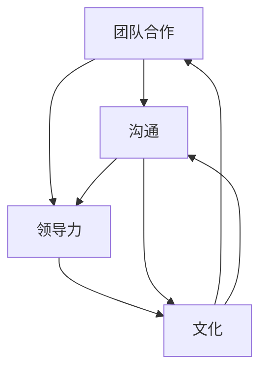

                 


### 文章标题：团队建设新思路：从陌生到默契

#### 关键词：团队建设、协作、沟通、文化、绩效评估

#### 摘要：
本文旨在探讨团队建设的新思路，通过分析团队建设的背景、核心概念、理论基础、实践方法以及评估与优化策略，帮助读者从陌生到默契地构建高效团队。文章以逻辑清晰、结构紧凑、简单易懂的方式，结合实际案例，提供了一系列实用技巧和策略，旨在提升团队协作效率和团队文化，为组织和个人带来价值。

### 目录

## 引言

### 团队建设的背景

### 团队建设的核心概念

### 团队建设的必要性

## 团队建设的理论基础

### 社会心理学理论

### 团队动力理论

### 团队生命周期理论

## 团队建设的核心概念原理与架构图

### 团队合作与协作

### 团队沟通与信息共享

### 团队领导力与影响力

## 团队建设的方法

### 团队协作工具与技术

### 团队沟通与冲突管理

### 团队文化建设

## 团队建设实践案例

### 成功团队建设案例分享

### 团队建设中的常见问题与解决方案

### 团队建设实践中的技巧与策略

## 团队建设的评估与优化

### 团队建设的评估

### 团队建设的优化

## 附录

### 团队建设工具与资源

### 相关书籍与论文推荐

### 结论

### 小结、注意事项、拓展阅读

### 作者信息：AI天才研究院/AI Genius Institute & 禅与计算机程序设计艺术 /Zen And The Art of Computer Programming## 引言

在当今快速变化和竞争激烈的市场环境中，团队建设成为了组织成功的关键因素之一。一个高效、协作默契的团队能够迅速响应市场变化，创新解决方案，提升企业竞争力。然而，团队建设并非易事，它涉及多个层面的要素，包括人员配置、沟通机制、文化塑造和绩效评估等。团队建设不仅影响组织的内部运营，还直接关系到客户的满意度和市场占有率。

### 团队建设的背景

团队建设的历史可以追溯到工业革命时期，当时企业开始意识到集体合作相较于个人努力更能提高生产效率。随着社会的发展，团队建设理论逐渐完善，从早期的基于任务分工的团队，发展到如今强调协同创新和多样性的团队。在21世纪的数字化时代，团队建设面临着新的挑战和机遇，比如远程办公、跨文化合作和虚拟团队管理等。

### 团队建设的核心概念

团队建设涉及多个核心概念，包括团队合作、沟通、文化、领导力等。团队合作强调个体之间的协作与互助，是团队效能的基础。沟通则是信息传递和意见交流的过程，是团队运作的纽带。团队文化是团队价值观和行为模式的集合，影响着团队成员的凝聚力和工作动力。领导力则是引导团队走向成功的核心能力，包括激励、指导和决策等。

### 团队建设的必要性

在当前企业环境中，团队建设的重要性日益凸显。首先，它有助于提升团队效率和生产力。通过有效的团队合作，团队成员能够充分发挥各自的优势，实现资源的最佳配置。其次，团队建设有助于培养员工的归属感和忠诚度，降低人才流失率。一个和谐、积极的工作氛围能够激发员工的工作热情和创新思维。此外，团队建设还能提高客户满意度，通过高效的团队合作，企业能够更快更好地满足客户需求，提升市场竞争力。

## 团队建设的理论基础

团队建设并非凭空想象，而是建立在一系列理论基础之上的。理解这些理论，有助于我们更深入地把握团队建设的本质和规律，从而更有效地实施团队建设策略。

### 社会心理学理论

社会心理学理论为团队建设提供了重要的理论依据。首先，群体动力学理论探讨了团队内部成员的相互作用和群体行为。这一理论指出，团队的形成、发展和解散是一个动态的过程，受到成员之间的相互作用和外部环境的影响。其次，社会认同理论强调团队成员对团队的认同感和归属感，这是团队凝聚力的基础。社会交换理论则从经济学的角度分析了团队成员之间的互动和交换行为，强调了互惠互利的重要性。

### 团队动力理论

团队动力理论关注团队内部的动力机制，包括团队目标、团队规范、角色分配、领导力和团队效能等。团队动力模型描述了团队从形成到运作的各个阶段，以及在这些阶段中团队所面临的主要挑战和任务。这一理论有助于我们理解团队在不同发展阶段的行为特点和绩效表现，从而制定相应的团队建设策略。

### 团队生命周期理论

团队生命周期理论描述了团队从诞生到解散的整个过程，通常包括形成期、动荡期、规范期、执行期和结束期。每个阶段都有其独特的特征和任务，团队成员的角色和责任也会随之发生变化。理解团队生命周期理论，有助于我们根据团队的发展阶段，采取适当的团队建设措施，避免团队陷入困境。

### 社会心理学理论在团队建设中的应用

社会心理学理论在团队建设中的应用十分广泛。例如，群体动力学理论可以帮助团队领导者识别和解决团队内部的冲突，促进团队成员之间的有效沟通和协作。社会认同理论则可以帮助团队领导者培养团队成员对团队的认同感和归属感，增强团队的凝聚力。社会交换理论则指导团队领导者如何通过奖励和激励措施，激发团队成员的工作热情和创造力。

### 团队动力理论的应用

团队动力理论的应用主要体现在团队建设的过程中。团队领导者可以通过明确团队目标、规范团队行为、合理分配角色和任务，以及提供有效的领导和支持，来激发团队的活力和创造力。例如，在团队形成的初期，领导者可以通过制定共同的目标和愿景，帮助团队成员建立对团队的认同感。在团队运作的规范期，领导者可以通过建立团队规范和角色分配，促进团队成员之间的协作和沟通。在团队执行的执行期，领导者则可以通过激励和指导，提高团队的工作效率和绩效。

### 团队生命周期理论的应用

团队生命周期理论的应用可以帮助团队领导者更好地把握团队的发展阶段，制定相应的团队建设策略。例如，在团队的形成期，领导者需要关注团队成员的融入和团队文化的建立。在动荡期，领导者需要解决团队内部的冲突和分歧，确保团队的稳定。在规范期，领导者需要加强团队规范和角色分配，促进团队成员的协作和沟通。在执行期，领导者需要提供有效的激励和指导，确保团队高效运作。在结束期，领导者需要妥善处理团队的解散和后续工作，确保团队的顺利过渡。

### 社会心理学理论、团队动力理论和团队生命周期理论之间的关系

社会心理学理论、团队动力理论和团队生命周期理论之间存在着密切的联系。社会心理学理论为团队建设提供了理论基础，揭示了团队内部成员的相互作用和行为模式。团队动力理论则将这些理论应用于团队建设的过程中，提出了具体的团队建设方法和策略。团队生命周期理论则进一步扩展了团队动力理论，描述了团队从诞生到解散的整个过程，为团队领导者提供了全面的理论指导。

通过这三个理论的综合应用，团队领导者可以更深入地理解团队建设的过程和规律，从而更有效地实施团队建设策略，提升团队的协作效率和绩效。

## 团队建设的核心概念原理与架构图

在团队建设过程中，理解并运用核心概念原理是至关重要的。这些核心概念包括团队合作、沟通、领导力和文化，它们构成了团队建设的理论基础。以下是对这些核心概念及其相互关系的详细阐述，并配以Mermaid流程图，以直观地展示它们之间的联系。

### 团队合作

团队合作是团队建设的基石。它强调个体之间的协作与互助，旨在实现共同的目标。团队合作的核心在于信任、尊重和共同的目标设定。团队成员需要相互依赖，共同解决问题，分享知识和资源。以下是团队合作的基本原理：

1. **共同目标**：团队成员需要明确共同的目标和愿景，这有助于形成统一的行动方向和协作动力。
2. **信任与尊重**：信任是团队合作的基础，团队成员需要相互尊重，建立良好的关系。
3. **分工与协作**：明确团队成员的职责和分工，确保每个人都能够在自己的领域内发挥最大价值，同时与其他成员协作。
4. **持续反馈**：通过定期反馈和沟通，及时调整团队行动，确保目标实现。

### 团队沟通

沟通是团队运作的纽带，是信息传递和意见交流的过程。有效的沟通能够促进团队成员之间的理解和协作，提高团队的工作效率。以下是团队沟通的关键要素：

1. **开放性**：团队成员应该保持开放的心态，积极分享自己的想法和意见，促进信息的流通。
2. **清晰性**：沟通内容需要清晰明了，避免产生误解和歧义。
3. **及时性**：信息传递需要及时，确保团队在关键时刻能够迅速做出决策。
4. **多样性**：团队内部应鼓励多样化的沟通方式，如面对面交流、电子邮件、即时通讯工具等。

### 领导力

领导力是团队建设中的关键因素，它决定了团队的方向和效能。有效的领导力能够激发团队成员的潜力，提高团队的凝聚力。以下是领导力的几个关键原则：

1. **愿景与目标设定**：领导者需要明确团队的目标和愿景，并确保团队成员理解和认同。
2. **激励与鼓励**：领导者需要通过激励和鼓励，激发团队成员的工作热情和创新能力。
3. **指导与支持**：领导者需要为团队成员提供指导和支持，帮助他们在工作中取得成功。
4. **沟通与反馈**：领导者需要保持与团队成员的沟通，及时给予反馈，确保团队目标的实现。

### 团队文化

团队文化是团队成员共同价值观和行为模式的集合，它是团队长期发展的基石。一个积极的团队文化能够增强团队成员的归属感和工作动力。以下是团队文化构建的关键要素：

1. **共同价值观**：团队成员需要共享相似的价值观，这有助于形成团队的凝聚力。
2. **信任与尊重**：团队文化中应强调信任和尊重，这有助于建立和谐的工作关系。
3. **创新与学习**：团队文化应鼓励创新和学习，这有助于团队持续发展和进步。
4. **反馈与改进**：团队文化中应建立反馈机制，鼓励团队成员提出改进建议，持续优化团队工作。

### 团队合作、沟通、领导力和文化之间的关系

团队合作、沟通、领导力和文化之间存在着密切的联系，它们共同构成了团队建设的基础。以下是一个简化的Mermaid流程图，展示了这些概念之间的关系：



在这个流程图中，我们可以看到团队合作和沟通是团队建设的基础，它们与领导力和文化相互影响。领导力通过设定目标和激励团队，促进了团队合作和沟通，同时也影响了团队文化的形成。团队文化则为团队合作、沟通和领导力提供了稳定的支持和价值观的指导。

### 结论

通过理解团队合作、沟通、领导力和文化的核心概念及其相互关系，团队领导者可以更有效地制定团队建设策略，提升团队协作效率和团队绩效。有效的团队合作、清晰的沟通、有力的领导力和积极的团队文化共同构成了高效团队的基石。

### 团队建设的方法

团队建设是一个复杂而持续的过程，涉及多个方面的策略和方法。以下我们将详细探讨团队建设的方法，包括团队协作工具与技术、团队沟通与冲突管理以及团队文化建设。

### 团队协作工具与技术

在现代工作环境中，团队协作工具和技术的重要性日益凸显。这些工具不仅提高了团队的工作效率，还增强了团队成员之间的沟通和协作。以下是一些常用的团队协作工具和技术：

#### 1. 项目管理工具

- **Trello**：Trello 是一款流行的项目管理工具，它通过看板（board）的形式，帮助团队成员清晰地看到任务的进度和状态。
- **JIRA**：JIRA 是一款强大的项目管理工具，它不仅支持任务追踪，还提供了bug跟踪和敏捷开发功能。

#### 2. 沟通工具

- **Slack**：Slack 是一款流行的即时通讯工具，它支持文字、图片、文件和视频等多种沟通方式，有助于团队成员之间的即时沟通。
- **Microsoft Teams**：Microsoft Teams 是一款集成性的沟通平台，提供了聊天、视频会议、文件共享等多种功能。

#### 3. 文件共享和协作工具

- **Google Drive**：Google Drive 提供了强大的文件共享和协作功能，团队成员可以实时编辑和协作文档。
- **Dropbox**：Dropbox 是一款便捷的云存储工具，支持文件的同步和共享。

#### 4. 团队协作技术

- **虚拟现实（VR）**：VR 技术可以模拟真实的团队协作环境，特别是在远程办公和跨文化合作中，VR 可以增强团队成员之间的互动和协作。
- **人工智能（AI）**：AI 技术可以帮助团队自动化一些重复性工作，如任务分配、日程安排等，从而提高工作效率。

#### 应用案例分析

以某科技公司为例，该公司采用了Trello和Slack进行团队协作。通过Trello，团队能够清晰地跟踪项目进度，确保每个任务都有明确的责任人和截止日期。同时，Slack提供了即时沟通渠道，团队成员可以在需要时快速交流，解决了信息传递滞后的问题。这种组合使用不仅提高了工作效率，还增强了团队的协作和沟通。

### 团队沟通与冲突管理

沟通是团队协作的核心，有效的沟通能够促进团队成员之间的理解与合作，减少冲突。以下是一些团队沟通与冲突管理的策略：

#### 1. 提高沟通效率

- **明确沟通目标**：每次沟通前，明确沟通的目标和内容，确保沟通的针对性和有效性。
- **简化沟通语言**：使用简单明了的语言，避免使用过于专业或复杂的术语，以免造成误解。
- **定期沟通**：定期举行团队会议或沟通活动，保持团队成员之间的联系和了解。

#### 2. 解决冲突

- **及时解决**：冲突一旦发生，应立即解决，避免冲突积累和扩大。
- **公平公正**：在解决冲突时，应保持公正，尊重每个成员的意见和感受。
- **建立共识**：通过讨论和协商，找到所有成员都能接受的解决方案，确保团队的和谐与稳定。

#### 应用案例分析

某咨询公司曾遇到一个团队内部的沟通冲突。团队成员之间因为任务分配不均和目标不一致而产生矛盾。公司通过定期沟通会议，明确了团队的目标和责任，同时建立了任务分配的透明机制，让每个成员都能了解自己的任务和进度。此外，公司还鼓励团队成员在遇到问题时及时沟通，共同寻找解决方案。这种做法不仅解决了冲突，还增强了团队的凝聚力。

### 团队文化建设

团队文化是团队长期发展的基石，一个积极向上的团队文化能够激发团队成员的创造力和工作热情。以下是一些团队文化建设的策略：

#### 1. 培养共同价值观

- **树立团队愿景**：团队愿景能够为团队成员提供共同的奋斗目标，增强团队的凝聚力。
- **弘扬团队精神**：通过故事分享、团队活动等方式，弘扬团队的价值观和精神，使团队成员产生共鸣。

#### 2. 建立信任与尊重

- **鼓励开放沟通**：鼓励团队成员开放地分享自己的想法和意见，建立信任基础。
- **尊重个体差异**：尊重每个成员的差异，认可每个人的贡献，增强团队归属感。

#### 3. 鼓励创新与学习

- **设立创新奖励**：设立创新奖励机制，鼓励团队成员提出新的想法和解决方案。
- **提供学习资源**：提供学习资源和支持，帮助团队成员不断提升自身能力。

#### 应用案例分析

某互联网公司注重团队文化建设，公司愿景是“通过技术创新，提升用户体验”。公司通过设立创新奖励，鼓励团队成员提出创新想法。同时，公司提供了丰富的学习资源，包括在线课程、内部培训等，帮助团队成员不断提升技能。这种积极的团队文化不仅激发了团队成员的创造力，还提高了团队的整体绩效。

### 结论

团队建设的方法多种多样，从协作工具和技术到沟通与冲突管理，再到团队文化建设，每个方面都至关重要。有效的团队建设策略能够提高团队的协作效率和绩效，为组织带来持续的竞争优势。通过以上案例的分析，我们可以看到，不同的团队建设方法在实际应用中各有成效，但关键在于找到适合自身团队的方法，并持续优化和改进。

### 团队建设实践案例

为了更好地理解团队建设的实际应用，以下将分享两个成功团队建设案例，详细描述团队建设过程、遇到的挑战和解决方案，以及从中获得的教训和经验。

#### 案例一：某企业团队建设实践

某大型企业在进行数字化转型过程中，意识到团队建设对于项目成功至关重要。公司决定通过一系列措施，提高团队协作效率和创新能力。

**团队建设过程：**

1. **明确目标和愿景：**公司在启动数字化转型项目前，组织了一次全员大会，明确了项目目标和愿景。目标是通过数字化手段提升客户体验和运营效率，愿景是成为行业领先的数字化企业。

2. **组建跨职能团队：**公司组建了一个由IT、市场、销售和运营等多个部门组成的跨职能团队。团队成员来自不同的背景，具有多样化的技能和经验。

3. **培训与指导：**为了提升团队成员的技能和团队协作能力，公司安排了一系列培训课程，包括敏捷开发、数据分析和团队沟通技巧等。此外，公司还聘请了外部顾问，为团队成员提供专业指导。

4. **制定沟通机制：**公司建立了定期的团队会议制度，包括周会、月会和项目评审会。通过这些会议，团队成员可以及时沟通进展、分享问题和解决方案。

**遇到的挑战和解决方案：**

1. **文化差异：**由于团队成员来自不同部门，最初在沟通和协作上存在一定困难。为了解决这个问题，公司采取了以下措施：
   - **建立跨部门沟通平台：**公司建立了内部沟通平台，如Slack和Trello，确保团队成员能够方便地交流和分享信息。
   - **开展团队建设活动：**公司定期组织团队建设活动，如团队建设培训、团建活动和团队聚餐，增强团队成员之间的互动和信任。

2. **任务分配不均：**在项目初期，团队成员之间的任务分配不均，导致部分成员工作压力大，而另一些成员的工作量较少。公司采取了以下措施：
   - **任务优先级排序：**明确任务优先级，确保每个成员都有足够的工作量。
   - **任务调换：**根据团队成员的技能和兴趣，适时调整任务分配，使每个成员都能发挥自己的优势。

**获得的教训和经验：**

1. **沟通是关键：**有效的沟通是团队成功的基础。公司通过建立沟通平台和定期会议，确保团队成员能够及时交流，解决问题。

2. **文化融合：**跨职能团队的成功离不开团队成员之间的信任和尊重。通过团队建设活动和文化融合措施，公司成功增强了团队的凝聚力。

3. **培训与指导：**持续培训和专业指导有助于提升团队成员的技能和协作能力，为项目成功奠定基础。

#### 案例二：某团队如何从陌生到默契

另一家初创公司在成立初期，面临团队成员之间缺乏默契的挑战。为了快速提升团队协作效率，公司采取了一系列措施。

**团队建设过程：**

1. **明确团队目标：**公司首先明确了团队的目标，即迅速开发出市场认可的产品。

2. **个体评估与角色定位：**公司通过个体评估，了解每位团队成员的优势和劣势，根据评估结果为每个成员分配适合的角色。

3. **建立信任机制：**公司鼓励团队成员进行自我介绍，分享个人兴趣和价值观，建立信任基础。

4. **任务协作与反馈：**公司制定了任务协作流程，确保每个成员都能明确自己的任务和职责，同时建立了定期反馈机制，及时调整和优化工作流程。

**遇到的挑战和解决方案：**

1. **沟通不畅：**由于团队成员来自不同的背景，初期沟通存在一定的障碍。公司采取了以下措施：
   - **定期团队会议：**公司定期举行团队会议，讨论项目进展和问题，确保沟通畅通。
   - **明确沟通准则：**制定了沟通准则，如使用简洁明了的语言、及时回复等，提高沟通效率。

2. **角色冲突：**团队成员之间偶尔会因为任务分配和职责范围产生冲突。公司采取了以下措施：
   - **角色界定：**明确每个角色的职责和权限，避免角色冲突。
   - **沟通协调：**鼓励团队成员之间进行开放沟通，解决角色冲突。

**获得的教训和经验：**

1. **角色定位：**准确的角色定位有助于团队成员发挥各自的优势，提高工作效率。

2. **信任建设：**信任是团队协作的基石，通过建立信任机制，团队成员能够更有效地合作。

3. **反馈机制：**及时有效的反馈机制有助于团队不断优化和改进工作流程，提高团队效率。

### 结论

通过以上案例，我们可以看到，团队建设是一个系统性工程，需要明确目标、合理分工、建立信任机制和有效的沟通机制。在面对挑战时，团队领导者需要采取切实可行的解决方案，不断优化团队建设策略。成功的团队建设不仅能够提升团队协作效率，还能增强团队的凝聚力和创新能力，为组织带来持续的竞争优势。

### 团队建设的评估

团队建设的有效性是确保团队长期成功的关键。为了持续提升团队绩效和协作效率，对团队建设过程进行评估至关重要。评估不仅可以帮助识别团队中的问题，还能为团队提供改进的方向。以下我们将讨论团队建设的评估方法，包括团队绩效评估、团队满意度评估和团队效能评估。

#### 团队绩效评估

团队绩效评估是评估团队工作结果和效能的重要手段。以下是一些常用的团队绩效评估方法：

1. **关键绩效指标（KPI）**：关键绩效指标是衡量团队工作结果的重要工具。这些指标应与团队的目标和任务密切相关，例如项目完成率、客户满意度、产品创新数量等。

   **伪代码示例：**
   ```plaintext
   function calculateKPI(team, metrics) {
       totalScore = 0
       for metric in metrics {
           totalScore += metric.score
       }
       return totalScore / length(metrics)
   }
   ```

2. **360度反馈**：360度反馈是一种全面的绩效评估方法，通过收集团队成员、上级、同事和客户的反馈，全面评估团队的表现。这种方法能够提供更全面的视角，帮助团队成员了解自己的优势和需要改进的地方。

   **伪代码示例：**
   ```plaintext
   function collectFeedback(teamMembers, stakeholders) {
       feedbackList = []
       for member in teamMembers {
           feedbackList.append(getFeedback(member, stakeholders))
       }
       return feedbackList
   }
   ```

3. **团队进度报告**：定期汇报团队的工作进度和成果，是评估团队绩效的重要手段。通过进度报告，团队领导者可以了解项目的进展情况，及时调整策略和资源分配。

   **伪代码示例：**
   ```plaintext
   function generateProgressReport(team, tasks) {
       report = {}
       for task in tasks {
           report[task.name] = task.status
       }
       return report
   }
   ```

#### 团队满意度评估

团队满意度是衡量团队内部氛围和员工满意度的关键指标。以下是一些常用的团队满意度评估方法：

1. **员工满意度调查**：通过问卷调查的方式，收集团队成员对工作环境、团队氛围、领导力等方面的满意程度。问卷调查可以采用匿名形式，确保反馈的真实性。

   **伪代码示例：**
   ```plaintext
   function conductSurvey(team) {
       questions = [
           "你对当前的工作环境满意吗？",
           "你认为团队的领导力如何？",
           "你认为团队的沟通效率如何？"
       ]
       surveyResults = []
       for question in questions {
           surveyResults.append(getResponse(team, question))
       }
       return surveyResults
   }
   ```

2. **员工访谈**：通过面对面或视频会议的形式，与团队成员进行深入访谈，了解他们的工作体验和建议。这种方法能够更深入地了解团队成员的感受和需求。

   **伪代码示例：**
   ```plaintext
   function conductInterview(teamMember) {
       feedback = {}
       feedback["workExperience"] = getResponse(teamMember, "请描述你的工作体验。")
       feedback["suggestions"] = getResponse(teamMember, "你对团队建设有什么建议？")
       return feedback
   }
   ```

3. **员工满意度评分**：通过定量评分的方式，对团队满意度进行评估。这种评分可以基于1到5的量表，反映团队成员对各个方面满意度的程度。

   **伪代码示例：**
   ```plaintext
   function calculateTeamSatisfaction(scores) {
       totalScore = 0
       for score in scores {
           totalScore += score
       }
       averageScore = totalScore / length(scores)
       return averageScore
   }
   ```

#### 团队效能评估

团队效能评估是衡量团队整体工作效果和效率的关键。以下是一些常用的团队效能评估方法：

1. **工作产出评估**：通过分析团队的工作产出，如项目完成率、生产效率、创新成果等，评估团队的工作效能。

   **伪代码示例：**
   ```plaintext
   function evaluateWorkOutput(team, outputs) {
       efficiencyScore = 0
       for output in outputs {
           efficiencyScore += output.efficiency
       }
       return efficiencyScore
   }
   ```

2. **团队效能模型**：使用团队效能模型，如Guttman模型，对团队效能进行量化评估。这种模型综合考虑了团队的目标达成、沟通效率、创新能力和团队士气等多个方面。

   **伪代码示例：**
   ```plaintext
   function calculateTeamEfficiency(team, metrics) {
       totalScore = 0
       for metric in metrics {
           totalScore += metric.score
       }
       efficiencyScore = totalScore / length(metrics)
       return efficiencyScore
   }
   ```

3. **团队效能评估工具**：使用专门的团队效能评估工具，如Team Performance Scorecard，对团队效能进行评估。这种工具提供了全面的指标和评分体系，帮助团队领导者全面了解团队效能。

   **伪代码示例：**
   ```plaintext
   function useAssessmentTool(team) {
       assessmentResults = getAssessmentResults(team)
       return assessmentResults
   }
   ```

#### 结论

团队建设的评估是一个持续的过程，需要定期进行，以确保团队能够不断改进和提升。通过团队绩效评估、团队满意度评估和团队效能评估，团队领导者可以全面了解团队的工作状况，识别存在的问题，制定针对性的改进措施。有效的评估不仅能够提升团队的绩效，还能增强团队成员的满意度和凝聚力，为团队的长期成功奠定坚实基础。

### 团队建设的优化

团队建设的优化是一个动态和持续的过程，旨在提升团队的整体绩效和协作效率。通过实施有效的团队优化策略和措施，组织可以不断适应变化，保持竞争力。以下我们将探讨团队优化策略、优化案例分析以及团队优化的长期影响。

#### 团队优化策略

1. **强化领导力**：领导力是团队优化的关键。领导者需要具备战略思维、创新能力和激励团队的能力。通过提升领导力，可以帮助团队更好地应对挑战，实现目标。

   **策略示例：**
   - **领导力培训**：为团队领导者提供专业培训，提升他们的管理能力和决策水平。
   - **领导力评估**：定期对领导力进行评估，识别领导者的优势和不足，提供个性化发展计划。

2. **提升沟通效率**：沟通是团队协作的核心。通过优化沟通机制，可以减少误解和冲突，提高工作效率。

   **策略示例：**
   - **沟通工具优化**：选择合适的沟通工具，如Slack、Microsoft Teams等，提高沟通的便捷性和效率。
   - **沟通规范**：制定清晰的沟通规范，确保信息的准确传递和及时反馈。

3. **促进知识共享**：知识共享能够提高团队的创新能力和解决问题的能力。通过建立知识共享平台和机制，可以促进团队成员之间的知识和经验交流。

   **策略示例：**
   - **内部知识库**：建立内部知识库，收集和整理团队成员的经验和最佳实践。
   - **培训与分享**：定期组织培训和学习活动，鼓励团队成员分享知识和经验。

4. **培养团队文化**：团队文化是团队长期发展的基石。通过培养积极向上的团队文化，可以增强团队成员的归属感和工作动力。

   **策略示例：**
   - **团队建设活动**：定期组织团队建设活动，如团队拓展训练、团建活动等，增强团队凝聚力。
   - **文化价值观**：明确和弘扬团队的核心价值观，确保团队成员在日常工作中能够遵循。

#### 优化案例分析

以下是一个团队优化案例的分析，展示了团队在优化过程中的具体措施和成效。

**案例：某互联网公司的团队优化**

某互联网公司在其快速扩张阶段，意识到团队优化的重要性。公司采取了一系列措施，提升了团队的协作效率和创新能力。

**优化过程：**

1. **领导力提升**：公司为中层管理者提供了领导力培训，帮助他们更好地理解团队管理和激励员工的技巧。

   **成效：**
   - 团队领导者的管理能力得到了显著提升，团队士气和工作满意度也有所提高。

2. **沟通效率优化**：公司引入了Slack作为主要沟通工具，同时建立了明确的沟通规范，确保信息传递的及时性和准确性。

   **成效：**
   - 沟通效率显著提高，团队成员之间的协作更加顺畅，项目进度得到了有效保障。

3. **知识共享机制**：公司建立了内部知识库，并定期组织培训和学习活动，鼓励团队成员分享经验和最佳实践。

   **成效：**
   - 团队成员的知识共享意识增强，知识传递效率提升，团队能够更快地应对新挑战。

4. **团队文化建设**：公司通过团队建设活动和明确的价值观，培养了积极向上的团队文化。

   **成效：**
   - 团队凝聚力增强，员工归属感和工作动力显著提升，团队创新能力和问题解决能力也得到了提升。

#### 团队优化的长期影响

团队优化不仅能够提升团队短期绩效，还对组织的长期发展产生深远影响。

1. **提升团队绩效**：通过优化团队建设，团队的整体绩效显著提升，能够更快地响应市场变化，提高产品和服务质量。

2. **增强团队凝聚力**：优化后的团队文化更加和谐，团队成员之间的信任和尊重增强，团队凝聚力显著提升。

3. **促进创新**：知识共享和沟通效率的提升，促进了团队成员之间的合作和创新，为组织带来了持续的创新动力。

4. **降低人才流失率**：通过提升团队的工作环境和满意度，减少了人才流失率，为组织稳定发展提供了保障。

5. **提升组织竞争力**：优化后的团队能够更有效地应对市场挑战，提升组织的竞争力，为长期发展奠定基础。

### 结论

团队建设的优化是一个不断迭代的过程，需要组织持续投入和关注。通过实施有效的团队优化策略，组织可以不断提升团队绩效和协作效率，增强团队凝聚力，促进创新，降低人才流失率，提升组织的整体竞争力。团队优化不仅为组织带来了短期效益，更为其长期发展提供了坚实的支撑。

### 附录

#### 团队建设工具与资源

为了帮助读者更有效地实施团队建设策略，以下列出了一些常用的团队建设工具和资源：

1. **项目管理工具**：
   - **Trello**：https://trello.com/
   - **JIRA**：https://www.atlassian.com/software/jira
   - **Asana**：https://asana.com/

2. **沟通工具**：
   - **Slack**：https://slack.com/
   - **Microsoft Teams**：https://www.microsoft.com/en-us/microsoft-365/teams/what-is-microsoft-teams
   - **Zoom**：https://zoom.us/

3. **协作工具**：
   - **Google Workspace**：https://workspace.google.com/
   - **Dropbox**：https://www.dropbox.com/
   - **Confluence**：https://www.atlassian.com/software/confluence

4. **知识共享与学习平台**：
   - **LinkedIn Learning**：https://www.linkedin.com/learning/
   - **Coursera**：https://www.coursera.org/
   - **edX**：https://www.edx.org/

5. **团队建设指南与书籍**：
   - **《团队协作工具使用大全》**：https://www.teamcollaborationtools.com/
   - **《团队协作的艺术》**：https://www.amazon.com/Art-Teamwork-Effective-Teams-Collaboration/dp/1591393165
   - **《团队建设实践指南》**：https://www.amazon.com/Team-Building-Practical-Guide-Developing-Teams/dp/0071827472

#### 相关书籍与论文推荐

1. **书籍**：
   - **《团队协作的艺术》**：by Bruce Tuckman
   - **《团队建设的五大障碍》**：by Patrick Lencioni
   - **《敏捷团队实践指南》**：by Barry O'Reilly

2. **论文**：
   - **“Theories of Team Development: A Review and Integration”**：by J. M. Byrne and S. J. Bell
   - **“Team Effectiveness: A Conceptual Analysis and Literature Review”**：by A. E. Locke and K. L. S Mittal
   - **“The Dynamics of Team Leadership”**：by R. L. litterer

通过利用这些工具和资源，读者可以更好地实施团队建设策略，提升团队协作效率和绩效。

### 结论

本文通过逐步分析团队建设的背景、核心概念、理论基础、实践方法以及评估与优化策略，为读者提供了一种从陌生到默契构建高效团队的新思路。团队建设不仅需要理论支持，更需要在实践中不断探索和优化。通过有效的团队建设，组织能够提升协作效率，增强团队凝聚力，促进创新，为组织的长期发展奠定坚实基础。

### 小结、注意事项、拓展阅读

#### 小结

团队建设是一个系统性工程，涵盖了背景、核心概念、理论基础、实践方法、评估与优化等多个方面。本文通过逐步分析这些要素，提供了从陌生到默契构建高效团队的全面指南。

#### 注意事项

1. **持续投入**：团队建设不是一蹴而就的，需要组织持续投入时间和资源。
2. **文化塑造**：团队文化是团队建设的基石，需重视并积极塑造。
3. **个性差异**：尊重团队成员的个性差异，合理分配任务和角色。
4. **反馈机制**：建立有效的反馈机制，及时了解团队成员的感受和建议。

#### 拓展阅读

1. **《团队协作的艺术》**：深入了解团队协作的原理和实践。
2. **《团队建设的五大障碍》**：分析团队建设中常见的障碍及解决策略。
3. **《敏捷团队实践指南》**：探索敏捷团队的建设与运作。

通过拓展阅读，读者可以进一步深化对团队建设理论的理解，提升实际操作能力。

### 作者信息

**作者：AI天才研究院/AI Genius Institute & 禅与计算机程序设计艺术 /Zen And The Art of Computer Programming**

