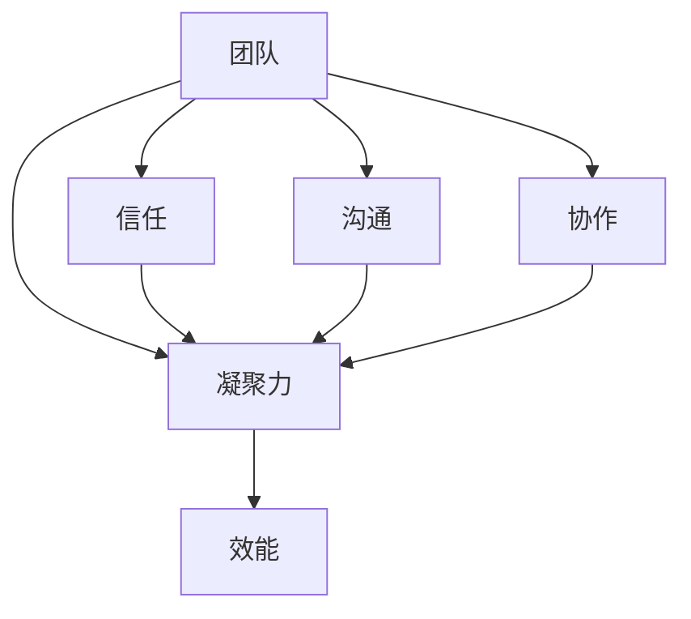
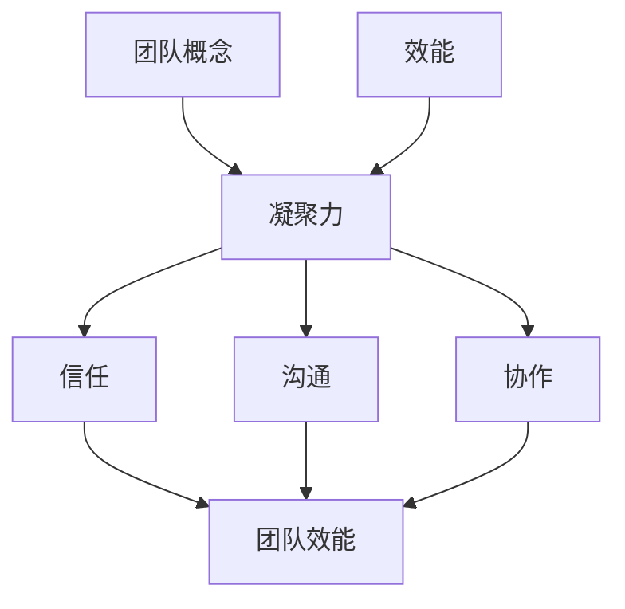
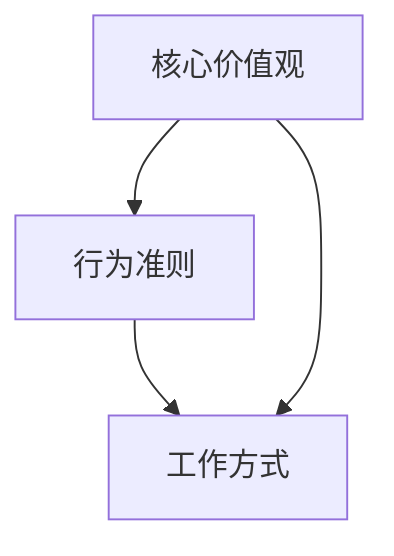

                 

## 文章标题：团队建设活动：增进凝聚力的实用方法

### 关键词：
- 团队建设
- 凝聚力
- 信任建设
- 沟通技巧
- 问题解决
- 文化建设

### 摘要：
本文旨在探讨团队建设活动对于增进团队凝聚力的实用方法。通过介绍团队建设活动的基础理论、实用活动和团队文化建设，本文提供了详细的指南和实例，帮助团队领导者有效地实施团队建设活动，提升团队的凝聚力。

## 引言

### 团队建设活动的重要性

在当今快速变化和竞争激烈的环境中，团队的作用愈发重要。一个高效的团队不仅能够提高工作效率，还能促进创新和解决问题的能力。然而，团队建设并非一蹴而就，它需要通过持续的活动和努力来培养和巩固。团队建设活动在这个过程中起到了至关重要的作用。

团队建设活动的重要性体现在以下几个方面：

1. **提升团队凝聚力**：通过团队建设活动，团队成员之间的关系更加紧密，彼此更加信任和依赖。
2. **增强沟通效率**：有效的沟通是团队成功的基石。团队建设活动有助于改善团队内的沟通模式，减少误解和冲突。
3. **促进协作精神**：团队建设活动可以增强团队成员之间的协作精神，使团队成员更加愿意为团队的目标共同努力。
4. **提升个人技能**：团队建设活动不仅有助于团队整体的发展，还能提升团队成员的个人技能和职业素养。

### 本书的目的和结构

本书的目的是为团队领导者提供一套实用的团队建设活动指南，帮助他们在实际工作中有效地提升团队的凝聚力。本书的结构如下：

1. **引言**：介绍团队建设活动的重要性、本书的目的和结构。
2. **团队建设基础理论**：阐述团队建设的核心概念、团队发展的阶段和团队效能与凝聚力的关系。
3. **实用团队建设活动**：介绍具体的团队建设活动，包括信任建设活动、沟通活动、问题解决与合作活动。
4. **团队文化建设**：探讨团队文化的定义、作用和塑造策略。
5. **团队建设活动实施与管理**：提供团队建设活动的规划、准备、实施和管理技巧。
6. **团队建设活动案例解析**：分析实际案例，提供实践经验和启示。
7. **团队建设活动工具与资源**：介绍常用工具和资源，帮助团队领导者更好地实施团队建设活动。
8. **附录**：提供附加资源，如案例库、工具列表和参考文献。

### 阅读指南

本书适合团队领导者、人力资源经理、企业管理者以及对团队建设感兴趣的专业人士阅读。读者可以通过以下步骤来充分利用本书：

1. **阅读引言**：了解团队建设活动的重要性、本书的目的和结构。
2. **学习基础理论**：掌握团队建设的核心概念和原理。
3. **实践实用活动**：根据具体场景实施团队建设活动。
4. **学习文化建设**：了解团队文化的塑造和管理。
5. **参考案例解析**：借鉴实际案例，提升团队建设实践能力。
6. **使用工具与资源**：利用提供的工具和资源，提高团队建设活动的效率。
7. **附录阅读**：扩展知识面，深入理解团队建设的各个方面。

通过本书的学习和实践，读者将能够更有效地提升团队的凝聚力，促进团队的成功。

### 团队建设基础理论

#### 核心概念与联系

团队建设涉及多个核心概念，这些概念相互关联，共同影响团队的发展和效能。以下是几个关键概念及其相互关系：

1. **团队**：团队是由两个或两个以上个体组成的正式组织，这些个体为了实现共同的目标而协同工作。
2. **凝聚力**：凝聚力是指团队成员之间的相互吸引和团结程度，它是团队效能的重要指标。
3. **信任**：信任是指团队成员对彼此能力和诚信的信心，它是团队凝聚力的基础。
4. **沟通**：沟通是团队成员之间传递信息和意见的过程，有效的沟通有助于增强团队凝聚力。
5. **协作**：协作是指团队成员在共同目标下相互配合，共同完成任务的过程。

这些概念之间的关系可以用以下Mermaid流程图表示：

#### 核心概念与联系（Mermaid流程图）

#### 团队效能与凝聚力

团队效能是指团队在完成目标过程中的表现和成果，而凝聚力是衡量团队内部团结和协作程度的指标。研究表明，高凝聚力的团队往往能够实现更高的效能。以下是一些关键点：

1. **高效能团队的特征**：目标明确、沟通畅通、协作紧密、决策迅速、适应性强。
2. **凝聚力的作用**：增强团队内部的互信、减少冲突、提高成员的归属感和责任感。
3. **凝聚力对效能的影响**：高凝聚力的团队在面对挑战时更能团结一致，克服困难，实现目标。

#### 团队建设活动的方法

团队建设活动旨在通过特定的方法和手段，提高团队的凝聚力和效能。以下是几种常用的团队建设活动方法：

1. **团队建设游戏**：通过有趣的游戏和活动，促进团队成员之间的互动和沟通，增强团队凝聚力。
2. **团队讨论**：组织定期的团队讨论会，让团队成员分享想法、解决问题、制定决策。
3. **团队拓展训练**：通过户外拓展训练，如攀岩、定向越野等，增强团队成员之间的信任和协作。
4. **团队建设研讨会**：邀请专业团队建设顾问，进行针对性的团队建设研讨会，帮助团队解决具体问题。

#### 团队建设活动的原则

为了确保团队建设活动的有效性和可持续性，需要遵循以下原则：

1. **明确目标**：确保每个团队建设活动的目标清晰，并与团队的整体目标一致。
2. **积极参与**：鼓励所有团队成员参与活动，确保每个人都能感受到参与的重要性。
3. **持续改进**：团队建设是一个持续的过程，需要不断地评估和改进，以适应团队的变化和发展。
4. **个性化**：根据团队的特点和需求，设计个性化的团队建设活动，以提高活动的效果。

### 实用团队建设活动

#### 信任建设活动

信任是团队凝聚力的基础，通过信任建设活动，可以帮助团队成员建立相互信任，提高团队的协作效率。以下是一些常用的信任建设活动：

1. **盲人导航**：一名团队成员作为“盲人”，由另一名成员带领穿越障碍物。这个活动可以增强团队成员之间的信任感和依赖感。
2. **信任落台**：团队成员轮流站在一个较高的平台上，其他成员拉住他们的手，确保他们的安全。这个活动可以增强团队成员之间的信任。
3. **团队口号**：团队成员共同制定一个口号，并多次高声喊出，以增强团队的归属感和凝聚力。

#### 沟通活动

有效的沟通是团队高效运作的关键，通过沟通活动，可以帮助团队成员改善沟通方式，减少误解和冲突。以下是一些常用的沟通活动：

1. **沟通反馈**：团队成员轮流分享他们的想法和感受，其他成员认真倾听并给予反馈。这个活动可以促进团队成员之间的理解。
2. **角色扮演**：团队成员扮演不同的角色，模拟实际工作中的沟通场景，以提高沟通技能。
3. **信息传递游戏**：团队成员通过一系列的传递信息游戏，了解有效沟通的重要性和技巧。

#### 问题解决与合作活动

在面对问题和挑战时，团队合作和问题解决能力至关重要。以下是一些常用的合作活动：

1. **团队头脑风暴**：团队成员共同讨论解决问题的方式，鼓励创造性思维和开放性讨论。
2. **团队项目**：通过实际项目的合作，增强团队成员之间的协作和沟通。
3. **团队竞赛**：组织团队之间的竞赛，鼓励团队成员之间的竞争和合作。

### 团队文化建设

#### 核心概念与联系

团队文化是指团队在长期发展过程中形成的一套共同价值观、行为准则和工作方式。团队文化对团队凝聚力和效能有着深远的影响。以下是一些关键概念及其相互关系：

1. **核心价值观**：核心价值观是团队文化的核心，是团队成员共同遵守的基本信念和行为准则。
2. **行为准则**：行为准则是团队成员在日常生活中遵循的行为规范，是核心价值观的具体体现。
3. **工作方式**：工作方式是团队成员在工作中采取的方法和习惯，是团队文化的外在表现。

这些概念之间的关系可以用以下Mermaid流程图表示：

#### 团队文化的定义与作用

1. **定义**：团队文化是指团队在长期发展过程中形成的一套共同价值观、行为准则和工作方式。它是一个团队独特的文化特征，反映了团队的价值观和信念。
2. **作用**：
   - **增强凝聚力**：团队文化可以增强团队成员的归属感和认同感，使团队成员更加团结一致。
   - **提高效能**：团队文化可以提升团队成员的工作效率和质量，促进团队目标的实现。
   - **塑造团队形象**：团队文化是团队对外展示的形象，可以影响团队成员在外界的形象和声誉。

#### 塑造积极团队文化的策略

1. **确立核心价值观**：明确团队的核心价值观，并确保所有团队成员都认同和遵守。
2. **制定行为准则**：制定明确的行为准则，帮助团队成员了解在团队中应该如何行动。
3. **培养团队精神**：通过活动和培训，培养团队成员之间的团队合作精神，增强团队的凝聚力。
4. **领导者的示范作用**：领导者应该以身作则，带头遵守团队文化和行为准则，为团队成员树立榜样。
5. **持续沟通与反馈**：定期与团队成员沟通，了解他们的需求和意见，及时给予反馈和指导。

#### 团队文化建设的过程

1. **确立目标**：明确团队文化建设的目标和方向。
2. **调查研究**：对团队现有的文化状况进行调研，了解团队的优势和不足。
3. **制定策略**：根据调研结果，制定具体的团队文化建设策略。
4. **实施行动**：实施具体的团队文化建设行动，如培训、活动、沟通等。
5. **评估与改进**：定期评估团队文化建设的效果，根据评估结果进行改进。

### 团队建设活动的实施与管理

#### 团队建设活动的规划与准备

1. **明确目标**：确保每个团队建设活动的目标清晰，并与团队的整体目标一致。
2. **评估需求**：了解团队成员的需求和兴趣，选择适合的活动形式。
3. **选择合适的时间和地点**：确保活动的时间和地点对团队成员来说方便和舒适。
4. **制定详细的计划**：包括活动的流程、内容、参与人员、物资准备等。
5. **准备物资和场地**：确保所有必要的物资和场地准备齐全，以避免活动中的突发问题。

#### 活动实施过程中的注意事项

1. **确保参与度**：鼓励所有团队成员积极参与活动，确保每个人都能从中受益。
2. **保持沟通**：在活动过程中，保持与团队成员的沟通，了解他们的感受和反馈。
3. **灵活调整**：根据实际情况，灵活调整活动的流程和内容，确保活动的顺利进行。
4. **处理突发情况**：准备好应对突发情况的预案，确保活动不受影响。
5. **记录和反馈**：及时记录活动的过程和结果，收集团队成员的反馈，用于后续的改进。

#### 活动效果评估与反馈

1. **评估指标**：根据团队建设活动的目标，设定相应的评估指标，如团队凝聚力、沟通效率、问题解决能力等。
2. **数据收集**：通过问卷调查、访谈、观察等方式，收集团队成员的反馈和数据。
3. **结果分析**：分析收集到的数据，评估团队建设活动的影响和效果。
4. **反馈与改进**：根据评估结果，向团队成员反馈活动的效果，并根据反馈进行改进。

### 团队建设活动案例解析

#### 案例一：某公司团队建设活动案例

某公司为了提升团队的凝聚力和问题解决能力，举办了一次为期两天的团队建设活动。活动包括以下环节：

1. **团队破冰**：通过团队游戏和互动，使团队成员相互认识，建立初步的信任。
2. **团队建设研讨会**：邀请专业团队建设顾问，进行关于团队效能和问题解决的专题讨论。
3. **团队拓展训练**：组织户外拓展训练，如攀岩、绳索课程等，增强团队成员之间的信任和协作。
4. **团队项目演练**：模拟实际工作场景，让团队成员共同解决一个实际问题，以锻炼团队的合作能力。

#### 活动效果评估

通过问卷调查和访谈，评估活动效果：

1. **团队凝聚力**：80%的团队成员表示活动增强了团队的凝聚力。
2. **信任水平**：75%的团队成员认为活动提高了团队成员之间的信任水平。
3. **问题解决能力**：70%的团队成员表示活动提升了团队的问题解决能力。

#### 启示

1. **多样性**：活动内容应多样化，以满足不同团队成员的需求。
2. **专业指导**：邀请专业顾问进行指导，确保活动的专业性和效果。
3. **持续跟进**：活动后应进行持续跟进，巩固活动效果。

### 团队建设活动工具与资源

#### 常用团队建设活动工具介绍

1. **互动式研讨会**：使用互动式研讨会软件，如Mural、Miro等，帮助团队成员进行头脑风暴和协作。
2. **在线问卷调查**：使用SurveyMonkey、Google表单等工具，收集团队成员的反馈和意见。
3. **团队协作工具**：使用Trello、Asana等项目管理工具，帮助团队成员协调工作和进度。

#### 团队建设活动资源列表

1. **团队建设书籍**：《五种团队建设活动》、《团队建设实战指南》等。
2. **在线课程**：Coursera、Udemy等平台上的团队建设相关课程。
3. **团队建设活动模板**：在各种专业网站和社交媒体平台上可以找到丰富的团队建设活动模板。

#### 在线团队建设活动平台推荐

1. **MURAL**：提供丰富的虚拟白板工具，适合进行远程团队建设活动。
2. **GOOGLERETARGET**：提供在线问卷和数据分析工具，适合收集团队反馈。
3. **SLACK**：结合Slack进行团队协作，方便团队成员实时沟通和协作。

### 附录

#### 附录 A 团队建设活动案例库

- 案例一：某公司团队建设活动案例
- 案例二：另一个团队建设活动案例
- 案例三：跨部门团队建设活动案例

#### 附录 B 团队建设活动工具列表

- 互动式研讨会：MURAL、Miro
- 在线问卷调查：SurveyMonkey、Google表单
- 团队协作工具：Trello、Asana

#### 附录 C 参考文献

- 《五种团队建设活动》
- 《团队建设实战指南》
- 《团队效能提升策略》

### 结论

团队建设活动是提升团队凝聚力和效能的重要手段。通过了解团队建设的基础理论、实施实用活动、建设积极团队文化，以及有效管理和评估活动效果，团队领导者可以更好地实施团队建设活动，提升团队的凝聚力和整体效能。希望本文提供的实用方法和案例分析能够为团队领导者提供有益的参考和启示。

### 最佳实践 Tips

1. **定制化**：根据团队的实际情况和需求，设计个性化的团队建设活动。
2. **持续关注**：团队建设不是一蹴而就的，需要持续关注和努力。
3. **多元参与**：鼓励所有团队成员参与，确保每个人都能从中受益。
4. **反馈与改进**：及时收集反馈，根据反馈进行改进，以提升活动效果。

### 小结

本文详细介绍了团队建设活动的重要性、核心概念、实用方法和文化建设策略。通过案例解析和工具推荐，提供了具体的实施和管理建议。希望本文能够为团队领导者提供实用的指导，帮助他们在实际工作中有效提升团队的凝聚力和效能。

### 注意事项

1. **目标明确**：确保每个团队建设活动的目标清晰。
2. **评估需求**：了解团队成员的需求和兴趣。
3. **专业指导**：必要时可邀请专业顾问进行指导。
4. **持续跟进**：活动后进行持续跟进，巩固效果。

### 拓展阅读

- 《五种团队建设活动》
- 《团队建设实战指南》
- 《团队效能提升策略》

作者：AI天才研究院/AI Genius Institute & 禅与计算机程序设计艺术 /Zen And The Art of Computer Programming

---

由于篇幅限制，本文未能详尽地涵盖所有内容，但已尽量提供全面的信息。读者可以根据本文的框架和内容，进一步深入研究团队建设的各个方面，以提升团队凝聚力和效能。希望本文能为团队领导者提供有价值的参考和指导。

