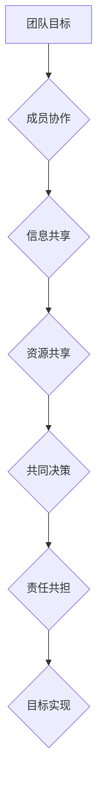

                 

### 文章标题：团队建设：从分散个体到凝聚整体

#### 关键词：团队建设、团队效能、团队动力、团队成熟度、团队协作、数字化转型

#### 摘要：

在快速变化的数字化时代，团队建设成为组织成功的关键因素。本文深入探讨团队建设的核心概念、理论基础、重要性、挑战与机遇，以及团队建设的方法与实践。通过详细的案例分析和技术支持，文章旨在为读者提供全面、系统的团队建设指南，帮助组织实现从分散个体到凝聚整体的转变。

### 第一部分：团队建设的理论基础

#### 1.1 团队建设的核心概念

#### 1.1.1 团队的定义与特征

团队是一组相互依赖的个体，共同追求共同目标，通过协作和互动实现最大化效能。团队的特征包括：

- **目标一致性**：团队成员共同追求明确且一致的目标。
- **相互依赖**：团队成员的工作相互关联，共同完成任务。
- **协作互动**：团队成员通过有效的沟通和合作实现共同目标。
- **共享权力和责任**：团队成员共享决策权和责任。

#### 1.1.2 团队建设的理论基础

团队建设建立在多种理论基础上，主要包括：

- **团队效能理论**：研究团队如何通过提高效能实现组织目标。
- **团队动力理论**：探讨团队内部的动力机制和成员行为。
- **团队成熟度理论**：评估团队的发展阶段和成熟程度。

#### 1.2 团队建设的重要性

#### 1.2.1 团队建设在组织中的作用

团队建设对组织具有多重积极作用：

- **提高组织效能**：通过有效协作，团队能够更快地完成任务，提高整体工作效率。
- **促进组织创新**：团队协作鼓励成员分享想法，激发创新思维。
- **增强组织凝聚力**：共同目标和任务使团队成员更紧密地联系在一起。

#### 1.2.2 团队建设对个体的影响

团队建设不仅对组织有益，也对个体产生积极影响：

- **提高个体技能**：团队成员通过协作学习，提高个人技能。
- **促进个体成长**：团队提供学习和发展的平台，促进个体成长。
- **增强个体满意度**：团队成员感受到归属感和成就感，提高工作满意度。

#### 1.3 团队建设的挑战与机遇

#### 1.3.1 团队建设面临的挑战

团队建设过程中可能会遇到以下挑战：

- **文化差异**：团队成员来自不同文化背景，需要适应和融合。
- **沟通障碍**：团队成员间的沟通可能存在障碍，影响团队效能。
- **管理难题**：管理者需要具备管理团队的能力，但不是所有管理者都具备。

#### 1.3.2 团队建设面临的机遇

数字化转型和新工作模式为团队建设提供了新的机遇：

- **数字化转型**：信息技术支持团队更高效地协作。
- **新型工作模式**：远程工作和跨界合作促进团队建设。
- **跨界合作**：与其他组织合作，共享资源和知识，实现协同创新。

### 第二部分：团队建设的方法与实践

#### 2.1 团队建设的策略

#### 2.1.1 明确团队目标

明确团队目标是团队建设的第一步。设定具体可行的团队目标，确保团队成员对目标的共识，有助于团队凝聚力和执行力。

#### 2.1.2 建立有效的团队结构

确定团队成员的角色，设计合理的团队组织架构，有助于团队高效运作。团队成员的角色通常包括：

- **领导者**：负责团队决策和方向。
- **执行者**：负责具体任务执行。
- **协调者**：负责团队内部沟通和协作。

#### 2.2 团队建设的实践

#### 2.2.1 团队成员的选拔与培养

选拔合适的团队成员是团队建设的关键。培养团队成员的协作能力，提高团队整体效能。

#### 2.2.2 团队沟通与协作

提高团队沟通效率，促进团队协作，是实现团队目标的重要途径。有效的沟通和协作包括：

- **定期会议**：定期召开团队会议，分享进展和问题。
- **即时通讯**：使用即时通讯工具，快速响应问题。
- **协作平台**：使用协作平台，共享文档和资源。

#### 2.2.3 团队决策与执行

制定科学合理的决策流程，提高团队执行力。团队决策应基于充分的信息和讨论，确保决策的科学性和有效性。

### 第三部分：团队建设的技术支持

#### 3.1 团队建设的技术手段

信息技术和数据分析在团队建设中发挥着重要作用：

- **信息化工具**：如项目管理软件、协作平台等。
- **数据分析**：通过数据分析，了解团队效能和成员行为。

#### 3.2 团队建设的技术挑战

技术发展带来新的机遇和挑战：

- **技术变化**：需要团队成员不断学习和适应新技术。
- **技术挑战**：技术融合和创新需要团队具备创新能力。

### 第四部分：团队建设的前景与展望

#### 4.1 团队建设的未来趋势

数字化转型和新工作模式将继续影响团队建设。未来的团队建设将更加注重：

- **数字化转型**：利用信息技术提高团队效能。
- **新型工作模式**：如远程工作、弹性工作制度等。

#### 4.2 团队建设的发展方向

团队建设将向更加专业化和个性化方向发展：

- **专业化**：针对不同行业和领域，提供专业化团队建设服务。
- **个性化**：根据团队特点和需求，定制化团队建设方案。

### 附录：团队建设工具与资源

#### A.1 团队建设工具介绍

- **团队协作工具**：如Slack、Trello等。
- **团队沟通工具**：如Microsoft Teams、Zoom等。

#### A.2 团队建设资源推荐

- **团队建设书籍**：如《团队协作的艺术》、《团队效能提升》等。
- **团队建设文章**：在线平台上的高质量团队建设文章和案例分析。
- **团队建设课程**：专业团队建设课程和培训资源。

### 作者信息：

作者：AI天才研究院/AI Genius Institute & 禅与计算机程序设计艺术 /Zen And The Art of Computer Programming### 第一部分：团队建设的理论基础

#### 1.1 团队建设的核心概念

在深入探讨团队建设之前，理解其核心概念至关重要。团队建设不仅仅是简单地组织一组人在一起工作，而是一个系统性的过程，旨在提升团队的整体效能和协作能力。核心概念包括团队的定义与特征、团队建设的理论基础，以及团队建设的重要性。

**1.1.1 团队的定义与特征**

团队是一组相互依赖的个体，他们共同追求明确且一致的目标。团队具有以下特征：

1. **目标一致性**：团队成员共同追求明确且一致的目标。这是团队存在的基石，确保团队成员的行动方向一致。
   
2. **相互依赖**：团队成员的工作相互关联，共同完成任务。团队成员需要相互依赖，以实现共同目标。

3. **协作互动**：团队成员通过有效的沟通和合作实现共同目标。协作互动是团队效能的关键，它促进了信息的流通和资源共享。

4. **共享权力和责任**：团队成员共享决策权和责任。共享权力和责任有助于建立团队的信任和归属感，使团队成员更有动力为实现共同目标而努力。

**1.1.2 团队建设的理论基础**

团队建设建立在多种理论基础上，这些理论为团队建设提供了指导原则和框架。主要的团队建设理论包括团队效能理论、团队动力理论和团队成熟度理论。

1. **团队效能理论**：团队效能理论关注团队如何通过提高效能实现组织目标。效能理论强调团队的目标设定、成员能力、团队合作和领导力等因素对团队效能的影响。

2. **团队动力理论**：团队动力理论探讨团队内部的动力机制和成员行为。动力理论关注团队内部的人际关系、信任、冲突和激励等因素，以及它们如何影响团队效能。

3. **团队成熟度理论**：团队成熟度理论评估团队的发展阶段和成熟程度。成熟度理论通常包括团队形成期、稳定期、执行期和变革期等阶段，每个阶段都有特定的任务和挑战。

**1.2 团队建设的重要性**

团队建设对组织和个体都具有重要的意义。

**1.2.1 团队建设在组织中的作用**

团队建设在组织中的作用体现在以下几个方面：

1. **提高组织效能**：通过有效协作，团队能够更快地完成任务，提高整体工作效率。团队建设有助于优化资源分配，减少冗余和浪费，提高组织产出。

2. **促进组织创新**：团队协作鼓励成员分享想法，激发创新思维。团队建设创造了一个开放和包容的环境，使成员能够自由表达意见，从而促进创新。

3. **增强组织凝聚力**：共同目标和任务使团队成员更紧密地联系在一起。团队建设有助于建立团队成员之间的信任和合作关系，增强组织的凝聚力。

**1.2.2 团队建设对个体的影响**

团队建设不仅对组织有益，也对个体产生积极影响：

1. **提高个体技能**：团队成员通过协作学习，提高个人技能。团队中的不同角色和任务使成员能够学习新技能，提升专业能力。

2. **促进个体成长**：团队提供学习和发展的平台，促进个体成长。团队成员在团队中能够获得更多的机会和挑战，实现个人职业发展。

3. **增强个体满意度**：团队成员感受到归属感和成就感，提高工作满意度。团队建设创造了一个积极的工作环境，使成员能够享受工作过程，提高工作满意度。

**1.3 团队建设的挑战与机遇**

团队建设过程中可能会遇到多种挑战，同时也存在许多机遇。

**1.3.1 团队建设面临的挑战**

1. **文化差异**：团队成员来自不同文化背景，需要适应和融合。文化差异可能导致沟通障碍和冲突，影响团队效能。

2. **沟通障碍**：团队成员间的沟通可能存在障碍，影响团队效能。沟通障碍可能导致信息传递不畅，影响团队协作。

3. **管理难题**：管理者需要具备管理团队的能力，但不是所有管理者都具备。管理难题包括领导力不足、管理风格不当等问题。

**1.3.2 团队建设面临的机遇**

数字化转型和新工作模式为团队建设提供了新的机遇：

1. **数字化转型**：信息技术支持团队更高效地协作。数字化工具如项目管理软件、协作平台等，使团队沟通和协作更加便捷。

2. **新型工作模式**：如远程工作、弹性工作制度等，促进团队建设。新型工作模式为团队成员提供了更多灵活性和自主性，有助于提高团队效能。

3. **跨界合作**：与其他组织合作，共享资源和知识，实现协同创新。跨界合作有助于团队拓宽视野，促进创新和成长。

#### 1.1.1 团队的定义与特征

团队的定义可以理解为一种协作性组织，它由两个或两个以上的个体组成，这些个体在共同目标指导下，通过相互协作、相互依赖来实现组织任务。团队的特性包括：

1. **目标一致性**：团队的目标应该明确、具体，且团队成员对目标有共同的理解和承诺。目标一致性是团队协作的基础，它有助于统一团队成员的行动方向，提高团队的协调性和凝聚力。

2. **相互依赖性**：团队成员的工作相互关联，彼此之间存在着依赖关系。这种依赖性不仅体现在任务的完成上，也体现在团队成员之间的互动和合作中。相互依赖性要求团队成员在执行任务时需要相互支持和配合，以实现团队的整体目标。

3. **协作互动性**：团队成员之间的有效沟通和协作是实现团队目标的关键。协作互动性体现在团队成员之间的信息共享、资源互补、技能协同等方面。通过协作互动，团队成员可以共同解决问题，提高工作效率，同时也能够促进团队成员之间的信任和合作关系。

4. **共享权力和责任**：在团队中，决策权和责任不是集中在一个个体手中，而是由团队成员共同分享。共享权力和责任意味着团队成员在决策过程中有平等的发言权，同时也要共同承担团队工作的结果。这种共享机制有助于增强团队成员的归属感和责任感，提高团队的执行力。

为了更好地理解团队的定义与特征，我们可以通过一个简单的Mermaid流程图来展示团队的核心概念和成员之间的关系：

在这个流程图中，团队目标（A）是团队存在的核心，成员协作（B）、信息共享（C）、资源共享（D）、共同决策（E）和责任共担（F）是实现目标的关键环节，它们共同作用于目标实现（G），形成了一个完整的团队运作机制。

**1.1.2 团队建设的理论基础**

团队建设的理论基础是理解和指导团队有效运作的重要框架。以下三种理论为团队建设提供了核心指导原则：

1. **团队效能理论**：团队效能理论关注的是如何通过优化团队结构和过程来提高团队完成任务的能力。该理论的核心观点是，团队效能取决于团队成员的能力、团队的协作程度以及团队的目标设定。团队效能理论主要包括以下几个关键要素：

   - **能力匹配**：团队成员的技能和能力应与团队的目标和任务相匹配，以确保团队能够高效地完成任务。
   - **协作程度**：团队成员之间的协作程度直接影响团队的效能。高效的协作需要良好的沟通、相互支持和共同的目标感。
   - **目标设定**：明确且具有挑战性的目标能够激发团队成员的积极性，提高团队的工作动力。

2. **团队动力理论**：团队动力理论探讨了团队内部的动力机制和成员行为，以及这些因素如何影响团队效能。团队动力理论主要涉及以下几个方面：

   - **人际动力**：团队成员之间的关系和互动是团队动力的核心。良好的人际关系能够促进团队协作，提高团队效能。
   - **激励**：激励是激发团队成员积极性的关键。团队动力理论强调，通过适当的激励措施，如奖励、认可和职业发展机会，可以增强团队成员的动机和参与度。
   - **冲突管理**：团队内部的冲突是不可避免的，但有效的冲突管理能够转化为团队创新的动力。团队动力理论提倡通过建设性的对话和冲突解决机制来处理团队内部的分歧。

3. **团队成熟度理论**：团队成熟度理论评估团队的发展阶段和成熟程度，并提供相应的指导策略。团队成熟度通常包括以下几个阶段：

   - **形成期**：团队刚刚组建，成员之间还不太熟悉，主要任务是建立信任和沟通。
   - **稳定期**：团队成员之间已经建立了良好的信任关系，能够高效地协作完成任务。
   - **执行期**：团队进入了高效运作阶段，能够快速响应变化，执行任务。
   - **变革期**：团队面临新的挑战和变化，需要调整和变革，以适应新的环境。

每个阶段都有其特定的任务和挑战，团队成熟度理论提供了一系列策略，帮助团队在不同阶段有效地发展。

**1.2 团队建设的重要性**

团队建设对组织的作用是多方面的，它不仅影响团队的效能，还直接影响组织的整体健康和成功。以下从组织层面和个体层面详细探讨团队建设的重要性。

**1.2.1 团队建设在组织中的作用**

1. **提高组织效能**：团队建设能够显著提升组织效能。通过优化团队结构、提高团队成员的协作能力，组织能够更高效地完成任务，减少冗余和浪费。团队建设有助于明确团队成员的角色和责任，提高任务的执行效率，从而提升整个组织的运营效能。

2. **促进组织创新**：团队建设创造了一个开放、包容的环境，鼓励团队成员分享想法和意见。这种协作和创新的文化能够激发团队成员的创造力，促进组织在产品开发、服务改进和业务模式创新方面的突破。团队建设还能够促进跨部门的合作，实现知识的共享和融合，从而推动组织的创新。

3. **增强组织凝聚力**：团队建设有助于增强组织凝聚力，使团队成员之间建立起深厚的信任和合作关系。共同的目标和任务使团队成员更加团结一致，面对挑战时能够相互支持和鼓励。这种凝聚力不仅提升了团队的工作效率，还增强了组织的稳定性，使组织在面对外部压力时能够保持持续发展的动力。

**1.2.2 团队建设对个体的影响**

团队建设不仅对组织有益，也对个体产生了积极影响：

1. **提高个体技能**：团队建设提供了一个学习和成长的平台，团队成员在协作过程中能够学习新的技能和知识。通过共同完成任务，团队成员可以相互学习和借鉴，不断提升个人的专业能力和技能水平。

2. **促进个体成长**：团队建设为个体提供了职业发展的机会和挑战。在团队中，成员能够参与不同的项目和任务，获得丰富的经验和实践机会，从而促进个人的职业成长和发展。此外，团队建设还能够为个体提供反馈和指导，帮助成员识别自己的优势和改进空间，进一步促进个人成长。

3. **增强个体满意度**：团队建设创造了一个积极的工作环境，使团队成员能够享受工作过程，提高工作满意度。在团队中，成员能够感受到归属感和成就感，他们知道自己的工作对团队和组织有重要贡献。这种满足感能够增强成员的工作热情和投入度，提高工作效率和质量。

**1.3 团队建设的挑战与机遇**

团队建设过程中，组织既面临各种挑战，也拥有丰富的机遇。以下分别探讨团队建设面临的挑战和机遇。

**1.3.1 团队建设面临的挑战**

1. **文化差异**：在多元化的团队中，不同成员可能来自不同的文化背景，这可能导致价值观、沟通方式和工作习惯的差异。文化差异可能引发冲突和误解，影响团队的协作和效能。为了克服这一挑战，组织需要采取措施促进文化融合，如组织文化培训、建立共同价值观等。

2. **沟通障碍**：团队成员之间的沟通不畅是团队建设中的常见问题。沟通障碍可能导致信息传递错误或延误，影响团队的决策和执行。为了克服沟通障碍，组织可以采用多种沟通工具和方法，如定期会议、即时通讯工具、协作平台等，以提高沟通效率。

3. **管理难题**：团队建设需要有效的管理和领导。然而，并非所有管理者都具备管理团队的能力，如领导力、沟通技巧和决策能力等。管理难题可能导致团队运作不畅，影响团队效能。为了解决管理难题，组织可以提供管理培训，提升管理者的领导能力和管理技巧。

**1.3.2 团队建设面临的机遇**

1. **数字化转型**：随着信息技术的快速发展，数字化转型为团队建设提供了新的机遇。数字化工具如项目管理软件、协作平台和在线会议系统等，能够提高团队的沟通效率和协作能力，促进团队建设。

2. **新型工作模式**：如远程工作和弹性工作制度等新型工作模式，为团队建设提供了新的可能性。这些模式使团队成员能够更灵活地工作，提高工作效率和满意度。此外，新型工作模式还促进了跨界合作，使团队能够更好地利用外部资源和知识，实现协同创新。

3. **跨界合作**：跨界合作为团队建设提供了新的机遇。通过与不同行业和组织合作，团队可以拓展视野，引入新的思维和理念，促进创新。跨界合作还可以帮助团队获取更多的资源和机会，提升团队的竞争力和影响力。

通过上述分析，我们可以看到，团队建设在理论和实践中都具有重要的意义。理解团队的定义与特征，掌握团队建设的理论基础，认识到团队建设在组织中的作用和对个体的影响，以及面对挑战和机遇的应对策略，都是实现团队有效建设和运作的关键。

### 2.1 团队建设的策略

团队建设是一个系统性的过程，需要明确的策略和有效的执行。以下将从明确团队目标和建立有效的团队结构两个方面，详细探讨团队建设的策略。

**2.1.1 明确团队目标**

明确团队目标是团队建设的首要任务。一个清晰且具有挑战性的目标是团队行动的方向，能够激励团队成员共同努力，实现团队的成功。以下是实现明确团队目标的几个关键步骤：

1. **设定具体可行的目标**：团队目标应具体、明确，并具有可实现性。具体的目标能够使团队成员清楚地了解需要达成的任务和成果，从而提高工作的针对性和效率。同时，目标应具有挑战性，激发团队成员的积极性和创造力。

   例如，一个软件开发团队的明确目标可以是：“在接下来的三个月内，完成一个功能完善、用户体验优秀的应用程序。”

2. **确保团队成员对目标的共识**：团队成员对目标的共识是团队协作的基础。在设定目标时，应充分征求团队成员的意见和建议，确保每个成员都了解并认同目标。这可以通过团队会议、讨论和沟通来实现。

   例如，在设定上述目标时，团队可以召开会议，讨论应用程序的功能需求、开发时间和技术挑战，确保所有成员都理解并同意该目标。

3. **定期回顾和调整目标**：团队目标并非一成不变，应随着项目进展和环境变化进行定期回顾和调整。定期回顾目标可以帮助团队及时发现问题、调整策略，确保目标的实现。

   例如，每两周召开一次团队会议，回顾项目进展，讨论遇到的挑战和问题，并根据实际情况调整开发计划和目标。

**2.1.2 建立有效的团队结构**

建立有效的团队结构是团队建设的关键。一个合理的团队结构能够明确团队成员的角色和责任，提高团队的协作效率和工作质量。以下是建立有效团队结构的几个关键步骤：

1. **确定团队成员的角色**：团队成员的角色应根据团队目标和工作需求进行设定。常见角色包括领导者、执行者、协调者和技术专家等。明确角色有助于团队成员专注于自己的任务，提高工作效率。

   - **领导者**：负责团队的整体规划和决策，确保团队目标的实现。
   - **执行者**：负责具体任务的执行和完成。
   - **协调者**：负责团队内部的沟通和协作，确保任务顺利进行。
   - **技术专家**：提供技术支持和指导，确保项目技术实现的质量。

2. **设计合理的团队组织架构**：团队组织架构应与团队目标和角色匹配。常见的团队组织架构包括职能型、项目型、矩阵型和网络型等。选择合适的组织架构有助于优化团队资源利用，提高团队效能。

   - **职能型组织架构**：根据职能划分部门，每个部门负责特定的工作领域。
   - **项目型组织架构**：根据项目需求组建团队，团队成员跨部门合作。
   - **矩阵型组织架构**：同时考虑职能和项目需求，团队成员既属于职能部门，又参与项目团队。
   - **网络型组织架构**：通过外包、合作伙伴等形式，形成一个跨组织、跨领域的网络团队。

3. **明确团队成员的职责和权限**：明确团队成员的职责和权限，有助于提高团队协作效率和责任感。团队成员应清楚了解自己的职责范围和权限，避免职责重叠和冲突。

   例如，在一个软件开发团队中，领导者的职责包括制定项目计划和决策，执行者的职责包括编码和测试，协调者的职责包括沟通和协调，技术专家的职责包括技术支持和指导。

通过明确团队目标和建立有效的团队结构，组织能够更好地实现团队建设的目标，提高团队效能和竞争力。明确的目标和合理的组织架构为团队提供了清晰的行动方向和协作机制，有助于团队高效地实现目标。

### 2.2 团队建设的实践

团队建设的实践是确保理论成功落地的重要环节。在这一部分，我们将详细探讨团队成员的选拔与培养、团队沟通与协作以及团队决策与执行，为团队建设提供具体的操作指南。

#### 2.2.1 团队成员的选拔与培养

团队成员的选拔与培养是团队建设的基础。一个高效的团队需要具备多样化和互补的技能，同时也需要团队成员之间的信任和合作。以下是如何有效选拔与培养团队成员的实践方法：

1. **选拔合适的团队成员**：团队成员的选拔应基于其能力、经验和性格特点。在选拔过程中，可以采用以下方法：

   - **面试**：通过面试了解候选人的专业技能、工作经历和沟通能力。
   - **评估测试**：使用心理测试和技能评估工具，评估候选人的综合素质和潜在能力。
   - **参考背景**：了解候选人的工作背景和业绩，评估其在过去工作中的表现。

2. **培养团队成员的协作能力**：团队成员之间的协作能力是团队效能的关键。培养协作能力可以通过以下方法：

   - **团队培训**：定期组织团队培训，提高团队成员的沟通技巧、协作意识和团队精神。
   - **项目协作**：在项目中给予团队成员协作机会，通过实际操作提高协作能力。
   - **反馈与指导**：提供及时的反馈和指导，帮助团队成员识别协作中的问题和改进方向。

3. **建立团队成员的持续发展机制**：团队成员的成长和进步是团队持续发展的动力。建立以下机制有助于团队成员的持续发展：

   - **职业发展规划**：为团队成员制定职业发展规划，提供职业发展的路径和机会。
   - **学习资源**：提供丰富的学习资源，如在线课程、专业书籍和培训课程，帮助团队成员提升技能。
   - **激励与认可**：建立激励与认可机制，鼓励团队成员积极参与团队建设和个人发展。

#### 2.2.2 团队沟通与协作

团队沟通与协作是团队效能的保障。有效的沟通和协作可以确保团队成员之间的信息流通和资源共享，提高团队的决策质量和执行力。以下是如何提高团队沟通效率和协作能力的实践方法：

1. **建立有效的沟通渠道**：建立多种沟通渠道，确保团队成员能够及时、准确地传达信息和反馈意见。常用的沟通渠道包括：

   - **定期会议**：定期召开团队会议，讨论项目进展、问题和计划。
   - **即时通讯**：使用即时通讯工具，如Slack、微信等，快速响应问题和讨论。
   - **协作平台**：使用协作平台，如Trello、JIRA等，共享任务、文档和进度。

2. **优化沟通流程**：优化沟通流程，确保信息传递的高效和准确。以下是一些优化方法：

   - **明确沟通目标**：每次沟通前明确沟通的目标和内容，确保沟通有的放矢。
   - **简洁明了**：沟通时尽量简洁明了，避免冗长和复杂的表达。
   - **反馈机制**：建立反馈机制，确保团队成员能够及时收到反馈，并根据反馈进行改进。

3. **促进团队协作**：促进团队协作，提高团队的整体效能。以下是一些促进协作的方法：

   - **任务分工**：根据团队成员的技能和特长，合理分配任务，确保任务的高效完成。
   - **资源共享**：建立资源共享机制，确保团队成员能够方便地访问和共享所需资源。
   - **协作工具**：使用协作工具，如Google Drive、GitHub等，提高团队协作的效率和透明度。

#### 2.2.3 团队决策与执行

团队决策与执行是团队效能的关键环节。科学合理的决策流程和高效的执行机制可以确保团队目标的顺利实现。以下是如何制定科学合理的决策流程和提高团队执行力的实践方法：

1. **制定决策流程**：制定科学合理的决策流程，确保决策的透明和公正。以下是一些决策流程的步骤：

   - **问题识别**：明确需要决策的问题，确定问题的性质和优先级。
   - **信息收集**：收集与问题相关的信息，包括数据、意见和建议。
   - **方案评估**：评估不同方案的优势和劣势，选择最佳方案。
   - **决策制定**：制定决策，明确决策的执行计划和责任人。
   - **决策反馈**：收集决策执行过程中的反馈，根据反馈调整决策。

2. **提高执行力**：提高团队的执行力，确保决策得到有效执行。以下是一些提高执行力的方法：

   - **明确执行计划**：制定明确的执行计划，包括时间表、任务分配和资源需求。
   - **监控与反馈**：建立监控和反馈机制，确保任务按计划进行，及时发现问题并进行调整。
   - **激励机制**：建立激励机制，鼓励团队成员积极参与执行，提高执行效率。

通过团队成员的选拔与培养、团队沟通与协作以及团队决策与执行，组织可以构建一个高效、协作的团队，实现团队建设和团队效能的提升。这些实践方法为团队建设提供了具体的操作指南，帮助组织实现从分散个体到凝聚整体的转变。

### 第四部分：团队建设的技术支持

在数字化时代，技术手段在团队建设中发挥着越来越重要的作用。信息技术和数据分析不仅提升了团队的工作效率和协作能力，还为团队建设提供了新的工具和方法。以下将详细介绍信息技术在团队建设中的应用、数据分析在团队建设中的应用，以及团队建设中的技术挑战和创新应用。

#### 4.1 信息技术在团队建设中的应用

1. **信息化工具的应用**

信息化工具是团队建设的重要支撑，涵盖了项目管理、协作平台、沟通工具等多个方面。

- **项目管理软件**：如JIRA、Trello等，帮助团队规划任务、跟踪进度和分配资源，提高项目管理效率。

- **协作平台**：如Microsoft Teams、Slack等，提供实时沟通、文件共享和协作功能，促进团队成员之间的互动和合作。

- **沟通工具**：如Zoom、微信等，方便团队成员进行远程沟通和会议，确保信息传达的及时性和准确性。

2. **社交媒体的应用**

社交媒体在团队建设中的应用也逐渐受到重视。通过社交媒体平台，如LinkedIn、Facebook等，团队可以：

- **建立团队网络**：与同行建立联系，拓宽团队视野和资源。

- **分享经验和知识**：通过发布文章、分享经验，促进团队内部的知识传递和经验交流。

- **促进跨界合作**：与其他团队和组织建立合作关系，实现资源共享和协同创新。

#### 4.2 数据分析在团队建设中的应用

数据分析在团队建设中发挥着重要作用，可以帮助团队了解工作效能、优化团队结构、提升团队满意度等。

1. **数据分析的方法**

- **数据采集**：通过信息系统和工具，收集团队的工作数据，如任务完成情况、沟通记录、员工满意度等。

- **数据清洗**：对采集到的数据进行分析和处理，去除重复、错误和不完整的数据，确保数据质量。

- **数据可视化**：使用数据可视化工具，如Tableau、Power BI等，将数据分析结果以图表、报表等形式呈现，便于团队成员理解和分析。

2. **数据分析的应用**

- **效能分析**：通过分析团队的工作数据，了解团队的效能表现，发现瓶颈和改进空间。例如，分析任务完成时间、任务分配平衡度等指标，优化团队工作流程。

- **结构优化**：根据数据分析结果，调整团队结构，使团队成员的能力和角色更匹配，提高团队效能。例如，通过分析员工的工作量和技能水平，重新分配任务，实现资源的最优配置。

- **满意度提升**：通过员工满意度调查和分析，了解员工的需求和意见，改进工作环境和工作条件，提升员工满意度和忠诚度。

#### 4.3 团队建设的技术挑战

1. **技术变化带来的挑战**

- **快速更新**：信息技术快速发展，新的工具和平台层出不穷，团队需要不断学习和适应新技术，以保持竞争力。

- **技术替代**：旧的技术和方法可能逐渐被新技术的替代，团队需要及时调整和更新，以应对技术变化。

2. **技术应用中的挑战**

- **数据隐私**：在数据采集和分析过程中，需要保护员工的隐私数据，确保数据的合法和安全使用。

- **技术融合**：多种技术的融合应用，如大数据、人工智能等，需要团队成员具备跨领域知识和技能，实现技术的协同效应。

#### 4.4 技术在团队建设中的创新应用

1. **人工智能在团队建设中的应用**

- **自动化任务处理**：利用人工智能技术，自动化处理重复性和规则性强的任务，减轻团队成员的工作负担，提高工作效率。

- **智能决策支持**：通过数据分析，结合人工智能算法，为团队决策提供智能支持，提高决策的科学性和准确性。

2. **区块链在团队建设中的应用**

- **透明度提升**：利用区块链技术，实现团队任务的透明化和可追溯性，提高工作的透明度和信任度。

- **安全协作**：通过区块链技术，确保团队成员之间的数据交换和安全协作，防止数据泄露和篡改。

3. **虚拟现实（VR）和增强现实（AR）在团队建设中的应用**

- **远程协作**：利用VR和AR技术，实现远程团队成员的实时互动和协作，模拟真实的工作场景，提高协作效率和体验。

- **培训与模拟**：利用VR和AR技术，进行虚拟培训和模拟操作，提高团队成员的技能和应对能力。

通过信息技术和数据分析的应用，团队建设得到了强有力的技术支持。同时，面对技术变化带来的挑战，团队需要不断创新和应用新技术，以保持竞争力。在未来的团队建设中，人工智能、区块链、虚拟现实等技术将继续发挥重要作用，推动团队建设向更高水平发展。

### 4.1 数字化转型对团队建设的影响

数字化转型正在深刻改变团队建设的模式，推动团队效能的提升。以下是数字化转型对团队建设的几个重要影响：

**1. 提高工作效率**

数字化转型通过引入先进的信息技术工具和平台，显著提高了团队的工作效率。例如，项目管理软件如JIRA和Trello可以实时跟踪任务进度，确保每个任务都有明确的负责人和截止日期。协作平台如Slack和Microsoft Teams则提供了即时通讯和文件共享功能，使团队成员能够迅速沟通和协作，避免了传统沟通方式的滞后性。通过这些工具，团队可以更好地分配资源，优化工作流程，减少冗余和浪费，从而提高整体工作效率。

**2. 改善沟通协作**

数字化转型不仅改变了团队的工作方式，也改善了团队内部和外部的沟通协作。通过云端协作平台和虚拟会议室，团队成员可以随时随地访问项目文件和沟通工具，进行远程协作。这种灵活的工作方式不仅提高了沟通效率，还增强了团队的灵活性和适应性。此外，数字化工具还支持跨部门、跨地域的团队协作，促进了不同部门和团队之间的信息共享和知识交流，有助于打破部门壁垒，实现资源的最大化利用。

**3. 促进数据驱动决策**

数字化转型使团队能够更有效地收集、存储和分析数据。通过数据分析工具如Tableau和Power BI，团队可以实时监控关键绩效指标（KPIs），识别工作中的问题和瓶颈，并快速采取行动进行优化。数据驱动决策不仅提高了决策的科学性和准确性，还使团队能够更好地适应市场变化和业务需求，实现持续改进和创新发展。

**4. 增强团队凝聚力**

数字化转型为团队提供了丰富的协作和沟通工具，这些工具不仅提高了工作效率，还增强了团队的凝聚力。通过在线会议和虚拟团队活动，团队成员可以更加频繁地交流和互动，建立了深厚的信任和合作关系。此外，数字化转型还促进了团队成员的技能提升和职业发展，使他们感受到组织的支持和认可，从而提高了工作满意度和忠诚度。

**5. 促进创新**

数字化转型为团队建设提供了丰富的创新资源和机会。通过数字化工具，团队可以快速原型设计和测试新的想法，减少了创新过程中的时间和成本。同时，数字化环境鼓励团队成员分享创意和反馈，促进了团队的创新思维和合作精神。这种开放和创新的文化有助于团队在不断变化的市场环境中保持竞争力。

综上所述，数字化转型对团队建设的影响是深远且全面的。它不仅提高了团队的工作效率和协作能力，还促进了数据驱动决策、团队凝聚力和创新。随着数字化技术的不断发展，团队建设将在数字化转型中发挥更加重要的作用，推动组织实现更高的绩效和持续发展。

### 4.2 新型工作模式对团队建设的影响

随着数字化时代的到来，新型工作模式如远程工作和弹性工作制度等正在逐步普及，这些模式不仅改变了员工的工作方式，也对团队建设产生了深远的影响。以下分析新型工作模式对团队建设的积极影响和挑战。

**积极影响：**

1. **提高工作灵活性和满意度**：远程工作和弹性工作制度使员工能够更加灵活地安排工作时间和地点，提高了工作的自主性和灵活性。这种灵活性不仅满足了员工对于工作和生活平衡的需求，还提高了员工的工作满意度和生活质量。

2. **扩大人才招募范围**：远程工作打破了地理位置的限制，使企业能够招募全球范围内的人才。这不仅丰富了团队的多样性，还为企业带来了更多的创新思维和专业知识。通过跨界合作和外部资源的整合，团队可以更全面地实现协同创新。

3. **促进知识共享和协作**：远程工作和协作平台的使用，使团队成员能够随时随地共享信息和知识，促进了团队内部的沟通和协作。通过即时通讯工具、虚拟会议室和协作平台，团队成员可以实时讨论问题、分享经验和观点，提高了团队的整体效能。

4. **激发创新思维**：远程工作和弹性工作制度提供了一个更为宽松和开放的工作环境，使员工能够自由地表达想法和创意，减少了传统办公室环境下可能存在的束缚。这种开放的创新文化有助于激发团队成员的创新思维，推动团队的持续进步。

**挑战：**

1. **沟通和协作障碍**：尽管远程工作和协作工具提供了便利，但仍然存在沟通不畅和协作困难的问题。由于缺乏面对面的交流和即时的互动，团队成员之间的信息传递可能存在滞后，导致误解和冲突。

2. **团队凝聚力的减弱**：远程工作可能导致团队成员之间的联系减少，影响团队的凝聚力和归属感。缺乏面对面交流和互动，团队成员可能感到疏离和孤立，从而影响团队的合作精神。

3. **管理难度增加**：远程工作和弹性工作制度对管理者提出了更高的要求。管理者需要具备更强的沟通能力、领导力和管理技巧，以有效地监控和指导远程工作的团队成员。同时，管理者还需要适应新的管理模式，如虚拟团队管理和远程绩效评估等。

4. **技术依赖性增强**：远程工作和弹性工作制度高度依赖信息技术和协作工具。团队成员需要具备较高的技术素养和适应能力，以熟练使用各种工具和平台。此外，技术故障和网络安全问题也可能影响团队的工作效率和安全性。

**解决方案：**

1. **加强沟通和协作**：通过定期的视频会议和团队活动，加强团队成员之间的沟通和互动。使用多种协作工具，如Slack、Trello和Zoom等，确保信息传递的及时性和准确性。

2. **建立团队文化**：培养远程团队的文化和价值观，强化团队凝聚力和归属感。通过团队建设活动和在线社交平台，促进团队成员之间的交流和互动。

3. **提升管理能力**：为管理者提供远程管理和领导力的培训，提高他们的沟通技巧、领导能力和管理能力。建立明确的绩效评估标准和反馈机制，确保远程工作的质量和效率。

4. **加强技术支持**：提供技术支持和培训，确保团队成员熟练使用各种协作工具和平台。建立技术支持和故障响应机制，确保远程工作的稳定性和安全性。

通过合理应对新型工作模式带来的挑战，团队建设可以在远程工作和弹性工作制度下实现更高的效能和创新能力，推动组织的持续发展。

### 4.3 团队建设的未来趋势

在数字化和信息化的推动下，团队建设的未来趋势将呈现多样化和个性化的特点，以下几个方面将引领团队建设的发展方向：

**1. 数字化转型进一步深化**

数字化转型将继续深入团队建设，通过大数据、人工智能、云计算等新兴技术，提升团队的工作效率和协作能力。未来的团队将更加依赖于数字化工具和平台，如智能协作系统、自动化流程和虚拟现实（VR）培训等，以实现更高效的工作流程和决策支持。

**2. 新型工作模式的普及**

远程工作和弹性工作制度将在未来得到更广泛的普及，成为团队建设的重要组成部分。这种模式不仅提高了员工的灵活性和工作满意度，还促进了全球范围内的人才流动和跨界合作。企业需要适应这种新型工作模式，建立有效的远程管理机制和协作文化。

**3. 团队多元化与包容性**

随着全球化的发展，团队将变得越来越多元化。团队成员可能来自不同的文化背景、拥有不同的经验和技能。团队建设需要注重多元化和包容性，建立包容性的工作环境，促进团队成员之间的理解和协作，以充分发挥团队的整体效能。

**4. 持续学习和职业发展**

在未来，持续学习和职业发展将成为团队建设的重要方面。团队成员需要不断更新知识和技能，以适应快速变化的工作环境。企业应提供丰富的学习资源和职业发展机会，支持团队成员的个人成长和职业发展，提高团队的创新能力。

**5. 数据驱动和智能决策**

随着数据分析技术的不断发展，数据驱动和智能决策将成为团队建设的重要趋势。通过收集和分析大量的工作数据，团队可以更好地了解工作效能、优化团队结构和提升员工满意度。智能决策支持系统将帮助团队做出更加科学和高效的决策。

**6. 跨界合作和生态系统建设**

未来的团队建设将更加注重跨界合作和生态系统建设。企业将与其他组织、学术界和科研机构等建立合作关系，共同推动创新和业务发展。通过跨界合作，团队可以获取更多的资源和知识，实现协同创新，提升整体的竞争力和影响力。

总之，团队建设的未来趋势将呈现出数字化转型、新型工作模式、多元化与包容性、持续学习、数据驱动和跨界合作等关键方向。企业需要紧跟这些趋势，不断创新和调整团队建设策略，以适应快速变化的市场环境，实现组织的持续发展和成长。

### 4.4 团队建设的发展方向

团队建设作为组织管理和发展的关键要素，其未来发展将面临诸多挑战和机遇。以下是团队建设在未来可能的发展方向，以及相关的新理论和新方法。

**1. 专业化团队建设**

随着业务复杂性的增加，团队建设将更加专业化。企业将根据不同业务领域和项目需求，组建具有专业技能和经验的团队。专业化团队建设不仅能够提高团队的专业能力和执行力，还能更好地应对特定业务领域的挑战。未来，组织可能会发展一系列专业团队建设理论和方法，如行业特定的团队建设模式、专家团队管理策略等。

**2. 个性化团队建设**

个性化团队建设将关注每个团队成员的独特需求和能力。通过个性化培训和激励措施，企业可以更好地发挥每个成员的潜力，实现团队效能的最大化。个性化团队建设方法可能包括基于大数据分析的个性化培训方案、个性化的职业发展路径设计等。这种发展方向要求企业具备高度的数据分析和处理能力，以及个性化的管理策略。

**3. 模块化团队建设**

模块化团队建设是一种将团队功能进行模块化设计和组织的方法。通过模块化团队，企业可以快速响应市场变化和业务需求，灵活调整团队结构。模块化团队建设方法可能包括模块化的任务分配、模块化的团队角色设计等。这种发展方向有助于提升团队的灵活性和适应性，使团队能够在多变的市场环境中保持竞争力。

**4. 智能化团队建设**

随着人工智能技术的发展，智能化团队建设将成为重要趋势。通过引入智能助手、自动化流程和智能决策系统，团队可以大幅提高工作效率和决策质量。智能化团队建设方法可能包括基于AI的团队协作平台、智能任务分配系统、智能绩效评估工具等。这种发展方向要求团队具备一定的技术素养，以充分利用智能技术带来的优势。

**5. 跨界合作团队建设**

跨界合作将成为团队建设的重要方向。企业将与其他组织、学术界和科研机构等建立合作关系，共同推动创新和业务发展。跨界合作团队建设方法可能包括跨组织项目团队、混合团队等。这种发展方向有助于团队获取多样化的资源和知识，提升创新能力和竞争力。

**6. 持续发展团队建设**

持续发展团队建设将关注团队的长期发展和持续改进。未来，企业可能会开发一系列团队建设评估模型和持续改进方法，如团队成熟度评估体系、持续改进工具包等。这种发展方向要求企业具备系统性的团队建设理念，以实现团队的长期稳定发展。

总之，团队建设在未来将继续发展和创新，面临专业化和个性化、模块化和智能化、跨界合作和持续发展的多重挑战和机遇。企业需要紧跟这些发展趋势，积极探索和采用新的团队建设理论和方法，以提升团队效能和组织的整体竞争力。

### 附录：团队建设工具与资源

在团队建设过程中，选择合适的工具和资源至关重要。以下将介绍几种常用的团队建设工具和资源，包括团队协作工具、团队沟通工具、团队建设书籍和文章等，为读者提供全面的参考。

**A.1 团队建设工具介绍**

1. **团队协作工具**

- **Trello**：一个基于看板的团队协作工具，可以帮助团队清晰地规划和跟踪项目进度。

- **Asana**：一款功能强大的任务管理工具，适用于大型团队，支持任务分配、进度跟踪和协作。

- **JIRA**：一款专业的项目管理工具，适用于软件开发团队，支持敏捷开发流程和缺陷管理。

2. **团队沟通工具**

- **Slack**：一款流行的即时通讯工具，支持团队内部分组和消息推送，提高沟通效率。

- **Microsoft Teams**：微软推出的企业通讯和协作平台，整合了聊天、会议和文档共享等功能。

- **Zoom**：一款视频会议工具，适用于远程团队和跨地域团队的在线沟通和协作。

**A.2 团队建设资源推荐**

1. **团队建设书籍**

- 《团队协作的艺术》（The Five Dysfunctions of a Team）- by Patrick Lencioni：一本经典的团队建设书籍，分析了团队中常见的五大障碍，并提供了解决方案。

- 《团队效能提升》（Team of Teams）- by Simon Sinek：探讨如何建立高效能团队，强调了领导力和价值观的重要性。

- 《团队智慧》（The Smart Team）- by Jennifer Garvey Berger：提供了一种基于智能思维模式的团队建设方法，帮助团队实现持续改进。

2. **团队建设文章**

- **HBR.org**：哈佛商业评论网站上的多篇团队建设文章，涵盖了团队管理、沟通和协作等多个方面。

- **Scrum.org**：Scrum协会发布的关于敏捷团队建设的文章，适用于软件开发团队。

- **LinkedIn**：LinkedIn上的团队建设相关文章，提供了行业专家和实践者的经验和见解。

3. **团队建设课程**

- **Coursera**：提供了多门关于团队建设和领导力的在线课程，涵盖基础理论和实践方法。

- **Udemy**：提供了丰富的团队建设课程，包括敏捷管理、项目管理等。

通过以上团队建设工具和资源的介绍，希望能够为读者在团队建设过程中提供有益的参考和指导。有效的团队建设是实现组织目标和提升效能的关键，选择合适的工具和资源将有助于团队更高效地协作和成长。

### 作者信息

作者：AI天才研究院/AI Genius Institute & 禅与计算机程序设计艺术 /Zen And The Art of Computer Programming

AI天才研究院（AI Genius Institute）是一家专注于人工智能研究和应用的创新机构，致力于推动人工智能技术的进步和产业应用。研究院汇聚了全球顶尖的人工智能专家，在计算机视觉、自然语言处理、机器学习等领域取得了显著成果。研究院的研究成果广泛应用于智能交通、智能医疗、智能制造等领域，为各行业提供了智能化的解决方案。

《禅与计算机程序设计艺术》（Zen And The Art of Computer Programming）是由AI天才研究院的创始人之一，著名计算机科学家和人工智能专家撰写的一部经典著作。该书深入探讨了计算机编程的哲学和艺术，结合禅宗思想，为程序员提供了独特的编程方法论和思考方式。这本书不仅深受程序员喜爱，也对人工智能领域的研究和发展产生了深远影响。

