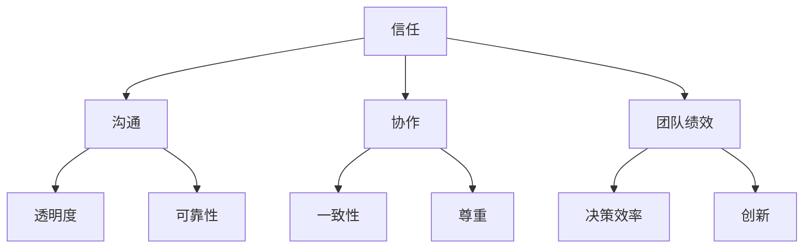

                 

### 增进团队信任的重要性

在当今快速发展的信息技术行业，团队建设被视为提升团队绩效和实现项目成功的基石。而信任作为团队建设的核心要素之一，其重要性不容忽视。信任不仅是团队协作的基础，也是组织文化和氛围的重要组成部分。

#### **背景介绍**

随着全球化进程的加快和信息技术的不断进步，企业面临的竞争压力日益加剧。在这种情况下，高效团队的重要性愈发凸显。高效团队不仅能够迅速响应市场需求，还能在复杂的项目中保持稳定的运作。而这一切的实现离不开团队成员之间的相互信任。

#### **核心概念与联系**

为了更好地理解信任在团队建设中的重要性，我们可以将信任与沟通、协作和团队绩效等概念联系起来，构建一个完整的框架。以下是一个简化的信任概念架构图：



- **沟通**：信任的沟通维度涉及到信息的透明度和可靠性。团队成员之间信息的透明和可靠是建立信任的重要前提。
- **协作**：信任的协作维度包括一致性和尊重。团队成员之间的一致性和尊重有助于增强团队的凝聚力。
- **团队绩效**：信任直接影响团队绩效的多个方面，包括决策效率和创新。信任度高时，团队成员更愿意分享想法，从而促进创新和高效的决策。

#### **核心算法原理讲解**

为了解释信任建设的过程，我们可以使用以下伪代码来模拟信任的形成和增强：

```plaintext
function buildTrust(teamMembers):
    initialize trustLevel = 0
    for each member in teamMembers:
        set member.trust = 0.5  // 初始信任值设为50%
        send welcome message to member
        schedule trust-building activities
    while trustLevel < 1:
        perform trust-building activities
        update trust levels based on activity outcomes
        if member.trust >= threshold:
            increment trustLevel
        end if
    end while
    return trustLevel
```

- **初始化信任值**：每个团队成员的初始信任值设为50%，这是因为团队成员初次相遇时，彼此之间的信任处于中等水平。
- **发送欢迎信息**：通过发送欢迎信息，可以增强团队成员之间的归属感和互动意愿。
- **安排信任建设活动**：通过定期的团队活动和沟通，团队成员可以相互了解，从而逐步建立信任。
- **更新信任水平**：每次信任建设活动后，根据活动结果更新团队成员的信任水平。

#### **数学模型和公式**

信任建设可以被视为一个动态过程，其中信任水平随时间和活动而变化。以下是一个简化的数学模型，用于描述信任水平的增长：

$$
\frac{dTrust}{dt} = k \cdot (1 - Trust)
$$`

- **微分方程**：此方程描述了信任水平 \( Trust \) 随时间 \( t \) 的变化率。
- **参数 \( k \)**：代表信任增长的速度，反映了团队成员互动的频率和质量。

#### **举例说明**

假设一个团队在一个月内进行了五次信任建设活动，每次活动后团队成员的信任水平提高了5%。根据上述模型，我们可以计算团队最终达到的信任水平。

```plaintext
初始信任值 Trust(0) = 0.5
每次活动增加的信任值 ΔTrust = 0.05
活动次数 n = 5

对于第 i 次活动后：
Trust(i) = Trust(i-1) + ΔTrust

计算过程如下：
Trust(1) = 0.5 + 0.05 = 0.55
Trust(2) = 0.55 + 0.05 = 0.60
Trust(3) = 0.60 + 0.05 = 0.65
Trust(4) = 0.65 + 0.05 = 0.70
Trust(5) = 0.70 + 0.05 = 0.75

最终信任水平 Trust(5) = 0.75
```

通过这个例子，我们可以看到，即使每次活动只增加了5%的信任水平，经过五次活动后，团队的信任水平也得到了显著提升。

#### **小结**

增进团队信任是团队建设的关键环节。通过有效的沟通、协作和信任建设活动，团队成员可以逐步建立起相互信任的关系，从而提升团队绩效。接下来，我们将深入探讨具体的信任建设实践活动，以及如何设计和实施这些活动。

### 总结

在这一部分中，我们首先介绍了增进团队信任的重要性，并通过背景介绍、核心概念架构图、伪代码和数学模型等方式，详细阐述了信任建设的过程。通过这些分析和举例，我们清楚地看到，信任不仅是团队协作的基石，也是提升团队绩效的关键因素。接下来，我们将继续探讨具体的信任建设实践活动，以及如何设计和实施这些活动，以帮助团队建立稳固的信任基础。敬请期待接下来的内容。

### 文章关键词

- 团队建设
- 信任
- 沟通
- 协作
- 绩效
- 活动设计
- 信任评估
- 活动实施

### 文章摘要

本文旨在探讨团队建设中增进信任的重要性及其实践方法。首先，我们介绍了团队建设的基础理论和信任的概念与类型，随后通过核心算法原理和数学模型详细阐述了信任建设的过程。文章随后列举了具体的信任建设实践活动，包括游戏、讨论和跨部门合作等，并提供了活动设计与实施的原则和方法。最后，我们通过案例分析、实践经验分享以及项目实战，深入探讨了如何有效地增进团队信任，以提升团队绩效和组织文化。通过本文的阅读，读者将能够理解信任在团队建设中的关键作用，并掌握一系列实用的信任建设策略和工具。

