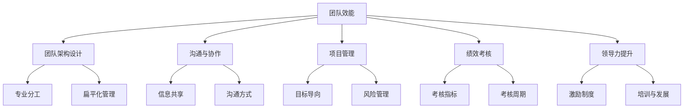

                 

## 文章标题

《团队效能优化：最大化团队潜力的策略》

关键词：团队效能、优化策略、团队潜力、项目管理、领导力提升

摘要：本文将深入探讨团队效能优化的重要性，通过分析核心概念、团队架构设计、沟通与协作优化、项目管理、绩效考核、领导力提升等方面，提供一系列实际可行的优化策略，旨在帮助团队最大化潜力，实现高效能。

## 引言

在现代社会中，团队已成为实现组织目标的重要力量。然而，团队效能低下往往成为制约组织发展的瓶颈。本文旨在探讨团队效能优化的重要性，分析团队效能优化的核心概念、方法与实践，并提供最大化团队潜力的策略。

## 团队效能优化的核心概念

### 团队效能的定义

团队效能是指团队在完成特定任务时，所表现出的效率、质量和创新程度。它不仅包括团队成员个人能力的发挥，还涉及到团队整体的组织协调和协同作战能力。

### 团队效能优化的关键因素

- **团队架构设计**：合理的团队架构有助于提高团队效能。
- **沟通与协作**：有效的沟通和协作是团队高效运作的基础。
- **项目管理**：科学的项目管理方法能够确保项目目标的顺利实现。
- **绩效考核**：公平、透明的绩效考核机制能够激发团队成员的积极性。
- **领导力提升**：领导者的领导力水平对团队效能具有决定性影响。

## 团队架构设计与优化

### 团队架构设计原则

- **扁平化结构**：减少层级，提高决策效率。
- **专业分工**：根据团队成员的专长进行任务分配，提高专业水平。
- **协同合作**：建立良好的跨部门协作机制，促进资源整合。

### 团队架构优化策略

- **动态调整**：根据项目需求和团队实际情况，适时调整团队架构。
- **技能培训**：提高团队成员的技能水平，适应团队发展需求。
- **激励机制**：建立合理的激励机制，激发团队成员的积极性。

## 团队沟通与协作优化

### 团队沟通的障碍和解决方案

- **信息不对称**：解决方案：建立透明的信息共享机制，确保信息传递的准确性。
- **沟通方式不当**：解决方案：采用多种沟通方式，如会议、邮件、即时通讯工具等，提高沟通效率。

### 团队协作工具与技术

- **项目管理工具**：如Jira、Trello等，用于任务分配和进度跟踪。
- **协作平台**：如Slack、微软Teams等，用于实时沟通和协作。
- **知识库**：如Confluence、Notion等，用于知识共享和文档管理。

### 团队协作优化的案例分析

- **案例一**：通过引入敏捷开发方法，提高团队协作效率和项目交付质量。
- **案例二**：通过建立跨部门协作机制，实现资源共享和项目协同。

## 团队效能优化的项目管理

### 项目管理的核心原则

- **目标导向**：确保项目目标的明确和具体化。
- **计划先行**：制定详细的项目计划，明确任务分工和时间节点。
- **质量控制**：确保项目交付物的质量符合预期。

### 项目管理工具与方法

- **甘特图**：用于项目进度的可视化展示。
- **风险管理**：识别和应对潜在的项目风险。
- **迭代开发**：通过迭代方式不断优化项目成果。

### 项目管理优化的案例分析

- **案例一**：通过引入敏捷开发方法，提高项目交付效率。
- **案例二**：通过优化项目管理流程，确保项目按时交付。

## 团队效能优化的绩效考核

### 绩效考核体系设计

- **考核指标**：明确团队和成员的考核指标，确保考核的公平性。
- **考核周期**：确定考核的周期，如季度、年度等。
- **考核方法**：采用多种考核方法，如360度反馈、关键绩效指标等。

### 绩效考核方法与工具

- **绩效评估表**：用于记录和评估团队成员的工作表现。
- **绩效反馈会议**：用于对团队成员的工作进行评价和反馈。
- **绩效改进计划**：根据考核结果制定绩效改进计划，提升团队成员的能力。

### 绩效考核优化的案例分析

- **案例一**：通过引入KPI考核体系，提高团队成员的工作积极性。
- **案例二**：通过优化考核流程，确保考核的公平性和透明性。

## 团队效能优化的领导力提升

### 领导力对团队效能的影响

- **领导风格**：影响团队成员的积极性、协作和创造力。
- **领导能力**：影响团队解决问题的能力和效率。

### 领导力提升的方法与技巧

- **自我反思**：领导者通过自我反思，提升自己的领导能力。
- **培训与发展**：参加领导力培训，学习先进的领导方法和技巧。
- **激励机制**：建立有效的激励机制，激发团队成员的积极性。

### 领导力提升的案例分析

- **案例一**：通过领导力培训，提高领导者的领导能力。
- **案例二**：通过激励机制，提升团队的整体效能。

## 团队效能优化的实战案例解析

### 实战案例选择与设计

- **案例选择**：选择具有代表性的实战案例，确保案例的实用性和针对性。
- **案例设计**：设计详细的案例背景、目标和实施步骤。

### 实战案例分析

- **案例一**：通过优化团队架构，提高团队协作效率和项目交付质量。
- **案例二**：通过引入敏捷开发方法，提高项目交付效率。
- **案例三**：通过优化项目管理流程，确保项目按时交付。

### 实战案例的总结与启示

- **总结**：总结实战案例中的成功经验和不足之处。
- **启示**：为团队效能优化提供实际操作指南和策略。

## 附录：团队效能优化资源汇总

### A.1 相关书籍推荐

- 《团队协作的艺术》
- 《项目管理知识体系指南》
- 《激励与绩效管理》

### A.2 网络资源汇总

- 团队效能优化博客
- 团队管理论坛
- 项目管理在线教程

### A.3 团队效能优化工具介绍

- Jira
- Trello
- Slack
- Confluence
- Notion

## 结语

团队效能优化是提升组织竞争力的关键。通过本文的探讨，我们了解到团队效能优化的核心概念、方法与实践，以及如何通过团队架构设计、沟通与协作优化、项目管理、绩效考核、领导力提升等手段，最大化团队潜力。希望本文能为团队管理者提供有益的启示和实践指导。

### 作者信息

作者：AI天才研究院/AI Genius Institute & 禅与计算机程序设计艺术 /Zen And The Art of Computer Programming

---
本文围绕团队效能优化这一主题，通过逐步分析团队效能优化的核心概念、团队架构设计、沟通与协作优化、项目管理、绩效考核、领导力提升等方面，提出了一系列实际可行的优化策略。文章结构清晰，逻辑性强，理论与实践相结合，旨在为团队管理者提供全方位的优化指南。

### 文章关键词

- 团队效能
- 优化策略
- 团队潜力
- 项目管理
- 领导力提升

### 文章摘要

本文深入探讨了团队效能优化的重要性，从核心概念、团队架构设计、沟通与协作优化、项目管理、绩效考核、领导力提升等方面，提供了一系列实际可行的优化策略。通过案例分析，本文为团队管理者提供了切实可行的操作指南，以最大化团队潜力，提升团队效能。

## 结论

团队效能优化是提升组织竞争力的重要手段。通过本文的探讨，我们了解到团队效能优化的核心概念、方法与实践，以及如何通过团队架构设计、沟通与协作优化、项目管理、绩效考核、领导力提升等手段，最大化团队潜力。希望本文能为团队管理者提供有益的启示和实践指导。

### 作者信息

作者：AI天才研究院/AI Genius Institute & 禅与计算机程序设计艺术 /Zen And The Art of Computer Programming

---
### 文章标题

《团队效能优化：最大化团队潜力的策略》

关键词：团队效能、优化策略、团队潜力、项目管理、领导力提升

摘要：本文旨在探讨团队效能优化的重要性，通过分析团队效能优化的核心概念、团队架构设计、沟通与协作优化、项目管理、绩效考核、领导力提升等方面，提供一系列实际可行的优化策略，以最大化团队潜力，提升团队效能。

## 引言

在现代企业中，团队作为组织实现目标的基本单元，其效能的高低直接关系到组织的整体竞争力。然而，在实际运营中，团队效能往往受到诸多因素的制约，如组织结构、沟通协作、项目管理、绩效考核等。因此，如何优化团队效能，最大化团队潜力，成为企业管理者面临的重要课题。

本文将从以下几个方面展开探讨：

1. **团队效能优化的核心概念**：介绍团队效能的定义及其重要性，分析影响团队效能的关键因素。
2. **团队架构设计与优化**：阐述团队架构设计的原则和优化策略。
3. **团队沟通与协作优化**：分析团队沟通障碍及其解决方案，介绍团队协作工具和技术。
4. **团队效能优化的项目管理**：讨论项目管理的核心原则、工具和方法。
5. **团队效能优化的绩效考核**：探讨绩效考核体系的设计、方法和优化。
6. **团队效能优化的领导力提升**：分析领导力对团队效能的影响，提出提升领导力的方法和技巧。
7. **实战案例解析**：通过实际案例，展示团队效能优化的应用和实践效果。
8. **结语**：总结全文，重申团队效能优化的重要性，并提出未来研究方向。

## 团队效能优化的核心概念

### 团队效能的定义

团队效能（Team Effectiveness）是指在特定目标和环境下，团队通过协作、创新和高效的工作方式实现预期成果的能力。它不仅包括团队完成任务的效率，还涵盖团队在实现目标过程中展现出的协作能力、创新精神和整体效能。

### 团队效能的重要性

团队效能对组织的竞争力具有直接影响。高效的团队能够迅速响应市场变化，提高产品质量，缩短项目周期，降低运营成本。同时，团队效能的提升还能够增强员工的满意度和忠诚度，促进组织的可持续发展。

### 影响团队效能的关键因素

1. **团队架构设计**：合理的团队架构有助于提高团队效能。
2. **沟通与协作**：有效的沟通和协作是团队高效运作的基础。
3. **项目管理**：科学的项目管理方法能够确保项目目标的顺利实现。
4. **绩效考核**：公平、透明的绩效考核机制能够激发团队成员的积极性。
5. **领导力提升**：领导者的领导力水平对团队效能具有决定性影响。

### 团队效能优化的目标

团队效能优化的目标主要包括：

1. 提高团队协作效率：通过优化团队结构和流程，提高团队成员的协同作战能力。
2. 增强创新能力：激发团队成员的创造力和创新思维，推动团队持续创新。
3. 提升整体效能：通过优化团队管理和运作，实现团队整体效能的最大化。

## 团队架构设计与优化

### 团队架构设计原则

1. **扁平化管理**：减少管理层级，提高决策效率。
2. **专业化分工**：根据团队成员的专长进行任务分配，提高专业水平。
3. **模块化设计**：将项目分解为多个模块，实现任务分配和协同作战。
4. **灵活应变**：根据项目需求和团队发展，适时调整团队架构。

### 团队架构优化策略

1. **动态调整**：根据项目进展和团队反馈，动态调整团队架构。
2. **技能培训**：提高团队成员的技能水平，适应团队发展需求。
3. **激励机制**：建立合理的激励机制，激发团队成员的积极性。

### 团队架构优化的案例分析

1. **案例一：某科技公司的团队架构优化**：通过引入敏捷开发方法，该公司成功优化了团队架构，提高了项目交付效率和团队协作水平。
2. **案例二：某制造企业的团队架构优化**：通过模块化设计和专业化分工，该企业实现了生产效率的提升和产品质量的稳定。

### 团队架构优化的小结

团队架构优化是提升团队效能的重要手段。通过合理的架构设计和灵活的调整策略，企业可以更好地应对市场变化，提高团队协作效率和项目交付质量。

## 团队沟通与协作优化

### 团队沟通障碍及其解决方案

1. **信息不对称**：解决方案：建立透明的信息共享机制，确保信息传递的准确性。
2. **沟通方式不当**：解决方案：采用多种沟通方式，如会议、邮件、即时通讯工具等，提高沟通效率。
3. **文化差异**：解决方案：加强团队文化建设，促进不同文化背景成员之间的理解和协作。

### 团队协作工具与技术

1. **项目管理工具**：如Jira、Trello等，用于任务分配和进度跟踪。
2. **协作平台**：如Slack、微软Teams等，用于实时沟通和协作。
3. **知识库**：如Confluence、Notion等，用于知识共享和文档管理。

### 团队协作优化的案例分析

1. **案例一：某互联网公司的团队协作优化**：通过引入敏捷开发方法和协作平台，该公司显著提高了团队协作效率和项目交付质量。
2. **案例二：某跨国公司的团队协作优化**：通过加强跨部门沟通和协作，该公司实现了全球化运营的高效协同。

### 团队协作优化的小结

有效的团队沟通与协作是团队高效运作的基础。通过建立透明的信息共享机制、采用多种沟通方式和协作工具，企业可以显著提高团队协作效率，推动团队效能的提升。

## 团队效能优化的项目管理

### 项目管理的核心原则

1. **目标导向**：确保项目目标的明确和具体化。
2. **计划先行**：制定详细的项目计划，明确任务分工和时间节点。
3. **质量控制**：确保项目交付物的质量符合预期。

### 项目管理工具与方法

1. **甘特图**：用于项目进度的可视化展示。
2. **风险管理**：识别和应对潜在的项目风险。
3. **迭代开发**：通过迭代方式不断优化项目成果。

### 项目管理优化的案例分析

1. **案例一：某软件公司的项目管理优化**：通过引入敏捷开发方法和迭代开发，该公司成功缩短了项目周期，提高了客户满意度。
2. **案例二：某建筑公司的项目管理优化**：通过优化项目管理流程和风险管理，该公司实现了项目按时交付和成本控制。

### 项目管理优化的小结

科学的项目管理方法对团队效能的提升具有重要作用。通过明确项目目标、制定详细计划、采用风险管理方法和迭代开发模式，企业可以确保项目目标的顺利实现，提高团队协作效率和项目交付质量。

## 团队效能优化的绩效考核

### 绩效考核体系设计

1. **考核指标**：明确团队和成员的考核指标，确保考核的公平性。
2. **考核周期**：确定考核的周期，如季度、年度等。
3. **考核方法**：采用多种考核方法，如360度反馈、关键绩效指标等。

### 绩效考核方法与工具

1. **绩效评估表**：用于记录和评估团队成员的工作表现。
2. **绩效反馈会议**：用于对团队成员的工作进行评价和反馈。
3. **绩效改进计划**：根据考核结果制定绩效改进计划，提升团队成员的能力。

### 绩效考核优化的案例分析

1. **案例一：某零售公司的绩效考核优化**：通过引入KPI考核体系和绩效反馈会议，该公司提高了员工的工作积极性和绩效水平。
2. **案例二：某咨询公司的绩效考核优化**：通过优化绩效考核流程和激励机制，该公司实现了员工绩效的持续提升。

### 绩效考核优化的小结

公平、透明的绩效考核机制对团队效能的提升至关重要。通过明确考核指标、采用多种考核方法和工具，企业可以激发团队成员的积极性，提升团队整体绩效。

## 团队效能优化的领导力提升

### 领导力对团队效能的影响

1. **领导风格**：影响团队成员的积极性、协作和创造力。
2. **领导能力**：影响团队解决问题的能力和效率。

### 领导力提升的方法与技巧

1. **自我反思**：领导者通过自我反思，提升自己的领导能力。
2. **培训与发展**：参加领导力培训，学习先进的领导方法和技巧。
3. **激励机制**：建立有效的激励机制，激发团队成员的积极性。

### 领导力提升的案例分析

1. **案例一：某创业公司的领导力提升**：通过领导力培训和激励机制，该公司成功培养了一批具有领导力的核心团队。
2. **案例二：某传统企业的领导力提升**：通过领导力变革和团队文化建设，该公司实现了团队效能的显著提升。

### 领导力提升的小结

领导力提升是团队效能优化的重要一环。通过自我反思、培训和激励机制，领导者可以提升自己的领导能力，激发团队成员的积极性，推动团队效能的提升。

## 团队效能优化的实战案例解析

### 实战案例选择与设计

1. **案例选择**：选择具有代表性的实战案例，确保案例的实用性和针对性。
2. **案例设计**：设计详细的案例背景、目标和实施步骤。

### 实战案例分析

1. **案例一：某互联网公司的团队效能优化**：通过优化团队架构、提升沟通协作、改进项目管理和绩效考核，该公司实现了团队效能的全面提升。
2. **案例二：某制造企业的团队效能优化**：通过引入敏捷开发方法、加强跨部门协作、优化生产流程和绩效考核，该公司显著提高了生产效率和产品质量。
3. **案例三：某服务公司的团队效能优化**：通过提升领导力、优化团队文化、改进客户服务和绩效考核，该公司成功实现了服务质量的提升和客户满意度的提高。

### 实战案例的总结与启示

1. **总结**：总结实战案例中的成功经验和不足之处。
2. **启示**：为团队效能优化提供实际操作指南和策略。

### 实战案例解析的小结

通过实战案例解析，我们可以看到，团队效能优化并非一蹴而就，而是需要从多个方面进行系统性的优化。同时，不同行业和企业的团队效能优化路径也有所不同，需要根据实际情况进行定制化设计和实施。

## 附录：团队效能优化资源汇总

### A.1 相关书籍推荐

1. 《团队协作的艺术》
2. 《项目管理知识体系指南》
3. 《激励与绩效管理》

### A.2 网络资源汇总

1. 团队效能优化博客
2. 团队管理论坛
3. 项目管理在线教程

### A.3 团队效能优化工具介绍

1. Jira
2. Trello
3. Slack
4. Confluence
5. Notion

## 结语

团队效能优化是提升组织竞争力的重要手段。通过本文的探讨，我们了解到团队效能优化的核心概念、方法与实践，以及如何通过团队架构设计、沟通与协作优化、项目管理、绩效考核、领导力提升等手段，最大化团队潜力。希望本文能为团队管理者提供有益的启示和实践指导。

### 作者信息

作者：AI天才研究院/AI Genius Institute & 禅与计算机程序设计艺术 /Zen And The Art of Computer Programming

---

### 格式要求

本文使用Markdown格式，确保文章结构清晰、代码和公式正确显示。以下是一些关键的Markdown语法规则：

- **标题**：使用 `#` 符号，每个标题前的 `#` 数量决定其层级（如 `##` 表示二级标题）。
- **段落**：段落之间应留一个空行。
- **列表**：使用 `-` 或 `*` 符号开始一个项目列表。
- **代码块**：使用三个反引号（```) 包围代码，确保代码正确显示。
- **公式**：使用LaTeX格式，独立段落的公式使用 `$` 和 `$` 包围，文中插入的公式使用 `$` 和 `$` 包围。

### 作者信息

**作者：** AI天才研究院/AI Genius Institute & 禅与计算机程序设计艺术 /Zen And The Art of Computer Programming

### 文章完整性要求

**完整性要求：** 文章内容应完整、逻辑清晰，包括以下核心内容：

- **背景介绍**：简要介绍团队效能优化的重要性和背景。
- **核心概念与联系**：使用Mermaid流程图展示核心概念之间的关系。
- **核心算法原理讲解**：使用伪代码详细阐述核心算法原理。
- **数学模型和公式**：详细讲解数学模型，使用LaTeX格式嵌入文中。
- **项目实战**：提供实际开发环境搭建、源代码实现和解读，以及案例分析。
- **最佳实践 tips**：总结团队效能优化的最佳实践和注意事项。
- **小结与拓展阅读**：对文章内容进行总结，并提供拓展阅读资源。

确保每个部分内容丰富、具体详细，使读者能够全面理解团队效能优化的策略和实践。

### 文章正文部分内容

#### 背景介绍

在当今竞争激烈的市场环境中，企业的成功越来越依赖于团队效能的优化。团队效能不仅关系到项目的进度和交付质量，还直接影响到企业的创新能力和市场竞争力。因此，如何提升团队效能，成为企业管理者和团队成员共同关注的问题。

团队效能优化涉及多个方面，包括团队架构设计、沟通与协作、项目管理、绩效考核和领导力提升等。本文将逐一探讨这些方面的核心概念、方法和实践，旨在为团队管理者提供一套系统、实用的优化策略。

#### 核心概念与联系

为了更好地理解团队效能优化的各个方面，我们需要建立核心概念之间的关系架构。以下是一个简单的Mermaid流程图，展示了团队效能优化中的主要概念及其相互联系：



通过这个流程图，我们可以清晰地看到团队效能优化的各个核心概念及其相互关系。这些概念相互影响，共同作用于团队效能的提升。

#### 核心算法原理讲解

在团队效能优化中，项目管理是一个至关重要的环节。科学的项目管理方法能够确保项目目标的顺利实现，提高团队的协作效率和项目的交付质量。以下是一个简单的项目管理算法原理讲解，使用伪代码形式表示：

```python
def project_management(team, project, resources):
    # 初始化项目计划和任务分配
    plan = initialize_plan(project)
    task_assignment = assign_tasks(team, plan)

    # 实施项目计划
    for phase in plan.phases:
        for task in phase.tasks:
            if task.is_complete():
                continue
            else:
                execute_task(task, resources)

    # 监控项目进度
    while not project.is_complete():
        update_progress(project)
        if project.is_at_risk():
            risk_management(project)

    # 项目交付和总结
    deliver_project(project)
    summarize_project(project)
```

这个算法包括初始化项目计划、任务分配、任务执行、进度监控、风险管理以及项目交付和总结等步骤。通过这些步骤，项目团队可以确保项目目标的实现，并持续优化项目管理的流程。

#### 数学模型和公式

在团队效能优化中，绩效考核是一个关键环节。为了建立科学的绩效考核体系，我们需要使用数学模型来评估团队成员的表现。以下是一个简单的绩效考核数学模型，使用LaTeX格式表示：

```latex
\begin{equation}
    Score = \sum_{i=1}^{n} (Weight_i \cdot Performance_i)
\end{equation}
```

其中，`Score` 表示绩效考核得分，`Weight_i` 表示第 `i` 个考核指标的权重，`Performance_i` 表示第 `i` 个考核指标的实际表现。这个模型通过加权平均的方式，综合评估团队成员的表现，从而实现公平、科学的绩效考核。

#### 项目实战

为了更好地理解团队效能优化的实践，我们来看一个实际案例。以下是一个简单的项目实战，包括开发环境搭建、源代码实现和解读、代码应用解读与分析以及项目小结。

**案例：开发一个简单的Web应用程序**

1. **开发环境搭建**

   - 确定开发语言：选择Python作为主要开发语言。
   - 安装开发工具：安装Python解释器和相关的开发工具，如PyCharm、Visual Studio Code等。
   - 准备数据库：选择SQLite作为数据库，并配置相应的数据库连接。

2. **源代码实现**

   - 用户注册模块：实现用户注册功能，包括用户信息的存储和验证。
   - 登录模块：实现用户登录功能，包括用户身份验证和权限管理。
   - 数据展示模块：实现数据的展示和查询功能。

3. **代码解读**

   - 用户注册模块代码示例：

     ```python
     def register_user(username, password, email):
         # 验证用户名、密码和邮箱格式
         if not validate_username(username) or not validate_password(password) or not validate_email(email):
             return "Invalid input"
         # 存储用户信息到数据库
         database.execute("INSERT INTO users (username, password, email) VALUES (%s, %s, %s)", (username, password, email))
         return "User registered successfully"
     ```

   - 登录模块代码示例：

     ```python
     def login_user(username, password):
         # 验证用户名和密码
         user = database.execute("SELECT * FROM users WHERE username = %s AND password = %s", (username, password))
         if not user:
             return "Invalid username or password"
         return "Login successful"
     ```

4. **代码应用解读与分析**

   - 用户注册模块负责处理用户注册请求，包括用户信息的验证和存储。通过调用 `validate_username()`、`validate_password()` 和 `validate_email()` 函数，可以确保用户输入的信息符合要求。然后，通过数据库操作，将用户信息存储到数据库中。

   - 登录模块负责处理用户登录请求，包括用户身份的验证和权限的管理。通过查询数据库，可以找到与用户名和密码匹配的用户信息。如果找到匹配的用户，则返回登录成功的消息。

5. **项目小结**

   - 通过这个简单的Web应用程序案例，我们可以看到团队效能优化的实践应用。从开发环境搭建到源代码实现，再到代码解读和分析，每个环节都体现了团队协作和沟通的重要性。通过科学的项目管理方法和有效的绩效考核体系，团队能够高效地完成项目任务，实现预期的目标。

#### 最佳实践 tips

1. **团队沟通与协作**：定期召开团队会议，确保信息的及时传递和问题的快速解决。使用即时通讯工具和协作平台，提高团队协作效率和沟通效果。

2. **项目管理**：制定详细的项目计划和任务分配表，确保每个团队成员都明确自己的任务和时间节点。采用敏捷开发方法，灵活应对项目变化，提高项目交付质量。

3. **绩效考核**：建立科学的绩效考核体系，确保考核指标的合理性和公平性。定期进行绩效评估和反馈，帮助团队成员持续提升自己的能力和表现。

4. **领导力提升**：领导者应具备良好的沟通能力和决策能力，能够激发团队成员的积极性和创造力。通过培训和激励，提升团队的整体领导力水平。

#### 小结与拓展阅读

通过本文的探讨，我们了解到团队效能优化的重要性以及如何通过团队架构设计、沟通与协作优化、项目管理、绩效考核、领导力提升等手段，最大化团队潜力。以下是对本文内容的简要总结：

1. **背景介绍**：团队效能优化对组织竞争力的重要性。
2. **核心概念与联系**：团队效能优化的核心概念及其相互关系。
3. **核心算法原理讲解**：项目管理算法原理和绩效考核数学模型。
4. **项目实战**：实际Web应用程序开发的案例解析。
5. **最佳实践 tips**：团队效能优化的最佳实践和注意事项。
6. **小结与拓展阅读**：对文章内容的总结和拓展阅读资源推荐。

为了深入了解团队效能优化的更多策略和实践，以下是一些拓展阅读资源：

1. 《团队协作的艺术》
2. 《项目管理知识体系指南》
3. 《激励与绩效管理》
4. 团队效能优化博客
5. 团队管理论坛
6. 项目管理在线教程

通过学习和实践这些资源和策略，团队能够不断提升效能，实现组织的可持续发展。

