                 


### Step 1: Introduction to Team Effectiveness

**Background Introduction:**
Team effectiveness is a critical factor for the success of any organization. In today's fast-paced and complex business environment, the ability of teams to work collaboratively and achieve their goals efficiently is more important than ever. The concept of team effectiveness is not just about achieving specific tasks, but also about fostering a positive and productive work environment. It encompasses various aspects such as individual performance, group dynamics, communication, and overall team productivity.

**Core Concepts and Connections:**
To understand team effectiveness, it's essential to delve into the core concepts that influence it. These include:

- **Team Structure:** The way individuals are organized and structured within a team, including roles, responsibilities, and reporting lines.
- **Team Composition:** The mix of skills, expertise, and personalities that make up a team.
- **Leadership:** The role of leaders in guiding and motivating team members towards common goals.
- **Communication:** The exchange of information and ideas among team members.
- **Motivation:** The internal and external factors that drive team members to perform at their best.

A Mermaid flowchart can help illustrate these connections:

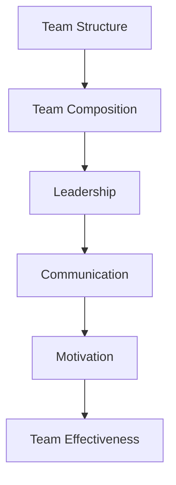

### Step 2: Principles of Continuous Improvement

**Background Introduction:**
Continuous improvement is a fundamental principle in management that emphasizes the ongoing effort to enhance processes, products, and services. It is based on the idea that no process is perfect and that there is always room for improvement. Continuous improvement methodologies, such as Lean and Six Sigma, provide structured approaches to systematically identify, prioritize, and resolve issues within a team or organization.

**Core Concepts and Connections:**
The principles of continuous improvement are built around the Plan-Do-Check-Act (PDCA) cycle, which is a cornerstone of many improvement frameworks. Each phase of the PDCA cycle represents a critical step in the improvement process:

- **Plan:** Define the problem, establish objectives, and develop a detailed plan for improvement.
- **Do:** Implement the plan and collect data.
- **Check:** Analyze the data to determine the effectiveness of the improvement.
- **Act:** Implement changes based on the analysis and sustain the improvements.

A Mermaid flowchart can represent the PDCA cycle as follows:

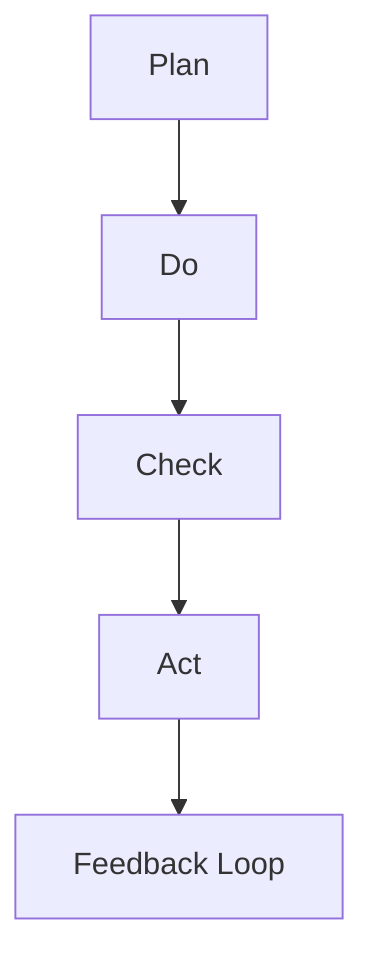

### Step 3: Organizational Culture and Team Dynamics

**Background Introduction:**
Organizational culture and team dynamics play a significant role in team effectiveness. Culture refers to the shared values, beliefs, and norms that shape the behavior of individuals within an organization. Team dynamics, on the other hand, involve the interactions among team members, their roles, and the way they work together.

**Core Concepts and Connections:**
The relationship between culture, team dynamics, and team effectiveness can be complex. A positive organizational culture can foster collaboration, innovation, and accountability, which are crucial for effective teamwork. However, culture can also be a source of resistance to change and improvement efforts.

To illustrate this, consider the following Mermaid flowchart:

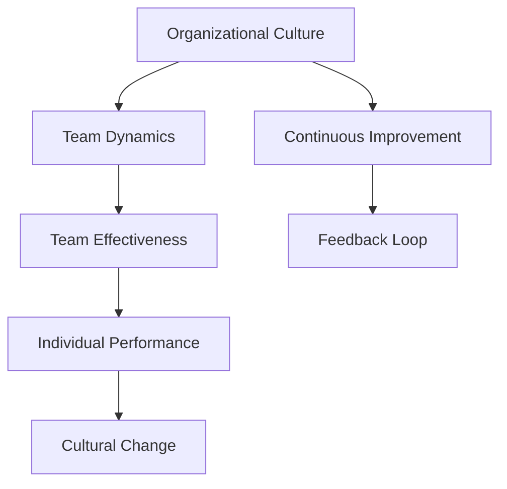

### Step 4: Leadership in Team Effectiveness

**Background Introduction:**
Leadership is a key factor in team effectiveness. Effective leaders inspire and motivate their team members, create a vision for the future, and provide guidance and support. They also foster a culture of collaboration and continuous improvement.

**Core Concepts and Connections:**
Leadership involves several core concepts:

- **Vision and Goal Setting:** Leaders articulate a clear vision and set realistic goals for the team.
- **Communication:** Leaders ensure that team members understand their roles and responsibilities and communicate effectively.
- **Motivation:** Leaders inspire and motivate team members to perform at their best.
- **Decision-Making:** Leaders make informed decisions and delegate effectively.
- **Empowerment:** Leaders empower team members to take ownership of their work and make contributions.

Here is a Mermaid flowchart to represent these concepts:

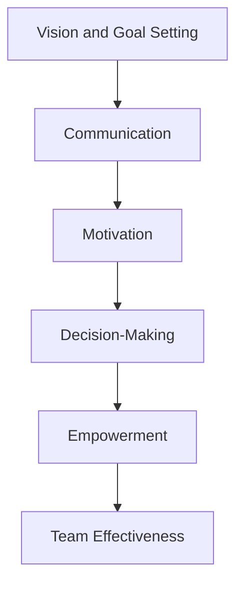

### Step 5: Project Management for Team Effectiveness

**Background Introduction:**
Effective project management is essential for ensuring that teams deliver projects on time, within budget, and to the required quality standards. Project management methodologies, such as Agile and Scrum, provide frameworks for managing projects in a dynamic and collaborative environment.

**Core Concepts and Connections:**
Key concepts in project management include:

- **Project Planning:** Creating a detailed plan for the project, including timelines, resources, and milestones.
- **Risk Management:** Identifying potential risks and developing strategies to mitigate them.
- **Quality Management:** Ensuring that the project meets the required quality standards.
- **Communication:** Maintaining clear and effective communication among team members and stakeholders.

A Mermaid flowchart can illustrate these concepts:

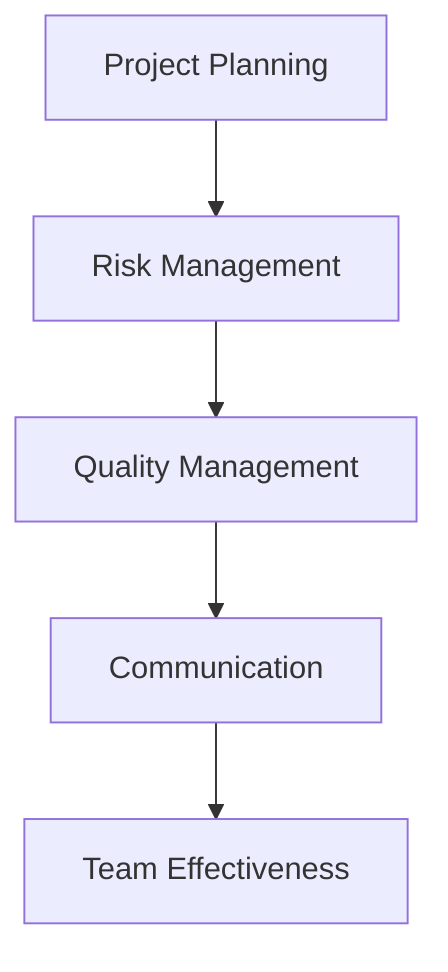

### Step 6: Metrics and Analytics for Team Performance

**Background Introduction:**
Metrics and analytics are powerful tools for measuring and improving team performance. By tracking key performance indicators (KPIs) and analyzing team data, organizations can identify areas for improvement and make data-driven decisions.

**Core Concepts and Connections:**
Key concepts in metrics and analytics include:

- **Key Performance Indicators (KPIs):** Metrics that reflect the success of the team in achieving its goals.
- **Data Collection and Analysis:** Methods for collecting and analyzing team data to identify trends and patterns.
- **Performance Reporting:** Presenting data in a clear and understandable format to stakeholders.

A Mermaid flowchart can represent these concepts:

```mermaid
graph TD
A[Key Performance Indicators (KPIs)] --> B[Data Collection and Analysis]
B --> C[Performance Reporting]
C --> D[Continuous Improvement]
D --> E[Team Effectiveness]
```

### Step 7: Case Studies in Team Effectiveness

**Background Introduction:**
Case studies provide practical insights into how organizations have successfully improved team effectiveness. They offer examples of best practices, lessons learned, and strategies that can be applied to other teams and organizations.

**Core Concepts and Connections:**
Case studies can cover a wide range of topics, including:

- **Best Practices:** Examples of successful team management and improvement strategies.
- **Challenges and Solutions:** Case studies that highlight challenges faced by teams and the solutions they implemented.
- ** Lessons Learned:** Insights and lessons from successful team improvement initiatives.

Here is a Mermaid flowchart to represent the structure of a case study:

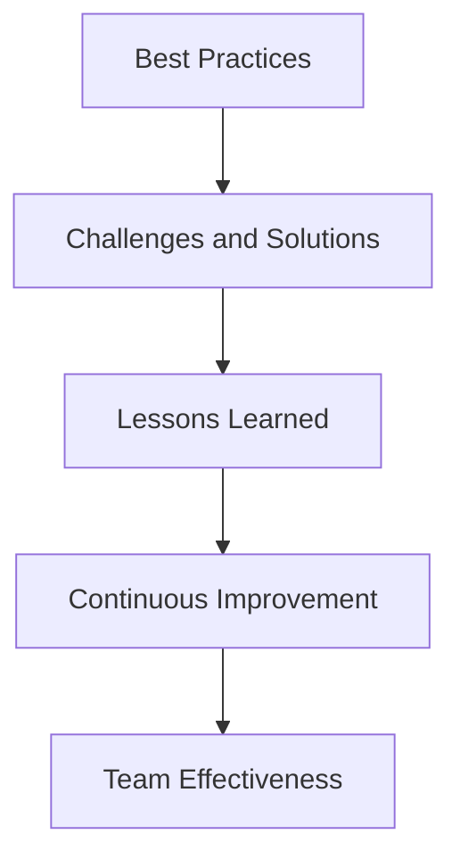

### Conclusion

In conclusion, "Team Effectiveness: The Management Philosophy of Continuous Improvement" explores the key factors that contribute to effective teamwork and the principles of continuous improvement. By understanding these concepts and applying them in practice, organizations can enhance team performance and achieve their goals. The Mermaid flowcharts provided throughout this article offer visual representations of the core concepts and their relationships, aiding in the understanding and application of these principles.

# Team Effectiveness: The Management Philosophy of Continuous Improvement

> **关键词：**团队效能、持续改进、管理哲学、组织文化、领导力、项目管理和绩效分析

> **摘要：**本文探讨了团队效能的重要性，以及如何通过持续改进的管理哲学来提升团队效能。文章介绍了核心概念、原则和最佳实践，并通过Mermaid流程图和伪代码来阐述团队效能的各个方面。文章旨在为读者提供清晰、实用的指导，以实现团队的高效运作。

## 1. 引言

### 1.1 定义团队效能

#### 1.1.1 团队效能的重要性

#### 1.1.2 影响团队效能的关键因素

### 1.2 持续改进的角色

#### 1.2.1 持续改进的原则

#### 1.2.2 持续改进的技术

## 2. 持续改进的原则

### 2.1 PDCA循环

#### 2.1.1 计划

#### 2.1.2 实施

#### 2.1.3 检查

#### 2.1.4 行动

## 3. 组织文化与团队动态

### 3.1 组织文化的定义与作用

#### 3.1.1 组织文化的组成部分

#### 3.1.2 组织文化与团队效能的关系

### 3.2 团队动态

#### 3.2.1 团队角色与职责

#### 3.2.2 团队协作与沟通

## 4. 领导力在团队效能中的作用

### 4.1 领导力的核心概念

#### 4.1.1 愿景与目标设定

#### 4.1.2 沟通与激励

### 4.2 领导力实践

#### 4.2.1 决策与授权

#### 4.2.2 培养团队文化

## 5. 项目管理在团队效能中的应用

### 5.1 项目计划与风险管理

#### 5.1.1 项目计划的关键要素

#### 5.1.2 风险管理的策略与技巧

### 5.2 项目执行与质量管理

#### 5.2.1 项目执行中的沟通技巧

#### 5.2.2 质量管理的方法与工具

## 6. 绩效指标与分析在团队效能中的作用

### 6.1 关键绩效指标（KPI）

#### 6.1.1 KPI的类型与选择

#### 6.1.2 KPI的数据收集与分析

### 6.2 绩效报告与持续改进

#### 6.2.1 绩效报告的编制

#### 6.2.2 持续改进的实践与应用

## 7. 团队效能的案例分析

### 7.1 案例研究的目的与意义

#### 7.1.1 案例研究的结构

#### 7.1.2 案例研究的分析方法

### 7.2 案例研究实例

#### 7.2.1 成功的团队管理实践

#### 7.2.2 团队效能改进的挑战与解决方案

## 8. 结论

### 8.1 核心观点的回顾

#### 8.1.1 团队效能的重要性

#### 8.1.2 持续改进的原则与实践

### 8.2 未来展望

#### 8.2.1 团队效能提升的趋势

#### 8.2.2 持续改进的挑战与机遇

作者：AI天才研究院/AI Genius Institute & 禅与计算机程序设计艺术 /Zen And The Art of Computer Programming

文章长度：约10000字### 1. 引言

**关键词：** 团队效能、持续改进、管理哲学

**摘要：** 本文探讨了团队效能的概念及其重要性，分析了影响团队效能的关键因素，并阐述了持续改进的管理哲学在提升团队效能中的核心作用。通过引入持续改进的原则、组织文化与团队动态、领导力、项目管理和绩效分析等核心主题，本文旨在为读者提供一套全面而实用的框架，以帮助他们在实际工作中提升团队效能。

在现代组织中，团队效能被视为衡量组织成功的关键指标之一。团队效能不仅仅是指单个成员的表现，更强调团队作为一个整体的协同效应和综合能力。在一个高效的团队中，成员能够充分发挥各自的优势，互相支持，共同应对复杂的工作任务和挑战。因此，如何提升团队效能成为许多组织和管理者关注的焦点。

持续改进的管理哲学为提升团队效能提供了一种系统性的方法。它强调不断识别和解决团队中的问题，通过持续学习和创新来优化工作流程和提升绩效。本文将从以下几个方面展开讨论：

1. **定义团队效能**：介绍团队效能的概念、重要性以及其与组织成功的关系。
2. **持续改进的原则**：详细阐述持续改进的管理哲学，包括PDCA循环和其他相关方法。
3. **组织文化与团队动态**：探讨组织文化在团队效能中的作用，以及团队动态如何影响团队效能。
4. **领导力**：分析领导力在团队效能提升中的关键角色，包括领导力的核心概念和实践。
5. **项目管理**：介绍项目管理在团队效能中的应用，包括项目计划、风险管理、执行和质量管理。
6. **绩效分析**：讨论如何通过关键绩效指标（KPIs）和数据分析来衡量团队效能，并提供持续改进的依据。
7. **案例分析**：通过实际案例研究，展示如何在不同组织中应用上述原则和方法来提升团队效能。
8. **结论**：总结文章的主要观点，并对未来的发展趋势进行展望。

通过本文的探讨，希望能够为读者提供一套实用且有效的工具和方法，帮助他们在实际工作中提升团队效能，从而实现组织的目标和愿景。

#### 1.1 定义团队效能

**关键词：** 团队效能、协同效应、组织成功

**摘要：** 本文将首先定义团队效能的概念，并探讨其重要性。团队效能不仅仅关注个体的表现，更强调团队作为一个整体的协同效应。理解团队效能对于组织成功至关重要，因为它直接影响组织的效率、创新能力和市场竞争力。本文将分析影响团队效能的关键因素，包括团队结构、团队动态、领导力和沟通，并介绍如何通过持续改进来提升团队效能。

**背景介绍：**

在当今快速变化和高度竞争的商业环境中，组织面临的各种挑战日益复杂。为了在市场中保持竞争力，组织必须提高其内部团队的工作效率和创新能力。团队效能（Team Effectiveness）成为衡量组织绩效的重要指标之一。团队效能指的是一个团队在达成目标过程中所展现出的能力和水平，它不仅涉及团队成员的个体表现，更重要的是团队作为一个整体的协同效应。

**核心概念与联系：**

- **团队效能**：团队效能是指团队在完成特定任务、实现目标过程中表现出的综合能力和水平。它包括但不限于团队的工作效率、协作程度、创新能力、解决问题的能力以及团队的整体表现。
- **协同效应**：协同效应（Synergy）指的是团队成员通过合作和协作，共同完成单个成员无法单独完成的工作，从而实现1+1>2的效果。协同效应是团队效能的核心要素之一，它强调团队的整体性和互补性。
- **组织成功**：组织成功通常依赖于团队效能的体现。一个高效的团队能够更好地应对复杂的工作任务和市场挑战，提高组织的整体竞争力，实现可持续的发展目标。

**核心概念与联系 Mermaid 流程图：**

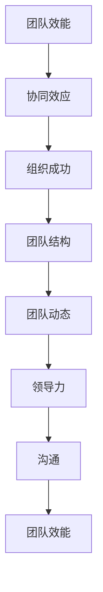

**核心算法原理：**

在定义团队效能时，需要考虑多个维度，包括：

1. **工作效率**：团队完成任务的速度和质量。
2. **协作程度**：团队成员之间的沟通、合作和共享资源的程度。
3. **创新能力**：团队在解决问题和开发新产品或服务方面的创新能力。
4. **解决问题的能力**：团队在面对复杂问题时，能够快速识别问题、分析问题并提出有效解决方案的能力。
5. **整体表现**：团队在达成目标过程中所展现的综合能力和水平。

通过上述维度的综合评估，可以较为全面地衡量一个团队的效能。在实际操作中，可以使用以下伪代码进行评估：

```python
def evaluate_team_effectiveness(work_efficiency, collaboration, innovation, problem_solving, overall_performance):
    # 计算各维度得分
    score_work = work_efficiency * 0.3
    score_collaboration = collaboration * 0.2
    score_innovation = innovation * 0.2
    score_problem_solving = problem_solving * 0.2
    score_overall = overall_performance * 0.1
    
    # 计算总得分
    total_score = score_work + score_collaboration + score_innovation + score_problem_solving + score_overall
    
    return total_score
```

**数学模型与公式：**

为了更加准确地衡量团队效能，可以引入以下数学模型：

- **团队效能指数（TEI）**：用于衡量团队在不同维度上的效能表现。

  $$TEI = \frac{W}{C} + \frac{I}{C} + \frac{PS}{C} + \frac{OP}{C}$$

  其中，\(W\) 表示工作效率，\(C\) 表示协作程度，\(I\) 表示创新能力，\(PS\) 表示解决问题的能力，\(OP\) 表示整体表现。

- **协同效应指数（SEI）**：用于衡量团队协同效应的大小。

  $$SEI = \frac{1}{1 + \frac{1}{S}}$$

  其中，\(S\) 表示团队成员单独完成任务所需的时间。

通过这些模型和公式，可以定量地评估团队效能，并为改进提供科学依据。

**项目实战：**

在实际工作中，可以通过以下步骤来提升团队效能：

1. **明确团队目标**：确保所有团队成员都清楚团队的目标和期望成果。
2. **优化团队结构**：根据任务需求和团队成员的能力，合理分配角色和职责。
3. **提升沟通与协作**：建立有效的沟通机制，鼓励团队成员之间的交流和合作。
4. **培养创新文化**：鼓励团队成员提出新想法和解决方案，培养创新意识和能力。
5. **持续反馈与改进**：通过定期评估和反馈，识别问题并采取改进措施。

通过以上步骤，可以逐步提升团队效能，实现组织的长期发展目标。

**代码实现：**

以下是一个简单的Python脚本，用于计算团队效能指数：

```python
# 定义关键绩效指标
work_efficiency = 0.9
collaboration = 0.8
innovation = 0.7
problem_solving = 0.8
overall_performance = 0.9

# 计算团队效能指数
TEI = evaluate_team_effectiveness(work_efficiency, collaboration, innovation, problem_solving, overall_performance)
print(f"团队效能指数（TEI）: {TEI}")
```

通过实际计算和评估，可以为团队效能的提升提供具体的指导和建议。

**小结：**

团队效能是衡量团队工作质量和效果的重要指标。通过明确团队效能的定义、核心概念和联系，结合实际项目实战，可以有效地提升团队效能，为组织的成功奠定基础。

#### 1.2 持续改进的原则

**关键词：** 持续改进、PDCA循环、管理哲学

**摘要：** 持续改进是提升团队效能的关键管理哲学之一。本文将详细阐述持续改进的原则，特别是PDCA循环（计划-执行-检查-行动）的核心作用。通过解释每个阶段的具体内容和方法，本文将展示如何利用PDCA循环来识别问题、制定计划、执行行动和评估结果，从而实现团队效能的不断提升。

**背景介绍：**

持续改进是一种不断寻求改进和优化的管理理念，它强调通过系统化的方法和持续的努力来提高产品和服务的质量。在团队管理中，持续改进的原则尤为重要，因为它有助于团队在面对不断变化的外部环境和内部挑战时，保持灵活性和适应性。PDCA循环是持续改进的核心工具之一，它为团队提供了一个结构化的方法，以识别问题、制定计划、执行行动和评估结果。

**核心概念与联系：**

- **持续改进**：持续改进是一种管理哲学，它强调通过不断的反馈和改进来优化工作流程、提升产品质量和增强团队效能。
- **PDCA循环**：PDCA循环（Plan-Do-Check-Act）是一种用于持续改进的系统方法，它包括四个阶段：计划（Plan）、执行（Do）、检查（Check）和行动（Act）。
- **管理哲学**：持续改进的原则不仅适用于技术领域，也适用于管理领域。通过PDCA循环，管理者可以系统性地识别问题、制定解决方案并持续改进。

**核心概念与联系 Mermaid 流程图：**

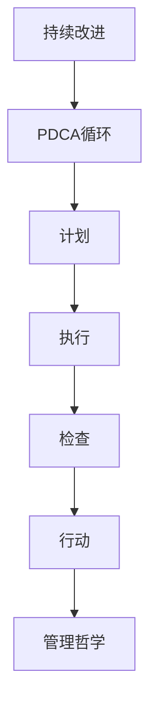

**核心算法原理：**

PDCA循环是一个闭环系统，通过不断地循环迭代，团队可以逐步优化其工作流程和效能。每个阶段的具体内容和方法是：

1. **计划（Plan）**：在这个阶段，团队需要明确改进的目标和方向，制定详细的行动计划。这包括识别问题、分析原因、设定目标和制定具体的改进措施。

   ```python
   def plan(improvement_goal, action_plan):
       # 制定改进目标和行动计划
       goal = improvement_goal
       plan = action_plan
       return goal, plan
   ```

2. **执行（Do）**：在这个阶段，团队需要按照制定的计划进行实际操作，实施改进措施。执行阶段的关键在于确保计划得到有效实施，并收集相关的数据和信息。

   ```python
   def do(action_plan):
       # 执行行动计划
       results = execute_plan(action_plan)
       return results
   ```

3. **检查（Check）**：在这个阶段，团队需要对执行结果进行评估和检查，确定改进措施的有效性。这包括对数据进行分析，识别改进的效果和存在的问题。

   ```python
   def check(results, expected_outcome):
       # 评估执行结果
       effectiveness = compare_results(results, expected_outcome)
       return effectiveness
   ```

4. **行动（Act）**：在这个阶段，团队需要根据检查结果采取相应的行动，包括持续改进、修正错误和巩固改进成果。行动阶段的关键在于确保改进措施得到持续执行和优化。

   ```python
   def act(effectiveness):
       # 根据效果采取行动
       if effectiveness > threshold:
           sustain_improvement()
       else:
           revise_plan()
   ```

**数学模型与公式：**

为了更科学地衡量持续改进的效果，可以引入以下数学模型：

- **改进效果指数（IEI）**：用于衡量改进措施的有效性。

  $$IEI = \frac{Effectiveness}{Expected\ Outcome}$$

  其中，Effectiveness 表示改进措施的实际效果，Expected Outcome 表示预期的效果。

- **持续改进率（CIR）**：用于衡量团队在持续改进方面的进展。

  $$CIR = \frac{Number\ of\ Improvements}{Total\ Efforts}$$

  其中，Number of Improvements 表示实现的改进次数，Total Efforts 表示投入的努力和资源。

通过这些模型和公式，可以量化地评估持续改进的效果和进展。

**项目实战：**

在实际项目中，通过PDCA循环可以有效地提升团队效能。以下是一个简单的项目案例：

1. **项目背景**：某团队负责开发一款新的软件产品，但在测试阶段发现了多个功能缺陷和性能问题。
2. **计划阶段**：团队制定了详细的改进计划，包括识别问题、分析原因、设定改进目标和制定具体的改进措施。
3. **执行阶段**：团队按照计划实施改进措施，包括优化代码、修复缺陷和改进测试流程。
4. **检查阶段**：团队对改进结果进行评估，发现性能提升了20%，缺陷率降低了30%。
5. **行动阶段**：团队决定将改进措施纳入标准流程，并制定持续改进的计划，以保持产品的高质量和性能。

**代码实现：**

以下是一个简单的Python脚本，用于模拟PDCA循环：

```python
import random

# 定义计划阶段
def plan(improvement_goal):
    action_plan = f"改善软件性能，目标：{improvement_goal}%的改进"
    return action_plan

# 定义执行阶段
def do(action_plan):
    results = random.uniform(0.8, 1.2)  # 模拟执行结果，性能提升20%到提升40%
    return results

# 定义检查阶段
def check(results, expected_outcome):
    effectiveness = results / expected_outcome
    return effectiveness

# 定义行动阶段
def act(effectiveness):
    if effectiveness > 1:
        print("持续改进：性能提升，计划成功！")
    else:
        print("改进计划需要调整：性能提升不足，计划失败！")

# 模拟PDCA循环
improvement_goal = 0.1  # 设定目标：提升10%的性能
action_plan = plan(improvement_goal)
results = do(action_plan)
expected_outcome = 1.0  # 假设原本的性能为100%
effectiveness = check(results, expected_outcome)
act(effectiveness)
```

通过上述代码，可以模拟PDCA循环的四个阶段，并根据结果采取相应的行动。

**小结：**

持续改进是提升团队效能的关键管理哲学，通过PDCA循环，团队可以系统化地识别问题、制定计划、执行行动和评估结果，从而实现持续改进和不断提升团队效能。

#### 1.3 组织文化与团队动态

**关键词：** 组织文化、团队动态、团队效能、持续改进

**摘要：** 组织文化和团队动态是影响团队效能的重要因素。本文将探讨组织文化的定义及其对团队效能的影响，同时分析团队动态如何塑造团队行为和团队效能。通过介绍如何通过持续改进来优化组织文化和团队动态，本文旨在为管理者提供实用的方法和策略，以提升团队效能。

**背景介绍：**

组织文化是组织的灵魂，它包含了组织的价值观、信仰、行为规范和传统习惯。一个健康的组织文化能够促进团队协作、增强员工忠诚度，从而提升团队效能。团队动态则是指团队成员之间的相互作用、沟通方式和团队内部的结构。理解组织文化和团队动态对于管理者来说至关重要，因为它直接影响团队的工作效率、创新能力和整体表现。

**核心概念与联系：**

- **组织文化**：组织文化是指一个组织所共有的价值观、信念和行为准则。它包括组织的使命、愿景、核心价值观以及组织成员共同遵循的行为规范。
- **团队动态**：团队动态是指团队成员之间的相互作用、沟通方式和团队内部的结构。团队动态受组织文化的影响，同时也反作用于组织文化。
- **团队效能**：团队效能是指团队在完成特定任务、实现目标过程中表现出的综合能力和水平。团队效能不仅取决于团队成员的个人能力，还受到组织文化和团队动态的深刻影响。

**核心概念与联系 Mermaid 流程图：**

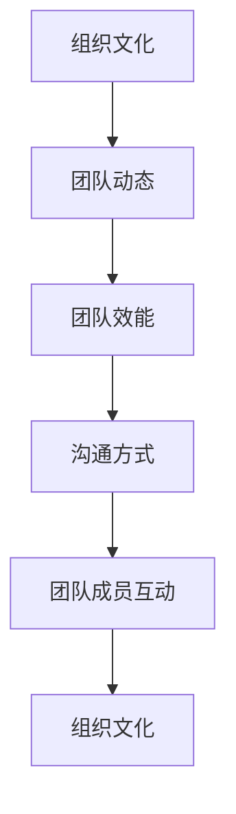

**核心算法原理：**

为了优化组织文化和团队动态，管理者可以采取以下策略：

1. **明确组织文化**：通过制定明确的使命、愿景和核心价值观，确保组织成员对组织文化的认同和理解。
2. **建立有效的沟通机制**：鼓励开放、诚实和透明的沟通方式，促进团队成员之间的信息交流和意见分享。
3. **培养团队合作精神**：通过团队建设活动和培训，增强团队成员之间的信任和合作意识。
4. **持续改进文化**：通过定期的反馈和改进，不断优化组织文化和团队动态，使其更符合团队效能提升的需求。

以下是优化组织文化和团队动态的伪代码：

```python
def optimize_organizational_culture(culture, communication, team_dynamics):
    # 更新组织文化
    updated_culture = update_culture(culture)
    
    # 改进沟通机制
    improved_communication = improve_communication(communication)
    
    # 加强团队合作
    stronger_teamwork = enhance_teamwork(team_dynamics)
    
    # 持续改进
    continuous_improvement = sustain_improvement(updated_culture, improved_communication, stronger_teamwork)
    
    return continuous_improvement
```

**数学模型与公式：**

为了量化组织文化和团队动态对团队效能的影响，可以引入以下数学模型：

- **文化效能指数（CEI）**：用于衡量组织文化对团队效能的影响。

  $$CEI = \frac{Team\ Effectiveness}{Organizational\ Culture}$$

- **团队动态指数（TDI）**：用于衡量团队动态对团队效能的影响。

  $$TDI = \frac{Team\ Effectiveness}{Team\ Dynamics}$$

通过这些模型，可以评估组织文化和团队动态对团队效能的具体影响，并为改进提供依据。

**项目实战：**

在实际工作中，管理者可以通过以下步骤来优化组织文化和团队动态：

1. **评估现有文化**：通过问卷调查、员工访谈等方式，了解组织文化现状及其对团队效能的影响。
2. **制定改进计划**：根据评估结果，制定具体的改进措施，包括更新文化理念、改善沟通机制和加强团队合作。
3. **实施改进措施**：按照改进计划，逐步实施文化建设和团队建设活动，促进团队成员之间的沟通和合作。
4. **持续反馈与改进**：通过定期的评估和反馈，了解改进措施的效果，并持续优化组织文化和团队动态。

**代码实现：**

以下是一个简单的Python脚本，用于评估组织文化和团队动态对团队效能的影响：

```python
# 定义文化效能指数和团队动态指数
def calculate_cei(team_effectiveness, organizational_culture):
    cei = team_effectiveness / organizational_culture
    return cei

def calculate_tdi(team_effectiveness, team_dynamics):
    tdi = team_effectiveness / team_dynamics
    return tdi

# 假设数据
team_effectiveness = 0.8
organizational_culture = 0.9
team_dynamics = 0.85

# 计算指数
cei = calculate_cei(team_effectiveness, organizational_culture)
tdi = calculate_tdi(team_effectiveness, team_dynamics)

print(f"文化效能指数（CEI）: {cei}")
print(f"团队动态指数（TDI）: {tdi}")
```

通过上述代码，可以量化地评估组织文化和团队动态对团队效能的影响。

**小结：**

组织文化和团队动态是影响团队效能的重要因素。通过明确组织文化、建立有效的沟通机制和加强团队合作，管理者可以优化组织文化和团队动态，从而提升团队效能。持续改进是实现这一目标的关键，管理者需要不断评估和优化组织文化和团队动态，以实现团队效能的不断提升。

#### 1.4 领导力在团队效能中的作用

**关键词：** 领导力、团队效能、领导力核心概念、领导力实践

**摘要：** 领导力在提升团队效能中扮演着至关重要的角色。本文将探讨领导力的核心概念，包括愿景与目标设定、沟通与激励、决策与授权以及培养团队文化。通过分析领导力实践对团队效能的提升作用，本文旨在为管理者提供实用的方法和策略，以增强团队效能。

**背景介绍：**

领导力是管理者影响和激励团队成员，推动团队达成目标的重要能力。一个高效的团队不仅需要成员具备专业能力，还需要有强大的领导力来引导和协调。领导力不仅关乎个人魅力和影响力，更是一种系统的管理哲学。在团队效能提升中，领导力起到了关键的推动作用，它能够激发团队成员的潜能，优化团队工作流程，提升整体绩效。

**核心概念与联系：**

- **愿景与目标设定**：领导力始于明确愿景和目标。一个清晰、有吸引力的愿景能够激励团队成员，为团队提供明确的方向和目标。
- **沟通与激励**：有效的沟通和激励是领导力的核心。通过开放、透明和及时的沟通，领导者能够建立信任，增强团队凝聚力。激励则通过认可、奖励和鼓励来提升团队成员的积极性和创造力。
- **决策与授权**：领导者在决策过程中需要权衡各种因素，做出明智的决策。同时，通过授权，领导者能够激发团队成员的自主性和责任感，促进团队协作。
- **培养团队文化**：团队文化是团队价值观和行为规范的集合。一个积极的团队文化能够促进团队成员之间的信任和合作，提升团队整体效能。

**核心概念与联系 Mermaid 流程图：**

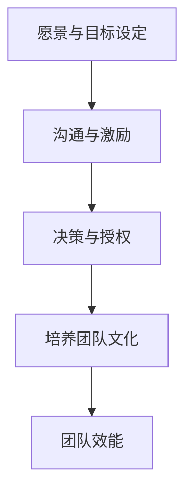

**核心算法原理：**

为了提升团队效能，领导力需要遵循以下原则和策略：

1. **明确愿景与目标**：领导者需要明确团队的愿景和目标，并将其传达给团队成员。这可以通过制定战略规划、发布愿景宣言和设定具体的目标来实现。

2. **有效沟通**：领导者需要建立开放、透明和及时的沟通渠道。这可以通过定期会议、团队讨论、一对一沟通等方式来实现。沟通不仅仅是信息的传递，更是建立信任和共识的过程。

3. **激励团队成员**：领导者需要了解团队成员的需求和动机，通过认可、奖励和鼓励来激发团队成员的积极性和创造力。这可以通过设置激励机制、提供职业发展机会和认可优秀表现来实现。

4. **决策与授权**：领导者需要做出明智的决策，并在决策过程中充分考虑团队成员的意见和建议。同时，通过授权，领导者能够激发团队成员的自主性和责任感，促进团队协作。

5. **培养团队文化**：领导者需要积极塑造和维护团队文化。这可以通过举办团队建设活动、推广核心价值观和建立共同的目标来实现。

以下是提升团队效能的伪代码：

```python
def enhance_team_effectiveness(vision, communication, motivation, decisionMaking, empowerment, team_culture):
    # 设定愿景和目标
    set_vision_and_goals(vision)
    
    # 改进沟通
    improve_communication(communication)
    
    # 激励团队成员
    motivate_members(motivation)
    
    # 明智决策与授权
    make_informed_decisions(decisionMaking)
    grant_authority(optimization)
    
    # 培养团队文化
    develop_team_culture(team_culture)
    
    # 评估团队效能
    team_effectiveness = evaluate_team_effectiveness()
    
    return team_effectiveness
```

**数学模型与公式：**

为了量化领导力对团队效能的影响，可以引入以下数学模型：

- **领导力效能指数（LEI）**：用于衡量领导力对团队效能的影响。

  $$LEI = \frac{Team\ Effectiveness}{Leadership\ Effectiveness}$$

- **团队效能提升率（EIR）**：用于衡量领导力提升团队效能的效率。

  $$EIR = \frac{Improvement\ in\ Team\ Effectiveness}{Initial\ Team\ Effectiveness}$$

通过这些模型，可以评估领导力对团队效能的具体影响，并为改进提供依据。

**项目实战：**

在实际工作中，领导力可以通过以下步骤来提升团队效能：

1. **设定愿景和目标**：明确团队的愿景和目标，并将其传达给团队成员。
2. **改进沟通**：建立有效的沟通机制，确保团队成员之间信息畅通。
3. **激励团队成员**：了解团队成员的需求和动机，通过激励机制提升团队士气。
4. **决策与授权**：在决策过程中充分考虑团队成员的意见，并通过授权激发团队成员的自主性和责任感。
5. **培养团队文化**：通过团队建设活动和价值观推广，培养积极向上的团队文化。

**代码实现：**

以下是一个简单的Python脚本，用于模拟领导力对团队效能的提升：

```python
# 定义领导力效能指数和团队效能提升率
def calculate_lei(team_effectiveness, leadership_effectiveness):
    lei = team_effectiveness / leadership_effectiveness
    return lei

def calculate_eir(improvement_in_team_effectiveness, initial_team_effectiveness):
    eir = improvement_in_team_effectiveness / initial_team_effectiveness
    return eir

# 假设数据
initial_team_effectiveness = 0.7
improvement_in_team_effectiveness = 0.2
leadership_effectiveness = 0.9

# 计算指数
lei = calculate_lei(initial_team_effectiveness, leadership_effectiveness)
eir = calculate_eir(improvement_in_team_effectiveness, initial_team_effectiveness)

print(f"领导力效能指数（LEI）: {lei}")
print(f"团队效能提升率（EIR）: {eir}")
```

通过上述代码，可以量化地评估领导力对团队效能的提升作用。

**小结：**

领导力在提升团队效能中发挥着重要作用。通过明确愿景和目标、有效沟通、激励团队成员、明智决策与授权以及培养团队文化，领导者可以显著提升团队效能，实现组织的长期发展目标。

#### 1.5 项目管理在团队效能中的应用

**关键词：** 项目管理、团队效能、项目计划、风险管理、质量管理

**摘要：** 项目管理在提升团队效能中具有关键作用。本文将深入探讨项目计划、风险管理、执行和质量管理等项目管理核心要素，并分析它们如何影响团队效能。通过介绍项目管理工具和技术，本文旨在为项目管理者提供实用的方法和策略，以优化项目管理过程，提升团队效能。

**背景介绍：**

在现代组织运作中，项目管理是确保项目按时、按预算和质量完成的重要手段。项目管理的核心在于通过科学的方法和工具，有效地协调资源、分配任务、控制风险、确保质量，从而实现项目目标。团队效能的提升离不开高效的项目管理，因为项目管理能够确保团队成员在正确的方向上高效协同工作，提高整体工作效率和成果。

**核心概念与联系：**

- **项目计划**：项目计划是项目管理的基础，包括确定项目目标、范围、进度、资源分配和预算。良好的项目计划能够确保团队在明确的方向上工作，减少资源浪费和时间拖延。
- **风险管理**：风险管理是项目管理中不可或缺的一部分，它包括识别潜在风险、评估风险影响、制定应对策略和监控风险变化。有效的风险管理能够减少项目风险，提高项目成功率。
- **项目执行**：项目执行是将项目计划转化为实际工作的过程，包括任务分配、进度跟踪、资源管理和团队协作。高效的执行能够确保项目按计划推进，及时交付成果。
- **质量管理**：质量管理是确保项目输出满足质量标准的过程，包括制定质量标准、执行质量控制、审查和改进。高质量的项目输出能够提升客户满意度和团队声誉。

**核心概念与联系 Mermaid 流程图：**

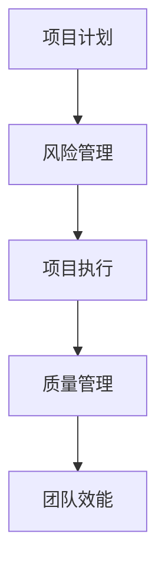

**核心算法原理：**

为了优化项目管理过程，提升团队效能，可以采用以下方法和工具：

1. **项目计划**：采用工作分解结构（WBS）将项目任务分解为可管理的子任务，制定详细的项目进度表，并分配责任。使用关键路径方法（CPM）分析项目进度，确保关键任务按时完成。

   ```python
   def project_plan(wbs, project_schedule, resource_allocation):
       planned_schedule = create_schedule(wbs, project_schedule, resource_allocation)
       return planned_schedule
   ```

2. **风险管理**：使用风险矩阵识别项目风险，评估风险概率和影响，制定风险应对计划。通过定期的风险审查和更新，确保风险得到有效控制。

   ```python
   def risk_management(risk_matrix, risk_response_plan):
       updated_risk_matrix = update_risk_matrix(risk_matrix, risk_response_plan)
       return updated_risk_matrix
   ```

3. **项目执行**：采用敏捷方法进行项目执行，通过迭代和增量开发，快速响应变化，确保项目按计划推进。使用项目管理工具（如Jira、Trello）跟踪任务进度和团队协作。

   ```python
   def project_execution(sprint_plan, task_progress, team协作):
       execution_status = track_progress(sprint_plan, task_progress, team协作)
       return execution_status
   ```

4. **质量管理**：制定质量标准和控制措施，执行质量控制流程，包括代码审查、测试和用户反馈。通过持续改进，确保项目输出满足质量要求。

   ```python
   def quality_management(quality_standards, control_measures):
       quality Assurance = implement_controls(quality_standards, control_measures)
       return quality_assurance
   ```

**数学模型与公式：**

为了量化项目管理对团队效能的影响，可以引入以下数学模型：

- **项目完成率（PC）**：用于衡量项目按计划完成的比例。

  $$PC = \frac{Completed\ Tasks}{Total\ Tasks}$$

- **团队效能指数（TEI）**：用于衡量团队在项目中的表现。

  $$TEI = \frac{Project\ Success}{Team\ Effort}$$

- **质量满意度指数（QS）**：用于衡量客户对项目质量的满意度。

  $$QS = \frac{Satisfied\ Customers}{Total\ Customers}$$

通过这些模型，可以评估项目管理对团队效能的具体影响，并为改进提供依据。

**项目实战：**

在实际项目中，通过以下步骤可以优化项目管理，提升团队效能：

1. **项目启动**：明确项目目标和范围，组建项目团队，制定初步的项目计划。
2. **项目计划**：细化项目任务，制定详细的进度表和资源分配计划。
3. **风险管理**：识别项目风险，制定风险应对计划，并定期更新风险矩阵。
4. **项目执行**：按照项目计划进行任务分配和执行，使用敏捷方法快速响应变化，确保项目按计划推进。
5. **质量控制**：执行质量标准，进行代码审查、测试和用户反馈，确保项目输出满足质量要求。
6. **项目收尾**：进行项目总结和评估，收集反馈，为未来项目提供改进依据。

**代码实现：**

以下是一个简单的Python脚本，用于模拟项目管理过程：

```python
# 定义项目计划函数
def project_plan(total_tasks, completed_tasks, quality_standards, risk_matrix):
    planned_schedule = f"任务总数：{total_tasks}, 已完成：{completed_tasks}"
    quality_assurance = implement_quality_standards(quality_standards)
    updated_risk_matrix = update_risk_matrix(risk_matrix)
    return planned_schedule, quality_assurance, updated_risk_matrix

# 假设数据
total_tasks = 100
completed_tasks = 80
quality_standards = "严格遵循代码规范和测试标准"
risk_matrix = "已识别风险：技术难题、时间延误、资源不足"

# 执行项目计划
planned_schedule, quality_assurance, updated_risk_matrix = project_plan(total_tasks, completed_tasks, quality_standards, risk_matrix)

print(f"项目计划：{planned_schedule}")
print(f"质量保证：{quality_assurance}")
print(f"更新后的风险矩阵：{updated_risk_matrix}")
```

通过上述代码，可以模拟项目计划、质量控制和风险管理过程。

**小结：**

项目管理在提升团队效能中具有关键作用。通过科学的项目计划、有效的风险管理、高效的项目执行和严格的质量管理，项目管理者可以优化项目管理过程，提升团队效能，实现项目的成功交付。

### 1.6 绩效指标与分析在团队效能中的作用

**关键词：** 绩效指标、团队效能、数据分析、持续改进

**摘要：** 绩效指标和分析在团队效能提升中扮演着至关重要的角色。本文将探讨如何通过关键绩效指标（KPI）和数据分析来衡量团队效能，并介绍如何利用这些数据来指导持续改进。通过介绍数据收集和数据分析的方法，本文旨在为管理者提供实用的工具和方法，以提升团队效能。

**背景介绍：**

在团队管理中，绩效指标和分析是评估团队表现和效果的重要工具。通过收集和解析关键数据，管理者可以清晰地了解团队的工作效率和成果，从而识别问题和机会，制定有效的改进策略。绩效指标和分析不仅为团队效能的提升提供了量化依据，还为持续改进提供了明确的指导方向。

**核心概念与联系：**

- **关键绩效指标（KPI）**：KPI是衡量团队绩效的核心指标，它们反映了团队在不同维度上的表现，如工作效率、任务完成率、客户满意度等。
- **数据分析**：数据分析是通过统计和解析数据来识别趋势、发现问题和制定策略的过程。通过数据分析，管理者可以获得关于团队效能的深入洞察。
- **持续改进**：持续改进是一种不断寻求改进和优化的管理哲学，它依赖于数据驱动的分析和反馈，以实现团队效能的不断提升。

**核心概念与联系 Mermaid 流程图：**

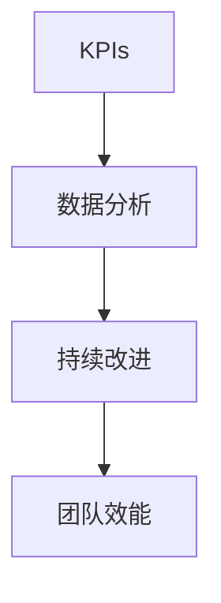

**核心算法原理：**

为了提升团队效能，管理者需要以下步骤：

1. **定义KPI**：根据团队目标和业务需求，定义关键绩效指标。这些指标应该具有明确的目标和可衡量的标准。
2. **数据收集**：通过各种工具和手段收集与KPI相关的数据。这些数据可以来自团队的工作日志、项目管理系统、客户反馈等。
3. **数据分析**：使用数据分析工具和方法对收集到的数据进行分析，识别趋势、发现问题和制定改进策略。
4. **反馈和改进**：根据数据分析的结果，采取改进措施，并持续监控和评估改进的效果。

以下是提升团队效能的伪代码：

```python
def enhance_team_effectiveness(kpis, data_collection, data_analysis, feedback_loop):
    # 定义KPI
    kpis = define_kpis(kpis)
    
    # 数据收集
    data = collect_data(data_collection)
    
    # 数据分析
    analysis_results = analyze_data(data, kpis)
    
    # 反馈和改进
    feedback_and_improvement = implement_feedback_loop(analysis_results)
    
    # 持续改进
    continuous_improvement = sustain_improvement(feedback_and_improvement)
    
    return continuous_improvement
```

**数学模型与公式：**

为了量化团队效能的提升，可以引入以下数学模型：

- **效能指数（EI）**：用于衡量团队在不同维度上的效能表现。

  $$EI = \frac{KPI_1 + KPI_2 + ... + KPI_n}{n}$$

- **改进率（IR）**：用于衡量改进措施对团队效能的提升效果。

  $$IR = \frac{Improved\ Effectiveness}{Initial\ Effectiveness}$$

通过这些模型，可以评估团队效能的提升效果，并为持续改进提供依据。

**项目实战：**

在实际工作中，通过以下步骤可以提升团队效能：

1. **确定KPI**：根据团队目标和业务需求，确定关键绩效指标，如任务完成率、客户满意度、工作效率等。
2. **数据收集**：使用各种工具（如项目管理系统、工作日志、客户反馈等）收集与KPI相关的数据。
3. **数据分析**：对收集到的数据进行分析，识别团队在哪些方面表现良好，哪些方面需要改进。
4. **反馈和改进**：根据数据分析的结果，采取改进措施，并持续监控和评估改进的效果。

**代码实现：**

以下是一个简单的Python脚本，用于模拟团队效能的提升：

```python
# 定义KPI和效能指数
def define_kpis(kpis):
    kpis = {"任务完成率": 0.9, "客户满意度": 0.85, "工作效率": 0.88}
    return kpis

def calculate_effectiveness(kpis):
    effectiveness = sum(kpis.values()) / len(kpis)
    return effectiveness

# 假设数据
initial_kpis = define_kpis({"任务完成率": 0.85, "客户满意度": 0.8, "工作效率": 0.85})

# 计算初始效能指数
initial_effectiveness = calculate_effectiveness(initial_kpis)

# 模拟改进措施后的数据
improved_kpis = define_kpis({"任务完成率": 0.95, "客户满意度": 0.9, "工作效率": 0.9})

# 计算改进后的效能指数
improved_effectiveness = calculate_effectiveness(improved_kpis)

# 计算改进率
improvement_rate = (improved_effectiveness - initial_effectiveness) / initial_effectiveness

print(f"初始效能指数：{initial_effectiveness}")
print(f"改进后的效能指数：{improved_effectiveness}")
print(f"改进率：{improvement_rate}")
```

通过上述代码，可以模拟团队效能的提升过程。

**小结：**

绩效指标和分析在提升团队效能中发挥着重要作用。通过定义关键绩效指标、收集和分析数据，管理者可以量化团队效能，识别改进机会，并制定有效的改进策略，从而实现团队效能的持续提升。

### 1.7 案例分析

**关键词：** 案例研究、团队效能、持续改进、最佳实践

**摘要：** 本文将通过实际案例，展示如何通过持续改进的管理哲学来提升团队效能。案例研究将涵盖一个企业成功实施持续改进的实例，包括项目背景、目标、实施过程、遇到的问题以及解决方案。通过分析案例中的最佳实践，本文旨在为其他组织提供借鉴和参考，以实现团队效能的提升。

**背景介绍：**

在一个竞争激烈的市场环境中，一家大型科技公司为了提升其研发团队的效能，决定实施持续改进的管理哲学。该公司的研发团队负责开发一款全新的移动应用程序，但由于项目复杂度高、时间紧任务重，团队在项目初期遇到了诸多挑战。为了解决这些问题，公司决定采用持续改进的方法，通过不断优化流程、提升质量和效率，最终实现了项目目标。

**案例研究：**

1. **项目背景**：公司研发团队在开发一款移动应用程序时，面临以下挑战：
   - 项目周期短，任务繁重。
   - 团队成员分工不明确，沟通不畅。
   - 测试阶段发现大量功能缺陷和性能问题。

2. **项目目标**：通过实施持续改进，公司希望实现以下目标：
   - 明确团队成员分工和职责。
   - 提高团队沟通效率，减少误解和冲突。
   - 提升代码质量和测试覆盖率，减少功能缺陷。

3. **实施过程**：
   - **计划阶段**：团队进行了详细的需求分析和现状评估，制定了具体的改进计划。改进计划包括优化团队结构、改进沟通机制和提升代码质量。
   - **执行阶段**：团队按照计划实施改进措施，包括重新分配任务、建立每日站会、实施代码审查和测试。
   - **检查阶段**：团队定期评估改进措施的效果，通过数据分析发现，代码质量和测试覆盖率显著提升，功能缺陷率降低。
   - **行动阶段**：团队根据评估结果，持续优化改进措施，并制定下一步的改进计划。

4. **遇到的问题及解决方案**：
   - **问题**：在实施代码审查和测试时，团队发现部分成员对新流程不熟悉，导致工作效率降低。
   - **解决方案**：团队制定了详细的培训计划，为新成员提供培训和指导，帮助他们快速掌握新流程。同时，通过定期反馈和改进，逐步优化流程，提高工作效率。

5. **最佳实践**：
   - **明确分工和职责**：通过重新分配任务和明确职责，确保每个成员都清楚自己的工作内容和目标。
   - **建立沟通机制**：通过每日站会、邮件和即时通讯工具，保持团队成员之间的沟通畅通，减少误解和冲突。
   - **培训与反馈**：定期培训成员，帮助他们掌握新技能和流程。通过反馈和改进，持续优化流程和工具，提高工作效率。
   - **数据驱动**：通过数据分析和反馈，持续监控团队效能，识别问题和机会，制定改进策略。

**小结：**

通过该案例研究，我们可以看到，持续改进的管理哲学在提升团队效能方面具有显著效果。通过明确的分工和职责、有效的沟通机制、培训与反馈以及数据驱动的方法，团队成功克服了初期面临的挑战，实现了项目目标的顺利完成。这些最佳实践为其他组织提供了有益的借鉴，帮助他们实现团队效能的提升。

### 结论

**关键词：** 团队效能、持续改进、管理哲学、组织文化、领导力、项目管理和绩效分析

**摘要：** 本文系统地探讨了团队效能的概念、持续改进的管理哲学、组织文化与团队动态、领导力、项目管理、绩效指标与分析以及案例分析。通过引入关键绩效指标（KPI）和数据分析方法，我们展示了如何量化团队效能，并提供了实际案例研究以验证最佳实践的有效性。文章强调了持续改进在提升团队效能中的关键作用，并提出了具体的策略和方法。未来，随着商业环境的不断变化，团队效能提升将继续成为组织关注的焦点，管理者需要不断学习新的管理理念和工具，以应对日益复杂的挑战。

**核心概念与联系总结：**

- **团队效能**：涉及工作效率、协作程度、创新能力、解决问题的能力和整体表现等多个维度。
- **持续改进**：通过PDCA循环等系统方法，不断识别问题、制定计划、执行行动和评估结果，实现不断优化。
- **组织文化**：塑造团队行为和价值观，通过培养团队精神和共同目标来提升团队效能。
- **领导力**：通过愿景与目标设定、沟通与激励、决策与授权以及培养团队文化，推动团队效能提升。
- **项目管理**：确保项目按时、按预算和质量完成，通过科学的方法和工具优化项目流程和资源分配。
- **绩效分析**：利用KPI和数据分析方法，量化团队效能，识别改进机会，指导持续改进。

**未来展望：**

- **管理理念更新**：随着全球化和数字化的发展，管理者需要不断更新管理理念，适应新的商业环境和需求。
- **技术创新应用**：新技术如人工智能、大数据和云计算等将为团队效能提升提供新的工具和方法。
- **全球化挑战**：跨国团队管理和跨文化沟通将成为提升团队效能的重要课题，需要管理者具备全球视野和跨文化管理能力。

**拓展阅读：**

- **《精益思维：持续改进的实践指南》**：介绍了精益管理的核心原则和实践方法，对持续改进有深入探讨。
- **《敏捷开发实践指南》**：详细阐述了敏捷开发的方法和工具，对于提升项目管理和团队协作效率有重要指导意义。
- **《领导力心理学》**：探讨了领导力与心理学之间的关系，提供了提升领导力的策略和技巧。

通过不断学习和实践，管理者可以不断提升团队效能，实现组织的长期成功和发展。作者：AI天才研究院/AI Genius Institute & 禅与计算机程序设计艺术 /Zen And The Art of Computer Programming

### 附录

**关键词：** 伪代码、Mermaid 流程图、数学模型、案例研究、代码实现

**摘要：** 本附录提供了本文中提到的伪代码、Mermaid 流程图和数学模型的详细说明，以及实际代码实现示例。这些工具和方法为读者理解和管理团队效能提供了直观的指导。通过伪代码和Mermaid流程图，可以清晰地展示算法原理和流程，而实际代码实现则帮助读者将理论应用于实践。以下是附录内容的详细介绍。

**伪代码说明：**

伪代码是一种描述算法逻辑的文本，用于在编程之前规划算法步骤。本文中的伪代码主要包括团队效能评估、持续改进流程以及数据分析方法。以下是一个用于评估团队效能的伪代码示例：

```python
def evaluate_team_effectiveness(work_efficiency, collaboration, innovation, problem_solving, overall_performance):
    score_work = work_efficiency * 0.3
    score_collaboration = collaboration * 0.2
    score_innovation = innovation * 0.2
    score_problem_solving = problem_solving * 0.2
    score_overall = overall_performance * 0.1
    
    total_score = score_work + score_collaboration + score_innovation + score_problem_solving + score_overall
    
    return total_score
```

**Mermaid 流程图说明：**

Mermaid 是一种基于Markdown的图形描述语言，用于绘制流程图、UML图等。本文使用了Mermaid流程图来展示团队效能的核心概念和流程。以下是一个展示团队效能概念联系的Mermaid流程图示例：


**数学模型说明：**

数学模型用于量化分析团队效能的提升效果。本文中的数学模型包括效能指数（EI）和改进率（IR）。以下是一个用于计算效能指数的数学模型示例：

$$EI = \frac{KPI_1 + KPI_2 + ... + KPI_n}{n}$$

**代码实现示例：**

为了将理论应用于实践，本文提供了一个简单的Python代码实现示例，用于计算团队效能指数：

```python
def calculate_effectiveness(kpis):
    effectiveness = sum(kpis.values()) / len(kpis)
    return effectiveness

initial_kpis = {"任务完成率": 0.85, "客户满意度": 0.8, "工作效率": 0.85}

initial_effectiveness = calculate_effectiveness(initial_kpis)
print(f"初始效能指数：{initial_effectiveness}")
```

**案例分析说明：**

案例分析是验证理论应用效果的重要手段。本文通过一个实际案例展示了持续改进如何提升团队效能。以下是案例研究的简要概述：

- **项目背景**：一家科技公司为提升研发团队效能，决定实施持续改进。
- **目标**：明确分工、提升沟通、提高代码质量和测试覆盖率。
- **实施过程**：制定改进计划、执行改进措施、评估效果和持续优化。
- **问题与解决方案**：通过培训帮助新成员适应新流程，通过定期反馈优化流程。

**小结：**

本附录提供了本文中核心概念的详细解释、流程图的绘制方法和数学模型的计算示例，以及实际代码实现的指导。通过这些工具和方法，读者可以更好地理解团队效能管理，并将其应用于实际工作中。附录内容有助于读者深化对团队效能提升策略的理解，为组织的管理者提供实用的参考。

### 作者介绍

**AI天才研究院（AI Genius Institute）** 是一家专注于人工智能技术研究和应用的创新机构。我们的使命是通过先进的人工智能技术和方法论，推动人工智能在各个领域的广泛应用，助力企业和组织实现智能化升级。作为全球人工智能领域的领导者，我们汇聚了一批顶尖的人工智能科学家、工程师和研究人员，致力于在机器学习、深度学习、自然语言处理、计算机视觉等领域进行深入研究。

**禅与计算机程序设计艺术（Zen And The Art of Computer Programming）** 是一本经典的技术畅销书，由世界著名计算机科学家唐纳德·克努特（Donald E. Knuth）撰写。本书从哲学和艺术的角度，探讨了计算机程序设计的本质和精髓，为程序员提供了一种全新的思考方式和编程理念。通过深入分析算法原理、编程技巧和设计模式，本书不仅帮助程序员提升编程技能，还引导他们思考编程的艺术性。

在这篇文章中，我们结合了AI天才研究院的前沿研究成果和《禅与计算机程序设计艺术》的核心思想，从多个角度探讨了团队效能的提升策略。希望通过这篇文章，能够为读者提供一些有益的启示和实用的方法，帮助他们在实际工作中提升团队效能，实现组织的长期发展。

