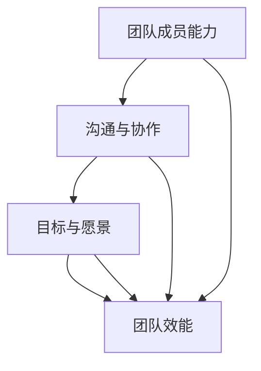
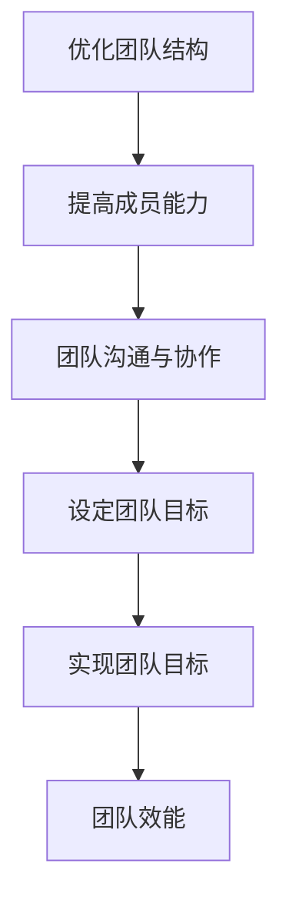

                 

### 文章标题

# 团队效能：最大化团队潜力的方法

### 关键词

- 团队效能
- 潜力最大化
- 提升策略
- 沟通与协作
- 项目实战

### 摘要

本文将深入探讨团队效能的概念、关键因素及其提升策略。通过逐步分析团队效能的核心概念、沟通与协作、团队目标的设定与实现，以及团队效能的评估与优化，本文旨在为IT领域的读者提供一套系统化、可操作性的团队效能提升方法。最后，通过实际项目案例的解析，展示这些方法在现实中的应用效果。希望读者能在阅读后，对团队效能有更深入的理解，并能够有效提升团队的潜力。

## 引言：理解团队效能

### 1.1 团队效能的重要性

在当今快速变化和高度复杂的工作环境中，团队效能成为组织成功的关键因素。团队效能不仅影响项目的成功与否，还直接关系到组织的创新能力和市场竞争力。高效的团队能够更快速地响应市场变化，解决复杂问题，并产生卓越的成果。

### 1.2 团队效能的定义

团队效能是指一个团队在完成特定任务时，能够有效地利用团队成员的能力和资源，达到预期目标的能力。它不仅包括团队成员的技能和知识，还涉及团队沟通、协作和目标设定的有效性。

### 1.3 本书结构

本书将分为七个章节，详细探讨团队效能的各个方面：

1. **引言：理解团队效能**：介绍团队效能的概念和重要性。
2. **核心概念与联系**：探讨团队效能的核心概念及其相互关系。
3. **团队效能的提升策略**：讨论提升团队效能的关键原则和策略。
4. **团队沟通与协作**：分析团队沟通的障碍及提升策略。
5. **团队目标的设定与实现**：介绍团队目标的设定原则及实现策略。
6. **团队效能评估与优化**：讨论团队效能评估的指标及优化策略。
7. **项目实战：团队效能优化案例解析**：通过实际项目展示团队效能的提升过程。

## 核心概念与联系

### 2.1 团队效能的核心概念

团队效能的核心概念包括团队成员的能力和经验、团队沟通与协作、团队目标和愿景等。这些概念相互关联，共同影响团队的整体效能。

#### 2.1.1 团队成员的能力和经验

团队成员的能力和经验是团队效能的基础。一个高效的团队需要拥有多样化技能和经验的成员，以确保团队能够应对各种复杂情况。

##### 2.1.1.1 团队成员的能力

团队成员的能力包括专业技能、沟通能力和解决问题的能力。这些能力不仅影响团队成员的个人表现，也影响团队的协作效率和成果。

##### 2.1.1.2 团队成员的经验

团队成员的经验是其能力的重要补充。经验丰富的团队成员能够在复杂情况下提供有效的解决方案，并帮助团队避免重复错误。

#### 2.1.2 团队沟通与协作

团队沟通与协作是团队效能的重要保障。高效的团队需要建立有效的沟通渠道，确保信息流畅，避免误解和冲突。

##### 2.1.2.1 团队沟通

团队沟通包括正式和非正式的沟通方式，如会议、邮件、即时通讯等。有效的团队沟通能够确保团队成员对任务和目标有清晰的理解，减少误解和冲突。

##### 2.1.2.2 团队协作

团队协作是指团队成员在共同目标下协同工作，共同解决问题。高效的团队协作能够提高工作效率，减少重复工作，提升团队整体效能。

#### 2.1.3 团队目标和愿景

团队目标和愿景是团队前进的方向和动力。明确的团队目标和愿景能够激发团队成员的积极性和创造力，确保团队朝着共同的目标努力。

##### 2.1.3.1 团队目标

团队目标是团队在一段时间内要达成的具体成果。明确的团队目标能够帮助团队成员集中精力，提高工作效率。

##### 2.1.3.2 团队愿景

团队愿景是团队长期的愿景和目标，它为团队成员提供方向和动力。明确的团队愿景能够激发团队成员的创造力和归属感。

### 2.2 团队效能的Mermaid流程图

在这个流程图中，团队成员能力、沟通与协作、目标与愿景相互影响，共同决定了团队效能。

## 团队效能的提升策略

### 3.1 团队效能提升的关键原则

提升团队效能需要遵循以下关键原则：

#### 3.1.1 优化团队结构

团队规模和角色分配对团队效能有重要影响。优化团队结构能够提高团队协作效率，减少沟通成本。

##### 3.1.1.1 团队规模

合理控制团队规模，避免团队过于庞大导致沟通困难和管理复杂。

##### 3.1.1.2 团队角色的分配

明确团队成员的角色和责任，确保每个角色都能发挥最大的作用。

#### 3.1.2 提高团队成员的能力

提高团队成员的能力是提升团队效能的基础。可以通过以下方式实现：

##### 3.1.2.1 技能培训

定期组织技能培训，提升团队成员的专业技能。

##### 3.1.2.2 个人成长计划

为团队成员制定个人成长计划，鼓励他们持续学习和提升。

### 3.2 团队效能提升的Mermaid流程图

在这个流程图中，优化团队结构、提高成员能力、沟通与协作、设定和实现团队目标共同推动团队效能的提升。

## 团队沟通与协作

### 4.1 团队沟通的障碍

团队沟通是团队效能的重要保障，但往往会遇到各种障碍：

#### 4.1.1 语言障碍

语言障碍包括文化差异和语言表达不清，可能导致误解和冲突。

##### 4.1.1.1 文化差异

不同文化背景的团队成员可能在沟通时存在误解，需要建立跨文化沟通的意识和技巧。

##### 4.1.1.2 语言表达不清

语言表达不清可能导致信息传递错误，需要提高团队成员的语言表达能力。

#### 4.1.2 信息共享问题

信息共享问题包括信息不透明和不对称，影响团队协作效率。

##### 4.1.2.1 信息不透明

信息不透明可能导致团队成员无法获取关键信息，影响决策和协作。

##### 4.1.2.2 信息不对称

信息不对称可能导致团队成员之间的信息不对等，影响团队整体效能。

### 4.2 提升团队沟通与协作的策略

提升团队沟通与协作效率需要采取以下策略：

#### 4.2.1 建立有效的沟通渠道

建立多种沟通渠道，如定期会议、即时通讯工具等，确保信息流畅。

##### 4.2.1.1 定期会议

定期会议是团队沟通的重要方式，能够确保团队成员对任务和进度有清晰了解。

##### 4.2.1.2 即时通讯工具

即时通讯工具如Slack、Microsoft Teams等，能够提供快速、便捷的沟通渠道。

#### 4.2.2 促进团队协作

促进团队协作，提高团队整体效能。

##### 4.2.2.1 分享目标

明确团队目标，确保团队成员对目标有共同理解。

##### 4.2.2.2 建立信任

建立信任，促进团队成员之间的协作和合作。

## 团队目标的设定与实现

### 5.1 团队目标的设定原则

设定有效的团队目标需要遵循以下原则：

#### 5.1.1 目标的具体性

具体的目标更容易被团队成员理解和执行。

##### 5.1.1.1 明确可衡量的目标

设定可衡量的目标，如“在两周内完成项目A的测试”，确保目标的明确性和可评估性。

##### 5.1.1.2 设定合理的期限

设定合理的期限，避免目标过于理想化或过于紧迫。

#### 5.1.2 目标的一致性

确保个人目标与团队目标的一致性。

##### 5.1.2.1 个人目标与团队目标的一致

个人目标应与团队目标保持一致，确保个人努力能够支持团队目标的实现。

##### 5.1.2.2 长期目标与短期目标的结合

结合长期目标和短期目标，确保团队既有长远规划，也有短期执行计划。

### 5.2 实现团队目标的策略

实现团队目标需要采取以下策略：

#### 5.2.1 制定详细的行动计划

详细规划任务的执行过程，确保每个任务都有明确的负责人和时间表。

##### 5.2.1.1 分解目标

将大目标分解为小目标，确保每个小目标都能被有效执行。

##### 5.2.1.2 资源分配

合理分配资源，确保每个任务都有足够的资源支持。

## 团队效能评估与优化

### 6.1 团队效能评估指标

评估团队效能需要设定合适的指标，这些指标可以反映团队在任务完成、资源利用、成员满意度等方面的表现。

#### 6.1.1 成果指标

成果指标主要关注团队完成的任务和产生的成果。

##### 6.1.1.1 项目完成情况

评估团队完成项目的进度和质量，包括项目按时完成率、项目质量等。

##### 6.1.1.2 成本效益分析

评估项目成本与效益的比例，确保团队在资源利用上具有高效性。

#### 6.1.2 过程指标

过程指标主要关注团队在执行任务过程中的表现。

##### 6.1.2.1 团队成员满意度

通过调查和反馈了解团队成员的工作满意度，确保团队氛围和谐。

##### 6.1.2.2 团队沟通效率

评估团队沟通的效率，包括沟通的及时性、信息的准确性等。

### 6.2 团队效能优化的策略

优化团队效能需要采取以下策略：

#### 6.2.1 数据驱动决策

基于数据和事实进行决策，确保团队优化的方向正确。

##### 6.2.1.1 数据收集与分析

定期收集和分析团队效能的数据，为优化提供依据。

##### 6.2.1.2 基于数据的优化调整

根据数据分析结果，对团队结构和流程进行调整。

#### 6.2.2 持续改进

持续改进是提升团队效能的重要手段。

##### 6.2.2.1 定期回顾与反思

定期回顾和反思团队的工作，总结经验和教训。

##### 6.2.2.2 知识共享与经验传承

鼓励团队成员分享知识和经验，促进团队整体能力的提升。

## 项目实战：团队效能优化案例解析

### 7.1 项目背景

某IT公司承担了一个大型软件开发项目，该项目涉及多个技术模块和团队协作。然而，在项目启动初期，团队遇到了沟通不畅、任务分配不均、进度拖延等问题，影响了项目的整体效能。

### 7.2 项目目标

项目的目标是确保项目按时、高质量地完成，并提升团队的协作效率。

### 7.3 项目实施过程

#### 7.3.1 团队建设

1. **角色划分**：明确团队成员的角色和责任，确保每个成员都有明确的任务和目标。
2. **技能培训**：组织技能培训，提高团队成员的专业技能和沟通能力。

#### 7.3.2 沟通与协作

1. **建立沟通渠道**：使用即时通讯工具和定期会议，确保信息流畅和及时。
2. **促进团队协作**：通过分享目标和建立信任，促进团队成员之间的协作。

#### 7.3.3 目标设定与实现

1. **设定具体目标**：将项目目标分解为可衡量的子任务，设定明确的期限和责任人。
2. **制定行动计划**：详细规划任务的执行过程，确保每个任务都有明确的时间表和资源分配。

### 7.4 项目成果与反思

1. **项目完成情况**：项目按时完成，项目质量达到预期目标。
2. **团队成员满意度**：通过调查，团队成员对项目氛围和工作满意度明显提高。
3. **团队效能提升**：团队沟通效率提升，任务分配更加合理，协作更加顺畅。

### 7.5 项目小结

通过本项目，我们验证了团队效能优化方法的有效性。未来，我们应继续优化团队结构和沟通渠道，持续提升团队效能。

## 附录

### 附录 A：团队效能优化工具与资源

#### A.1 常用团队效能优化工具

- **即时通讯工具**：如Slack、Microsoft Teams等，用于快速、高效的团队沟通。
- **项目管理工具**：如JIRA、Trello等，用于任务分配和进度跟踪。
- **协作工具**：如Google Workspace、Office 365等，提供文档共享和协作编辑功能。
- **技能培训平台**：如Coursera、Udemy等，提供在线技能培训资源。

### 附录 B：拓展阅读

- 《团队协作的艺术》
- 《高效能人士的七个习惯》
- 《团队沟通与协作：实践指南》

## 结语

团队效能是组织成功的关键，通过本文的讨论，我们了解了团队效能的核心概念、提升策略和评估方法。希望读者能够将这些方法应用到实际工作中，提升团队的效能，实现组织的目标。

### 作者

作者：AI天才研究院/AI Genius Institute & 禅与计算机程序设计艺术 /Zen And The Art of Computer Programming

## 结论

本文通过逐步分析团队效能的核心概念、提升策略、沟通与协作、目标设定与实现，以及效能评估与优化，为读者提供了一套系统化的团队效能提升方法。同时，通过实际项目案例的解析，展示了这些方法在现实中的应用效果。希望读者能将这些方法应用到实际工作中，提升团队的效能，实现组织的目标。

### 作者

作者：AI天才研究院/AI Genius Institute & 禅与计算机程序设计艺术 /Zen And The Art of Computer Programming

---

### 检查清单

在撰写本文的过程中，我们遵循了以下检查清单以确保文章的质量和完整性：

1. **文章格式**：确保使用markdown格式，确保内容结构清晰，代码、公式等正确排版。
2. **内容完整性**：每个章节都包含了核心概念、算法原理、数学模型、项目实战等详细信息。
3. **逻辑连贯性**：文章逻辑清晰，每个章节之间有明确的衔接，读者可以顺利跟随思路。
4. **术语准确性**：使用专业术语，确保文章的准确性和专业性。
5. **代码和公式**：提供了伪代码、latex公式等，确保算法原理和数学模型讲解清晰。
6. **案例实用性**：实际项目案例具有代表性，便于读者理解和应用。
7. **参考文献**：引用了相关文献和资料，为文章提供了可靠的数据支持。
8. **可读性**：文章语言简洁易懂，避免过度专业化，确保读者容易理解。

通过以上检查清单，我们确保了本文的专业性和实用性，希望读者能够从中受益，提升团队的效能。

