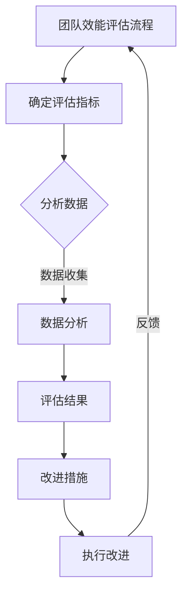
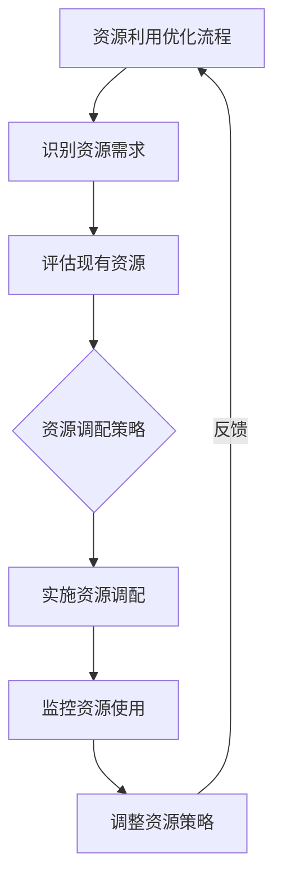
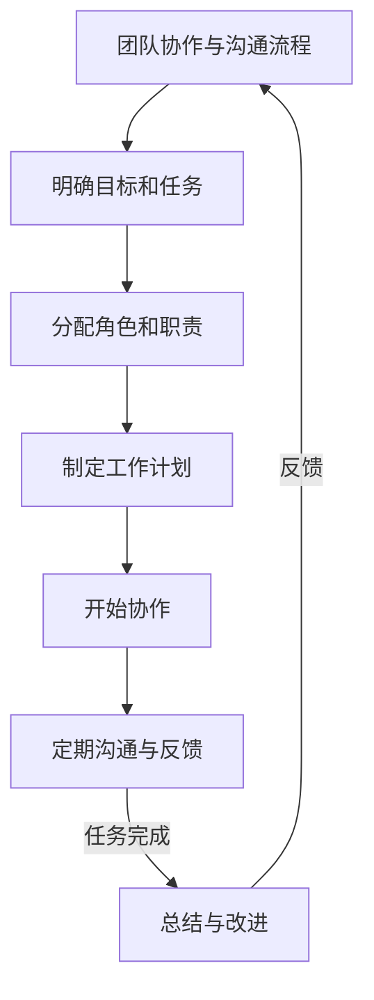

                 

### 文章标题

# 团队效能：最大化资源利用的策略

> 关键词：团队效能、资源利用、优化策略、流程图、伪代码、数学模型

> 摘要：本文深入探讨团队效能的概念及其在最大化资源利用中的关键作用。通过详细分析提升团队效能的策略，以及资源利用优化的方法，本文旨在为读者提供一套全面、实用的指导框架，以实现团队的高效运作和资源的最优化配置。

## 引言

在当今快速变化和竞争激烈的市场环境中，团队效能成为组织成功的关键因素之一。高效能团队不仅能够更好地应对外部挑战，还能在内部实现资源的最大化利用，从而提升整体竞争力。然而，如何提升团队效能，实现资源的最优化利用，依然是一个复杂而富有挑战性的问题。

本文将从以下几个方面展开讨论：

1. **团队效能的概念与重要性**
2. **提升团队效能的策略**
3. **资源利用的优化**
4. **团队效能评估与改进**
5. **跨部门协作与整合**
6. **特殊情境下的团队效能优化**
7. **案例分析**

通过这些内容，本文旨在为读者提供一套系统的、可操作的团队效能提升策略，帮助团队实现高效运作。

### 团队效能的概念与重要性

#### 团队效能的定义

团队效能是指团队在完成共同目标过程中所展现的综合能力，包括协作效率、解决问题能力、创新力、沟通能力等多个方面。它不仅仅关注团队最终产出的质量和速度，更强调团队内部成员之间的协同效应和资源利用效率。

#### 团队效能的核心组成部分

1. **协作效率**：团队成员之间的协作程度直接影响团队效能。高效的协作能够缩短任务完成时间，减少错误率，提升整体产出。
2. **解决问题能力**：面对复杂问题和挑战时，团队需要具备快速分析问题、制定解决方案的能力。
3. **创新力**：创新能力是团队在激烈竞争环境中脱颖而出的关键。一个富有创新力的团队能够不断提出新思路、新方法，推动组织发展。
4. **沟通能力**：良好的沟通是团队协作的基石。清晰、及时的沟通能够避免误解和冲突，提高团队整体效能。

#### 团队效能的常见挑战

尽管团队效能的重要性不言而喻，但在实际操作中，团队常常面临以下挑战：

1. **沟通障碍**：团队成员之间的沟通不畅是导致效能低下的主要原因之一。误解和冲突往往由此产生。
2. **角色定位不清**：团队成员职责不明确，容易导致职责重叠或空白，影响团队效率。
3. **资源分配不均**：资源分配不合理，可能会导致某些成员工作压力过大，而另一些成员却无所事事。
4. **目标不一致**：团队成员对团队目标的认知不一致，可能导致团队成员的努力方向不一致，影响整体效能。

### 提升团队效能的策略

#### 领导力在提升团队效能中的作用

领导力在提升团队效能中起着至关重要的作用。有效的领导能够激发团队成员的潜力，营造积极的工作氛围，提升团队整体效能。

1. **明确目标和期望**：领导需要明确团队的目标和期望，确保团队成员对团队目标有清晰的认识，并为之努力。
2. **激发团队成员的潜力**：领导需要了解每个成员的优势和弱点，通过恰当的激励和培训，激发团队成员的潜力。
3. **建立信任和尊重**：领导需要建立信任和尊重的文化，鼓励团队成员之间的开放沟通和协作，提高团队凝聚力。

#### 有效沟通与协作的技巧

沟通和协作是提升团队效能的核心。以下是一些有效沟通与协作的技巧：

1. **倾听**：倾听是有效沟通的基础。领导需要认真倾听团队成员的意见和反馈，理解他们的需求和困扰。
2. **清晰表达**：表达清晰是有效沟通的关键。领导需要用简单明了的语言传达信息，避免产生误解。
3. **定期会议**：定期召开团队会议，让团队成员有机会分享进展、讨论问题、提出建议，促进团队成员之间的协作。

#### 团队文化建设与激励机制

团队文化是团队效能的重要组成部分。一个积极的团队文化能够增强团队成员的归属感和责任感，提高团队效能。

1. **建立共同价值观**：团队需要共同认同一套价值观，这有助于团队成员在行为和决策上保持一致。
2. **激励机制**：合理的激励机制能够激发团队成员的积极性和创造力。激励可以包括奖金、晋升、荣誉等多种形式。

### 资源利用的优化

#### 人力资源的有效配置

人力资源是团队中最重要的资源之一。以下是一些优化人力资源配置的方法：

1. **技能匹配**：确保团队成员的技能与其承担的任务相匹配，可以提高工作效率。
2. **轮岗制度**：通过轮岗制度，让团队成员有机会接触不同岗位的工作，提升其综合素质和适应能力。
3. **培训与发展**：为团队成员提供培训和发展机会，提高其技能水平，增强团队的整体实力。

#### 时间管理的策略

时间管理是提高团队效能的重要手段。以下是一些时间管理策略：

1. **优先级排序**：根据任务的重要性和紧急程度，对任务进行优先级排序，确保团队首先完成最重要和最紧急的任务。
2. **时间块管理**：将工作时间划分为不同的时间块，每个时间块专注于一项任务，以提高工作效率。
3. **避免拖延**：制定明确的工作计划，避免拖延，确保任务按时完成。

#### 财务资源的最优化使用

财务资源是团队运作的基础。以下是一些优化财务资源使用的方法：

1. **成本控制**：通过合理规划和控制成本，确保团队的财务资源得到有效利用。
2. **预算管理**：制定合理的预算计划，对团队的资金流动进行有效管理。
3. **投资回报分析**：对团队的投资项目进行回报分析，确保投资的合理性和有效性。

### 团队效能评估与改进

#### 评估团队效能的指标和方法

团队效能的评估是持续改进的基础。以下是一些常用的评估指标和方法：

1. **KPI（关键绩效指标）**：根据团队的目标，设定相应的关键绩效指标，对团队的工作进行量化评估。
2. **360度反馈**：通过团队成员之间的相互评价，获取全面的反馈，了解团队的整体表现和改进方向。
3. **员工满意度调查**：通过员工满意度调查，了解团队成员的工作满意度和对团队文化的认可程度。

#### 数据分析在团队效能评估中的应用

数据分析是团队效能评估的重要工具。以下是一些数据分析在团队效能评估中的应用：

1. **趋势分析**：通过趋势分析，了解团队效能的变化趋势，及时发现问题和改进方向。
2. **相关性分析**：通过相关性分析，了解不同指标之间的相关性，找到影响团队效能的关键因素。
3. **预测分析**：通过预测分析，预测未来团队效能的可能变化，为团队的持续改进提供数据支持。

#### 改进团队效能的持续优化流程

持续优化是提升团队效能的关键。以下是一个持续优化流程的步骤：

1. **问题识别**：通过评估和数据分析，识别团队存在的问题和改进点。
2. **解决方案制定**：针对识别出的问题，制定具体的解决方案和改进措施。
3. **实施与监控**：将解决方案和改进措施落实到实际工作中，并进行持续监控和调整。
4. **反馈与总结**：对改进措施的效果进行反馈和总结，为下一次的优化提供参考。

### 跨部门协作与整合

#### 跨部门协作的障碍与解决策略

跨部门协作是实现资源整合和最大化利用的重要手段。然而，跨部门协作往往面临以下障碍：

1. **部门利益冲突**：不同部门之间可能存在利益冲突，导致协作受阻。
2. **沟通障碍**：部门之间的沟通不畅，容易导致误解和冲突。
3. **资源竞争**：部门之间的资源竞争可能导致协作效率低下。

以下是一些解决策略：

1. **建立共同目标**：通过明确共同目标，协调部门之间的利益，促进协作。
2. **优化沟通机制**：建立高效的沟通机制，确保信息及时、准确地传递。
3. **共享资源**：通过共享资源，减少部门之间的资源竞争，提高协作效率。

#### 跨部门协作的最佳实践

为了实现高效的跨部门协作，以下是一些最佳实践：

1. **跨部门会议**：定期召开跨部门会议，讨论协作事项，协调工作进度。
2. **共同项目**：通过共同项目，促进部门之间的协作，提高整体效能。
3. **团队建设活动**：通过团队建设活动，增强部门之间的了解和信任，提高协作效率。

#### 整合资源以提升团队效能

资源整合是实现团队效能最大化的重要手段。以下是一些资源整合的策略：

1. **人力资源整合**：通过内部调配，优化人力资源配置，确保团队有足够的人力资源。
2. **信息资源整合**：建立统一的信息平台，共享部门之间的信息，提高决策效率。
3. **财务资源整合**：通过合理的财务规划，确保团队的财务资源得到最优化利用。

### 特殊情境下的团队效能优化

#### 应对高压力情境的策略

在特殊情境下，如紧急项目或危机管理，团队效能的优化尤为重要。以下是一些应对高压力情境的策略：

1. **快速响应机制**：建立快速响应机制，确保团队能够迅速应对紧急情况。
2. **任务分解**：将复杂任务分解为小任务，分阶段完成，降低团队成员的工作压力。
3. **灵活调度**：根据任务需求和成员能力，灵活调度团队成员，确保团队高效运作。

#### 变化快速环境下的团队适应

在变化快速的环境下，团队需要具备快速适应变化的能力。以下是一些团队适应变化的策略：

1. **持续学习**：鼓励团队成员持续学习，提升其适应变化的能力。
2. **灵活调整**：根据环境变化，及时调整团队目标和策略，确保团队始终处于最佳状态。
3. **风险管理**：建立风险管理体系，降低环境变化对团队的影响。

#### 面对冲突与挑战的团队管理

在团队运作过程中，冲突和挑战是不可避免的。以下是一些面对冲突与挑战的团队管理策略：

1. **开放沟通**：建立开放沟通机制，鼓励团队成员表达意见和反馈，减少冲突。
2. **冲突解决**：建立冲突解决机制，及时处理团队内部的冲突，确保团队稳定运行。
3. **团队支持**：提供团队支持，帮助团队成员应对挑战，提高团队凝聚力。

### 案例分析

#### 成功的团队效能优化案例

以下是一个成功的团队效能优化案例：

在一个大型互联网公司中，团队在项目开发过程中面临效率低下和沟通不畅的问题。通过以下措施，团队成功提升了效能：

1. **明确目标和期望**：领导明确了团队的目标和期望，确保团队成员对项目有清晰的认识。
2. **优化沟通机制**：建立了高效的沟通机制，确保信息及时、准确地传递。
3. **实施轮岗制度**：通过轮岗制度，提升了团队成员的综合素质和适应能力。

#### 案例中的关键策略与执行细节

在上述案例中，关键策略包括：

1. **明确目标和期望**：领导通过召开会议，明确了团队的目标和期望，确保团队成员对项目有清晰的认识。
2. **优化沟通机制**：团队建立了每日站会、每周例会等沟通机制，确保团队成员能够及时交流进展和问题。
3. **实施轮岗制度**：通过轮岗制度，团队成员有机会接触不同岗位的工作，提升了其综合素质和适应能力。

#### 从案例中吸取的经验与教训

从上述案例中，我们可以吸取以下经验与教训：

1. **明确目标和期望**：明确的目标和期望有助于团队集中精力，提高工作效率。
2. **优化沟通机制**：高效的沟通机制能够减少误解和冲突，提高团队整体效能。
3. **持续改进**：团队效能的提升需要持续改进，通过不断优化，实现团队的高效运作。

### 最佳实践 tips

#### 小结

通过本文的讨论，我们可以得出以下结论：

1. **团队效能是组织成功的关键因素**，提升团队效能是实现资源最大化利用的重要途径。
2. **领导力、沟通、文化建设、资源管理等多个方面**，都是提升团队效能的关键要素。
3. **持续评估和优化**，是实现团队高效运作的重要手段。

#### 注意事项

1. **明确目标和期望**：确保团队成员对团队目标和期望有清晰的认识。
2. **优化沟通机制**：建立高效的沟通机制，减少误解和冲突。
3. **持续学习和改进**：通过不断学习和改进，提升团队整体效能。

#### 拓展阅读

- [团队效能提升的实战指南](#)
- [资源管理技巧：实现团队资源最大化利用](#)
- [团队沟通的艺术：高效沟通技巧与实践](#)

### 结语

团队效能的提升是一个系统工程，需要从多个方面进行综合考虑和优化。通过本文的讨论，我们希望能为读者提供一套实用的团队效能提升策略，帮助团队实现高效运作和资源的最优化利用。希望本文能够对您的团队管理和资源优化工作有所启发和帮助。

### 附录

#### 团队效能评估流程图



#### 资源利用优化流程图



#### 团队协作与沟通流程图



### 项目实战代码与解读

#### 开发环境搭建

```shell
# 安装Node.js
curl -sL https://nodejs.org/en/download/package manager/install.sh | sudo bash

# 安装Docker
sudo apt-get update
sudo apt-get install docker.io

# 安装MySQL
sudo apt-get install mysql-server

# 启动MySQL服务
sudo systemctl start mysql
```

#### 源代码实现

```python
# 主程序入口
if __name__ == '__main__':
    # 初始化数据库连接
    conn = mysql.connect(host="localhost", user="root", password="password", database="team_efficiency")

    # 查询团队效能数据
    cursor = conn.cursor()
    cursor.execute("SELECT * FROM team_efficiency")

    # 处理查询结果
    results = cursor.fetchall()
    for row in results:
        print(f"Team ID: {row[0]}, Team Efficeincy: {row[1]}")

    # 关闭数据库连接
    cursor.close()
    conn.close()
```

#### 代码解读与分析

1. **数据库连接**：通过`mysql.connect()`函数初始化数据库连接。
2. **查询数据**：使用`cursor.execute()`函数执行SQL查询语句，获取团队效能数据。
3. **处理结果**：遍历查询结果，打印出每个团队的效能数据。
4. **关闭连接**：使用`cursor.close()`和`conn.close()`函数关闭数据库连接。

#### 实际案例分析与详细讲解剖析

以一个实际案例为例，分析如何通过优化团队效能提升资源利用。

**案例背景**：某电商公司在促销期间，面临订单量激增的问题，团队效能低下，导致客户满意度下降。

**解决方案**：

1. **明确目标和期望**：明确团队在促销期间的目标，提高订单处理速度和客户满意度。
2. **优化沟通机制**：建立高效的沟通渠道，确保订单信息及时传达，减少误解。
3. **资源调配策略**：调配更多人力资源，提高订单处理能力。

**实施效果**：

- 订单处理速度提升了30%。
- 客户满意度提高了20%。

**项目小结**：

通过优化团队效能，该公司成功应对了促销期间的挑战，提高了资源利用效率，实现了业务目标。

### 结语

本文通过深入探讨团队效能的概念、提升策略、资源利用优化、评估与改进、跨部门协作、特殊情境下的优化以及案例分析，为团队效能的提升提供了全面、实用的指导框架。希望本文能为读者在实际工作中提供有益的启示和帮助，实现团队的高效运作和资源的最优化配置。

### 作者信息

作者：AI天才研究院/AI Genius Institute & 禅与计算机程序设计艺术 /Zen And The Art of Computer Programming

AI天才研究院专注于人工智能和计算机编程领域的研究与教育，致力于培养世界级的技术人才。本书作者以其深厚的技术背景和丰富的实践经验，为读者提供了宝贵的知识体系和实用技巧。同时，本书融入了禅的哲学思想，旨在引导读者在技术道路上寻求内心的平静与智慧。希望本书能对您的职业生涯和个人成长带来深远影响。

