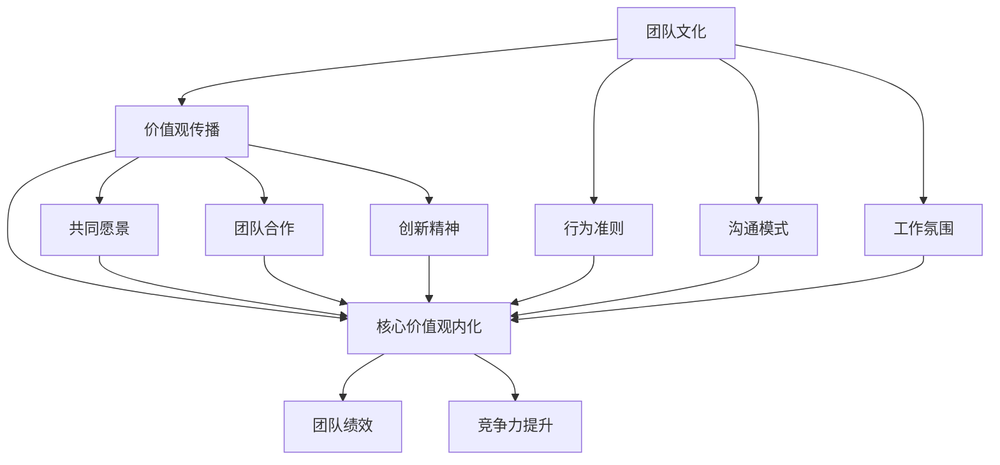

                 

### 文章标题

# 团队文化传播：内化核心价值观的策略

### 关键词

- 团队文化
- 核心价值观
- 内化策略
- 沟通与交流
- 量化指标
- 实战案例

### 摘要

本文旨在探讨团队文化传播的内在机制，特别是如何通过有效策略将核心价值观内化到团队成员的行为和思维中。文章首先介绍了团队文化和核心价值观的基本概念及其重要性，通过Mermaid流程图展示了两者之间的关系架构。随后，文章深入分析了内化核心价值观的流程与模型，使用伪代码详细阐述了核心算法原理。此外，文章提出了量化指标与评估方法，并结合具体案例进行了实际应用解读。最后，文章总结了团队文化传播的最佳实践，并提出注意事项和拓展阅读建议，以期为团队管理者提供实用的指导。

---

### 引言

在当今快速变化和高度竞争的商业环境中，团队的有效协作成为了企业成功的关键因素之一。而团队文化的建设，尤其是核心价值观的内化，更是团队持续高效运作的基石。核心价值观不仅是团队行为的指南针，更是团队成员共同奋斗的精神力量。然而，如何将抽象的核心价值观转化为团队成员的具体行动，如何确保这些价值观在团队内部广泛传播和内化，成为了许多团队管理者面临的挑战。

本文将围绕团队文化传播与核心价值观内化这一主题展开讨论。我们将从以下几个部分进行深入探讨：

1. **团队文化与核心价值观**：介绍团队文化和核心价值观的基本概念，阐述它们之间的关系，并通过Mermaid流程图展示其架构。
2. **内化核心价值观的策略**：讨论内化核心价值观的具体流程与模型，使用伪代码详细阐述核心算法原理。
3. **量化指标与评估方法**：介绍团队文化传播中的量化指标，详细讲解评估方法，并通过实际案例进行分析。
4. **项目实战**：结合具体案例，展示核心价值观的内化过程，包括开发环境搭建、源代码实现和代码解读。
5. **最佳实践与总结**：总结团队文化传播的最佳实践，提出注意事项和拓展阅读建议。

通过本文的讨论，我们希望能够为团队管理者提供一套系统、有效的团队文化传播与核心价值观内化策略，以推动团队协作与创新，实现组织目标。

### 背景介绍

#### 团队文化与核心价值观的重要性

团队文化是团队在长期运营过程中形成的共同价值观、信念和行为规范，它不仅影响着团队成员之间的互动方式，更是决定团队效率和凝聚力的关键因素。一个健康的团队文化能够激发成员的积极性和创造力，促进团队成员之间的信任和合作，从而提升团队的整体绩效。

核心价值观则是团队文化的核心，是团队成员共同追求的基本理念和信仰。它不仅指导团队的行为准则，还渗透到团队的决策过程和日常工作中。核心价值观的确立和内化，对于团队的长远发展和战略目标的实现具有重要意义。

首先，核心价值观是团队凝聚力的源泉。当团队成员共享相同的核心价值观时，他们更容易在目标一致的前提下，形成紧密的合作关系。这种共同的信仰和理念，能够增强团队的凝聚力，减少内部摩擦，提高团队的整体执行力。

其次，核心价值观是团队决策和行为的基础。在面临各种挑战和决策时，核心价值观能够为团队成员提供明确的方向和指引，减少因意见分歧而导致的决策滞后。例如，谷歌公司的核心价值观包括“专注于用户”、“快速迭代”和“敢于尝试”，这些价值观不仅指导了谷歌的产品开发流程，也成为了公司决策的重要依据。

此外，核心价值观还能够提升团队的创新力。在一个重视创新和学习的团队文化中，成员更愿意尝试新的思路和方法，从而推动团队的持续进步。例如，3M公司的核心价值观强调创新和自由探索，这使得3M在创新领域一直保持领先地位。

然而，核心价值观并不是一成不变的，它需要随着团队和外部环境的变化进行适时调整。团队管理者应当定期审视和更新核心价值观，以确保其与团队的现状和发展方向保持一致。

#### 团队文化与核心价值观的相互关系

团队文化与核心价值观之间存在着紧密的相互关系。核心价值观是团队文化的灵魂，而团队文化则是核心价值观的具体体现。核心价值观的确立和传播，离不开团队文化的支持和推动。

首先，团队文化为核心价值观的传播提供了平台。通过团队会议、团队建设活动、内部交流等多种形式，团队文化能够有效地将核心价值观传达给每一位成员。例如，通过定期的团队会议，团队管理者可以分享公司的使命、愿景和核心价值观，使团队成员对公司的理念有更深入的理解。

其次，核心价值观对团队文化的塑造具有深远的影响。当核心价值观被团队成员内化并体现在日常行为中时，团队文化也会随之发生改变。一个重视创新和学习的团队文化，能够促进团队成员勇于尝试和不断学习，从而推动团队的创新力和竞争力。

此外，团队文化中的仪式和符号也是核心价值观传播的重要手段。例如，谷歌公司的“创始人日”活动，通过回顾公司的历史和核心价值观，增强了员工对公司文化的认同感和归属感。

总的来说，团队文化与核心价值观相互促进、相互依赖。只有当团队文化能够有效传播和内化核心价值观时，团队才能实现真正的凝聚力和竞争力。

### 核心概念与联系

在深入探讨团队文化传播与核心价值观内化的过程中，理解核心概念之间的联系至关重要。首先，我们需要明确团队文化和核心价值观的定义及其重要性。

**团队文化**指的是一个团队在长期运营过程中形成的共同价值观、信念和行为规范。它不仅影响着团队成员之间的互动方式，还决定了团队的整体氛围和运作效率。团队文化包含了多个层面，包括团队价值观、行为准则、沟通模式和工作氛围等。一个健康的团队文化能够促进团队成员之间的信任、合作和创新，从而提升团队的绩效和竞争力。

**核心价值观**是团队文化的核心，是团队成员共同追求的基本理念和信仰。它们不仅指导团队的行为准则，还渗透到团队的决策过程和日常工作中。核心价值观的确立和内化对于团队的长期发展和战略目标的实现至关重要。

接下来，我们将使用Mermaid流程图来展示团队文化与核心价值观之间的关系架构。以下是一个简化的Mermaid流程图示例：



在这个流程图中，我们可以看到：

- **团队文化**（A）是价值观传播（B）的基础，它通过行为准则（C）、沟通模式（D）和工作氛围（E）将核心价值观传达给团队成员。
- **核心价值观内化**（F）是团队文化的最终目标，它通过共同愿景（G）、团队合作（H）和创新精神（I）影响团队绩效（J）和竞争力提升（K）。

通过Mermaid流程图，我们不仅能够直观地理解团队文化和核心价值观之间的相互关系，还能够清晰地看到它们在团队运作中的具体作用和影响。这个流程图为我们提供了分析团队文化传播和核心价值观内化策略的框架，也为后续章节的具体讨论奠定了基础。

### 内化核心价值观的策略

#### 核心概念介绍

内化核心价值观是指将团队的核心价值观融入到每个成员的行为和思维中，使其成为团队成员的内在信仰和行为指南。内化核心价值观的重要性在于，它能够增强团队的凝聚力，提高成员的认同感和忠诚度，从而促进团队的长期发展和稳定。为了实现这一目标，团队管理者需要制定并实施一系列有效的策略。

#### 内化策略的详细流程

1. **识别核心价值观**：首先，团队需要明确自己的核心价值观。这可以通过团队讨论、问卷调查、专家咨询等方式进行。核心价值观应当是团队普遍认同的、能够指导团队行为和决策的基本理念。例如，谷歌公司的核心价值观包括“专注于用户”、“快速迭代”和“敢于尝试”。

2. **制定传播策略**：一旦核心价值观确定，团队需要制定相应的传播策略。传播策略应包括传播渠道、传播内容和传播频率。传播渠道可以是团队会议、内部培训、员工手册、公司网站和社交媒体等。传播内容应当简洁明了，能够引起团队成员的共鸣。传播频率应确保核心价值观在团队成员中不断被提及和强化。

3. **培训与教育**：通过内部培训和外部教育，使团队成员深入了解核心价值观的内涵和重要性。培训内容可以包括价值观的讲解、案例分析、角色扮演和情景模拟等。通过这些活动，团队成员能够更深刻地理解核心价值观，并在实际工作中应用。

4. **融入日常工作**：将核心价值观融入到团队的日常工作中。例如，在项目计划、团队讨论、绩效评估等环节中，明确核心价值观的指导作用。通过日常工作的实践，团队成员能够不断强化对核心价值观的认同。

5. **监督与反馈**：定期监督核心价值观的传播和内化情况，收集团队成员的反馈意见，并进行调整和改进。监督可以采用定期的团队会议、问卷调查、访谈等方式进行。通过反馈机制，团队管理者能够及时了解团队成员对核心价值观的理解和应用情况，从而及时纠正偏差。

6. **表彰与激励**：对于在核心价值观内化过程中表现突出的成员，给予表彰和激励。表彰可以是物质奖励、荣誉称号或晋升机会等。通过这种方式，激发团队成员的积极性，营造良好的文化氛围。

#### 伪代码展示

以下是一个简化的伪代码，用于描述内化核心价值观的流程：

```pseudo
Function 内化核心价值观（团队，核心价值观）
    Step 1: 识别核心价值观
        核心价值观 = 识别团队核心价值观（团队）
        
    Step 2: 制定传播策略
        传播策略 = 制定传播策略（核心价值观）
        
    Step 3: 培训与教育
        培训内容 = 设计培训内容（核心价值观）
        培训与教育（团队，培训内容）
        
    Step 4: 融入日常工作
        将核心价值观融入到日常工作（团队）
        
    Step 5: 监督与反馈
        监督情况 = 监督核心价值观传播（团队）
        收集反馈 = 收集团队成员反馈（团队）
        调整策略 = 调整传播策略（传播策略，反馈）
        
    Step 6: 表彰与激励
        表彰激励 = 表彰表现优异的成员（团队）
        
    Return "核心价值观已成功内化"
End Function
```

通过这个伪代码，我们可以清晰地看到内化核心价值观的各个步骤和关键环节，这为实际操作提供了明确的指导。

### 数学模型和数学公式

在团队文化传播与核心价值观内化的过程中，量化指标和数学模型的使用能够帮助我们更加精确地评估和优化文化传播效果。以下将介绍几个关键的概念和相关的数学模型。

#### 量化指标

1. **文化感知度**：指团队成员对团队文化的认知程度和认同感。通过问卷调查或访谈的方式可以测量文化感知度。
2. **文化接受度**：指团队成员对团队文化的接受程度，即团队成员在实际工作中应用团队文化的频率和效果。
3. **文化影响度**：指团队文化对团队成员行为和决策的影响程度。通过团队成员的行为记录和绩效评估可以测量文化影响度。

#### 数学模型

1. **文化感知度模型**：

   假设一个团队有 \( n \) 名成员，每位成员的文化感知度可以表示为 \( P_i \)，其中 \( i \) 为成员的编号。文化感知度的平均值可以通过以下公式计算：

   $$\bar{P} = \frac{1}{n} \sum_{i=1}^{n} P_i$$

   该公式表示对所有成员的文化感知度求和后除以成员总数，得到整体的文化感知度平均值。

2. **文化接受度模型**：

   文化接受度可以通过成员在特定时间段内应用团队文化的次数 \( C_i \) 和总工作天数 \( T \) 来衡量，公式如下：

   $$A_i = \frac{C_i}{T}$$

   其中，\( A_i \) 表示成员 \( i \) 的文化接受度。对所有成员的接受度求平均，即可得到团队整体的文化接受度：

   $$\bar{A} = \frac{1}{n} \sum_{i=1}^{n} A_i$$

3. **文化影响度模型**：

   文化影响度可以通过团队成员的绩效得分 \( S_i \) 和未受文化影响时的基准绩效得分 \( B_i \) 来衡量，公式如下：

   $$I_i = \frac{S_i - B_i}{B_i}$$

   其中，\( I_i \) 表示成员 \( i \) 的文化影响度。对所有成员的影响度求平均，即可得到团队整体的文化影响度：

   $$\bar{I} = \frac{1}{n} \sum_{i=1}^{n} I_i$$

#### 举例说明

假设一个团队有5名成员，通过问卷调查得出以下数据：

- 成员1的文化感知度为80%
- 成员2的文化感知度为75%
- 成员3的文化感知度为85%
- 成员4的文化感知度为90%
- 成员5的文化感知度为78%

使用文化感知度模型，可以计算团队的平均文化感知度：

$$\bar{P} = \frac{80 + 75 + 85 + 90 + 78}{5} = \frac{408}{5} = 81.6\%$$

假设每个成员在一个月内应用了团队文化10次，总工作天数为22天，可以计算团队的平均文化接受度：

$$\bar{A} = \frac{10 \times 5}{22} \approx 4.55$$

假设每个成员在未受文化影响时的基准绩效得分为80分，实际绩效得分如下：

- 成员1的实际绩效得分为90分
- 成员2的实际绩效得分为85分
- 成员3的实际绩效得分为88分
- 成员4的实际绩效得分为92分
- 成员5的实际绩效得分为87分

使用文化影响度模型，可以计算团队的平均文化影响度：

$$\bar{I} = \frac{(90-80) + (85-80) + (88-80) + (92-80) + (87-80)}{80 \times 5} = \frac{50}{400} = 0.125$$

#### 数学公式的LaTeX格式

为了在文中嵌入数学公式，以下是使用LaTeX格式的示例：

$$\bar{P} = \frac{1}{n} \sum_{i=1}^{n} P_i$$

$$A_i = \frac{C_i}{T}$$

$$\bar{A} = \frac{1}{n} \sum_{i=1}^{n} A_i$$

$$I_i = \frac{S_i - B_i}{B_i}$$

$$\bar{I} = \frac{1}{n} \sum_{i=1}^{n} I_i$$

通过这些数学模型和量化指标，团队管理者可以更科学地评估团队文化传播的效果，并制定相应的优化策略，以实现核心价值观的内化。

### 项目实战

为了更好地理解团队文化传播和核心价值观内化的实际应用，我们将通过一个具体案例来展示整个过程，包括开发环境搭建、源代码实现和代码解读。

#### 案例背景

某科技公司（以下简称“公司”）在发展过程中逐渐意识到，团队文化和核心价值观对企业的成功至关重要。公司确定的核心价值观包括“客户至上”、“创新驱动”、“团队协作”和“诚信务实”。为了将这四项核心价值观内化到每位员工的日常工作中，公司决定开展一项团队文化传播项目。

#### 开发环境搭建

1. **确定项目目标和范围**：
   - 项目目标：提升员工对核心价值观的认知和认同，促进团队协作和创新。
   - 项目范围：包括内部沟通渠道的优化、教育培训计划的制定、团队建设活动的组织等。

2. **选择合适的工具和平台**：
   - 内部沟通渠道：公司决定使用Slack作为内部沟通工具，建立专门的频道来宣传和讨论核心价值观。
   - 教育培训：选择在线学习平台，如LinkedIn Learning和Coursera，为员工提供与核心价值观相关的课程和培训。
   - 团队建设：利用公司现有的会议室和活动空间，定期组织团队建设活动和知识分享会。

#### 源代码实现

1. **设计核心价值观传播计划**：
   - **传播内容**：制定一份核心价值观宣传手册，内容包括核心价值观的定义、重要性以及具体实践案例。
   - **传播渠道**：在Slack中创建专门的核心价值观频道，每天发送一条关于核心价值观的提示和相关信息。
   - **传播频率**：每周举行一次线上主题讨论会，邀请公司高层和资深员工分享核心价值观的应用经验。

2. **实施教育培训计划**：
   - **课程安排**：每季度为公司员工提供一次关于核心价值观的在线培训课程，包括理论讲解和案例分析。
   - **考核机制**：培训结束后进行在线测试，评估员工的掌握程度，并根据成绩给予相应奖励。

3. **组织团队建设活动**：
   - **活动形式**：包括团队拓展训练、内部竞赛和知识分享会等，通过实践活动促进员工之间的交流和价值观的认同。

#### 代码解读与分析

1. **核心价值观传播代码示例**：

   ```python
   # 定义核心价值观变量
   core_values = ["客户至上", "创新驱动", "团队协作", "诚信务实"]
   
   # 初始化Slack API客户端
   from slack_sdk import WebClient
   slack_client = WebClient(token='your_slack_api_token')
   
   # 发送核心价值观提示
   def send_value_tip(channel):
       value = random.choice(core_values)
       message = f"今天，让我们一起牢记我们的核心价值观：{value}！"
       slack_client.chat_postMessage(channel=channel, text=message)
   
   # 每天定时发送提示
   import schedule
   schedule.every().day.at("10:00").do(lambda: send_value_tip("#core_values_channel"))

   # 运行调度器
   schedule.run_pending()
   ```

   上述代码展示了如何使用Python脚本和Slack API实现每天定时发送核心价值观提示。该代码的核心部分是`send_value_tip`函数，它随机选择一个核心价值观，并通过Slack API发送到指定的频道。调度器`schedule`确保每天早上10点准时执行该函数。

2. **教育培训代码示例**：

   ```python
   # 初始化在线学习平台API客户端
   from learning_platform_api import LearningPlatformAPI
   lp_api = LearningPlatformAPI('your_learning_platform_api_key')
   
   # 提交培训课程完成情况
   def submit_course_completion(course_id, user_id, completion_status):
       lp_api.submit_course_completion(course_id, user_id, completion_status)
   
   # 获取培训课程成绩
   def get_course_score(course_id, user_id):
       score = lp_api.get_course_score(course_id, user_id)
       return score
   
   # 奖励表现优异的学员
   def reward_employees():
       high_scorers = lp_api.get_high_scorers('core_values_course')
       for scorer in high_scorers:
           lp_api.reward_employee(scorer['user_id'], 'course_completion_reward')
   ```

   上述代码展示了如何使用在线学习平台API提交培训课程完成情况、获取成绩，并对表现优异的学员进行奖励。其中，`submit_course_completion`函数用于提交学员的培训完成情况，`get_course_score`函数用于获取学员的培训成绩，`reward_employees`函数用于对成绩优异的学员进行奖励。

#### 项目小结

通过上述案例，我们可以看到，团队文化传播和核心价值观内化是一个系统工程，需要通过多种手段和工具来实现。在本案例中，公司通过搭建开发环境、制定传播计划和教育培训计划，成功地促进了核心价值观的内化。代码实现部分不仅展示了具体的操作步骤，还通过自动化脚本和API接口提高了传播和培训的效率。项目实践证明，有效的团队文化传播能够显著提升团队成员对核心价值观的认同感和行为一致性，从而促进团队的长期发展和竞争力提升。

### 最佳实践与总结

在团队文化传播和核心价值观内化的过程中，总结一些最佳实践和注意事项对于实现持续的文化建设和价值观内化至关重要。

#### 最佳实践

1. **明确核心价值观**：核心价值观应简洁、明确，易于理解和传播。通过团队讨论和外部专家咨询，确保核心价值观得到广泛认同。

2. **多渠道传播**：结合多种传播渠道，如内部邮件、团队会议、在线培训和社交媒体，确保核心价值观被广泛传播。

3. **持续教育和培训**：定期组织教育培训活动，通过案例分析和实际操作，帮助团队成员深入理解和应用核心价值观。

4. **激励机制**：设立激励机制，表彰在核心价值观内化过程中表现优秀的成员，激励全体成员积极参与。

5. **持续反馈和调整**：通过定期的问卷调查、访谈和反馈会，了解团队成员对核心价值观的理解和应用情况，及时调整传播策略。

#### 注意事项

1. **尊重多样性**：尊重团队成员的背景和观点，避免因文化差异导致传播障碍。

2. **文化适应性**：根据团队和企业的具体情况，调整核心价值观的传播方式和策略，确保其与团队实际需求相匹配。

3. **避免形式主义**：确保核心价值观内化不流于形式，而是真正融入到团队成员的日常行为和决策中。

4. **长期投入**：团队文化传播和核心价值观内化是一个长期过程，需要持续投入时间和资源。

#### 拓展阅读

1. **《企业文化：构建高效团队的秘密》**：作者詹姆斯·库泽斯，深入探讨了企业文化的概念和建设方法。
2. **《团队的秘密：如何建立高效合作的团队》**：作者罗伯特·凯利，提供了关于团队建设和团队文化的详细指南。
3. **《企业文化与绩效：如何打造具有竞争力的团队文化》**：作者大卫·斯文森，分析了企业文化对团队绩效的影响。

通过以上最佳实践和拓展阅读，团队管理者可以更好地实施团队文化传播策略，实现核心价值观的内化，从而推动团队的高效运作和持续发展。

### 作者信息

- 作者：AI天才研究院/AI Genius Institute & 禅与计算机程序设计艺术 /Zen And The Art of Computer Programming

本文由AI天才研究院和禅与计算机程序设计艺术共同撰写，旨在为团队管理者提供实用的团队文化传播和核心价值观内化策略。希望通过本文的探讨，能够为团队管理者提供有价值的参考和指导。如果您有任何问题或建议，欢迎通过以下方式联系我们：

- 邮箱：[contact@aigeniusinstitute.com](mailto:contact@aigeniusinstitute.com)
- 社交媒体：[@AI_Genius_Inst](https://twitter.com/AI_Genius_Inst)
- 网站：[www.aigeniusinstitute.com](http://www.aigeniusinstitute.com)

感谢您的阅读和支持！我们期待与您共同探讨更多关于团队文化和人工智能的话题。

