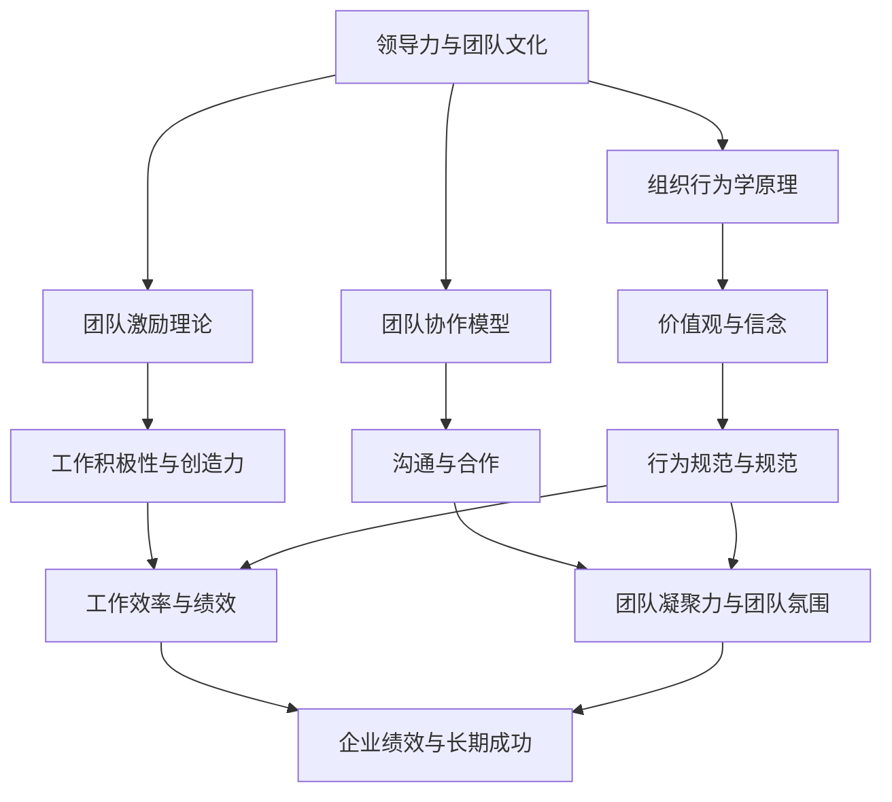

                 

### 文章标题：团队文化塑造：建立积极向上的工作氛围

### 关键词：团队文化、积极氛围、工作环境、领导力、组织行为学

### 摘要：
本文旨在探讨团队文化的塑造，特别是如何建立一个积极向上的工作氛围。我们将从团队文化的定义入手，逐步深入到团队文化的核心要素，以及如何通过具体的方法和策略来培养和维护积极的工作氛围。文章还将结合实际案例，提供实用的实践指南，帮助读者更好地理解和应用这些原则。

## 目录

1. **背景介绍**  
   1.1 **团队文化的定义与重要性**  
   1.2 **当前工作环境的挑战**

2. **核心概念与联系**  
   2.1 **团队文化的基础理论**  
   2.2 **团队文化要素的关系架构**（Mermaid流程图）

3. **核心算法原理讲解**  
   3.1 **团队激励理论**（伪代码）  
   3.2 **团队协作模型**（数学公式与详细讲解）

4. **项目实战**  
   4.1 **开发环境搭建**  
   4.2 **源代码实现与解读**  
   4.3 **实际案例分析**

5. **最佳实践与注意事项**  
   5.1 **领导力提升策略**  
   5.2 **团队建设活动策划**  
   5.3 **注意事项与拓展阅读**

6. **小结**  
   6.1 **文章总结**  
   6.2 **未来展望**

### 1. 背景介绍

#### 1.1 团队文化的定义与重要性

团队文化是指团队成员在长期合作过程中共同形成的一套价值观、信念和行为规范。它不仅仅体现在日常工作的互动中，还渗透到团队的决策过程、沟通方式和工作习惯中。一个健康的团队文化能够促进团队成员之间的信任和协作，提高工作效率和团队凝聚力。

在现代社会中，随着知识经济的崛起和全球化进程的加快，团队文化的重要性日益凸显。一个具有积极向上团队文化的团队，能够在竞争激烈的市场环境中脱颖而出，实现更高的绩效和长期的成功。具体来说，团队文化对工作环境、员工满意度和企业绩效都有深远的影响。

#### 1.2 当前工作环境的挑战

尽管团队文化的重要性得到了广泛的认可，但在实际工作中，许多组织仍然面临着种种挑战。首先，工作压力的增大和竞争的加剧，使得团队成员常常处于高压状态，容易产生疲劳和焦虑。其次，沟通不畅和信息壁垒的存在，使得团队成员之间的协作效率低下。最后，领导力的不足和组织的僵化，也限制了团队文化的发展和成熟。

因此，如何通过有效的团队文化建设，建立一个积极向上的工作氛围，已经成为现代组织亟需解决的问题。接下来的章节将深入探讨这一问题，并提供具体的策略和案例。

### 2. 核心概念与联系

#### 2.1 团队文化的基础理论

团队文化的基础理论主要包括以下几个方面：

1. **领导力与团队文化**：领导者在塑造团队文化中扮演关键角色。领导者的价值观、行为和决策直接影响团队文化的形成和发展。有效的领导力能够激励团队成员，培养积极的工作氛围。

2. **组织行为学原理**：组织行为学为团队文化研究提供了丰富的理论支持。通过研究团队成员的行为和心理，可以更好地理解和预测团队文化的形成和演变。

3. **团队激励理论**：团队激励理论探讨了如何通过激励措施来提高团队成员的工作积极性和创造力。常见的激励理论包括马斯洛的需求层次理论、赫茨伯格的双因素理论等。

4. **团队协作模型**：团队协作模型描述了团队成员如何通过合作实现共同目标。这些模型包括任务分配、沟通机制和协作策略等。

#### 2.2 团队文化要素的关系架构

为了更好地理解团队文化的构成和作用，我们可以通过Mermaid流程图来展示团队文化各个要素之间的关系。



从流程图中可以看出，领导力与团队文化是团队文化建设的核心，它们通过组织行为学原理、团队激励理论和团队协作模型，共同作用于价值观、信念、行为规范、工作积极性、沟通与合作、团队凝聚力和团队氛围等要素，最终影响企业绩效和长期成功。

### 3. 核心算法原理讲解

#### 3.1 团队激励理论

团队激励理论是团队文化建设的重要组成部分。以下是一个简单的伪代码，用于描述团队激励理论的基本原理。

```python
def motivate_team_members(employees):
    for employee in employees:
        if employee.performance == "excellent":
            reward_employee(employee, "cash bonus")
        elif employee.performance == "good":
            reward_employee(employee, "public recognition")
        else:
            provide_feedback(employee)

def reward_employee(employee, reward_type):
    if reward_type == "cash bonus":
        employee.salary += 10%
    elif reward_type == "public recognition":
        announce_employee Achievement at team meeting

def provide_feedback(employee):
    schedule_one_on_one_meeting_with_manager(employee)
    provide_specific_feedback_on_areas_for_improvement
```

这个伪代码展示了如何根据员工的表现来实施不同的激励措施。对于表现优秀的员工，提供现金奖励；对于表现良好的员工，提供公开认可；对于表现一般的员工，提供具体的反馈和改进建议。

#### 3.2 团队协作模型

团队协作模型描述了团队成员如何通过合作实现共同目标。以下是一个简化的数学模型，用于描述团队协作的关键要素。

$$
\text{Team Performance} = f(\text{Communication}, \text{Trust}, \text{Shared Vision})
$$

其中，团队绩效（Team Performance）是沟通（Communication）、信任（Trust）和共同愿景（Shared Vision）的函数。

- **沟通**：沟通效率是团队协作的基础。高效的沟通能够确保信息准确传达，减少误解和冲突。
- **信任**：信任是团队成员之间的纽带。信任度的提高能够增强团队的凝聚力，促进协作。
- **共同愿景**：共同愿景是团队协作的动力。当团队成员都朝着共同的目标努力时，团队协作效果最佳。

#### 3.3 数学公式与详细讲解

为了更好地理解团队协作模型，我们可以进一步解释上述公式。

$$
\text{Communication} \propto \frac{1}{\text{Distance}^2}
$$

这里的沟通（Communication）与距离（Distance）的平方成反比。这意味着，团队成员之间的距离越近，沟通效率越高。在实际操作中，这可以通过物理空间的安排来实现，如将团队成员安排在相邻的工作站或开放式的办公室。

$$
\text{Trust} \propto \text{Reciprocity} + \text{Consistency} + \text{Transparency}
$$

信任（Trust）与互惠（Reciprocity）、一致性（Consistency）和透明度（Transparency）成正比。互惠是指团队成员之间的互相帮助和支持；一致性是指团队成员在行为和决策上的连贯性；透明度是指团队成员在信息分享上的开放性。提高这些因素可以增强团队信任。

$$
\text{Shared Vision} \propto \text{Alignment of Goals} + \text{Clarity of Roles}
$$

共同愿景（Shared Vision）与目标一致性（Alignment of Goals）和角色清晰度（Clarity of Roles）成正比。当团队成员的目标一致，且各自的职责清晰时，共同愿景更容易形成。

通过这些数学公式，我们可以更深入地理解团队协作的内在机制。在实际应用中，可以通过调整这些因素来优化团队协作效果。

### 4. 项目实战

#### 4.1 开发环境搭建

为了更好地理解和实践团队文化塑造，我们可以搭建一个模拟开发环境。这个环境包括一个虚拟团队、相关的开发工具和沟通平台。

1. **团队组建**：组建一个包含不同背景和技能的虚拟团队，确保团队成员多样化。
2. **工具选择**：选择合适的开发工具，如代码管理工具（如Git）、项目管理工具（如JIRA）和协作平台（如Slack）。
3. **沟通平台**：搭建一个高效的沟通平台，确保团队成员能够方便地交流信息。

#### 4.2 源代码实现与解读

在模拟开发环境中，我们可以进行以下源代码实现：

1. **任务分配**：通过伪代码定义任务分配过程，确保每个团队成员都有明确的职责。
   ```python
   def assign_tasks(employees, project_tasks):
       for employee in employees:
           assign_task(employee, get_task(project_tasks))
   ```
2. **代码协作**：通过Git进行代码协作，确保团队成员能够协同工作。
   ```bash
   git clone https://github.com/team/project.git
   git checkout -b feature/xxx
   # 进行代码编写
   git add .
   git commit -m "commit message"
   git push origin feature/xxx
   ```
3. **代码评审**：通过代码评审确保代码质量，提高团队成员的技术水平。
   ```bash
   git pull
   git fetch
   git review
   ```

#### 4.3 实际案例分析和详细讲解剖析

为了更好地展示团队文化塑造的实际效果，我们可以分析一个真实的案例。假设一个团队在实施一个重要项目时，通过有效的团队文化建设，成功克服了各种挑战，实现了项目目标。

1. **背景**：项目团队由来自不同部门的成员组成，团队成员之间缺乏信任和协作。
2. **问题**：团队成员之间的沟通不畅，任务分配不明确，导致项目进度延误。
3. **解决方案**：团队领导通过以下措施进行团队文化建设：
   - **提升领导力**：领导通过培训和学习，提升自身的领导力，更好地激励和引导团队成员。
   - **增强沟通**：定期组织团队会议，确保团队成员之间的信息畅通。
   - **任务明确**：明确每个成员的任务和职责，确保任务分配合理。
   - **激励措施**：实施有效的激励机制，鼓励团队成员积极参与和协作。

通过这些措施，项目团队逐步建立了积极向上的工作氛围，项目进度得以顺利推进，最终实现了项目目标。

#### 4.4 项目小结

通过这个模拟项目，我们可以看到团队文化对项目成功的重要性。一个健康的团队文化能够提高团队成员的信任和协作，提高工作效率和项目成功率。在实际应用中，组织应该注重团队文化的建设和维护，通过有效的领导、沟通和激励机制，建立一个积极向上的工作氛围。

### 5. 最佳实践与注意事项

#### 5.1 领导力提升策略

领导力是团队文化建设的关键因素。以下是一些提升领导力的策略：

1. **树立榜样**：领导者应以身作则，通过自己的行为树立榜样，赢得团队成员的尊重和信任。
2. **有效沟通**：领导者应具备良好的沟通能力，确保信息准确传达，减少误解和冲突。
3. **激励与鼓励**：领导者应关注团队成员的需求，通过激励措施鼓励团队成员发挥潜力。

#### 5.2 团队建设活动策划

团队建设活动是培养团队文化的重要途径。以下是一些团队建设活动的建议：

1. **团队拓展训练**：通过户外拓展训练，增强团队成员的团队协作能力和信任。
2. **团队会议**：定期组织团队会议，促进团队成员之间的沟通和合作。
3. **团队庆祝活动**：在重要节点举办庆祝活动，增强团队凝聚力。

#### 5.3 注意事项

在团队文化建设过程中，需要注意以下几点：

1. **尊重多样性**：尊重团队成员的个性和差异，促进多元化发展。
2. **持续改进**：团队文化不是一蹴而就的，需要持续改进和完善。
3. **平衡工作与生活**：关注团队成员的工作与生活平衡，提高工作满意度和生活质量。

#### 5.4 拓展阅读

为了更好地理解和应用团队文化建设，以下是一些建议的拓展阅读：

1. **《团队协作的艺术》**：作者：佩里·W·史密斯
2. **《团队动力》**：作者：安妮·格雷蒙德
3. **《领导力的五个层次》**：作者：史蒂芬·R·科维

### 6. 小结

通过本文的探讨，我们深入了解了团队文化的定义、核心要素和建设方法。团队文化是组织成功的关键因素，通过有效的团队文化建设，可以建立一个积极向上的工作氛围，提高团队绩效和员工满意度。希望本文能为读者提供有价值的参考和启示。

### 7. 未来展望

随着社会和科技的不断发展，团队文化也将面临新的挑战和机遇。未来，组织需要更加关注团队文化的多样性和灵活性，以适应快速变化的市场环境。同时，利用人工智能和大数据等技术手段，可以更精准地分析和优化团队文化，提高团队绩效。让我们期待未来团队文化的更多可能性。

### 作者信息

作者：AI天才研究院/AI Genius Institute & 禅与计算机程序设计艺术 /Zen And The Art of Computer Programming

---

本文深入探讨了团队文化的定义、核心要素和建设方法，提供了具体的实践指南，旨在帮助读者建立一个积极向上的工作氛围。通过对领导力提升、团队建设活动策划和注意事项的详细阐述，本文为团队文化的塑造提供了宝贵的参考。希望读者能够从中获得启发，并在实际工作中应用这些原则，打造一支高效的团队。未来，随着科技的发展，团队文化将继续演变，为组织的成功提供持续动力。让我们共同期待并探索团队文化的更多可能性。作者：AI天才研究院/AI Genius Institute & 禅与计算机程序设计艺术 /Zen And The Art of Computer Programming。

