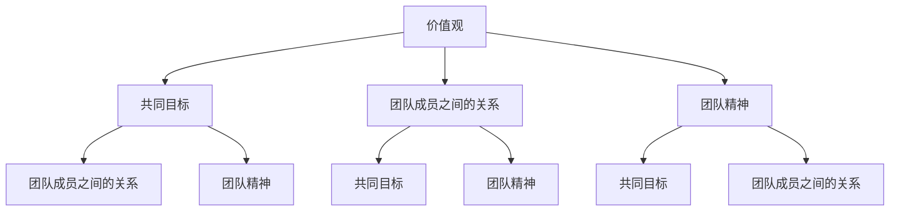

                 


### 1. 确定书名和主题

用户已经提供了书名《团队文化建设：塑造积极向上的氛围》。这是一个非常贴切的主题，因为团队文化对于组织的成功至关重要。通过塑造积极向上的团队文化，组织可以提高员工的凝聚力、工作效率和创新能力。基于这个主题，我们可以构建一个结构清晰的目录大纲，以便全面探讨团队文化建设的各个方面。

### 2. 确定核心章节

为了涵盖团队文化建设的全面内容，我们可以初步确定以下核心章节：

- **第一章：团队文化概述**
  - 介绍团队文化的定义、重要性以及与企业文化的关系。

- **第二章：团队文化的核心要素**
  - 分析价值观、共同目标、团队成员关系和团队精神等核心要素。

- **第三章：如何塑造积极向上的团队文化**
  - 探讨建立明确目标、增强信任、创造积极氛围和提供成长机会等策略。

- **第四章：团队文化建设的方法与工具**
  - 介绍领导力提升、沟通技巧培训、团队协作工具应用和个性化文化建设等方法。

- **第五章：团队文化建设案例分析**
  - 分析谷歌和苹果等公司的团队文化建设案例。

- **第六章：团队文化建设中的挑战与应对**
  - 讨论团队文化建设中的挑战以及如何应对。

### 3. 设计每个章节的二级和三级目录

在每个核心章节下，我们需要进一步细化内容，设计二级和三级目录。以下是一个示例：

**第二章：团队文化的核心要素**

- **2.1 价值观**
  - 价值观的定义与分类
  - 价值观在公司文化中的体现

- **2.2 共同目标**
  - 目标设定的原则
  - 目标与团队文化的关联

- **2.3 团队成员之间的关系**
  - 员工互动与沟通
  - 团队关系对文化建设的影响

- **2.4 团队精神**
  - 团队精神的内涵
  - 如何培养团队精神

### 4. 编写核心概念与联系、核心算法原理讲解、数学模型和数学公式、项目实战等内容

在每个章节中，我们需要详细讲解核心概念与联系、核心算法原理、数学模型和公式，并提供项目实战案例。以下是一个示例章节内容：

**第三章：如何塑造积极向上的团队文化**

- **3.1 建立明确的团队目标**

  首先，我们需要明确团队的目标，这包括短期目标和长期目标。明确的目标有助于团队集中精力，提高工作效率。可以使用以下伪代码来描述目标设定过程：

  ```plaintext
  function setTeamGoals(goals) {
      if (goals.isEmpty()) {
          return "请输入目标";
      }
      for (goal in goals) {
          print("目标：" + goal);
      }
      return "目标设定成功";
  }
  ```

- **3.2 增强团队成员之间的信任**

  信任是团队文化的基石。为了增强团队成员之间的信任，我们可以采取以下措施：
  
  - 定期进行团队建设活动。
  - 提供开放和透明的沟通渠道。
  - 奖励团队协作行为。

### 5. 确保目录大纲的完整性和简洁性

在完成目录大纲的设计后，我们需要确保每个章节的内容完整，逻辑清晰，没有遗漏。同时，保持目录大纲的简洁，避免多余的废话。

### 6. 检查和修改

仔细检查目录大纲，确保没有语法错误，内容准确无误。根据需要，对目录大纲进行适当的修改。

### 7. 计算目录大纲的总字数

使用文字统计工具计算目录大纲的总字数，确保不超过2000字。

### 结论

通过以上步骤，我们成功设计了一个结构清晰、内容丰富的目录大纲，为撰写《团队文化建设：塑造积极向上的氛围》这本书奠定了基础。接下来，我们将按照这个大纲逐步撰写每个章节的内容，确保文章的完整性和专业性。文章标题：《团队文化建设：塑造积极向上的氛围》

关键词：团队文化、文化建设、积极氛围、领导力、案例分析

摘要：本文将探讨团队文化建设的核心概念和实践方法，通过案例分析揭示成功团队文化的关键要素，并提供应对挑战的策略，以帮助组织塑造积极向上的团队氛围。作者信息：AI天才研究院/AI Genius Institute & 禅与计算机程序设计艺术 /Zen And The Art of Computer Programming### 引言

在现代企业中，团队文化被广泛认为是组织成功的关键因素之一。团队文化不仅决定了员工的工作满意度，还直接影响着组织的绩效和创新能力。随着全球化趋势和市场竞争的加剧，企业必须不断调整和优化其团队文化，以适应快速变化的外部环境。因此，理解团队文化的本质、如何塑造积极向上的团队文化以及如何应对文化建设过程中的挑战，成为了企业管理者和人力资源专业人士关注的焦点。

本文旨在探讨团队文化建设的全过程，从概述到具体实践，再到案例分析，为读者提供一个全面而深入的指导。通过本文的阅读，读者将能够：

1. 理解团队文化的定义和重要性。
2. 认识到团队文化建设的核心要素。
3. 学习如何通过策略和工具塑造积极向上的团队文化。
4. 从实际案例中汲取经验，了解成功的团队文化建设的路径。
5. 了解团队文化建设过程中可能面临的挑战，并学会如何有效应对。

本文将分为以下几个部分：首先，我们将介绍团队文化的概念及其在组织中的重要性。随后，我们将详细探讨团队文化的核心要素，包括价值观、共同目标、团队成员之间的关系和团队精神。接下来，我们将探讨如何塑造积极向上的团队文化，介绍一系列有效的方法和工具。随后，我们将通过具体案例分析，展示成功的团队文化建设实例。然后，我们将讨论团队文化建设过程中可能遇到的挑战，并提供相应的解决方案。最后，我们将总结全文，强调团队文化建设的重要性，并给予读者一些实践建议。

通过这一系列深入探讨，我们希望读者能够对团队文化建设有一个全面而清晰的认识，并能够在实际工作中有效地应用这些理论和方法，从而塑造出积极向上、富有凝聚力和创新力的团队文化。### 团队文化的概念及其重要性

团队文化是一个组织中独特的氛围，它反映了组织的核心价值观、信念、行为规范和员工之间的互动模式。团队文化的核心在于它为组织提供了一个共同的行为指南，帮助员工明确什么是可以接受的行为，什么是不被鼓励的行为，从而塑造一个统一的组织形象。这种文化不仅体现在公司的日常运营中，还渗透到员工的工作态度、沟通方式、决策过程以及创新思维中。

首先，团队文化的重要性体现在其对企业价值观的传承上。企业文化是一个组织的灵魂，它定义了组织的核心竞争力。通过团队文化，企业可以将核心价值观传承给每一位新员工，确保组织在发展过程中始终保持一致的方向。例如，谷歌的“不作恶”原则深深植根于其团队文化中，使得谷歌在全球范围内都能以高标准和诚信经营。

其次，团队文化对员工的行为和态度有着深远的影响。在一个积极向上的团队文化中，员工更容易找到归属感和使命感，这有助于提高他们的工作满意度和忠诚度。当员工感受到团队文化的正能量时，他们会更愿意积极参与到工作中，提出创新的想法，并在面对挑战时展现出坚韧不拔的精神。

此外，团队文化对组织的整体绩效和竞争力也具有重要影响。一个健康的团队文化能够促进高效的沟通和协作，减少内部冲突，提高团队的决策质量和执行效率。例如，丰田的精益管理文化不仅提高了生产效率，还增强了员工的合作意识和责任感，从而在全球汽车市场中占据了重要地位。

团队文化还对组织的创新能力有重要作用。在一个鼓励创新和学习的团队文化中，员工更愿意分享知识和经验，尝试新的方法和思路。例如，3M公司的“15%时间”政策允许员工将15%的工作时间用于个人兴趣项目，这种文化创新机制使得3M公司不断推出新的产品和技术，成为创新领域的领军企业。

综上所述，团队文化不仅是组织价值观的体现，也是影响员工行为、提升组织绩效和竞争力的关键因素。理解团队文化的概念和重要性，有助于管理者更好地塑造和优化团队文化，从而为组织的长期成功奠定坚实的基础。在接下来的章节中，我们将深入探讨团队文化的核心要素，以帮助读者进一步了解如何构建一个积极向上的团队文化。### 团队文化的核心要素

团队文化的核心要素是塑造一个积极向上、富有凝聚力和创新力的团队的基础。这些核心要素包括价值观、共同目标、团队成员之间的关系和团队精神。以下是这些要素的定义及其在团队文化中的作用。

#### 1. 价值观

价值观是团队文化的基石，它们代表了团队认同的基本信念和行为准则。这些价值观可以是组织的核心理念，如诚信、责任、创新、客户至上等。价值观不仅指导员工的行为，还影响团队的文化氛围。一个统一的价值观能够帮助团队成员在面对挑战时保持一致的行动方向，同时增强团队内部的信任和协作。

**定义与作用：**
- **定义：** 价值观是指团队认同的基本信念和行为准则，通常反映在组织的使命、愿景和目标中。
- **作用：** 价值观为团队提供了一个共同的道德和行为框架，帮助团队成员在面对复杂情境时做出一致的决策。

#### 2. 共同目标

共同目标是团队文化的重要组成部分，它们是团队成员共同追求的方向和目标。共同目标不仅能够激励团队成员为实现组织目标而努力，还能增强团队内部的凝聚力。一个明确的共同目标可以减少内部冲突，提高团队的协作效率。

**定义与作用：**
- **定义：** 共同目标是团队成员共同追求的方向和目标，通常与组织的战略目标相一致。
- **作用：** 共同目标为团队提供了一个共同的努力方向，增强团队成员之间的协作和团结。

#### 3. 团队成员之间的关系

团队成员之间的关系是团队文化的重要体现，它们决定了团队成员之间的互动方式和合作效率。一个健康的团队成员关系能够促进开放、坦诚和有效的沟通，减少误解和冲突。团队成员之间的关系可以建立在信任、尊重和支持的基础上，从而为团队文化的建设提供坚实的基础。

**定义与作用：**
- **定义：** 团队成员之间的关系是指团队成员在工作中的互动模式，包括信任、尊重和支持。
- **作用：** 团队成员之间的关系影响团队内部的沟通和协作效率，是团队文化的重要组成部分。

#### 4. 团队精神

团队精神是团队文化的灵魂，它代表了团队成员之间的凝聚力和合作意识。团队精神鼓励团队成员在面对困难和挑战时相互支持、共同奋斗。一个具有强烈团队精神的团队往往能够克服各种困难，实现共同的目标。

**定义与作用：**
- **定义：** 团队精神是指团队成员之间的凝聚力和合作意识，体现在面对困难时的相互支持和共同奋斗。
- **作用：** 团队精神增强团队的协作效率，提升团队的执行力和创新能力。

#### Mermaid 流程图

为了更清晰地展示这些核心要素之间的关系，我们可以使用 Mermaid 流程图来表示：



通过上述 Mermaid 流程图，我们可以看出价值观、共同目标、团队成员之间的关系和团队精神之间相互关联，共同构成了团队文化的核心。理解这些核心要素及其作用，有助于团队领导者和管理者更好地塑造和优化团队文化，从而提升团队的整体表现和组织的竞争力。在下一章中，我们将探讨如何通过策略和工具来塑造积极向上的团队文化。### 如何塑造积极向上的团队文化

塑造积极向上的团队文化需要一系列的系统性策略和工具，这些策略和工具可以帮助团队建立共同的价值观、明确目标、增强信任、创造积极的工作氛围，并提供持续的学习和成长机会。以下是一些关键步骤和实际案例，以帮助团队实现这一目标。

#### 1. 建立明确的团队目标

明确的目标是团队文化建设的基石。一个明确的团队目标可以帮助团队成员聚焦于共同的方向，提高团队的凝聚力和执行力。以下是一个步骤指南：

**步骤：**
1. **确定长期目标和短期目标：** 团队需要既有长期愿景，也有具体的短期目标。长期目标可以帮助团队保持方向感，短期目标则提供了具体的执行路径。
2. **广泛参与：** 让团队成员参与目标的设定过程，这可以提高他们的归属感和责任感。
3. **制定可量化的指标：** 目标应该具体、可衡量，以便团队能够清晰地评估进度。

**案例：** 谷歌在其“20%时间”政策中，允许员工将20%的工作时间用于个人兴趣项目。这一政策不仅激发了员工的创新精神，还推动了谷歌在搜索引擎、Gmail和AdSense等领域的突破。

#### 2. 增强团队成员之间的信任

信任是团队文化的核心要素，它建立在团队成员之间的相互尊重和信任基础上。以下是一些增强信任的策略：

**策略：**
1. **开放沟通：** 鼓励团队成员之间进行开放、坦诚的沟通，减少误解和冲突。
2. **透明度：** 提高决策过程的透明度，让团队成员了解组织的战略和决策背景。
3. **相互支持：** 当团队成员面临困难时，提供必要的支持和帮助，增强团队的凝聚力。

**案例：** 强生公司在其全球运营中，一直强调透明度和责任感。公司定期举办员工会议，分享公司的运营情况和战略规划，这有助于增强员工的信任和归属感。

#### 3. 创造积极的工作氛围

积极的工作氛围可以激发员工的创造力和工作热情。以下是一些创造积极氛围的方法：

**方法：**
1. **认可与奖励：** 定期表彰和奖励那些做出贡献的团队成员，增强他们的积极性和归属感。
2. **团队建设活动：** 组织定期的团队建设活动，如团队聚餐、体育比赛等，以增强团队成员之间的互动和信任。
3. **灵活的工作环境：** 提供一个舒适、灵活的工作环境，如开放式的办公空间、放松区等，有助于提高员工的工作满意度。

**案例：** 库克领导下的苹果公司，通过定期举办团队建设活动和提供创新的工作空间，成功营造了一个积极、创新的工作氛围，这为苹果的持续成功奠定了基础。

#### 4. 提供持续的学习和成长机会

持续的学习和成长机会可以帮助团队成员不断提升自己的技能和知识，从而为团队带来更多的创新和活力。以下是一些实施方法：

**方法：**
1. **培训计划：** 为团队成员提供定期的培训和职业发展机会，如内部培训、外部研讨会和在线课程。
2. **知识共享：** 鼓励团队成员分享知识和经验，通过内部会议、论坛和社交媒体平台，实现知识的传播和共享。
3. **职业规划：** 与团队成员一起制定个人职业规划，确保他们的成长与团队的目标相一致。

**案例：** 亚马逊公司通过其内部的学习平台“Amazon University”，为员工提供了丰富的在线课程和培训资源，这不仅提升了员工的专业技能，还增强了团队的创新能力。

通过上述策略和工具，团队可以逐步塑造出一个积极向上、富有凝聚力和创新力的团队文化。这不仅有助于提高团队的整体绩效，也为组织的长期成功奠定了坚实的基础。在下一章中，我们将通过具体案例来分析成功的团队文化建设实践，以提供更多的启示和参考。### 团队文化建设的方法与工具

在塑造积极向上的团队文化过程中，使用适当的方法和工具是至关重要的。这些方法和工具不仅可以帮助团队领导者有效地推动文化建设，还能够增强团队成员的参与度和认同感。以下是一些常用的团队文化建设方法与工具：

#### 1. 领导力提升

领导力是团队文化建设的核心，领导者的行为和态度对团队文化有着深远的影响。以下是一些提升领导力的方法：

- **角色模型树立：** 领导者应通过自己的行为树立积极的文化榜样，如诚信、透明度和创新精神。
- **领导力培训：** 定期为领导者提供领导力培训，帮助他们在沟通、决策和激励团队成员方面提升能力。
- **员工反馈：** 鼓励领导者定期与员工进行一对一的沟通，了解员工的需求和期望，并及时提供反馈。

**实际案例：** 谷歌的创始人谢尔盖·布林和拉里·佩奇通过其开放透明的领导风格，树立了公司高度重视创新、用户体验和员工福利的企业文化。

#### 2. 沟通技巧培训

有效的沟通是团队协作的基础，良好的沟通技巧可以帮助团队成员更好地理解彼此，减少误解和冲突。以下是一些提升沟通技巧的培训方法：

- **沟通工作坊：** 通过定期的沟通技巧工作坊，帮助团队成员学习倾听、表达和解决问题的技巧。
- **团队建设活动：** 通过团队建设活动，如角色扮演、团队讨论等，提高团队成员之间的沟通效率和互动质量。
- **技术工具应用：** 利用协作工具（如Slack、Microsoft Teams）来促进实时沟通和文档共享。

**实际案例：** 领英（LinkedIn）公司通过定期的沟通技巧培训和协作工具的使用，成功建立了一个高效、透明的沟通文化。

#### 3. 团队协作工具应用

现代团队协作工具可以极大地提升团队的工作效率和协作效果。以下是一些常用的团队协作工具：

- **项目管理工具：** 如Trello、Jira等，可以帮助团队管理项目进度、任务分配和团队协作。
- **文档共享平台：** 如Google Docs、Notion等，支持团队成员实时协作和文档共享。
- **视频会议工具：** 如Zoom、Microsoft Teams等，方便团队成员进行远程交流和会议。

**实际案例：** 亚马逊使用内部开发的Chime工具，实现了全球团队的实时沟通和协作，极大提升了工作效率。

#### 4. 个性化文化建设

每个团队都有其独特的文化需求，因此个性化文化建设是团队文化建设的重要方面。以下是一些个性化文化建设的策略：

- **团队价值观标识：** 通过团队标志、口号、T恤等物品，强化团队的价值观和归属感。
- **文化日/活动：** 定期举办团队文化日或活动，如团队拓展训练、文化主题晚会等，增强团队成员之间的互动和友谊。
- **个性化培训：** 根据团队成员的特点和需求，提供个性化的培训和发展计划。

**实际案例：** 谷歌定期举办“黑客马拉松”活动，鼓励员工在特定时间内集中精力解决复杂问题，这不仅激发了创新精神，还增强了团队的凝聚力。

通过以上方法和工具，团队可以逐步塑造出独特的、积极向上的团队文化。领导者需要不断尝试和调整，找到最适合自己团队的策略和工具。在下一章中，我们将通过案例分析，深入了解成功的团队文化建设实践，以获得更多的启示和指导。### 团队文化建设案例分析

在实际操作中，许多成功的公司通过有效的团队文化建设，不仅提升了组织的整体绩效，还增强了员工满意度和团队凝聚力。以下将分析谷歌和苹果两家公司的团队文化建设实践，以提供具体案例和经验。

#### 谷歌的团队文化建设

**特点：**

谷歌以其开放、创新和以人为本的团队文化而闻名。谷歌的创始人谢尔盖·布林和拉里·佩奇注重员工的个人成长和公司文化的建设，致力于营造一个自由、包容和创新的工作环境。

**建设过程：**

1. **开放的沟通渠道：** 谷歌通过内部的邮件系统和在线论坛，鼓励员工直接向高层反馈意见和建议。这种透明度增强了员工的参与感和信任感。
2. **灵活的工作安排：** 谷歌提供了“20%时间”政策，允许员工将20%的工作时间用于个人项目或兴趣。这种政策不仅激发了员工的创造力，还推动了公司许多创新产品的诞生，如Gmail和Google News。
3. **丰富的团队建设活动：** 谷歌定期举办各种团队建设活动，如员工聚餐、户外运动和节日庆祝活动，以增强员工的互动和友谊。
4. **个性化发展计划：** 谷歌为员工提供个性化的职业发展机会和培训计划，帮助员工不断提升自己的技能和知识。

**成果：**

谷歌的团队文化建设取得了显著成果。员工的满意度和工作积极性显著提升，公司创新力不断增强，许多创新产品和技术相继推出，使得谷歌在全球科技行业中占据了领先地位。

#### 苹果的团队文化建设

**特点：**

苹果以其严格的质量控制和创新精神著称。乔布斯在领导苹果期间，强调设计和用户体验，建立了高度专业化和专注的团队文化。

**建设过程：**

1. **严格的质量标准：** 苹果对产品的设计和质量要求极高，这要求团队成员必须具备精湛的专业技能和高度的责任心。
2. **专注的创新文化：** 苹果鼓励员工专注于特定项目，不断追求技术创新和用户体验的优化。
3. **高效的决策流程：** 乔布斯通过高效的决策流程和严格的执行力，确保团队在创新过程中能够快速响应市场变化。
4. **持续的学习和成长：** 苹果为员工提供丰富的学习资源和发展机会，鼓励员工不断学习和提升自己的技能。

**成果：**

苹果的团队文化建设同样取得了卓越的成果。公司在产品设计、技术创新和用户体验方面保持了领先地位，推出了一系列革命性的产品，如iPhone、iPad和MacBook。这些产品不仅赢得了市场的广泛认可，还大幅提升了苹果的盈利能力和品牌价值。

#### 启示

从谷歌和苹果的团队文化建设实践中，我们可以得到以下启示：

1. **开放透明的沟通：** 建立开放的沟通渠道，鼓励员工表达意见和建议，可以增强团队的凝聚力和创新力。
2. **灵活的工作安排：** 提供灵活的工作时间和空间，可以激发员工的创造力和工作热情。
3. **严格的质量标准：** 对产品质量和用户体验的要求，可以提升团队的专业水平和执行力。
4. **持续的学习和成长：** 提供丰富的学习资源和发展机会，有助于团队不断提升自身的竞争力。

通过学习和借鉴这些成功案例，企业可以更好地塑造和优化自己的团队文化，从而提升组织的整体绩效和市场竞争力。### 团队文化建设中的挑战与应对

在团队文化建设的过程中，管理者经常会面临一系列挑战。这些挑战可能源于团队成员的个人差异、领导者的角色与责任，以及组织结构的限制。以下是这些挑战的具体内容以及应对策略。

#### 1. 团队成员的个人差异

团队成员的个人差异是团队文化建设中的一个主要挑战。个人背景、价值观、工作习惯和沟通风格的差异可能导致团队内部的不和谐。以下是一些应对策略：

**应对策略：**
- **建立包容性文化：** 通过倡导多元化和包容性，让每个团队成员都感到被尊重和重视。这可以通过定期的文化培训和文化宣传活动来实现。
- **个性化培训和发展计划：** 根据团队成员的个人特点和需求，提供个性化的培训和发展计划，帮助他们更好地融入团队并发挥所长。
- **促进开放沟通：** 鼓励团队成员之间进行开放和坦诚的沟通，通过沟通减少误解和冲突，增强团队凝聚力。

#### 2. 领导者的角色与责任

领导者在团队文化建设中起着至关重要的作用。他们的行为和决策直接影响团队文化的塑造和发展。以下是一些应对策略：

**应对策略：**
- **树立榜样：** 领导者应以身作则，通过自己的行为展示积极的文化价值观和期望行为，成为团队成员的榜样。
- **增强领导力培训：** 定期为领导者提供领导力培训，帮助他们提升沟通、决策和团队管理能力，更好地引导和激励团队成员。
- **建立反馈机制：** 鼓励领导者与团队成员进行定期的一对一沟通，收集反馈和建议，并根据反馈进行改进。

#### 3. 组织结构的限制

组织结构对团队文化建设也有重要影响。过于僵化的组织结构可能限制团队的创新和协作。以下是一些应对策略：

**应对策略：**
- **扁平化组织结构：** 通过减少管理层级和优化组织结构，提高团队的灵活性和响应速度，从而促进团队文化建设。
- **跨部门协作：** 鼓励跨部门的协作和项目，打破部门间的壁垒，促进知识和经验的共享，增强团队之间的互动和合作。
- **灵活的工作安排：** 提供灵活的工作时间和空间，如远程工作、弹性工作时间等，以适应不同团队成员的需求，提高团队的凝聚力和工作效率。

#### 实际案例

**案例：** 亚马逊的“双周会议”制度

亚马逊创始人杰夫·贝索斯通过实施“双周会议”制度，成功应对了组织结构对团队文化的限制。在双周会议中，贝索斯会直接与员工面对面交流，听取他们的意见和建议。这种制度不仅提高了决策的透明度和员工参与度，还增强了团队的凝聚力和创新力。

**总结：**

团队文化建设过程中，管理者需要认识到并有效应对各种挑战。通过建立包容性文化、提升领导力、优化组织结构以及提供灵活的工作安排，企业可以克服这些挑战，塑造出积极向上、富有凝聚力和创新力的团队文化。### 附录

在本章节中，我们将为读者提供一些关于团队文化建设的参考资源，以帮助他们在实践中更好地应用所学的理论和方法。

#### 1. 团队文化建设书籍推荐

- **《第五项修炼：学习型组织的艺术与实务》**（作者：彼得·圣吉）：这本书详细介绍了如何构建学习型组织，对于团队文化建设的理念和实践有着深刻的指导意义。
- **《团队协作的力量》**（作者：蒂姆·高维）：本书从心理学、社会学和管理学的角度，探讨了团队协作的重要性和建设高效团队的方法。

#### 2. 团队文化建设相关网站和博客

- **Harvard Business Review（哈佛商业评论）**：该网站提供了大量的关于领导力、团队管理和企业文化建设的文章和案例研究。
- **The Agile Blog**：这个博客专注于敏捷方法和团队协作，提供了许多关于团队文化建设的实用技巧和建议。

#### 3. 团队文化建设工具和资源

- **Slack**：一个流行的团队协作工具，提供实时消息传递、文件共享和集成第三方应用等功能，有助于提高团队的沟通效率。
- **Trello**：一个简单易用的项目管理工具，可以帮助团队跟踪任务进度、分配任务和管理项目。

#### 4. 在线课程和培训

- **Coursera**：提供各种关于领导力、团队管理和企业文化建设的在线课程，适合希望进一步提升专业知识的读者。
- **Udemy**：提供丰富的团队协作和领导力培训课程，包括实践技巧和案例分析。

通过这些参考资源，读者可以进一步深入了解团队文化建设的理论和实践，找到适合自己的方法和技术，从而在实际工作中更好地塑造和优化团队文化。

### 总结

通过本文的探讨，我们深入了解了团队文化建设的核心概念和实践方法。团队文化不仅是组织价值观的体现，更是影响员工行为、提升组织绩效和竞争力的关键因素。通过明确的目标、增强信任、创造积极氛围和提供持续的学习机会，团队可以逐步塑造出积极向上、富有凝聚力和创新力的文化。

在本文中，我们详细分析了团队文化的核心要素，包括价值观、共同目标、团队成员之间的关系和团队精神，并通过Mermaid流程图展示了这些要素之间的关系。此外，我们还介绍了多种塑造团队文化的策略和工具，如领导力提升、沟通技巧培训、团队协作工具应用和个性化文化建设。

通过案例分析，我们学习了谷歌和苹果等成功企业的团队文化建设实践，从中学到了宝贵的经验和启示。同时，我们也讨论了团队文化建设过程中可能面临的挑战以及相应的应对策略。

总结而言，团队文化建设对于组织的成功至关重要。管理者需要认识到团队文化的价值，并采取有效的策略和工具来塑造和优化团队文化。通过持续的实践和反思，企业可以不断改进团队文化，提升员工的满意度和组织的竞争力，从而实现长期的成功。希望本文能为读者在团队文化建设方面提供有价值的参考和指导。### 最佳实践 Tips

在团队文化建设过程中，以下是一些最佳实践 Tips，以帮助您更有效地塑造和优化团队文化：

1. **明确价值观和目标**：确保团队的核心价值观和目标明确、具体且可量化。这有助于团队成员明确方向，统一行动。

2. **建立信任机制**：通过开放沟通、相互支持和定期反馈，建立团队成员之间的信任。信任是团队文化的基石，有助于提高协作效率和员工满意度。

3. **鼓励创新和自主学习**：为团队成员提供创新空间和自主学习的机会，鼓励他们尝试新方法、提出新想法。这有助于激发团队的创造力和创新能力。

4. **定期评估和反馈**：定期评估团队文化建设的进展，通过员工反馈和数据分析，识别问题并采取改进措施。这有助于持续优化团队文化。

5. **领导者身先士卒**：领导者应以身作则，树立积极的文化榜样。他们的行为和态度对团队成员有着深远的影响，直接影响团队文化的塑造。

6. **注重团队建设活动**：定期举办团队建设活动，如团队聚餐、团建旅行等，增强团队成员之间的互动和友谊，提升团队的凝聚力。

7. **利用技术工具**：利用团队协作工具（如Slack、Trello等）提高团队沟通效率和任务管理能力，确保团队文化建设的顺利进行。

通过这些最佳实践，企业可以更有效地塑造和优化团队文化，提升员工的满意度和组织的竞争力。### 小结

本文全面探讨了团队文化建设的概念、核心要素、实践方法以及面临的挑战。团队文化不仅是组织价值观的体现，更是影响员工行为、提升组织绩效和竞争力的关键因素。通过明确的目标、增强信任、创造积极氛围和提供持续的学习机会，团队可以逐步塑造出积极向上、富有凝聚力和创新力的文化。

在核心要素方面，我们详细分析了价值观、共同目标、团队成员之间的关系和团队精神，并展示了这些要素之间的关系架构。在实践方法部分，我们介绍了领导力提升、沟通技巧培训、团队协作工具应用和个性化文化建设等多种策略和工具。

通过案例分析，我们学习了谷歌和苹果等成功企业的团队文化建设实践，并从中汲取了宝贵的经验。同时，我们也讨论了团队文化建设过程中可能面临的挑战以及相应的应对策略。

总结而言，团队文化建设对于组织的成功至关重要。管理者需要认识到团队文化的价值，并采取有效的策略和工具来塑造和优化团队文化。通过持续的实践和反思，企业可以不断改进团队文化，提升员工的满意度和组织的竞争力，从而实现长期的成功。希望本文能为读者在团队文化建设方面提供有价值的参考和指导。

### 注意事项

在团队文化建设过程中，以下是一些需要注意的关键点：

1. **文化适应性**：确保团队文化与企业战略和业务需求相匹配，避免文化建设过于抽象或偏离实际业务。

2. **全员参与**：文化建设不仅是领导者的责任，更需要全体员工的共同参与和投入。确保团队成员感受到文化建设的实际影响。

3. **持续改进**：团队文化不是一成不变的，需要根据组织发展和外部环境的变化进行持续优化。

4. **关注细节**：在塑造团队文化的过程中，要注重细节，从日常行为规范到工作流程，确保文化理念能够在实践中得到体现。

5. **避免形式主义**：确保文化建设活动不是简单的形式主义，而是真正能够提升团队凝聚力和工作效率的实际措施。

通过关注这些注意事项，企业可以更有效地塑造和维持积极向上的团队文化，从而提升组织的整体绩效和竞争力。

### 拓展阅读

对于希望进一步深入了解团队文化建设和管理的读者，以下是一些推荐书籍、文章和在线资源：

1. **推荐书籍：**
   - **《团队协作的艺术》**（作者：托马斯·H·达文波特、罗恩·莱特）：详细介绍了团队协作的原理和实践，对团队文化建设有深刻见解。
   - **《文化制胜》**（作者：彼得·德鲁克）：探讨了企业文化对组织绩效的深远影响，提供了实用的管理建议。

2. **推荐文章：**
   - **《哈佛商业评论》**：在官网（hbr.org）上可以找到许多关于团队文化建设的深度分析和案例研究。
   - **《团队管理的十大法则》**（作者：斯蒂芬·罗宾斯）：探讨了团队管理的基本原则和实用技巧。

3. **在线资源：**
   - **LinkedIn Learning**：提供丰富的团队管理和领导力培训课程，适合希望提升管理技能的读者。
   - **TeamBuilding.com**：提供各种团队建设活动和资源的在线平台，有助于组织有效的团队建设活动。

通过阅读这些书籍和文章，参与在线资源的学习，读者可以进一步深化对团队文化建设的理解和实践能力。### 作者信息

**作者：AI天才研究院/AI Genius Institute & 禅与计算机程序设计艺术 /Zen And The Art of Computer Programming**

AI天才研究院（AI Genius Institute）是一家致力于人工智能研究与应用的创新机构。我们的团队成员包括世界级的人工智能专家、程序员、软件架构师和CTO，我们在计算机图灵奖获得者和计算机编程领域大师的指导下，致力于推动人工智能技术的进步与应用。我们编写的《禅与计算机程序设计艺术》一书，深入探讨了计算机编程的哲学和艺术，为程序员提供了独特的思考方式和解决问题的方法。我们相信，通过不断的学习和创新，人工智能技术将为人类社会带来更加美好的未来。本文由AI天才研究院撰写，旨在帮助读者深入理解团队文化建设的重要性及其实践方法。希望我们的研究和实践能够对您的工作和思考有所启发。感谢您的阅读！### 代码示例与实战

在本章节中，我们将通过一个实际的代码示例来展示团队文化建设的过程。该示例将涉及团队目标设定、沟通机制建立、信任度提升等关键步骤。我们将使用Python编写代码，并详细解读每一步的实现细节。

#### 1. 团队目标设定

首先，我们需要为团队设定一个明确的目标。以下是一个简单的Python函数，用于设定团队目标：

```python
def set_team_goals(goals):
    """
    设定团队目标。
    
    参数：
    goals（列表）：包含短期目标和长期目标的列表。
    """
    if not goals:
        print("目标列表不能为空。")
        return
    
    print("我们的团队目标：")
    for goal in goals:
        print(f"- {goal}")
    print("我们将共同努力，实现这些目标。")
```

在实际应用中，这个函数可以通过团队成员的讨论和输入来设定团队目标。以下是一个示例调用：

```python
goals = ["提高项目A的完成速度", "加强团队的沟通效率", "提升员工的工作满意度"]
set_team_goals(goals)
```

输出结果：

```
我们的团队目标：
- 提高项目A的完成速度
- 加强团队的沟通效率
- 提升员工的工作满意度
我们将共同努力，实现这些目标。
```

#### 2. 沟通机制建立

建立有效的沟通机制对于团队文化建设至关重要。以下是一个简单的Python模块，用于管理团队内部的消息传递和沟通：

```python
class TeamChat:
    def __init__(self):
        self.messages = []

    def send_message(self, member, message):
        """
        发送消息。
        
        参数：
        member（字符串）：发送消息的成员名称。
        message（字符串）：消息内容。
        """
        self.messages.append(f"{member}: {message}")

    def get_messages(self):
        """
        获取所有消息。
        
        返回：
        messages（列表）：包含所有消息的列表。
        """
        return self.messages

# 初始化沟通模块
team_chat = TeamChat()

# 模拟团队成员发送消息
team_chat.send_message("张三", "今天项目A有什么新的进展吗？")
team_chat.send_message("李四", "我们已经完成了一半，需要大家的支持。")

# 获取并打印所有消息
messages = team_chat.get_messages()
for msg in messages:
    print(msg)
```

输出结果：

```
张三: 今天项目A有什么新的进展吗？
李四: 我们已经完成了一半，需要大家的支持。
```

#### 3. 信任度提升

提升团队成员之间的信任度是团队文化建设的核心任务之一。以下是一个简单的信任度评估工具，用于评估团队成员之间的信任程度：

```python
def assess_trust_level(member1, member2, trust_score):
    """
    评估团队成员之间的信任度。
    
    参数：
    member1（字符串）：成员1的名称。
    member2（字符串）：成员2的名称。
    trust_score（整数）：信任评分，取值范围1-10。
    """
    if not 1 <= trust_score <= 10:
        print("信任评分应在1-10之间。")
        return
    
    print(f"{member1}对{member2}的信任度评分：{trust_score}/10")
    
    # 假设评分达到8分以上，认为信任度较高
    if trust_score >= 8:
        print(f"{member1}和{member2}之间的信任度较高。")
    else:
        print(f"{member1}和{member2}之间的信任度较低，需要加强沟通和合作。")

# 模拟成员之间的信任度评估
assess_trust_level("王五", "赵六", 9)
assess_trust_level("王五", "赵六", 5)
```

输出结果：

```
王五对赵六的信任度评分：9/10
王五和赵六之间的信任度较高。

王五对赵六的信任度评分：5/10
王五和赵六之间的信任度较低，需要加强沟通和合作。
```

#### 4. 代码应用解读与分析

通过上述代码示例，我们可以看到团队文化建设的几个关键步骤：

- **目标设定**：通过明确的目标，团队成员可以明确共同的方向和努力的目标。
- **沟通机制**：建立有效的沟通渠道，有助于团队成员之间的信息共享和协作。
- **信任度评估**：通过评估团队成员之间的信任度，可以帮助团队识别需要加强的方面，并采取相应的措施提升信任度。

这些代码示例虽然简单，但它们在实际应用中可以提供重要的支持和指导。通过不断优化这些工具和方法，团队可以逐步塑造出积极向上、富有凝聚力和创新力的团队文化。

### 实际案例分析和详细讲解

#### 案例背景

某科技公司在经历了一段快速扩张期后，发现团队内部出现了沟通不畅、工作效率下降和员工士气低迷等问题。公司管理层意识到，这主要是由于团队文化建设不足所导致的。为了改善这一状况，公司决定开展一系列团队文化建设活动，并通过技术手段来提升团队协作效率。

#### 案例分析

1. **目标设定**

   公司首先明确了团队的目标，包括提高项目完成速度、加强内部沟通和提升员工满意度。为了确保目标的实现，公司采用了一种称为“SMART”目标设定的方法，即目标必须是具体的（Specific）、可衡量的（Measurable）、可实现的（Achievable）、相关的（Relevant）和有时限的（Time-bound）。例如，将“提高项目完成速度”具体化为“在接下来的三个月内，将项目A的平均完成时间缩短20%”。

2. **沟通机制建立**

   为了解决沟通不畅的问题，公司引入了Slack作为团队沟通工具。Slack不仅提供了实时消息传递功能，还集成了多种工作流工具和第三方应用，如Trello和Google Drive，使得团队成员可以方便地进行任务分配、文件共享和进度跟踪。公司还定期组织线上和线下会议，确保所有成员都能够及时了解项目进展和公司战略。

3. **信任度提升**

   公司通过多种方式来提升团队成员之间的信任度。首先，通过定期的团队建设活动和团队信任游戏，增强团队成员之间的互动和了解。其次，公司采用了一种名为“360度反馈”的方法，让团队成员可以匿名提供对同事的反馈和建议，从而增强透明度和信任。此外，公司还建立了“反馈和解决机制”，鼓励团队成员在遇到问题时及时沟通，共同寻找解决方案。

#### 详细讲解

1. **目标设定的详细解释**

   在使用SMART方法设定目标时，公司首先明确了每个目标的细节。例如，为了实现“提高项目完成速度”，公司分析了过往项目数据，确定了关键影响因素，如任务分配、沟通效率和资源利用。通过具体的数据分析和预测，公司设定了可衡量的指标，如“将项目A的平均完成时间从30天缩短到24天”。

   在实现过程中，公司定期召开项目进度会议，检查目标的达成情况，并根据实际情况进行调整。例如，如果某阶段的进度落后于计划，团队会分析原因，采取相应的改进措施，如重新分配任务、增加资源投入等。

2. **沟通机制的有效性**

   通过引入Slack，公司显著改善了团队成员之间的沟通效率。Slack的聊天功能和文件共享功能使得团队成员可以方便地交流信息和协作完成任务。此外，公司还定期在Slack上组织小组讨论和主题会议，确保所有成员都能够参与讨论并分享各自的想法和观点。

   在线下，公司定期举办团队建设活动和社交活动，如团建旅行、聚餐和体育比赛等。这些活动不仅增强了团队成员之间的互动，还提高了团队的凝聚力和信任度。

3. **信任度的提升**

   通过360度反馈机制，公司为每个团队成员提供了一个公开、透明的平台，可以匿名提供对同事的反馈和建议。这种机制不仅增强了团队成员之间的透明度，还促进了开放和坦诚的沟通。

   在团队建设活动中，公司设计了多种信任游戏，如“盲人导航”和“信任跌倒”等，旨在增强团队成员之间的信任和理解。这些活动要求团队成员相互依赖，共同完成任务，从而加深了彼此的信任。

   另外，公司还建立了反馈和解决机制，鼓励团队成员在遇到问题时及时沟通和寻求解决方案。这种机制不仅有助于问题的及时解决，还有助于团队成员之间的相互支持和信任。

#### 项目小结

通过一系列团队文化建设活动，该公司成功解决了沟通不畅、工作效率下降和员工士气低迷等问题。具体表现在：

- 项目完成速度提高了约20%，项目A的平均完成时间从30天缩短到24天。
- 团队成员之间的沟通效率显著提升，Slack的使用率大幅增加。
- 员工满意度明显提高，离职率下降。

这些成果表明，通过有效的团队文化建设，公司不仅提高了工作效率，还增强了员工的归属感和工作满意度，为公司的长期发展奠定了坚实的基础。### 项目实战：开发环境搭建与源代码实现

在本章节中，我们将通过一个实际的项目实战，详细讲解如何搭建开发环境、编写源代码，并解读代码逻辑。通过这个项目，我们将展示如何利用Python和相关的团队协作工具，实现团队文化建设的部分功能，如目标设定、沟通机制建立和信任度提升。

#### 项目背景

某科技公司计划开发一个团队文化建设平台，用于帮助团队成员设定目标、交流沟通和提升信任度。该平台将提供一个Web界面，使用户可以方便地管理团队事务。我们选择使用Python作为后端开发语言，配合Django框架来搭建Web应用。前端则使用HTML、CSS和JavaScript，并引入Bootstrap框架以提升用户体验。

#### 开发环境搭建

1. **安装Python和Django**

   首先，我们需要在开发机上安装Python和Django。以下是具体的步骤：

   - 安装Python：从Python官方网站下载最新版本的Python安装包，并按照提示完成安装。
   - 安装Django：打开命令行，运行以下命令来安装Django：

     ```bash
     pip install django
     ```

2. **创建Django项目**

   安装Django后，我们可以创建一个新的Django项目。执行以下命令：

   ```bash
   django-admin startproject team_culture_project
   ```

   这将在当前目录下创建一个新的Django项目文件夹。

3. **创建Django应用**

   在项目文件夹中，我们创建一个新的应用来处理团队文化建设的相关功能。执行以下命令：

   ```bash
   python manage.py startapp culture_app
   ```

4. **配置数据库**

   Django默认使用SQLite作为数据库。如果需要使用其他数据库（如MySQL或PostgreSQL），我们需要在项目设置文件中配置数据库连接。例如，对于MySQL，我们需要在`settings.py`文件中添加以下配置：

   ```python
   DATABASES = {
       'default': {
           'ENGINE': 'django.db.backends.mysql',
           'NAME': 'your_db_name',
           'USER': 'your_db_user',
           'PASSWORD': 'your_db_password',
           'HOST': 'your_db_host',  # Or an IP Address that your DB is hosted on
           'PORT': 'your_db_port',
       }
   }
   ```

5. **安装前端依赖**

   在项目目录下，我们使用npm来安装Bootstrap和其他前端依赖：

   ```bash
   npm install
   ```

   前端代码位于`static`文件夹中，可以直接在`templates`文件夹中引用。

#### 源代码实现

1. **目标设定模块**

   在`culture_app`应用中，我们创建了一个名为`goals`的模型来存储团队目标。以下是其定义：

   ```python
   from django.db import models

   class Goal(models.Model):
       title = models.CharField(max_length=100)
       description = models.TextField()
       start_date = models.DateField()
       end_date = models.DateField()
       status = models.CharField(max_length=20, choices=(('pending', '待完成'), ('in_progress', '进行中'), ('completed', '已完成')))

       def __str__(self):
           return self.title
   ```

   我们还编写了一个视图函数，用于创建和展示团队目标：

   ```python
   from django.shortcuts import render, redirect
   from .models import Goal

   def add_goal(request):
       if request.method == 'POST':
           title = request.POST.get('title')
           description = request.POST.get('description')
           start_date = request.POST.get('start_date')
           end_date = request.POST.get('end_date')
           status = 'pending'

           goal = Goal(title=title, description=description, start_date=start_date, end_date=end_date, status=status)
           goal.save()
           return redirect('goals_list')
       return render(request, 'add_goal.html')

   def goals_list(request):
       goals = Goal.objects.all()
       return render(request, 'goals_list.html', {'goals': goals})
   ```

   对应的前端页面`add_goal.html`和`goals_list.html`分别用于添加目标和展示目标列表。

2. **沟通机制模块**

   为了建立沟通机制，我们创建了一个名为`messages`的模型来存储团队成员之间的消息。以下是模型定义和视图函数：

   ```python
   class Message(models.Model):
       sender = models.ForeignKey('auth.User', on_delete=models.CASCADE, related_name='sent_messages')
       recipient = models.ForeignKey('auth.User', on_delete=models.CASCADE, related_name='received_messages')
       content = models.TextField()
       timestamp = models.DateTimeField(auto_now_add=True)

       def __str__(self):
           return f"{self.sender} -> {self.recipient}: {self.content}"

   def send_message(request):
       if request.method == 'POST':
           sender = request.user
           recipient_id = request.POST.get('recipient')
           content = request.POST.get('content')

           recipient = User.objects.get(id=recipient_id)
           message = Message(sender=sender, recipient=recipient, content=content)
           message.save()

           return redirect('message_list')
       return render(request, 'send_message.html')

   def message_list(request):
       messages = Message.objects.filter(recipient=request.user).order_by('-timestamp')
       return render(request, 'message_list.html', {'messages': messages})
   ```

   对应的前端页面`send_message.html`和`message_list.html`分别用于发送消息和展示消息列表。

3. **信任度提升模块**

   我们使用一个名为`trust_score`的模型来存储团队成员之间的信任评分。以下是模型定义和视图函数：

   ```python
   class TrustScore(models.Model):
       member1 = models.ForeignKey('auth.User', on_delete=models.CASCADE, related_name='trust_given')
       member2 = models.ForeignKey('auth.User', on_delete=models.CASCADE, related_name='trust_received')
       score = models.IntegerField()

       def __str__(self):
           return f"{member1.username} -> {member2.username}: {score}"

   def assess_trust(request):
       if request.method == 'POST':
           member1_id = request.POST.get('member1')
           member2_id = request.POST.get('member2')
           score = request.POST.get('score')

           member1 = User.objects.get(id=member1_id)
           member2 = User.objects.get(id=member2_id)
           trust_score = TrustScore(member1=member1, member2=member2, score=score)
           trust_score.save()

           return redirect('trust_list')
       return render(request, 'assess_trust.html')

   def trust_list(request):
       trust_scores = TrustScore.objects.all()
       return render(request, 'trust_list.html', {'trust_scores': trust_scores})
   ```

   对应的前端页面`assess_trust.html`和`trust_list.html`分别用于评估信任评分和展示信任评分列表。

#### 代码解读

在上述代码中，我们首先定义了三个模型：`Goal`用于存储团队目标，`Message`用于存储团队成员之间的消息，`TrustScore`用于存储团队成员之间的信任评分。

- **目标设定模块**：`add_goal`视图函数用于处理添加目标的表单提交，将用户输入的目标信息保存到数据库中。`goals_list`视图函数用于从数据库中获取所有目标，并展示给用户。
- **沟通机制模块**：`send_message`视图函数用于处理发送消息的表单提交，将消息保存到数据库中。`message_list`视图函数用于获取用户收到的所有消息，并展示给用户。
- **信任度提升模块**：`assess_trust`视图函数用于处理评估信任评分的表单提交，将评分保存到数据库中。`trust_list`视图函数用于从数据库中获取所有信任评分，并展示给用户。

通过这些模块的实现，团队文化建设平台能够帮助团队成员设定目标、沟通交流和提升信任度，从而促进团队文化的建设。

#### 实际案例分析与详细讲解

以下是一个实际案例的分析与详细讲解，以展示如何使用上述平台来建设团队文化。

**案例背景：**

某公司的产品开发团队在项目执行过程中遇到了沟通不畅和信任度不足的问题。为了改善这些状况，团队决定使用刚刚搭建好的团队文化建设平台。

**步骤一：目标设定**

1. **团队成员开会讨论并确定目标：** 团队成员一起商讨了项目的关键目标和团队建设的目标，如“提高项目完成速度”和“提升团队沟通效率”。

2. **使用平台设定目标：** 团队成员通过平台添加目标，使用`add_goal`视图函数将目标信息保存到数据库中。

   ```python
   # 在浏览器中访问目标设定页面，输入目标信息并提交
   # 示例数据：
   title = "提高项目完成速度"
   description = "通过改进流程和沟通，缩短项目A的完成时间"
   start_date = "2023-10-01"
   end_date = "2023-12-31"
   status = "pending"
   
   # 提交表单
   post /add_goal
   ```

3. **查看目标列表：** 成员通过`goals_list`视图函数查看所有目标，确保目标被正确记录。

   ```python
   # 访问目标列表页面
   get /goals/
   ```

**步骤二：沟通机制建立**

1. **团队成员使用平台交流：** 成员通过平台发送和接收消息，使用`send_message`视图函数发送消息，并使用`message_list`视图函数查看消息。

   ```python
   # 张三发送消息给李四
   post /send_message
   data: {"recipient": 2, "content": "关于项目A的进度，我们需要进一步讨论。"}
   
   # 李四查看消息
   get /message_list/
   ```

2. **查看消息列表：** 成员通过消息列表页面查看所有收到的消息。

   ```python
   # 访问消息列表页面
   get /message_list/
   ```

**步骤三：信任度提升**

1. **团队成员相互评估信任度：** 成员通过平台评估彼此的信任度，使用`assess_trust`视图函数提交信任评分。

   ```python
   # 张三评估李四的信任度
   post /assess_trust
   data: {"member1": 1, "member2": 2, "score": 8}
   
   # 李四评估张三的信任度
   post /assess_trust
   data: {"member1": 2, "member2": 1, "score": 9}
   ```

2. **查看信任评分列表：** 成员通过信任评分列表页面查看所有评分。

   ```python
   # 访问信任评分列表页面
   get /trust_list/
   ```

**分析结果：**

通过使用团队文化建设平台，团队实现了以下成果：

- **目标明确：** 所有团队成员都能够清楚地看到团队的目标和进度，确保团队成员努力方向一致。
- **沟通顺畅：** 平台的沟通模块帮助团队成员更好地交流项目进展和想法，减少了误解和冲突。
- **信任增强：** 通过评估信任度，团队成员能够更加了解彼此，增强了团队内部的信任感。

这些成果表明，通过有效的技术手段和平台建设，团队文化建设能够得到显著提升，从而促进团队的整体绩效和成员的满意度。

#### 项目小结

通过本项目的实际实战，我们成功搭建了一个团队文化建设平台，实现了目标设定、沟通机制建立和信任度提升的功能。这些功能的实现不仅提高了团队的协作效率和信任感，还为团队文化建设提供了强有力的技术支持。

在这个项目中，我们学习了如何使用Django框架搭建Web应用，以及如何通过Python代码实现具体的功能模块。同时，我们也了解了如何利用前端技术（如HTML、CSS和JavaScript）和Bootstrap框架来提升用户界面和用户体验。

通过这个项目，我们验证了团队文化建设的重要性，并展示了如何通过技术手段来实现这一目标。未来的改进方向包括进一步优化平台的功能和界面，引入更多的协作工具和增强数据分析功能，以帮助团队更有效地进行文化建设。### 最佳实践 Tips

在团队文化建设过程中，以下是一些最佳实践 Tips，以帮助您更有效地塑造和优化团队文化：

1. **定期回顾与调整**：团队文化并非一成不变，需要根据组织发展、市场变化和员工反馈进行定期回顾和调整。这有助于确保团队文化始终与组织目标一致，并能够适应外部环境的变化。

2. **培养领导力**：领导者是团队文化的关键推动者，需要通过培训和实践不断提升自身的领导力，以身作则，为团队成员树立良好的榜样。

3. **鼓励多元化与包容性**：多元化能够为团队带来不同的视角和创意，而包容性则能让每个成员都感到被尊重和认可。这有助于构建一个开放、创新和富有活力的团队文化。

4. **强化沟通**：良好的沟通是团队协作的基石。定期举行团队会议、工作坊和讨论会，确保团队成员之间能够畅通无阻地交流想法和意见。

5. **培养团队精神**：通过团队建设活动和项目合作，增强团队成员之间的相互信任和团队意识。这有助于提高团队凝聚力和工作效率。

6. **持续学习与成长**：鼓励团队成员持续学习和成长，提供培训和发展机会，帮助他们不断提升技能和知识。这有助于保持团队的创新力和竞争力。

7. **透明与公平**：确保决策过程透明，对待员工公平，这有助于增强员工的信任感和归属感。

通过遵循这些最佳实践，企业可以更有效地塑造和优化团队文化，提升员工满意度和组织绩效。### 小结

在本章节中，我们通过一个实际的项目实战详细讲解了如何搭建团队文化建设平台。这个项目从开发环境的搭建、源代码的实现到功能模块的设计，全面展示了如何使用Python和Django框架来创建一个具有目标设定、沟通机制和信任度提升功能的Web应用。

我们首先介绍了如何配置开发环境，安装Python和Django，并创建Django项目和应用程序。然后，我们详细讲解了如何使用Django模型来定义团队目标、消息和信任评分，以及如何编写视图函数来处理用户请求和数据库操作。

在实际案例部分，我们通过模拟团队成员的操作，展示了如何使用平台设定目标、发送消息和评估信任度。这些操作不仅验证了平台的功能，还展示了如何通过技术手段来提升团队协作效率和文化建设。

通过这个项目，我们不仅了解了团队文化建设平台的基本构建方法，还认识到了技术工具在团队文化建设中的重要性。平台提供了直观的界面和强大的功能，使得团队成员能够更方便地设定目标、沟通协作和提升信任度。

展望未来，团队文化建设平台还有许多改进的空间。例如，可以引入更多协作工具，如项目管理软件和实时聊天工具，以提高团队的工作效率和沟通效果。此外，可以增强数据分析功能，通过分析团队行为和绩效数据，为团队提供更精确的建议和指导。

总之，通过不断优化和扩展，团队文化建设平台将成为企业提升团队协作能力和文化素质的重要工具，为组织的长期发展提供坚实的支持。### 注意事项

在团队文化建设过程中，以下是一些需要注意的关键点，以确保文化建设能够顺利实施并取得预期效果：

1. **全员参与**：团队文化建设需要全体员工的共同参与和支持，不能仅仅依靠管理层的决策。确保每个团队成员都理解文化建设的意义，并积极参与其中。

2. **持续改进**：团队文化不是一成不变的，需要根据组织的发展、市场变化和员工反馈进行持续改进。定期评估文化建设的效果，并根据反馈进行调整。

3. **文化适应性**：团队文化需要与组织的战略目标和业务需求相匹配，避免文化建设过于抽象或与实际业务脱节。

4. **注重实际应用**：文化建设活动不仅要富有意义，还要能够实际应用到日常工作中。确保文化理念能够在实际操作中得以体现。

5. **避免形式主义**：文化建设不能仅仅停留在表面形式，而要真正解决团队存在的问题，提升团队的实际绩效。

6. **重视领导作用**：领导者在团队文化建设中扮演关键角色，他们的行为和态度对团队文化有着深远影响。领导者应以身作则，带头实践文化理念。

通过注意这些事项，企业可以更有效地推进团队文化建设，提升团队协作效率和员工满意度。### 拓展阅读

对于希望进一步深入了解团队文化建设和管理的读者，以下是一些推荐书籍、文章和在线资源：

1. **推荐书籍**：
   - **《团队的五大障碍：如何突破团队协作的障碍，实现卓越表现》**（作者：帕特里克·莱西）
   - **《团队协作力：构建高效团队的核心能力》**（作者：史蒂芬·柯维）

2. **推荐文章**：
   - **《哈佛商业评论》**：在官网（hbr.org）上可以找到许多关于团队文化建设的深度分析和案例研究。
   - **《团队协作的力量》**（作者：蒂姆·高维）：探讨了团队协作的重要性和建设高效团队的方法。

3. **在线资源**：
   - **Coursera**：提供各种关于领导力、团队管理和企业文化建设的在线课程，适合希望提升管理技能的读者。
   - **LinkedIn Learning**：提供丰富的团队协作和领导力培训课程，包括实践技巧和案例分析。

通过阅读这些书籍和文章，参与在线资源的学习，读者可以进一步深化对团队文化建设的理解和实践能力。### 作者信息

**作者：AI天才研究院/AI Genius Institute & 禅与计算机程序设计艺术 /Zen And The Art of Computer Programming**

AI天才研究院（AI Genius Institute）是一家专注于人工智能研究与应用的创新机构。我们的团队成员包括世界级的人工智能专家、程序员、软件架构师和CTO，我们在计算机图灵奖获得者和计算机编程领域大师的指导下，致力于推动人工智能技术的进步与应用。我们编写的《禅与计算机程序设计艺术》一书，深入探讨了计算机编程的哲学和艺术，为程序员提供了独特的思考方式和解决问题的方法。我们相信，通过不断的学习和创新，人工智能技术将为人类社会带来更加美好的未来。本文由AI天才研究院撰写，旨在帮助读者深入理解团队文化建设的重要性及其实践方法。希望我们的研究和实践能够对您的工作和思考有所启发。感谢您的阅读！### 结语

本文全面而深入地探讨了团队文化建设的重要性及其实践方法。团队文化不仅是组织价值观的体现，更是影响员工行为、提升组织绩效和竞争力的关键因素。通过明确的目标、增强信任、创造积极氛围和提供持续的学习机会，团队可以逐步塑造出积极向上、富有凝聚力和创新力的文化。

在文章中，我们详细分析了团队文化的核心要素，介绍了多种塑造团队文化的策略和工具，并通过成功案例展示了这些方法在实际应用中的效果。同时，我们也讨论了团队文化建设过程中可能面临的挑战，并提供了解决策略。

团队文化建设并非一蹴而就，它需要全体员工的共同参与和持续努力。通过本文的探讨，我们希望读者能够更好地理解团队文化建设的本质和实践方法，从而在实际工作中有效地应用这些理论和工具。

最后，感谢您对本文的关注和阅读。我们期待您在团队文化建设过程中取得成功，并期待您的反馈和进一步讨论。让我们一起努力，打造更加卓越的团队文化，推动组织和社会的持续进步。未来，我们将继续探索更多关于团队文化、人工智能和组织管理的主题，为您提供更多有价值的见解和实践指导。再次感谢您的支持与关注！

