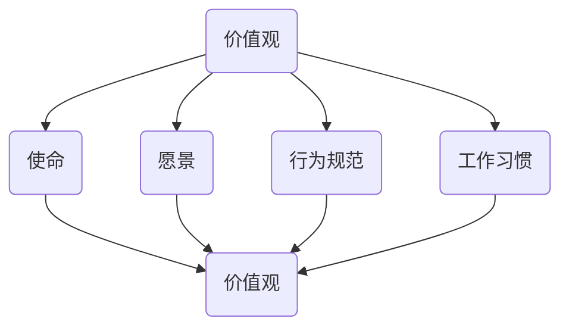

                 

### 文章标题

# 团队文化：价值观的塑造与传播

> 关键词：团队文化、价值观、组织行为、传播策略、文化构建、变革管理

> 摘要：本文深入探讨了团队文化的概念、核心价值观的塑造与传播，及其在组织管理中的应用。通过对核心概念的分析、核心算法的讲解、案例研究，以及未来趋势的展望，本文为团队文化的构建与变革提供了系统性的理论和实践指导。

----------------------------------------------------------------

## 引言

在当今快速变化和竞争激烈的商业环境中，团队文化的力量愈发凸显。团队文化不仅仅是一种氛围或情感，它更是一种价值观和行为的集合，能够塑造组织的内部氛围，影响员工的行为和决策，进而对组织的绩效和竞争力产生深远的影响。

### 团队文化的概念

团队文化是指一个团队在长期运营过程中形成的一系列共同的价值观、信仰、行为规范和工作习惯。这些价值观和信仰通常是团队共同认可的，并被视为组织内部的“软实力”。它们通过潜移默化的方式影响着团队成员的态度和行为，从而对团队的整体表现产生重要影响。

### 团队文化的重要性

团队文化的重要性主要体现在以下几个方面：

1. **增强凝聚力**：共同的文化价值观能够增强团队成员之间的信任和合作，提高团队的凝聚力。
2. **促进创新**：开放、包容的团队文化鼓励创新思维和尝试新方法，从而推动组织不断进步。
3. **提升绩效**：明确的文化目标和行为规范有助于提高团队成员的工作效率和绩效。
4. **降低离职率**：一个具有吸引力的团队文化能够减少员工离职率，保持组织的稳定性。
5. **提升品牌形象**：良好的团队文化能够提升组织在公众中的形象和声誉。

### 团队文化的影响

团队文化不仅影响内部员工的行为和态度，还对组织与外部环境的关系产生重要影响。例如：

1. **客户关系**：团队文化中的服务理念和服务标准直接影响客户体验和满意度。
2. **合作伙伴**：与合作伙伴的沟通和合作方式也受到团队文化的影响。
3. **市场竞争**：具有创新能力和强大执行力的团队文化能够提升组织在市场中的竞争力。

因此，团队文化已经成为组织管理和战略规划中不可或缺的一部分。接下来，本文将深入探讨团队文化的核心概念、价值观的塑造与传播，以及团队文化在组织管理中的应用。

----------------------------------------------------------------

## 团队文化的核心概念与联系

### 核心概念

团队文化由多个核心概念构成，这些概念相互联系，共同塑造了团队的文化氛围。以下是团队文化中的几个关键概念：

1. **价值观**：价值观是团队文化的核心，它是团队成员共同认同的一组信念和原则，指导团队的行为和决策。
2. **使命**：使命是团队存在的根本目的和长远目标，它为团队提供了方向和动力。
3. **愿景**：愿景是对团队未来的美好预期，它激发了团队成员的憧憬和努力。
4. **行为规范**：行为规范是团队对成员行为的基本要求，它确保团队内部的行为一致性。
5. **工作习惯**：工作习惯是团队成员长期形成的工作方式和态度，它影响了团队的效率和质量。

### 核心概念之间的联系

这些核心概念并非独立存在，它们之间存在紧密的联系，共同构成了团队文化的整体架构。以下是这些概念之间的联系：

1. **价值观与使命、愿景的联系**：
   - 价值观是团队文化的基石，它决定了团队对使命和愿景的理解和追求。
   - 使命和愿景则基于价值观，为团队提供了明确的方向和目标。

2. **行为规范与价值观的联系**：
   - 行为规范是价值观的具体体现，它通过规范成员的行为来确保团队的一致性。
   - 价值观为行为规范提供了基础和依据。

3. **工作习惯与行为规范的联系**：
   - 工作习惯是行为规范长期积累的结果，它反映了团队成员对规范的内化程度。
   - 行为规范通过工作习惯得以实现和巩固。

4. **价值观、使命、愿景、行为规范与工作习惯的联系**：
   - 这些概念相互影响，共同塑造了团队的文化氛围和工作方式。
   - 价值观决定了其他概念的内涵和方向，使命和愿景提供了目标和动力，行为规范确保了行为的规范性和一致性，而工作习惯则是这些因素共同作用的结果。

### Mermaid流程图

为了更清晰地展示这些核心概念之间的联系，我们可以使用Mermaid流程图来描述。以下是团队文化核心概念的Mermaid流程图：

在这个流程图中，A表示价值观，B表示使命，C表示愿景，D表示行为规范，E表示工作习惯，F表示它们共同的核心——价值观。通过这个流程图，我们可以更直观地理解团队文化核心概念之间的相互作用和影响。

### 核心概念与团队绩效

这些核心概念不仅构成了团队文化的基础，还直接影响了团队的绩效。例如：

1. **价值观**：明确的价值观能够帮助团队在面对挑战时保持一致和坚定，从而提高决策效率和执行力。
2. **使命和愿景**：清晰的使命和愿景能够激发团队成员的积极性和创造力，推动团队不断追求卓越。
3. **行为规范**：规范的行为能够确保团队成员在工作中的专业性和协作性，从而提高工作质量和效率。
4. **工作习惯**：良好的工作习惯能够提高团队成员的自律性和工作效率，有助于团队目标的实现。

综上所述，团队文化的核心概念相互联系，共同塑造了团队的文化氛围和工作方式，对团队的绩效产生了深远的影响。理解这些核心概念及其相互关系，是构建和优化团队文化的重要基础。

----------------------------------------------------------------

## 团队文化的构建

团队文化的构建是一个复杂而系统的过程，涉及多个关键环节。在这一部分，我们将详细探讨价值观的定位与构建、传播策略、传播渠道以及传播效果的评估。

### 价值观的定位与构建

#### 1.1 价值观的内涵与外延

价值观是指一个团队或组织共同认可的信仰和原则，它是团队文化的核心。价值观的内涵包括团队所追求的道德标准、行为准则和工作态度等。而价值观的外延则涵盖了团队的使命、愿景以及长期目标。

#### 1.2 价值观的定位原则

要成功构建团队文化，首先需要明确价值观的定位。以下是一些关键原则：

1. **符合组织使命和愿景**：价值观必须与组织的使命和愿景相一致，以保持团队的一致性和方向性。
2. **符合行业特点**：不同的行业有不同的文化特点，价值观的定位应考虑行业特性和市场需求。
3. **符合团队成员的期望**：价值观应考虑团队成员的需求和期望，以确保团队成员的认同和参与。
4. **简洁明了**：价值观应简洁明了，易于理解和传播，避免过于复杂或抽象。

#### 1.3 价值观的构建步骤

构建价值观的过程可以分为以下几个步骤：

1. **调研与分析**：通过对团队成员、市场和行业的研究，了解团队成员的需求、期望以及行业趋势。
2. **初步确立**：基于调研结果，初步确定团队的价值观，并形成草案。
3. **内部讨论**：将价值观草案提交给团队成员，进行讨论和反馈，以完善价值观的内涵。
4. **正式确立**：在充分讨论和修改后，正式确立团队的价值观，并通过内部公告或会议等形式进行发布和宣传。

### 价值观的传播

#### 2.1 传播策略

价值观的传播是构建团队文化的重要环节。以下是一些有效的传播策略：

1. **领导示范**：领导层的行为和态度是价值观传播的重要示范，通过领导的榜样作用，可以增强价值观的影响力。
2. **教育培训**：通过定期的培训和教育活动，向团队成员传递价值观，确保团队成员对价值观的理解和认同。
3. **内部沟通**：通过团队会议、内部邮件、公告板等形式，持续传播价值观，并鼓励团队成员分享他们的理解和经验。
4. **文化活动**：举办各种文化活动，如团队建设、团建活动等，通过互动和体验，加深团队成员对价值观的认同。

#### 2.2 传播渠道

有效的传播渠道是价值观传播的关键。以下是一些常用的传播渠道：

1. **面对面沟通**：通过团队会议、小组讨论、一对一沟通等形式，直接与团队成员交流价值观。
2. **线上平台**：利用内部社交媒体、邮件列表、论坛等线上平台，传播价值观和相关信息。
3. **文化手册**：编写团队文化手册，详细介绍价值观、使命、愿景等，作为团队成员学习和传播的参考资料。
4. **企业网站**：在企业网站上设立文化专区，发布与价值观相关的文章、视频和案例，提高团队成员的参与度。

#### 2.3 传播效果评估

为了确保价值观的传播达到预期效果，需要对传播效果进行评估。以下是一些评估方法：

1. **问卷调查**：通过问卷调查了解团队成员对价值观的认知和理解程度，评估传播效果。
2. **员工反馈**：定期收集员工的反馈意见，了解他们对价值观的认同程度和应用情况。
3. **行为观察**：通过观察团队成员在工作中的行为表现，评估价值观的落实情况。
4. **绩效分析**：分析团队的绩效数据，了解价值观对团队绩效的影响。

通过上述评估方法，可以及时发现问题，并采取相应的措施进行改进，确保价值观的传播和落实。

### 总结

团队文化的构建是一个持续的过程，需要明确的价值观定位、有效的传播策略和持续的效果评估。通过系统性的构建和传播，团队文化可以成为组织发展的强大动力，推动团队成员共同实现组织目标。

----------------------------------------------------------------

## 团队文化在组织管理中的应用

### 招聘与选拔中的文化匹配

团队文化的塑造与传播不仅需要在内部进行，还应在招聘与选拔过程中得到体现。招聘和选拔过程中，文化匹配成为关键因素。以下是团队文化在招聘与选拔中的应用：

#### 3.1.1 招聘中的文化匹配

1. **文化测评**：在招聘过程中，通过文化测评工具，如价值观问卷、行为量表等，评估候选人与团队文化的匹配程度。这些测评工具可以帮助筛选出符合团队价值观的候选人。
2. **文化面试**：在面试过程中，特别关注候选人的价值观、行为态度以及与团队文化的契合度。可以通过情景模拟、角色扮演等方式，观察候选人在模拟工作环境中的表现。
3. **文化宣讲**：在面试环节中，向候选人介绍团队文化，让其了解团队价值观、使命和愿景。这有助于候选人自我评估是否与团队文化相符。

#### 3.1.2 文化面试技巧

1. **开放式问题**：通过开放式问题引导候选人分享他们在过去的工作经历中如何体现团队价值观，以及如何处理与团队成员之间的冲突。
2. **情境化问题**：提出情境化问题，模拟团队中可能遇到的情况，考察候选人在面对挑战时的态度和应对策略。
3. **价值观对齐**：询问候选人对于团队价值观的理解和认同程度，以及他们如何在个人行为中体现这些价值观。

### 培训与发展中的文化塑造

培训与发展是团队文化塑造的重要环节，通过系统性的培训，帮助员工内化团队文化，提升团队凝聚力。

#### 3.2.1 培训内容设计

1. **价值观培训**：设计专门的价值观培训课程，包括团队价值观的内涵、意义以及如何在实际工作中应用。
2. **行为规范培训**：通过案例分析和角色扮演，让员工了解和掌握团队的行为规范，提高其在工作中的行为一致性。
3. **团队协作培训**：培养员工的团队协作能力，通过团队建设活动和协作工具的使用，增强团队成员之间的沟通与合作。

#### 3.2.2 培训方式选择

1. **内训课程**：组织内部培训师或邀请外部专家进行价值观、行为规范和团队协作等方面的内训课程。
2. **在线学习平台**：利用在线学习平台，提供丰富的学习资源和互动课程，方便员工随时学习和巩固团队文化知识。
3. **实战演练**：通过实际项目或案例演练，让员工在真实的工作环境中应用所学知识，提升团队文化意识和能力。

#### 3.2.3 培训效果评估

1. **行为观察**：通过观察员工在工作中的行为表现，评估培训效果。观察员工是否在工作中体现了团队价值观和行为规范。
2. **员工反馈**：定期收集员工对培训内容和效果的反馈意见，了解员工的实际需求和培训效果。
3. **绩效分析**：分析员工在工作中的绩效表现，了解培训对员工绩效提升的影响。

### 文化塑造的长期效果

团队文化在组织管理中的应用是一个长期的过程，需要持续的努力和优化。通过在招聘、选拔、培训和日常管理中融入团队文化，可以逐步塑造和巩固团队文化，提高团队的整体绩效和竞争力。

#### 3.3 长期效果

1. **增强凝聚力**：通过持续的团队文化建设，团队成员之间的信任和合作意识得到增强，团队的凝聚力显著提升。
2. **提高绩效**：明确的文化目标和行为规范有助于提高员工的工作效率和绩效，推动团队整体目标的实现。
3. **降低离职率**：具有吸引力的团队文化能够提高员工的满意度和忠诚度，降低离职率，保持组织的稳定性。

### 总结

团队文化在组织管理中的应用是一个系统性的过程，通过招聘与选拔中的文化匹配、培训与发展中的文化塑造以及日常管理中的文化传承，可以逐步构建和巩固团队文化，提升团队的绩效和竞争力。

----------------------------------------------------------------

## 案例研究：团队文化成功案例分析

### 5.1 案例选择标准

为了更好地理解团队文化对组织绩效的影响，本章节将分析几个具有代表性的成功案例。这些案例的选择标准如下：

1. **企业文化明确且深入人心**：案例中的企业文化需有明确的定义，并且得到员工的广泛认同和实践。
2. **组织绩效显著**：案例中的组织应在财务表现、市场份额、员工满意度等方面取得了显著的成绩。
3. **文化变革显著**：案例中的组织经历了显著的文化变革，并且这些变革对组织的长期发展产生了积极的影响。
4. **有可借鉴的经验和教训**：案例中的经验教训能够为其他组织提供有益的参考。

### 5.2 案例分析框架

为了全面分析这些成功案例，我们将采用以下框架：

1. **案例背景**：介绍案例组织的基本情况，包括行业、规模、历史背景等。
2. **文化变革过程**：描述组织如何识别文化问题，制定变革策略，并逐步实施文化变革。
3. **变革成果**：分析文化变革带来的具体成果，包括财务绩效、员工满意度、市场竞争力等。
4. **关键因素**：总结文化变革中的关键成功因素，包括领导层的支持、员工的积极参与、有效的传播策略等。
5. **启示与借鉴**：从案例中提炼出可借鉴的经验和教训，为其他组织提供参考。

### 5.3 案例详细分析

#### 5.3.1 案例一：谷歌的“创新文化”

**案例背景**：
- 谷歌（Google）是一家全球知名的互联网公司，成立于1998年。谷歌以其强大的创新能力、开放的企业文化和卓越的业绩而闻名于世。

**文化变革过程**：
- 谷歌在成立初期就明确了自己的核心价值观，包括“不满足现状、持续创新、对用户友好、责任感”等。这些价值观贯穿了谷歌的发展历程，并在公司内部广泛传播。
- 随着公司规模的扩大和外部环境的变化，谷歌不断调整和优化其文化策略。例如，谷歌推出了“20%时间政策”，允许员工将20%的工作时间用于个人感兴趣的项目，这一政策激发了员工的创新激情。
- 谷歌还通过内部培训、团队建设活动和公开演讲等方式，持续传递企业文化，确保员工对价值观的认同和内化。

**变革成果**：
- 谷歌的文化变革带来了显著的成果。公司不仅在财务表现上持续领先，还吸引了大量顶尖人才，保持了其市场竞争力。
- 通过创新文化的塑造，谷歌推出了众多成功的创新产品，如Google Maps、Gmail和Android等，这些产品改变了全球互联网的格局。

**关键因素**：
- 领导层的支持：谷歌的创始人谢尔盖·布林和拉里·佩奇一直重视企业文化，并将其视为公司成功的关键因素。
- 员工的积极参与：谷歌的员工积极参与企业文化的传播和实践，形成了浓厚的创新氛围。
- 有效的传播策略：谷歌通过多种渠道和方式，持续传递企业文化，确保员工的理解和认同。

**启示与借鉴**：
- 明确的核心价值观是企业文化的基础。
- 领导层的重视和支持是企业文化成功的关键。
- 员工的积极参与是企业文化实践的重要保障。
- 有效的传播策略能够确保企业文化的广泛传播和深入人心。

#### 5.3.2 案例二：苹果的“用户至上”文化

**案例背景**：
- 苹果（Apple）是一家全球知名的科技公司，以其创新的产品设计和卓越的用户体验而著称。苹果的成功离不开其独特的文化。

**文化变革过程**：
- 苹果在1984年乔布斯回归后，开始重塑企业文化。乔布斯强调“用户至上”的理念，认为产品的设计和用户体验是公司成功的关键。
- 苹果通过严格的品质控制和创新的设计，实现了对用户需求的精准把握。公司内部形成了以用户体验为核心的文化氛围。
- 苹果还通过定期的员工培训和交流，确保员工对用户至上的理念有深入的理解和实践。

**变革成果**：
- 苹果的文化变革带来了显著的成果。公司的产品在市场上备受好评，市场份额和品牌价值持续提升。
- 通过用户至上的文化塑造，苹果推出了iPhone、iPad和Mac等一系列成功的创新产品，改变了全球科技产业的格局。

**关键因素**：
- 用户至上的核心价值观：苹果将用户需求放在首位，不断优化产品设计和服务，确保用户的满意度和忠诚度。
- 创新的设计理念：苹果通过不断创新，提供独特的产品体验，赢得了用户的喜爱和信任。
- 员工的积极实践：苹果的员工在工作中积极践行用户至上的理念，将用户体验放在首位。

**启示与借鉴**：
- 用户至上的核心价值观是企业文化成功的关键。
- 创新的设计理念能够提升产品的市场竞争力。
- 员工的积极实践是企业文化成功的重要保障。

#### 5.3.3 案例三：亚马逊的“顾客导向”文化

**案例背景**：
- 亚马逊（Amazon）是一家全球领先的电子商务公司，以其高效的物流和卓越的顾客服务而著称。亚马逊的成功离不开其独特的文化。

**文化变革过程**：
- 亚马逊的创始人杰夫·贝佐斯始终强调“顾客导向”的文化，认为顾客的满意度是公司发展的核心。
- 亚马逊通过持续优化物流和顾客服务，确保顾客能够享受到高效的购物体验。
- 亚马逊还通过内部培训、员工激励等方式，确保员工对顾客导向的理念有深入的理解和实践。

**变革成果**：
- 亚马逊的文化变革带来了显著的成果。公司的顾客满意度持续提升，市场份额不断扩大。
- 通过顾客导向的文化塑造，亚马逊成为了全球电子商务的领导者，推动了整个行业的变革。

**关键因素**：
- 顾客至上的核心价值观：亚马逊将顾客满意度放在首位，不断优化产品和服务的质量。
- 高效的物流体系：亚马逊通过高效的物流体系，确保顾客能够快速收到商品。
- 员工的积极实践：亚马逊的员工在工作中积极践行顾客导向的理念，确保顾客的需求得到及时响应。

**启示与借鉴**：
- 顾客至上的核心价值观是企业文化成功的关键。
- 高效的物流体系能够提升顾客的购物体验。
- 员工的积极实践是企业文化成功的重要保障。

### 总结

通过对谷歌、苹果和亚马逊等成功案例的详细分析，我们可以看到团队文化在组织管理中的重要作用。明确的价值观、领导层的支持、员工的积极参与以及有效的传播策略，是文化变革成功的关键因素。这些案例的经验和教训，为其他组织提供了宝贵的参考和启示。

----------------------------------------------------------------

## 团队文化的变革与适应

### 6.1 变革的原因与挑战

团队文化的变革通常源于内部和外部因素。理解这些因素以及面临的挑战，有助于制定有效的变革策略。

#### 6.1.1 内部因素

1. **组织发展需求**：随着组织的成长和战略调整，原有的团队文化可能不再适应新的发展阶段。
2. **员工需求变化**：员工价值观和需求的变化可能导致现有文化无法满足员工的心理和职业发展需求。
3. **领导层更迭**：新领导层可能带来新的理念和管理风格，推动团队文化的变革。
4. **技术变革**：技术进步和行业变革可能要求团队调整文化以适应新的工作模式和技术应用。

#### 6.1.2 外部因素

1. **市场竞争**：外部市场环境的变化和竞争压力可能迫使组织调整文化以提升竞争力。
2. **法规政策**：新的法律法规和行业标准可能要求组织改变某些文化要素，以确保合规性。
3. **社会文化变迁**：社会文化的变迁可能影响组织内部的文化氛围，促使组织进行相应的文化调整。

#### 6.1.3 变革的挑战

1. **文化惯性的阻力**：团队成员对现有文化的惯性依赖可能导致变革的抵触。
2. **沟通不畅**：变革过程中，信息传递不畅可能导致误解和冲突。
3. **资源限制**：变革需要投入大量的人力和物力资源，资源限制可能影响变革的进程和效果。
4. **执行困难**：变革的执行过程中，可能面临员工的不适应、管理层的支持不足等问题。

### 6.2 变革策略

#### 6.2.1 变革管理

1. **明确变革目标**：制定清晰的变革目标和预期成果，确保团队成员理解变革的重要性和方向。
2. **建立变革团队**：组建专门的变革团队，负责规划和实施变革，提供专业的指导和支持。
3. **领导层支持**：确保领导层对变革的支持，通过他们的榜样作用和决策影响力，推动变革的顺利进行。

#### 6.2.2 变革实施步骤

1. **诊断分析**：对现有文化进行诊断分析，识别存在的问题和变革的必要性。
2. **制定方案**：基于诊断结果，制定详细的变革方案，包括变革目标、实施步骤、时间表和资源分配等。
3. **沟通与宣传**：通过内部沟通和宣传，让全体员工了解变革的背景、目标和实施计划，减少误解和抵触。
4. **培训与引导**：提供必要的培训和支持，帮助员工适应新的文化要求，确保变革的顺利落地。
5. **监测与调整**：持续监测变革的进展和效果，根据反馈进行必要的调整和优化。

### 6.2.3 变革的实施策略

1. **渐进式变革**：逐步引入变革，避免一次性变革带来的巨大冲击，提高员工适应速度。
2. **参与式变革**：鼓励员工参与变革的讨论和决策，提高他们的参与度和认同感。
3. **激励与奖励**：通过激励机制，鼓励员工积极参与变革，并对变革过程中的优秀表现给予奖励。

### 总结

团队文化的变革与适应是一个复杂而系统的过程，需要深入了解变革的原因和挑战，制定科学的变革策略，并持续监测和调整。通过有效的变革管理，组织可以不断优化文化，提升绩效和竞争力。

----------------------------------------------------------------

## 团队文化的未来趋势

### 7.1 技术对团队文化的影响

随着科技的快速发展，技术正在对团队文化产生深远的影响。以下是几个关键方面：

#### 7.1.1 数字化与团队文化

1. **远程办公**：数字化技术的普及使得远程办公成为可能，这改变了传统的工作方式，对团队文化的形成和维持提出了新的挑战。团队需要通过数字化工具来保持沟通和协作，同时培养新的价值观，如信任、透明度和自主性。
2. **信息共享**：数字化技术提高了信息共享的效率，有助于团队成员更好地了解组织的目标和文化，从而增强团队凝聚力。

#### 7.1.2 AI与团队文化

1. **自动化**：人工智能（AI）的自动化功能可以减少重复性工作，提高工作效率，但这也可能导致某些岗位的消失，对团队文化产生影响。团队需要适应这种变化，培养新的技能和价值观。
2. **智能协作**：AI可以辅助团队成员进行决策和协作，提高团队的整体效率。这要求团队成员具备良好的数据分析和沟通能力，以充分利用AI的优势。

### 7.2 未来团队文化的可能形态

#### 7.2.1 新型组织模式

1. **网络化组织**：未来的团队文化可能更加网络化，强调跨部门、跨地域的协作。团队成员通过数字化平台进行沟通和协作，形成一个虚拟的团队网络。
2. **扁平化组织**：扁平化的组织结构减少了层级障碍，提高了决策速度和员工参与度。这要求团队文化更加开放、透明和包容。

#### 7.2.2 跨文化融合

1. **多元文化团队**：随着全球化的深入，团队可能由来自不同文化背景的成员组成。这要求团队文化具有包容性和适应性，能够融合不同文化的优点，创造出新的团队文化。
2. **文化适应性**：团队需要培养文化适应性，以适应不断变化的全球环境和市场需求。

### 7.3 未来团队文化的发展方向

1. **可持续性**：未来的团队文化将更加注重可持续性，包括环境、社会和经济三个方面。团队需要通过创新和合作，实现可持续发展的目标。
2. **智慧化**：随着AI和大数据技术的发展，团队文化将更加智慧化，通过数据驱动的决策和协作，提高团队的整体效能。

### 总结

未来团队文化的形态将受到技术、全球化和社会变革的深刻影响。新型组织模式、跨文化融合以及可持续性将成为未来团队文化的重要特征。通过适应这些变化，团队可以不断提升自身的竞争力，实现长期发展。

----------------------------------------------------------------

## 总结与展望

### 8.1 团队文化的重要性重申

团队文化是一个组织的灵魂，它不仅影响着员工的态度和行为，还直接关系到组织的绩效和竞争力。明确的价值观、共同的使命和愿景，以及规范的行为准则，是团队文化不可或缺的组成部分。这些文化要素通过相互作用，塑造了团队的整体氛围和工作方式，为组织的发展提供了坚实的基石。

### 8.2 面临的挑战与解决方案

在当前快速变化的商业环境中，团队文化面临着诸多挑战：

1. **文化变革的难度**：随着外部环境和内部需求的变化，团队文化需要不断调整和更新。然而，文化变革往往面临惯性的阻力，员工对新文化的适应和接受需要一个过程。
2. **沟通与传播的障碍**：在全球化背景下，团队可能由来自不同文化背景的成员组成，沟通和传播成为一大挑战。确保所有成员理解并认同组织文化，需要采取有效的沟通策略和多元化的传播方式。
3. **技术的影响**：数字化和AI技术的快速发展，对团队文化提出了新的要求。如何利用技术优势，培养员工的数字素养和创新能力，是团队文化需要解决的问题。

针对这些挑战，以下是一些解决方案：

1. **加强领导层的支持**：领导层在文化变革中扮演关键角色。通过明确表达对变革的支持，领导层可以树立榜样，推动文化的更新和适应。
2. **建立多元化的沟通渠道**：利用现代通信技术和社交媒体，建立多元化的沟通渠道，确保文化信息能够迅速传递和广泛传播。
3. **培养员工的适应能力**：通过培训和教育，提升员工的适应能力和创新意识，使其能够积极应对技术变革和文化变革。

### 8.3 对未来团队文化的展望

展望未来，团队文化将呈现以下几个趋势：

1. **智慧化与数字化**：随着技术的不断进步，团队文化将更加智慧化和数字化。数据驱动的决策和协作将成为团队工作的重要组成部分。
2. **跨文化融合**：全球化背景下，团队文化将更加多元化和包容性。跨文化团队将成为常态，如何融合不同文化的优点，打造具有全球竞争力的团队文化，将是未来团队文化的重要课题。
3. **可持续性**：随着可持续发展理念的普及，团队文化将更加注重环境保护和社会责任。组织将通过创新和合作，实现经济、社会和环境的协调发展。

总之，未来团队文化的发展将面临诸多挑战，但也充满机遇。通过不断优化和更新文化，组织可以更好地适应外部环境的变化，提升竞争力，实现长期发展。

### 作者信息

**作者：AI天才研究院/AI Genius Institute & 禅与计算机程序设计艺术 /Zen And The Art of Computer Programming**

本文由AI天才研究院和禅与计算机程序设计艺术共同撰写，旨在为团队文化的构建和变革提供系统性理论和实践指导。两位作者在人工智能和计算机科学领域拥有丰富的经验和深厚的理论功底，致力于通过技术推动组织发展和文化创新。

----------------------------------------------------------------

本文通过系统的分析和深入的探讨，全面阐述了团队文化的概念、核心概念与联系、构建、应用、变革与适应，以及未来趋势。以下是本文的主要结论和要点：

### 结论与要点

1. **团队文化的概念**：团队文化是一个团队在长期运营过程中形成的一系列共同的价值观、信仰、行为规范和工作习惯。
2. **核心价值观的塑造与传播**：明确的价值观是团队文化的核心，通过定位、构建、传播和评估，确保团队成员的认同和实践。
3. **团队文化在组织管理中的应用**：招聘与选拔中的文化匹配、培训与发展中的文化塑造，以及日常管理中的文化传承，是构建团队文化的重要途径。
4. **变革与适应**：面对内部和外部挑战，团队文化需要不断变革和适应，通过有效的变革管理策略，确保文化的持续更新和优化。
5. **未来趋势**：技术进步和全球化背景下，团队文化将趋向智慧化、数字化和可持续性，跨文化融合将成为常态。

### 最佳实践 Tips

1. **领导层的支持**：领导层在文化塑造中扮演关键角色，需要明确表达对文化的支持，并通过行动树立榜样。
2. **沟通与宣传**：利用多元化的沟通渠道和方式，确保文化信息能够迅速传递和广泛传播。
3. **员工参与**：鼓励员工积极参与文化建设和变革，提升他们的参与度和认同感。
4. **持续优化**：团队文化是一个持续的过程，需要不断评估和优化，以适应组织发展的需求。

### 小结

本文通过系统性的分析和案例研究，为团队文化的构建和变革提供了全面的指导。通过理解团队文化的核心概念和相互关系，组织可以更好地塑造和传播文化，提升团队绩效和竞争力。

### 注意事项

1. **文化变革的难度**：文化变革需要时间和努力，需要逐步推进，避免一次性变革带来的冲击。
2. **沟通与传播的障碍**：确保文化信息能够有效传递和广泛传播，减少误解和冲突。
3. **技术的影响**：利用技术优势，培养员工的数字素养和创新能力，以适应技术变革。

### 拓展阅读

1. **《企业文化管理》**：探讨企业文化的概念、构建和变革，提供实用的管理策略。
2. **《团队动力》**：研究团队动力和团队文化的关系，探讨如何提升团队效能。
3. **《跨文化管理》**：分析跨文化团队的管理挑战和策略，提供全球化的管理视角。

通过本文的深入探讨，希望读者能够更好地理解和应用团队文化，为组织的发展和创新提供有力支持。

