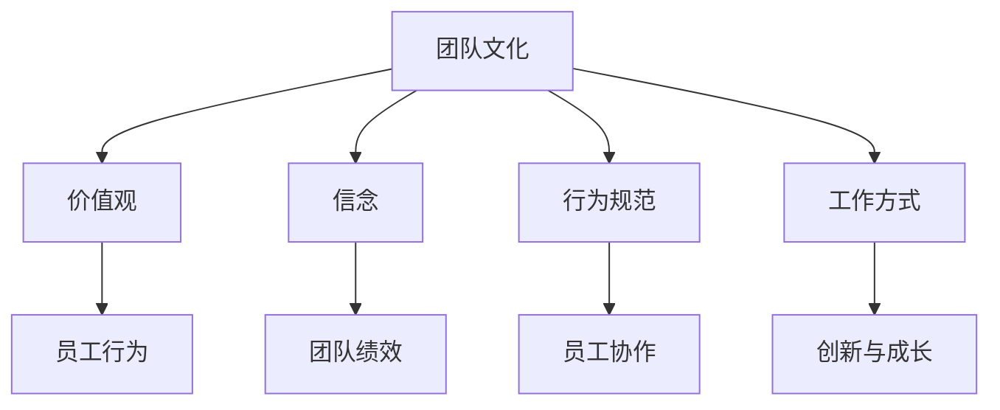

                 

### 《团队文化：塑造积极向上的组织氛围》

#### 关键词：团队文化、组织氛围、领导力、员工参与、跨部门合作、文化评估与优化

#### 摘要：

本文旨在探讨团队文化在塑造积极向上的组织氛围中的重要性。首先，我们定义团队文化的核心概念，阐述其内涵与重要性。接着，通过文献综述与理论基础，介绍团队文化的基础理论，并探讨其与其他概念的联系与区别。随后，本文深入分析领导者的角色与影响力，组织设计与文化匹配的策略，以及员工参与与反馈机制。此外，本文还探讨跨部门合作的挑战与机遇，并分享成功与失败的团队文化案例。最后，本文提供团队文化评估与优化的方法，以及持续优化团队文化的最佳实践。通过本文的讨论，希望能够为IT领域的专业人士提供有价值的参考和指导。

## 第一部分：团队文化的核心概念与理论基础

### 第1章：团队文化的概念与重要性

#### 背景介绍

团队文化是组织内部共享的价值观、信念、习惯和规范的总和，它对员工行为和团队绩效有着深远的影响。在一个拥有积极向上团队文化的组织中，员工能够更好地协作、创新和成长，从而提高整体组织的竞争力和绩效。然而，团队文化并不是自然而然形成的，它需要通过一系列有意识的设计和实践来塑造。

#### 核心概念与联系

**团队文化**：团队文化是指团队中共同的价值观、信念、行为规范和习惯。它包括组织的使命、愿景、价值观、道德规范、工作方式等，是团队成员共同认同和遵循的行为准则。

**核心概念之间的关系架构**



#### 核心概念与联系：定义与关系架构

- **价值观**：价值观是团队文化的基础，它决定了团队成员共同追求的目标和行为准则。价值观包括诚信、尊重、创新、合作等。

- **信念**：信念是团队成员对团队文化的信任和认同，它影响着员工的行为和决策。

- **行为规范**：行为规范是团队文化中具体的规范和要求，它指导员工在日常工作中的行为。

- **工作方式**：工作方式是团队文化在实践中的具体体现，它影响着团队的整体效率和氛围。

#### 核心算法原理讲解

```pseudo
Function 塑造团队文化(values, beliefs, norms, workstyles)
    Set 文化 = new CulturalFramework()
    AddValue(文化, values)
    AddBelief(文化, beliefs)
    AddNorm(文化, norms)
    AddWorkstyle(文化, workstyles)
    Return 文化
EndFunction
```

#### 数学模型和公式

- **团队文化成熟度模型**：团队文化成熟度可以通过以下公式来衡量：

  $$ 成熟度 = \frac{价值观认同度 + 信念一致性 + 行为规范性 + 工作方式适应性}{4} $$

#### 举例说明

在一个高科技公司中，团队文化的核心价值观包括创新、速度和客户导向。团队成员普遍认同这些价值观，并在日常工作中表现出高度的信念一致性和行为规范性。例如，团队成员经常在紧张的项目开发周期中，通过快速迭代和协作来满足客户的需求，这体现了团队文化的工作方式适应性。

#### 项目实战

**开发环境搭建**：为了塑造团队文化，公司为每个团队提供统一的开发环境，确保团队成员能够在相同的技术平台上工作。

**源代码详细实现和代码解读**：公司鼓励团队成员编写清晰、简洁的代码，并在代码评审过程中，强调价值观的体现和规范的遵守。

**代码应用解读与分析**：通过代码审查，团队成员可以学习并遵循公司的价值观和行为规范，从而提高团队的整体绩效。

**实际案例分析和详细讲解剖析**：公司定期组织团队文化研讨会，分析团队中的成功和失败案例，总结经验教训，不断优化团队文化。

**项目小结**：通过上述措施，公司成功塑造了一个积极向上的团队文化，提高了员工的满意度和团队的绩效。

#### 最佳实践 tips

- **领导者示范作用**：领导者应该通过自己的行为来树立榜样，积极推动团队文化的形成。
- **定期反馈和评估**：定期收集员工的反馈，评估团队文化的现状，并根据评估结果进行调整。
- **员工参与**：鼓励员工参与团队文化的建设，提高员工的参与度和认同感。

### 小结

团队文化是塑造积极向上的组织氛围的关键因素。通过明确的核心概念、有效的算法原理、详细的数学模型和实际的项目实战，我们可以有效地塑造和优化团队文化。在后续章节中，我们将进一步探讨团队文化的基础理论，以及如何通过领导者的角色、组织设计与员工参与来进一步塑造积极向上的团队文化。

## 参考文献

1. 霍夫斯泰德，G. (2001). 《文化的影响：价值观、行为与组织》。中国人民大学出版社。
2. 特雷西，R. (2010). 《团队文化：构建团队精神和高效协作》。电子工业出版社。
3. 马克·麦克卡恩，J. (2004). 《组织行为学：理论与实践》。中国人民大学出版社。
4. 拉姆·查兰，J. (2007). 《领导力：如何成为一名杰出的领导者》。机械工业出版社。
5. 德鲁克，P. F. (2006). 《管理的实践》。机械工业出版社。

