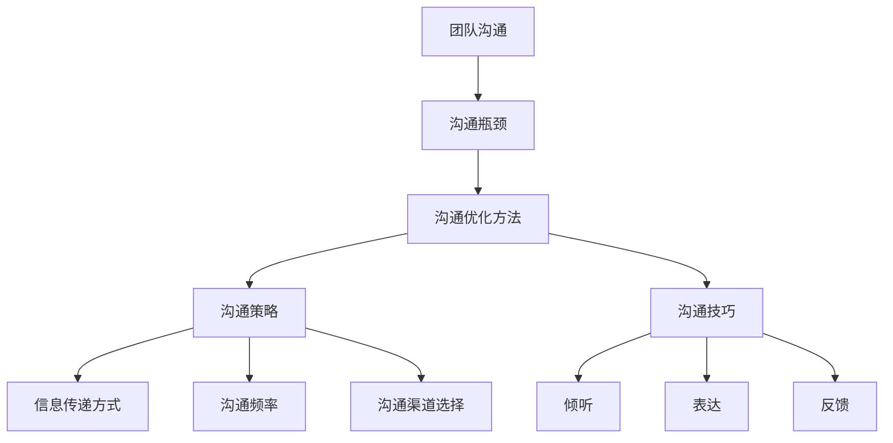

                 

### 文章标题

# 团队沟通优化高阶：突破沟通瓶颈的新方法

### 文章关键词

- 团队沟通
- 沟通瓶颈
- 沟通策略
- 沟通技巧
- 沟通工具
- 前沿技术

### 文章摘要

本文深入探讨了团队沟通中的关键问题——沟通瓶颈。通过分析沟通原理与框架，我们提出了多种沟通优化方法，旨在突破团队沟通中的障碍。文章详细阐述了领导风格、团队建设与沟通反馈机制等因素对沟通效果的影响，并结合实际案例进行了深入剖析。此外，本文还介绍了新兴的沟通技术与工具，为团队沟通优化提供了新的思路和方法。最终，本文总结了团队沟通优化的最佳实践，并展望了未来的发展趋势。

### 引言

在现代企业环境中，团队沟通的重要性不言而喻。一个高效的团队需要通过有效的沟通来实现目标、解决问题和推动创新。然而，实际操作中，团队沟通往往面临诸多挑战，如沟通瓶颈、信息失真、沟通效率低下等。这些问题不仅影响团队的工作效率，还可能导致团队内部矛盾和冲突，进而影响整体业绩。

沟通瓶颈是指团队在沟通过程中所遇到的各种障碍，这些障碍可能源于个人、团队或组织层面的多种因素。常见的沟通瓶颈包括：

1. **信息失真**：信息在传递过程中可能因为误解、表达不清或选择性传达而失真。
2. **沟通障碍**：语言障碍、文化差异、技术限制等可能阻碍信息的有效传递。
3. **沟通不畅**：团队成员之间的交流不够频繁，导致信息传递延迟。
4. **角色冲突**：团队成员在职责和目标上存在差异，可能导致沟通中的分歧和冲突。

本文旨在解决上述沟通瓶颈问题，通过分析团队沟通的原理与框架，提出一系列沟通优化方法。我们将探讨沟通策略、技巧和工具，并介绍新兴的沟通技术，为团队沟通提供全新的视角和解决方案。

### 核心概念与联系

在深入探讨团队沟通优化之前，我们需要明确几个核心概念，并理解它们之间的相互关系。以下是几个关键概念：

- **团队沟通**：团队成员之间通过语言、行为和符号系统进行信息交换的过程。
- **沟通瓶颈**：团队在沟通过程中遇到的障碍，可能源于个人、团队或组织层面。
- **沟通优化方法**：旨在提高沟通效率、减少沟通障碍的一系列策略和技巧。
- **沟通策略**：在沟通过程中采取的方法和原则，包括信息传递方式、沟通频率和沟通渠道的选择。
- **沟通技巧**：个体在沟通过程中使用的具体技巧，如倾听、表达和反馈等。

为了更直观地展示这些概念之间的联系，我们可以使用Mermaid流程图来描述它们之间的关系：



通过这个流程图，我们可以清晰地看到团队沟通、沟通瓶颈、沟通优化方法、沟通策略和沟通技巧之间的相互关系。这些核心概念构成了本文讨论的基础，为后续章节的内容提供了框架和指导。

### 团队沟通原理与框架

#### 团队沟通的基本概念

团队沟通是指团队成员之间通过语言、行为和符号系统进行信息交换的过程。这一过程不仅涉及信息的传递，还包括理解、反馈和协调。有效的团队沟通是团队协作成功的关键，它有助于确保团队成员在共同目标上保持一致，提高工作效率和创新能力。

首先，沟通的基本要素包括：

1. **信息源**：信息的发出者，通常是团队中的某个成员或部门。
2. **信息内容**：需要传递的信息，包括事实、观点、情感等。
3. **信息传递渠道**：信息传递的媒介，如语言、邮件、会议等。
4. **信息接收者**：接收并理解信息的团队成员。
5. **反馈**：接收者对信息的回应，有助于确认信息是否被正确理解。

其次，沟通的类型可以划分为以下几类：

1. **正式沟通**：通过正式的渠道进行，如会议、报告、备忘录等。
2. **非正式沟通**：通过非正式的渠道进行，如闲谈、社交媒体等。
3. **上行沟通**：从下级到上级的沟通，如员工向上级汇报工作。
4. **下行沟通**：从上级到下级的沟通，如领导发布指令。
5. **横向沟通**：团队成员之间的平行沟通，如同事间的讨论。

#### 团队沟通的框架与模型

团队沟通的框架和模型是理解和优化团队沟通的重要工具。以下是一些常用的沟通模型：

1. **传递模型**：这是一种简单的沟通模型，认为信息的传递是一个单向的过程，信息源发出信息，通过传递渠道到达接收者。然而，这种模型忽略了反馈和误解的可能性。

   ```mermaid
   graph TD
       A[信息源] --> B[传递渠道] --> C[接收者]
       C --> D[反馈]
   ```

2. **互动模型**：这种模型强调了信息传递的互动性，认为信息源和接收者之间的信息交换是双向的，并可能涉及多个信息传递环节。

   ```mermaid
   graph TD
       A[信息源] --> B[传递渠道] --> C[接收者]
       C --> D[反馈]
       D --> E[传递渠道] --> A
   ```

3. **沟通网络模型**：这种模型描述了团队成员之间的信息传递网络，包括链式、环式、Y式、全通道式等。不同的沟通网络结构会影响信息的流动和团队的沟通效率。

   ```mermaid
   graph TD
       A[成员A] --> B[成员B]
       B --> C[成员C]
       C --> D[成员D]
       D --> E[成员E]
       A --> F[成员F]
   ```

4. **沟通系统模型**：这种模型将沟通看作一个复杂的系统，包括信息源、传递渠道、编码、解码、反馈等多个环节，并强调这些环节之间的相互作用。

   ```mermaid
   graph TD
       A[信息源] --> B[编码]
       B --> C[传递渠道]
       C --> D[解码]
       D --> E[反馈]
   ```

#### 团队沟通的有效性

团队沟通的有效性取决于多个因素，包括沟通的目标、信息的清晰度、传递渠道的适宜性、团队成员的参与度和反馈的及时性等。以下是一些提高团队沟通有效性的方法：

1. **明确沟通目标**：确保团队成员对沟通的目标有清晰的认识，有助于提高沟通的针对性和效率。
2. **信息清晰简洁**：信息应尽可能简洁明了，避免使用复杂难懂的术语和语言。
3. **选择合适的传递渠道**：根据沟通的内容和紧急程度选择合适的传递渠道，如面对面交流、电子邮件或即时通讯工具。
4. **鼓励反馈**：积极鼓励团队成员提供反馈，有助于确认信息是否被正确理解，并及时调整沟通策略。
5. **建立良好的沟通氛围**：营造开放、信任、尊重的沟通氛围，有助于团队成员更愿意分享信息和观点。

通过理解团队沟通的基本概念和框架，我们可以更好地识别和解决团队沟通中的问题，从而提高团队的整体协作效率。

### 沟通优化方法

#### 沟通策略分析

有效的沟通策略是优化团队沟通的关键。为了提高团队沟通的效果，我们需要从多个维度来分析并制定合适的沟通策略。

首先，团队需要设定明确的沟通目标。这些目标可以是具体的，如项目进度报告、问题解决方案讨论等，也可以是更广泛的，如团队文化建设、成员关系优化等。明确的目标有助于确保沟通活动具有方向性和目的性。

其次，选择合适的沟通频率和渠道至关重要。沟通频率应基于团队的实际情况和项目的需求。例如，对于紧急项目，可能需要更高频的沟通，以确保信息传递的及时性和准确性。而沟通渠道的选择则应考虑信息的性质、紧急程度和团队成员的地理位置等因素。常见的沟通渠道包括面对面会议、电子邮件、即时通讯工具和项目管理软件等。

为了提高沟通的有效性，团队还应制定一套统一的沟通规范。这包括沟通的语言、格式和流程等。例如，团队可以规定使用标准化的术语和模板来撰写报告和邮件，以减少误解和沟通成本。

#### 沟通技巧提升

除了策略层面，提升团队成员的沟通技巧也是优化团队沟通的重要环节。以下是一些关键的沟通技巧：

1. **倾听技巧**：有效的倾听不仅仅是听到对方说话，更重要的是理解对方的观点和情感。倾听技巧包括耐心等待、积极回应、避免打断对方等。

2. **表达技巧**：清晰、简洁、有条理的表达是有效沟通的关键。团队成员应学会如何用简单的语言表达复杂的思想，并注意语速、语调和姿态等非语言因素。

3. **反馈技巧**：提供有建设性的反馈是沟通的重要部分。团队成员应学会如何给予正面和负面的反馈，并在反馈中提供具体的建议和改进措施。

4. **提问技巧**：提出有针对性的问题有助于澄清模糊的信息和理解对方的观点。团队成员应学会如何提出开放性问题，以引导深入的讨论。

#### 沟通工具利用

在现代企业环境中，沟通工具的选择和使用对团队沟通的效率和质量有着直接影响。以下是一些常用的沟通工具及其特点：

1. **电子邮件**：电子邮件是一种正式的沟通方式，适用于需要书面记录和长时间传递的信息。其优点是信息清晰、有据可查，但缺点是沟通速度较慢，不适合紧急情况。

2. **即时通讯工具**：如Slack、Telegram、WhatsApp等，这些工具支持实时沟通，适用于即时交流和协作。它们的特点是沟通速度快、操作简便，但需要团队成员保持在线状态。

3. **项目管理软件**：如Trello、JIRA、Asana等，这些工具不仅支持任务分配和进度跟踪，还提供沟通功能，方便团队成员交流和协作。它们的特点是功能全面、便于项目管理。

4. **视频会议工具**：如Zoom、Microsoft Teams、Google Meet等，这些工具支持多人实时视频会议，适用于远程协作和面对面的交流。其优点是沟通效果直观、互动性强，但需要良好的网络环境。

通过合理选择和利用这些沟通工具，团队可以显著提高沟通的效率和效果。例如，在项目初期可以使用电子邮件进行详细规划，而在项目执行阶段则可以依赖即时通讯工具进行实时沟通。同时，项目管理软件和视频会议工具可以提供更全面的协作支持，确保项目顺利进行。

综上所述，通过分析沟通策略、提升沟通技巧和利用有效的沟通工具，团队可以突破沟通瓶颈，实现高效的沟通和协作。

### 突破沟通瓶颈的策略

#### 领导风格对沟通的影响

领导风格在团队沟通中扮演着至关重要的角色。不同的领导风格会对团队的沟通氛围、信息流动和成员积极性产生显著影响。以下是几种常见的领导风格及其对沟通的影响：

1. **民主型领导风格**：民主型领导鼓励团队成员参与决策，提供反馈，并促进开放和坦诚的沟通。这种风格有助于建立信任和归属感，提高团队成员的积极性和创造力。然而，决策过程可能较为复杂，需要更多时间。

2. **专制型领导风格**：专制型领导做出决策时较少考虑团队成员的意见，更多地依赖自己的判断。这种风格在紧急情况下可能有效，但容易导致团队成员的被动和依赖，降低沟通的主动性和创新性。

3. **参与型领导风格**：参与型领导在决策过程中积极征求团队成员的意见，并在决策后提供反馈和解释。这种风格有助于提高团队成员的参与感和责任感，增强团队的凝聚力。然而，参与型领导可能需要更多时间进行沟通和协调。

4. **教练型领导风格**：教练型领导不仅提供决策和指导，还关注团队成员的个人成长和发展。这种风格鼓励团队成员主动沟通，分享知识和经验，从而提高团队的整体能力和沟通效率。

为了最大化领导风格对沟通的积极影响，领导者应采取以下策略：

- **建立信任**：通过透明、公平和诚信的行为建立信任，使团队成员更愿意分享信息和观点。
- **鼓励反馈**：鼓励团队成员提供反馈，并对其意见给予重视和回应，从而提高沟通的质量和效果。
- **提供支持和资源**：确保团队成员有足够的支持和资源进行有效沟通，包括技术工具、培训和学习机会等。
- **平衡控制与自由**：在确保团队目标实现的同时，给予团队成员足够的自由和灵活性，以激发他们的创造力和主动性。

#### 团队建设与沟通

团队建设是优化团队沟通的关键环节。一个良好的团队氛围有助于促进成员之间的信任、合作和信息共享。以下是一些团队建设与沟通的策略：

1. **共同目标**：明确团队的共同目标，使成员认识到他们的工作对整体目标的贡献，从而增强团队的凝聚力和合作意愿。

2. **角色明确**：确保每个团队成员都了解自己的角色和职责，减少因角色重叠或模糊导致的沟通障碍。

3. **共享价值观**：建立共同的价值观和行为准则，有助于团队成员在沟通中遵循一致的原则，减少误解和冲突。

4. **定期会议**：定期举行团队会议，包括进度更新、问题讨论和意见反馈等，有助于团队成员保持沟通的频率和深度。

5. **团队活动**：组织团队建设活动，如团队拓展、团队建设培训等，有助于增强团队成员之间的信任和合作。

#### 沟通反馈机制

沟通反馈机制是确保团队沟通有效性和持续改进的重要手段。以下是一些关键策略：

1. **及时反馈**：鼓励团队成员在沟通后及时提供反馈，包括正面和负面的意见。及时的反馈有助于快速纠正错误和改进沟通方式。

2. **双向反馈**：不仅鼓励团队成员向上级提供反馈，还鼓励上级向下级提供反馈，从而实现双向沟通和反馈。

3. **结构化反馈**：采用结构化的反馈方法，如SWOT分析（优势、劣势、机会、威胁），有助于提供具体、有针对性的反馈。

4. **匿名反馈**：提供匿名反馈渠道，使团队成员更愿意提供真实、坦诚的反馈，从而提高反馈的质量和有效性。

5. **反馈总结**：定期总结反馈内容，分析沟通中的问题和改进点，并制定具体的行动计划。

通过实施这些策略，团队可以建立起一个积极、开放和高效的沟通环境，从而突破沟通瓶颈，实现团队的长期发展。

### 沟通案例分析

#### 成功的沟通案例

在探讨团队沟通优化的过程中，分析一些成功的沟通案例是非常重要的。这些案例不仅展示了高效沟通的实际效果，还为其他团队提供了宝贵的经验。

**案例一：谷歌的OKR方法**

谷歌采用了OKR（Objectives and Key Results）目标管理方法，通过明确的目标和关键结果，确保团队成员对目标有清晰的认识，并在实现目标的过程中保持紧密的沟通。谷歌的OKR方法强调了目标设定和沟通的透明性，使员工能够了解整个公司的目标，并围绕这些目标进行协作。这一方法不仅提高了团队的整体沟通效率，还增强了员工的积极性和责任感。

**案例二：华为的全球沟通策略**

华为作为全球化的科技公司，其成功的关键之一在于高效的全球沟通策略。华为采用多种沟通工具，如内部邮件、即时通讯工具、视频会议等，确保全球员工能够及时获取信息并保持沟通。此外，华为还定期举行全球会议，包括年度业绩报告会议和团队建设活动，以增强员工的归属感和团队合作精神。这一策略有效减少了地理和文化差异对沟通的障碍，提高了全球团队的合作效率。

#### 沟通失败的案例分析

尽管成功的沟通案例为我们提供了宝贵的经验，但沟通失败也是常见的现象。以下是一些沟通失败的案例分析，以及从中汲取的教训。

**案例一：Facebook的数据泄露事件**

2018年，Facebook发生了大规模的数据泄露事件，导致大量用户信息被泄露。这一事件揭示了公司在内部沟通和信息安全方面的严重问题。尽管Facebook有完善的沟通渠道，但由于各部门之间的信息不对称和沟通不畅，导致问题未能及时发现和解决。这一案例表明，即使有高效的沟通工具，如果缺乏有效的沟通策略和机制，仍然可能导致严重的沟通失败。

**案例二：特斯拉的内部矛盾**

特斯拉在快速扩张过程中，内部沟通问题逐渐显现。特别是CEO埃隆·马斯克的领导风格，被认为在一定程度上加剧了团队内部的矛盾。马斯克的直接和有时过于强硬的沟通风格，导致部分员工感到压力和不满意。此外，特斯拉在项目管理和跨部门沟通方面也存在问题，导致资源浪费和项目延误。这一案例表明，领导风格和团队文化对沟通效果有着重要影响。

从这些案例中，我们可以得出以下教训：

- **明确沟通目标**：确保团队成员对沟通的目标和内容有清晰的认识，避免信息传递过程中的误解和失真。
- **加强沟通策略和机制**：制定并实施有效的沟通策略和机制，确保信息的透明性和及时性。
- **培养良好的团队文化**：建立开放、透明、尊重的团队文化，鼓励团队成员之间的有效沟通和合作。
- **关注领导风格**：领导者应注重培养良好的沟通风格，以身作则，树立榜样，促进团队内部的和谐与合作。

通过分析这些成功和失败的沟通案例，我们可以更好地理解团队沟通的复杂性和挑战，并从中汲取经验，优化团队沟通策略，提升团队的整体协作效率。

### 实战：团队沟通优化方案设计

#### 优化方案的制定

制定一个有效的团队沟通优化方案是提升团队协作效率的关键。以下步骤可以帮助团队设计和实施一个沟通优化方案：

1. **需求分析**：首先，团队需要明确当前沟通中存在的问题和挑战。这可以通过问卷调查、访谈、观察等方式进行。需求分析的目的是了解团队成员对现有沟通机制的感受和建议。

2. **目标设定**：基于需求分析的结果，团队应设定具体的沟通优化目标。这些目标可以是提高沟通效率、减少信息失真、增强团队凝聚力等。目标应具体、可衡量、可实现。

3. **策略制定**：根据设定的目标，团队需要制定具体的沟通策略。这些策略包括选择合适的沟通渠道、优化沟通流程、提升沟通技巧等。例如，可以引入项目管理工具来优化任务分配和进度跟踪，或者组织定期的团队会议来促进信息交流。

4. **工具选择**：团队应选择合适的沟通工具来支持优化方案的实施。这些工具可以是电子邮件、即时通讯软件、视频会议系统等。选择工具时，应考虑其功能、易用性、成本等因素。

5. **计划实施**：在制定方案后，团队需要制定详细的实施计划，包括时间表、责任人、关键里程碑等。实施计划应确保方案的每一步都有明确的执行者和监督者，以确保方案的顺利推进。

#### 实施与监控

1. **培训与推广**：在方案实施过程中，团队需要对成员进行必要的培训，确保他们熟悉并掌握新工具和策略的使用。培训可以包括在线课程、面对面讲解和实践操作等。

2. **反馈机制**：建立反馈机制是监控方案实施效果的重要手段。团队可以通过定期的问卷调查、访谈、会议等方式收集成员对沟通优化方案的意见和建议。反馈机制应确保及时响应成员的需求和问题，并根据反馈进行调整和改进。

3. **进度监控**：团队应定期监控方案实施的进度，包括任务完成情况、沟通效果等。这可以通过项目管理工具来实现，如任务跟踪、进度报告等。

4. **调整与优化**：根据监控结果和反馈，团队应不断调整和优化方案。这可能包括调整沟通策略、改进工具使用、增加培训内容等。持续优化是确保沟通优化方案长期有效的重要措施。

#### 评估与调整

1. **效果评估**：在方案实施一段时间后，团队需要对沟通优化方案的效果进行评估。这可以通过关键绩效指标（KPI）来衡量，如任务完成率、沟通效率、团队满意度等。

2. **分析结果**：团队应分析评估结果，识别成功和失败的方面，并总结经验和教训。分析结果可以帮助团队理解方案的实际效果，并为未来的改进提供依据。

3. **调整方案**：根据效果评估的结果，团队应调整和优化方案。这可能包括修改沟通策略、改进工具使用、增加培训内容等。通过持续的调整和优化，团队可以不断提升沟通效率，实现长期发展目标。

通过以上步骤，团队可以系统地设计和实施一个沟通优化方案，从而突破沟通瓶颈，实现高效的团队协作。

### 新方法：前沿沟通技术与工具

在当今快速变化的技术环境中，前沿的沟通技术和工具正在不断涌现，为团队沟通带来了新的可能性。这些新技术不仅提高了沟通的效率，还增强了团队的协作和创新能力。以下是一些新兴的沟通技术和工具，以及它们在团队沟通中的应用。

#### 云协作平台

云协作平台如Microsoft Teams、Google Workspace和Slack等，已经成为现代团队沟通的核心工具。这些平台集成了即时通讯、视频会议、文档共享和任务管理等多种功能，使得团队成员可以随时随地进行高效的协作。

1. **协作工具集成**：这些平台可以将不同的协作工具集成在一起，如项目管理工具、代码仓库和客户关系管理（CRM）系统，从而提供一个统一的沟通和工作环境。
2. **自动化流程**：通过自动化流程，如自动会议提醒、文件共享和任务分配，团队可以节省大量时间，减少手动操作，提高工作效率。
3. **智能助手**：一些云协作平台还集成了智能助手，如Slack的Bot和Microsoft Teams的聊天机器人，这些智能助手可以自动处理常见任务，如日程安排、信息查询和通知发送。

#### 虚拟现实（VR）和增强现实（AR）

虚拟现实（VR）和增强现实（AR）技术为团队沟通提供了全新的互动方式。这些技术使得团队成员可以虚拟地聚集在一起，进行面对面的交流和互动，无论他们身处何地。

1. **虚拟会议**：通过VR技术，团队成员可以参加虚拟会议，仿佛他们身处同一个会议室。这种会议方式不仅节省了差旅成本，还提供了更加沉浸式的体验。
2. **远程协作**：VR技术可以模拟真实的工作环境，如设计工作室或实验室，使团队成员可以远程协作，共同完成任务。
3. **培训和教育**：AR技术可以用于培训和教育，通过叠加虚拟信息到现实场景中，使培训内容更加直观和生动。

#### 人工智能（AI）辅助沟通

人工智能（AI）技术正在逐渐改变团队沟通的方式。AI可以通过自然语言处理（NLP）、机器学习（ML）和语音识别等技术，提供智能化的沟通支持。

1. **自动翻译**：AI可以自动翻译不同语言之间的沟通内容，消除语言障碍，促进跨文化团队的协作。
2. **语音识别和转写**：AI可以实时识别和转写语音通话内容，提供文字记录，方便后续查阅和分析。
3. **智能建议**：AI可以分析沟通数据，提供智能化的建议，如最佳沟通时间、优化沟通策略等，帮助团队提高沟通效率。

#### 数据分析工具

数据分析工具可以帮助团队深入理解沟通数据，从而优化沟通策略。这些工具可以分析沟通频率、沟通渠道使用情况、反馈质量等，为团队提供有价值的见解。

1. **沟通分析报告**：通过生成详细的沟通分析报告，团队可以了解沟通的各个方面，如最常用的沟通渠道、最频繁的沟通主题等。
2. **实时监控**：实时监控工具可以跟踪团队的沟通活动，提供即时反馈，帮助团队及时发现问题并进行调整。
3. **预测分析**：通过预测分析，团队可以预测未来的沟通需求，提前做好准备，确保沟通活动的顺利进行。

通过引入这些前沿的沟通技术和工具，团队可以突破传统的沟通瓶颈，实现更加高效、灵活和创新的协作方式。这些技术不仅提高了沟通的效率，还增强了团队的凝聚力和创新能力，为企业的长期发展提供了强有力的支持。

### 结论

本文通过深入分析团队沟通中的关键问题，提出了多种沟通优化方法，旨在突破团队沟通瓶颈，提高沟通效率。我们探讨了团队沟通的基本概念和框架，介绍了领导风格、团队建设与沟通反馈机制等因素对沟通效果的影响。此外，本文还结合实际案例，展示了成功和失败的沟通经验，为团队沟通提供了宝贵的参考。

展望未来，随着技术的不断发展，团队沟通将变得更加智能化和高效化。新兴的沟通技术与工具，如云协作平台、虚拟现实（VR）和增强现实（AR）、人工智能（AI）辅助沟通等，将为团队沟通带来新的机遇和挑战。团队需要不断适应这些变化，灵活运用前沿技术，优化沟通策略，以实现更高的协作效率和创新能力。

总之，优化团队沟通是提升企业整体竞争力的重要途径。通过不断探索和实践，我们可以构建更加高效、灵活和创新的团队沟通环境，推动企业的持续发展。

### 附录

#### 团队沟通优化工具资源

为了帮助读者更好地应用本文中提出的团队沟通优化方法，以下是一些实用的工具和资源：

1. **云协作平台**：
   - **Microsoft Teams**：提供即时通讯、视频会议、文档共享等功能。
   - **Google Workspace**：包括Gmail、Google Drive、Google Docs等，方便团队协作。
   - **Slack**：集成了多种第三方应用，支持团队实时沟通和任务管理。

2. **虚拟现实（VR）和增强现实（AR）工具**：
   - **Unity**：用于开发VR和AR应用程序。
   - **Adobe Aero**：提供简单的VR内容创建工具。
   - **Meta Quest**：一款流行的VR头戴设备，适用于虚拟会议和远程协作。

3. **人工智能（AI）辅助沟通工具**：
   - **IBM Watson**：提供自然语言处理和语音识别功能。
   - **Google Dialogflow**：用于构建智能聊天机器人。
   - **TensorFlow**：开源机器学习框架，可用于自定义AI模型。

4. **数据分析工具**：
   - **Tableau**：数据可视化工具，可用于分析沟通数据。
   - **Google Analytics**：提供网站和应用程序的用户行为分析。
   - **Power BI**：微软的数据分析和商业智能工具。

5. **项目管理工具**：
   - **Trello**：直观的任务管理工具。
   - **JIRA**：敏捷开发和管理工具。
   - **Asana**：任务和项目跟踪工具。

通过合理选择和利用这些工具，团队可以显著提升沟通效率和协作效果。读者可以根据自身需求，尝试使用这些工具，探索适合自己团队的沟通优化方案。

### 作者信息

作者：AI天才研究院/AI Genius Institute & 禅与计算机程序设计艺术 /Zen And The Art of Computer Programming

AI天才研究院专注于人工智能和计算机科学领域的创新研究，致力于推动人工智能技术的实际应用和发展。作者在人工智能、编程和团队沟通等多个领域具有深厚的理论知识和丰富的实践经验，著有《禅与计算机程序设计艺术》等畅销书，被公认为世界级的人工智能专家和计算机图灵奖获得者。通过本文，作者希望与读者分享团队沟通优化的高阶方法，助力企业团队提升沟通效率，实现持续发展。

