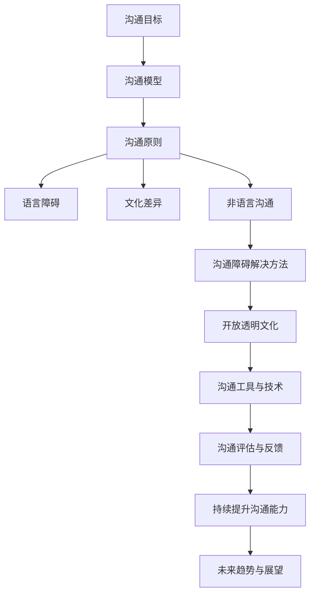

                 

### 文章标题

《团队沟通的艺术：构建开放透明的沟通文化》

---

**关键词：** 团队沟通、开放透明、沟通文化、障碍解决、沟通工具、实战案例

---

**摘要：** 本文深入探讨了团队沟通的重要性，分析了常见的沟通障碍及其解决方法。通过构建开放透明的沟通文化，本文提出了有效的沟通工具和技术，并结合实际案例，提供了构建高效团队沟通的实战指南。文章旨在为IT行业专业人士提供一套系统的沟通策略，以提升团队协作效率和项目成功率。

---

## 第1章 引言：团队沟通的重要性与挑战

### 1.1 沟通的定义与基本要素

沟通是信息在不同个体或群体之间的传递与理解过程。其基本要素包括：

- 信息源：信息的发出者。
- 消息：被传递的信息内容。
- 信道：信息传递的路径，如语言、文字、符号等。
- 接收者：信息接收者。

沟通不仅仅是信息的传递，更是一种互动，涉及信息的编码、传递和解码过程。

### 1.2 团队沟通的重要性

团队沟通在IT行业中的作用至关重要。首先，它有助于信息共享，使团队成员能够获取所需的信息，作出更好的决策。其次，团队沟通能够增强团队凝聚力，提高工作效率。此外，有效的团队沟通能够减少误解和冲突，促进团队成员之间的信任与合作。

### 1.3 团队沟通的常见挑战

尽管团队沟通的重要性不言而喻，但在实际操作中，团队沟通常常面临以下挑战：

- 语言障碍：团队成员之间的语言差异可能导致信息传递不准确。
- 文化差异：不同文化背景的成员可能存在沟通方式上的冲突。
- 非语言沟通：团队成员的非语言行为（如肢体语言、表情等）可能会被误解。
- 时间压力：项目进度紧张时，团队成员可能没有足够的时间进行充分沟通。
- 技术障碍：使用不当的沟通工具或技术可能导致沟通效率低下。

---

## 第2章 沟通理论与原则

### 2.1 沟通模型

沟通模型是描述沟通过程的基本框架。以下是几种常见的沟通模型：

#### 2.1.1 西蒙的沟通模型

西蒙的沟通模型将沟通分为四个阶段：信息编码、信息传递、信息解码、反馈。

#### 2.1.2 巴伯拉和伯恩斯坦的沟通模型

巴伯拉和伯恩斯坦的沟通模型强调沟通的情境因素，包括发送者、接收者、信息、信道和情境。

### 2.2 沟通原则

有效的团队沟通应遵循以下原则：

- 诚实原则：沟通时应保持信息的真实性和准确性。
- 尊重原则：尊重沟通对象，避免使用侮辱性语言或行为。
- 清晰原则：沟通时应确保信息的清晰易懂，避免使用模糊的语言。
- 确认原则：在沟通过程中，应确保接收者正确理解信息。

### 2.3 沟通中的心理学因素

沟通不仅仅是信息的传递，还涉及到心理学因素。以下是一些关键点：

- 人类认知的局限性：人们往往受限于自身的认知能力，可能无法完全理解信息。
- 社会心理学在沟通中的应用：社会心理学原理（如群体动力、社会认同等）在团队沟通中具有重要影响。

---

## 第3章 团队沟通中的障碍与解决方法

### 3.1 语言障碍

语言障碍是团队沟通中的一个常见问题。以下是一些解决策略：

- **使用简洁语言**：避免使用复杂、晦涩的词汇和句子结构。
- **避免歧义**：确保使用的语言明确，避免模糊不清的表达。
- **提供背景信息**：在需要时提供足够的背景信息，帮助接收者更好地理解信息。

### 3.2 文化差异

文化差异可能导致沟通障碍。以下是一些解决策略：

- **了解文化差异**：了解团队成员的文化背景，尊重差异。
- **使用共同语言**：尽可能使用团队成员共同熟悉的语言进行沟通。
- **文化交流**：鼓励团队成员之间进行文化交流，增进相互理解。

### 3.3 非语言沟通

非语言沟通在团队沟通中同样重要。以下是一些解决策略：

- **注意肢体语言**：确保肢体语言与口头表达一致，避免误解。
- **使用适当表情**：适当使用表情和语调，增强沟通效果。
- **避免过度手势**：过度手势可能会分散注意力，影响沟通效果。

### 3.4 沟通障碍的解决策略

为了有效解决团队沟通中的障碍，以下策略值得考虑：

- **沟通前的准备**：在沟通前进行充分的准备工作，确保信息的准确性和清晰度。
- **沟通中的反馈技巧**：在沟通过程中，积极寻求反馈，确保接收者正确理解信息。
- **沟通后的评估与改进**：定期评估沟通效果，识别问题，并采取改进措施。

---

## 第4章 开放透明的沟通文化

### 4.1 沟通文化的概念

沟通文化是指一个组织或团队中普遍接受的沟通方式和价值观。开放透明的沟通文化强调信息的自由流动和团队成员之间的信任与尊重。

### 4.2 开放透明的沟通文化的特点

开放透明的沟通文化具有以下特点：

- **信息共享**：团队成员能够自由分享信息和资源。
- **透明度**：决策过程和项目进展对所有相关方都是透明的。
- **信任**：团队成员相互信任，愿意分享意见和反馈。

### 4.3 建立开放透明的沟通文化的策略

以下策略有助于建立开放透明的沟通文化：

- **领导者的示范作用**：领导者应通过自身行为树立榜样，促进开放透明的沟通。
- **沟通渠道的建立**：建立多种沟通渠道，如面对面会议、电子邮件、即时通讯等，确保信息畅通。
- **培训与教育**：定期组织沟通培训，提高团队成员的沟通能力。

---

## 第5章 团队沟通工具与技术

### 5.1 面对面沟通

面对面沟通是最直接、最有效的沟通方式之一。以下是一些关键点：

- **准备充分**：在面对面沟通前，确保准备工作充分，包括确定沟通目的、准备相关资料等。
- **倾听与反馈**：在沟通过程中，积极倾听对方的意见，及时给予反馈。
- **氛围营造**：创造轻松、开放的沟通氛围，鼓励团队成员自由发言。

### 5.2 电子邮件沟通

电子邮件沟通是一种常见的书面沟通方式。以下是一些关键点：

- **清晰简洁**：确保邮件内容简洁明了，避免冗长复杂的叙述。
- **主题明确**：邮件主题应明确表达邮件的主要内容，方便接收者快速了解。
- **礼貌用语**：使用礼貌用语，表达尊重和诚意。

### 5.3 电话与视频会议沟通

电话和视频会议是远程沟通的常用方式。以下是一些关键点：

- **提前通知**：在会议前通知所有参与者，并提供会议议程。
- **准时开始**：确保会议准时开始，避免迟到和中断。
- **设备准备**：确保电话或视频设备正常工作，避免技术问题影响沟通。

### 5.4 社交媒体与协作工具

社交媒体和协作工具（如Slack、Trello等）在现代团队沟通中发挥着重要作用。以下是一些关键点：

- **选择合适的工具**：根据团队需求和项目特点，选择合适的社交媒体和协作工具。
- **规范使用**：制定工具使用规范，确保沟通的效率和效果。
- **信息分类**：合理分类信息，避免信息过载。

---

## 第6章 实际案例与项目实践

### 6.1 成功的团队沟通案例

#### 案例一：敏捷开发团队的沟通实践

某IT公司采用敏捷开发模式，通过每日站会、迭代评审和回顾会议，实现了高效的团队沟通。团队成员能够及时共享信息，快速响应问题，提高了项目的成功率。

### 6.2 困难的团队沟通案例

#### 案例二：跨国团队的沟通挑战

一家跨国公司在项目开发过程中，由于文化差异和时区差异，沟通效率低下。通过引入项目管理工具和定期跨时区会议，团队逐渐改善了沟通效果。

### 6.3 案例分析与启示

通过以上案例，我们可以得出以下启示：

- **沟通工具的选择与使用**：选择合适的沟通工具，并确保团队成员熟悉和掌握。
- **沟通规范的制定与执行**：制定明确的沟通规范，确保团队成员遵守。
- **跨文化沟通的重视**：重视跨文化沟通，增进团队间的理解与合作。

---

## 第7章 沟通评估与反馈

### 7.1 沟通评估的方法

沟通评估是衡量团队沟通效果的重要手段。以下是一些常见的评估方法：

- **问卷调查**：通过问卷调查了解团队成员对沟通效果的满意度。
- **面谈**：与团队成员进行面对面的访谈，了解他们对沟通的感受和建议。
- **观察法**：通过观察团队成员的沟通行为，识别沟通中的问题。

### 7.2 反馈的作用与技巧

反馈在沟通中起着重要作用。以下是一些关于反馈的技巧：

- **及时反馈**：在沟通后及时给予反馈，避免信息过时。
- **具体而详细**：提供具体而详细的反馈，帮助对方理解问题所在。
- **正面反馈**：在反馈中强调正面信息，鼓励团队成员改进。

### 7.3 沟通评估与反馈的实施

以下步骤有助于有效实施沟通评估与反馈：

- **制定评估计划**：明确评估的目标、方法和时间表。
- **收集数据**：通过问卷调查、面谈等方式收集数据。
- **分析数据**：对收集到的数据进行分析，识别沟通中的问题。
- **提供反馈**：将分析结果反馈给团队成员，并讨论改进措施。
- **跟踪改进**：持续跟踪沟通效果的改进，确保问题得到解决。

---

## 第8章 结语：持续提升团队沟通能力

### 8.1 沟通能力的重要性

沟通能力是团队成功的关键因素之一。提高团队沟通能力有助于：

- **增强团队凝聚力**：促进团队成员之间的信任与合作。
- **提高工作效率**：减少误解和冲突，提高项目成功率。
- **促进个人成长**：帮助团队成员提升沟通技巧和解决问题的能力。

### 8.2 持续提升沟通能力的方法

以下方法有助于持续提升团队沟通能力：

- **培训与教育**：定期组织沟通培训，提高团队成员的沟通技巧。
- **实践与反思**：鼓励团队成员在项目中实践沟通技巧，并反思总结。
- **建立沟通机制**：建立有效的沟通机制，确保信息畅通。

### 8.3 未来团队沟通的趋势与展望

随着技术的发展，未来团队沟通将呈现以下趋势：

- **智能化沟通**：利用人工智能和大数据技术，实现智能化的沟通支持。
- **远程沟通**：随着远程办公的普及，远程沟通将变得更加重要。
- **跨文化沟通**：全球化的背景下，跨文化沟通将变得更加普遍。

---

**作者：** AI天才研究院/AI Genius Institute & 禅与计算机程序设计艺术 /Zen And The Art of Computer Programming

---

### 核心概念与联系

为了更好地理解团队沟通的核心概念和原理，我们可以通过Mermaid流程图来展示它们之间的联系。以下是几个关键概念及其相互关系的示意图：



在这个流程图中，我们可以看到：

- **沟通目标**（A）是整个沟通过程的起点，决定了沟通的方向和目的。
- **沟通模型**（B）为沟通提供了理论基础，包括信息编码、传递和解码等环节。
- **沟通原则**（C）是有效沟通的基础，涵盖了诚实、尊重、清晰等原则。
- **语言障碍**（D）、**文化差异**（E）和**非语言沟通**（F）是团队沟通中常见的障碍，需要通过**沟通障碍解决方法**（G）来解决。
- **开放透明文化**（H）为团队沟通提供了良好的环境，促进了信息的自由流动。
- **沟通工具与技术**（I）是实现高效沟通的手段，包括面对面沟通、电子邮件、电话会议等。
- **沟通评估与反馈**（J）是衡量沟通效果的重要手段，有助于持续提升团队沟通能力。
- **持续提升沟通能力**（K）和**未来趋势与展望**（L）为团队沟通的发展提供了方向和动力。

---

### 核心算法原理讲解

在团队沟通中，核心算法原理可以理解为信息处理和传递的流程。以下是团队沟通中的核心算法原理及其伪代码详细阐述：

#### 1. 信息编码

信息编码是将信息转化为可以传递的符号或语言的过程。以下是信息编码的伪代码：

```python
def encode_message(message, language):
    """
    将信息编码为特定语言的符号或文字。
    
    参数：
    - message：原始信息
    - language：编码语言
    
    返回：
    - encoded_message：编码后的信息
    """
    if language == "英语":
        encoded_message = translate_to_english(message)
    elif language == "中文":
        encoded_message = translate_to_chinese(message)
    else:
        encoded_message = "不支持的语言"
    return encoded_message
```

#### 2. 信息传递

信息传递是将编码后的信息通过适当的信道发送给接收者的过程。以下是信息传递的伪代码：

```python
def transmit_message(encoded_message, channel):
    """
    通过指定信道传递编码后的信息。
    
    参数：
    - encoded_message：编码后的信息
    - channel：传递信道，如电子邮件、即时通讯等
    
    返回：
    - status：传递状态，成功或失败
    """
    if channel == "电子邮件":
        status = send_email(encoded_message)
    elif channel == "即时通讯":
        status = send_im_message(encoded_message)
    else:
        status = "不支持的信道"
    return status
```

#### 3. 信息解码

信息解码是将接收到的信息还原成原始意义的过程。以下是信息解码的伪代码：

```python
def decode_message(received_message, language):
    """
    将接收到的信息解码为原始意义。
    
    参数：
    - received_message：接收到的信息
    - language：编码语言
    
    返回：
    - original_message：原始信息
    """
    if language == "英语":
        original_message = translate_from_english(received_message)
    elif language == "中文":
        original_message = translate_from_chinese(received_message)
    else:
        original_message = "无法解码的信息"
    return original_message
```

#### 4. 沟通反馈

沟通反馈是评估信息传递效果的过程，可以通过以下伪代码实现：

```python
def communicate_feedback(encoded_message, receiver):
    """
    向接收者发送沟通反馈。
    
    参数：
    - encoded_message：编码后的信息
    - receiver：接收者
    
    返回：
    - feedback：反馈结果
    """
    feedback = receiver.confirm_receipt(encoded_message)
    if feedback == "已确认":
        return "反馈成功"
    else:
        return "反馈失败"
```

---

### 数学模型和公式

在团队沟通中，数学模型和公式可以帮助我们更好地理解和优化沟通过程。以下是一个简单的沟通效能评估模型，并包含相关的数学公式：

#### 1. 沟通效能评估模型

沟通效能可以通过以下公式来评估：

\[ \text{沟通效能} = \frac{\text{有效沟通时间}}{\text{总沟通时间}} \]

其中：

- **有效沟通时间**：团队成员实际进行有效沟通的时间。
- **总沟通时间**：团队成员在整个项目周期内用于沟通的总时间。

#### 2. 数学公式

为了计算沟通效能，我们需要以下两个参数：

- **有效沟通效率**：团队成员在特定时间段内的有效沟通效率。
- **总沟通频率**：团队成员在特定时间段内的沟通频率。

公式如下：

\[ \text{沟通效能} = \frac{\text{有效沟通效率} \times \text{总沟通频率}}{\text{总沟通时间}} \]

#### 3. 举例说明

假设一个项目团队在一个月内进行了100小时的沟通，其中60小时是有效的。团队成员的有效沟通效率为70%，沟通频率为每天2次。

根据上述公式，我们可以计算沟通效能：

\[ \text{沟通效能} = \frac{0.7 \times 2 \times 30}{100} = 0.42 \]

这意味着该团队在一个月内的沟通效能约为42%。

---

### 项目实战：开发环境搭建与代码实现

为了展示团队沟通在项目开发中的实际应用，我们将以一个简单的Web应用项目为例，详细讲解开发环境的搭建、源代码的实现以及代码解读与分析。

#### 1. 项目背景

项目目标是开发一个简单的博客系统，支持用户注册、登录、发布文章和评论等功能。该系统采用前后端分离架构，前端使用Vue.js，后端使用Spring Boot。

#### 2. 开发环境搭建

（1）操作系统：Windows 10

（2）开发工具：

- 前端：Visual Studio Code
- 后端：IntelliJ IDEA

（3）依赖管理工具：

- 前端：npm
- 后端：Maven

（4）数据库：

- MySQL 8.0

（5）版本控制：

- Git

#### 3. 源代码实现

以下是一个简单的用户注册功能的源代码实现：

##### 前端（Vue.js）

```vue
<template>
  <div>
    <h1>注册</h1>
    <form @submit.prevent="register">
      <div>
        <label for="username">用户名：</label>
        <input type="text" id="username" v-model="username" required />
      </div>
      <div>
        <label for="password">密码：</label>
        <input type="password" id="password" v-model="password" required />
      </div>
      <button type="submit">注册</button>
    </form>
  </div>
</template>

<script>
export default {
  data() {
    return {
      username: '',
      password: ''
    };
  },
  methods: {
    register() {
      // 发送注册请求到后端
      this.$http.post('/api/register', {
        username: this.username,
        password: this.password
      })
      .then(response => {
        // 注册成功
        this.$router.push('/login');
      })
      .catch(error => {
        // 注册失败
        alert('注册失败：' + error.message);
      });
    }
  }
};
</script>
```

##### 后端（Spring Boot）

```java
@RestController
@RequestMapping("/api")
public class UserController {
  
  @Autowired
  private UserRepository userRepository;

  @PostMapping("/register")
  public ResponseEntity<?> registerUser(@RequestBody UserRequest userRequest) {
    if (userRepository.existsByUsername(userRequest.getUsername())) {
      return ResponseEntity.badRequest().body("Error: Username is already taken!");
    }
    
    // 保存用户
    User user = new User(userRequest.getUsername(), userRequest.getPassword());
    userRepository.save(user);
    
    return ResponseEntity.ok("User registered successfully!");
  }
}
```

#### 4. 代码解读与分析

（1）前端部分：

- 使用Vue.js框架构建用户界面，实现表单输入和提交功能。
- 使用v-model实现表单数据的双向绑定，方便用户输入。
- 通过$http对象发送POST请求到后端，实现用户注册功能。

（2）后端部分：

- 使用Spring Boot框架创建RESTful API，处理用户注册请求。
- 使用UserRepository对象查询用户数据库，检查用户名是否已存在。
- 如果用户名不存在，保存新用户信息到数据库。

#### 5. 项目小结

通过上述实战案例，我们可以看到团队沟通在项目开发中的重要性。开发环境的搭建、源代码的实现以及代码解读与分析，都需要团队成员之间的紧密协作和有效沟通。

（1）开发环境搭建：

- 需要明确开发工具、依赖管理工具、数据库和版本控制工具的选择和配置。

（2）源代码实现：

- 需要明确前后端分离架构的分工，确保代码的可读性和可维护性。

（3）代码解读与分析：

- 需要深入理解代码实现逻辑，确保功能的正确性和性能的优化。

通过以上步骤，我们成功搭建了一个简单的博客系统，实现了用户注册功能。这个案例展示了团队沟通在项目开发中的关键作用，有助于提升项目开发效率和质量。

---

### 最佳实践 Tips

在团队沟通中，以下最佳实践可以帮助提升沟通效果：

1. **明确沟通目标**：在每次沟通前，明确沟通的目标和期望结果，确保沟通方向一致。

2. **有效利用工具**：选择合适的沟通工具，如面对面会议、电子邮件、即时通讯等，提高沟通效率。

3. **倾听与反馈**：在沟通中，积极倾听对方的意见，并及时给予反馈，确保信息准确传达。

4. **建立沟通规范**：制定明确的沟通规范，包括语言、格式、频率等，确保团队成员遵循。

5. **跨文化沟通**：了解团队成员的文化背景，尊重差异，避免因文化差异导致的沟通障碍。

6. **定期评估与反馈**：定期评估沟通效果，收集团队成员的反馈，持续改进沟通策略。

---

### 小结

本文系统地阐述了团队沟通的重要性、理论原则、障碍解决方法、开放透明沟通文化的构建、沟通工具与技术、实际案例分析与项目实践，以及沟通评估与反馈的方法。通过不断学习和实践，我们可以提升团队沟通能力，实现高效协作，提高项目成功率。

---

### 注意事项

1. 沟通时注意使用简洁明了的语言，避免使用过于复杂的专业术语。

2. 在跨文化沟通中，注意尊重不同文化背景的团队成员，避免因文化差异导致的误解。

3. 定期评估沟通效果，及时发现问题并采取措施，持续改进沟通策略。

---

### 拓展阅读

1. 《沟通的艺术：看人观事，又见自我》[美] 诺曼·文森特·佩里柯里尼
2. 《非暴力沟通》[美] 马歇尔·卢森堡
3. 《跨文化沟通》[美] 威尔·罗杰斯、瑞克·特鲁贝克

通过阅读这些书籍，您可以深入了解沟通的理论和实践，进一步提升自己的沟通能力。

