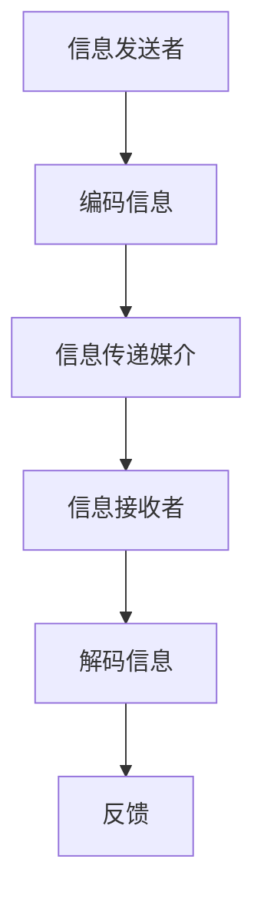
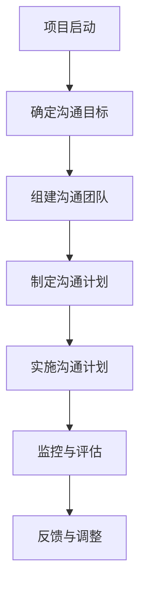

                 

### 文章标题：团队沟通：建立开放透明的交流环境

#### 关键词：团队沟通、开放透明、交流环境、沟通效率、跨文化沟通、技术工具

#### 摘要：

在现代团队协作中，有效的沟通是团队成功的关键。本文将探讨如何建立开放透明的交流环境，提高团队沟通效率。通过分析沟通的基本原理、核心概念，提供实用的沟通策略和技巧，介绍技术工具在团队沟通中的应用，并结合实际项目案例分析，总结最佳实践和注意事项。文章旨在帮助团队成员掌握有效沟通的技能，为团队的成功奠定坚实基础。

### 引言

在现代职场中，团队协作已经成为企业运营的核心。然而，团队沟通问题也日益突出，不仅影响工作效率，还可能造成团队冲突和误解。良好的沟通是团队协作的基石，它能够促进团队成员之间的理解、信任和合作。因此，建立开放透明的交流环境，提高团队沟通效率，成为团队管理者亟待解决的问题。

团队沟通不仅涉及团队成员之间的语言交流，还包括非语言沟通，如肢体语言、面部表情等。有效的沟通能够消除误解，增强团队凝聚力，提高工作效率。然而，现代团队沟通面临着诸多挑战，如信息过载、文化差异、技术依赖等。本文将深入探讨如何克服这些挑战，建立开放透明的交流环境。

### 核心概念与联系

#### 1. 沟通模型与流程

沟通是一个复杂的过程，涉及信息发送、传递、接收和理解。为了更好地理解团队沟通，我们可以借鉴通信模型，如下图所示：

在团队沟通中，信息发送者需要将信息编码成语言或符号，通过传递媒介发送给接收者，接收者需要解码信息并给出反馈。这一过程可能涉及多次往返，以实现有效的沟通。

#### 2. 沟通障碍与解决方案

沟通障碍是团队沟通中常见的问题，主要包括语言障碍、文化障碍、信息过载等。以下是一些常见的沟通障碍及其解决方案：

- **语言障碍**：团队成员之间的语言差异可能导致沟通不畅。解决方案包括使用共同的语言、提供语言培训等。
- **文化障碍**：文化差异可能导致团队成员对同一问题的理解不同。解决方案包括加强跨文化培训、提高文化意识等。
- **信息过载**：团队成员可能面临信息过载，导致无法有效处理和利用信息。解决方案包括优化信息传递流程、提高信息筛选能力等。

#### 3. Mermaid流程图：团队沟通的核心流程

为了更清晰地展示团队沟通的核心流程，我们可以使用Mermaid流程图来描述，如下图所示：

这个流程图展示了从项目启动到沟通计划实施、监控与评估的整个过程，有助于团队成员理解团队沟通的核心步骤。

### 实践策略

#### 1. 建立信任与开放性

建立信任和开放性是有效沟通的基础。团队成员需要相互信任，愿意分享信息和观点。以下是一些策略：

- **建立沟通规范**：制定明确的沟通规则，如尊重他人、积极倾听等。
- **鼓励反馈**：鼓励团队成员提出意见和建议，建立积极的反馈文化。
- **定期交流**：定期举行团队会议，确保团队成员之间的沟通。

#### 2. 提高沟通效率的方法

提高沟通效率可以减少误解和重复工作，以下是一些方法：

- **明确沟通目标**：在每次沟通前明确目标，确保沟通有针对性。
- **简化语言**：使用简单易懂的语言，避免使用专业术语。
- **避免假设**：不要假设对方已经了解信息，确保信息传递的准确性。

#### 3. 面对冲突的沟通策略

冲突是团队沟通中不可避免的问题，以下是一些策略：

- **积极倾听**：倾听对方的观点，了解对方的立场。
- **保持冷静**：在冲突发生时保持冷静，避免情绪化。
- **寻求共赢**：寻找双方都能接受的解决方案，实现共赢。

### 技术与工具

#### 1. 团队协作工具

现代团队协作工具可以帮助团队成员更好地沟通和协作，以下是一些常用的工具：

- **Slack**：提供即时通讯、文件共享和项目协作等功能。
- **Trello**：提供任务管理、项目规划和团队协作功能。
- **Asana**：提供任务分配、项目进度监控和团队协作功能。

#### 2. 沟通分析工具

沟通分析工具可以帮助团队管理者了解团队沟通的情况，优化沟通流程，以下是一些工具：

- **Clarizen**：提供沟通分析、项目管理和团队协作功能。
- **Microsoft Teams**：提供沟通分析、视频会议和团队协作功能。

#### 3. 智能沟通助手

智能沟通助手可以使用人工智能技术，帮助团队自动处理一些沟通任务，提高沟通效率，以下是一些工具：

- **Chatbot**：提供自动回复、问题解答和任务分配等功能。
- **Virtual Meeting Assistants**：提供会议记录、议程管理和提醒等功能。

### 项目实战

#### 1. 案例一：如何提高项目团队的沟通效率

在这个案例中，我们以一个软件开发项目为例，说明如何通过技术工具和策略提高项目团队的沟通效率。

**开发环境搭建**：

- **Git**：使用Git进行版本控制，确保代码的一致性和可追溯性。
- **Docker**：使用Docker容器化技术，简化开发环境，确保团队成员之间的一致性。

**源代码详细实现和代码解读**：

- **代码库**：使用Git创建代码库，团队成员提交代码。
- **代码审查**：使用Git的代码审查功能，确保代码质量。

**代码应用解读与分析**：

- **持续集成**：使用Jenkins等工具实现持续集成，自动构建和测试代码。
- **自动化测试**：使用Selenium等工具进行自动化测试，确保代码的稳定性。

**实际案例分析和详细讲解剖析**：

- **沟通策略**：定期举行团队会议，确保团队成员之间的沟通。
- **技术工具**：使用Slack进行即时通讯，使用Trello进行任务管理。

**项目小结**：

通过以上策略和工具，项目团队成功提高了沟通效率，确保了项目的顺利进行。

### 总结与展望

#### 1. 全书要点回顾

本文从团队沟通的重要性、核心概念、实践策略、技术工具和项目实战等方面，系统地阐述了如何建立开放透明的交流环境，提高团队沟通效率。主要要点包括：

- 团队沟通是团队成功的关键。
- 沟通模型、障碍及解决方案。
- 实用的沟通策略和技巧。
- 技术工具在团队沟通中的应用。
- 实际项目案例的分析和解读。

#### 2. 未来沟通发展趋势

未来沟通发展趋势将更加智能化、个性化，以下是一些趋势：

- 人工智能技术将在团队沟通中发挥更大作用。
- 沟通工具将更加便捷、易用。
- 跨文化沟通将得到更多关注。

#### 3. 提升团队沟通能力的建议

为了提升团队沟通能力，可以采取以下措施：

- 加强团队沟通培训。
- 定期进行沟通效果评估。
- 鼓励团队成员主动沟通。

### 最佳实践 tips、小结、注意事项、拓展阅读

#### 最佳实践 tips

- **明确沟通目标**：确保每次沟通都有明确的目标。
- **积极倾听**：倾听对方观点，了解对方立场。
- **避免假设**：不要假设对方已经了解信息。
- **利用技术工具**：合理使用沟通工具，提高沟通效率。

#### 小结

本文系统地阐述了如何建立开放透明的交流环境，提高团队沟通效率。通过分析沟通的基本原理、提供实用的沟通策略和技巧，以及结合实际项目案例分析，帮助读者掌握团队沟通的技能和知识。

#### 注意事项

- 沟通时避免使用专业术语，确保沟通的准确性。
- 定期评估沟通效果，及时调整沟通策略。
- 鼓励团队成员积极参与沟通，提高团队凝聚力。

#### 拓展阅读

- 《沟通的艺术》
- 《非暴力沟通》
- 《跨文化沟通》

### 作者信息

作者：AI天才研究院/AI Genius Institute & 禅与计算机程序设计艺术 /Zen And The Art of Computer Programming

