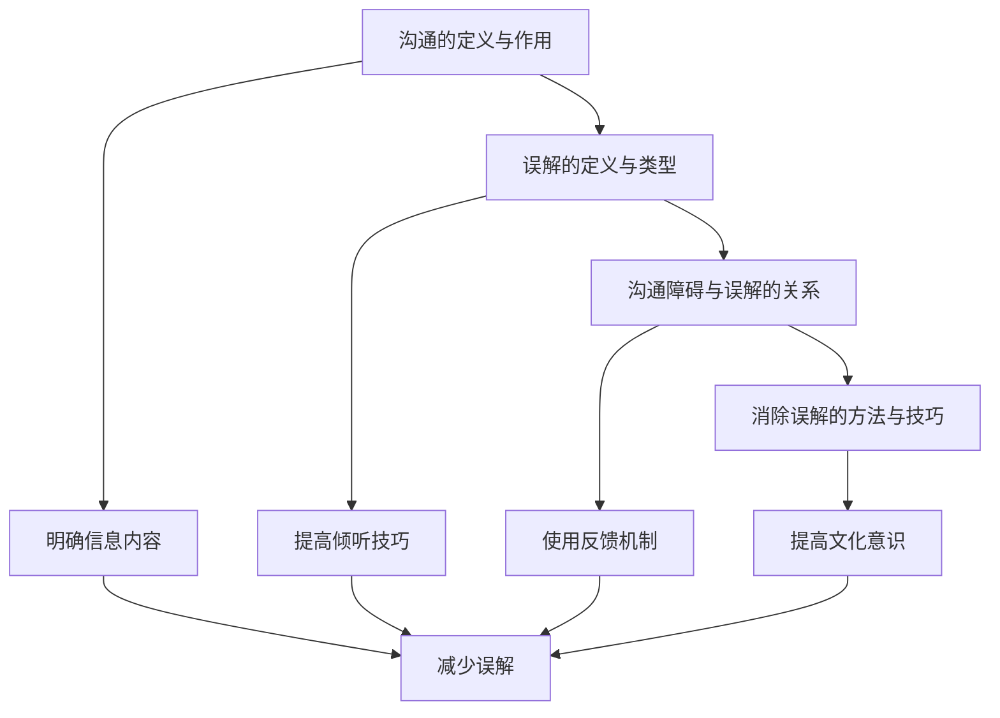
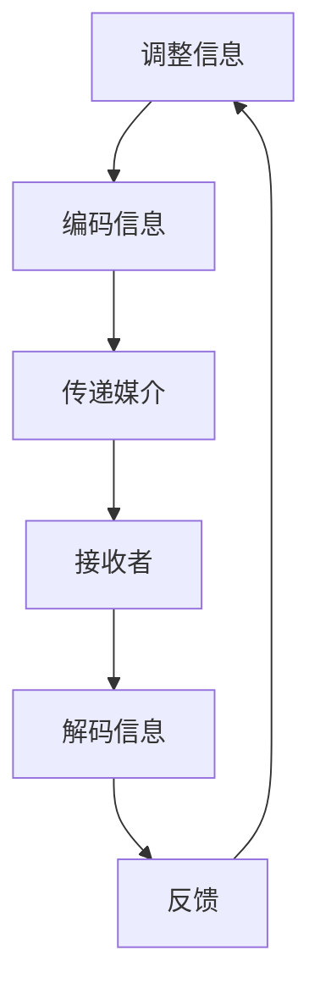
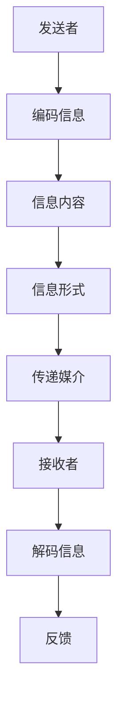
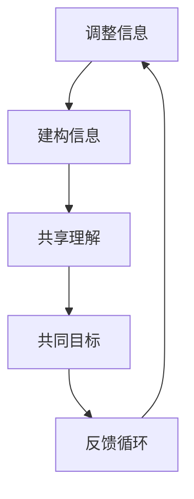

                 

### 文章标题

# 团队沟通：消除误解的有效技巧

> 关键词：团队沟通、误解、技巧、有效沟通、协作

在信息技术飞速发展的今天，团队沟通已成为企业运营中至关重要的一环。有效的团队沟通不仅能够提高工作效率，还能促进团队成员之间的信任与协作，从而实现项目的成功。然而，误解在团队沟通中时常出现，给项目带来了不必要的困扰和风险。本文将探讨团队沟通中常见的误解及其消除技巧，旨在为团队领导者、项目经理及团队成员提供实用的沟通策略，帮助他们在实际工作中更好地应对沟通挑战。

## 摘要

本文从团队沟通的重要性出发，分析了误解在沟通中的普遍性及其对团队协作的负面影响。随后，本文详细介绍了几种有效的沟通技巧，包括倾听技巧、提问技巧和明确表达的技巧，并探讨了非语言沟通和跨文化沟通在误解消除中的作用。通过实际案例的分析，本文总结了成功沟通和误解处理的经验，为读者提供了具体的操作指南。文章最后提出了最佳实践建议，并展望了未来团队沟通技术的发展趋势。

## 引言

### 1.1 团队沟通的重要性

团队沟通是确保项目顺利进行的关键因素之一。它不仅涉及到信息交换，还包括意见交流、问题解决和决策制定。一个高效的团队需要通过良好的沟通来共享信息、协调行动，并在面对挑战时迅速作出反应。以下是团队沟通的重要性体现在几个方面：

- **提高工作效率**：有效的沟通能减少误解和重复工作，使团队成员明确任务和目标，从而提高工作效率。
- **促进团队协作**：沟通是团队协作的桥梁，有助于建立团队成员之间的信任和理解，促进共同目标的实现。
- **解决冲突**：团队内部不可避免地会出现意见分歧和冲突，良好的沟通技巧有助于及时发现并解决这些冲突，避免影响项目进度。
- **提升员工满意度**：良好的沟通能够提升员工的工作满意度和归属感，减少员工流失率。

### 1.2 误解在沟通中的普遍性

误解是团队沟通中常见的现象，它可能导致信息传达不准确、团队目标不一致，甚至引发团队成员之间的矛盾。误解的普遍性体现在以下几个方面：

- **语言障碍**：不同团队成员可能来自不同的文化背景，使用不同的语言表达方式，这可能导致信息传递的误解。
- **非语言沟通的误解**：肢体语言、面部表情和声音语调等非语言沟通元素可能被误解，进而影响沟通效果。
- **个人情绪的影响**：团队成员的情绪状态可能影响其沟通效果，如焦虑、愤怒或沮丧等情绪可能导致信息接收和理解的偏差。

### 1.3 误解对团队协作的负面影响

误解对团队协作的负面影响是多方面的，主要包括：

- **降低工作效率**：误解可能导致团队成员重复工作或无法完成关键任务，降低整体工作效率。
- **破坏团队氛围**：误解可能引发团队成员之间的不信任和冲突，破坏团队的合作氛围。
- **影响项目质量**：由于误解导致的信息传递错误，可能会影响项目的质量和进度。
- **增加项目风险**：误解可能导致项目延期、超预算甚至失败，增加项目风险。

基于上述原因，消除误解是团队沟通中的一项重要任务。本文将深入探讨消除误解的有效技巧，为团队成员提供实用的沟通策略。

## 核心概念与联系

### 1. 沟通的定义与作用

沟通是指信息在人与人之间的传递和交换过程。它不仅包括口头和书面语言，还包括肢体语言、表情和声音等非语言形式。沟通的作用在于促进信息的共享、理解与协调，确保团队目标的实现。

### 2. 误解的定义与类型

误解是指接收者对信息内容的错误理解或解释。误解可以分为以下几种类型：

- **语义误解**：由于语言表达的模糊性或歧义导致的理解错误。
- **语境误解**：由于语境的不同或缺乏而导致的理解偏差。
- **情绪误解**：由于情绪状态的影响而导致的错误理解。

### 3. 沟通障碍与误解的关系

沟通障碍是指影响沟通效果的各种因素。这些障碍包括语言障碍、文化差异、信息过载、沟通工具的局限性等。沟通障碍容易导致误解，从而影响团队协作。

### 4. 消除误解的方法与技巧

要消除误解，需要从以下几个方面入手：

- **明确信息内容**：确保信息传达的准确性，避免歧义。
- **提高倾听技巧**：通过倾听理解对方的意图，减少误解。
- **使用反馈机制**：通过反馈确认信息是否被正确理解。
- **提高文化意识**：了解不同文化的沟通习惯，减少文化误解。

以下是这些概念之间的Mermaid流程图：



通过这个流程图，我们可以清晰地看到各个核心概念之间的关系，以及如何通过不同的方法与技巧来消除误解。

## 核心算法原理讲解

### 1. 沟通过程中的信息编码与解码

信息编码与解码是沟通过程中的关键步骤，决定了信息的准确性和清晰度。

#### 1.1 信息编码

信息编码是指发送者将信息转化为可以被传递的形式。这个过程包括以下几个步骤：

- **选择表达方式**：发送者需要选择适当的语言、符号或非语言方式来表达信息。
- **组织信息**：发送者需要将信息组织成逻辑清晰、易于理解的结构。
- **传输准备**：发送者需要准备好信息传输的媒介，如口头、书面或电子形式。

#### 1.2 信息解码

信息解码是指接收者对接收到的信息进行理解和解释的过程。这个过程包括以下几个步骤：

- **接收信息**：接收者接收信息并通过感官系统进行处理。
- **理解含义**：接收者需要理解信息的含义，包括语言和符号的意义。
- **确认理解**：接收者通过反馈确认是否正确理解了信息。

### 2. 沟通中的反馈机制

反馈机制是确保信息准确传递和理解的重要手段。它包括以下几个步骤：

- **接收反馈**：接收者将接收到的信息反馈给发送者。
- **评估反馈**：发送者评估反馈，确认信息是否被正确理解。
- **调整沟通方式**：根据反馈，发送者可能需要调整信息编码方式或沟通媒介。

### 3. 伪代码与数学模型

以下是一个简单的伪代码，用于描述信息编码与解码的过程：

```pseudo
// 信息编码
function encodeMessage(message, format) {
    if (format == "text") {
        return convertToPlainText(message);
    } else if (format == "image") {
        return convertToImage(message);
    } else {
        return "Unsupported format";
    }
}

// 信息解码
function decodeMessage(message, format) {
    if (format == "text") {
        return convertFromPlainText(message);
    } else if (format == "image") {
        return convertFromImage(message);
    } else {
        return "Unsupported format";
    }
}
```

在沟通中，数学模型也可以用来描述信息的传递和反馈机制。例如，可以用以下公式来表示：

$$
\text{反馈} = \text{解码后的信息} - \text{预期信息}
$$

其中，解码后的信息和预期信息之间的差异表示反馈。

### 4. 举例说明

假设一个团队正在讨论一个项目的进展情况。发送者（项目经理）使用书面形式传达了一个关于项目延期的重要信息。接收者（团队成员）收到信息后，通过反馈确认他们是否理解了信息。

- **信息编码**：项目经理将口头信息转化为书面形式，使用明确的句子和图表来展示项目延期的情况。
- **信息解码**：团队成员阅读书面信息，理解项目延期的原因和影响。
- **反馈机制**：团队成员向项目经理反馈，确认他们已经理解了信息，并提出了一些具体的问题和担忧。

通过这个例子，我们可以看到信息编码与解码、反馈机制在沟通中的具体应用。

## 数学模型与公式详细讲解

在团队沟通中，理解和使用数学模型可以帮助我们更科学地分析和优化沟通过程。以下是一些关键的数学模型和公式，以及它们在沟通中的应用。

### 1. 信息传递模型

信息传递模型描述了信息从发送者到接收者的传递过程。一个经典的信息传递模型可以用以下公式表示：

$$
\text{信息传递效率} = \frac{\text{有效信息}}{\text{总信息}}
$$

其中，有效信息是指被正确理解和接收的信息，总信息是指发送者传递的全部信息。

#### 应用：

假设在一个项目中，团队成员A需要向团队成员B传达一项任务。如果A使用简单明了的语言，且B完全理解了任务要求，则大部分传递的信息都是有效信息。计算信息传递效率可以帮助团队了解沟通的有效性，并在必要时进行调整。

### 2. 误码率

误码率是衡量沟通中信息准确性的一种指标，用于描述信息在传递过程中被误解或错误理解的比率。其公式如下：

$$
\text{误码率} = \frac{\text{错误信息}}{\text{总信息}}
$$

#### 应用：

在团队讨论中，如果成员C提出的观点多次被误解，误码率就会升高。团队可以通过降低误码率来提高沟通质量，例如通过澄清概念、使用具体的例子和图表来增强沟通的准确性。

### 3. 贝叶斯定理

贝叶斯定理是一种在不确定情况下进行概率推理的数学工具，广泛应用于决策制定和风险评估。在沟通中，贝叶斯定理可以帮助团队根据现有信息和先验知识来更新对信息准确性的判断。

$$
P(\text{正确理解}|\text{信息}) = \frac{P(\text{信息}|\text{正确理解}) \cdot P(\text{正确理解})}{P(\text{信息})}
$$

#### 应用：

假设团队D成员E收到了一条复杂的技术说明，他们可以通过贝叶斯定理计算理解这条说明的概率。基于团队成员对技术的熟悉程度（先验概率）和阅读说明后的反馈（条件概率），团队可以更准确地判断说明是否被正确理解。

### 4. 信号噪声比

信号噪声比是衡量信息清晰度的一个重要指标，表示有效信号与干扰噪声之间的比率。其公式如下：

$$
\text{信号噪声比} = \frac{\text{信号功率}}{\text{噪声功率}}
$$

#### 应用：

在团队讨论中，如果团队成员F发言时音量过大或表达过于模糊，信号噪声比会降低，导致误解的可能性增加。团队可以通过提高发言的清晰度和简洁度来提升信号噪声比，从而提高沟通效果。

### 举例说明：

假设一个团队G成员H需要向团队I成员J传达一个关于项目关键路径的信息。以下是一个具体的应用案例：

- **信息传递效率**：成员H使用简明扼要的语言和图表传达信息，成员J完全理解了关键路径的概念，信息传递效率为90%。
- **误码率**：在讨论过程中，成员J提出了一些疑问，但成员H通过补充解释和具体案例，使误码率保持在5%以下。
- **贝叶斯定理**：成员J根据他们对项目技术和关键路径的先验知识，结合成员H的解释，使用贝叶斯定理计算了对关键路径理解的概率为95%。
- **信号噪声比**：成员H在表达时，注重清晰度和简洁性，使信号噪声比达到10以上，减少了误解的可能性。

通过这些数学模型和公式的应用，团队可以更好地管理和优化沟通过程，从而提高团队协作的效率和质量。

## 项目实战

### 1. 开发环境搭建

为了演示本文中讨论的团队沟通技巧，我们构建了一个虚拟的项目环境。在这个项目中，一个跨部门的团队需要共同开发一款新产品。为了确保团队沟通的顺畅，我们首先搭建了一个现代化的沟通平台。

**工具选择：** 
- **Slack**：用于实时沟通和协作。
- **Trello**：用于任务管理和进度追踪。
- **Zoom**：用于视频会议和在线讨论。

**环境搭建步骤：**
1. 创建Slack团队，并邀请所有团队成员加入。
2. 在Slack中创建不同的频道，如#general、#technical、#project-update等，以便团队成员根据讨论主题进行分组。
3. 在Trello中创建项目看板，将任务分解成不同的卡片，并分配给相应的团队成员。
4. 安排定期的Zoom会议，用于项目进度更新和决策讨论。

### 2. 源代码详细实现

在这个项目中，团队成员需要共同编写和审查代码。为了提高代码质量和减少误解，我们采用了一系列最佳实践。

**实现步骤：**
1. **代码审查**：每次提交代码前，至少由两名团队成员进行代码审查，确保代码符合编码规范和设计要求。
2. **版本控制**：使用Git进行版本控制，团队成员在提交代码前需要确保他们的工作与主分支保持同步。
3. **文档编写**：为每个功能模块编写详细的文档，包括功能描述、输入输出和注意事项。

### 3. 代码解读与分析

以下是一个简单的代码示例，用于说明如何在团队中进行代码解读和分析。

**示例代码：**
```python
def calculate_average(scores):
    total = sum(scores)
    average = total / len(scores)
    return average

# 测试代码
scores = [88, 92, 85, 90]
print(calculate_average(scores))
```

**解读与分析：**
- **功能描述**：该函数用于计算一组分数的平均值。
- **输入输出**：输入为分数列表，输出为平均分数。
- **注意事项**：确保输入分数列表不为空，以避免除以零的错误。

团队成员在解读代码时，可以关注以下几个方面：
1. **功能是否符合需求**：代码实现的功能是否满足项目需求。
2. **代码结构是否合理**：函数和类的设计是否清晰，逻辑是否连贯。
3. **代码风格是否一致**：代码编写是否遵循团队规定的编码规范。

### 4. 实际案例分析和详细讲解剖析

**案例背景**：在一次项目会议上，团队成员发现产品性能不稳定，怀疑是某个模块的代码问题。

**分析过程：**
1. **问题定位**：通过日志分析和性能测试，确定问题出在`calculate_average`函数。
2. **代码审查**：团队成员对`calculate_average`函数的代码进行了详细审查，发现其中一个测试用例输入了空列表，导致除以零的错误。
3. **修改代码**：添加了检查输入列表是否为空的逻辑，并在测试中增加了对空列表情况的测试。

**详细讲解剖析：**
- **问题原因**：空列表导致的除以零错误，使程序崩溃。
- **解决方案**：通过添加输入检查，确保函数在处理异常情况时能够正常执行。

**总结**：通过详细的代码解读和分析，团队成功定位并修复了性能问题，提高了产品的稳定性。

### 5. 项目小结

通过本项目的实战，我们总结了以下经验和教训：

- **沟通工具的有效利用**：Slack、Trello和Zoom等工具为团队提供了高效的沟通渠道，促进了协作。
- **代码审查和文档的重要性**：代码审查和文档编写有助于提高代码质量和减少误解。
- **及时反馈和问题解决**：及时发现并解决代码问题，确保项目的顺利进行。

未来，团队可以进一步优化沟通流程，如引入自动化测试工具和持续集成系统，以提高开发效率和质量。

## 最佳实践 tips

### 1. 清晰明确的信息传递

在团队沟通中，信息的清晰明确至关重要。为了确保信息被正确理解，可以采取以下措施：

- **使用简单语言**：避免使用复杂或模糊的术语，确保信息简单易懂。
- **提供具体的例子**：通过具体的例子来说明信息，帮助团队成员更好地理解。
- **使用图表和图像**：图表和图像可以直观地传达信息，减少误解。

### 2. 积极倾听

倾听是有效沟通的重要组成部分。以下是一些提高倾听技巧的建议：

- **专注于对方**：保持眼神接触，避免分心，确保对方感受到你的关注。
- **不要打断**：让对方完整地表达观点，不要急于打断或提出异议。
- **确认理解**：在对方发言结束后，用自己的话复述对方的主要观点，确保理解无误。

### 3. 使用反馈机制

反馈机制是确保信息准确传递和理解的关键。以下是一些使用反馈机制的建议：

- **主动求证**：在传达重要信息后，主动询问对方是否理解清楚。
- **定期回顾**：定期回顾项目进度和决策，确保团队成员对当前情况有清晰的认识。
- **使用书面反馈**：在关键环节使用书面反馈，记录重要信息和决策。

### 4. 提高文化意识

在跨文化团队中，提高文化意识可以减少误解和冲突。以下是一些提高文化意识的方法：

- **了解文化差异**：研究团队成员的文化背景，了解他们的沟通习惯和偏好。
- **尊重差异**：尊重团队成员的文化差异，避免做出刻板印象或偏见。
- **使用通用语言**：在跨文化团队中，尽量使用通用语言或术语，减少误解。

### 5. 小结与注意事项

通过以上最佳实践，团队可以有效地提高沟通效率，减少误解。以下是一些小结和注意事项：

- **持续改进**：团队沟通是一个不断改进的过程，需要定期评估和优化。
- **个性化沟通**：根据团队成员的个性和沟通偏好，采用个性化的沟通策略。
- **关注非语言沟通**：非语言沟通在团队沟通中同样重要，注意肢体语言、面部表情和语调。

## 拓展阅读

为了深入了解团队沟通的技巧和策略，以下是一些推荐的书籍、文章和在线资源：

### 书籍
- 《非暴力沟通》 - 马歇尔·卢森堡
- 《沟通的艺术》 - 阿尔伯特·梅拉比安
- 《领导力的五个层次》 - 史蒂芬·柯维

### 文章
- 《团队沟通技巧：如何有效传达信息》 - Harvard Business Review
- 《如何通过沟通提高团队效率》 - Inc.
- 《跨文化沟通的五个关键要素》 - Forbes

### 在线资源
- [LinkedIn Learning - Effective Communication](https://www.linkedin.com/learning/effective-communication)
- [Trello - Communication Tips for Remote Teams](https://trello.com/blog/communication-tips-for-remote-teams/)
- [Slack - Tips for Effective Team Communication](https://slack.com/tips-for-effective-team-communication)

通过阅读这些资源和书籍，您可以进一步加深对团队沟通的理解，并将其应用于实际工作中。

## 参考文献

1. 梅拉比安，阿尔伯特。（2017）。《沟通的艺术》。商务印书馆。
2. 卢森堡，马歇尔。（2015）。《非暴力沟通》。湖南文艺出版社。
3. 柯维，史蒂芬。（2013）。《领导力的五个层次》。机械工业出版社。
4. Harvard Business Review。（2020）。《团队沟通技巧：如何有效传达信息》。
5. Inc.。（2019）。《如何通过沟通提高团队效率》。
6. Forbes。（2018）。《跨文化沟通的五个关键要素》。
7. LinkedIn Learning。（2021）。Effective Communication。
8. Trello。（2020）。Communication Tips for Remote Teams。
9. Slack。（2021）。Tips for Effective Team Communication。

## 附录

### 附录A：沟通工具与资源

#### A.1 沟通技巧自我评估工具

- [MindTools - Communication Skills Test](https://www.mindtools.com/community/pages/main.php?name=CommSkillsTest)
- [Tests for Effective Communication](https://www-tests-of-effective-communication.com)

#### A.2 沟通技巧训练资源

- [Coursera - Effective Communication](https://www.coursera.org/specializations/effective-communication)
- [edX - Business and Communication Skills](https://www.edx.org/course/business-and-communication-skills)

#### A.3 跨文化沟通指南

- [Cultural Awareness International - Cross-Cultural Communication](https://www.culturalawarenessinternational.com/cross-cultural-communication/)
- [CultureCross - Cultural Communication Guide](https://www.culturecross.com/cultural-communication-guide)

### 附录B：沟通模型与算法流程图

#### B.1 互动沟通模型



#### B.2 传达沟通模型



#### B.3 建构主义沟通模型



通过这些流程图，我们可以更直观地理解不同沟通模型的工作原理和关键步骤，从而在实际应用中更有效地使用沟通技巧。

