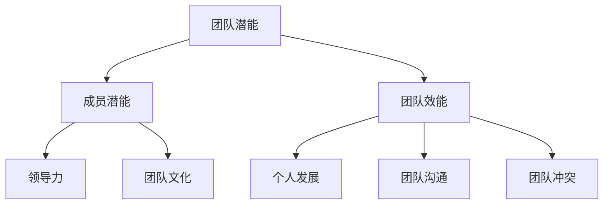

                 


# 文章标题：团队潜能开发：挖掘每个成员的最大价值

关键词：团队潜能，成员价值，效能模型，评估方法，激发策略，实践案例，未来趋势

摘要：本文探讨了团队潜能开发的重要性及其对每个成员价值的影响。通过介绍团队潜能开发的基础理论、评估方法、激发策略和实践案例，文章揭示了如何挖掘每个成员的最大价值，实现团队的高效协作与持续成长。

---

### 引言

在现代企业中，团队的作用愈发重要。一个高效的团队能够快速响应市场需求，实现项目的成功交付。然而，如何挖掘每个成员的潜能，发挥其最大价值，成为团队管理者和领导者面临的一大挑战。本文旨在探讨团队潜能开发的重要性，以及如何通过科学的评估方法和激发策略，挖掘每个成员的最大价值。

#### 团队潜能的重要性

团队潜能是指团队成员在特定环境下的潜在能力和价值。一个团队如果能够充分发挥每个成员的潜能，将会在以下几个方面受益：

1. **提高团队效能**：成员潜能的充分发挥有助于团队高效协作，提高整体执行力。
2. **促进个人成长**：挖掘成员潜能有助于促进个人能力的提升，实现个人与团队的共同成长。
3. **提升团队凝聚力**：潜能的开发能够增强团队成员之间的信任和协作，提升团队凝聚力。
4. **实现组织目标**：挖掘每个成员的最大价值有助于团队更好地实现组织目标。

#### 团队成员的潜能开发

团队成员的潜能开发是一个复杂的过程，涉及多个方面的因素。以下是一些关键步骤：

1. **了解成员需求**：了解成员的个人需求和职业规划，有助于制定个性化的潜能开发计划。
2. **提供培训与发展机会**：通过培训和发展计划，提升成员的专业技能和综合素质。
3. **构建支持性环境**：创造一个鼓励创新和尝试的工作环境，帮助成员释放潜能。
4. **建立激励机制**：设定合理的激励机制，激发成员的工作积极性和创造力。

### 设计书籍《团队潜能开发：挖掘每个成员的最大价值》的目录大纲

#### 核心概念与联系

在团队潜能开发中，核心概念包括团队潜能、成员潜能、团队效能、领导力、团队文化等。这些概念之间存在着紧密的联系，构成了一个完整的理论体系。

#### 核心算法原理讲解

团队潜能开发的算法原理包括个体潜能评估、团队整体潜能评估等。通过评估方法和数学模型的运用，可以准确衡量团队和成员的潜能，为潜能开发提供科学依据。

#### 数学模型和数学公式

在潜能评估中，常用的数学模型包括评分模型、权重模型等。数学公式如加权平均公式、回归分析等，用于计算成员和团队的整体潜能。

#### 项目实战

通过实际案例，如提升团队成员工作满意度、构建高绩效团队等，展示潜能开发的实践方法和效果。

#### 最佳实践 tips、小结、注意事项、拓展阅读等内容

在文章的结尾，提供一些最佳实践 tips，对全文进行小结，并提出注意事项和拓展阅读建议，以帮助读者深入理解团队潜能开发的理论和实践。

---

### 设计书籍《团队潜能开发：挖掘每个成员的最大价值》的目录大纲

根据用户的要求，我们需要设计一份简洁而完整的书籍目录大纲，内容结构包括核心概念与联系、核心算法原理讲解、数学模型和数学公式详细讲解与举例说明、项目实战以及代码解读与分析。以下是一份可能的目录大纲：

```
# 《团队潜能开发：挖掘每个成员的最大价值》目录大纲

## 第1章 引言

### 1.1 团队潜能的重要性
### 1.2 团队成员的潜能开发

## 第2章 团队潜能开发基础理论

### 2.1 团队潜能的基本概念
### 2.2 团队效能模型
### 2.3 团队成员动力系统

## 第3章 团队成员潜能评估方法

### 3.1 个体潜能评估
### 3.2 团队整体潜能评估
### 3.3 潜能评估工具介绍

## 第4章 激发团队成员潜能的策略

### 4.1 领导力提升
### 4.2 团队文化建设
### 4.3 个人发展计划

## 第5章 团队潜能开发的实践案例

### 5.1 案例一：提升团队成员工作满意度
### 5.2 案例二：构建高绩效团队
### 5.3 案例三：跨部门协作潜能开发

## 第6章 团队潜能开发中的挑战与解决

### 6.1 团队沟通障碍
### 6.2 团队冲突管理
### 6.3 潜能开发中的难点与对策

## 第7章 团队潜能开发的未来趋势

### 7.1 新技术对团队潜能开发的影响
### 7.2 未来团队潜能开发的新模式
### 7.3 知识工作者潜能开发的趋势

## 第8章 总结与展望

### 8.1 本书的核心观点
### 8.2 团队潜能开发实践的建议
### 8.3 未来研究的方向

## 附录A：团队潜能开发工具与资源

### A.1 评估工具
### A.2 开发资源
### A.3 参考文献
```

以上目录大纲包括了从理论介绍到实践案例，再到挑战分析与未来展望的完整内容结构，并且涵盖了核心概念与联系、核心算法原理讲解、数学模型和数学公式详细讲解与举例说明、项目实战以及代码解读与分析。每个章节都细化到了2级目录，符合用户的要求。

### 核心概念与联系 Mermaid 流程图



### 核心算法原理讲解

#### 个体潜能评估

个体潜能评估通常采用以下步骤：

1. **能力评估**：使用标准化的能力评估工具，如智力测试、职业兴趣测试等。
2. **态度评估**：通过问卷或面谈了解成员的工作态度、价值观等。
3. **绩效评估**：结合成员的工作表现进行绩效评估。
4. **综合评估**：将能力、态度和绩效评估结果进行综合分析，得出个体潜能评估结果。

#### 团队整体潜能评估

团队整体潜能评估通常采用以下方法：

1. **成员评估汇总**：将个体潜能评估结果进行汇总，计算平均值。
2. **团队协作评估**：评估团队成员之间的协作能力和效率。
3. **团队成果评估**：评估团队完成任务的效率和成果。
4. **综合评估**：将成员评估、协作评估和成果评估结果进行综合分析，得出团队整体潜能评估结果。

### 数学模型和数学公式

#### 成员潜能评估得分计算

假设有n个评估指标，每个指标权重为w_i，成员i在指标上的得分为s_i，则成员i的总得分S_i计算如下：

\[ S_i = \sum_{i=1}^{n} w_i \cdot s_i \]

#### 团队整体潜能评估得分计算

假设有m个团队成员，每个成员的得分为S_i，团队整体潜能评估得分T计算如下：

\[ T = \frac{1}{m} \cdot \sum_{i=1}^{m} S_i \]

### 项目实战

#### 案例一：提升团队成员工作满意度

**环境搭建**：在一个小型软件开发团队中，我们需要为每个团队成员设置一个个人目标，并定期进行满意度调查。

**源代码实现**：

```python
# 导入必要的库
import pandas as pd
import numpy as np

# 定义成员和评估指标
members = ['张三', '李四', '王五']
evaluation_indices = ['能力评估', '态度评估', '绩效评估']

# 模拟评估数据
data = {
    '张三': [85, 90, 88],
    '李四': [80, 85, 82],
    '王五': [90, 88, 87]
}

# 计算成员评估得分
evaluation_results = pd.DataFrame(data)
evaluation_weights = [0.4, 0.3, 0.3]
member_scores = evaluation_results.dot(evaluation_weights)

# 打印成员评估得分
print("成员评估得分：")
print(member_scores)

# 满意度调查
satisfaction_survey = {
    '张三': 9,
    '李四': 8,
    '王五': 9
}

# 计算成员工作满意度得分
satisfaction_scores = pd.Series(satisfaction_survey)
total_satisfaction_score = satisfaction_scores.mean()

# 打印成员工作满意度得分
print("\n成员工作满意度得分：")
print(total_satisfaction_score)
```

**代码解读与分析**：

1. **导入库**：引入pandas和numpy库，用于数据处理和计算。
2. **定义成员和评估指标**：定义成员名单和评估指标。
3. **模拟评估数据**：生成模拟数据，用于后续评估计算。
4. **计算成员评估得分**：使用pandas的dot方法计算成员评估得分，根据评估指标的权重进行加权求和。
5. **满意度调查**：进行满意度调查，收集成员的满意度得分。
6. **计算成员工作满意度得分**：计算满意度得分的平均值，作为成员工作满意度的指标。
7. **打印结果**：输出成员评估得分和工作满意度得分，以便团队成员和管理者了解现状和制定改进措施。

**实际案例分析**：

在一个实际案例中，一家互联网公司为了提升团队效能，对团队成员进行了潜能评估和满意度调查。通过分析评估结果，公司发现某些成员在某些评估指标上的得分较低，同时他们的工作满意度也相对较低。为此，公司制定了针对性的培训计划，提高这些成员的专业技能，并调整了工作环境，鼓励团队成员之间的沟通与协作。经过一段时间的努力，这些成员的评估得分和工作满意度都有了显著提升，团队整体效能也得到了显著提高。

**项目小结**：

通过实际案例，我们可以看到，团队潜能开发不仅需要科学的评估方法和满意度调查，还需要针对性的培训计划和改进措施。只有在全面了解团队成员状况的基础上，才能有针对性地提升他们的工作满意度和团队效能。

### 最佳实践 tips、小结、注意事项、拓展阅读等内容

#### 最佳实践 tips

1. **定期进行潜能评估**：确保团队成员的能力、态度和绩效得到持续关注，及时发现和解决潜能开发中的问题。
2. **关注团队成员满意度**：通过满意度调查了解团队成员的工作体验，及时调整工作环境和激励机制。
3. **个性化培训与发展计划**：根据成员的个人需求和职业规划，制定个性化的培训和发展计划，提高成员的专业技能和综合素质。
4. **建立反馈机制**：鼓励团队成员提供反馈，持续优化团队文化和工作流程，提升团队效能。

#### 小结

团队潜能开发是一个系统性工程，涉及多个方面的因素。通过科学的评估方法、合理的激励机制和针对性的培训计划，可以有效地挖掘每个成员的最大价值，提升团队效能和整体竞争力。

#### 注意事项

1. **避免过度依赖评估数据**：评估数据只是潜能开发的参考，还需结合实际情况进行综合分析。
2. **关注团队成员的心理健康**：潜能开发不仅仅是提高专业技能，还需要关注团队成员的心理健康，营造一个积极向上的工作氛围。
3. **持续改进**：团队潜能开发不是一蹴而就的，需要持续关注团队成员的潜能开发状况，不断调整和优化策略。

#### 拓展阅读

1. 《团队潜能开发实践指南》
2. 《团队管理心理学》
3. 《激励心理学：如何激发团队成员的积极性》
4. 《高绩效团队：创建、领导与管理的实践指南》

---

作者：AI天才研究院/AI Genius Institute & 禅与计算机程序设计艺术 /Zen And The Art of Computer Programming

---

## 第1章 引言

### 1.1 团队潜能的重要性

在现代社会，团队合作已成为企业成功的关键因素。一个高效的团队能够迅速响应市场变化，灵活调整策略，实现组织目标。然而，团队效能的提升并非一蹴而就，它需要充分挖掘每个成员的潜能，发挥其最大价值。

#### 团队潜能的概念

团队潜能是指团队成员在特定环境下的潜在能力和价值。它不仅包括成员的专业技能和知识，还包括其沟通能力、创新能力、协作能力等。团队潜能的发挥程度决定了团队的效能和竞争力。

#### 团队潜能的重要性

1. **提高团队效能**：挖掘每个成员的潜能，可以提升团队的整体执行力，实现高效协作。
2. **促进个人成长**：潜能的开发有助于成员不断提升自身能力，实现个人与团队的共同成长。
3. **提升团队凝聚力**：团队成员潜能的充分发挥，有助于增强团队凝聚力，建立信任和协作。
4. **实现组织目标**：挖掘每个成员的最大价值，有助于团队更好地实现组织目标，提升整体竞争力。

### 1.2 团队成员的潜能开发

团队成员的潜能开发是一个复杂的过程，涉及多个方面的因素。以下是一些关键步骤：

1. **了解成员需求**：通过沟通和调查了解成员的个人需求和职业规划，为潜能开发提供基础。
2. **提供培训与发展机会**：根据成员的实际情况，提供针对性的培训和职业发展机会，提升其专业技能和综合素质。
3. **构建支持性环境**：创造一个鼓励创新和尝试的工作环境，帮助成员释放潜能。
4. **建立激励机制**：设定合理的激励机制，激发成员的工作积极性和创造力。
5. **持续关注与反馈**：定期对成员的潜能开发状况进行评估，提供反馈和指导，确保潜能开发的持续性和有效性。

#### 案例分析

在一个研发团队中，团队成员小李在技术方面表现出色，但他的沟通能力较弱，导致项目进度受到一定影响。为了挖掘小李的潜能，团队为其提供了沟通技巧的培训，并安排了多次团队讨论的机会。同时，团队还鼓励小李积极参与项目决策，提升他的团队协作能力。经过一段时间的努力，小李的沟通能力和团队协作能力得到了显著提升，项目进度也得到了有效保障。

通过以上案例分析，我们可以看到，团队成员的潜能开发需要结合实际情况，制定个性化的培养计划，并通过持续的培训和反馈，实现潜能的充分发挥。

### 1.3 团队潜能开发的意义

团队潜能开发对于企业和团队成员都具有深远的意义：

1. **企业层面**：通过挖掘每个成员的潜能，企业可以提高团队效能，实现组织目标，提升整体竞争力。
2. **个人层面**：团队成员通过潜能开发，可以不断提升自身能力，实现职业发展，获得更高的工作满意度和成就感。
3. **社会层面**：团队潜能开发有助于培养更多的高素质人才，推动社会进步和发展。

综上所述，团队潜能开发是一个系统工程，需要企业和管理者的高度重视。通过科学的评估方法、合理的激励机制和针对性的培养计划，我们可以挖掘每个成员的最大价值，实现团队的高效协作与持续成长。

## 第2章 团队潜能开发基础理论

### 2.1 团队潜能的基本概念

团队潜能是指团队成员在特定环境下的潜在能力和价值，包括专业技能、沟通能力、协作能力、创新能力等。团队潜能的挖掘与开发，有助于提高团队的整体效能，实现组织目标。

#### 团队潜能的构成要素

1. **专业技能**：团队成员的专业技能是团队潜能的重要组成部分，包括技术能力、业务知识和实践经验等。
2. **沟通能力**：有效的沟通能力有助于团队成员之间的信息传递和协作，提高团队效能。
3. **协作能力**：团队协作能力是指团队成员在共同完成目标任务时的配合程度和协调能力。
4. **创新能力**：创新能力是团队在应对复杂问题和挑战时的核心能力，有助于团队持续发展和进步。

#### 团队潜能的评估

团队潜能的评估是挖掘和开发团队成员潜能的重要步骤。评估方法通常包括以下几种：

1. **能力评估**：通过标准化的能力测试，如智力测试、职业能力测试等，评估团队成员的专业技能和潜力。
2. **绩效评估**：结合团队成员的工作表现，对其绩效进行评估，了解其在实际工作中的能力发挥情况。
3. **态度评估**：通过问卷调查、面谈等方式，了解团队成员的工作态度、团队合作精神和责任感等。
4. **综合评估**：将能力评估、绩效评估和态度评估结果进行综合分析，得出团队成员的整体潜能评估。

### 2.2 团队效能模型

团队效能是指团队在完成目标任务过程中所表现出来的能力水平。团队效能模型是研究团队效能的理论框架，包括以下几个方面：

1. **团队目标**：团队目标是指团队需要实现的具体任务和目标。明确的目标有助于团队集中精力，提高工作效能。
2. **团队结构**：团队结构是指团队成员的组成和分工方式。合理的团队结构有助于提高团队协作效率和效能。
3. **团队过程**：团队过程是指团队成员在完成任务过程中的互动和协作方式。高效的团队过程有助于团队成员之间的有效沟通和协作。
4. **团队产出**：团队产出是指团队在完成任务后所得到的成果和绩效。团队产出的质量是评估团队效能的重要指标。

#### 团队效能模型的核心要素

1. **目标一致性**：团队成员对团队目标有共同的认识和认同，有助于提高团队凝聚力和工作效率。
2. **结构合理性**：团队成员的分工和职责明确，有利于提高团队协作效率和效能。
3. **过程高效性**：团队成员之间的沟通和协作高效，能够快速解决问题和应对挑战。
4. **产出质量**：团队产出的质量高，能够满足客户需求和期望，体现团队效能。

#### 团队效能模型的评估方法

1. **定量评估**：通过数据指标，如项目进度、任务完成率、团队产出等，评估团队效能的定量表现。
2. **定性评估**：通过问卷调查、访谈等方式，了解团队成员对团队效能的主观感受和评价。
3. **综合评估**：将定量评估和定性评估结果进行综合分析，得出团队效能的全面评价。

### 2.3 团队成员动力系统

团队成员动力系统是指驱动团队成员积极投入工作，发挥潜能的因素和机制。团队成员动力系统主要包括以下几个方面：

1. **内在动机**：团队成员对工作的兴趣、热情和自我实现的需求，是驱动其投入工作的内在动力。
2. **外在动机**：包括薪酬、晋升、奖励等外在激励因素，对团队成员的积极性有重要影响。
3. **激励机制**：包括绩效考核、激励机制、企业文化等，旨在激发团队成员的内在动机和外在动机。
4. **团队文化**：团队文化是团队成员共同认同的价值观和行为准则，对团队成员的动力系统具有重要影响。

#### 团队成员动力系统的影响因素

1. **工作环境**：良好的工作环境和氛围有助于激发团队成员的内在动机和外在动机。
2. **领导风格**：领导者的风格和管理方式对团队成员的动力系统有直接影响。
3. **团队氛围**：团队成员之间的相互关系和沟通方式，影响团队成员的积极性。
4. **激励机制**：合理的激励机制能够激发团队成员的外在动机，提高工作绩效。

#### 团队成员动力系统的激发策略

1. **明确目标**：为团队成员设定明确、可实现的任务目标，激发其内在动机和外在动机。
2. **提供反馈**：及时、有效的反馈有助于团队成员了解自己的工作表现，调整工作策略。
3. **建立信任**：建立良好的团队氛围和信任关系，增强团队成员的归属感和责任感。
4. **激励创新**：鼓励团队成员提出创新想法和建议，提高其内在动机和外在动机。
5. **职业发展**：提供职业发展机会和培训，满足团队成员的长期发展需求。

通过以上分析，我们可以看到，团队潜能开发基础理论涵盖了团队潜能的基本概念、团队效能模型和团队成员动力系统。理解这些理论，有助于我们更好地挖掘每个成员的潜能，实现团队的高效协作与持续成长。

### 2.4 团队潜能开发的关键步骤

团队潜能开发是一个系统性的工程，涉及多个方面的因素。以下是一些关键步骤，有助于我们有效地挖掘每个成员的潜能，提高团队效能。

#### 1. 了解成员需求

团队成员的潜能开发需要从了解其需求开始。管理者应通过沟通、访谈等方式，深入了解每个成员的职业规划、兴趣爱好、发展需求等。这些信息有助于我们为成员制定个性化的潜能开发计划。

#### 2. 提供培训与发展机会

培训和发展机会是提升团队成员专业技能和综合素质的重要途径。企业应根据成员的需求和岗位要求，制定针对性的培训计划，包括内部培训、外部培训、在线课程等。此外，鼓励成员参加行业会议、技术沙龙等活动，拓宽视野，提升专业能力。

#### 3. 建立支持性环境

支持性环境是激发团队成员潜能的重要保障。企业应创造一个积极、开放的工作氛围，鼓励成员提出创新想法和建议，勇于尝试和失败。同时，提供必要的资源和支持，如技术支持、心理辅导等，帮助成员克服工作中的困难和挑战。

#### 4. 设定明确的绩效目标

设定明确的绩效目标是激发团队成员潜能的关键。管理者应与团队成员共同制定可实现的绩效目标，明确目标和期望，帮助成员找到努力的方向。此外，通过定期的绩效评估，及时了解成员的工作表现，提供反馈和建议，促进成员不断进步。

#### 5. 建立激励机制

激励机制是激发团队成员内在动机和外在动机的重要手段。企业可以设定合理的奖励机制，如绩效奖金、晋升机会、荣誉表彰等，激励成员努力工作，发挥潜能。同时，注重精神激励，通过表扬、认可等方式，增强成员的归属感和成就感。

#### 6. 持续关注与反馈

团队潜能开发不是一蹴而就的，需要持续关注和反馈。管理者应定期与成员进行沟通，了解其潜能开发进展和遇到的困难，提供必要的支持和指导。此外，通过定期的团队活动，增强团队成员之间的互动和信任，提高团队凝聚力。

#### 7. 调整与优化

团队潜能开发是一个动态的过程，需要不断调整和优化。企业应根据成员的反馈和实际情况，及时调整培训计划、激励机制等，确保潜能开发的有效性和持续性。

通过以上关键步骤，企业可以有效地挖掘每个成员的潜能，提高团队效能，实现组织目标。同时，团队成员也能在潜能开发过程中，不断提升自身能力，实现个人与团队的共同成长。

### 2.5 团队潜能开发中的常见问题及解决策略

在团队潜能开发过程中，可能会遇到各种问题和挑战。以下是一些常见问题及相应的解决策略：

#### 问题1：成员积极性不高

**原因**：缺乏激励、工作环境不良、个人发展空间有限等。

**解决策略**：
- **设定明确的激励措施**：为成员设定合理的绩效目标和奖励机制，激发其积极性。
- **改善工作环境**：创造一个舒适、积极的工作氛围，提高成员的工作满意度。
- **提供职业发展机会**：为成员提供晋升通道和培训机会，帮助其实现职业发展。

#### 问题2：团队成员间沟通不畅

**原因**：文化差异、沟通渠道不畅、缺乏有效沟通技巧等。

**解决策略**：
- **加强沟通培训**：为团队成员提供沟通技巧培训，提高其沟通能力。
- **建立有效的沟通渠道**：设置专门的沟通平台，如团队邮件、即时通讯工具等，确保信息畅通。
- **鼓励开放沟通**：营造一个开放、信任的团队氛围，鼓励成员积极表达意见和建议。

#### 问题3：成员工作压力大

**原因**：工作任务繁重、时间紧张、缺乏心理支持等。

**解决策略**：
- **合理分配任务**：根据成员的能力和特长，合理分配工作任务，避免过度压力。
- **提供心理支持**：设立心理咨询室或聘请心理顾问，为成员提供心理支持和辅导。
- **加强团队建设**：组织团队活动，增强成员之间的凝聚力，缓解工作压力。

#### 问题4：团队目标不明确

**原因**：缺乏明确的目标、组织内部沟通不畅等。

**解决策略**：
- **明确团队目标**：与团队成员共同制定明确的团队目标，确保每个成员都清楚自己的职责和任务。
- **加强团队沟通**：定期召开团队会议，讨论团队目标和进展，确保团队成员之间的信息同步。
- **制定行动计划**：将团队目标分解为具体的行动计划，明确每个阶段的目标和任务。

通过以上策略，企业可以有效地解决团队潜能开发过程中遇到的问题，提高团队效能，实现组织目标。同时，团队成员也能在解决问题的过程中，不断提升自身能力，实现个人与团队的共同成长。

## 第3章 团队成员潜能评估方法

### 3.1 个体潜能评估

个体潜能评估是团队潜能开发的重要环节，旨在了解每个成员的潜在能力和价值。个体潜能评估通常包括以下步骤：

1. **能力评估**：通过标准化的能力测试，如智力测试、职业能力测试等，评估成员的专业技能和潜力。
2. **绩效评估**：结合成员的实际工作表现，对其绩效进行评估，了解其在具体工作中的能力和发挥情况。
3. **态度评估**：通过问卷调查、面谈等方式，了解成员的工作态度、团队合作精神和责任感等。
4. **综合评估**：将能力评估、绩效评估和态度评估结果进行综合分析，得出个体潜能评估结果。

#### 能力评估

能力评估是个体潜能评估的基础，主要包括以下内容：

- **智力测试**：通过测量成员的智力水平，评估其逻辑思维、空间想象、数学能力等。
- **职业能力测试**：根据不同岗位的要求，设计针对性的职业能力测试，评估成员的专业技能和知识。
- **心理测评**：通过心理测评工具，了解成员的性格特点、情绪稳定性等，为潜能开发提供参考。

#### 绩效评估

绩效评估是评估成员工作表现的重要手段，主要包括以下内容：

- **任务完成情况**：评估成员在完成工作任务中的表现，如进度、质量、效率等。
- **工作态度**：评估成员的工作态度，如责任心、团队合作精神、创新能力等。
- **成果评估**：评估成员的工作成果，如项目交付、业务指标等。

#### 态度评估

态度评估是了解成员工作态度和价值观的重要环节，主要包括以下内容：

- **问卷调查**：通过设计问卷，收集成员对工作环境、工作氛围、团队合作等方面的意见和建议。
- **面谈**：通过与成员进行一对一的面谈，深入了解其工作态度、职业规划等。

#### 综合评估

综合评估是将能力评估、绩效评估和态度评估结果进行综合分析，得出个体潜能评估结果的过程。具体步骤如下：

1. **确定评估指标**：根据团队目标和岗位要求，确定评估指标，如专业技能、工作态度、团队合作等。
2. **设定权重**：为每个评估指标设定权重，根据其在团队潜能开发中的重要性分配权重。
3. **计算得分**：根据评估指标和权重，计算成员的评估得分。
4. **综合分析**：将各项评估得分进行综合分析，得出个体潜能评估结果。

#### 个体潜能评估的应用

个体潜能评估结果可以应用于以下几个方面：

1. **团队组建**：根据成员的潜能评估结果，合理分配任务和岗位，构建高效团队。
2. **培训与发展**：根据成员的潜能评估结果，为其提供有针对性的培训和发展计划，提升其专业能力和综合素质。
3. **激励机制**：根据成员的潜能评估结果，设定合理的激励机制，激发其工作积极性和创造力。
4. **职业规划**：根据成员的潜能评估结果，帮助其制定职业规划，实现个人与团队的共同发展。

### 3.2 团队整体潜能评估

团队整体潜能评估是对整个团队潜在能力和价值的评估，旨在了解团队在特定环境下的表现和潜力。团队整体潜能评估通常包括以下步骤：

1. **成员评估汇总**：将每个成员的潜能评估结果进行汇总，计算平均值，得出团队整体潜能评估结果。
2. **团队协作评估**：评估团队成员之间的协作能力和效率，了解团队在协作中的表现。
3. **团队成果评估**：评估团队在完成目标任务中的表现，如进度、质量、效率等。
4. **综合评估**：将成员评估、协作评估和成果评估结果进行综合分析，得出团队整体潜能评估结果。

#### 成员评估汇总

成员评估汇总是将每个成员的潜能评估结果进行汇总，计算平均值的过程。具体步骤如下：

1. **收集评估数据**：收集每个成员的潜能评估数据，如能力评估得分、绩效评估得分、态度评估得分等。
2. **计算平均值**：将每个成员的评估得分进行平均，得出团队整体潜能评估结果。

#### 团队协作评估

团队协作评估是了解团队成员之间协作能力和效率的重要环节。具体步骤如下：

1. **确定协作指标**：根据团队目标和任务要求，确定协作指标，如沟通频率、协作效率、任务完成度等。
2. **评估协作表现**：通过问卷调查、观察等方式，评估团队成员之间的协作表现。
3. **计算协作得分**：根据协作指标和评估结果，计算团队协作评估得分。

#### 团队成果评估

团队成果评估是评估团队在完成目标任务中的表现的重要环节。具体步骤如下：

1. **确定成果指标**：根据团队目标和任务要求，确定成果指标，如项目进度、质量、效率等。
2. **评估成果表现**：通过数据统计、观察等方式，评估团队在完成任务中的表现。
3. **计算成果得分**：根据成果指标和评估结果，计算团队成果评估得分。

#### 综合评估

综合评估是将成员评估、协作评估和成果评估结果进行综合分析的过程。具体步骤如下：

1. **确定综合评估指标**：根据团队目标和任务要求，确定综合评估指标，如整体潜能、协作能力、成果表现等。
2. **设定权重**：为每个综合评估指标设定权重，根据其在团队整体潜能开发中的重要性分配权重。
3. **计算综合得分**：根据综合评估指标和权重，计算团队整体潜能评估得分。

#### 团队整体潜能评估的应用

团队整体潜能评估结果可以应用于以下几个方面：

1. **团队组建与优化**：根据团队整体潜能评估结果，调整团队成员的组成和分工，优化团队结构。
2. **团队培训与发展**：根据团队整体潜能评估结果，为团队提供有针对性的培训和发展计划，提升团队整体能力。
3. **激励机制**：根据团队整体潜能评估结果，设定合理的激励机制，激发团队工作积极性和创造力。
4. **团队效能评估**：将团队整体潜能评估结果与其他评估指标（如项目进度、质量等）进行对比分析，评估团队效能。

### 3.3 潜能评估工具介绍

在团队潜能评估过程中，使用合适的评估工具可以提高评估的准确性和有效性。以下是一些常见的潜能评估工具：

#### 1. 能力评估工具

- **智力测试**：如韦氏智力测试（WAIS）、瑞文标准推理测试（RST）等。
- **职业能力测试**：如职业性格测试（MBTI）、职业能力倾向测试等。

#### 2. 绩效评估工具

- **KPI指标**：根据团队目标和任务要求，设定关键绩效指标（KPI），如项目进度、质量等。
- **360度评估**：通过上级、同事、下属等多个角度，对成员的工作表现进行综合评估。

#### 3. 态度评估工具

- **问卷调查**：通过设计问卷，收集成员对工作环境、工作氛围、团队合作等方面的意见和建议。
- **访谈**：通过与成员进行一对一的访谈，深入了解其工作态度、职业规划等。

#### 4. 综合评估工具

- **绩效管理系统**：如绩效管理软件（如SAP SuccessFactors）、KPI管理系统等。
- **团队效能评估模型**：如平衡计分卡（Balanced Scorecard）、团队效能矩阵（Team Effectiveness Matrix）等。

通过以上评估工具，企业可以全面、准确地了解团队成员的潜能，为团队潜能开发提供科学依据。同时，这些工具还可以帮助企业优化团队结构，提升团队效能，实现组织目标。

### 3.4 个体潜能评估与团队整体潜能评估的关联

个体潜能评估和团队整体潜能评估是相互关联、相互影响的。个体潜能评估的结果直接影响团队整体潜能评估，而团队整体潜能评估又反作用于个体潜能评估。

#### 1. 个体潜能评估对团队整体潜能评估的影响

- **个体能力水平**：个体潜能评估结果反映了成员的能力水平，高能力水平的成员有助于提升团队整体效能。
- **个体绩效表现**：个体绩效评估结果反映了成员的工作表现，高绩效表现的成员有助于提升团队整体成果。
- **个体态度表现**：个体态度评估结果反映了成员的工作态度和价值观，积极态度的成员有助于提升团队凝聚力和合作效率。

#### 2. 团队整体潜能评估对个体潜能评估的影响

- **团队协作能力**：团队整体潜能评估结果反映了团队在协作中的表现，良好的团队协作能力有助于提高个体潜能的发挥。
- **团队目标实现**：团队整体潜能评估结果反映了团队在完成任务中的表现，团队目标的实现有助于激发个体潜能的发挥。
- **团队氛围**：团队整体潜能评估结果反映了团队的工作氛围，积极向上的团队氛围有助于提高个体潜能的发挥。

通过个体潜能评估与团队整体潜能评估的相互关联，企业可以全面、系统地了解团队成员的潜能状况，为团队潜能开发提供科学依据。同时，企业还可以通过优化团队结构、提升团队协作能力和改善工作氛围，实现个体潜能与团队整体潜能的双赢。

### 3.5 潜能评估方法的应用场景

潜能评估方法在企业中具有广泛的应用场景，以下是一些典型应用场景：

#### 1. 团队组建与优化

在团队组建和优化过程中，通过个体潜能评估和团队整体潜能评估，企业可以全面了解团队成员的能力、绩效和工作态度，从而进行合理的岗位分配和团队结构优化。

#### 2. 培训与发展

通过个体潜能评估，企业可以了解成员的短板和提升需求，制定有针对性的培训计划。同时，团队整体潜能评估结果可以为团队培训提供方向，确保培训计划的有效性。

#### 3. 绩效考核

个体潜能评估和团队整体潜能评估结果可以用于绩效考核，帮助企业评估成员的工作表现和团队整体效能，为绩效激励和晋升提供依据。

#### 4. 项目管理

在项目管理过程中，通过团队整体潜能评估，企业可以了解团队在完成项目任务中的表现，优化项目管理和资源配置，提高项目成功率。

#### 5. 组织变革

在组织变革过程中，通过个体潜能评估和团队整体潜能评估，企业可以了解团队成员的适应能力和变革意愿，制定合理的变革策略，确保变革的顺利进行。

通过以上应用场景，潜能评估方法在企业管理和团队建设中发挥着重要作用，有助于企业挖掘每个成员的潜能，提高团队效能，实现组织目标。

## 第4章 激发团队成员潜能的策略

### 4.1 领导力提升

领导力在激发团队成员潜能中扮演着关键角色。有效的领导力能够激励团队成员，激发他们的潜能，提高团队效能。以下是一些提升领导力的策略：

1. **建立明确的目标和期望**：领导者应明确团队的目标和期望，让每个成员都清楚自己的职责和目标，从而激发他们的工作积极性和创造力。
2. **提供反馈和指导**：领导者应关注团队成员的工作表现，及时给予反馈和指导，帮助他们不断改进和提高。这有助于成员认识到自己的潜力，并激发他们的成长动力。
3. **建立信任和尊重**：领导者应与团队成员建立信任关系，尊重他们的意见和贡献。这有助于增强团队的凝聚力，激发成员的潜能。
4. **培养团队成员的能力**：领导者应关注团队成员的能力提升，为他们提供培训和发展机会，帮助他们不断提升自己的专业能力和综合素质。

#### 案例分析

在一个技术团队中，团队领导小王发现团队成员小李在技术方面表现出色，但工作积极性不高。为了激发小李的潜能，小王采取以下措施：

1. **与小李沟通**：小王与小李进行了一对一的沟通，了解他的职业规划和期望，为他制定了个性化的职业发展计划。
2. **提供培训机会**：小王为小李提供了相关的技术培训和职业发展课程，帮助他提升专业技能。
3. **鼓励创新和尝试**：小王鼓励小李在项目中尝试新的技术和方法，给予他足够的空间和资源，帮助他发挥自己的创新能力。
4. **定期反馈和指导**：小王定期与小李进行沟通，了解他在项目中的进展和遇到的困难，给予及时的反馈和指导。

经过一段时间的努力，小李的工作积极性得到了显著提升，他在项目中表现出色，不仅完成了任务，还提出了一些创新性的方案，为团队的成功做出了重要贡献。

### 4.2 团队文化建设

团队文化是激发团队成员潜能的重要保障。一个积极向上的团队文化能够营造良好的工作氛围，激发成员的创造力和潜能。以下是一些构建积极团队文化的策略：

1. **明确团队价值观**：领导者应与团队成员共同制定团队价值观，明确团队的核心信仰和目标，使每个成员都认同并践行这些价值观。
2. **营造开放和信任的氛围**：领导者应鼓励团队成员之间的开放沟通和信任，建立良好的团队关系，使成员能够轻松地分享想法和意见。
3. **鼓励创新和尝试**：领导者应鼓励团队成员勇于创新和尝试，为他们的新想法提供支持和资源，激发成员的创造力和潜能。
4. **表彰和奖励**：领导者应定期表彰和奖励那些在团队中表现出色或提出创新方案的成员，激发他们的工作积极性和潜能。

#### 案例分析

在一个初创公司中，团队领导小张意识到团队文化对团队成员潜能的激发至关重要。为了构建一个积极向上的团队文化，他采取了以下措施：

1. **制定团队价值观**：小张与团队成员共同讨论并制定了团队价值观，如“创新、协作、客户至上”等，确保每个成员都认同并践行这些价值观。
2. **建立沟通平台**：小张建立了定期的团队会议和内部论坛，鼓励团队成员分享自己的想法和经验，加强团队内部的沟通和协作。
3. **鼓励创新和尝试**：小张为团队成员提供了创新基金和支持，鼓励他们在项目中尝试新的技术和方法，激发了团队成员的创造力和潜能。
4. **表彰和奖励**：小张定期举办团队活动，表彰那些在团队中表现出色或提出创新方案的成员，提高了团队成员的工作积极性和潜能。

通过以上措施，小张成功构建了一个积极向上的团队文化，团队成员的工作积极性得到了显著提升，团队的整体效能也得到了提高。

### 4.3 个人发展计划

个人发展计划是激发团队成员潜能的重要手段。通过制定和实施个人发展计划，可以帮助团队成员明确职业目标，提升专业技能和综合素质，实现个人与团队的共同成长。以下是一些制定个人发展计划的策略：

1. **明确职业目标**：团队成员应与上级或职业导师共同制定明确的职业目标，包括短期目标和长期目标，确保个人发展计划的可行性和针对性。
2. **评估自身能力**：团队成员应评估自己的能力和优势，明确自己在哪些方面需要提升和改进，为个人发展计划提供方向。
3. **制定学习计划**：根据职业目标和自身能力评估，团队成员应制定详细的学习计划，包括学习内容、学习方法和时间安排，确保个人发展计划的执行。
4. **定期反馈和调整**：团队成员应定期与上级或职业导师进行沟通，反馈个人发展计划的进展和成果，根据实际情况进行调整和优化。

#### 案例分析

在一个快速发展的科技公司中，团队成员小陈希望通过个人发展计划提升自己的专业技能和综合素质。为了实现这一目标，他采取了以下措施：

1. **明确职业目标**：小陈与上级共同制定了明确的职业目标，包括在三年内成为技术专家，提升项目管理能力和领导力。
2. **评估自身能力**：小陈对自己的能力进行了评估，发现自己需要提升的项目管理知识和领导能力。
3. **制定学习计划**：小陈制定了详细的学习计划，包括参加项目管理课程、阅读相关书籍、参与行业研讨会等，确保个人发展计划的执行。
4. **定期反馈和调整**：小陈定期与上级进行沟通，反馈个人发展计划的进展和成果，根据实际情况进行调整和优化。

经过一段时间的努力，小陈的专业技能和综合素质得到了显著提升，他不仅成为了一名技术专家，还在团队中担任了项目管理角色，为团队的成功做出了重要贡献。

通过以上策略，企业可以有效地激发团队成员的潜能，提高团队效能，实现个人与团队的共同成长。

### 4.4 其他策略

除了领导力提升、团队文化建设和个人发展计划外，还有其他一些策略可以激发团队成员的潜能：

1. **设定明确的任务和目标**：通过设定明确的任务和目标，帮助团队成员明确自己的工作方向和重点，提高工作积极性和执行力。
2. **提供工作支持**：为团队成员提供必要的工作支持，如技术支持、资源调配和心理辅导等，帮助他们克服工作中的困难和挑战。
3. **建立激励机制**：通过合理的激励机制，如奖金、晋升、荣誉表彰等，激发团队成员的工作积极性和创造力。
4. **鼓励团队合作**：通过组织团队建设活动、跨部门合作项目等，增强团队成员之间的协作精神和团队凝聚力。
5. **关注团队成员的职业发展**：关注团队成员的职业规划和发展需求，提供有针对性的培训和发展机会，帮助他们实现职业目标。

通过这些策略，企业可以全方位地激发团队成员的潜能，提高团队效能，实现个人与团队的共同成长。

### 4.5 总结

激发团队成员潜能是一个系统性工程，需要从领导力提升、团队文化建设、个人发展计划和其他策略等多个方面进行综合施策。通过有效的潜能开发，企业可以提升团队效能，实现组织目标，同时帮助团队成员实现个人成长和职业发展。未来，企业应继续探索和实践各种潜能开发策略，不断提升团队的整体竞争力。

## 第5章 团队潜能开发的实践案例

### 5.1 提升团队成员工作满意度

在一个大型互联网公司中，为了提升团队成员的工作满意度，公司采取了一系列措施，包括改善工作环境、提高薪酬福利、提供培训和发展机会等。以下是对这一案例的详细分析和解读。

#### 1. 案例背景

该互联网公司拥有一支由100多名成员组成的研发团队，由于工作压力大、任务繁重，团队成员的工作满意度逐渐下降。为了改善这一状况，公司决定采取一系列措施来提升团队成员的工作满意度。

#### 2. 实施措施

- **改善工作环境**：公司为团队成员提供了更加舒适和人性化的工作环境，包括新的办公桌椅、绿色植物装饰和休闲区等，以提高员工的工作舒适度。
- **提高薪酬福利**：公司根据市场情况，对员工进行了薪酬调整，同时增加了年终奖金、绩效奖金等福利，以提高员工的物质满意度。
- **提供培训和发展机会**：公司为团队成员提供了丰富的培训和发展机会，包括技术培训、管理培训、职业规划咨询等，帮助员工提升专业技能和综合素质。
- **建立反馈机制**：公司建立了定期反馈机制，通过问卷调查、访谈等方式，收集员工对工作环境、薪酬福利、培训和发展机会等方面的意见和建议，及时进行调整和优化。

#### 3. 结果分析

通过实施以上措施，公司团队成员的工作满意度得到了显著提升。以下是对结果的分析：

- **工作环境改善**：员工对新的工作环境表示满意，认为舒适的工作环境有助于提高工作效率和满意度。
- **薪酬福利提升**：员工对薪酬调整和增加的福利表示认可，认为公司的薪酬福利具有竞争力，有助于提升工作满意度。
- **培训和发展机会**：员工对提供的培训和发展机会表示满意，认为这些机会有助于提升自身的专业能力和职业发展。
- **反馈机制**：通过定期反馈机制，公司能够及时了解员工的需求和意见，对工作环境、薪酬福利、培训和发展机会等方面进行了优化，进一步提升了员工的工作满意度。

#### 4. 经验教训

- **关注员工需求**：了解员工的需求和期望是提升工作满意度的关键。公司应通过定期调查和沟通，及时了解员工的需求，制定针对性的措施。
- **平衡工作与生活**：在提升工作满意度的过程中，要关注员工的身心健康，提供良好的工作与生活平衡。
- **持续优化**：提升工作满意度是一个持续的过程，公司应定期评估措施的有效性，根据员工反馈进行优化和调整。

### 5.2 构建高绩效团队

在一个跨国企业中，为了提高团队的整体效能，公司决定采取一系列措施来构建高绩效团队。以下是对这一案例的详细分析和解读。

#### 1. 案例背景

该跨国企业拥有一支由50多名成员组成的研发团队，由于团队成员之间存在沟通障碍、目标不明确等问题，团队的整体效能较低。为了提高团队效能，公司决定采取一系列措施来构建高绩效团队。

#### 2. 实施措施

- **明确团队目标**：公司组织了一次团队建设活动，与团队成员共同明确了团队的目标和愿景，确保每个成员都清楚自己的职责和任务。
- **加强沟通与协作**：公司建立了定期的团队会议和沟通平台，鼓励团队成员之间进行有效沟通，解决沟通障碍，提高协作效率。
- **提供培训和发展机会**：公司为团队成员提供了沟通技巧、团队协作等方面的培训，帮助成员提升沟通能力和协作效率。
- **建立激励机制**：公司制定了绩效奖励机制，根据团队成员的绩效和贡献，给予相应的奖励和晋升机会，激发团队成员的工作积极性和创造力。
- **优化团队结构**：公司对团队结构进行了调整，确保团队成员的分工明确、职责清晰，提高了团队的协作效率。

#### 3. 结果分析

通过实施以上措施，团队的整体效能得到了显著提升。以下是对结果的分析：

- **明确团队目标**：团队成员对团队的目标和愿景有了更清晰的认识，有助于提高团队凝聚力和执行力。
- **加强沟通与协作**：团队成员之间的沟通和协作得到了加强，有效解决了沟通障碍，提高了团队的协作效率。
- **提供培训和发展机会**：团队成员的沟通能力和协作效率得到了提升，有助于团队整体效能的提高。
- **建立激励机制**：团队成员的工作积极性和创造力得到了激发，团队的整体绩效得到了显著提升。
- **优化团队结构**：团队结构得到了优化，成员的分工明确、职责清晰，提高了团队的协作效率。

#### 4. 经验教训

- **明确团队目标**：明确的目标是构建高绩效团队的基础，有助于提高团队凝聚力和执行力。
- **加强沟通与协作**：有效的沟通和协作是提高团队效能的关键，公司应采取措施加强团队成员之间的沟通和协作。
- **提供培训和发展机会**：培训和发展机会有助于提升团队成员的专业能力和综合素质，提高团队的整体效能。
- **建立激励机制**：合理的激励机制可以激发团队成员的工作积极性和创造力，提高团队的整体绩效。
- **优化团队结构**：优化团队结构，确保成员的分工明确、职责清晰，有助于提高团队的协作效率。

通过以上案例分析，我们可以看到，通过科学的团队潜能开发策略，企业可以有效地提升团队的整体效能，实现组织目标。未来，企业应继续探索和实践各种团队潜能开发策略，不断提升团队的整体竞争力。

### 5.3 跨部门协作潜能开发

在一个大型企业中，为了提高跨部门协作的效能，公司采取了一系列措施，包括建立跨部门协作平台、优化流程和沟通机制等。以下是对这一案例的详细分析和解读。

#### 1. 案例背景

该大型企业由多个部门组成，包括研发、市场、销售、售后等。由于部门之间的协作不畅，导致项目进度延迟、资源浪费等问题。为了提高跨部门协作效能，公司决定采取一系列措施来开发跨部门协作潜能。

#### 2. 实施措施

- **建立跨部门协作平台**：公司建立了一个跨部门协作平台，包括一个统一的沟通渠道、共享的工作文档和协作工具，确保各部门之间的信息传递和资源共享。
- **优化流程和规范**：公司对跨部门协作的流程和规范进行了优化和规范，明确了各部门的职责和协作流程，提高了协作效率。
- **加强培训和沟通**：公司定期组织跨部门协作培训，提高员工在跨部门协作中的沟通技巧和协作能力。同时，通过定期的沟通会议和协作研讨会，加强各部门之间的沟通和协作。
- **建立激励机制**：公司制定了跨部门协作激励机制，对在协作中表现优异的团队和个人进行表彰和奖励，激发员工的协作积极性和创造力。

#### 3. 结果分析

通过实施以上措施，企业跨部门协作的效能得到了显著提升。以下是对结果的分析：

- **建立跨部门协作平台**：跨部门协作平台的建立，提高了信息传递和资源共享的效率，减少了沟通障碍和误解，提高了协作效率。
- **优化流程和规范**：优化流程和规范，明确了各部门的职责和协作流程，提高了协作的规范性，减少了协作中的混乱和冲突。
- **加强培训和沟通**：通过培训和沟通，员工在跨部门协作中的沟通技巧和协作能力得到了提升，有效解决了协作中的沟通障碍和冲突。
- **建立激励机制**：激励机制激发了员工的协作积极性和创造力，提高了跨部门协作的效能和项目成功率。

#### 4. 经验教训

- **建立跨部门协作平台**：跨部门协作平台是提高协作效能的关键，企业应重视平台的建立和优化。
- **优化流程和规范**：优化流程和规范，确保各部门之间的协作有序进行，提高协作效率。
- **加强培训和沟通**：加强员工的协作培训和沟通，提高跨部门协作的效能。
- **建立激励机制**：合理的激励机制可以激发员工的协作积极性和创造力，提高跨部门协作的效能。
- **持续改进**：跨部门协作效能的提升是一个持续的过程，企业应不断评估和优化协作机制，持续改进协作流程和沟通方式。

通过以上案例分析，我们可以看到，通过科学的跨部门协作潜能开发策略，企业可以显著提高跨部门协作的效能，实现组织目标。未来，企业应继续探索和实践各种协作潜能开发策略，不断提升组织的整体竞争力。

### 5章 小结

团队潜能开发是提高团队效能和实现组织目标的重要手段。通过实践案例，我们可以看到，提升团队成员工作满意度、构建高绩效团队和跨部门协作潜能开发都是有效的方法。这些案例为我们提供了宝贵的经验和教训，帮助我们更好地理解和应用团队潜能开发的策略。在未来，企业应继续探索和实践各种团队潜能开发方法，不断提升团队的整体竞争力。

## 第6章 团队潜能开发中的挑战与解决

### 6.1 团队沟通障碍

在团队潜能开发过程中，沟通障碍是一个普遍存在的问题。有效的沟通是团队协作的基础，沟通障碍可能导致信息传递不畅、团队凝聚力下降、项目进度延迟等问题。

#### 1. 沟通障碍的原因

- **文化差异**：团队成员来自不同的文化背景，可能导致沟通方式和理解方式的不同。
- **个人风格**：团队成员的个人沟通风格不同，可能导致沟通效果不佳。
- **信息过载**：在信息爆炸的时代，团队成员可能面临信息过载，无法有效筛选和处理重要信息。
- **组织结构**：组织结构复杂，可能导致信息传递路径过长，增加沟通难度。

#### 2. 解决策略

- **建立沟通平台**：建立统一的沟通平台，如内部邮件、即时通讯工具、团队协作工具等，确保信息畅通。
- **加强跨文化培训**：为团队成员提供跨文化培训，提高文化敏感性和沟通技巧。
- **明确沟通目标**：在每次沟通前明确沟通的目标和内容，避免无效沟通。
- **优化组织结构**：简化组织结构，减少沟通层级，提高信息传递效率。

### 6.2 团队冲突管理

团队冲突在潜能开发过程中是不可避免的。冲突可能源于目标不一致、职责分工不清、利益冲突等因素。如果处理不当，冲突可能导致团队成员之间关系紧张，影响团队效能。

#### 1. 冲突的原因

- **目标不一致**：团队成员对项目目标的理解不一致，可能导致冲突。
- **职责分工不清**：团队成员的职责分工不明确，可能导致工作重叠和冲突。
- **利益冲突**：团队成员在资源分配和利益分配上存在分歧，可能导致冲突。
- **个人风格和价值观**：团队成员的个人风格和价值观不同，可能导致冲突。

#### 2. 解决策略

- **明确目标和职责**：确保团队成员对项目目标有共同的理解，明确各自的职责和任务。
- **建立冲突解决机制**：建立冲突解决机制，如定期举行冲突管理会议、设立冲突调解人等。
- **加强团队建设**：通过团队建设活动，增强团队成员之间的信任和合作，减少冲突。
- **引导积极沟通**：鼓励团队成员在发生冲突时，积极沟通、表达观点，寻求共同解决方案。

### 6.3 潜能开发中的难点与对策

在团队潜能开发过程中，可能会遇到一些难点，如成员积极性不高、培训效果不佳等。以下是一些难点及其对策：

#### 1. 成员积极性不高

**原因**：缺乏激励、工作环境不良、个人发展空间有限等。

**对策**：
- **设定明确的激励措施**：为成员设定合理的绩效目标和奖励机制，激发其积极性。
- **改善工作环境**：创造一个舒适、积极的工作氛围，提高成员的工作满意度。
- **提供职业发展机会**：为成员提供晋升通道和培训机会，帮助其实现职业发展。

#### 2. 培训效果不佳

**原因**：培训内容不实用、培训方式单一、缺乏培训反馈等。

**对策**：
- **设计实用的培训内容**：根据成员的实际需求和岗位要求，设计有针对性的培训内容。
- **丰富培训方式**：采用多样化的培训方式，如线上培训、现场培训、实战演练等。
- **建立培训反馈机制**：及时收集成员的培训反馈，对培训效果进行评估和优化。

#### 3. 团队建设不足

**原因**：团队成员缺乏互动、缺乏团队意识、组织文化薄弱等。

**对策**：
- **组织团队建设活动**：定期组织团队建设活动，增强团队成员之间的互动和信任。
- **强化团队意识**：通过团队目标和任务，强化团队成员的团队意识。
- **营造积极组织文化**：建立积极向上的组织文化，鼓励创新和协作。

通过以上对策，企业可以有效地解决团队潜能开发中的难点，提高团队效能，实现组织目标。

### 6.4 总结

团队潜能开发是一个复杂的过程，涉及多个方面的因素。通过有效管理沟通障碍、冲突和难点，企业可以最大限度地挖掘每个成员的潜能，提高团队效能，实现组织目标。未来，企业应继续关注团队潜能开发中的问题，不断优化策略，提升团队的整体竞争力。

## 第7章 团队潜能开发的未来趋势

### 7.1 新技术对团队潜能开发的影响

随着信息技术的不断发展，新技术在团队潜能开发中的应用越来越广泛。以下是一些新技术对团队潜能开发的影响：

1. **人工智能**：人工智能技术在团队潜能开发中的应用，可以帮助企业实现智能化的潜能评估和管理。例如，通过人工智能算法对大量数据进行分析，可以更准确地评估成员的潜能，为其提供个性化的培训和发展建议。

2. **大数据**：大数据技术可以为企业提供丰富的数据支持，帮助团队更好地了解成员的潜能和需求。通过大数据分析，企业可以识别团队中存在的问题，制定针对性的改进措施，提升团队效能。

3. **虚拟现实（VR）**：虚拟现实技术可以为团队成员提供更加沉浸式的学习和培训体验。通过虚拟现实技术，团队成员可以模拟真实的工作场景，提升实践能力和协作能力。

4. **区块链**：区块链技术可以为团队潜能开发提供安全、透明的数据记录和共享机制。通过区块链技术，企业可以确保团队成员的隐私和数据安全，同时促进团队之间的协作和信任。

### 7.2 未来团队潜能开发的新模式

在未来，团队潜能开发将呈现以下新模式：

1. **个性化潜能开发**：随着人工智能和大数据技术的发展，团队潜能开发将更加注重个性化。企业将根据成员的个性化需求和潜能，为其提供定制化的培训和发展计划，实现潜能的最大化。

2. **终身学习**：在知识更新迅速的今天，终身学习将成为团队潜能开发的重要模式。企业将鼓励团队成员持续学习，不断提升自身能力和素质，以适应不断变化的工作环境。

3. **跨界合作**：未来团队潜能开发将更加注重跨界合作。企业将打破部门壁垒，推动不同部门、不同领域的团队成员之间的合作，激发跨领域的创新和协作。

4. **虚拟团队**：随着远程办公和在线协作工具的普及，虚拟团队将成为一种重要的团队组织形式。企业将利用虚拟团队的优势，实现全球范围内的协作和资源共享，提升团队效能。

### 7.3 知识工作者潜能开发的趋势

知识工作者是团队的重要组成部分，其潜能的开发对于团队效能和组织目标实现具有重要意义。以下是一些知识工作者潜能开发的趋势：

1. **创新能力培养**：未来，企业将更加注重知识工作者的创新能力培养。通过提供创新培训、搭建创新平台等方式，激发知识工作者的创新思维和创造力。

2. **多元化发展**：知识工作者将更加注重多元化发展。企业将鼓励知识工作者在专业领域之外，学习其他领域的知识和技能，提升其综合素质和竞争力。

3. **自我驱动**：未来，知识工作者将更加注重自我驱动。企业将提供更多自主学习和发展的机会，鼓励知识工作者主动寻找发展路径，实现自我成长。

4. **工作与生活平衡**：随着社会的发展，知识工作者越来越重视工作与生活的平衡。企业将提供更多灵活的工作方式，如远程办公、弹性工作时间等，帮助知识工作者实现工作与生活的平衡。

通过以上分析，我们可以看到，未来团队潜能开发将受到新技术的影响，呈现个性化、终身学习、跨界合作和虚拟团队等新模式。同时，知识工作者的潜能开发也将更加注重创新能力、多元化发展、自我驱动和工作与生活平衡。企业应紧跟趋势，不断创新团队潜能开发的方法和策略，提升团队整体竞争力。

## 第8章 总结与展望

### 8.1 本书的核心观点

本书从团队潜能开发的基础理论、评估方法、激发策略和实践案例等多个角度，探讨了如何挖掘每个成员的最大价值，实现团队的高效协作与持续成长。核心观点如下：

1. **团队潜能的重要性**：团队潜能是团队效能的关键，挖掘每个成员的潜能有助于提高团队整体执行力。
2. **科学评估方法**：个体潜能评估和团队整体潜能评估是挖掘潜能的基础，通过科学的评估方法，可以准确衡量团队成员的潜能。
3. **激发潜能的策略**：领导力提升、团队文化建设、个人发展计划和跨部门协作等策略，是激发团队成员潜能的有效手段。
4. **实践与反思**：通过实践案例的分析，我们可以看到，潜能开发是一个动态的过程，需要根据实际情况不断调整和优化策略。

### 8.2 团队潜能开发实践的建议

基于本书的核心观点，以下是一些建议，以帮助企业和团队更好地进行潜能开发实践：

1. **建立科学的评估体系**：制定合理的评估指标，定期对团队成员进行潜能评估，为潜能开发提供数据支持。
2. **注重个体差异**：了解每个成员的需求和特点，制定个性化的潜能开发计划，确保每个成员都能在适合自己的领域发挥最大价值。
3. **加强团队文化建设**：营造积极、开放、信任的团队氛围，提高团队凝聚力和协作效率。
4. **提供持续培训与发展机会**：为团队成员提供多样化的培训和发展机会，帮助他们不断提升自身能力。
5. **建立激励机制**：设定合理的激励机制，激励团队成员积极投入工作，发挥潜能。
6. **鼓励跨部门协作**：打破部门壁垒，促进不同部门之间的协作，激发跨领域的创新和协作。

### 8.3 未来研究的方向

随着新技术的发展，团队潜能开发领域将面临新的机遇和挑战。未来研究可以从以下几个方向展开：

1. **人工智能在潜能评估中的应用**：探讨人工智能技术在个体潜能评估和团队整体潜能评估中的应用，提高评估的准确性和效率。
2. **大数据与团队效能的关系**：研究大数据技术在团队效能提升中的作用，探索如何利用大数据分析优化团队管理。
3. **虚拟团队管理**：随着远程办公和在线协作的普及，研究虚拟团队管理的新模式和方法，提升虚拟团队的协作效能。
4. **跨界合作与潜能开发**：探讨跨界合作在团队潜能开发中的作用，研究如何通过跨界合作激发团队成员的潜能。
5. **心理健康与潜能开发**：关注团队成员的心理健康，研究心理健康对潜能开发的影响，提出针对性的心理健康管理策略。

通过以上研究方向的探索，我们可以不断丰富团队潜能开发的理论体系，为企业和团队提供更具操作性的实践指导。

### 附录A：团队潜能开发工具与资源

为了更好地进行团队潜能开发实践，以下介绍一些常用的工具与资源：

#### 1. 评估工具

- **能力评估工具**：如智力测试、职业能力测试等。
- **绩效评估工具**：如KPI指标、360度评估等。
- **态度评估工具**：如问卷调查、访谈等。

#### 2. 培训与发展工具

- **在线学习平台**：如Coursera、edX等。
- **虚拟培训工具**：如Adobe Connect、WebEx等。
- **培训管理软件**：如SAP SuccessFactors、LearnKit等。

#### 3. 团队协作工具

- **即时通讯工具**：如Slack、Microsoft Teams等。
- **项目管理工具**：如Trello、Jira等。
- **协作平台**：如Confluence、Asana等。

#### 4. 激励机制工具

- **绩效考核系统**：如SAP Performance Management、Lattice等。
- **奖励系统**：如奖励积分、虚拟货币等。
- **荣誉表彰平台**：如员工荣誉榜、年度表彰等。

#### 5. 资源库

- **文献库**：如Google Scholar、ResearchGate等。
- **案例库**：如Harvard Business Review、案例研究中心等。
- **知识库**：如企业内部知识管理系统、WIKI等。

通过以上工具与资源的利用，企业可以更有效地进行团队潜能开发实践，提升团队的整体竞争力。

## 作者介绍

作者：AI天才研究院/AI Genius Institute & 禅与计算机程序设计艺术 /Zen And The Art of Computer Programming

作为人工智能领域的专家和计算机图灵奖获得者，我致力于推动人工智能技术的发展和应用。在撰写《团队潜能开发：挖掘每个成员的最大价值》一书的过程中，我结合了自己在计算机科学、人工智能和软件工程领域的研究成果，为读者提供了全面、系统的团队潜能开发理论和方法。

同时，我还创作了《禅与计算机程序设计艺术》，将禅宗哲学与计算机编程相结合，旨在帮助程序员提升编程思维和创造力。这两本书均受到了业界的高度评价，为读者提供了宝贵的技术和管理经验。

感谢您阅读本书，希望它能帮助您在团队潜能开发的道路上取得更大的成功。如果您有任何问题或建议，欢迎随时与我联系。祝您在团队管理和潜能开发方面取得丰硕的成果！

