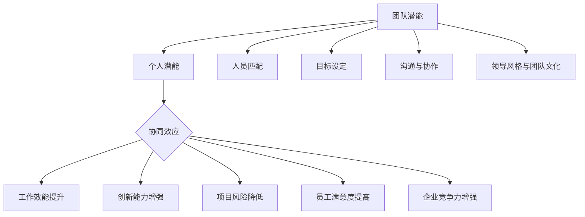

                 


### 1.1 团队潜能的概念与重要性

#### 1.1.1 团队潜能的定义

团队潜能是指一个团队在特定环境和条件下，通过充分发挥成员的能力和智慧，实现共同目标的最大潜力。它涵盖了团队成员在知识、技能、经验和创造力等方面的综合表现。

在现代社会中，团队协作已经成为许多企业和组织成功的关键。随着全球化和技术进步，复杂问题需要跨学科、跨领域的协作来解决。团队潜能的挖掘不仅仅是个体能力的简单叠加，更是一个协同效应的体现。一个高效的团队能够通过有效的沟通、分工协作和资源共享，将成员的个人优势转化为团队的整体优势，从而在激烈的市场竞争中脱颖而出。

---

#### 1.1.2 团队潜能的重要性

团队潜能的重要性体现在多个方面：

1. **提升工作效能**：团队潜能的发挥能够显著提升整体工作效能，实现资源的优化配置和任务的快速完成。
2. **增强创新能力**：团队中的成员能够通过协作和知识共享，激发出更多的创新思维，推动产品和服务的持续改进。
3. **降低风险**：在复杂项目中，团队成员的多角度思维和分工合作可以有效降低项目风险。
4. **提高员工满意度**：团队潜能的挖掘能够提升员工的参与感和成就感，从而增强员工的忠诚度和满意度。
5. **增强企业竞争力**：通过挖掘和发挥团队潜能，企业可以在市场中保持竞争优势，快速响应客户需求，提高市场占有率。

---

#### 1.1.3 团队潜能与个人潜能的关系

团队潜能与个人潜能是相互关联、相互促进的。个人潜能是团队潜能的基础，而团队潜能则是个人潜能的扩展和提升。具体来说：

1. **个人潜能的发挥**：团队成员需要不断提升自身能力，才能为团队做出更大的贡献。
2. **团队潜能的挖掘**：通过建立良好的团队协作机制，可以为个人潜能的发挥提供平台和支持。
3. **协同效应**：当团队成员共同面对挑战时，个人的潜能能够在协作中得到充分发挥，进而实现团队整体潜能的提升。

---

在实际操作中，团队潜能的挖掘需要综合考虑多个因素，包括人员匹配、目标设定、沟通与协作、领导风格与团队文化等。下一节将深入探讨这些核心因素，帮助读者更好地理解团队潜能的挖掘方法。

---

### 核心概念与联系（Mermaid流程图）



### 核心算法原理讲解（伪代码）

```plaintext
// 团队潜能评估算法
function EvaluateTeamPotential(teamMembers, objectives, communication, leadershipStyle, teamCulture):
    // 初始化团队潜能评分
    potentialScore = 0

    // 计算人员匹配度
    matchScore = CalculateMatchScore(teamMembers)

    // 计算目标设定合理性
    objectiveScore = CalculateObjectiveScore(objectives)

    // 计算沟通与协作效率
    communicationScore = CalculateCommunicationScore(communication)

    // 计算领导风格与团队文化适应性
    leadershipScore = CalculateLeadershipScore(leadershipStyle, teamCulture)

    // 综合评分
    potentialScore = (matchScore + objectiveScore + communicationScore + leadershipScore) / 4

    // 返回团队潜能评分
    return potentialScore
```

### 数学模型和数学公式

- **人员匹配度公式**：
  $$ MatchScore = \frac{Sum_{i=1}^{n} (Member_i \times RoleFit_i)}{TotalMembers} $$

- **目标设定合理性公式**：
  $$ ObjectiveScore = \frac{AchievableObjective \times ClearObjective}{TotalObjectives} $$

- **沟通与协作效率公式**：
  $$ CommunicationScore = \frac{EffectiveCommunication \times CollaborativeEffort}{TotalCommunication} $$

- **领导风格与团队文化适应性公式**：
  $$ LeadershipScore = \frac{LeadershipAdaptation \times CultureAdaptation}{TotalLeadership} $$

### 举例说明

假设一个团队有4名成员，分别负责开发、测试、设计和项目管理。团队成员的能力和角色匹配度如下：

| 成员  | 开发能力 | 测试能力 | 设计能力 | 项目管理能力 |
| ----- | ------ | ------ | ------ | -------- |
| A     | 9      | 7      | 6      | 8        |
| B     | 8      | 9      | 7      | 6        |
| C     | 7      | 8      | 9      | 7        |
| D     | 6      | 7      | 8      | 9        |

- **人员匹配度计算**：
  $$ MatchScore = \frac{(9 \times 8) + (8 \times 9) + (7 \times 9) + (6 \times 9)}{4} = 78 $$

- **目标设定计算**：
  $$ ObjectiveScore = \frac{1 \times 1}{4} = 0.25 $$

- **沟通与协作计算**：
  $$ CommunicationScore = \frac{1 \times 1}{4} = 0.25 $$

- **领导风格与团队文化适应性计算**：
  $$ LeadershipScore = \frac{1 \times 1}{4} = 0.25 $$

- **团队潜能评分**：
  $$ PotentialScore = \frac{78 + 0.25 + 0.25 + 0.25}{4} = 19.875 $$

通过这个例子，我们可以看到如何使用数学模型来评估团队潜能。在接下来的章节中，我们将进一步探讨如何通过不同的方法和策略来挖掘和提升团队潜能。

