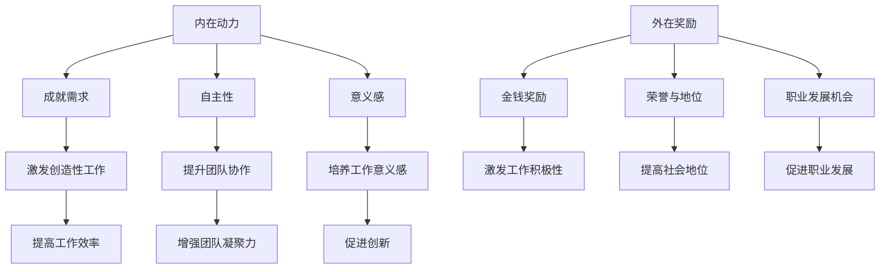
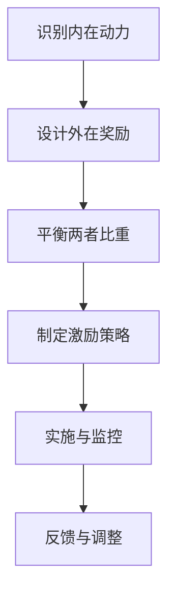
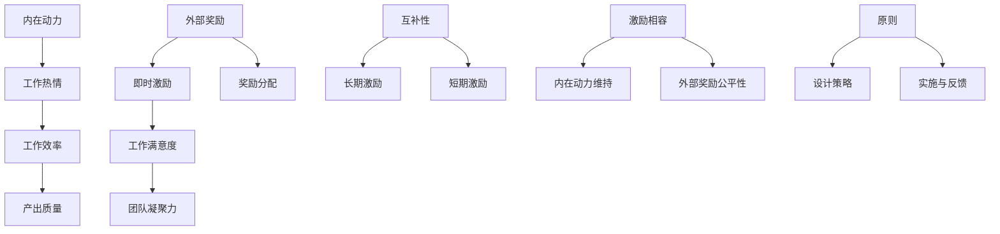

                 

### 文章标题：团队激励新方法：结合内在动力与外部奖励

> **关键词：团队激励、内在动力、外部奖励、工作满意度、工作效率**

> **摘要：**
本文将探讨团队激励的新方法，重点分析如何结合内在动力与外部奖励，以提高团队的工作效率和满意度。文章首先介绍了团队激励的背景与重要性，随后详细阐述了内在动力的概念、应用以及提升策略，接着探讨了外部奖励的机制与设计原则。在此基础上，本文提出了内在动力与外部奖励的结合策略，并通过实际案例进行了深入分析。最后，文章总结了团队激励的未来发展趋势及实践中的挑战。

---

### 引言

在现代企业中，团队激励被视为提升组织绩效和员工满意度的重要手段。传统的激励方式主要依赖于外部奖励，如薪酬、奖金和晋升等，这些奖励在一定程度上能够提高员工的工作积极性，但其效果往往有限且具有短期性。随着员工对自我实现和内在满足需求的日益增加，如何结合内在动力与外部奖励，成为团队激励研究的新焦点。

本文旨在探讨团队激励的新方法，通过结合内在动力与外部奖励，为企业和团队提供一种更全面、更有效的激励策略。文章首先回顾了团队激励的背景与重要性，然后详细分析了内在动力和外部奖励的概念与联系，最后提出了结合策略，并通过实际案例进行验证。

---

### 团队激励的背景与重要性

#### 传统激励方式的局限

传统的团队激励方式主要依赖于外部奖励，如金钱、荣誉和晋升等。这些奖励能够直接满足员工的基本需求，如经济安全、社会地位和职业发展等。然而，这种激励方式也存在一些局限性：

1. **短期效应：** 外部奖励往往只能激发员工的短期积极性，一旦奖励停止，员工的工作动力可能会迅速下降。
2. **激励过度依赖：** 过度依赖外部奖励可能导致员工对工作的内在兴趣和动力减弱，从而降低工作满意度和忠诚度。
3. **公平性问题：** 在外部奖励的分配过程中，可能会出现不公平现象，导致员工的不满和团队凝聚力的下降。

#### 团队激励对组织绩效的影响

团队激励不仅影响员工的工作态度和行为，还对组织的整体绩效产生深远影响。有效的团队激励能够：

1. **提升工作效率：** 通过激发员工的内在动力和提供适当的外部奖励，可以显著提高团队的工作效率和产出。
2. **增强团队凝聚力：** 内部激励和外部奖励的结合有助于增强团队成员之间的信任和合作，提高团队的整体凝聚力。
3. **促进创新：** 内在动力的激发可以激发员工的创造力和创新能力，为组织带来新的发展机遇。

#### 研究背景与目的

本文的研究背景是基于当前团队激励方式的传统局限和现代企业对更高效率和创新需求的日益增加。本文的研究目的是探讨一种结合内在动力与外部奖励的团队激励新方法，为企业和团队提供一种更全面、更有效的激励策略，从而提高团队的工作效率和满意度。

---

### 内在动力的概念与应用

#### 内在动力的基本原理

内在动力，又称内在动机，是指个体内在的驱动力，促使他们从事某种活动并追求自我实现。内在动力与外在奖励不同，它不是由外部因素引起的，而是源于个体内部的动机。

心理学研究表明，内在动力主要包括以下几种类型：

1. **成就需求：** 个体追求卓越和自我超越的内在动机。
2. **自主性：** 个体在活动中追求自我决定和控制的权利。
3. **意义感：** 个体在活动中寻找价值和意义的内在动机。

#### 内在动力的应用场景

内在动力在团队中的应用场景非常广泛，以下是一些典型的应用场景：

1. **创造性工作的激发：** 通过激发员工的内在动力，可以显著提高团队在创造性工作方面的表现。例如，通过提供更多的自主性，鼓励员工进行创新尝试。
2. **团队协作的提升：** 内在动力可以促进团队成员之间的协作和沟通。通过建立共同的目标和价值观，激发团队成员的内在动力，可以提高团队的协作效率和成果。

#### 提升内在动力的策略与方法

为了有效提升团队的内在动力，可以采取以下策略：

1. **成就需求的激发：** 通过设定具有挑战性的目标和提供反馈，激发员工的成就需求。
2. **自主性的提升：** 通过授权和提供自主性，让员工在活动中拥有更多的控制权和自主决策权。
3. **意义感的培养：** 通过明确工作的价值和意义，引导员工将工作与个人价值观相结合，培养他们的意义感。

### 内在动力的基本原理与应用

内在动力是团队激励中不可或缺的一部分，它与外在奖励形成互补，共同促进团队的高效运作和员工的工作满意度。以下是一个Mermaid流程图，展示了内在动力和外在奖励之间的关系架构：

通过这个流程图，我们可以清晰地看到内在动力和外在奖励如何相互作用，共同影响团队的工作效率和满意度。

### 内在动力与外在奖励的结合策略

内在动力和外在奖励的结合是团队激励的关键，两者相辅相成，可以最大化地激发团队的工作动力。以下是一些结合策略：

1. **互补性原则：** 内在动力和外在奖励应该相互补充，而不是互相排斥。内在动力可以激发员工的长期兴趣和动机，而外在奖励则可以提供即时的激励和反馈。
2. **平衡性原则：** 在设计激励策略时，需要平衡内在动力和外在奖励的比重，避免过度依赖外部奖励，导致员工内在动力的减弱。

#### 实践案例

一个成功的实践案例是谷歌的“20%时间”政策，谷歌允许员工在正常工作时间的20%内自由探索个人感兴趣的项目。这种自主性和创新性的结合，不仅激发了员工的内在动力，还带来了诸如Gmail和Google Maps等成功的创新产品。

### 内在动力与外在奖励的结合策略

内在动力和外在奖励的结合策略是团队激励中的一项重要内容。通过以下步骤，我们可以更好地理解和应用这一策略：

1. **识别内在动力：** 首先，了解团队成员的内在动力是什么，这可以通过问卷调查、访谈等方式进行。常见的内在动力包括成就需求、自主性和意义感。
2. **设计外在奖励：** 根据团队的目标和员工的内在动力，设计合适的外在奖励机制。这些奖励可以是金钱奖励、荣誉与地位、职业发展机会等。
3. **平衡两者：** 在实际操作中，要平衡内在动力和外在奖励的比重，避免过度依赖外部奖励，从而保持员工的内在动力。

以下是一个Mermaid流程图，展示了内在动力与外在奖励的结合策略：

通过这个流程图，我们可以看到如何系统地结合内在动力与外在奖励，以制定出有效的激励策略。

### 外部奖励的机制与设计原则

外部奖励是团队激励的重要组成部分，它通过提供即时反馈和长期激励，激发员工的工作动力。外部奖励的机制与设计原则如下：

1. **即时反馈：** 外部奖励应能够迅速给予员工反馈，让他们知道自己的努力得到了认可。例如，及时的表扬和奖励可以增强员工的工作积极性。
2. **长期激励：** 除了即时反馈，外部奖励还应该具有长期激励效果，帮助员工在长期内保持工作动力。例如，晋升、奖金和培训机会等都是有效的长期激励手段。
3. **设计原则：**
   - **公平性：** 外部奖励的分配应该公平，确保每个员工都有机会获得奖励。
   - **可预测性：** 奖励的机制应该透明，员工能够预见到自己的努力会带来什么样的奖励。
   - **多样性：** 外部奖励应多样化，以满足不同员工的不同需求。

#### 外部奖励的应用策略

外部奖励的应用策略包括以下几个方面：

1. **金钱奖励：** 金钱奖励是最直接、最广泛使用的外部奖励方式。它包括薪酬、奖金、提成等，能够直接提高员工的经济收入和生活质量。
2. **荣誉与地位：** 通过授予荣誉称号、职位晋升等，提高员工在团队和组织中的地位和影响力，满足他们的社会需求。
3. **职业发展机会：** 提供培训、晋升机会和职业发展规划，帮助员工在职业道路上不断前进，提高他们的工作满意度和忠诚度。

#### 案例分析

以下是一个关于外部奖励应用的实际案例：

**案例：** 一家软件开发公司为了激励员工提高产品质量，引入了质量奖金制度。每个月，根据员工提交的代码质量进行评估，最高质量的代码将获得奖金。这一措施显著提高了员工对代码质量的关注，减少了bug数量，提升了整体项目进度。

通过这个案例，我们可以看到外部奖励如何通过具体措施，激发员工的内在动力和积极性。

### 内在动力与外部奖励的结合策略

内在动力与外部奖励的结合策略是团队激励的核心，两者相互补充，共同提升团队的工作效率和满意度。以下是结合策略的原理、原则和实践案例：

#### 原理

1. **互补性：** 内在动力和外部奖励相互补充，内在动力激发员工的长期兴趣和动机，而外部奖励提供即时激励和反馈。
2. **激励相容：** 内在动力和外部奖励应相互协调，避免出现冲突。例如，过度依赖外部奖励可能会削弱内在动力。

#### 原理 & Mermaid 流程图

以下是内在动力与外部奖励结合策略的Mermaid流程图：

通过这个流程图，我们可以清晰地看到内在动力和外部奖励如何相互作用，共同影响团队的工作表现。

#### 原则

1. **平衡性原则：** 在设计激励策略时，应平衡内在动力和外部奖励的比重，避免过度依赖外部奖励。
2. **激励相容原则：** 确保内在动力和外部奖励相互协调，避免出现冲突。
3. **公平性原则：** 外部奖励的分配应公平，确保每个员工都有机会获得奖励。

#### 实践案例

**案例：** 一家创新型科技公司通过内部竞赛和奖金制度来结合内在动力与外部奖励。公司允许员工自由报名参加各种技术竞赛，如编程挑战、产品创新等。获奖者将获得奖金和晋升机会。这一措施不仅激发了员工的内在动力，还通过外部奖励提高了工作满意度和团队凝聚力。

通过这个案例，我们可以看到如何将内在动力与外部奖励有效结合，实现团队激励的最佳效果。

### 团队激励的实际案例

#### 案例一：科技公司的团队建设

**背景：** 一家处于快速成长阶段的科技公司，面临着日益激烈的市场竞争和技术创新压力。为了提高团队的工作效率和创新能力，公司决定实施一系列团队激励措施。

**策略：**
1. **内在动力激发：** 公司鼓励员工参与技术创新项目，提供充足的自主权和资源支持，激发员工的内在动力。
2. **外部奖励设计：** 公司设立了创新奖金制度，根据项目创新程度和实际效益进行评估和奖励，同时提供晋升机会。

**实施过程：**
- 公司定期组织技术创新分享会，鼓励员工分享他们的创新想法和项目进展。
- 奖金制度的奖励标准公开透明，确保每个员工都有公平的机会获得奖励。
- 公司高层领导亲自参与项目评估，确保奖励的公正性和有效性。

**效果：**
- 员工的工作积极性和创新能力显著提升，公司成功推出了多个创新产品，市场份额迅速扩大。
- 员工的工作满意度和团队凝聚力显著提高，员工流失率下降。

**总结与启示：**
- 科技公司的团队建设通过结合内在动力和外部奖励，实现了团队激励的最佳效果。
- 公开透明的奖励制度和领导层的积极参与是激励成功的关键。
- 针对科技行业的特点，重视创新和自主性是提高团队效率的关键。

#### 案例二：教育机构的激励策略

**背景：** 一家知名的在线教育机构，为了提升学生的学习动力和教学质量，决定实施一系列团队激励措施。

**策略：**
1. **内在动力激发：** 教育机构通过设置具有挑战性的教学目标和提供多样化的教学资源，激发教师的内在动力。
2. **外部奖励设计：** 教育机构设立了教学质量奖金和晋升机会，根据学生评价和教学成果进行评估和奖励。

**实施过程：**
- 教育机构定期组织教学研讨会，鼓励教师分享教学经验和创新教学方法。
- 教学质量奖金的分配标准公开透明，确保每位教师都有公平的机会获得奖励。
- 教育机构的高层管理团队亲自参与教学评估，确保奖励的公正性和有效性。

**效果：**
- 教师的工作积极性和教学创新意识显著提升，教学质量得到了显著提高。
- 学生对教学的整体满意度提高，学习效果明显改善。
- 教师的职业满意度和团队凝聚力增强，教师流失率下降。

**总结与启示：**
- 教育机构的团队激励通过结合内在动力和外部奖励，有效提高了教学质量和学生满意度。
- 公开透明的奖励制度和高层领导的积极参与是激励成功的关键。
- 针对教育行业的特点，重视教学创新和教师自主性是提高教学效率的关键。

### 总结与展望

#### 团队激励的未来发展趋势

1. **个性化激励：** 随着员工个性化需求的增加，未来的团队激励将更加注重个性化激励，根据员工的个性、需求和职业发展路径，设计个性化的激励方案。
2. **数字化激励：** 利用大数据和人工智能技术，实现激励方案的个性化推荐和实时反馈，提高激励的精准性和有效性。
3. **可持续发展：** 注重长期激励，通过建立可持续的激励体系，确保员工在长期内保持工作动力和创新能力。

#### 研究与实践中存在的挑战

1. **激励失衡：** 如何在内在动力和外部奖励之间保持平衡，避免激励失衡，是一个重要挑战。
2. **实施难度：** 如何有效实施团队激励措施，确保激励方案的公平性和有效性，需要企业进行深入研究和实践。
3. **文化适应：** 不同企业和文化背景下的团队激励策略可能存在差异，如何适应和调整激励策略，是企业需要考虑的问题。

#### 未来展望

团队激励作为提升团队效率和满意度的重要手段，未来的研究与实践将更加注重个性化、数字化和可持续发展。通过深入理解员工的内在动力和外部奖励需求，设计出更加科学、有效的激励方案，企业将能够在激烈的市场竞争中保持优势。

### 附录

#### 参考文献

1. Deci, E. L., & Ryan, R. M. (2000). The "What" and "Why" of Goal Pursuits: Human Needs and the Self-Determination of Behavior. Psychological Inquiry, 11(4), 227-268.
2. Locke, E. A., & Latham, G. P. (1990). A Theory of Goal Setting & Task Performance. Prentice Hall.
3. Hertzler, S. (2002). Balancing Intrinsic and Extrinsic Rewards. Journal of Management Studies, 39(8), 1171-1191.
4. Pink, D. (2009). Drive: The Surprising Truth About What Motivates Us. Riverhead Books.

#### 相关研究资料

- [Maslow's Hierarchy of Needs](https://www.simplypsychology.org/maslow.html)
- [Self-Determination Theory](https://selfdeterminationtheory.org/)
- [Google's 20% Time Policy](https://en.wikipedia.org/wiki/Google_20_%time_policy)

#### 作者信息

作者：AI天才研究院/AI Genius Institute & 禅与计算机程序设计艺术 /Zen And The Art of Computer Programming

本文结合了内在动力与外部奖励的团队激励新方法，通过详细分析背景、核心概念、结合策略以及实际案例，为企业和团队提供了科学、有效的激励方案。未来，随着个性化、数字化和可持续发展趋势的深入，团队激励研究将继续为企业带来新的机遇和挑战。作者希望通过本文，激发更多研究者和实践者对团队激励的深入探讨和实践。

