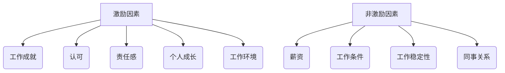
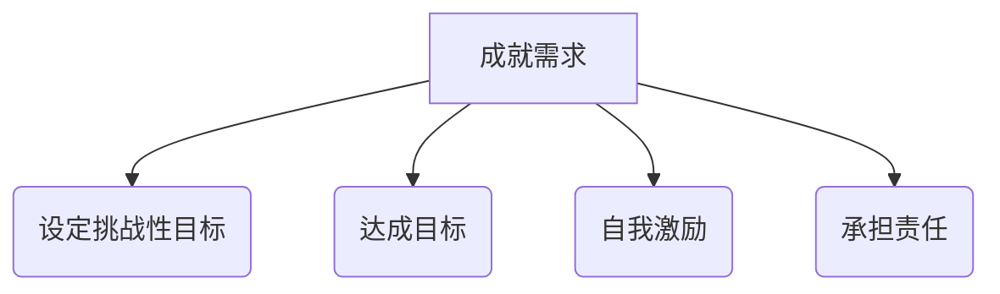

                 

### 引言

在现代企业竞争中，团队的重要性日益凸显。一个高效的团队不仅能够提升企业的整体竞争力，还能够创造出更大的价值。然而，如何激发团队中每个成员的最大潜能，实现团队的高效协作，成为一个亟待解决的关键问题。本文将以《团队激励：如何激发员工的最大潜能》为题，探讨团队激励的核心概念、心理学基础、核心原理以及实践应用，并通过案例分析、策略设计等多方面，为团队管理者提供有效的团队激励方法和策略。

首先，我们需要明确什么是团队激励。团队激励是指通过一定的手段和方式，激发团队成员的工作热情和创造力，提升团队的整体效率和绩效。在这个过程中，管理者需要了解员工的需求和心理，运用心理学理论，设计出合理的激励策略。接下来，我们将从以下几个方面展开讨论：

1. **团队激励的定义与意义**：介绍团队激励的定义，阐述其在企业管理中的重要性，明确团队激励的目标。

2. **团队激励的心理学基础**：分析动机心理学理论、自我决定理论和员工需求理论，探讨这些理论在团队激励中的应用。

3. **团队激励的核心原理**：讲解动机与行为的关系、激励因素与非激励因素，以及不同激励模型的特点和适用场景。

4. **团队激励的实践应用**：讨论绩效激励策略、荣誉与认可机制以及团队建设活动，提供具体案例和实施步骤。

5. **激励的适度性与个性化**：探讨激励的适度性原则，介绍个性化激励策略，分析不同文化背景下的激励方式。

6. **团队激励的挑战与应对**：分析领导者激励能力的培养、激励机制的公平性以及员工激励的长期效应。

7. **成功团队激励案例分析**：通过谷歌、特斯拉、小米等企业的成功案例，探讨团队激励的有效策略。

8. **团队激励的误区与纠正**：分析常见激励误区，提供纠正策略。

9. **团队激励策略设计方法论**：介绍激励需求评估、激励策略制定和激励效果评估的方法。

10. **跨文化团队激励策略**：讨论跨文化团队的特点、激励挑战和策略。

11. **未来团队激励的趋势**：分析科技对团队激励的影响，探讨新型工作方式下的激励方法。

通过上述分析，我们将逐步揭示团队激励的内在逻辑和实际应用，帮助读者更好地理解和应用团队激励策略，激发员工的最大潜能，提升团队的整体竞争力。

---

### 文章关键词

**1. 团队激励**  
**2. 员工潜能**  
**3. 心理学理论**  
**4. 绩效激励**  
**5. 荣誉与认可机制**  
**6. 团队建设活动**  
**7. 领导者激励能力**  
**8. 文化背景**

---

### 文章摘要

本文旨在探讨团队激励的核心概念和实际应用，通过分析动机心理学理论、自我决定理论和员工需求理论，明确团队激励的定义和目标。文章从实践角度出发，详细介绍了绩效激励策略、荣誉与认可机制以及团队建设活动等具体手段，并通过案例分析展示了成功团队激励的策略。同时，文章也探讨了激励的适度性原则、个性化激励策略以及不同文化背景下的激励方式。通过本文的阅读，读者将能够掌握有效的团队激励方法，提升团队整体效率和绩效，激发员工的最大潜能。文章最后对团队激励的未来趋势进行了展望，为企业的长远发展提供了有益的参考。

---

### 第一部分：团队激励理论探索

#### 第1章：团队激励的定义与意义

团队激励在企业管理中扮演着至关重要的角色。为了更好地理解这一概念，首先需要明确团队激励的定义及其在企业管理中的重要性。

**1. 团队激励的定义**

团队激励是指通过特定的手段和方式，激发团队成员的工作热情、创造力和积极性，从而提高团队整体效率和绩效的过程。这些手段和方式可以包括物质激励、精神激励、荣誉与认可、团队建设活动等。

团队激励不仅仅是给予员工奖励和惩罚，更重要的是要激发员工内心的动力，使其愿意主动付出更多努力，为企业的发展贡献力量。因此，团队激励的核心在于理解员工的需求和心理，从而设计出符合员工期望的激励措施。

**2. 团队激励的重要性**

在竞争日益激烈的市场环境中，企业要想取得竞争优势，必须依赖高效的团队。而一个高效的团队离不开有效的团队激励。以下是团队激励在企业中具有重要意义的原因：

1. **提升员工工作效率**：通过激励措施，可以激发员工的工作热情和积极性，使其更加专注和投入工作，从而提高工作效率。

2. **增强团队凝聚力**：有效的激励可以增强团队成员之间的协作和信任，提高团队的整体凝聚力，减少内部冲突。

3. **促进创新与创造力**：团队激励可以激发员工的创造力，鼓励员工提出新的想法和解决方案，推动企业创新。

4. **提升企业绩效**：团队激励能够提高整个团队的工作效率和质量，从而提升企业的整体绩效。

5. **降低员工流失率**：通过有效的激励措施，可以增强员工的归属感和忠诚度，降低员工流失率，减少企业的招聘和培训成本。

**3. 团队激励的目标**

团队激励的目标可以分为短期目标和长期目标：

1. **短期目标**：提高员工的工作效率、满意度和绩效。通过及时的奖励和反馈，让员工感受到自己的努力得到了认可和回报，从而激发其工作积极性。

2. **长期目标**：培养员工的忠诚度和长期投入，提升企业的核心竞争力。通过建立长期激励机制，让员工看到企业在未来的发展前景，愿意与企业共同成长。

总之，团队激励不仅仅是企业管理的一种手段，更是一种文化和价值观的体现。只有真正理解员工的需求，运用科学的激励理论，才能设计出有效的激励策略，激发员工的最大潜能，实现团队的高效协作。

#### 第2章：团队激励的心理学基础

团队激励的成功离不开对心理学理论的理解和应用。动机心理学、自我决定理论和员工需求理论是团队激励中不可或缺的心理学基础，这些理论为我们提供了深刻的洞见，帮助我们更好地理解员工的内在动力，从而设计出有效的激励措施。

**1. 动机心理学理论**

动机心理学理论是研究个体行为背后动机和动力的科学。其中，最具代表性的理论包括马斯洛的需求层次理论和赫茨伯格的双因素理论。

**1.1 马斯洛的需求层次理论**

马斯洛的需求层次理论认为，人的需求可以分为五个层次：生理需求、安全需求、社交需求、尊重需求和自我实现需求。这些需求从生理层面到自我实现层面，构成了一个金字塔结构。

- **生理需求**：包括食物、水、睡眠等基本生理需求。在团队激励中，管理者需要确保员工的基本生活条件得到满足，从而降低员工的压力和焦虑。

- **安全需求**：包括安全感、稳定性和健康保障。在团队激励中，管理者可以通过提供良好的工作环境、保险福利和职业规划来满足员工的安全需求。

- **社交需求**：包括归属感、友情和社交关系。在团队激励中，管理者可以通过团队建设活动、团队聚餐和员工互助计划来增强员工的社交需求。

- **尊重需求**：包括自尊、成就和认可。在团队激励中，管理者可以通过表彰、奖励和晋升机会来满足员工的尊重需求。

- **自我实现需求**：包括自我价值的实现、个人成长和自我实现。在团队激励中，管理者可以通过提供挑战性的工作、培训和发展机会来满足员工的自我实现需求。

**1.2 赫茨伯格的双因素理论**

赫茨伯格的双因素理论认为，工作满意度由两种因素决定：激励因素和保健因素。激励因素与工作本身的性质有关，如成就感、认可和责任感；而保健因素与工作环境有关，如薪资、工作条件和人际关系。

- **激励因素**：这些因素能够直接提高员工的工作满意度，从而激发员工的内在动力。例如，一个富有挑战性的项目、一次公开的表彰或者一个具有挑战性的职位。

- **保健因素**：这些因素如果不足，会导致员工的不满意，但如果得到满足，则只能防止员工的不满意，而不能提高其工作满意度。例如，合理的薪资、良好的工作条件和融洽的同事关系。

**2. 自我决定理论**

自我决定理论由德西和瑞恩提出，强调个体在动机和自我决定方面的自主性。自我决定理论认为，人们在做决策和行动时，主要受以下三个基本需求的驱动：

- **自主性**：个体有自由做选择和做决定的需求。在团队激励中，管理者应该给予员工更多的自主权，让他们参与决策过程，从而增强其内在动机。

- **能力感**：个体有实现自己目标和能力的需求。在团队激励中，管理者可以通过设置合理的挑战和提供必要的资源来增强员工的能力感。

- **归属感**：个体有与他人建立联系和归属感的需求。在团队激励中，管理者可以通过团队活动和团队合作来增强员工的归属感。

**3. 员工需求理论**

员工需求理论关注员工在不同阶段的需求变化。其中，赫兹伯格的员工需求层次理论和麦格雷戈的X理论-Y理论是两个重要的模型。

- **赫兹伯格的员工需求层次理论**：与马斯洛的需求层次理论类似，赫兹伯格的员工需求层次理论将员工需求分为五个层次：生存需求、安全需求、社交需求、尊重需求和自我实现需求。

- **麦格雷戈的X理论-Y理论**：麦格雷戈提出了X理论-Y理论来解释员工的不同工作态度和行为。X理论认为员工天生懒惰，需要严格的管理和控制；而Y理论认为员工具有自我激励和自我管理的能力，管理者应鼓励员工的自主性和创造性。

**总结**

通过理解动机心理学理论、自我决定理论和员工需求理论，我们可以更深入地了解员工的内在动机和需求，从而设计出更有效的团队激励策略。这些心理学基础不仅有助于提升员工的工作满意度和绩效，还能够促进团队的整体协作和凝聚力。

#### 第3章：团队激励的核心原理

团队激励的核心原理是理解动机与行为之间的关系，以及如何通过激励因素和非激励因素来影响团队成员的工作表现。以下是团队激励的核心原理及其在企业管理中的具体应用。

**1. 动机与行为的关系**

动机是指驱使个体采取特定行为的内在力量。根据动机心理学理论，动机与行为之间存在密切的关系。当个体的内在动机被激发时，他们更有可能采取积极的行动，从而提高工作效率和绩效。

**1.1 自我决定理论**

自我决定理论指出，自主性、能力和归属感是激发员工内在动机的关键因素。当员工感受到自主性，认为自己在工作中有所作为，并感到与团队成员紧密联系时，他们的工作动机会显著增强。

**1.2 动机与绩效**

研究表明，高水平的内在动机与更高的工作绩效之间存在正相关关系。例如，员工在追求自我实现需求时，往往会表现出更高的创造力和解决问题的能力。管理者可以通过提供挑战性的任务、灵活的工作时间和开放式的沟通环境，来激发员工的内在动机。

**2. 激励因素与非激励因素**

在团队激励中，激励因素和非激励因素是两个关键概念。激励因素是指能够直接提高员工工作满意度和绩效的因素，而非激励因素则是指只能防止员工不满意，而不能提高其工作满意度的因素。

**2.1 激励因素**

激励因素通常与工作内容和工作环境相关。以下是一些常见的激励因素：

- **成就**：完成具有挑战性的任务并获得成就感能够激发员工的工作热情。
- **认可**：公开表彰和奖励能够增强员工的自尊和自豪感。
- **责任感**：赋予员工一定的责任和权力，能够提高他们的工作动力和投入度。
- **成长与发展**：提供培训和学习机会，帮助员工实现个人成长和职业发展。
- **工作环境**：一个舒适、安全且富有激励性的工作环境能够提高员工的工作满意度。

**2.2 非激励因素**

非激励因素通常与工作条件和组织政策相关。以下是一些常见的非激励因素：

- **薪资**：合理的薪资水平是员工的基本需求，但并不能直接提高工作满意度。
- **工作条件**：良好的工作条件，如舒适的办公环境和健康保障，能够防止员工的不满。
- **工作稳定性**：稳定的职位和工作环境能够减少员工的不确定性，提高安全感。
- **同事关系**：良好的同事关系和团队合作能够增强员工的归属感和满意度。

**3. 激励模型**

为了更好地理解和应用团队激励原理，管理者可以参考一些经典的激励模型，如赫茨伯格的双因素理论、麦克莱兰的成就需求理论等。

**3.1 赫茨伯格的双因素理论**

赫茨伯格的双因素理论将工作满意度和不满意度的因素分为激励因素和保健因素。激励因素能够直接提高工作满意度，而非激励因素只能防止不满意。

**3.2 麦克莱兰的成就需求理论**

麦克莱兰的成就需求理论认为，个体的成就需求是激励其工作行为的重要因素。高成就需求的人倾向于设定具有挑战性的目标，并愿意为达成目标付出努力。

**4. 团队激励的应用**

在实际管理中，团队激励的应用需要结合具体情况，综合考虑员工的个体差异和组织目标。以下是一些具体的团队激励策略：

- **个性化激励**：根据员工的个性和需求，设计个性化的激励方案。例如，对于注重成就的员工，可以提供具有挑战性的项目和奖励；对于注重成长的员工，可以提供培训和发展机会。

- **持续反馈**：通过定期的绩效评估和反馈，及时了解员工的工作表现和需求，调整激励措施，确保激励的持续性和有效性。

- **团队建设活动**：组织团队建设活动，增强员工之间的合作和信任，提高团队的凝聚力。例如，团队拓展训练、团队聚餐和团队旅行等。

- **荣誉与认可**：建立荣誉与认可机制，对员工的优秀表现进行公开表彰和奖励，增强员工的自尊和自豪感。

- **绩效奖励**：根据员工的绩效表现，提供奖金、晋升机会和其他形式的奖励，激励员工提高工作效率和质量。

通过理解动机与行为的关系，以及激励因素和非激励因素的作用，管理者可以设计出更有效的团队激励策略，激发员工的最大潜能，提升团队的整体绩效。

#### 第4章：团队激励的实践应用

在明确了团队激励的核心理论和原理后，如何将这些理论转化为具体的实践应用，成为管理者需要解决的关键问题。在本章中，我们将探讨几种常见的团队激励实践，包括绩效激励策略、荣誉与认可机制以及团队建设活动，并分析这些策略在实际应用中的有效性和实施步骤。

**1. 绩效激励策略**

绩效激励是团队激励中最常用的一种方法，通过设定明确的绩效目标和提供相应的奖励，激发员工的工作动力。以下是一些有效的绩效激励策略：

**1.1 设定明确的绩效目标**

明确的绩效目标是绩效激励的基础。管理者需要根据组织的目标和团队的工作任务，设定具体、可衡量的绩效指标。这些指标可以包括工作质量、工作效率、客户满意度等。

**1.2 提供灵活的奖励机制**

奖励机制可以是金钱的、物质的，也可以是精神的。金钱奖励包括奖金、股权激励等；物质奖励包括礼品、休假等；精神奖励包括表彰、荣誉称号等。管理者应根据员工的期望和组织的实际情况，设计多样化的奖励机制。

**1.3 定期评估和反馈**

绩效激励需要定期评估和反馈。管理者应建立定期的绩效评估机制，对员工的工作表现进行客观、公正的评价，并及时给予反馈。这样可以确保员工了解自己的工作表现，明确改进的方向。

**案例：谷歌的绩效激励策略**

谷歌以其独特的绩效激励策略而闻名。谷歌的OKR（目标与关键成果）体系是一个典型的绩效激励工具。通过OKR，员工和团队可以设定具体的、有挑战性的目标，并定期评估进展和成果。谷歌还提供丰富的奖励机制，如股票期权、奖金和晋升机会，激励员工不断追求卓越。

**2. 荣誉与认可机制**

荣誉与认可机制是一种重要的精神激励手段，能够增强员工的自尊和自豪感。以下是一些实施荣誉与认可机制的方法：

**2.1 设立公开的表彰制度**

设立公开的表彰制度，对员工的优秀表现进行公开表彰。这可以通过公司内部网站、员工大会、社交媒体等形式进行。公开的表彰不仅能够激励获奖员工，还能树立榜样，激励其他员工。

**2.2 设立荣誉奖项**

设立各种荣誉奖项，如年度优秀员工、优秀团队、最佳创新奖等，对在各个领域表现出色的员工进行表彰。荣誉奖项可以是实物的，也可以是证书、奖牌等形式。

**2.3 定期举办庆祝活动**

定期举办庆祝活动，如年度庆典、团队聚餐、团建活动等，庆祝团队的成就和员工的贡献。这些活动能够增强员工的归属感和团队凝聚力。

**案例：特斯拉的荣誉与认可机制**

特斯拉以其独特的荣誉与认可机制而著称。特斯拉的“SpaceX模式”强调员工的自豪感和主人翁精神。特斯拉每年都会举行“年度之星”评选活动，对在各个岗位上表现出色的员工进行表彰。此外，特斯拉还鼓励员工在社交媒体上分享自己的工作成就，增强员工的自信心和自豪感。

**3. 团队建设活动**

团队建设活动是一种有效的团队激励手段，通过增强员工之间的合作和信任，提高团队的整体效率。以下是一些常见的团队建设活动：

**3.1 团队拓展训练**

团队拓展训练是一种通过户外活动增强团队协作和信任感的活动。这些活动包括攀岩、绳索、定向越野等。通过这些活动，员工能够更好地理解团队合作的重要性，提高团队协作能力。

**3.2 团队聚餐**

团队聚餐是一种简单而有效的团队建设活动。通过共进晚餐，员工可以放松身心，增进彼此的了解，建立更紧密的关系。

**3.3 团建活动**

团建活动可以是各种形式，如户外旅行、主题晚会、运动会等。这些活动不仅能够增强员工的团队合作精神，还能提高员工的工作满意度和归属感。

**案例：小米的团建活动**

小米是一家以年轻人为主要员工群体的公司，其团建活动形式多样，包括年度旅游、团队拓展训练、主题晚会等。小米的团建活动不仅丰富了员工的业余生活，还增强了团队的凝聚力和合作精神。

**总结**

通过绩效激励、荣誉与认可机制和团队建设活动，管理者可以有效地激发员工的工作热情和创造力，提高团队的整体绩效。这些实践应用需要结合组织的实际情况和员工的需求，不断创新和完善，以实现团队激励的最佳效果。

#### 第5章：激励的适度性与个性化

在团队激励中，激励的适度性和个性化至关重要。适度的激励能够激发员工的工作热情，而个性化的激励则能够满足不同员工的需求，提高激励的效果。以下将探讨激励的适度性原则、个性化激励策略，并分析在不同文化背景下的激励方式。

**1. 激励的适度性原则**

激励的适度性原则是指激励措施的设计和实施应遵循适度、平衡的原则，避免过度激励或激励不足。

**1.1 避免过度激励**

过度激励可能会导致以下问题：

- **激励疲劳**：长期过度激励可能导致员工对奖励产生麻木，失去激励效果。
- **不公平感**：过度激励可能会导致员工之间产生不公平感，影响团队士气。
- **依赖性**：员工过度依赖外部激励，可能会削弱其内在动机。

为了避免过度激励，管理者应：

- **合理设置奖励标准**：奖励标准应合理，避免过高或过低，确保奖励能够真正激发员工的工作热情。
- **多样化激励手段**：结合物质激励和精神激励，避免单一激励手段的长期依赖。
- **定期调整激励策略**：根据员工的工作表现和需求，定期调整激励策略，保持激励的新鲜感和有效性。

**1.2 避免激励不足**

激励不足可能导致以下问题：

- **工作积极性下降**：员工缺乏动力，工作积极性不高。
- **员工流失**：激励不足可能导致员工感到不被重视，增加离职风险。

为了确保激励的适度性，管理者应：

- **关注员工需求**：了解员工在不同阶段的激励需求，设计个性化的激励方案。
- **及时反馈**：通过定期的绩效反馈，确保员工了解自己的工作表现和激励情况。
- **持续激励**：建立持续的激励机制，确保员工长期保持工作动力。

**2. 个性化激励策略**

个性化激励策略是根据员工的个性、需求和职业发展目标，设计差异化的激励方案。以下是一些常见的个性化激励策略：

**2.1 能力激励**

对于有较高能力需求的员工，可以提供挑战性的项目和任务，激发其潜力。例如，设置项目带头人、跨部门合作项目等。

**2.2 成就激励**

对于有较高成就需求的员工，可以通过设定具有挑战性的目标，并提供相应的奖励和认可，激发其追求卓越。例如，设立创新奖、最佳实践奖等。

**2.3 职业发展激励**

对于有较高职业发展需求的员工，可以提供培训、晋升机会和职业规划指导，帮助其实现职业成长。例如，开展内部培训、提供外部学习机会等。

**2.4 环境激励**

为员工提供一个良好的工作环境，如舒适的办公空间、健康的工作氛围等，能够提高员工的工作满意度和归属感。

**3. 不同文化背景下的激励方式**

不同的文化背景会影响员工对激励方式的需求和反应。以下是一些在不同文化背景下的激励策略：

**3.1 西方文化**

在西方文化中，员工通常重视个人成就和自我实现。因此，个人奖励、职业发展和创新激励是较为有效的激励方式。此外，透明、公正的管理风格和开放的文化氛围也能够提高员工的工作满意度。

**3.2 东方文化**

在东方文化中，员工通常重视团队合作、人际关系和长远发展。因此，团队奖励、荣誉与认可以及良好的工作环境是较为有效的激励方式。同时，尊重、信任和理解的管理风格也能够增强员工的归属感和忠诚度。

**4. 总结**

激励的适度性和个性化是团队激励中不可忽视的两个方面。适度的激励能够激发员工的工作热情，个性化的激励能够满足不同员工的需求，提高激励效果。管理者应根据组织的实际情况和员工的需求，设计适度、个性化的激励策略，以实现团队激励的最佳效果。

#### 第6章：团队激励的挑战与应对

在实施团队激励的过程中，管理者常常会遇到各种挑战。这些挑战可能源于领导者的激励能力、激励机制的公平性以及员工激励的长期效应等方面。本章节将探讨这些挑战，并提出相应的解决策略。

**1. 领导者激励能力的培养**

领导者的激励能力是团队激励成功的关键。一个缺乏激励能力的领导者可能无法有效地激发员工的工作热情和创造力。以下是一些培养领导者激励能力的策略：

**1.1 增强沟通能力**

有效的沟通是激励员工的基础。领导者应具备良好的沟通技巧，能够清晰表达期望、反馈员工的表现，并倾听员工的意见和建议。通过定期召开团队会议、一对一交流等方式，领导者可以与员工建立良好的沟通关系。

**1.2 提升同理心**

同理心是指领导者能够理解员工的感受和需求，站在员工的角度思考问题。通过培养同理心，领导者可以更好地激励员工，增强团队的凝聚力和信任感。

**1.3 强化激励技巧**

领导者应掌握各种激励技巧，如表扬、认可、奖励等。通过适时地运用这些技巧，领导者可以有效地激励员工，提高工作绩效。

**案例：谷歌的领导者激励策略**

谷歌以其卓越的领导者激励策略而闻名。谷歌的领导者通过设立“20%时间”政策，允许员工自由支配20%的工作时间用于自己感兴趣的项目。这种策略不仅激发了员工的创造力，还培养了领导者的激励能力。

**2. 激励机制的公平性**

公平性是激励机制的基石。不公平的激励机制可能导致员工的不满和信任危机，影响团队的整体绩效。以下是一些确保激励机制公平性的策略：

**2.1 公开透明的激励机制**

建立公开透明的激励机制，确保每位员工都清楚了解激励政策、评估标准和奖励方案。通过定期公示激励结果，增强员工对激励机制的信任。

**2.2 个性化激励机制**

根据员工的个性、能力和贡献，设计个性化的激励机制。避免“一刀切”的激励政策，确保每个员工都能获得公平的激励。

**2.3 多元化的评价标准**

建立多元化的评价标准，综合考虑员工的工作绩效、团队贡献、个人能力等多方面因素。避免单一的评价标准导致不公平现象。

**案例：亚马逊的公平激励机制**

亚马逊以其独特的公平激励机制而著称。亚马逊通过多个维度的绩效评估，确保每个员工都得到公平的评价和激励。此外，亚马逊还设立“员工反馈机制”，允许员工对激励政策和评估结果提出意见和建议，进一步确保激励机制的公平性。

**3. 员工激励的长期效应**

员工激励不仅是短期行为，更应考虑其长期效应。长期的员工激励有助于培养员工的忠诚度和归属感，提高企业的核心竞争力。以下是一些确保员工激励长期效应的策略：

**3.1 持续激励**

建立持续激励的机制，确保员工在长期工作中始终保持工作热情和动力。通过定期调整激励策略，保持激励的新鲜感和有效性。

**3.2 培养企业文化**

通过培养积极向上的企业文化，营造良好的工作氛围，增强员工的归属感和忠诚度。企业文化应强调团队合作、创新精神和共同目标。

**3.3 提供职业发展机会**

为员工提供职业发展机会，帮助他们在企业内部实现职业成长。通过设置晋升通道、提供培训和职业规划指导，激发员工的长期动力。

**案例：微软的职业发展激励策略**

微软通过一系列职业发展激励措施，确保员工在企业内部能够实现长期的职业成长。微软设立“内部招聘”制度，允许员工跨部门调动，提供多样化的职业发展机会。此外，微软还提供广泛的培训课程和职业发展指导，帮助员工不断提升自己的能力和竞争力。

**总结**

团队激励的实施过程中，管理者需要面对各种挑战。通过提升领导者的激励能力、确保激励机制的公平性以及关注员工激励的长期效应，管理者可以克服这些挑战，设计出有效的团队激励策略，激发员工的最大潜能，提升团队的整体绩效。

#### 第7章：成功团队激励案例分析

在探讨团队激励的实践应用时，成功的企业案例为我们提供了宝贵的经验和启示。本章节将分析谷歌、特斯拉和小米等企业的团队激励实践，了解这些企业是如何通过有效的激励策略激发员工潜能，实现团队的高效协作。

**1. 谷歌的团队激励实践**

谷歌以其独特的团队激励策略而著称，成为全球科技公司的标杆。谷歌的团队激励实践主要包括以下几个方面：

**1.1 绩效导向的激励机制**

谷歌的绩效导向激励机制通过OKR（目标与关键成果）体系实现。OKR体系要求员工和团队设定具体、有挑战性的目标，并定期评估进展和成果。这种机制不仅激励员工追求卓越，还促进了团队内部的透明和协作。

**1.2 丰富的奖励机制**

谷歌提供了多种奖励机制，包括股票期权、年终奖金、创新奖等。这些奖励不仅能够激励员工的工作积极性，还能吸引和留住顶尖人才。

**1.3 自由开放的办公环境**

谷歌的办公环境注重自由和开放，鼓励员工自由地表达想法和意见。这种环境有助于激发员工的创造力，提高团队的整体效率。

**2. 特斯拉的团队激励实践**

特斯拉以其独特的文化和技术创新而闻名，其团队激励实践同样具有独特之处：

**2.1 “SpaceX模式”**

特斯拉借鉴了其创始人埃隆·马斯克在SpaceX公司采用的“SpaceX模式”。这种模式强调员工的自主性和责任感，通过赋予员工更大的决策权和责任，激发其工作热情和创造力。

**2.2 激励性的团队建设**

特斯拉定期组织团队建设活动，如公司派对、户外探险等，增强员工之间的协作和信任。这些活动不仅丰富了员工的业余生活，还增强了团队的凝聚力。

**2.3 创新的工作方式**

特斯拉推崇创新的思维和工作方式，鼓励员工挑战现状，提出新的想法和解决方案。这种文化氛围激发了员工的创新潜力，推动了公司的持续发展。

**3. 小米的团队激励实践**

小米作为一家新兴科技企业，其团队激励实践也颇具特色：

**3.1 创新激励机制**

小米设立了一系列创新激励机制，如“创新奖”和“最佳实践奖”，鼓励员工提出新想法和改进措施。这种激励机制激发了员工的创新热情，提高了产品的质量和市场竞争力。

**3.2 团队建设活动**

小米定期组织团队建设活动，如团队旅行、团建游戏等，增强员工之间的沟通和协作。这些活动不仅丰富了员工的业余生活，还提高了团队的凝聚力。

**3.3 职业发展支持**

小米注重员工的职业发展，提供多样化的培训和学习机会，帮助员工提升技能和职业素养。这种支持措施不仅提高了员工的工作满意度，还增强了员工的忠诚度。

**总结**

通过分析谷歌、特斯拉和小米的团队激励实践，我们可以看到，成功的团队激励不仅依赖于具体的激励措施，还需要构建积极向上的企业文化，营造良好的工作氛围。这些企业通过设定明确的目标、提供丰富的奖励机制、鼓励创新和团队协作，成功激发了员工的最大潜能，实现了团队的高效协作和持续发展。这些经验对于其他企业来说具有很高的参考价值，可以帮助它们在团队激励方面取得更好的效果。

#### 第8章：团队激励的误区与纠正

在实施团队激励的过程中，管理者往往容易陷入一些误区，导致激励效果不佳，甚至产生负面影响。以下将分析几种常见的团队激励误区，并探讨如何纠正这些误区，提高激励的有效性。

**1. 误区一：重物质激励，轻精神激励**

许多企业在激励员工时，更倾向于采用物质激励，如奖金、福利等，而忽视了精神激励的重要性。这种做法可能导致以下问题：

- **员工满意度不高**：物质激励虽然能带来即时的满足，但长期依赖物质激励可能导致员工对工作本身产生厌倦，工作满意度降低。
- **缺乏内在动力**：过分依赖物质激励，可能会削弱员工的内在动机，使其在工作中缺乏自主性和创造力。

**纠正方法**：企业应平衡物质激励和精神激励，通过设立荣誉制度、公开表彰、团队建设活动等方式，增强员工的自尊和归属感，提高工作满意度。

**2. 误区二：一刀切，缺乏个性化**

一些企业在激励员工时采用“一刀切”的方式，认为统一的激励措施适用于所有员工。这种做法可能导致以下问题：

- **激励效果不佳**：不同员工有不同的激励需求，统一的激励措施可能无法满足所有人的需求，从而降低激励效果。
- **员工不满**：不公平的激励措施可能导致员工之间的矛盾和不满，影响团队凝聚力。

**纠正方法**：企业应根据员工的个性、需求和职业发展目标，设计个性化的激励方案。例如，对于注重成就的员工，可以提供具有挑战性的任务和晋升机会；对于注重成长的员工，可以提供培训和学习机会。

**3. 误区三：忽视长期激励，追求短期效果**

一些企业在激励员工时，过于追求短期效果，忽视了长期激励的重要性。这种做法可能导致以下问题：

- **员工流失率增加**：缺乏长期激励可能导致员工感到职业发展前景不明朗，增加离职风险。
- **企业核心竞争力下降**：长期激励不足可能导致员工缺乏长期投入，影响企业的核心竞争力。

**纠正方法**：企业应建立持续的激励机制，通过职业发展计划、长期奖励等方式，鼓励员工长期投入。同时，定期评估激励效果，及时调整激励策略。

**4. 误区四：过度竞争，忽视团队合作**

一些企业在激励员工时，过于强调个人竞争，忽视团队合作。这种做法可能导致以下问题：

- **团队凝聚力下降**：过度竞争可能导致员工之间的矛盾和冲突，降低团队的凝聚力。
- **创新力下降**：缺乏团队合作可能导致创新力的下降，影响企业的长远发展。

**纠正方法**：企业应平衡个人竞争和团队合作，通过设立团队奖励、团队建设活动等方式，增强员工的团队意识和合作精神。

**5. 误区五：激励频率过高，忽视适度性**

一些企业在激励员工时，过于频繁地实施激励措施。这种做法可能导致以下问题：

- **激励疲劳**：频繁的激励可能导致员工对激励产生麻木，失去激励效果。
- **激励成本增加**：频繁的激励措施会增加企业的激励成本，降低整体效益。

**纠正方法**：企业应遵循适度性原则，合理安排激励频率和力度，避免过度激励。

**总结**

团队激励是一项复杂的系统工程，管理者需要避免常见的误区，设计出合理、有效的激励方案。通过平衡物质激励与精神激励、个性化激励、长期激励与短期激励、个人竞争与团队合作，企业可以更好地激发员工的工作热情和创造力，实现团队的高效协作和持续发展。

#### 第9章：激励策略设计方法论

设计有效的团队激励策略是提升员工工作动力和绩效的关键。本章将介绍激励策略设计的方法论，包括激励需求评估、激励策略制定和激励效果评估，并详细解释每个步骤的实施方法和注意事项。

**1. 激励需求评估**

激励需求评估是设计激励策略的第一步，旨在了解员工的激励需求和期望。以下是具体的实施方法：

**1.1 使用问卷调查**

通过设计问卷调查，收集员工对各种激励手段的看法和需求。问卷可以涵盖薪资、福利、职业发展、工作环境、团队关系等多个方面。

**1.2 开展访谈**

与员工进行一对一的访谈，深入了解他们的个人需求和期望。访谈内容可以包括职业规划、工作挑战、团队协作等。

**1.3 分析数据**

对问卷调查和访谈结果进行数据分析和总结，识别出主要的激励需求和问题。可以使用统计分析工具，如Excel、SPSS等，对数据进行分析。

注意事项：

- **确保问卷和访谈问题的全面性和针对性**：避免漏掉关键问题，确保能够全面了解员工的激励需求。
- **保护员工隐私**：在收集和分析数据时，保护员工的隐私权，确保数据的安全性和保密性。

**2. 激励策略制定**

在了解员工的激励需求后，接下来需要制定具体的激励策略。以下是激励策略制定的具体步骤：

**2.1 设定激励目标**

根据组织的目标和员工的激励需求，设定明确的激励目标。这些目标应具有可衡量性和可达成性。

**2.2 设计激励方案**

结合不同的激励手段，设计具体的激励方案。这些方案可以包括物质激励（如奖金、股权激励）、精神激励（如荣誉称号、公开表彰）和职业发展激励（如培训、晋升机会）等。

**2.3 制定实施方案**

制定详细的实施方案，包括激励措施的执行时间、实施步骤、责任分配等。确保每个激励措施都有明确的实施计划和执行人。

注意事项：

- **确保激励方案的多样性和灵活性**：根据不同员工的激励需求，设计多样化的激励方案，确保每个员工都能找到适合自己的激励方式。
- **制定合理的激励标准**：确保激励标准公平、合理，避免激励过度或不足。

**3. 激励效果评估**

激励效果评估是激励策略设计的关键环节，旨在了解激励策略的实施效果。以下是激励效果评估的具体方法：

**3.1 定期评估**

通过定期的员工满意度调查和绩效评估，了解激励措施的实施效果。可以采用问卷调查、访谈、绩效考核等手段。

**3.2 数据分析**

对收集到的数据进行统计和分析，识别出激励措施的有效性和问题所在。可以使用数据分析工具，如Excel、SPSS等，对数据进行分析。

**3.3 反馈与调整**

根据评估结果，及时反馈给员工，并调整激励策略。确保激励措施能够持续有效地激励员工。

注意事项：

- **确保评估的客观性和公正性**：避免主观偏见，确保评估结果客观、公正。
- **持续改进激励策略**：根据评估结果，不断调整和优化激励策略，提高激励效果。

**总结**

有效的团队激励策略设计需要综合考虑员工的激励需求、组织的目标和实际情况。通过激励需求评估、激励策略制定和激励效果评估，管理者可以设计出科学、合理的激励方案，激发员工的最大潜能，提升团队的整体绩效。

#### 第10章：跨文化团队激励策略

在全球化日益发展的今天，企业面临的团队越来越多元化，跨文化团队的激励成为企业管理中的重要课题。跨文化团队由不同国籍、不同文化背景的员工组成，他们在价值观、沟通方式、工作习惯等方面存在差异。因此，制定有效的跨文化团队激励策略至关重要。

**1. 跨文化团队的特点**

跨文化团队具有以下几个特点：

**1.1 多元化**：跨文化团队由来自不同国家和地区的员工组成，他们具有不同的文化背景、价值观和语言。

**1.2 沟通障碍**：不同文化背景的员工在沟通方式、语言表达和沟通风格上存在差异，可能导致误解和沟通障碍。

**1.3 工作习惯差异**：跨文化团队中的员工在工作时间、工作节奏、工作方式等方面可能存在差异，需要调整和适应。

**1.4 冲突可能性增加**：不同文化背景的员工在价值观、工作方式等方面可能存在差异，容易引发冲突。

**2. 跨文化团队激励的挑战**

跨文化团队激励面临以下挑战：

**2.1 文化差异**：不同文化背景的员工对激励方式和激励内容的需求可能存在差异，需要制定多样化的激励策略。

**2.2 沟通障碍**：文化差异可能导致沟通障碍，影响激励策略的有效实施。

**2.3 工作习惯差异**：跨文化团队的工作习惯差异可能影响激励效果，需要制定针对性的激励策略。

**2.4 文化敏感性**：在跨文化团队中，管理者需要具备较高的文化敏感性，避免因文化差异而导致的误解和冲突。

**3. 跨文化激励策略**

为了有效激励跨文化团队，管理者可以采取以下策略：

**3.1 个性化激励**

根据不同文化背景的员工特点，设计个性化的激励方案。例如，对于重视个人成就的员工，可以提供具有挑战性的项目和晋升机会；对于注重团队合作的员工，可以设立团队奖励和团队建设活动。

**3.2 文化适应性激励**

尊重不同文化的价值观和工作习惯，制定文化适应性强的激励策略。例如，对于不同文化背景的员工，可以提供针对性的培训和学习机会，帮助他们更好地适应工作环境。

**3.3 沟通激励**

加强团队内部的沟通，建立有效的沟通渠道，确保激励信息能够准确传达。例如，定期召开跨文化团队会议，讨论工作进展和激励策略，促进团队成员之间的理解与合作。

**3.4 多元化奖励**

提供多元化的奖励方式，满足不同文化背景员工的激励需求。例如，可以结合物质奖励和精神奖励，设计具有文化特色的奖励方案。

**4. 跨文化激励案例分析**

**案例一：IBM的跨文化激励策略**

IBM作为一家全球性的企业，在跨文化团队激励方面具有丰富的经验。IBM采取了以下策略：

- **文化适应性培训**：为不同文化背景的员工提供文化适应性培训，帮助他们更好地理解其他文化，促进团队内部的沟通和协作。
- **个性化奖励**：根据员工的个人需求和职业发展目标，提供个性化的奖励和晋升机会。
- **多元化团队建设**：定期组织跨文化团队建设活动，如国际文化节、团队旅行等，增强团队的凝聚力。

**案例二：谷歌的跨文化激励策略**

谷歌在全球范围内拥有多个研发中心，其跨文化团队激励策略包括：

- **国际交流项目**：鼓励员工参与国际交流项目，如海外工作机会、跨国团队合作等，提升员工的文化适应能力和国际化视野。
- **多元化团队奖励**：设立多元化团队奖励，如国际团队奖、最佳国际合作奖等，激励员工跨文化合作。
- **文化包容性培训**：提供文化包容性培训，帮助员工理解和尊重不同文化，促进团队内部的和谐与合作。

**总结**

跨文化团队的激励需要充分考虑文化差异、沟通障碍和工作习惯差异。通过个性化激励、文化适应性激励、沟通激励和多元化奖励等策略，管理者可以有效地激发跨文化团队的工作热情和创造力，提升团队的整体绩效。

#### 第11章：未来团队激励的趋势

随着科技的发展和社会的变迁，团队激励的方式也在不断演进。未来团队激励将受到以下几方面趋势的影响：

**1. 科技对团队激励的影响**

**1.1 人工智能与大数据分析**

人工智能（AI）和大数据分析将在团队激励中发挥重要作用。通过分析员工的工作数据和行为模式，企业可以更精准地了解员工的激励需求，制定个性化的激励策略。例如，利用AI技术，企业可以预测员工的流失风险，提前采取留人措施。

**1.2 在线培训与虚拟现实（VR）**

在线培训平台和虚拟现实技术将改变员工的学习和发展方式。企业可以通过在线培训平台提供多样化的学习资源，满足员工的个性化学习需求。同时，VR技术可以模拟真实的工作场景，帮助员工在虚拟环境中提升技能，增强工作体验。

**2. 新型工作方式下的激励**

**2.1 弹性工作制与远程办公**

随着远程办公的普及，弹性工作制将成为未来团队激励的重要组成部分。企业可以通过灵活的工作安排，满足员工对工作与生活平衡的需求，提高员工的工作满意度和忠诚度。

**2.2 平台协作与自组织团队**

在未来，自组织团队和平台协作将成为主流。在这种模式下，员工具有更高的自主性和创造性，管理者需要通过激励措施激发团队的自主管理能力和创新潜力。例如，可以设立跨部门项目组，鼓励员工跨职能合作，推动创新。

**3. 持续激励与员工体验**

**3.1 持续反馈与认可**

未来团队激励将更加注重持续反馈和认可。通过实时反馈系统，管理者可以及时了解员工的工作表现，提供及时的鼓励和指导。同时，通过公开认可和表彰，增强员工的成就感和归属感。

**3.2 员工体验管理**

企业将更加关注员工的体验管理，通过打造积极的工作氛围、提供丰富的福利和职业发展机会，提升员工的整体体验。例如，设立员工体验官职位，专门负责关注和改善员工的工作体验。

**4. 激励的伦理与社会责任**

**4.1 伦理激励**

未来团队激励将更加注重伦理和社会责任。企业应通过公平、公正的激励措施，确保所有员工都能感受到尊重和公正。同时，企业可以通过道德培训和文化建设，提升员工的职业道德和社会责任感。

**4.2 社会责任激励**

企业将更加重视社会责任激励，通过支持社会公益、环保活动等，提升员工的社会价值感和归属感。例如，可以设立公益奖金，鼓励员工参与社会公益活动。

**总结**

未来团队激励将受到科技进步、新型工作方式和社会责任等多方面的影响。企业需要不断创新激励策略，结合科技手段和人文关怀，打造一个积极、公平、富有创造力的工作环境，激发员工的最大潜能，实现团队的高效协作和持续发展。

---

### 最佳实践 Tips、小结、注意事项

**最佳实践 Tips：**

1. **个性化激励**：针对不同员工的激励需求，设计个性化的激励方案，提高激励效果。
2. **持续反馈**：建立持续反馈机制，及时了解员工的工作表现和需求，调整激励策略。
3. **多元化奖励**：结合物质激励、精神激励和职业发展激励，满足员工的多样化需求。
4. **文化适应性**：在跨文化团队中，考虑文化差异，制定适应不同文化的激励策略。

**小结：**

本文从团队激励的定义、心理学基础、核心原理、实践应用等多个方面，系统地探讨了团队激励的重要性和方法。有效的团队激励能够提升员工的工作热情和创造力，增强团队的凝聚力和竞争力。

**注意事项：**

1. **避免过度激励**：确保激励措施适度，避免激励疲劳和依赖。
2. **公平性**：确保激励机制的公平性，避免员工产生不公平感。
3. **长期激励**：关注员工的长远发展，建立持续激励的机制。

**拓展阅读：**

1. **《动机与人格》**：赫尔伯特·西尔斯（Herbert J. Sears）
2. **《激励心理学》**：丹尼尔·戈尔曼（Daniel Goleman）
3. **《团队的智慧》**：兰迪·海恩斯（Randy Haynes）

---

### 文章作者信息

**作者：** AI天才研究院/AI Genius Institute & 禅与计算机程序设计艺术 /Zen And The Art of Computer Programming

