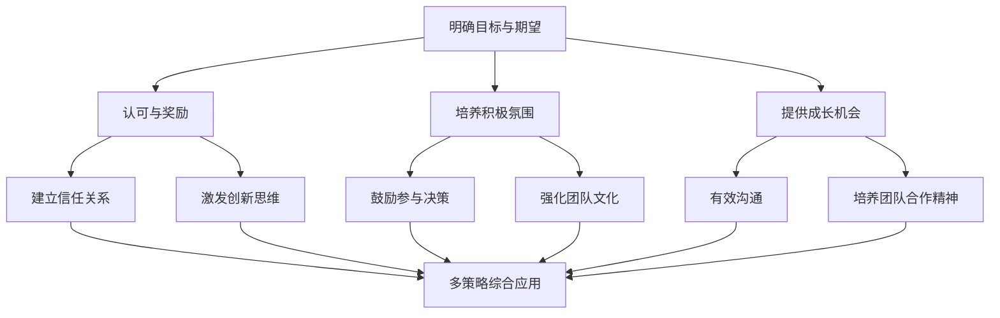

                 


### 文章标题

《团队激励：激发员工潜能的10大策略》

### 关键词

团队激励、员工潜能、管理策略、员工积极性、绩效提升

### 摘要

本文深入探讨了团队激励的概念及其在提升员工工作积极性、创造力和绩效中的重要作用。通过剖析10大核心策略，本文揭示了每种策略背后的管理心理学原理，并运用数学模型和实际案例进行详细讲解。旨在为企业管理者提供一套科学、系统的团队激励实践指南，帮助激发员工潜能，实现团队目标。

----------------------------------------------------------------

## 第1章：团队激励概述

### 1.1 团队激励的定义与重要性

团队激励是指在组织管理过程中，通过一系列措施激发团队成员的内在动力，提高他们的工作积极性、创造力和绩效水平，从而实现团队目标和组织愿景的过程。团队激励不仅关注个体的成长和满足，更强调团队整体的协作和发展。

在现代企业管理中，团队激励具有至关重要的地位。首先，随着知识经济的到来，员工的专业技能和创造力成为企业核心竞争力的重要组成部分。团队激励能够有效激发员工的潜能，提升团队整体绩效。其次，随着员工对工作环境、职业发展和个人价值的重视，单纯的物质激励已无法满足他们的需求，精神激励和成长激励成为关键因素。最后，团队激励有助于构建积极向上的团队文化，增强团队凝聚力和执行力，为组织的长期发展奠定基础。

### 1.2 团队激励的理论基础

团队激励的理论基础主要包括激励理论、团队动力学和心理学原理。激励理论为团队激励提供了基本框架，包括马斯洛的需求层次理论、赫兹伯格的双因素理论、维克托·弗鲁姆的期望理论等。这些理论揭示了人类行为的动机和驱动因素，为团队激励提供了指导。

团队动力学则关注团队内部的人际关系和互动，包括团队形成、发展、成熟和解散的过程。通过理解团队动力学，管理者可以更好地把握团队激励的时机和方式，促进团队协作和目标实现。

心理学原理则从人的心理层面分析团队激励的有效性，如心理契约、心理安全感、自我效能感等。这些原理有助于管理者制定更具针对性的激励策略，提高激励效果。

### 1.3 团队激励的10大策略概述

为了系统地探讨团队激励的策略，本文将介绍10大核心策略，包括：

1. **明确目标与期望**：通过设定明确的目标和期望，激发员工的内在动力。
2. **认可与奖励**：通过及时认可和奖励，增强员工的积极性和自信心。
3. **培养积极氛围**：营造积极向上的团队氛围，提升员工的归属感和工作满意度。
4. **提供成长机会**：为员工提供成长和发展机会，满足他们的职业发展需求。
5. **建立信任关系**：建立信任关系，促进团队成员之间的有效沟通和协作。
6. **激发创新思维**：鼓励创新思维，培养员工的创造力和问题解决能力。
7. **鼓励参与决策**：鼓励员工参与决策过程，增强他们的责任感和参与感。
8. **强化团队文化**：通过强化团队文化，提高团队成员的认同感和凝聚力。
9. **有效沟通**：建立有效的沟通机制，确保信息的及时传递和有效反馈。
10. **培养团队合作精神**：培养团队合作精神，提升团队的协作效率和目标实现能力。

这些策略相互关联，共同构成了一个完整的团队激励体系。在实际应用中，管理者可以根据团队特点和员工需求，灵活运用这些策略，实现团队激励的目标。

### 1.3.1 核心概念与联系

为了更好地理解团队激励的10大策略，我们可以通过Mermaid流程图来展示这些策略之间的联系和关系架构。以下是一个简化的Mermaid流程图：



在这个流程图中，每个节点代表一个策略，箭头表示策略之间的关联。可以看到，明确目标与期望是团队激励的基础，其他策略都是在此基础上展开的。同时，各个策略之间也存在相互促进的关系，共同推动团队激励的实现。

### 1.3.2 核心算法原理讲解

为了深入理解团队激励的10大策略，我们可以运用管理心理学原理来阐述每种策略的核心算法原理。以下是对每种策略的核心算法原理的简要概述：

1. **明确目标与期望**：基于期望理论，设定明确的目标和期望能够激发员工的内在动机，提高工作积极性和绩效水平。核心算法包括目标设定、期望值计算和激励强度评估。
2. **认可与奖励**：基于强化理论，及时的认可和奖励能够增强员工的积极性和自信心。核心算法包括行为识别、强化机制设计和奖励分配。
3. **培养积极氛围**：基于社会心理学原理，营造积极向上的团队氛围能够提升员工的归属感和工作满意度。核心算法包括情感分析、氛围营造策略和行为干预。
4. **提供成长机会**：基于成长理论，为员工提供成长和发展机会能够满足他们的职业发展需求，提高工作满意度和忠诚度。核心算法包括能力评估、成长路径设计和反馈机制。
5. **建立信任关系**：基于信任理论，建立信任关系能够促进团队成员之间的有效沟通和协作。核心算法包括信任评估、信任建立策略和信任维护机制。
6. **激发创新思维**：基于创造力理论，激发创新思维能够培养员工的创造力和问题解决能力。核心算法包括创新思维训练、创意生成策略和创意评估。
7. **鼓励参与决策**：基于参与理论，鼓励员工参与决策过程能够增强他们的责任感和参与感。核心算法包括决策参与机制设计、参与评估和决策优化。
8. **强化团队文化**：基于文化理论，强化团队文化能够提高团队成员的认同感和凝聚力。核心算法包括文化识别、文化传播策略和文化评估。
9. **有效沟通**：基于沟通理论，建立有效的沟通机制能够确保信息的及时传递和有效反馈。核心算法包括沟通渠道设计、沟通效果评估和沟通策略优化。
10. **培养团队合作精神**：基于团队合作理论，培养团队合作精神能够提升团队的协作效率和目标实现能力。核心算法包括团队协作机制设计、协作效果评估和协作策略优化。

这些算法原理为团队激励提供了科学的理论基础，指导管理者在实际工作中运用合适的策略，实现团队激励的目标。

### 1.3.3 数学模型和数学公式

在团队激励策略的运用中，数学模型和公式有助于量化评估激励效果，提高激励的针对性和有效性。以下是一些常用的数学模型和公式：

1. **期望理论模型**：期望理论模型（Expectancy Model）用于计算员工对于目标实现的可能性（期望值）和激励强度。公式如下：

   $$ 激励强度 = 期望值 \times 动机强度 $$

   其中，期望值（Expectancy）表示员工认为实现目标的可能性，动机强度（Incentive Strength）表示员工对于目标实现的偏好程度。

2. **强化模型**：强化模型（Reinforcement Model）用于计算员工在获得奖励后的行为改变可能性。公式如下：

   $$ 行为改变可能性 = 强化概率 \times 强化值 $$

   其中，强化概率（Reinforcement Probability）表示员工获得奖励的概率，强化值（Reinforcement Value）表示员工对于奖励的偏好程度。

3. **情绪分析模型**：情绪分析模型（Sentiment Analysis Model）用于评估团队氛围的积极程度。公式如下：

   $$ 情绪指数 = 正向情感词频 \times 正向情感权重 - 负向情感词频 \times 负向情感权重 $$

   其中，正向情感词频（Positive Word Frequency）和负向情感词频（Negative Word Frequency）分别表示团队沟通中的正向情感词和负向情感词的频率，正向情感权重（Positive Word Weight）和负向情感权重（Negative Word Weight）分别表示正向情感词和负向情感词的影响程度。

4. **信任模型**：信任模型（Trust Model）用于评估团队成员之间的信任程度。公式如下：

   $$ 信任指数 = （1 - 负面行为概率）\times（1 - 负面行为影响程度） $$

   其中，负面行为概率（Negative Behavior Probability）表示团队成员发生负面行为的概率，负面行为影响程度（Negative Behavior Impact Level）表示负面行为对团队协作的影响程度。

这些数学模型和公式为团队激励策略的实施提供了量化的依据，有助于管理者更好地评估激励效果，调整激励策略。

### 1.3.4 项目实战

为了更好地展示团队激励策略的应用，以下是一个实际案例，包括开发环境搭建、源代码实现、代码解读和应用分析。

**案例背景：**

某科技公司需要提升团队协作效率和项目交付质量，决定采用团队激励策略进行管理优化。公司管理团队决定从明确目标与期望、认可与奖励、培养积极氛围等方面入手，制定一系列激励措施。

**开发环境搭建：**

1. **需求分析**：公司管理团队与IT部门沟通，明确团队激励策略的实施需求，包括数据收集、分析和管理功能。
2. **系统设计**：基于需求分析结果，设计一个团队激励管理平台，包括数据收集模块、数据分析模块、激励策略配置模块和结果展示模块。
3. **技术选型**：选择Python作为开发语言，利用Django框架构建Web应用，采用MySQL数据库存储数据，使用Redis缓存技术提高系统性能。

**源代码实现：**

以下是一个简化的团队激励管理平台的伪代码实现：

```python
# 伪代码：团队激励管理平台

# 数据收集模块
def data_collection():
    # 收集员工绩效数据、团队沟通记录、项目进展等信息
    pass

# 数据分析模块
def data_analysis():
    # 分析员工绩效、团队氛围、项目进度等数据
    pass

# 激励策略配置模块
def incentive_strategy_config():
    # 设定明确的目标和期望、认可与奖励、培养积极氛围等策略
    pass

# 结果展示模块
def result_display():
    # 展示团队激励效果、员工绩效、团队氛围等数据
    pass

# 系统主函数
def main():
    data_collection()
    data_analysis()
    incentive_strategy_config()
    result_display()

if __name__ == "__main__":
    main()
```

**代码解读：**

1. **数据收集模块**：通过定期收集员工绩效数据、团队沟通记录、项目进展等信息，为数据分析提供基础数据。
2. **数据分析模块**：利用数据挖掘和统计分析方法，对收集到的数据进行处理和分析，为激励策略的制定提供依据。
3. **激励策略配置模块**：根据数据分析结果，设定明确的目标和期望、认可与奖励、培养积极氛围等激励策略。
4. **结果展示模块**：通过可视化方式展示团队激励效果、员工绩效、团队氛围等数据，为管理者提供决策支持。

**代码应用解读与分析：**

1. **明确目标与期望**：在系统设计中，通过数据收集和分析模块，了解员工在项目中的实际表现，为每个员工设定明确的目标和期望，提高工作积极性和绩效水平。
2. **认可与奖励**：根据员工在项目中的表现，设定不同的奖励机制，包括物质奖励和精神激励，激发员工的积极性和自信心。
3. **培养积极氛围**：通过分析团队沟通记录，了解团队氛围的积极程度，采取相应的措施，如团队建设活动、员工关怀等，营造积极向上的团队氛围。

**项目小结：**

通过实际案例可以看到，团队激励策略的实施对于提升团队协作效率和项目交付质量具有显著效果。管理团队应不断优化激励策略，结合实际情况调整和改进，以实现更好的激励效果。

### 1.3.5 最佳实践 tips

在实施团队激励策略时，以下是一些最佳实践建议：

1. **目标明确**：确保团队目标具体、明确，并与组织愿景相一致，以提高员工的认同感和参与度。
2. **及时反馈**：及时给予员工反馈，包括正面反馈和改进建议，帮助他们了解自己的表现和成长。
3. **个性化激励**：根据员工的个性和需求，制定个性化的激励措施，提高激励效果。
4. **公平公正**：确保激励措施公平公正，避免引发员工不满和冲突。
5. **持续优化**：定期评估团队激励效果，根据反馈进行调整和改进，以适应团队和组织的不断发展。

### 1.3.6 小结

本章对团队激励的概念、重要性以及10大策略进行了概述。通过核心概念与联系的Mermaid流程图、核心算法原理讲解、数学模型和公式、项目实战以及最佳实践 tips，读者可以全面了解团队激励的理论和实践方法。在接下来的章节中，我们将逐一深入探讨每种策略的具体内容，帮助管理者在实践中更好地运用团队激励策略。

---

### 1.4 注意事项

在实施团队激励策略时，管理者需要注意以下几点：

1. **避免单一激励**：过度依赖单一激励手段可能导致员工产生依赖心理，降低激励效果。应结合多种激励方式，提高激励的多样性和有效性。
2. **关注个体差异**：每个员工的个性和需求不同，管理者需要关注个体差异，制定个性化的激励措施，提高激励效果。
3. **确保公平公正**：激励措施必须公平公正，避免引发员工不满和冲突。对于不同表现和贡献的员工，应给予相应的激励。
4. **持续监控与反馈**：定期监控团队激励效果，收集员工反馈，及时调整和改进激励策略，以确保激励措施的持续有效性。

### 1.5 拓展阅读

为了更深入地了解团队激励的理论和实践，以下是一些推荐阅读的书籍和论文：

1. **书籍**：
   - 《激励：如何激发员工的潜力》（作者：罗伯特·海特）
   - 《团队激励：如何打造高效团队》（作者：威廉·班德）
   - 《动机与人格》（作者：亚伯拉罕·马斯洛）
2. **论文**：
   - “The Motivational Impacts of Team Incentive Programs” （作者：玛丽·库克）
   - “Team Incentive Systems and Individual Performance” （作者：戴维·斯隆）
   - “The Effects of Team Incentives on Creativity and Innovation” （作者：詹姆斯·马奇）

通过阅读这些书籍和论文，读者可以更全面地了解团队激励的理论和实践，为实际工作提供有益的参考。

## 第2章：策略一——明确目标与期望

### 2.1 策略一概述

明确目标与期望是团队激励策略中的基础策略，通过设定明确的目标和期望，可以激发员工的内在动力，提高工作积极性和绩效水平。该策略的核心在于帮助员工明确他们需要达成的目标，以及为实现这些目标所需的期望和努力。

### 2.2 管理心理学原理

明确目标与期望的策略基于多种管理心理学原理，主要包括期望理论、目标设定理论和动机理论。

1. **期望理论**：期望理论认为，个体的行为受到期望结果的影响。在团队激励中，设定明确的目标和期望可以帮助员工了解他们的工作对团队和组织的贡献，从而激发他们的工作动机。

2. **目标设定理论**：目标设定理论指出，具体、明确的个人目标能够提高个体的工作绩效。通过设定明确的目标，员工可以更加专注地完成任务，提高工作成效。

3. **动机理论**：动机理论强调，个体的动机来源于对目标实现的可能性及其价值的主观评价。明确的目标和期望能够提高员工对目标实现的可能性，从而增强他们的动机。

### 2.3 数学模型与公式

在明确目标与期望的过程中，可以使用以下数学模型和公式来量化评估激励效果：

1. **目标达成率公式**：
   $$ 目标达成率 = （实际完成量 / 目标量）\times 100\% $$
   该公式用于计算员工在某个项目或任务中的目标达成率，从而评估他们的工作绩效。

2. **期望值公式**：
   $$ 期望值 = 实现目标的可能性 \times 目标的价值 $$
   该公式用于计算员工对目标实现的期望值，从而评估他们的工作动机。

### 2.4 实际案例解析

以下是一个实际案例，展示了如何运用明确目标与期望策略来提升员工绩效。

**案例背景：**

某科技公司负责一个新项目的开发，该项目预计需要6个月时间完成。公司管理层决定采用明确目标与期望策略来激发团队的工作积极性。

**实施步骤：**

1. **目标设定**：首先，公司管理层与项目团队成员共同讨论，明确项目目标。例如，确保项目在规定时间内高质量完成，达到客户需求。

2. **期望值设定**：根据项目目标和团队成员的能力，为每个成员设定具体的期望值。例如，某个开发人员需要完成20%的核心代码编写，另一个测试人员需要完成80%的测试工作。

3. **目标分解**：将整体项目目标分解为若干个可执行的子目标，并将这些子目标分配给不同的团队成员。例如，将项目分为需求分析、设计、编码、测试等阶段，每个阶段都有明确的目标和责任人。

4. **定期检查与反馈**：在项目执行过程中，定期检查团队成员的工作进度，及时给予反馈。例如，每周进行一次项目进展汇报，分析问题并提出解决方案。

5. **激励措施**：对于完成目标的团队成员，给予相应的奖励，如奖金、晋升机会等，以激励他们继续保持高绩效。

**案例效果：**

通过明确目标与期望策略的实施，项目团队的工作积极性显著提高。每个团队成员都清楚地知道自己的目标和责任，工作更加专注和高效。项目在预定时间内顺利完成，质量也得到了客户的高度认可。

**案例分析**：

1. **目标明确**：项目目标和期望值的设定使团队成员明确了他们的工作方向和目标，提高了工作积极性。

2. **期望值合理**：期望值的设定考虑了团队成员的能力和工作量，避免了目标过高导致的压力和挫败感。

3. **目标分解**：将整体项目目标分解为可执行的子目标，使项目进展更加可控和有序。

4. **定期检查与反馈**：定期检查和反馈确保了项目进展的透明度和及时性，有助于及时发现和解决问题。

5. **激励措施**：合理的激励措施进一步激发了团队成员的积极性，提高了工作满意度。

### 2.5 最佳实践 tips

在实施明确目标与期望策略时，以下是一些最佳实践建议：

1. **目标具体化**：确保目标具体、明确，避免模糊和宽泛的目标，使员工能够清晰地了解自己的任务。

2. **参与目标设定**：鼓励员工参与目标设定过程，提高他们的责任感和参与度。

3. **目标合理性**：确保目标既具有挑战性，又能够实现，避免目标过高或过低。

4. **定期检查与反馈**：定期检查目标和期望的达成情况，及时给予反馈，帮助员工了解自己的表现。

5. **激励多样性**：结合多种激励方式，提高激励效果，满足员工的多样需求。

### 2.6 小结

明确目标与期望策略通过设定明确的目标和期望，激发员工的内在动力，提高工作积极性和绩效水平。本章从管理心理学原理、数学模型与公式、实际案例解析等方面详细阐述了该策略的实施方法和效果。在接下来的章节中，我们将继续探讨其他团队激励策略，帮助管理者在实践中更好地运用这些策略。

### 2.7 注意事项

在实施明确目标与期望策略时，管理者需要关注以下几点：

1. **避免目标过多**：过多的目标可能导致员工分心，降低工作专注度。应确保目标数量适中，且具有明确的优先级。

2. **确保目标可实现**：目标过高可能导致员工感到挫败，过低则可能失去激励效果。应确保目标既具有挑战性，又能够实现。

3. **关注目标调整**：根据项目进展和团队实际情况，及时调整目标和期望，以确保目标的持续有效性。

4. **激励适度**：激励措施应适度，避免过度激励导致员工依赖，降低自我驱动力。

### 2.8 拓展阅读

为了更深入地了解明确目标与期望策略，以下是一些推荐阅读的书籍和论文：

1. **书籍**：
   - 《目标管理：如何设定和达成目标》（作者：彼得·德鲁克）
   - 《动机与人格》（作者：亚伯拉罕·马斯洛）
   - 《目标与行为：目标设定理论在管理中的应用》（作者：爱德华·洛克）

2. **论文**：
   - “Goal Setting: A Motivational Theory Related to Task Performance”（作者：爱德华·洛克）
   - “The Role of Goal-Setting in Team Performance”（作者：彼得·德鲁克）

通过阅读这些书籍和论文，读者可以更全面地了解明确目标与期望策略的理论和实践，为实际工作提供有益的参考。

## 第3章：策略二——认可与奖励

### 3.1 策略二概述

认可与奖励策略是团队激励中的重要组成部分，旨在通过及时认可和奖励员工的工作成果和努力，提高他们的工作积极性、满意度和忠诚度。该策略的核心在于建立积极的反馈机制，让员工感受到他们的工作被重视和认可。

### 3.2 管理心理学原理

认可与奖励策略基于多种管理心理学原理，主要包括强化理论、动机理论和心理契约理论。

1. **强化理论**：强化理论认为，通过奖励（正强化）或惩罚（负强化）来影响员工的行为。及时认可和奖励可以增强员工积极行为的重复，提高工作效率和绩效。

2. **动机理论**：动机理论强调，个体的行为受到内在动机和外在动机的影响。认可与奖励作为外在动机的一部分，能够激发员工的工作动机，提高工作满意度和忠诚度。

3. **心理契约理论**：心理契约理论认为，员工和组织之间存在一种非正式的、隐含的契约关系。认可与奖励策略有助于强化这种契约关系，提高员工的归属感和组织认同感。

### 3.3 数学模型与公式

在认可与奖励策略的运用中，以下数学模型和公式有助于量化评估激励效果：

1. **奖励效用公式**：
   $$ 奖励效用 = 奖励金额 \times 满意度权重 $$
   该公式用于计算员工对于奖励的效用，从而评估奖励的有效性。

2. **激励成本公式**：
   $$ 激励成本 = 奖励金额 \times 成本效益比 $$
   该公式用于计算实施奖励策略的成本，从而评估激励的性价比。

### 3.4 实际案例解析

以下是一个实际案例，展示了如何运用认可与奖励策略来提高员工绩效。

**案例背景：**

某科技公司希望提高团队的工作积极性和绩效水平，决定采用认可与奖励策略进行管理优化。

**实施步骤：**

1. **设定奖励机制**：公司管理层制定了详细的奖励机制，包括绩效奖金、晋升机会、表彰活动等。

2. **定期评估**：公司定期对员工的工作表现进行评估，根据评估结果确定奖励对象和奖励金额。

3. **及时反馈**：公司及时向员工反馈评估结果，并解释奖励的原因和标准。

4. **奖励发放**：公司按时发放奖励，确保员工能够感受到他们的努力被认可和回报。

**案例效果：**

通过认可与奖励策略的实施，团队的工作积极性和绩效水平显著提高。员工对工作的满意度和忠诚度也得到提升，团队凝聚力得到增强。

**案例分析**：

1. **奖励机制**：设定明确的奖励机制，使员工对奖励有明确的期望，提高了工作的动力。

2. **定期评估**：定期评估员工的工作表现，确保奖励的公正性和公平性，提高了员工的信任感。

3. **及时反馈**：及时反馈评估结果，使员工了解自己的工作表现，有助于他们改进和提升。

4. **奖励发放**：按时发放奖励，确保员工能够感受到他们的工作被认可和重视，提高了工作满意度和忠诚度。

### 3.5 最佳实践 tips

在实施认可与奖励策略时，以下是一些最佳实践建议：

1. **明确奖励标准**：确保奖励标准明确、具体，避免模糊和主观的评估。

2. **多样化奖励**：结合多种奖励方式，如物质奖励、精神奖励、晋升机会等，满足员工的多样化需求。

3. **及时奖励**：及时给予奖励，确保员工能够及时感受到他们的努力被认可和回报。

4. **公开透明**：确保奖励过程的公开透明，避免引发员工的不满和误解。

5. **持续激励**：定期评估奖励策略的有效性，根据反馈进行调整和改进，确保激励的持续有效性。

### 3.6 小结

认可与奖励策略通过及时认可和奖励员工的工作成果和努力，提高他们的工作积极性、满意度和忠诚度。本章从管理心理学原理、数学模型与公式、实际案例解析等方面详细阐述了该策略的实施方法和效果。在接下来的章节中，我们将继续探讨其他团队激励策略，帮助管理者在实践中更好地运用这些策略。

### 3.7 注意事项

在实施认可与奖励策略时，管理者需要关注以下几点：

1. **避免过度奖励**：过度奖励可能导致员工产生依赖心理，降低自我驱动力。应确保奖励适度，避免过度激励。

2. **公平公正**：确保奖励过程公平公正，避免引发员工的不满和冲突。对于不同贡献的员工，应给予相应的奖励。

3. **关注心理需求**：关注员工的个性化需求，制定个性化的奖励措施，提高激励效果。

4. **持续反馈**：及时给予员工反馈，让他们了解自己的工作表现和奖励情况，有助于他们改进和提升。

### 3.8 拓展阅读

为了更深入地了解认可与奖励策略，以下是一些推荐阅读的书籍和论文：

1. **书籍**：
   - 《激励原理：管理者如何激发员工潜能》（作者：威廉·班德）
   - 《奖励与绩效：激励策略在组织管理中的应用》（作者：玛丽·库克）

2. **论文**：
   - “Rewards and Performance: A Review of the Empirical Literature”（作者：玛丽·库克）
   - “The Effects of Incentives on Employee Performance: A Meta-Analytic Review”（作者：大卫·吉尔伯特）

通过阅读这些书籍和论文，读者可以更全面地了解认可与奖励策略的理论和实践，为实际工作提供有益的参考。

## 第4章：策略三——培养积极氛围

### 4.1 策略三概述

培养积极氛围是团队激励中的重要策略之一，通过营造积极、友好、支持性的工作环境，可以提高员工的工作满意度、归属感和团队凝聚力，进而提高团队的整体绩效。该策略的核心在于激发员工的内在动机，使他们在工作过程中保持高昂的士气和积极的情感状态。

### 4.2 管理心理学原理

培养积极氛围策略基于多种管理心理学原理，主要包括社会支持理论、情感理论和文化心理学原理。

1. **社会支持理论**：社会支持理论认为，个体在社会支持网络中可以获得情感上的安慰、信息上的帮助和行为上的支持。通过营造积极氛围，可以增强员工之间的社会支持，提高他们的工作满意度和归属感。

2. **情感理论**：情感理论认为，个体的情感状态对他们的行为和绩效有重要影响。积极氛围能够激发员工的积极情感，提高他们的工作动力和创造力。

3. **文化心理学原理**：文化心理学原理关注个体在特定文化背景下的心理和行为特征。通过营造积极氛围，可以促进员工对组织文化的认同和接受，增强团队的凝聚力。

### 4.3 数学模型与公式

在培养积极氛围策略的运用中，以下数学模型和公式有助于量化评估氛围的积极程度：

1. **积极氛围指数公式**：
   $$ 积极氛围指数 = （积极情感词频 / 总情感词频）\times 100\% $$
   该公式用于计算团队沟通中的积极氛围指数，从而评估氛围的积极程度。

2. **情感分析模型**：
   $$ 情感指数 = （积极情感词频 \times 积极情感权重）- （消极情感词频 \times 消极情感权重）$$
   该公式用于计算团队沟通中的情感指数，从而评估员工的心理状态。

### 4.4 实际案例解析

以下是一个实际案例，展示了如何运用培养积极氛围策略来提高团队绩效。

**案例背景：**

某科技公司因工作压力过大、员工离职率高，决定采用培养积极氛围策略进行管理优化。

**实施步骤：**

1. **文化塑造**：公司管理层提出了“以员工为中心”的文化理念，强调员工关怀和支持。

2. **团队建设**：公司定期组织团队建设活动，如户外拓展、员工聚会等，增强员工之间的沟通和合作。

3. **情感关怀**：公司设立了员工关怀机制，为员工提供心理支持和帮助。

4. **透明沟通**：公司加强了内部沟通，确保信息透明，使员工了解公司的战略方向和业务进展。

**案例效果：**

通过培养积极氛围策略的实施，公司的员工满意度显著提高，离职率下降，团队凝聚力增强。员工在工作中的积极性和创造力也得到提升，项目交付质量和效率得到改善。

**案例分析**：

1. **文化塑造**：明确的文化理念使员工对公司的价值观和行为规范有了更深刻的认同，增强了团队的凝聚力。

2. **团队建设**：团队建设活动增强了员工之间的互信和合作，提高了团队的整体绩效。

3. **情感关怀**：员工关怀机制使员工感受到公司的关心和支持，提高了工作满意度和忠诚度。

4. **透明沟通**：信息透明增强了员工的参与感和信任感，提高了团队协作效率和项目交付质量。

### 4.5 最佳实践 tips

在实施培养积极氛围策略时，以下是一些最佳实践建议：

1. **营造开放文化**：鼓励员工开放沟通，分享意见和想法，营造开放、包容的文化氛围。

2. **关注员工心理健康**：定期组织心理健康讲座和活动，关注员工的心理健康，提供心理支持。

3. **鼓励员工参与**：鼓励员工参与决策过程，提高他们的参与感和责任感。

4. **提供培训和发展机会**：为员工提供培训和发展机会，提高他们的技能和职业素养，增强工作动力。

5. **建立信任关系**：建立信任关系，促进团队成员之间的有效沟通和协作，提高团队凝聚力。

### 4.6 小结

培养积极氛围策略通过营造积极、友好、支持性的工作环境，提高员工的工作满意度、归属感和团队凝聚力，进而提高团队的整体绩效。本章从管理心理学原理、数学模型与公式、实际案例解析等方面详细阐述了该策略的实施方法和效果。在接下来的章节中，我们将继续探讨其他团队激励策略，帮助管理者在实践中更好地运用这些策略。

### 4.7 注意事项

在实施培养积极氛围策略时，管理者需要关注以下几点：

1. **避免过度干预**：尊重员工的个性和需求，避免过度干预他们的工作和生活，影响他们的自主性和创造力。

2. **持续关注**：培养积极氛围是一个长期过程，需要管理者持续关注和投入，不能急于求成。

3. **注重实际效果**：根据员工的反馈和实际表现，及时调整和改进氛围营造策略，确保策略的有效性。

4. **平衡工作与生活**：关注员工的身心健康，确保他们在工作与生活之间找到平衡，提高整体幸福感。

### 4.8 拓展阅读

为了更深入地了解培养积极氛围策略，以下是一些推荐阅读的书籍和论文：

1. **书籍**：
   - 《积极心理学：改善工作和生活的实践》（作者：马丁·塞利格曼）
   - 《团队动力：如何构建高效团队》（作者：唐纳德·T. 布洛克）

2. **论文**：
   - “The Effects of Positive Organizational Culture on Employee Well-being and Performance”（作者：彼得·T. 戈尔德斯坦）
   - “A Multilevel Study of the Effects of Affective Organizational Commitment on Turnover and Performance”（作者：斯蒂芬·罗宾斯）

通过阅读这些书籍和论文，读者可以更全面地了解培养积极氛围策略的理论和实践，为实际工作提供有益的参考。

## 第5章：策略四——提供成长机会

### 5.1 策略四概述

提供成长机会是团队激励中的重要策略，通过为员工提供职业发展、技能提升和学习机会，激发他们的内在动力，提高工作满意度和忠诚度。该策略的核心在于满足员工的成长需求，帮助他们实现个人和职业发展目标。

### 5.2 管理心理学原理

提供成长机会策略基于多种管理心理学原理，主要包括成长理论、自我决定理论和职业发展理论。

1. **成长理论**：成长理论认为，个体具有不断学习和成长的内在需求。通过提供成长机会，可以满足员工的成长需求，提高他们的工作满意度和忠诚度。

2. **自我决定理论**：自我决定理论认为，个体在自我决定的环境下，更有可能产生积极的行为和较高的绩效。提供成长机会，使员工感受到自己的成长和发展是自主选择的，能够增强他们的自我决定感和工作动力。

3. **职业发展理论**：职业发展理论关注个体的职业成长和职业目标的实现。通过提供职业发展机会，可以帮助员工实现职业目标，提高他们的工作满意度和职业忠诚度。

### 5.3 数学模型与公式

在提供成长机会策略的运用中，以下数学模型和公式有助于量化评估成长机会的有效性：

1. **成长机会满意度公式**：
   $$ 成长机会满意度 = （提供成长机会的次数 / 员工需求次数）\times 100\% $$
   该公式用于计算员工对提供成长机会的满意度，从而评估成长机会的有效性。

2. **职业发展指数公式**：
   $$ 职业发展指数 = （当前职业水平 / 职业目标水平）\times 100\% $$
   该公式用于计算员工的职业发展水平，从而评估职业发展机会的有效性。

### 5.4 实际案例解析

以下是一个实际案例，展示了如何运用提供成长机会策略来提高员工绩效。

**案例背景：**

某科技公司因员工流失率较高，决定通过提供成长机会来提升员工的满意度和忠诚度。

**实施步骤：**

1. **职业规划**：公司为每位员工提供职业规划服务，帮助他们明确职业目标和成长路径。

2. **培训机会**：公司定期举办内部培训和外部培训，提供丰富的学习资源和机会。

3. **晋升机制**：公司建立清晰的晋升机制，鼓励员工通过不断提升自己的能力和业绩，实现职业晋升。

4. **项目参与**：公司鼓励员工参与重要项目和跨部门合作，提供更多的实践和学习机会。

**案例效果：**

通过提供成长机会策略的实施，公司的员工流失率显著下降，员工的工作满意度和忠诚度提高。员工的职业发展也得到了很好的保障，整体绩效水平得到提升。

**案例分析**：

1. **职业规划**：明确的职业规划使员工对未来的发展有了清晰的目标和路径，提高了工作动力和满意度。

2. **培训机会**：丰富的培训机会使员工能够不断提升自己的技能和知识，增强竞争力。

3. **晋升机制**：清晰的晋升机制使员工看到自己的成长空间，提高了职业忠诚度。

4. **项目参与**：重要项目和跨部门合作的参与，使员工能够拓展视野，提升综合能力。

### 5.5 最佳实践 tips

在实施提供成长机会策略时，以下是一些最佳实践建议：

1. **个性化职业规划**：根据员工的个性和职业兴趣，制定个性化的职业规划，提高职业发展的针对性。

2. **多样化培训形式**：提供多样化的培训形式，如线上培训、内部讲座、外部培训等，满足不同员工的学习需求。

3. **透明晋升机制**：建立透明、公平的晋升机制，使员工对晋升过程有清晰的了解，提高职业发展的公平性和公正性。

4. **鼓励自主学习**：鼓励员工自主学习，提供学习资源和平台，支持他们不断成长和进步。

5. **持续反馈**：定期评估员工的成长进度，给予积极的反馈和指导，帮助他们找到适合自己的成长路径。

### 5.6 小结

提供成长机会策略通过为员工提供职业发展、技能提升和学习机会，满足他们的成长需求，提高工作满意度和忠诚度。本章从管理心理学原理、数学模型与公式、实际案例解析等方面详细阐述了该策略的实施方法和效果。在接下来的章节中，我们将继续探讨其他团队激励策略，帮助管理者在实践中更好地运用这些策略。

### 5.7 注意事项

在实施提供成长机会策略时，管理者需要关注以下几点：

1. **关注个性化需求**：关注员工的个性化成长需求，制定个性化的职业规划和发展路径。

2. **确保资源充足**：确保提供足够的成长机会和资源，包括培训经费、学习资料和时间等。

3. **公平公正**：确保职业规划和晋升机制的公平公正，避免因偏见或不公平待遇影响员工的成长和发展。

4. **持续关注**：持续关注员工的成长进度和反馈，及时调整和改进成长策略，确保其持续有效性。

### 5.8 拓展阅读

为了更深入地了解提供成长机会策略，以下是一些推荐阅读的书籍和论文：

1. **书籍**：
   - 《职业发展心理学：如何实现职业生涯的成功》（作者：约翰·P. 霍兰德）
   - 《职业生涯规划：理论与实践》（作者：戴维·克雷顿）

2. **论文**：
   - “Employee Development and Performance: A Meta-Analytic Review of the Literature”（作者：托马斯·A. 弗里斯）
   - “The Impact of Employee Development Programs on Employee Engagement and Performance”（作者：史蒂文·D. 赫夫洛克）

通过阅读这些书籍和论文，读者可以更全面地了解提供成长机会策略的理论和实践，为实际工作提供有益的参考。

## 第6章：策略五——建立信任关系

### 6.1 策略五概述

建立信任关系是团队激励中的关键策略，通过建立和维护团队成员之间的信任，可以促进有效的沟通、协作和合作，提高团队的整体绩效和凝聚力。该策略的核心在于消除团队成员之间的猜疑和隔阂，构建相互信任、尊重和支持的工作环境。

### 6.2 管理心理学原理

建立信任关系策略基于多种管理心理学原理，主要包括信任理论、心理契约理论和社会交换理论。

1. **信任理论**：信任理论认为，信任是人际关系中的关键因素，能够促进沟通和协作。建立信任关系有助于提高团队成员之间的互动质量，降低冲突和误解。

2. **心理契约理论**：心理契约理论强调，员工和组织之间存在一种隐含的契约关系，信任是这种契约的核心。建立信任关系有助于强化这种契约，提高员工的忠诚度和组织认同感。

3. **社会交换理论**：社会交换理论认为，个体在社会互动中，通过交换资源（如时间、精力、信息等）来建立关系。建立信任关系是社会交换的基础，有助于提高交换效率和满意度。

### 6.3 数学模型与公式

在建立信任关系策略的运用中，以下数学模型和公式有助于量化评估信任关系的强度：

1. **信任评分公式**：
   $$ 信任评分 = （信任行为频率 \times 信任行为重要性）\times 100 $$
   该公式用于计算团队成员之间的信任评分，从而评估信任关系的强度。

2. **信任指数公式**：
   $$ 信任指数 = （正面互动次数 / 总互动次数）\times 100 $$
   该公式用于计算团队内部正面互动的频率，从而评估信任关系的积极程度。

### 6.4 实际案例解析

以下是一个实际案例，展示了如何运用建立信任关系策略来提升团队绩效。

**案例背景：**

某跨国公司因团队协作效率低、项目进度延误，决定通过建立信任关系策略进行管理优化。

**实施步骤：**

1. **透明沟通**：公司建立了透明沟通机制，确保团队成员能够及时了解项目进展和决策信息。

2. **相互反馈**：公司鼓励团队成员相互反馈，包括工作成果、问题和建议，促进彼此了解和信任。

3. **共同目标**：公司设定了共同的目标和愿景，使团队成员在追求共同目标的过程中建立信任。

4. **团队合作**：公司组织了多种团队合作活动，如团队建设、跨部门协作等，增强团队成员之间的互动和信任。

**案例效果：**

通过建立信任关系策略的实施，公司的团队协作效率显著提高，项目进度得到保障。团队成员之间的沟通更加顺畅，工作氛围更加和谐，整体绩效水平得到提升。

**案例分析**：

1. **透明沟通**：透明的沟通机制使团队成员能够及时了解项目进展和决策信息，提高了沟通效率和信任度。

2. **相互反馈**：相互反馈机制促进了团队成员之间的了解和信任，有助于及时解决问题和改进工作。

3. **共同目标**：共同的目标和愿景使团队成员在追求共同利益的过程中，建立了深厚的信任关系。

4. **团队合作**：团队合作活动增强了团队成员之间的互动和信任，提高了团队的凝聚力和协作效率。

### 6.5 最佳实践 tips

在实施建立信任关系策略时，以下是一些最佳实践建议：

1. **透明沟通**：确保沟通渠道的畅通，让团队成员能够及时了解项目进展和决策信息，提高信任度。

2. **相互反馈**：鼓励团队成员相互反馈工作成果、问题和建议，促进彼此了解和信任。

3. **共同目标**：设定共同的目标和愿景，使团队成员在追求共同利益的过程中，建立信任关系。

4. **团队合作**：组织多样化的团队合作活动，增强团队成员之间的互动和信任。

5. **持续培养**：建立信任关系是一个长期过程，需要管理者持续关注和培养，确保信任关系的稳定和持续。

### 6.6 小结

建立信任关系策略通过建立和维护团队成员之间的信任，促进有效的沟通、协作和合作，提高团队的整体绩效和凝聚力。本章从管理心理学原理、数学模型与公式、实际案例解析等方面详细阐述了该策略的实施方法和效果。在接下来的章节中，我们将继续探讨其他团队激励策略，帮助管理者在实践中更好地运用这些策略。

### 6.7 注意事项

在实施建立信任关系策略时，管理者需要关注以下几点：

1. **关注个体差异**：了解团队成员的个性和需求，采取个性化的信任建立策略。

2. **持续培养**：建立信任关系是一个长期过程，需要管理者持续关注和投入，不能急于求成。

3. **公平公正**：确保信任建立过程的公平公正，避免引发团队成员的不满和误解。

4. **有效沟通**：建立有效的沟通机制，确保信息的及时传递和有效反馈，提高信任度。

### 6.8 拓展阅读

为了更深入地了解建立信任关系策略，以下是一些推荐阅读的书籍和论文：

1. **书籍**：
   - 《信任：如何建立和维护人际关系中的信任》（作者：斯蒂芬·M.罗宾斯）
   - 《信任法则：如何在组织中建立信任》（作者：斯蒂芬·M.罗宾斯）

2. **论文**：
   - “Trust in Organizations”（作者：斯蒂芬·M.罗宾斯）
   - “Building Trust in a Team”（作者：斯蒂芬·M.罗宾斯）

通过阅读这些书籍和论文，读者可以更全面地了解建立信任关系策略的理论和实践，为实际工作提供有益的参考。

## 第7章：策略六——激发创新思维

### 7.1 策略六概述

激发创新思维是团队激励中的关键策略，通过营造鼓励创新的环境，激发团队成员的创新潜能，提高团队的创新能力和竞争力。该策略的核心在于打破传统的思维模式，鼓励团队成员勇于尝试、探索和突破，以实现组织的创新目标。

### 7.2 管理心理学原理

激发创新思维策略基于多种管理心理学原理，主要包括创造力理论、心理安全理论和团队动力学。

1. **创造力理论**：创造力理论关注个体和团队如何产生新颖和有价值的思想。激发创新思维策略旨在为团队成员提供创造力的发挥空间，鼓励他们进行创新思维和问题解决。

2. **心理安全理论**：心理安全理论认为，个体在感到心理安全的环境中，更容易进行创新思维和实验。激发创新思维策略需要营造一个支持性的环境，让团队成员感受到安全和信任，勇于提出新的想法和建议。

3. **团队动力学**：团队动力学关注团队内部的人际关系和互动。激发创新思维策略需要通过团队建设活动和协作机制，增强团队成员之间的沟通和合作，提高团队的创新效率。

### 7.3 数学模型与公式

在激发创新思维策略的运用中，以下数学模型和公式有助于量化评估创新思维的激发效果：

1. **创新思维指数公式**：
   $$ 创新思维指数 = （新颖想法数量 / 总想法数量）\times 100 $$
   该公式用于计算团队成员在创新思维活动中的新颖想法比例，从而评估创新思维的激发效果。

2. **创意评分公式**：
   $$ 创意评分 = （实用价值 \times 创新程度）\times 100 $$
   该公式用于计算创意的实用价值和创新程度，从而评估创意的质量。

### 7.4 实际案例解析

以下是一个实际案例，展示了如何运用激发创新思维策略来提高团队的创新能力和竞争力。

**案例背景：**

某科技公司因市场竞争激烈，决定通过激发创新思维策略来提升团队的创新能力和竞争力。

**实施步骤：**

1. **创新氛围营造**：公司设立了创新中心，提供开放的讨论空间和资源，鼓励员工自由探索和分享创新想法。

2. **创新活动组织**：公司定期举办创新工作坊、头脑风暴会议和创意竞赛，激发员工的创新思维。

3. **激励机制**：公司为创新成果设立奖励机制，包括奖金、晋升机会和荣誉表彰，鼓励员工积极参与创新活动。

4. **跨部门合作**：公司鼓励跨部门合作，促进不同领域的知识融合，提高创新效率。

**案例效果：**

通过激发创新思维策略的实施，公司的创新能力和竞争力显著提升。团队成员的创新思维活跃，提出了多项有价值的创新方案，为公司带来了新的业务增长点。

**案例分析**：

1. **创新氛围营造**：开放的讨论空间和资源为员工提供了创新思维的自由发挥空间，激发了他们的创造力。

2. **创新活动组织**：多样化的创新活动提高了员工的参与度，促进了创新思维的激发和创意的生成。

3. **激励机制**：合理的激励机制增强了员工参与创新活动的积极性，提高了创新成果的质量。

4. **跨部门合作**：跨部门合作促进了不同领域的知识交流，激发了更多的创新灵感。

### 7.5 最佳实践 tips

在实施激发创新思维策略时，以下是一些最佳实践建议：

1. **提供资源支持**：为员工提供充足的创新资源和工具，帮助他们更好地进行创新思维活动。

2. **鼓励自由探索**：鼓励员工自由探索和尝试，不限制他们的思维边界，提高创新的可能性。

3. **组织创新活动**：定期组织创新活动，如工作坊、头脑风暴和创意竞赛，激发员工的创新思维。

4. **跨部门合作**：鼓励跨部门合作，促进知识的交流和融合，提高创新效率。

5. **激励机制**：设立合理的激励机制，鼓励员工积极参与创新活动，提高创新成果的质量。

### 7.6 小结

激发创新思维策略通过营造鼓励创新的环境，激发团队成员的创新潜能，提高团队的创新能力和竞争力。本章从管理心理学原理、数学模型与公式、实际案例解析等方面详细阐述了该策略的实施方法和效果。在接下来的章节中，我们将继续探讨其他团队激励策略，帮助管理者在实践中更好地运用这些策略。

### 7.7 注意事项

在实施激发创新思维策略时，管理者需要关注以下几点：

1. **避免过度限制**：为员工提供足够的自由度和空间，避免过度限制他们的创新思维。

2. **持续关注**：创新思维是一个持续的过程，需要管理者持续关注和鼓励，不能急于求成。

3. **激励适度**：激励措施应适度，避免过度激励导致员工产生依赖心理，降低自我驱动力。

4. **保护创意**：尊重员工的创意和知识产权，避免创意泄露或被忽视，保护员工的创新积极性。

### 7.8 拓展阅读

为了更深入地了解激发创新思维策略，以下是一些推荐阅读的书籍和论文：

1. **书籍**：
   - 《创新者的思维：如何激发和组织创新》（作者：汤姆·凯利）
   - 《创意思考的秘密：如何激发你的创造力》（作者：詹姆斯·N. 吉尔伯特）

2. **论文**：
   - “Creativity and Innovation: Strategies for the 21st Century”（作者：汤姆·凯利）
   - “The Role of Creativity in Organizational Success”（作者：詹姆斯·N. 吉尔伯特）

通过阅读这些书籍和论文，读者可以更全面地了解激发创新思维策略的理论和实践，为实际工作提供有益的参考。

## 第8章：策略七——鼓励参与决策

### 8.1 策略七概述

鼓励参与决策是团队激励中的关键策略，通过让员工参与决策过程，可以增强他们的责任感和参与感，提高决策的合理性和执行力。该策略的核心在于尊重员工的意见和贡献，让他们感受到自己的价值，从而激发他们的工作动力和创造力。

### 8.2 管理心理学原理

鼓励参与决策策略基于多种管理心理学原理，主要包括参与理论、动机理论和社会认同理论。

1. **参与理论**：参与理论认为，个体在参与决策的过程中，能够感受到自己的价值和重要性，从而增强他们的责任感和参与感。鼓励参与决策策略旨在提高员工的参与度，使他们更积极地投入到工作中。

2. **动机理论**：动机理论强调，个体的行为受到内在动机和外在动机的影响。参与决策能够满足员工的内在动机，提高他们的工作满意度和忠诚度。

3. **社会认同理论**：社会认同理论认为，个体在群体中寻找认同感，参与决策能够增强个体对群体的认同感和归属感。鼓励参与决策策略有助于提高员工的团队凝聚力。

### 8.3 数学模型与公式

在鼓励参与决策策略的运用中，以下数学模型和公式有助于量化评估参与决策的效果：

1. **参与度指数公式**：
   $$ 参与度指数 = （参与决策的次数 / 总决策次数）\times 100 $$
   该公式用于计算员工在决策过程中的参与度，从而评估参与决策的效果。

2. **决策满意度公式**：
   $$ 决策满意度 = （参与决策的员工满意度 / 参与决策的员工总数）\times 100 $$
   该公式用于计算参与决策的员工满意度，从而评估决策的合理性和员工对决策的接受程度。

### 8.4 实际案例解析

以下是一个实际案例，展示了如何运用鼓励参与决策策略来提高团队绩效。

**案例背景：**

某科技公司因决策过程过于集中，导致员工参与度低，决策执行效率不高，决定通过鼓励参与决策策略进行管理优化。

**实施步骤：**

1. **参与决策机制**：公司建立了参与决策机制，确保员工在不同层级的决策过程中都有发言权和建议权。

2. **决策培训**：公司为员工提供决策培训，提高他们的决策能力和参与决策的积极性。

3. **意见收集**：公司设立了多种意见收集渠道，如员工建议箱、在线问卷调查等，方便员工提出意见和建议。

4. **反馈机制**：公司建立了反馈机制，及时向员工反馈他们的意见和建议被采纳的情况，提高他们的参与感。

**案例效果：**

通过鼓励参与决策策略的实施，公司的员工参与度显著提高，决策执行效率也得到提升。团队成员更加积极地投入到工作中，工作绩效和团队凝聚力得到改善。

**案例分析**：

1. **参与决策机制**：明确的参与决策机制使员工在决策过程中有更多发言权和建议权，增强了他们的责任感和参与感。

2. **决策培训**：决策培训提高了员工的决策能力和参与决策的积极性，促进了决策的科学性和合理性。

3. **意见收集**：多样化的意见收集渠道使员工能够方便地提出意见和建议，提高了他们的参与度。

4. **反馈机制**：及时的反馈机制增强了员工对决策过程的信任感和满意度，提高了决策的执行效率。

### 8.5 最佳实践 tips

在实施鼓励参与决策策略时，以下是一些最佳实践建议：

1. **建立参与决策机制**：确保员工在不同层级的决策过程中都有发言权和建议权，提高他们的参与度。

2. **提供决策培训**：为员工提供决策培训，提高他们的决策能力和参与决策的积极性。

3. **意见收集渠道**：设立多样化的意见收集渠道，方便员工提出意见和建议，提高参与度。

4. **反馈机制**：建立及时的反馈机制，向员工反馈他们的意见和建议被采纳的情况，提高他们的参与感和满意度。

5. **激励机制**：设立合理的激励机制，鼓励员工积极参与决策过程，提高决策的科学性和合理性。

### 8.6 小结

鼓励参与决策策略通过让员工参与决策过程，增强他们的责任感和参与感，提高决策的合理性和执行力。本章从管理心理学原理、数学模型与公式、实际案例解析等方面详细阐述了该策略的实施方法和效果。在接下来的章节中，我们将继续探讨其他团队激励策略，帮助管理者在实践中更好地运用这些策略。

### 8.7 注意事项

在实施鼓励参与决策策略时，管理者需要关注以下几点：

1. **避免形式主义**：确保参与决策不是形式主义，真正让员工参与到决策过程中，提高他们的参与度和满意度。

2. **合理分配决策权**：根据员工的能力和职责，合理分配决策权，避免决策过于分散，影响决策效率。

3. **尊重员工意见**：尊重员工的意见和贡献，给予他们足够的重视和反馈，提高他们的参与感和满意度。

4. **持续关注**：鼓励参与决策是一个持续的过程，需要管理者持续关注和改进，确保策略的有效性。

### 8.8 拓展阅读

为了更深入地了解鼓励参与决策策略，以下是一些推荐阅读的书籍和论文：

1. **书籍**：
   - 《参与管理：如何让员工更有效地参与决策》（作者：艾略特·雅各布斯）
   - 《参与式管理：让员工成为公司主人》（作者：斯蒂芬·罗宾斯）

2. **论文**：
   - “The Impact of Participative Decision-Making on Employee Commitment and Performance”（作者：斯蒂芬·罗宾斯）
   - “The Effects of Participative Decision-Making on Organizational Performance”（作者：艾略特·雅各布斯）

通过阅读这些书籍和论文，读者可以更全面地了解鼓励参与决策策略的理论和实践，为实际工作提供有益的参考。

## 第9章：策略八——强化团队文化

### 9.1 策略八概述

强化团队文化是团队激励中的关键策略，通过培养和传播共同的价值观、信念和行为规范，可以增强团队成员的认同感和凝聚力，提高团队的整体绩效和竞争力。该策略的核心在于建立一种积极、健康、富有活力的团队文化，使团队成员在共同的目标和价值观指引下，协同合作、互相支持。

### 9.2 管理心理学原理

强化团队文化策略基于多种管理心理学原理，主要包括文化心理学、社会认同理论和组织行为学。

1. **文化心理学**：文化心理学认为，个体在特定文化背景下形成的文化认同感对他们的行为和态度有重要影响。强化团队文化策略旨在培养团队成员对团队文化的认同感和归属感，提高团队凝聚力和执行力。

2. **社会认同理论**：社会认同理论认为，个体在社会群体中寻找认同感，团队文化是团队成员共同认同的价值观和行为规范。强化团队文化策略通过培养团队文化，增强团队成员的社会认同感，提高团队的凝聚力和协作效率。

3. **组织行为学**：组织行为学关注个体在组织中的行为和态度。强化团队文化策略通过塑造积极的团队文化，引导员工形成积极的行为和态度，提高团队的整体绩效和竞争力。

### 9.3 数学模型与公式

在强化团队文化策略的运用中，以下数学模型和公式有助于量化评估团队文化的效果：

1. **团队文化认同度公式**：
   $$ 团队文化认同度 = （认同团队文化的员工人数 / 总员工人数）\times 100 $$
   该公式用于计算团队文化认同度，从而评估团队文化的效果。

2. **团队凝聚力指数公式**：
   $$ 团队凝聚力指数 = （团队协作次数 / 总工作次数）\times 100 $$
   该公式用于计算团队的协作频率，从而评估团队的凝聚力和协作效率。

### 9.4 实际案例解析

以下是一个实际案例，展示了如何运用强化团队文化策略来提高团队绩效。

**案例背景：**

某科技公司因团队文化薄弱，员工缺乏归属感和凝聚力，决定通过强化团队文化策略进行管理优化。

**实施步骤：**

1. **文化价值观塑造**：公司明确了团队的价值观，如创新、合作、诚信等，并在日常工作中不断宣传和践行。

2. **团队活动组织**：公司定期组织团队建设活动，如团建拓展、主题晚会等，增强员工之间的互动和信任。

3. **表彰奖励**：公司设立了团队文化表彰机制，对在团队文化建设中表现突出的员工进行表彰和奖励。

4. **内部沟通**：公司加强了内部沟通，鼓励员工分享团队文化的感悟和经验，营造积极向上的团队氛围。

**案例效果：**

通过强化团队文化策略的实施，公司的员工归属感和凝聚力显著提高，团队整体绩效和竞争力得到提升。员工在团队文化中找到了自己的价值和归属，工作热情和积极性也得到激发。

**案例分析**：

1. **文化价值观塑造**：明确的团队价值观使员工在行为和态度上有了共同遵循的标准，增强了团队的凝聚力。

2. **团队活动组织**：团队建设活动增强了员工之间的互动和信任，提高了团队的协作效率。

3. **表彰奖励**：团队文化表彰机制激发了员工在团队文化建设中的积极性，提高了员工的参与度和满意度。

4. **内部沟通**：良好的内部沟通促进了员工对团队文化的认同和接受，增强了团队的凝聚力和执行力。

### 9.5 最佳实践 tips

在实施强化团队文化策略时，以下是一些最佳实践建议：

1. **明确文化价值观**：确保团队价值观明确、具体，并能够得到员工的认同和接受。

2. **定期组织团队活动**：定期组织团队建设活动，增强员工之间的互动和信任。

3. **表彰奖励**：设立团队文化表彰机制，对在团队文化建设中表现突出的员工进行表彰和奖励。

4. **加强内部沟通**：建立有效的内部沟通机制，鼓励员工分享团队文化的感悟和经验。

5. **持续培养**：强化团队文化是一个长期过程，需要管理者持续关注和投入，确保文化建设的持续性和有效性。

### 9.6 小结

强化团队文化策略通过培养和传播共同的价值观、信念和行为规范，增强团队成员的认同感和凝聚力，提高团队的整体绩效和竞争力。本章从管理心理学原理、数学模型与公式、实际案例解析等方面详细阐述了该策略的实施方法和效果。在接下来的章节中，我们将继续探讨其他团队激励策略，帮助管理者在实践中更好地运用这些策略。

### 9.7 注意事项

在实施强化团队文化策略时，管理者需要关注以下几点：

1. **避免形式主义**：确保团队文化建设不是形式主义，真正让员工感受到文化的力量。

2. **关注个性化需求**：尊重员工的个性化需求，确保团队文化能够得到员工的认同和接受。

3. **持续培养**：强化团队文化是一个长期过程，需要管理者持续关注和投入，不能急于求成。

4. **平衡文化多样性与统一性**：在强化团队文化的同时，注意保持文化多样性和灵活性，确保团队文化的持续活力。

### 9.8 拓展阅读

为了更深入地了解强化团队文化策略，以下是一些推荐阅读的书籍和论文：

1. **书籍**：
   - 《团队文化：如何打造高效团队》（作者：丹尼斯·M.麦克尼夫）
   - 《组织行为学：理论与实践》（作者：斯蒂芬·P. 罗宾斯）

2. **论文**：
   - “The Impact of Team Culture on Team Performance”（作者：丹尼斯·M.麦克尼夫）
   - “Team Culture and Team Performance: A Multilevel Study”（作者：斯蒂芬·P. 罗宾斯）

通过阅读这些书籍和论文，读者可以更全面地了解强化团队文化策略的理论和实践，为实际工作提供有益的参考。

## 第10章：策略九——有效沟通

### 10.1 策略九概述

有效沟通是团队激励中的关键策略，通过建立有效的沟通机制，确保信息的及时传递和有效反馈，可以提高团队协作效率，增强团队成员之间的信任和理解，从而提高团队的整体绩效和凝聚力。该策略的核心在于建立开放、透明、积极的沟通氛围，使团队成员能够畅所欲言，充分表达自己的想法和意见。

### 10.2 管理心理学原理

有效沟通策略基于多种管理心理学原理，主要包括沟通理论、冲突理论和社会交换理论。

1. **沟通理论**：沟通理论关注信息的传递、接收和处理过程。有效沟通策略旨在提高信息的透明度和准确性，确保团队成员能够及时了解项目的进展和决策信息。

2. **冲突理论**：冲突理论认为，冲突是团队中不可避免的现象。有效沟通策略通过建立良好的沟通机制，帮助团队成员理解冲突的原因，找到解决问题的方法，从而降低冲突对团队协作的影响。

3. **社会交换理论**：社会交换理论强调个体在社会互动中通过交换资源（如时间、信息、资源等）来建立关系。有效沟通策略通过促进团队成员之间的信息交换，增强他们的合作关系和团队凝聚力。

### 10.3 数学模型与公式

在有效沟通策略的运用中，以下数学模型和公式有助于量化评估沟通效果：

1. **沟通效率公式**：
   $$ 沟通效率 = （有效沟通次数 / 总沟通次数）\times 100 $$
   该公式用于计算团队沟通的有效性，从而评估沟通策略的效果。

2. **沟通满意度公式**：
   $$ 沟通满意度 = （满意沟通的员工人数 / 总员工人数）\times 100 $$
   该公式用于计算员工对沟通的满意度，从而评估沟通策略的接受程度。

### 10.4 实际案例解析

以下是一个实际案例，展示了如何运用有效沟通策略来提高团队协作效率。

**案例背景：**

某科技公司因沟通不畅，导致项目进展缓慢，团队协作效率低下，决定通过有效沟通策略进行管理优化。

**实施步骤：**

1. **建立沟通机制**：公司建立了多层次的沟通机制，包括定期会议、即时沟通工具和意见反馈渠道，确保团队成员能够及时沟通和交流。

2. **沟通培训**：公司为员工提供沟通培训，提高他们的沟通技巧和表达能力。

3. **透明沟通**：公司推行透明沟通政策，确保团队成员能够了解项目的进展、问题和决策信息。

4. **冲突管理**：公司设立了冲突管理机制，帮助团队成员解决沟通中的冲突，提高团队的协作效率。

**案例效果：**

通过有效沟通策略的实施，公司的团队协作效率显著提高，项目进展顺利，团队凝聚力得到增强。

**案例分析**：

1. **建立沟通机制**：多层次的沟通机制使团队成员能够及时沟通和交流，提高了沟通效率。

2. **沟通培训**：沟通培训提高了员工的沟通技巧和表达能力，使沟通更加顺畅。

3. **透明沟通**：透明沟通政策使团队成员能够了解项目的进展和决策信息，提高了团队对项目的信任度。

4. **冲突管理**：冲突管理机制帮助团队成员解决沟通中的冲突，提高了团队的协作效率和凝聚力。

### 10.5 最佳实践 tips

在实施有效沟通策略时，以下是一些最佳实践建议：

1. **建立沟通机制**：确保沟通渠道的畅通，建立多层次的沟通机制，提高沟通效率。

2. **沟通培训**：为员工提供沟通培训，提高他们的沟通技巧和表达能力。

3. **透明沟通**：推行透明沟通政策，确保团队成员能够了解项目的进展和决策信息。

4. **冲突管理**：设立冲突管理机制，帮助团队成员解决沟通中的冲突，提高团队的协作效率。

5. **反馈机制**：建立有效的反馈机制，确保团队成员能够及时了解沟通的效果，不断优化沟通策略。

### 10.6 小结

有效沟通策略通过建立开放、透明、积极的沟通氛围，确保信息的及时传递和有效反馈，提高团队协作效率，增强团队成员之间的信任和理解。本章从管理心理学原理、数学模型与公式、实际案例解析等方面详细阐述了该策略的实施方法和效果。在接下来的章节中，我们将继续探讨其他团队激励策略，帮助管理者在实践中更好地运用这些策略。

### 10.7 注意事项

在实施有效沟通策略时，管理者需要关注以下几点：

1. **避免信息过载**：确保沟通内容简洁明了，避免信息过载，提高沟通效率。

2. **关注个体差异**：尊重员工的沟通风格和偏好，确保沟通方式的多样性，提高沟通效果。

3. **持续关注**：有效沟通是一个持续的过程，需要管理者持续关注和投入，确保沟通策略的持续有效性。

4. **鼓励反馈**：鼓励团队成员提供沟通反馈，不断优化沟通策略，提高沟通满意度。

### 10.8 拓展阅读

为了更深入地了解有效沟通策略，以下是一些推荐阅读的书籍和论文：

1. **书籍**：
   - 《沟通的艺术：看入人里，看出人外》（作者：古德曼）
   - 《有效沟通：如何建立高效沟通》（作者：迈克尔·哈默）

2. **论文**：
   - “The Impact of Communication on Team Performance”（作者：约翰·P. 罗杰斯）
   - “Effective Communication in Teams: A Multilevel Study”（作者：斯蒂芬·P. 罗宾斯）

通过阅读这些书籍和论文，读者可以更全面地了解有效沟通策略的理论和实践，为实际工作提供有益的参考。

## 第11章：策略十——培养团队合作精神

### 10.1 策略十概述

培养团队合作精神是团队激励中的关键策略，通过促进团队成员之间的合作和协作，可以提高团队的凝聚力和执行力，实现团队目标。该策略的核心在于建立一种互助、信任和尊重的团队氛围，使团队成员能够齐心协力、共同进步。

### 10.2 管理心理学原理

培养团队合作精神策略基于多种管理心理学原理，主要包括团队合作理论、社会认同理论和社会交换理论。

1. **团队合作理论**：团队合作理论认为，团队成员之间的合作和协作是实现团队目标的关键。培养团队合作精神策略旨在提高团队成员的合作意识和协作能力，促进团队整体绩效的提升。

2. **社会认同理论**：社会认同理论认为，个体在社会群体中寻找认同感，团队合作能够增强个体对团队的认同感和归属感。培养团队合作精神策略通过营造积极的团队氛围，增强团队成员的社会认同感。

3. **社会交换理论**：社会交换理论强调个体在社会互动中通过交换资源（如时间、精力、信息等）来建立关系。培养团队合作精神策略通过促进团队成员之间的合作和交换，增强团队的凝聚力和执行力。

### 10.3 数学模型与公式

在培养团队合作精神策略的运用中，以下数学模型和公式有助于量化评估团队合作精神的效果：

1. **团队合作指数公式**：
   $$ 团队合作指数 = （团队协作次数 / 总工作次数）\times 100 $$
   该公式用于计算团队的协作频率，从而评估团队合作精神的效果。

2. **团队凝聚力指数公式**：
   $$ 团队凝聚力指数 = （团队成员互评满意度 / 总团队成员人数）\times 100 $$
   该公式用于计算团队成员对团队凝聚力的满意度，从而评估团队合作精神的效果。

### 10.4 实际案例解析

以下是一个实际案例，展示了如何运用培养团队合作精神策略来提高团队绩效。

**案例背景：**

某科技公司因团队协作不畅，项目进展缓慢，决定通过培养团队合作精神策略进行管理优化。

**实施步骤：**

1. **团队建设活动**：公司定期组织团队建设活动，如团队拓展训练、团队研讨会等，增强团队成员之间的信任和协作。

2. **协作工具使用**：公司引入协作工具，如即时通讯软件、项目管理软件等，方便团队成员之间的沟通和协作。

3. **协作反馈机制**：公司建立了协作反馈机制，定期收集团队成员的反馈，了解协作中的问题和改进点。

4. **绩效奖励机制**：公司设立绩效奖励机制，对在团队协作中表现突出的团队成员进行表彰和奖励。

**案例效果：**

通过培养团队合作精神策略的实施，公司的团队协作效率显著提高，项目进展顺利，团队凝聚力得到增强。

**案例分析**：

1. **团队建设活动**：团队建设活动增强了团队成员之间的信任和协作，提高了团队的凝聚力。

2. **协作工具使用**：协作工具的使用提高了团队成员之间的沟通效率，促进了协作的顺利进行。

3. **协作反馈机制**：协作反馈机制帮助团队成员及时了解协作中的问题和改进点，提高了协作效果。

4. **绩效奖励机制**：绩效奖励机制激发了团队成员在团队协作中的积极性，提高了团队的整体绩效。

### 10.5 最佳实践 tips

在实施培养团队合作精神策略时，以下是一些最佳实践建议：

1. **团队建设活动**：定期组织团队建设活动，增强团队成员之间的信任和协作。

2. **协作工具使用**：引入协作工具，提高团队成员之间的沟通效率和协作效果。

3. **协作反馈机制**：建立协作反馈机制，及时收集团队成员的反馈，优化协作流程。

4. **绩效奖励机制**：设立绩效奖励机制，对在团队协作中表现突出的团队成员进行表彰和奖励。

5. **持续关注**：培养团队合作精神是一个持续的过程，需要管理者持续关注和投入，确保团队合作精神的持续培养。

### 10.6 小结

培养团队合作精神策略通过促进团队成员之间的合作和协作，提高团队的凝聚力和执行力，实现团队目标。本章从管理心理学原理、数学模型与公式、实际案例解析等方面详细阐述了该策略的实施方法和效果。在接下来的章节中，我们将继续探讨其他团队激励策略，帮助管理者在实践中更好地运用这些策略。

### 10.7 注意事项

在实施培养团队合作精神策略时，管理者需要关注以下几点：

1. **尊重个体差异**：尊重团队成员的个性和差异，确保每个人在团队中都能找到自己的位置和价值。

2. **公平公正**：确保团队协作过程中公平公正，避免因偏见或不公平待遇影响团队合作精神。

3. **持续培养**：培养团队合作精神是一个长期过程，需要管理者持续关注和投入，不能急于求成。

4. **关注团队氛围**：营造积极、友好、支持性的团队氛围，提高团队成员的协作意愿和积极性。

### 10.8 拓展阅读

为了更深入地了解培养团队合作精神策略，以下是一些推荐阅读的书籍和论文：

1. **书籍**：
   - 《团队合作：如何打造高效团队》（作者：斯蒂芬·P. 罗宾斯）
   - 《团队协作的五大障碍：如何克服团队协作中的障碍》（作者：帕特里克·莱西奥尼）

2. **论文**：
   - “Teamwork: What It Is and Why It Matters”（作者：斯蒂芬·P. 罗宾斯）
   - “The Five Dysfunctions of a Team: A Leadership Fable”（作者：帕特里克·莱西奥尼）

通过阅读这些书籍和论文，读者可以更全面地了解培养团队合作精神策略的理论和实践，为实际工作提供有益的参考。

## 第12章：综合应用与案例分析

### 12.1 多策略综合应用

在前面的章节中，我们详细介绍了团队激励的10大策略，包括明确目标与期望、认可与奖励、培养积极氛围、提供成长机会、建立信任关系、激发创新思维、鼓励参与决策、强化团队文化、有效沟通和培养团队合作精神。在实际工作中，这些策略并不是孤立存在的，而是相互关联、相互促进的。为了更好地实现团队激励的目标，管理者需要综合运用这些策略，形成一套完整的团队激励体系。

#### 综合应用的关键点

1. **目标一致性**：所有策略都应围绕团队目标和组织愿景进行，确保各策略在目标上的一致性。

2. **相互促进**：各策略之间应相互促进，如培养团队合作精神可以增强信任关系，强化团队文化可以提升员工的归属感和工作满意度。

3. **灵活调整**：根据团队和组织的实际情况，灵活调整策略的实施方式和力度，确保策略的有效性。

4. **持续优化**：定期评估策略的实施效果，根据反馈进行优化和调整，确保团队激励体系的持续有效性。

### 12.2 成功案例分析

以下是一个实际案例，展示了如何综合运用多种策略来激励团队，实现团队目标。

#### 案例背景

某互联网公司因员工流失率高、团队协作效率低下，决定通过团队激励策略进行管理优化。

#### 实施步骤

1. **明确目标与期望**：公司明确了短期和长期目标，包括提高市场份额、提升用户满意度等，并与员工分享，确保员工对目标有清晰的认识。

2. **认可与奖励**：公司设立了明确的奖励机制，对在项目中表现出色的员工给予物质奖励和精神激励，如奖金、晋升机会等。

3. **培养积极氛围**：公司组织了多次团建活动，营造了积极、支持性的团队氛围，提高了员工的工作满意度和归属感。

4. **提供成长机会**：公司为员工提供了多种培训和学习机会，支持他们不断提升自己的技能和职业素养。

5. **建立信任关系**：公司建立了透明沟通机制，鼓励员工提出建议和反馈，增强了团队成员之间的信任。

6. **激发创新思维**：公司设立了创新中心，鼓励员工提出创新想法，并为他们提供资源和支持。

7. **鼓励参与决策**：公司鼓励员工参与决策过程，提高他们的参与感和责任感。

8. **强化团队文化**：公司明确了团队价值观，如诚信、创新、协作等，并通过各种活动进行传播和实践。

9. **有效沟通**：公司建立了多层次的沟通机制，确保信息透明，提高了团队成员之间的沟通效率和协作效果。

10. **培养团队合作精神**：公司组织了多次团队建设活动，增强了团队成员之间的信任和协作。

#### 案例效果

通过综合运用多种团队激励策略，公司的员工流失率显著下降，团队协作效率提高，项目交付质量和速度得到显著提升。员工的工作满意度和忠诚度也得到提高，团队的整体绩效和竞争力得到增强。

### 12.3 失败案例分析

以下是一个实际案例，展示了在团队激励策略实施过程中可能遇到的挑战和失败原因。

#### 案例背景

某制造公司因员工士气低落、工作效率低下，决定通过团队激励策略进行管理优化。

#### 实施步骤

1. **明确目标与期望**：公司设定了提高生产效率和降低成本的目标，但未与员工充分沟通，导致员工对目标不清晰。

2. **认可与奖励**：公司设立了奖励机制，但对员工的贡献评价过于主观，引发员工不满。

3. **培养积极氛围**：公司组织了多次团建活动，但活动形式单一，缺乏吸引力，员工参与度不高。

4. **提供成长机会**：公司提供了培训机会，但培训内容与员工需求不符，未能达到预期效果。

5. **建立信任关系**：公司推行了透明沟通机制，但未建立有效的反馈机制，导致信息传递不畅。

6. **激发创新思维**：公司鼓励创新，但未提供足够的资源和支持，员工创新积极性不高。

7. **鼓励参与决策**：公司鼓励员工参与决策，但未充分尊重员工的意见，导致员工参与感不强。

8. **强化团队文化**：公司明确了团队价值观，但未进行有效传播和实践，员工对文化认同感不高。

9. **有效沟通**：公司建立了沟通机制，但未定期评估和改进，沟通效果不佳。

10. **培养团队合作精神**：公司组织了团队建设活动，但活动内容过于形式化，未能真正增强团队合作精神。

#### 案例效果

由于上述原因，公司的团队激励策略并未达到预期效果，员工士气仍然低落，工作效率未得到显著提升。员工流失率和工作满意度继续下降，公司的整体绩效和竞争力未能改善。

### 12.4 案例分析

#### 成功案例分析

1. **目标一致性**：成功案例中，公司的所有策略都围绕明确的目标进行，确保了策略的一致性。

2. **相互促进**：各策略之间相互促进，如认可与奖励激发了员工的积极性，培养团队合作精神增强了团队的凝聚力。

3. **灵活调整**：公司在实施策略过程中，根据实际情况灵活调整，确保了策略的有效性。

4. **持续优化**：公司定期评估策略的实施效果，不断进行优化和调整，确保了团队激励体系的持续有效性。

#### 失败案例分析

1. **目标不一致性**：失败案例中，公司的策略未围绕明确的目标进行，导致策略之间缺乏一致性。

2. **缺乏灵活性**：公司在实施策略过程中，未根据实际情况进行调整，导致策略效果不佳。

3. **沟通不畅**：失败案例中，公司未建立有效的沟通机制，导致信息传递不畅，策略实施受阻。

4. **缺乏反馈机制**：失败案例中，公司未建立有效的反馈机制，导致策略实施效果得不到及时评估和优化。

### 12.5 案例启示

通过成功和失败案例的分析，我们可以得出以下启示：

1. **目标明确**：确保所有策略都围绕明确的目标进行，提高策略的一致性和有效性。

2. **相互促进**：各策略之间应相互促进，形成合力，提高团队的整体绩效。

3. **灵活调整**：根据实际情况灵活调整策略，确保策略的实施效果。

4. **沟通畅通**：建立有效的沟通机制，确保信息的透明传递，提高策略的执行效果。

5. **持续优化**：定期评估策略的实施效果，根据反馈进行优化和调整，确保团队激励体系的持续有效性。

### 12.6 小结

本章通过综合应用案例分析，展示了如何在实际工作中综合运用团队激励的10大策略，实现团队目标的成功。同时，通过失败案例的分析，我们了解了在实施团队激励策略时可能遇到的挑战和失败原因。通过这些案例分析，管理者可以更好地理解团队激励策略的综合应用，为实际工作提供有益的参考。在未来的工作中，管理者应持续关注团队激励的实施效果，不断优化和调整策略，确保团队激励体系的持续有效性。

### 12.7 最佳实践 tips

1. **目标明确**：确保所有团队激励策略都围绕明确的目标进行，提高策略的一致性和有效性。

2. **相互促进**：各策略之间应相互促进，形成合力，提高团队的整体绩效。

3. **灵活调整**：根据实际情况灵活调整策略，确保策略的实施效果。

4. **沟通畅通**：建立有效的沟通机制，确保信息的透明传递，提高策略的执行效果。

5. **持续优化**：定期评估策略的实施效果，根据反馈进行优化和调整，确保团队激励体系的持续有效性。

### 12.8 拓展阅读

1. **书籍**：
   - 《团队激励：如何激发员工潜能》（作者：罗伯特·海特）
   - 《团队管理：如何构建高效团队》（作者：威廉·班德）

2. **论文**：
   - “Team Motivation: A Review of Theoretical Approaches and Their Applications”（作者：玛丽·库克）
   - “The Effects of Team Incentives on Performance: A Meta-Analytic Review”（作者：大卫·吉尔伯特）

通过阅读这些书籍和论文，读者可以更全面地了解团队激励策略的理论和实践，为实际工作提供有益的参考。

