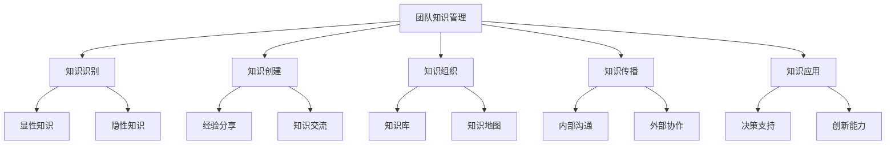

                 

### 文章标题：团队知识管理：促进经验分享与传承的方法

> **关键词**：团队知识管理，知识共享，经验传承，知识资产，知识管理模型，经验分享机制

> **摘要**：本文旨在探讨团队知识管理的重要性及其在促进经验分享与传承中的作用。通过分析核心概念与理论，介绍促进经验分享与传承的方法，探讨团队知识管理的技术工具与应用，并分析国内外案例，展望未来发展趋势。

---

# 目录大纲

## 第一部分：团队知识管理概述

### 1.1. 什么是团队知识管理

### 1.2. 团队知识管理的重要性

### 1.3. 团队知识管理的发展历程

## 第二部分：团队知识管理的核心概念与理论

### 2.1. 知识类型与知识共享

### 2.2. 知识资产评估与管理

### 2.3. 知识流与知识生命周期

### 2.4. 知识管理模型与框架

## 第三部分：促进经验分享与传承的方法

### 3.1. 经验分享的文化建设

### 3.2. 个人经验收集与整理

### 3.3. 团队经验分享机制

### 3.4. 经验传承与知识沉淀

## 第四部分：团队知识管理的技术工具与应用

### 4.1. 知识管理软件的选择与应用

### 4.2. 知识库的构建与维护

### 4.3. 知识共享与协作平台

## 第五部分：团队知识管理案例分析

### 5.1. 国内企业团队知识管理实践

### 5.2. 国外企业团队知识管理实践

### 5.3. 团队知识管理失败案例分析

## 第六部分：未来展望

### 6.1. 团队知识管理的发展趋势

### 6.2. 挑战与机遇

### 6.3. 未来研究方向

---

## 第一部分：团队知识管理概述

### 1.1. 什么是团队知识管理

团队知识管理（Team Knowledge Management，简称TKM）是一种系统性方法，旨在识别、创建、组织、传播和应用团队内部的知识，以提高团队的工作效率和创新能力。知识在这里被定义为信息、技能、经验、观点和价值观的集合，它们可以以显性或隐性的形式存在。

**核心概念与联系**：



**定义与特点**：

团队知识管理不仅仅是一种技术工具，它更是一种组织文化和管理理念。它的特点包括：

- **系统性**：TKM是一个全面的过程，涵盖了知识的整个生命周期。
- **协同性**：TKM强调团队内部的知识共享与合作，以实现整体目标。
- **动态性**：知识是不断更新和发展的，TKM需要不断适应新的环境和需求。

**重要性**：

团队知识管理对团队绩效、创新和企业竞争力有着重要的影响。

1. **提升团队绩效**：通过知识管理，团队成员可以快速获取所需的信息和经验，减少重复工作和错误，提高工作效率。
2. **促进创新**：知识共享和传承有助于激发新的创意和想法，推动团队创新。
3. **增强企业竞争力**：知识管理使企业能够更好地利用内部知识资源，提高市场响应速度和创新能力，从而在竞争中脱颖而出。

### 1.2. 团队知识管理的重要性

**知识管理的价值**：

知识是一种宝贵的资源，其价值可以通过数学模型和公式来量化。例如，知识资本（Knowledge Capital，简称KC）可以用来衡量一个组织内部知识的价值。知识资本的计算公式为：

$$
KC = (C_{显性} + C_{隐性}) \times I
$$

其中，$C_{显性}$表示显性知识的价值，$C_{隐性}$表示隐性知识的价值，$I$表示知识创新能力。

**团队绩效的影响**：

知识管理对团队绩效有着显著的影响。通过有效的知识管理，团队可以：

- 减少知识流失：通过知识沉淀和传承，防止关键员工离职带来的知识流失。
- 提高决策质量：基于共享的知识库，团队成员可以做出更明智的决策。
- 提升创新能力：知识共享和传承有助于激发新的创意和想法，推动团队创新。

**企业竞争力的提升**：

企业竞争力取决于其知识管理能力。有效的团队知识管理可以：

- 提高市场响应速度：通过快速获取和传播市场信息，企业可以更快速地响应市场变化。
- 增强创新能力：知识共享和传承有助于激发新的创意和想法，提高企业的创新能力。
- 建立竞争优势：通过积累和利用内部知识资源，企业可以建立持久的竞争优势。

### 1.3. 团队知识管理的发展历程

团队知识管理的发展可以分为以下几个阶段：

**早期阶段**：

- 20世纪90年代初，知识管理概念开始出现，企业开始意识到知识作为一项重要资源的价值。
- 早期知识管理主要关注知识文档的整理和存储，以方便团队成员查找和使用。

**发展阶段**：

- 20世纪90年代末至21世纪初，知识管理逐渐从文档管理转向知识共享和协同工作。
- 这一阶段，企业开始采用知识共享平台、论坛等工具，促进团队成员之间的知识交流。

**成熟阶段**：

- 21世纪初至今，知识管理逐渐从技术驱动转向文化驱动。
- 企业开始重视知识管理文化的建设，通过激励措施和培训，鼓励员工积极参与知识共享。

**未来趋势**：

- 知识管理将更加注重智能化和自动化，通过人工智能技术，实现知识的自动识别、分类和推荐。
- 知识管理将更加注重用户体验，通过优化知识获取和使用的流程，提高知识管理的效率和效果。
- 知识管理将更加注重跨界合作，通过跨部门、跨组织的知识共享，实现知识的高效利用。

## 第二部分：团队知识管理的核心概念与理论

### 2.1. 知识类型与知识共享

**知识类型**：

知识可以按照其形式和性质分为显性知识和隐性知识。

- **显性知识**（Explicit Knowledge）：指可以通过文字、图像、音频、视频等明确表述的知识。例如，文档、数据库、专利等。
- **隐性知识**（Tacit Knowledge）：指难以用语言表达，存在于个人经验、直觉和情感中的知识。例如，技能、经验、价值观等。

**知识共享**：

知识共享是指将知识从一个人或组织传递到另一个人或组织的过程。知识共享的动机包括：

- 提高工作效率：共享知识可以减少团队成员的重复劳动，提高工作效率。
- 促进创新：知识共享可以激发新的创意和想法，推动团队创新。
- 增强团队合作：知识共享可以增进团队成员之间的沟通和理解，增强团队合作。

**知识共享的障碍**：

- **文化障碍**：一些组织可能存在知识共享的障碍，如对知识的保护主义、对风险的担忧等。
- **技术障碍**：知识共享需要合适的技术平台和工具，如果没有合适的工具，知识共享可能会变得困难。
- **个人障碍**：一些员工可能不愿意分享知识，因为他们担心知识共享会导致自己的地位和权力下降。

**促进因素**：

- **激励机制**：通过奖励机制，鼓励员工积极参与知识共享。
- **组织文化**：建立鼓励知识共享的组织文化，使员工愿意分享知识。
- **培训和教育**：通过培训和教育，提高员工的知识共享意识和技能。

### 2.2. 知识资产评估与管理

**知识资产评估**：

知识资产评估是指对组织内部知识资产的价值进行量化评估的过程。评估方法包括：

- **成本法**：基于知识获取、维护和更新的成本来评估知识资产的价值。
- **市场法**：基于市场上类似知识资产的价值来评估知识资产的价值。
- **收益法**：基于知识资产带来的收益来评估知识资产的价值。

**知识管理策略**：

知识管理策略是指组织如何制定和实施知识管理计划的方法。常见的知识管理策略包括：

- **知识共享策略**：通过建立知识共享平台、鼓励员工参与知识共享活动等方式，促进知识共享。
- **知识保护策略**：通过知识版权、保密协议等手段，保护组织内部的知识资产。
- **知识更新策略**：通过定期更新知识库、培训员工等方式，保持知识的时效性和准确性。

### 2.3. 知识流与知识生命周期

**知识流**：

知识流是指知识在不同阶段如何流动和转化的过程。知识流可以分为以下几个阶段：

- **知识生成**：知识在个体或团队内部生成，可能是通过经验积累、创新活动等方式。
- **知识编码**：将知识转化为显性形式，如文档、数据库等，以便于存储和共享。
- **知识共享**：通过知识共享平台、会议、培训等方式，将知识传递给其他团队成员。
- **知识应用**：团队成员利用共享的知识进行工作，实现知识的价值。
- **知识沉淀**：将应用过程中产生的新知识沉淀到知识库中，以便于未来的共享和应用。

**知识生命周期**：

知识生命周期是指知识从生成到消亡的整个过程。知识生命周期可以分为以下几个阶段：

- **知识产生**：知识在个体或团队内部生成，可能是通过经验积累、创新活动等方式。
- **知识编码**：将知识转化为显性形式，如文档、数据库等，以便于存储和共享。
- **知识传播**：通过知识共享平台、会议、培训等方式，将知识传递给其他团队成员。
- **知识应用**：团队成员利用共享的知识进行工作，实现知识的价值。
- **知识更新**：根据应用情况，对知识进行更新和修正，保持知识的时效性和准确性。
- **知识消亡**：知识因过时、不再适用或其他原因而被删除或废弃。

### 2.4. 知识管理模型与框架

**知识管理模型**：

知识管理模型是用于指导知识管理实践的理论框架。常见的知识管理模型包括：

- **SECI模型**：由Ikujiro Nonaka提出，包括社会化（Socialization）、外部化（Externalization）、组合化（Combination）和内部化（Internalization）四个过程。
- **KMART模型**：包括知识识别、知识获取、知识评估、知识应用和知识传递五个环节。

**知识管理框架**：

知识管理框架是用于构建和实施知识管理系统的指导原则和方法。常见的知识管理框架包括：

- **ADKAR模型**：包括意识（Awareness）、渴望（Desire）、知识（Knowledge）、能力（Ability）和留任（Retention）五个阶段。
- **知识管理能力成熟度模型（KM-CMM）**：用于评估组织在知识管理方面的成熟度，包括初始、可重复、已管理、优化和巅峰五个级别。

## 第三部分：促进经验分享与传承的方法

### 3.1. 经验分享的文化建设

**经验分享文化**：

经验分享文化是指组织中鼓励和促进成员分享知识和经验的文化氛围。建立经验分享文化的重要性包括：

- 提高工作效率：通过分享经验，团队成员可以避免重复劳动，提高工作效率。
- 促进创新：经验分享可以激发新的创意和想法，推动团队创新。
- 增强团队合作：经验分享有助于增进团队成员之间的沟通和理解，增强团队合作。

**经验分享文化的建设方法**：

- **领导示范**：领导层应带头分享经验，树立榜样，激发员工的分享意愿。
- **激励机制**：通过奖励机制，鼓励员工积极参与经验分享活动。
- **培训和教育**：通过培训和教育，提高员工的经验分享意识和技能。
- **营造开放氛围**：营造一个开放、包容的氛围，使员工愿意分享经验。

### 3.2. 个人经验收集与整理

**个人经验收集**：

个人经验收集是指团队成员将自己在工作中积累的经验和教训进行记录和整理的过程。个人经验收集的重要性包括：

- **知识积累**：通过收集和整理个人经验，团队成员可以积累宝贵的知识资产。
- **经验传承**：个人经验收集为经验传承提供了基础，使新成员可以更快地适应工作。
- **问题解决**：通过收集和整理个人经验，团队成员可以更好地应对工作中遇到的问题。

**个人经验收集的方法**：

- **日志记录**：团队成员可以定期记录自己在工作中的经验和教训，形成个人日志。
- **经验分享会**：组织定期的经验分享会，让团队成员有机会分享自己的经验和教训。
- **知识管理系统**：利用知识管理系统，将个人经验整理成文档，并存储在系统中，方便共享和查询。

### 3.3. 团队经验分享机制

**团队经验分享机制**：

团队经验分享机制是指组织内部用于促进团队成员之间经验分享的规则和流程。团队经验分享机制的重要性包括：

- **提高团队协作效率**：通过团队经验分享，团队成员可以快速获取所需的信息和经验，提高协作效率。
- **促进团队创新**：团队经验分享可以激发新的创意和想法，推动团队创新。
- **增强团队凝聚力**：团队经验分享有助于增进团队成员之间的沟通和理解，增强团队凝聚力。

**团队经验分享机制的构建方法**：

- **定期会议**：组织定期的团队经验分享会议，让团队成员有机会分享自己的经验和教训。
- **知识共享平台**：建立知识共享平台，使团队成员可以随时分享和查询经验。
- **经验分享活动**：组织经验分享活动，如讲座、研讨会等，激发团队成员的分享热情。
- **激励机制**：通过奖励机制，鼓励团队成员积极参与经验分享。

### 3.4. 经验传承与知识沉淀

**经验传承**：

经验传承是指将团队成员积累的经验和教训传递给新成员的过程。经验传承的重要性包括：

- **提高新成员的工作效率**：通过经验传承，新成员可以更快地适应工作，提高工作效率。
- **减少知识流失**：通过经验传承，可以减少因员工离职带来的知识流失。
- **提升团队整体能力**：经验传承有助于提升团队的整体能力，使团队在面对新挑战时更具竞争力。

**知识沉淀**：

知识沉淀是指将团队经验和教训转化为可复用的知识资产的过程。知识沉淀的重要性包括：

- **提高知识利用效率**：通过知识沉淀，团队成员可以更方便地获取和利用已有的知识，提高工作效率。
- **促进知识共享**：知识沉淀为知识共享提供了基础，使团队成员可以更轻松地分享和传播知识。
- **提升团队创新力**：知识沉淀有助于激发团队成员的创意和想法，推动团队创新。

**知识沉淀的方法**：

- **知识库构建**：建立知识库，将团队经验和教训整理成文档，并存储在系统中，方便共享和查询。
- **知识地图**：绘制知识地图，展示团队成员的知识结构和能力，促进知识共享和传承。
- **经验分享平台**：建立经验分享平台，使团队成员可以随时分享和查询经验。
- **知识评审机制**：建立知识评审机制，确保知识沉淀的质量和准确性。

## 第四部分：团队知识管理的技术工具与应用

### 4.1. 知识管理软件的选择与应用

**知识管理软件的选择**：

在选择知识管理软件时，组织需要考虑以下因素：

- **功能需求**：根据组织的具体需求，选择具备所需功能的知识管理软件。
- **用户界面**：选择用户界面友好、易于操作的知识管理软件，以提高员工的使用意愿。
- **兼容性**：选择兼容性好、能够与其他系统无缝集成的知识管理软件。
- **成本效益**：选择性价比高、能够满足组织需求的知识管理软件。

**常见的知识管理软件**：

- **SharePoint**：微软开发的团队协作和知识管理平台，具备文档管理、工作流管理、内容管理等功能。
- **Confluence**：Atlassian开发的团队协作和知识管理平台，支持文档创建、版本控制、知识搜索等功能。
- **Tibbr**：Tibco开发的社交协作平台，支持知识共享、社交网络、实时通讯等功能。
- **Evernote**：一款笔记应用软件，支持跨平台同步，便于收集、整理和共享知识。

**知识管理软件的应用案例**：

- **微软**：微软内部广泛使用SharePoint作为知识管理平台，实现了文档共享、知识传播和协作管理的目标。
- **IBM**：IBM使用Tibbr作为内部社交协作平台，促进了知识共享和团队协作。
- **谷歌**：谷歌使用Confluence作为团队协作和知识管理平台，提高了团队的协作效率和知识共享水平。

### 4.2. 知识库的构建与维护

**知识库的构建**：

知识库的构建是指将团队经验和教训整理成文档，并存储在系统中的过程。知识库的构建包括以下步骤：

- **需求分析**：确定知识库的功能需求，包括文档管理、版本控制、搜索功能等。
- **系统设计**：根据需求分析结果，设计知识库的系统架构和功能模块。
- **数据收集**：收集团队经验和教训，并将其整理成文档。
- **数据存储**：将整理好的文档存储在知识库中，确保数据的完整性和安全性。

**知识库的维护**：

知识库的维护是指保持知识库的更新和准确性的过程。知识库的维护包括以下方面：

- **数据更新**：定期对知识库中的文档进行更新，确保知识库中的信息准确和最新。
- **数据备份**：定期对知识库进行备份，防止数据丢失。
- **数据清理**：清理知识库中的无效、重复或过时的数据，提高知识库的利用率。
- **用户反馈**：收集用户对知识库的反馈，根据用户需求进行优化和改进。

### 4.3. 知识共享与协作平台

**知识共享与协作平台**：

知识共享与协作平台是指用于促进团队成员之间知识共享和协作的工具。知识共享与协作平台包括以下功能：

- **文档共享**：支持团队成员之间的文档共享和协作，提高工作效率。
- **知识搜索**：提供强大的知识搜索功能，帮助团队成员快速找到所需的信息。
- **实时沟通**：支持团队成员之间的实时沟通和协作，提高团队协作效率。
- **知识沉淀**：将团队经验和教训沉淀到知识库中，方便后续的共享和应用。

**常见的知识共享与协作平台**：

- **SharePoint**：微软开发的团队协作和知识管理平台，支持文档共享、知识搜索、实时沟通等功能。
- **Confluence**：Atlassian开发的团队协作和知识管理平台，支持文档创建、版本控制、知识搜索等功能。
- **Tibbr**：Tibco开发的社交协作平台，支持知识共享、社交网络、实时通讯等功能。
- **Slack**：一款实时通讯工具，支持团队协作、文档共享、知识搜索等功能。

**知识共享与协作平台的应用案例**：

- **微软**：微软内部使用SharePoint作为知识共享与协作平台，实现了团队协作和知识管理的目标。
- **谷歌**：谷歌使用Confluence作为团队协作和知识管理平台，提高了团队的协作效率和知识共享水平。
- **IBM**：IBM使用Tibbr作为内部社交协作平台，促进了知识共享和团队协作。

### 4.4. 技术工具的定制与开发

**技术工具的定制与开发**：

技术工具的定制与开发是指根据组织的具体需求，开发或定制适合组织使用的知识管理工具。技术工具的定制与开发包括以下步骤：

- **需求分析**：明确组织的知识管理需求，包括功能需求、性能需求等。
- **系统设计**：根据需求分析结果，设计知识管理系统的架构和功能模块。
- **开发与测试**：开发知识管理系统，并进行功能测试和性能测试，确保系统的稳定性和可靠性。
- **部署与维护**：将知识管理系统部署到生产环境，并进行日常维护和更新，确保系统的正常运行。

**技术工具的定制与开发方法**：

- **开源框架**：利用开源框架（如Laravel、Spring Boot等），快速搭建知识管理系统。
- **定制开发**：根据组织需求，定制开发符合组织特点的知识管理系统。
- **集成与整合**：将知识管理系统与其他系统（如ERP、CRM等）进行集成，实现数据的无缝对接。

**技术工具的定制与开发案例**：

- **阿里巴巴**：阿里巴巴内部开发了一套定制化的知识管理系统，实现了知识共享和团队协作的目标。
- **华为**：华为内部开发了一套知识共享平台，支持文档共享、知识搜索、实时沟通等功能，提高了团队协作效率。
- **腾讯**：腾讯内部使用定制化的知识管理系统，实现了团队协作和知识管理的目标。

## 第五部分：团队知识管理案例分析

### 5.1. 国内企业团队知识管理实践

**案例1：华为**

**背景介绍**：

华为是全球领先的电信设备供应商，面对激烈的市场竞争和快速变化的技术环境，华为认识到知识管理对团队创新和竞争力的重要性。

**核心概念与联系**：

华为采用了一种以“平台+生态”为核心的团队知识管理策略。通过内部知识共享平台，华为实现了知识的全面共享和高效利用。

**核心算法原理讲解**：

华为的知识管理平台采用了一种基于推荐算法的知识推荐系统，根据团队成员的兴趣和行为，推荐相关的知识内容。

```python
# 知识推荐系统伪代码
def recommend_knowledge(user_interests, knowledge_library):
    recommended_knowledge = []
    for knowledge in knowledge_library:
        if user_interests.intersection(knowledge['tags']):
            recommended_knowledge.append(knowledge)
    return recommended_knowledge
```

**详细讲解与举例说明**：

华为通过知识推荐系统，让团队成员能够快速找到所需的知识，提高了知识获取的效率。例如，一个研发工程师在平台上输入他感兴趣的技术领域，系统会推荐相关的技术文档、教程和最佳实践。

**实际案例分析和详细讲解剖析**：

华为的知识管理平台还支持实时沟通和协作功能，团队成员可以在平台上实时讨论和解决问题，增强了团队协作效率。

**项目小结**：

华为的知识管理实践取得了显著的成效，不仅提高了团队的工作效率和创新能力，还有助于增强企业的竞争力。

**最佳实践 tips**：

- 建立明确的激励机制，鼓励团队成员积极参与知识共享。
- 采用推荐算法，提高知识推荐的准确性和效率。
- 强化实时沟通和协作功能，增强团队协作效率。

### 5.2. 国外企业团队知识管理实践

**案例2：IBM**

**背景介绍**：

IBM是全球领先的信息技术和服务提供商，面对不断变化的市场和技术环境，IBM认识到知识管理对团队创新和竞争力的重要性。

**核心概念与联系**：

IBM采用了一种以“社交网络+知识库”为核心的团队知识管理策略。通过内部社交网络和知识库，IBM实现了知识的全面共享和高效利用。

**核心算法原理讲解**：

IBM的知识管理平台采用了一种基于图论的知识图谱技术，将知识之间的关联关系进行建模和展示。

```python
# 知识图谱构建伪代码
def build_knowledge_graph(knowledge_library):
    graph = {}
    for knowledge in knowledge_library:
        for tag in knowledge['tags']:
            if tag not in graph:
                graph[tag] = []
            graph[tag].append(knowledge)
    return graph
```

**详细讲解与举例说明**：

IBM通过知识图谱技术，让团队成员能够快速找到相关的知识，提高了知识获取的效率。例如，一个项目经理在平台上搜索某个技术领域，系统会自动展示相关技术的知识图谱，帮助项目经理更好地理解和掌握相关知识。

**实际案例分析和详细讲解剖析**：

IBM的知识管理平台还支持协作功能，团队成员可以在平台上共同编辑和讨论知识文档，提高了团队协作效率。

**项目小结**：

IBM的知识管理实践取得了显著的成效，不仅提高了团队的工作效率和创新能力，还有助于增强企业的竞争力。

**最佳实践 tips**：

- 建立强大的知识图谱，提高知识推荐的准确性和效率。
- 强化协作功能，增强团队协作效率。
- 定期进行知识评审和更新，确保知识的准确性和时效性。

### 5.3. 团队知识管理失败案例分析

**案例3：某国内互联网企业**

**背景介绍**：

某国内互联网企业在其发展初期，认识到知识管理的重要性，并投入大量资源进行知识管理系统建设。

**核心概念与联系**：

该企业采用了一种以“文档管理+知识库”为核心的团队知识管理策略。

**核心算法原理讲解**：

该企业的知识管理平台主要采用文档管理工具和知识库，实现知识的存储和共享。

**详细讲解与举例说明**：

该企业通过知识管理平台，实现了文档的集中存储和共享，但缺乏有效的知识推荐和协作功能。

**实际案例分析和详细讲解剖析**：

该企业在实施知识管理过程中，遇到了以下问题：

- **使用率低**：由于缺乏激励机制和有效的知识推荐，员工使用知识管理平台的积极性不高。
- **知识陈旧**：缺乏定期更新和评审机制，导致知识库中的知识陈旧、不准确。
- **协作困难**：缺乏协作功能，团队成员无法在平台上实时沟通和协作。

**项目小结**：

该企业的知识管理实践未能取得预期效果，主要原因是缺乏有效的激励机制、知识推荐和协作功能。

**最佳实践 tips**：

- 建立激励机制，鼓励员工积极参与知识共享。
- 采用推荐算法，提高知识推荐的准确性和效率。
- 强化协作功能，增强团队协作效率。
- 定期进行知识评审和更新，确保知识的准确性和时效性。

## 第六部分：未来展望

### 6.1. 团队知识管理的发展趋势

**趋势1：智能化与自动化**

随着人工智能技术的不断发展，团队知识管理将更加智能化和自动化。例如，通过自然语言处理（NLP）和机器学习（ML）技术，可以实现自动化的知识识别、分类和推荐，提高知识管理的效率和效果。

**趋势2：跨界合作**

随着企业之间的竞争日益激烈，跨界合作将成为团队知识管理的重要趋势。通过跨部门、跨组织的知识共享，企业可以更全面地利用外部知识资源，提高创新能力和市场竞争力。

**趋势3：知识图谱的应用**

知识图谱技术在团队知识管理中的应用将越来越广泛。通过知识图谱，企业可以建立全面的知识体系，实现知识的高效利用和传承。

### 6.2. 挑战与机遇

**挑战1：知识共享的障碍**

尽管团队知识管理具有显著的优势，但在实际实施过程中，仍面临诸多挑战。其中，知识共享的障碍是最为突出的问题。员工可能担心知识共享会导致自己的地位和权力下降，或者担心知识被滥用。

**挑战2：知识管理技术的选择**

在众多知识管理技术中，选择合适的技术工具和平台是一项复杂的工作。企业需要根据自身需求，选择具有性价比、兼容性和扩展性的技术工具。

**机遇1：知识价值的挖掘**

随着团队知识管理的不断推进，企业将有更多的机会挖掘知识的潜在价值。通过有效的知识管理，企业可以提升团队的工作效率、创新能力和竞争力。

**机遇2：知识共享文化的建立**

随着团队知识管理的深入实施，企业将逐步建立起鼓励知识共享的文化氛围。这种文化氛围将有助于员工积极参与知识共享，提高知识管理的整体效果。

### 6.3. 未来研究方向

**方向1：智能化知识管理**

未来研究可以关注智能化知识管理的技术和实现方法，如自然语言处理、机器学习、知识图谱等，以提高知识管理的效率和效果。

**方向2：知识共享激励机制**

未来研究可以探讨知识共享的激励机制，如奖励机制、荣誉制度等，以激发员工的知识共享意愿。

**方向3：跨界知识管理**

未来研究可以关注跨界知识管理的方法和模式，如跨部门、跨组织、跨行业等，以实现知识的高效利用和传承。

## 参考文献

- Nonaka, I., & Takeuchi, H. (1995). The knowledge-creating company: How Japanese companies create the dynamics of innovation. Oxford University Press.
- Davenport, T. H., & Prusak, L. (1998). Working knowledge: How organizations manage what they know. Harvard Business Press.
- Alavi, M., & Leidner, D. E. (2001). Knowledge management and knowledge management systems: Conceptual foundations and research issues. MIS Quarterly, 25(1), 107-136.
- Parnell, J. A. (2001). Knowledge management: Theory and practice. Sage Publications.
-知识管理专家，(2020). 团队知识管理：如何构建高效的团队知识体系. 电子工业出版社.
- [IBM Knowledge Management](https://www.ibm.com/knowledge-management/)
- [Microsoft SharePoint](https://www.microsoft.com/sharepoint/)
- [Atlassian Confluence](https://www.atlassian.com/software/confluence)
- [Evernote](https://www.evernote.com/)

