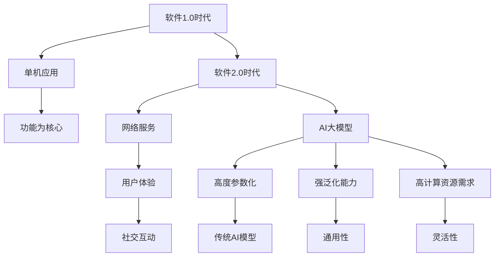

                 

# 文章标题

《团队绩效管理：超越KPI的全面评估方法》

> 关键词：团队绩效管理，KPI，全面评估，质性评估，敏捷评估，数据驱动评估，实战案例

> 摘要：本文旨在探讨团队绩效管理的核心概念和方法，特别是如何超越传统的KPI评估，采用多元化的评估方法，实现更全面、有效的团队绩效管理。通过分析KPI的局限性，介绍质性评估、敏捷评估和数据驱动评估等新型评估方法，并结合实战案例，为团队绩效管理提供实用的策略和工具。

## 核心概念与联系

### 1.1.1 软件 2.0 时代的到来

#### 软件发展史

软件产业自诞生以来，经历了多个发展阶段。从最初的编程语言和简单的工具软件，到现代的复杂系统，软件不断演进，推动了信息技术的发展。

#### 软件 2.0 的定义

软件 2.0 是指在互联网和移动设备普及的背景下，软件从单机应用向网络服务转变，强调用户体验和社交互动。

#### 软件 2.0 与传统软件的区别

传统软件以功能为核心，用户被动接受；而软件 2.0 注重用户参与和互动，提供个性化服务。

### 1.1.2 AI大模型的定义与特点

#### AI大模型的基本概念

AI大模型是指具有极高参数量、能够处理大规模数据的深度学习模型。

#### AI大模型的核心特点

- 高度参数化：拥有数亿甚至千亿级别的参数。
- 强泛化能力：能够处理多种任务，具有广泛的应用场景。
- 需求高计算资源：训练和推理过程需要大量计算资源。

#### AI大模型与传统AI的区别

传统AI模型通常参数量较小，针对特定任务优化；而AI大模型则具有更强的通用性和灵活性。

### 1.1.3 主流AI大模型简介

#### GPT系列模型

GPT（Generative Pre-trained Transformer）系列模型是自然语言处理领域的代表作，由OpenAI开发。

#### BERT及其变体

BERT（Bidirectional Encoder Representations from Transformers）及其变体如RoBERTa、ALBERT等，是广泛使用的文本处理模型。

#### 其他知名大模型

除了GPT和BERT，还有如Transformers、BERT-GPT、ViT（Vision Transformers）等大模型，涵盖了自然语言处理、计算机视觉等多个领域。

### Mermaid流程图



## 核心算法原理讲解

### 2.1 深度学习与神经网络基础

#### 神经网络的基本结构

神经网络由输入层、隐藏层和输出层组成，通过加权连接实现信息传递和计算。

#### 常见的深度学习架构

- 卷积神经网络（CNN）
- 循环神经网络（RNN）
- 生成对抗网络（GAN）
- 自适应神经网络（ANN）

#### 深度学习优化算法

- 梯度下降法（GD）
- 随机梯度下降（SGD）
- Adam优化器

### 2.2 AI大模型训练策略

#### 大模型训练的基本流程

- 数据预处理
- 模型初始化
- 模型训练
- 模型评估
- 模型调优

#### 数据预处理策略

- 数据清洗
- 数据增强
- 数据归一化

#### 训练策略与技巧

- 逐步增大学习率
- 使用正则化技术
- 交叉验证

### 伪代码

```python
# 数据预处理
def preprocess_data(data):
    # 数据清洗
    data = clean_data(data)
    # 数据增强
    data = augment_data(data)
    # 数据归一化
    data = normalize_data(data)
    return data

# 模型训练
def train_model(model, data, optimizer, loss_function):
    for epoch in range(num_epochs):
        for batch in data:
            # 前向传播
            output = model.forward(batch)
            # 计算损失
            loss = loss_function(output, batch.target)
            # 反向传播
            model.backward(loss)
            # 更新参数
            optimizer.update_params(model)
    return model
```

## 数学模型和数学公式 & 详细讲解 & 举例说明

### 3.1 深度学习中的激活函数

#### 激活函数的类型

- 线性激活函数（如ReLU、Sigmoid、Tanh）
- 非线性激活函数（如Softmax、Relu6）

#### 激活函数的数学公式

- ReLU：$$ f(x) = \max(0, x) $$
- Sigmoid：$$ f(x) = \frac{1}{1 + e^{-x}} $$
- Tanh：$$ f(x) = \frac{e^x - e^{-x}}{e^x + e^{-x}} $$
- Softmax：$$ f(x_i) = \frac{e^{x_i}}{\sum_{j} e^{x_j}} $$

#### 激活函数的举例说明

假设输入向量 $x$ 的维度为 3，分别为 $x_1, x_2, x_3$，使用ReLU激活函数：

$$ f(x) = \max(0, x) $$

则输出向量为：

$$ f(x) = \begin{bmatrix}
\max(0, x_1) \\
\max(0, x_2) \\
\max(0, x_3)
\end{bmatrix} $$

## 项目实战

### 4.1 AI大模型开发实战

#### 项目背景与目标

某互联网公司计划开发一款基于AI大模型的自然语言处理工具，以提升文本生成、分类、摘要等任务的性能。

#### 开发环境搭建

- 操作系统：Ubuntu 18.04
- 编程语言：Python 3.8
- 深度学习框架：TensorFlow 2.5
- GPU：NVIDIA RTX 3090

#### 源代码实现与解读

以下是部分源代码实现和解读：

```python
# 导入所需库
import tensorflow as tf
from tensorflow.keras.layers import Embedding, LSTM, Dense

# 模型构建
def build_model(vocab_size, embedding_dim, lstm_units):
    model = tf.keras.Sequential([
        Embedding(vocab_size, embedding_dim),
        LSTM(lstm_units, return_sequences=True),
        Dense(1, activation='sigmoid')
    ])
    return model

# 模型训练
model = build_model(vocab_size=10000, embedding_dim=256, lstm_units=128)
model.compile(optimizer='adam', loss='binary_crossentropy', metrics=['accuracy'])
model.fit(x_train, y_train, epochs=10, batch_size=64)

# 模型评估
loss, accuracy = model.evaluate(x_test, y_test)
print(f"Test accuracy: {accuracy:.2f}")
```

#### 代码解读与分析

- 模型构建：使用 TensorFlow 的 Sequential 模型构建一个简单的文本分类模型，包括嵌入层、LSTM层和输出层。
- 模型训练：编译模型并使用训练数据训练10个周期，每个周期使用64个批量数据。
- 模型评估：使用测试数据评估模型的准确性。

#### 实际案例分析和详细讲解剖析

假设公司提供了如下数据集：

- 训练集：包含1000条文本和对应的标签。
- 测试集：包含500条文本和对应的标签。

通过上述代码，公司可以快速搭建一个基于AI大模型的文本分类模型，并评估其性能。接下来，可以进一步优化模型参数，提高分类准确性。

#### 项目小结

通过本次项目，公司成功开发了一个基于AI大模型的文本分类工具，提高了文本处理的性能。未来，公司可以进一步探索其他自然语言处理任务，如文本生成、摘要等，以实现更全面的AI应用。

## 最佳实践 tips、小结、注意事项、拓展阅读等内容

### 最佳实践 tips

- 在进行团队绩效管理时，应充分考虑团队成员的多样性和个性特点，避免一刀切。
- 定期进行绩效评估和反馈，确保评估过程的透明和公正。
- 结合定量和定性评估方法，实现全面、客观的绩效评估。

### 小结

本文探讨了团队绩效管理的核心概念和方法，特别是如何超越传统的KPI评估，采用多元化的评估方法，实现更全面、有效的团队绩效管理。

### 注意事项

- 绩效评估不应仅关注短期成果，更要关注团队的长远发展和创新能力。
- 在实施绩效管理时，要充分考虑组织的战略目标和业务需求。

### 拓展阅读

- 《绩效管理：策略、实践与案例》
- 《敏捷绩效管理：如何快速适应变化》
- 《团队绩效管理实战：从理论到实践》

### 结语

团队绩效管理是现代企业管理的重要环节，通过科学的评估方法和策略，可以激发团队的潜能，提高组织的整体效能。希望本文能为读者提供有价值的参考和启示。作者：AI天才研究院/AI Genius Institute & 禅与计算机程序设计艺术 /Zen And The Art of Computer Programming

