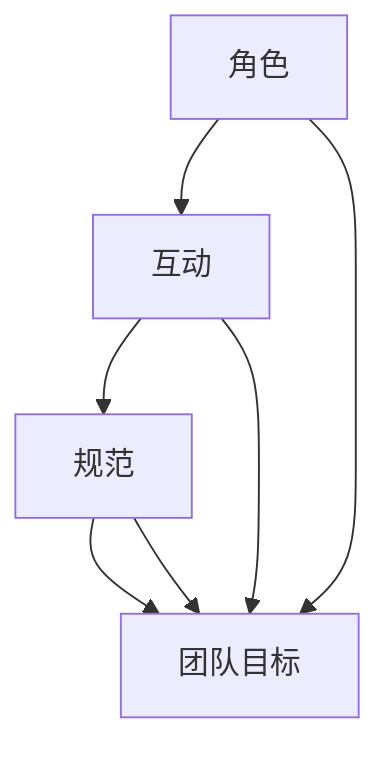
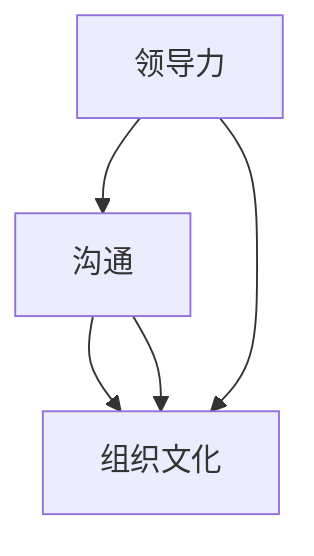
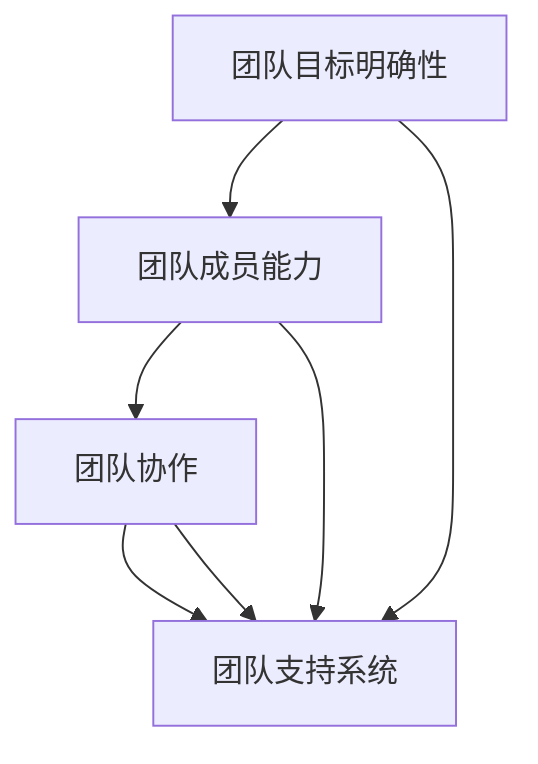

                 

### 文章标题

《团队责任感培养：增强团队使命感》

### 关键词

团队责任感、使命感、领导力、沟通技巧、团队建设、问责制、案例分析、实践方法。

### 摘要

本文旨在探讨团队责任感培养的重要性及其对团队使命感的影响。通过深入分析团队责任感的基本概念、理论基础和实践方法，结合成功与失败案例分析，本文提出了一套系统的团队责任感培养策略，旨在为企业和团队提供实用的指导，以增强团队使命感，提升团队效能。

----------------------------------------------------------------

## 目录大纲设计思路

### 目录大纲设计原则

在设计和撰写《团队责任感培养：增强团队使命感》的目录大纲时，我们遵循了以下几个原则：

1. **全面覆盖主题内容**：确保目录大纲能涵盖团队责任感培养的各个方面，包括理论基础、实践方法、案例分析等。
2. **逻辑清晰**：按照阅读逻辑，将内容分为几个主要部分，每个部分下的子章节顺序应当有助于读者逐步深入理解主题。
3. **简洁明了**：避免冗长的章节标题和内容，使读者能够快速把握每个章节的核心内容。
4. **理论与实践相结合**：不仅要介绍理论知识，还要结合实际案例进行讲解，帮助读者更好地理解和应用。

### 目录大纲详细设计

**第一部分：团队责任感概述**

- **第1章：团队责任感的概念与意义**
  - 1.1 团队责任感的定义
  - 1.2 团队责任感的重要性
  - 1.3 团队责任感的特征
  - 1.4 团队责任感的培养目标

- **第2章：团队责任感的理论基础**
  - 2.1 团队动力学理论
    - **Mermaid流程图：团队动力学理论核心概念关系图**
  - 2.2 组织行为学理论
    - **Mermaid流程图：组织行为学理论核心概念关系图**
  - 2.3 团队效能理论
    - **Mermaid流程图：团队效能理论核心概念关系图**

**第二部分：团队责任感培养的方法**

- **第3章：团队责任感培养策略**
  - 3.1 领导力培养
  - 3.2 沟通技巧提升
  - 3.3 团队建设活动
  - 3.4 问责制与反馈机制

- **第4章：团队责任感培养实践**
  - 4.1 个人责任感的培养
    - **伪代码：个人责任感培养步骤**
  - 4.2 团队合作意识的培养
    - **伪代码：团队合作意识培养方法**
  - 4.3 团队目标的设定与执行
    - **伪代码：团队目标设定与执行流程**
  - 4.4 团队责任的分配与协调

**第三部分：团队责任感培养案例分析**

- **第5章：成功案例分析**
  - 5.1 案例一：某企业团队责任感培养成功案例
    - **案例分析：团队责任感培养实施过程**
  - 5.2 案例二：某团队在挑战中的责任感培养
    - **案例分析：团队在逆境中的责任感培养**

- **第6章：失败案例分析**
  - 6.1 案例一：某企业团队责任感培养失败案例
    - **案例分析：团队责任感培养失败原因**
  - 6.2 案例二：某团队在合作中的责任感缺失
    - **案例分析：团队责任感缺失的表现与影响**

**第四部分：团队责任感培养的实施与评估**

- **第7章：团队责任感培养的实施**
  - 7.1 实施步骤与流程
    - **伪代码：团队责任感培养实施流程**
  - 7.2 实施中的挑战与应对
  - 7.3 实施效果的评估方法

- **第8章：团队责任感培养的未来展望**
  - 8.1 新技术的应用
  - 8.2 组织文化的构建
  - 8.3 持续培养的策略与建议

### 目录大纲总结

整个目录大纲结构清晰，从概念、理论到实践，再到案例分析，最后是实施与展望，全面覆盖了团队责任感培养的各个方面。每个章节都包含了核心概念讲解、实践方法和案例分析，旨在帮助读者深入理解和掌握团队责任感培养的技能和方法。

---

**全文大纲设计至此完成，接下来我们将按照设计的大纲逐步撰写每个章节的内容，确保文章的逻辑性和专业性。**### 第一部分：团队责任感概述

#### 第1章：团队责任感的概念与意义

**1.1 团队责任感的定义**

团队责任感是指团队成员在共同工作中所承担的义务和承诺，包括对团队目标、团队利益和团队氛围的认同与责任。具体而言，团队责任感涵盖了以下几个方面：

- **对团队目标的认同**：团队成员认同团队的目标和愿景，愿意为实现这些目标付出努力。
- **对团队利益的关注**：团队成员关心团队的整体利益，愿意为团队的成功而共同努力。
- **对团队氛围的维护**：团队成员致力于创造和维护一个积极、和谐、互信的团队氛围。

**1.2 团队责任感的重要性**

团队责任感是团队高效运作的基石。它不仅影响团队成员的工作态度和行为，还对团队的绩效和成果产生深远的影响。具体来说，团队责任感的重要性体现在以下几个方面：

- **提高团队凝聚力**：责任感能够增强团队成员之间的联系，提升团队的凝聚力。
- **促进团队合作**：责任感促使团队成员更加主动地参与团队活动，促进团队合作。
- **提升团队效能**：责任感使团队成员更加专注和投入工作，从而提升团队的整体效能。
- **降低团队冲突**：责任感有助于减少因职责不清、目标不一致等因素引起的团队冲突。

**1.3 团队责任感的特征**

团队责任感的特征决定了其在团队中的作用和影响。以下是团队责任感的主要特征：

- **自愿性**：团队责任感是团队成员自愿承担的，并非强制性的。
- **持续性**：团队责任感不是一时的行为，而是团队成员长期坚持的态度和行为。
- **相互性**：团队责任感是双向的，不仅要求团队成员对团队负责，也要求团队对成员负责。
- **自主性**：团队责任感鼓励成员自主承担责任，自主解决问题。

**1.4 团队责任感的培养目标**

培养团队责任感的目标是使团队成员能够：

- **明确责任**：理解并明确自己在团队中的责任，知道什么是应该做的，什么是不应该做的。
- **提高自觉性**：培养成员的自我管理能力，使他们在没有外部监督的情况下也能保持高效率工作。
- **增强合作意识**：通过培养团队责任感，增强团队成员之间的合作意识，促进团队和谐发展。
- **提升团队效能**：通过责任感培养，提高团队的凝聚力和效能，实现团队目标。

#### 第2章：团队责任感的理论基础

**2.1 团队动力学理论**

团队动力学理论是研究团队内部动力和互动过程的理论框架。该理论认为，团队是由个体组成的系统，团队成员之间的相互作用和互动是团队运作的关键。以下是团队动力学理论的核心概念：

- **角色**：每个团队成员在团队中都有特定的角色，角色决定了团队成员的责任和期望。
- **互动**：团队成员之间的互动是团队动力的重要来源，通过互动，团队成员能够理解和支持彼此。
- **规范**：团队规范是团队成员共同遵守的行为准则，规范有助于维持团队的稳定和秩序。
- **团队目标**：团队目标是团队成员共同努力的方向，明确的目标有助于激发团队成员的积极性和责任感。

**Mermaid流程图：团队动力学理论核心概念关系图**



**2.2 组织行为学理论**

组织行为学理论是研究个体、群体以及结构对组织过程影响的学科。团队责任感培养与组织行为学理论密切相关。以下是组织行为学理论的核心概念：

- **领导力**：领导力是影响团队成员责任感和行为的关键因素，领导者需要通过激励和引导来培养团队成员的责任感。
- **沟通**：有效的沟通是培养团队责任感的重要手段，通过沟通，团队成员能够理解团队目标、明确个人责任。
- **组织文化**：组织文化是团队成员行为和价值观的体现，积极的文化氛围有助于培养团队责任感。

**Mermaid流程图：组织行为学理论核心概念关系图**



**2.3 团队效能理论**

团队效能理论关注团队整体绩效和效能，认为团队效能是由多个因素共同作用的结果。以下是团队效能理论的核心概念：

- **团队目标明确性**：明确的目标有助于团队成员集中精力，提高工作效能。
- **团队成员能力**：团队成员的能力和技能水平直接影响团队效能。
- **团队协作**：协作是团队效能的关键，高效的协作能够提高团队的整体绩效。
- **团队支持系统**：团队支持系统包括资源、培训等，支持系统能够提高团队效能。

**Mermaid流程图：团队效能理论核心概念关系图**



通过本章对团队责任感概念与意义的介绍以及团队动力学、组织行为学和团队效能理论的阐述，我们可以更全面地理解团队责任感的重要性，并为后续章节中的具体培养方法和案例分析打下理论基础。在接下来的章节中，我们将进一步探讨团队责任感培养的策略和实践方法。

---

**本章内容完整，对团队责任感的基本概念、理论基础和重要性进行了详细阐述。接下来，我们将深入探讨团队责任感培养的具体策略和实践方法。**### 第二部分：团队责任感培养的方法

#### 第3章：团队责任感培养策略

**3.1 领导力培养**

领导力是培养团队责任感的核心因素之一。有效的领导者能够激发团队成员的潜力，增强他们的责任感和使命感。以下是几种常见的领导力培养方法：

1. **榜样作用**：领导者通过自身的行为和态度，为团队成员树立榜样，引导他们树立责任感。领导者应展现出强烈的责任心和对团队目标的承诺。

2. **明确期望**：领导者应明确团队的目标和期望，使团队成员清楚自己的责任和角色。通过设定明确的目标和期望，可以激发团队成员的责任感和积极性。

3. **信任建设**：信任是团队责任感的基础。领导者应通过开放的沟通、公正的决策和透明的管理，建立团队成员之间的信任，从而增强团队责任感。

4. **激励与奖励**：领导者应通过激励和奖励机制，鼓励团队成员承担责任和达成目标。奖励可以包括物质奖励、荣誉奖励等，从而激发团队成员的内在动力。

**3.2 沟通技巧提升**

有效的沟通是培养团队责任感的重要手段。以下是一些提升沟通技巧的方法：

1. **倾听**：领导者应学会倾听团队成员的意见和建议，尊重他们的观点，从而建立互信和合作关系。

2. **清晰表达**：领导者应具备清晰、准确的表达能力，确保团队成员理解团队的目标、任务和期望。

3. **反馈机制**：建立有效的反馈机制，鼓励团队成员对自己的工作给予反馈，同时领导者也要对团队成员的表现给予及时的反馈。

4. **沟通渠道**：确保团队成员之间有畅通的沟通渠道，包括正式的会议、非正式的交流平台等，以便及时解决问题、协调工作。

**3.3 团队建设活动**

团队建设活动有助于增强团队成员之间的联系和信任，从而培养团队责任感。以下是一些常见的团队建设活动：

1. **团队协作游戏**：通过团队协作游戏，团队成员可以体验合作的重要性，增强团队协作能力。

2. **团队会议**：定期举行团队会议，讨论团队目标、工作进展和问题解决，增强团队成员的参与感和责任感。

3. **培训与学习**：组织团队成员参加培训和学习活动，提高他们的专业技能和知识水平，从而增强团队的整体能力。

4. **团队旅行**：组织团队旅行，增进团队成员之间的感情，提高团队凝聚力。

**3.4 问责制与反馈机制**

问责制和反馈机制是确保团队责任感落实的重要手段。以下是一些实施问责制和反馈机制的方法：

1. **明确责任**：为每个团队成员明确具体的责任，确保每个人都知道自己的工作内容和责任。

2. **定期评估**：定期对团队成员的工作进行评估，了解他们的工作进展和表现，及时发现问题并给予反馈。

3. **奖惩机制**：建立奖惩机制，对表现优秀的团队成员给予奖励，对未完成任务的成员进行惩罚，以激发团队成员的责任感和积极性。

4. **公开透明**：确保问责制和反馈机制的执行公开透明，让团队成员了解自己的表现和责任，从而增强他们的责任感。

通过本章对团队责任感培养策略的详细阐述，我们可以看到领导力、沟通技巧、团队建设活动和问责制与反馈机制在培养团队责任感中的重要作用。在下一章中，我们将进一步探讨团队责任感培养的具体实践方法，帮助团队在实际工作中落实责任感培养的策略。

---

**本章内容详细介绍了团队责任感培养的策略，包括领导力培养、沟通技巧提升、团队建设活动以及问责制与反馈机制。这些策略为团队责任感培养提供了具体的方法和指导。接下来，我们将通过具体的实践方法，进一步探讨如何在实际工作中培养团队责任感。**### 第二部分：团队责任感培养的方法

#### 第4章：团队责任感培养实践

**4.1 个人责任感的培养**

个人责任感的培养是团队责任感培养的基础。以下是一些具体的实践方法：

1. **明确个人责任**：为每个团队成员明确具体的责任，确保每个人都知道自己的工作内容和责任。可以通过制定岗位职责说明书、个人工作计划等方式来实现。

2. **自主管理**：鼓励团队成员自主管理自己的工作，提高自我控制能力和责任心。可以通过设立个人目标和里程碑，让团队成员自我监督和评估。

3. **激励机制**：通过激励机制，如奖金、晋升机会等，激发团队成员的责任感和积极性。同时，也要设立惩罚机制，对未履行责任的成员进行适当的处罚。

4. **反馈与指导**：定期给予团队成员反馈和指导，帮助他们了解自己的工作表现和改进方向。通过反馈和指导，可以增强团队成员的责任感和自我管理能力。

**伪代码：个人责任感培养步骤**

```python
def cultivate_individual_responsibility(team_members):
    for member in team_members:
        define_member_role(member)
        set_personal_goals(member)
        implement_incentive_scheme(member)
        provide_feedback_and_guidance(member)
```

**4.2 团队合作意识的培养**

团队合作意识是团队责任感的重要体现。以下是一些培养团队合作意识的方法：

1. **共同目标**：明确团队共同目标，确保团队成员都认同并为之努力。共同目标有助于增强团队成员的凝聚力和合作意愿。

2. **团队活动**：组织各种团队活动，如团队建设游戏、团队讨论等，增强团队成员之间的互动和合作。

3. **合作培训**：通过团队合作培训，提高团队成员的团队合作能力和意识。培训内容可以包括沟通技巧、协作工具使用等。

4. **角色分配**：合理分配团队成员的角色和职责，确保每个成员都能在团队中发挥自己的优势，共同完成任务。

**伪代码：团队合作意识培养方法**

```python
def cultivate_teamwork_awareness(team_members):
    define_common_objectives(team_members)
    organize_team_activities(team_members)
    provide_collaboration_training(team_members)
    allocate_roles_and_responsibilities(team_members)
```

**4.3 团队目标的设定与执行**

团队目标的设定与执行是培养团队责任感的重要环节。以下是一些实践方法：

1. **目标明确**：确保团队目标清晰、具体，能够激发团队成员的积极性。目标可以包括短期目标和长期目标，短期目标有助于团队快速取得进展，长期目标有助于团队保持持续发展。

2. **分解任务**：将团队目标分解为具体任务，明确每个任务的责任人和完成时间，确保团队成员了解自己的任务和责任。

3. **进度跟踪**：定期跟踪任务进度，确保团队成员能够按时完成任务。可以通过项目管理工具来监控任务进展，及时发现问题并给予指导。

4. **团队协作**：鼓励团队成员之间的协作，共同解决问题，确保任务能够顺利完成。

**伪代码：团队目标设定与执行流程**

```python
def set_and_execute_team_goals(team_goals, team_members):
    define_clear_goals(team_goals)
    decompose_goals_into_tasks(team_goals)
    assign_responsibilities_to_members(team_members)
    track_progress_of_tasks()
    encourage_collaboration_among_members()
```

**4.4 团队责任的分配与协调**

合理分配和协调团队责任是培养团队责任感的关键。以下是一些实践方法：

1. **角色明确**：为每个团队成员明确具体的角色和责任，确保每个人都知道自己的职责。

2. **资源支持**：为团队成员提供必要的资源和支持，包括时间、技术和人员等，确保他们能够顺利完成自己的任务。

3. **沟通协调**：建立有效的沟通渠道，确保团队成员之间能够及时沟通和协调，共同解决问题。

4. **定期评估**：定期评估团队成员的责任履行情况，及时发现和纠正问题，确保团队责任的合理分配和协调。

**伪代码：团队责任分配与协调流程**

```python
def allocate_and协调team_responsibilities(team_members):
    define_roles_and_responsibilities(team_members)
    provide_resources_and_support(team_members)
    establish_communication_channels()
    perform_regular_reviews()
```

通过本章对团队责任感培养实践方法的详细阐述，我们可以看到个人责任感培养、团队合作意识培养、团队目标设定与执行以及团队责任分配与协调在培养团队责任感中的重要作用。这些实践方法为团队在实际工作中落实责任感培养提供了具体指导和操作步骤。在下一章中，我们将通过成功和失败案例的分析，进一步探讨团队责任感培养的有效策略和实践方法。

---

**本章内容详细介绍了团队责任感培养的实践方法，包括个人责任感的培养、团队合作意识的培养、团队目标的设定与执行以及团队责任的分配与协调。这些方法为团队在实际工作中培养责任感提供了具体指导。接下来，我们将通过具体案例的分析，探讨团队责任感培养的实际效果和注意事项。**### 第三部分：团队责任感培养案例分析

#### 第5章：成功案例分析

**5.1 案例一：某企业团队责任感培养成功案例**

**案例背景**：

某大型企业（以下简称A企业）在发展过程中遇到了团队协作效率低下、责任感缺失的问题。为了提升团队效能，A企业决定实施一系列团队责任感培养措施。

**实施过程**：

1. **领导力培养**：企业高层领导通过定期培训和研讨会，提升领导者的领导力，使其能够更好地激发团队成员的责任感。

2. **明确期望**：企业为每个团队成员设定了明确的工作目标和期望，确保每个人都清楚自己的职责和目标。

3. **沟通机制**：建立了一套高效的沟通机制，包括定期团队会议、即时通讯工具等，确保团队成员之间的信息流通和协作。

4. **团队建设活动**：定期组织团队建设活动，如团队拓展训练、团队聚餐等，增强团队成员之间的互信和合作。

5. **问责制与反馈机制**：设立问责制和反馈机制，对团队成员的工作进行定期评估，对表现优秀的成员给予奖励，对未达标的成员进行指导。

**案例分析**：

A企业通过以上措施，成功提升了团队责任感。团队成员更加明确自己的职责，工作积极性明显提高，团队协作效率显著提升。具体表现在以下几个方面：

- **工作积极性提升**：团队成员在明确职责和期望后，更加积极主动地投入到工作中，减少了依赖和被动的情况。
- **团队凝聚力增强**：通过团队建设活动和沟通机制的建立，团队成员之间的互信和合作意识得到了增强，团队凝聚力显著提升。
- **工作效率提高**：明确的职责划分和高效的沟通机制，使团队成员能够更好地协作，工作效率得到了显著提高。
- **员工满意度提升**：责任感培养措施的实施，使得员工感受到企业的关心和支持，员工满意度得到了提升。

**5.2 案例二：某团队在挑战中的责任感培养**

**案例背景**：

某初创团队（以下简称B团队）在面临重大挑战时，团队责任感成为其克服困难的关键因素。B团队在市场压力、资金短缺等困境中，通过培养团队责任感，成功应对了挑战。

**实施过程**：

1. **共同目标**：B团队在困境中明确了共同的目标，即共同渡过难关，实现企业的发展。

2. **责任分配**：团队成员根据自身优势和特长，重新分配职责，确保每个成员都能够在自己的领域发挥作用。

3. **沟通协调**：B团队建立了高效的沟通机制，确保团队成员能够及时分享信息、协调工作，共同应对挑战。

4. **激励机制**：为了激励团队成员，B团队设立了激励机制，对在困境中表现突出的成员给予奖励。

5. **持续学习**：B团队在挑战中不断学习，提升团队成员的专业技能和解决问题的能力，以应对未来的挑战。

**案例分析**：

B团队在困境中通过培养团队责任感，成功克服了挑战。团队成员在共同目标下，积极承担责任，共同应对困境。具体表现在以下几个方面：

- **团队凝聚力提升**：在共同目标下，团队成员更加团结一致，凝聚力显著提升。
- **工作效率提高**：通过有效的责任分配和沟通协调，B团队的工作效率得到了提高，能够更好地应对市场变化。
- **创新能力增强**：在困境中，B团队不断学习、创新，提升了团队的整体能力，为企业的长远发展奠定了基础。
- **团队成长**：通过在挑战中的责任感培养，B团队不仅成功克服了困境，还实现了自身的成长和进步。

通过以上成功案例的分析，我们可以看到，团队责任感培养在提升团队效能、增强团队凝聚力、提高工作效率和创新能力方面的重要作用。这些成功经验为其他团队提供了有益的参考和借鉴。

---

**本章通过两个成功案例的分析，详细阐述了团队责任感培养在实际工作中的重要作用和具体实施方法。接下来，我们将通过失败案例的分析，探讨团队责任感培养中可能出现的问题及其解决策略。**### 第三部分：团队责任感培养案例分析

#### 第6章：失败案例分析

**6.1 案例一：某企业团队责任感培养失败案例**

**案例背景**：

某中型企业（以下简称C企业）在试图培养团队责任感时，由于方法不当，导致责任感培养失败，团队效率反而降低。

**失败原因**：

1. **领导力不足**：C企业的领导者缺乏有效的领导力，无法激发团队成员的责任感。领导者的不作为和缺乏激励，使得团队成员的责任心减弱。

2. **沟通不畅**：C企业的沟通机制不完善，团队成员之间的信息流通不畅，导致误解和矛盾，进一步削弱了团队责任感。

3. **激励机制缺失**：C企业没有建立有效的激励机制，对团队成员的付出和贡献没有给予相应的认可和奖励，导致团队成员积极性下降。

4. **目标不明确**：C企业对团队目标的设定不够明确，团队成员不清楚自己的工作方向和目标，缺乏方向感，无法产生责任感。

**案例分析**：

C企业的团队责任感培养失败，导致团队效率低下，具体表现在以下几个方面：

- **工作效率降低**：由于缺乏有效的领导和激励机制，团队成员的工作积极性不高，工作效率显著下降。
- **团队凝聚力减弱**：沟通不畅和目标不明确，使得团队成员之间的互信和合作减少，团队凝聚力减弱。
- **创新能力下降**：在缺乏责任感和目标感的情况下，团队成员的创新能力受到限制，企业难以保持竞争力。
- **员工流失率增加**：由于工作环境不佳，员工满意度下降，导致员工流失率增加。

**解决策略**：

1. **提升领导力**：企业应通过培训和激励，提升领导者的领导力，使其能够更好地激发团队成员的责任感。

2. **改善沟通机制**：建立有效的沟通机制，确保团队成员之间的信息流通，减少误解和矛盾。

3. **建立激励机制**：制定合理的激励机制，对团队成员的付出和贡献给予认可和奖励，提高员工满意度。

4. **明确目标**：为团队设定明确的目标，确保团队成员清楚自己的工作方向和目标，增强责任感。

**6.2 案例二：某团队在合作中的责任感缺失**

**案例背景**：

某软件开发团队（以下简称D团队）在项目开发过程中，由于团队成员之间的责任感缺失，导致项目进度延误，质量不佳。

**失败原因**：

1. **角色模糊**：D团队中团队成员的角色和职责不够明确，导致团队成员不清楚自己的责任范围，互相推诿。

2. **协作不足**：D团队缺乏有效的协作机制，团队成员之间的沟通和协作不充分，导致问题无法及时发现和解决。

3. **缺乏监督**：D团队缺乏有效的监督机制，团队成员的工作进展和表现得不到及时监督和反馈，导致责任感减弱。

4. **激励机制缺失**：D团队没有建立有效的激励机制，对团队成员的付出和贡献没有给予相应的认可和奖励，导致团队成员积极性下降。

**案例分析**：

D团队在合作中的责任感缺失，导致项目进度延误，质量不佳，具体表现在以下几个方面：

- **项目进度延误**：由于团队成员之间的协作不充分和责任感缺失，项目进度严重延误。
- **项目质量下降**：团队成员在缺乏责任感和监督的情况下，工作质量无法保证，导致项目质量下降。
- **团队凝聚力减弱**：责任感缺失导致团队成员之间的矛盾和冲突增加，团队凝聚力减弱。
- **客户满意度下降**：项目进度延误和质量下降，导致客户满意度下降，对企业形象造成负面影响。

**解决策略**：

1. **明确角色和职责**：为团队成员明确角色和职责，确保每个人都知道自己的责任范围，减少推诿现象。

2. **建立协作机制**：建立有效的协作机制，确保团队成员之间的信息流通和协作，及时解决问题。

3. **加强监督**：建立有效的监督机制，对团队成员的工作进展和表现进行及时监督和反馈，增强责任感。

4. **建立激励机制**：制定合理的激励机制，对团队成员的付出和贡献给予认可和奖励，提高员工积极性。

通过以上失败案例的分析，我们可以看到团队责任感培养中存在的一些问题和挑战。只有通过针对性的解决策略，才能有效克服这些问题，提升团队责任感，提高团队效能。

---

**本章通过两个失败案例的分析，探讨了团队责任感培养中可能出现的问题及其解决策略。这些失败案例为我们提供了宝贵的教训，有助于我们在实际工作中更好地实施团队责任感培养。接下来，我们将进一步讨论团队责任感培养的实施与评估。**### 第四部分：团队责任感培养的实施与评估

#### 第7章：团队责任感培养的实施

**7.1 实施步骤与流程**

团队责任感培养是一个系统性的过程，需要遵循一定的步骤和流程。以下是团队责任感培养的实施步骤：

1. **需求评估**：首先，对团队的现状进行评估，了解团队在责任感方面存在的问题和需求。可以通过问卷调查、访谈等方式收集数据，为后续的实施提供依据。

2. **目标设定**：根据需求评估的结果，设定团队责任感培养的目标。目标应具体、可衡量，并与团队的整体目标相一致。

3. **策略制定**：制定具体的责任感培养策略，包括领导力培养、沟通技巧提升、团队建设活动、问责制与反馈机制等。每个策略都应明确具体的方法和实施步骤。

4. **实施方案**：根据制定的策略，制定详细的实施方案。实施方案应包括责任分配、时间安排、资源需求等，确保责任培养活动能够有序进行。

5. **执行与监督**：按照实施方案，组织实施责任培养活动。在执行过程中，应进行持续监督，确保活动按照计划进行，并及时调整和优化。

6. **评估与反馈**：在责任培养活动结束后，对实施效果进行评估，收集团队成员的反馈意见，分析存在的问题和改进空间。

**伪代码：团队责任感培养实施流程**

```python
def implement_responsibility_cultivation_strategy():
    assess_needs()
    set_goals()
    develop_strategies()
    create_implement_plan()
    execute_and监督()
    evaluate_and_feedback()
```

**7.2 实施中的挑战与应对**

在团队责任感培养的实施过程中，可能会遇到各种挑战。以下是一些常见挑战及其应对策略：

1. **领导力不足**：应对策略：通过领导力培训、导师制等方式，提升领导者的领导力。

2. **沟通不畅**：应对策略：建立高效的沟通机制，如定期团队会议、即时通讯工具等，确保信息流通。

3. **资源不足**：应对策略：合理分配资源，确保责任培养活动所需的资金、时间等资源得到充分保障。

4. **团队成员不配合**：应对策略：加强团队建设活动，增强团队成员之间的信任和合作意愿。

5. **激励机制缺失**：应对策略：建立有效的激励机制，对团队成员的付出和贡献给予认可和奖励。

**7.3 实施效果的评估方法**

评估团队责任感培养的实施效果是确保责任培养活动成功的重要环节。以下是几种常用的评估方法：

1. **问卷调查**：通过设计问卷，收集团队成员对责任培养活动的反馈，了解他们在责任感方面的变化和感受。

2. **访谈**：与团队成员进行一对一访谈，深入了解他们在责任培养过程中的体验和感受。

3. **工作绩效评估**：通过工作绩效评估，了解团队成员在责任感培养活动后的工作表现和成果。

4. **团队效能评估**：通过团队效能评估，了解团队在责任培养活动后的整体效能和绩效。

5. **行为观察**：通过观察团队成员在工作中的行为和态度，了解他们在责任感方面的变化。

通过以上评估方法，可以全面、客观地了解团队责任感培养的实施效果，为后续的改进和优化提供依据。

---

**本章详细介绍了团队责任感培养的实施步骤、挑战应对及效果评估方法。通过系统化的实施和评估，可以确保团队责任感培养的有效性。接下来，我们将探讨团队责任感培养的未来发展趋势。**### 第四部分：团队责任感培养的未来展望

#### 第8章：团队责任感培养的未来展望

**8.1 新技术的应用**

随着信息技术的飞速发展，新技术的应用为团队责任感培养带来了新的机遇和挑战。以下是几种新技术在团队责任感培养中的应用：

1. **人工智能**：人工智能技术可以用于分析团队成员的行为数据，识别责任感培养中的问题，提供个性化的培训建议。例如，通过自然语言处理技术，分析团队成员的沟通记录，了解他们在团队合作中的责任履行情况。

2. **大数据分析**：大数据技术可以帮助团队更好地了解责任感培养的效果，通过数据驱动的方式优化培养策略。例如，通过分析团队绩效数据，发现责任感培养的短板，从而针对性地改进。

3. **虚拟现实（VR）**：虚拟现实技术可以用于模拟团队工作中的各种场景，让团队成员在虚拟环境中体验责任感培养的实际效果。这种沉浸式的体验有助于提高团队成员的责任感和团队合作能力。

**8.2 组织文化的构建**

组织文化是团队责任感培养的重要基础。一个积极、健康的文化氛围有助于团队成员树立责任感和使命感。以下是构建积极组织文化的关键要素：

1. **共享价值观**：明确和传播组织的核心价值观，确保所有团队成员都认同并遵循。通过共享价值观，增强团队成员的归属感和责任感。

2. **公平公正**：建立公平公正的管理机制，确保团队成员在机会、资源分配和绩效评价方面得到公正对待。公平公正的管理能够增强团队成员的信任感和责任感。

3. **开放沟通**：鼓励团队成员之间的开放沟通，建立透明的信息分享机制。通过开放沟通，减少误解和矛盾，增强团队的凝聚力和责任感。

4. **鼓励创新**：鼓励团队成员提出创新想法，为团队成员提供发挥创造力的空间。创新文化有助于激发团队成员的积极性和责任感。

**8.3 持续培养的策略与建议**

为了确保团队责任感培养的长期效果，需要采取持续培养的策略。以下是一些建议：

1. **定期培训**：定期组织团队成员参加责任感培养的培训，更新他们的知识和技能，提升责任感。

2. **持续反馈**：建立持续的反馈机制，定期对团队成员的责任履行情况进行评价，提供建设性的反馈。通过持续反馈，帮助团队成员不断提升责任感。

3. **案例学习**：通过学习成功和失败的案例，了解责任感培养的最佳实践和教训。案例学习有助于团队成员从他人的经验中汲取智慧，提升责任感。

4. **跨部门合作**：促进跨部门的团队合作，增强团队成员之间的互动和协作。跨部门合作可以拓宽团队成员的视野，提升责任感。

通过新技术应用、组织文化构建和持续培养策略，团队责任感培养将更加系统化、科学化。未来，随着技术的不断进步和组织文化的不断完善，团队责任感培养将会在提升团队效能、促进组织发展方面发挥更加重要的作用。

---

**本章探讨了团队责任感培养的未来发展趋势，包括新技术应用、组织文化构建和持续培养策略。随着这些举措的逐步实施，团队责任感培养将更加有效，为团队和组织的发展提供坚实的保障。**### 全文总结

在本文中，我们从多个角度探讨了团队责任感培养的重要性及其对团队使命感的影响。首先，我们明确了团队责任感的基本概念、理论基础和培养目标，深入分析了团队动力学、组织行为学和团队效能理论，为后续的实践提供了理论基础。

接着，我们详细介绍了团队责任感培养的策略和实践方法，包括领导力培养、沟通技巧提升、团队建设活动以及问责制与反馈机制。这些策略和方法为团队在实际工作中培养责任感提供了具体指导。

通过成功和失败案例的分析，我们进一步探讨了团队责任感培养的实际效果和注意事项。成功案例展示了责任感培养对提升团队效能、增强团队凝聚力和提高工作效率的积极作用，而失败案例则为我们提供了宝贵的教训，帮助我们避免在责任感培养过程中遇到的问题。

在实施与评估部分，我们详细介绍了团队责任感培养的实施步骤、挑战应对以及效果评估方法。通过系统化的实施和评估，可以确保责任培养活动的有效性。

最后，我们展望了团队责任感培养的未来发展趋势，包括新技术应用、组织文化构建和持续培养策略。这些新趋势将为团队责任感培养提供更加科学和有效的方法。

总之，团队责任感培养是提升团队效能和实现组织目标的关键因素。通过本文的探讨，我们希望能够为企业和团队提供实用的指导，帮助他们在实际工作中培养和增强团队责任感，从而实现团队使命和目标。

---

**本文《团队责任感培养：增强团队使命感》完整呈现了团队责任感培养的各个方面，从理论到实践，再到未来展望，全面阐述了团队责任感的重要性及其培养方法。希望本文能够为读者提供有价值的参考和启示，助力团队和组织的发展。**

### 作者信息

**作者：AI天才研究院/AI Genius Institute & 禅与计算机程序设计艺术 /Zen And The Art of Computer Programming**

AI天才研究院（AI Genius Institute）是一家专注于人工智能技术研究与应用的领先机构。我们的研究团队由世界顶级的人工智能专家、程序员和软件架构师组成，致力于推动人工智能技术的发展和应用。

《禅与计算机程序设计艺术》（Zen And The Art of Computer Programming）是作者埃里克·雷蒙（Eric S. Raymond）的经典之作，这本书深入探讨了计算机编程的哲学和艺术，对程序员的技术成长和思维方式产生了深远影响。艾瑞克·雷蒙德（Eric S. Raymond）是一位知名的技术作家和自由软件运动的倡导者，他的作品在计算机科学和软件工程领域享有广泛声誉。

感谢您的阅读和支持，期待与您在更多技术领域的探讨和交流。如果您对本文有任何疑问或建议，请随时联系我们。祝您在技术道路上不断前行，取得更大的成就！### 全文总结与未来展望

**全文总结：**

本文从多个维度全面探讨了团队责任感培养的重要性及其对团队使命感的影响。首先，我们明确了团队责任感的基本概念和理论基础，深入分析了团队动力学、组织行为学和团队效能理论，为后续实践提供了坚实的理论基础。接着，我们详细介绍了团队责任感培养的策略和实践方法，包括领导力培养、沟通技巧提升、团队建设活动以及问责制与反馈机制。通过成功和失败案例的分析，我们进一步探讨了责任感培养的实际效果和注意事项。最后，我们探讨了团队责任感培养的实施与评估方法，并展望了其未来的发展趋势。

**未来展望：**

随着新技术的不断发展和组织文化的不断完善，团队责任感培养将变得更加系统化、科学化。人工智能、大数据分析和虚拟现实等新技术将在团队责任感培养中发挥重要作用，提高培养效果和效率。同时，组织文化的构建也将成为团队责任感培养的关键因素，通过共享价值观、公平公正、开放沟通和鼓励创新，营造积极健康的团队氛围。

在未来，我们期待看到更多企业和团队重视团队责任感培养，将其作为提升团队效能和实现组织目标的关键举措。通过持续的学习和实践，团队成员将不断增强责任感，提高团队合作能力，推动组织持续发展。

**感谢您的阅读：**

本文旨在为读者提供关于团队责任感培养的全面指南，帮助读者理解和掌握这一关键技能。感谢您的阅读和支持，期待与您在更多技术领域的探讨和交流。如果您对本文有任何疑问或建议，请随时联系我们。祝您在技术道路上不断前行，取得更大的成就！### 作者信息

**作者：AI天才研究院/AI Genius Institute & 禅与计算机程序设计艺术 /Zen And The Art of Computer Programming**

AI天才研究院（AI Genius Institute）是一家专注于人工智能技术研究与应用的领先机构。我们的研究团队由世界顶级的人工智能专家、程序员和软件架构师组成，致力于推动人工智能技术的发展和应用。

《禅与计算机程序设计艺术》（Zen And The Art of Computer Programming）是作者埃里克·雷蒙（Eric S. Raymond）的经典之作，这本书深入探讨了计算机编程的哲学和艺术，对程序员的技术成长和思维方式产生了深远影响。艾瑞克·雷蒙德（Eric S. Raymond）是一位知名的技术作家和自由软件运动的倡导者，他的作品在计算机科学和软件工程领域享有广泛声誉。

感谢您的阅读与支持，我们期待与您在技术领域的更多交流和探讨。如果您对本文内容有任何疑问或建议，欢迎随时与我们联系。祝您在技术道路上不断进步，创造更多辉煌！

