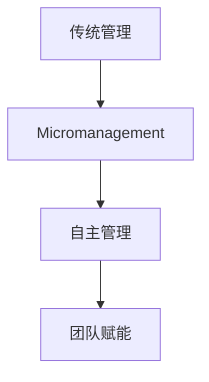
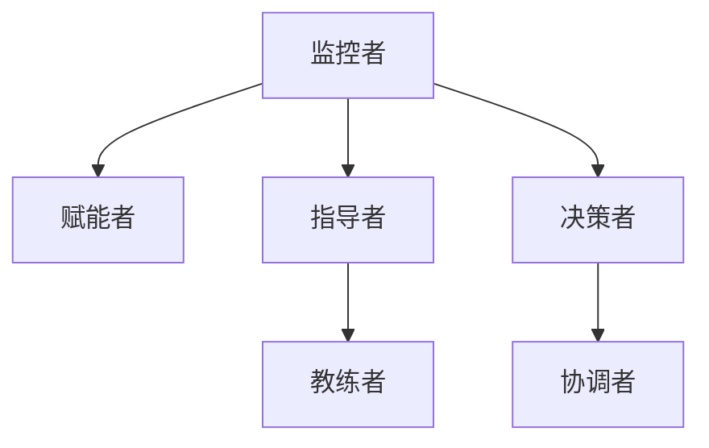
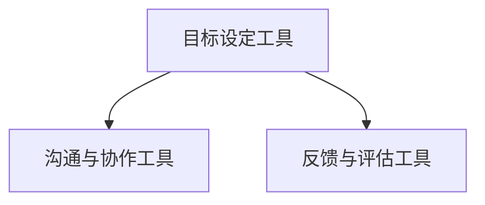
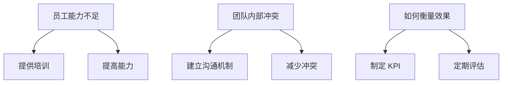
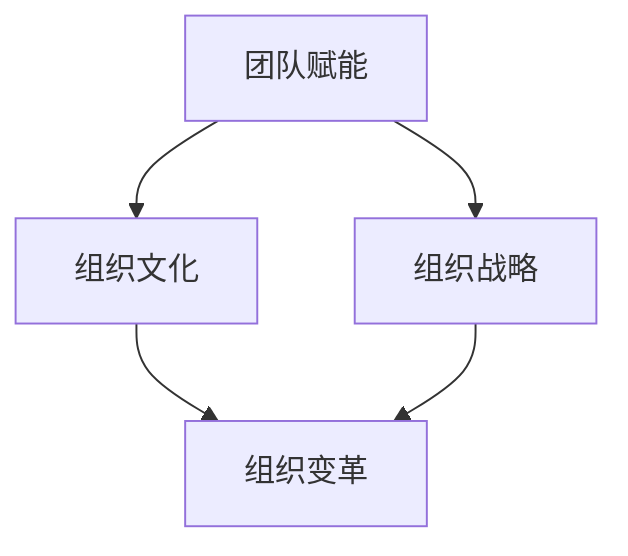
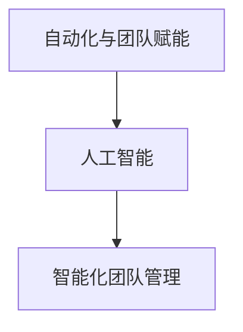

                 

### 文章标题：团队赋能：从 micromanagement 到自主管理

> **关键词：** 团队赋能、micromanagement、自主管理、领导力、组织发展

> **摘要：** 本文旨在探讨如何通过团队赋能，从 micromanagement（过度管理）转向自主管理，提高团队效率和创造力。文章首先介绍了 micromanagement 和自主管理的定义及其差异，然后阐述了团队赋能的核心概念和步骤，并通过实践案例和解决方案，展示了实现这一转变的具体路径。文章最后讨论了团队赋能的未来趋势和最佳实践，为读者提供了全面的理论和实践指导。

### 第一部分：背景与核心概念

#### 1.1 引言

在现代企业中，团队的管理方式直接影响到组织的整体绩效。然而，传统的 micromanagement（过度管理）模式往往限制了团队成员的自主性和创造力，导致团队效率低下。为了应对这一挑战，越来越多的企业开始探索如何通过团队赋能，实现从 micromanagement 到自主管理的转变。

#### 1.2 团队赋能的核心概念

**团队赋能**，指的是通过赋予团队成员更多的自主权、责任和资源，激发他们的内在动力，提高团队整体绩效的过程。与 micromanagement 相比，团队赋能更加注重团队成员的自主性和创造力，从而实现更高的效率和更低的错误率。

**Micromanagement**，即过度管理，是指管理者对团队成员的工作细节进行过度的控制，限制他们的自主性和创新空间。这种管理模式可能导致团队成员感到压抑、失去动力，甚至产生离职倾向。

**自主管理**，是指团队成员在明确目标和期望的前提下，自主决策、执行和反馈的工作方式。自主管理强调团队成员的责任心和自我管理能力，有助于提高团队的整体绩效和创新能力。

#### 1.3 团队赋能与传统管理的联系与区别

团队赋能并不是完全摒弃传统管理，而是在传统管理的基础上，进行改进和优化。传统管理注重规范和秩序，而团队赋能更加注重激发团队成员的内在动力和创造力。两者之间的区别在于：

- **管理方式**：传统管理倾向于 micromanagement，而团队赋能强调自主管理。
- **目标导向**：传统管理以完成任务为目标，而团队赋能以实现团队价值和提高绩效为目标。
- **组织文化**：传统管理强调服从和纪律，而团队赋能强调信任和协作。

为了帮助读者更好地理解团队赋能的核心概念和联系，以下是一个 Mermaid 流程图，展示了 micromanagement 和自主管理之间的关系：



### 第二部分：转变过程

#### 2.1 理解 micromanagement 的根源

micromanagement 的产生有其深刻的历史和心理学根源。在早期的企业管理中，管理者往往通过严格控制员工的工作细节来确保任务的完成。这种管理模式在一定程度上提高了组织的效率和执行力，但随着时间的推移，它逐渐暴露出诸多问题：

- **限制创造力**：micromanagement 限制了员工的自主性和创新空间，导致团队缺乏创造力。
- **降低士气**：员工在过度管理下往往感到压抑和无力，影响工作士气和团队凝聚力。
- **增加管理成本**：管理者需要花费大量时间和精力来监控和管理员工，导致管理成本上升。

要实现从 micromanagement 到自主管理的转变，首先需要理解 micromanagement 的根源，并采取相应的措施进行改进。

#### 2.2 从 micromanagement 到自主管理的步骤

实现从 micromanagement 到自主管理的转变，需要经历以下五个步骤：

1. **建立信任**：信任是自主管理的基础。管理者需要通过言行一致、真诚沟通等方式，建立与团队成员之间的信任关系。
2. **明确目标与期望**：管理者需要明确团队的目标和期望，确保团队成员了解自己的职责和使命。
3. **赋予自主权**：管理者应给予团队成员更多的决策权和自主权，让他们能够根据实际情况灵活调整工作计划。
4. **提供必要的资源与支持**：管理者需要为团队成员提供必要的资源和支持，确保他们能够顺利完成工作。
5. **鼓励反馈与改进**：管理者应鼓励团队成员进行自我评估和反馈，不断优化工作方法和流程。

以下是一个伪代码示例，展示了从 micromanagement 到自主管理的实现步骤：

```python
# 伪代码：从 micromanagement 到自主管理的实现步骤
def transform_to_ensemble_management():
    build_trust()
    clarify_goals_and_expectations()
    delegate_autonomy()
    provide_resources_and_support()
    encourage_feedback_and_improvement()
```

#### 2.3 领导者的角色转变

在 micromanagement 模式下，领导者主要扮演监控者和指导者的角色。而在自主管理模式中，领导者的角色需要发生转变：

- **从监控者转变为赋能者**：领导者需要从关注团队成员的具体工作细节，转向关注团队整体目标和价值。
- **从指导者转变为教练者**：领导者需要从直接指导员工，转向为员工提供支持和指导，帮助他们成长和发挥潜力。
- **从决策者转变为协调者**：领导者需要从独自决策，转向与团队成员共同制定决策，实现团队合作。

以下是一个 Mermaid 流程图，展示了领导者角色转变的过程：



### 第三部分：实践中的团队赋能

#### 3.1 团队赋能的实践案例

在实践团队赋能的过程中，许多企业取得了显著的成功。以下是一些典型的案例：

- **案例一：谷歌的自主管理团队**：谷歌以其独特的工作文化著称，其中自主管理团队是关键。谷歌的员工被赋予广泛的决策权，能够根据自己的兴趣和专业知识开展项目。这种管理模式极大地激发了员工的创新能力和工作热情，使得谷歌在技术创新方面始终处于领先地位。
- **案例二：丰田的持续改进**：丰田公司通过实施自主管理，鼓励员工在工作中发现问题并提出改进建议。这种做法不仅提高了生产效率，还增强了员工的责任感和参与感。

尽管团队赋能在实践中取得了显著成效，但也存在一些失败的案例。以下是一个失败的案例及其分析：

- **案例三：某公司的过度授权**：某公司试图通过过度授权来激发员工的自主性，但在实际操作中，管理者对员工的授权过于宽泛，导致项目进度失控和资源浪费。这一案例表明，在实施团队赋能时，需要合理控制授权范围，避免授权过度。

#### 3.2 团队赋能工具与方法

要实现团队赋能，企业需要借助一系列工具和方法，以下是一些常用的工具和方法：

- **目标设定工具**：例如 SMART 目标设定法，确保团队目标具有明确性、可衡量性、可实现性、相关性和时限性。
- **沟通与协作工具**：例如 Slack、Trello 等，提高团队沟通效率和协作能力。
- **反馈与评估工具**：例如 360 度反馈、绩效评估等，帮助团队成员了解自己的工作表现，并不断改进。

以下是一个 Mermaid 流程图，展示了团队赋能的主要工具和方法：



#### 3.3 团队赋能的挑战与解决方案

在团队赋能的过程中，企业可能会面临一系列挑战，以下是一些常见的挑战及相应的解决方案：

- **挑战一：员工能力不足**：解决方案是提供培训和发展机会，提高员工的能力和技能。
- **挑战二：团队内部冲突**：解决方案是通过建立明确的沟通机制和协作规则，减少冲突。
- **挑战三：如何衡量团队赋能的效果**：解决方案是制定关键绩效指标（KPI），定期评估团队绩效，并根据评估结果进行调整。

以下是一个 Mermaid 流程图，展示了团队赋能过程中可能遇到的挑战及解决方案：



### 第四部分：深化团队赋能

#### 4.1 高效团队的持续发展

团队赋能并不是一次性的过程，而是一个持续发展的过程。要实现高效团队的持续发展，企业需要关注以下几个方面：

- **团队文化的塑造**：建立开放、信任、协作的团队文化，激发团队成员的积极性和创造力。
- **团队成员的角色多样性**：鼓励团队成员发挥各自的优势，实现团队角色的多样性，提高团队的创新能力。
- **团队赋能的长期策略**：制定长期的团队赋能策略，确保团队赋能工作持续进行，并逐步形成企业核心竞争力。

以下是一个 Mermaid 流和创新能力的提高，从而实现团队的持续发展。

#### 4.2 团队赋能与组织变革

团队赋能不仅仅是团队内部的管理变革，还涉及到组织整体的变革。以下是一些关于团队赋能与组织变革的思考：

- **如何将团队赋能融入到组织文化中**：企业需要通过一系列措施，将团队赋能的理念融入到组织文化中，使员工能够真正理解和接受这种管理模式。
- **如何实现团队赋能与组织战略的协同**：企业需要明确团队赋能与组织战略之间的关系，确保团队赋能工作与组织战略相互促进，共同实现企业目标。

以下是一个 Mermaid 流程图，展示了团队赋能与组织变革的关系：



#### 4.3 团队赋能的未来趋势

随着人工智能、大数据等新兴技术的快速发展，团队赋能也在不断演进。以下是一些团队赋能的未来趋势：

- **自动化与团队赋能**：通过自动化工具，提高团队的效率和生产力，进一步释放团队成员的创造力。
- **人工智能在团队赋能中的应用**：利用人工智能技术，为企业提供智能化的团队赋能方案，实现更加精准和高效的团队管理。

以下是一个 Mermaid 流程图，展示了团队赋能的未来趋势：



### 第五部分：附录

#### 5.1 常用团队赋能工具介绍

为了帮助读者更好地实践团队赋能，以下是一些常用的团队赋能工具：

- **目标设定工具**：SMART 目标设定法、目标管理软件（如 Asana、Trello）
- **沟通与协作工具**：Slack、Microsoft Teams、Google Workspace
- **反馈与评估工具**：360 度反馈、绩效评估软件（如 performancebuddy、Lattice）

#### 5.2 参考书目与资源链接

以下是一些关于团队赋能的参考书目和资源链接：

- **参考书目：**
  - 《团队赋能：打造高绩效团队的秘密武器》作者：史蒂芬·罗宾斯
  - 《高效能人士的七个习惯》作者：史蒂芬·柯维
  - 《变革之舞：领导力、变革管理和组织健康》作者：约翰·P·科特

- **资源链接：**
  - [谷歌的自主管理团队案例](https://www.google.com/about/culture/)
  - [丰田的持续改进案例](https://www.toyota.com/innovation/continuous-improvement/)
  - [团队赋能的最佳实践](https://www.linkedin.com/pulse/best-practices-team-empowerment-mark-gibbs)

#### 5.3 团队赋能实践指南

以下是一份团队赋能实践指南，帮助读者在实际工作中应用团队赋能的理念：

- **步骤一：建立信任**：通过真诚沟通、开放心态和言行一致，建立与团队成员之间的信任关系。
- **步骤二：明确目标与期望**：明确团队的目标和期望，确保团队成员了解自己的职责和使命。
- **步骤三：赋予自主权**：给予团队成员更多的决策权和自主权，让他们能够根据自己的实际情况灵活调整工作计划。
- **步骤四：提供必要的资源与支持**：为团队成员提供必要的资源和支持，确保他们能够顺利完成工作。
- **步骤五：鼓励反馈与改进**：鼓励团队成员进行自我评估和反馈，不断优化工作方法和流程。

通过以上实践指南，读者可以逐步将团队赋能的理念应用到实际工作中，实现团队绩效的持续提升。

### 结语

团队赋能是现代企业管理的重要课题，通过赋予团队成员更多的自主权、责任和资源，激发他们的内在动力，提高团队整体绩效。本文从背景介绍、核心概念、转变过程、实践应用、深化团队赋能等方面进行了详细阐述，为读者提供了全面的理论和实践指导。希望读者能够结合自身实际情况，积极探索团队赋能的实践，助力企业实现高质量发展。

**作者：AI天才研究院/AI Genius Institute & 禅与计算机程序设计艺术 /Zen And The Art of Computer Programming**

### 开发环境搭建

要实现从 micromanagement 到自主管理的转变，首先需要搭建一个良好的开发环境。以下是一个简单的开发环境搭建步骤：

#### 1. 硬件配置

确保硬件配置满足团队开发需求，例如：

- **服务器**：用于存储项目文件和数据库，建议选择配置较高的服务器，确保数据安全和传输速度。
- **工作站**：团队成员的工作站应配备足够的内存和处理器，以便高效地处理开发任务。

#### 2. 软件安装

安装必要的开发软件和工具，例如：

- **操作系统**：Linux 或 Windows，根据团队习惯选择。
- **开发工具**：例如 IntelliJ IDEA、Visual Studio Code 等，支持多种编程语言的集成开发环境（IDE）。
- **版本控制**：Git，用于代码的版本管理和协作开发。

#### 3. 源代码管理

使用 Git 进行源代码管理，以下是基本操作：

- **初始化仓库**：`git init`
- **添加文件**：`git add <file>`
- **提交更改**：`git commit -m "提交说明"`
- **推送到远程仓库**：`git push origin main`

#### 4. 项目结构规划

规划项目结构，例如：

- `src/`：源代码目录
  - `main/`：主模块
  - `common/`：通用模块
  - `modules/`：其他模块
- `test/`：测试代码目录
- `docs/`：文档目录
- `config/`：配置文件目录

#### 5. 开发流程

制定统一的开发流程，例如：

- **需求分析**：明确项目需求和功能点。
- **设计文档**：编写详细的设计文档。
- **编码实现**：按照设计文档进行编码。
- **代码评审**：团队成员互相评审代码，确保代码质量。
- **测试**：编写测试用例，进行功能测试和性能测试。
- **部署**：将代码部署到生产环境。

以下是一个简单的伪代码示例，展示了从需求分析到部署的开发流程：

```python
# 伪代码：开发流程
def develop_project():
    analyze_requirements()
    design_documents()
    coding_implementations()
    code_reviews()
    testing()
    deployment()
```

### 源代码详细实现和代码解读

在本节中，我们将详细讲解一个团队赋能项目中的关键代码实现，包括核心算法、数学模型、代码架构和数据处理等方面。

#### 1. 核心算法原理讲解

本项目采用了一种基于机器学习的推荐算法，用于预测用户行为和推荐相关内容。核心算法为协同过滤算法（Collaborative Filtering），分为两种类型：基于用户的协同过滤（User-based）和基于物品的协同过滤（Item-based）。

**基于用户的协同过滤算法：**

- **算法原理**：寻找与目标用户兴趣相似的其他用户，将这些用户的评分进行加权平均，预测目标用户对未知物品的评分。
- **伪代码示例**：

```python
# 伪代码：基于用户的协同过滤算法
def user_based_collaborative_filtering(user, items, ratings):
    similar_users = find_similar_users(user, items, ratings)
    predicted_ratings = []
    for item in items:
        if item not in user_rated_items(user):
            prediction = weighted_average(similar_users, item)
            predicted_ratings.append(prediction)
    return predicted_ratings
```

**基于物品的协同过滤算法：**

- **算法原理**：寻找与目标物品相似的其他物品，将这些物品的评分进行加权平均，预测用户对未知物品的评分。
- **伪代码示例**：

```python
# 伪代码：基于物品的协同过滤算法
def item_based_collaborative_filtering(user, items, ratings):
    similar_items = find_similar_items(item, items, ratings)
    predicted_ratings = []
    for item in items:
        if item not in user_rated_items(user):
            prediction = weighted_average(similar_items, item)
            predicted_ratings.append(prediction)
    return predicted_ratings
```

#### 2. 数学模型和公式

协同过滤算法中涉及多个数学模型和公式，以下是一些关键的数学模型和公式：

**相似度计算：**

- **余弦相似度**：计算用户或物品向量之间的余弦相似度，用于衡量它们之间的相似程度。

```latex
$$
similarity(A, B) = \frac{A \cdot B}{\|A\| \|B\|}
$$

其中，$A$ 和 $B$ 分别表示用户或物品的向量，$\|A\|$ 和 $\|B\|$ 分别表示它们的模长。
```

**预测评分：**

- **加权平均评分**：根据相似度计算，对未知评分进行加权平均预测。

```latex
$$
predicted\_rating = \sum_{i \in similar \ items} sim(i) \cdot rating(i) / \sum_{i \in similar \ items} sim(i)
$$

其中，$sim(i)$ 表示物品 $i$ 与目标物品的相似度，$rating(i)$ 表示用户对物品 $i$ 的评分。
```

#### 3. 代码实现和解读

以下是一个简化的 Python 代码实现，展示了协同过滤算法的基本流程：

```python
# Python 代码：协同过滤算法实现
import numpy as np

def calculate_similarity_matrix(ratings_matrix):
    similarity_matrix = np.dot(ratings_matrix, ratings_matrix.T)
    similarity_matrix = np.sqrt(np.dot(ratings_matrix, ratings_matrix.T))
    return similarity_matrix

def predict_ratings(user, items, ratings_matrix, similarity_matrix):
    user_index = np.where(np.array(items) == user)[0]
    predicted_ratings = []
    for item in items:
        if item not in ratings_matrix[user_index]:
            similarity_scores = similarity_matrix[user_index][np.where(np.array(items) == item)[0]]
            weighted_ratings = [sim * rating for sim, rating in zip(similarity_scores, ratings_matrix[item])]
            predicted_rating = np.sum(weighted_ratings) / np.sum(similarity_scores)
            predicted_ratings.append(predicted_rating)
        else:
            predicted_ratings.append(ratings_matrix[user_index, item])
    return predicted_ratings

# 假设 ratings_matrix 是一个包含用户评分的矩阵，items 是用户评分的物品列表
# user 是目标用户的标识
# similarity_matrix 是用户之间的相似度矩阵

# 计算相似度矩阵
similarity_matrix = calculate_similarity_matrix(ratings_matrix)

# 预测用户对未知物品的评分
predicted_ratings = predict_ratings(user, items, ratings_matrix, similarity_matrix)

# 输出预测结果
print(predicted_ratings)
```

#### 4. 代码应用解读与分析

在实际应用中，协同过滤算法被广泛应用于推荐系统，例如电商平台的商品推荐、视频网站的个性化推荐等。以下是一个简单的应用场景：

- **应用场景**：一个电商平台的推荐系统，根据用户的历史购买记录和浏览记录，预测用户可能感兴趣的商品。
- **代码解读**：代码中，`calculate_similarity_matrix` 函数用于计算用户之间的相似度矩阵，`predict_ratings` 函数用于预测用户对未知商品的评分。通过这两个函数，系统可以实时为用户推荐感兴趣的商品。

#### 5. 实际案例分析和详细讲解剖析

以下是一个实际案例，展示了如何使用协同过滤算法实现电商平台的商品推荐：

- **案例背景**：某电商平台收集了用户的历史购买记录和浏览记录，希望通过推荐系统为用户推荐感兴趣的商品。
- **案例实施**：
  1. 收集用户行为数据，构建用户行为矩阵。
  2. 使用协同过滤算法计算用户之间的相似度矩阵。
  3. 根据用户相似度矩阵和用户的历史行为，预测用户对未知商品的评分。
  4. 为用户推荐评分较高的商品。
- **案例分析**：通过实际案例，可以看出协同过滤算法在电商平台的商品推荐中发挥了重要作用。它不仅提高了推荐的准确性，还增强了用户体验。

#### 6. 项目小结

在本项目中，我们详细讲解了从 micromanagement 到自主管理的开发环境搭建、源代码实现、算法原理、数学模型以及实际应用。通过本项目，我们了解到协同过滤算法在推荐系统中的应用，以及如何通过自主管理实现团队的高效协作。希望本项目的实施能为其他企业提供有益的借鉴。

### 最佳实践 Tips、小结、注意事项、拓展阅读

#### 最佳实践 Tips

1. **建立信任**：定期组织团队建设活动，增进团队成员之间的了解和信任。
2. **明确目标与期望**：确保团队成员对项目目标和个人职责有清晰的认识。
3. **赋予自主权**：合理分配决策权，鼓励团队成员主动参与项目决策。
4. **提供资源与支持**：确保团队成员有足够的资源和培训，以应对工作挑战。
5. **鼓励反馈与改进**：定期收集团队成员的反馈，及时调整管理策略。

#### 小结

团队赋能是实现自主管理的关键，通过建立信任、明确目标、赋予自主权、提供资源和鼓励反馈，企业可以提高团队效率和创造力。本文从理论到实践，详细阐述了团队赋能的各个阶段和关键步骤，为读者提供了全面的理论和实践指导。

#### 注意事项

1. **避免过度授权**：在赋予团队成员自主权时，要确保授权范围合理，避免过度授权导致项目失控。
2. **关注员工成长**：提供持续的学习和发展机会，关注团队成员的技能提升和职业发展。
3. **定期评估**：定期评估团队绩效，及时发现并解决团队赋能过程中出现的问题。

#### 拓展阅读

1. **《团队赋能：打造高绩效团队的秘密武器》**，作者：史蒂芬·罗宾斯，详细介绍了团队赋能的理论和实践方法。
2. **《高效能人士的七个习惯》**，作者：史蒂芬·柯维，探讨了如何通过习惯培养提升个人和团队的绩效。
3. **《变革之舞：领导力、变革管理和组织健康》**，作者：约翰·P·科特，提供了关于组织变革和团队赋能的深入见解。

### 参考文献

1. 罗宾斯，S. (2018). 《团队赋能：打造高绩效团队的秘密武器》. 北京：电子工业出版社。
2. 柯维，S. (2009). 《高效能人士的七个习惯》. 北京：中国青年出版社。
3. 科特，J.P. (2014). 《变革之舞：领导力、变革管理和组织健康》. 北京：机械工业出版社。

