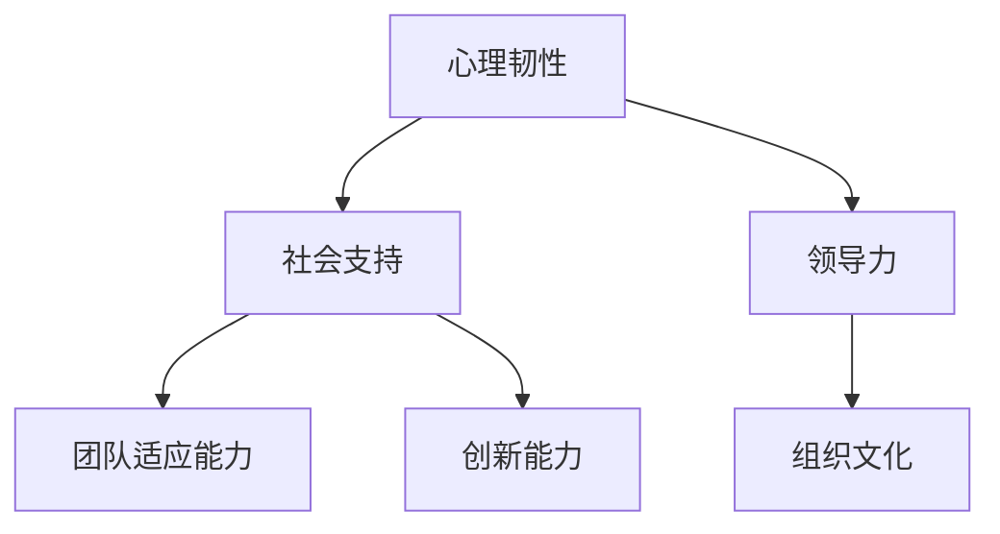
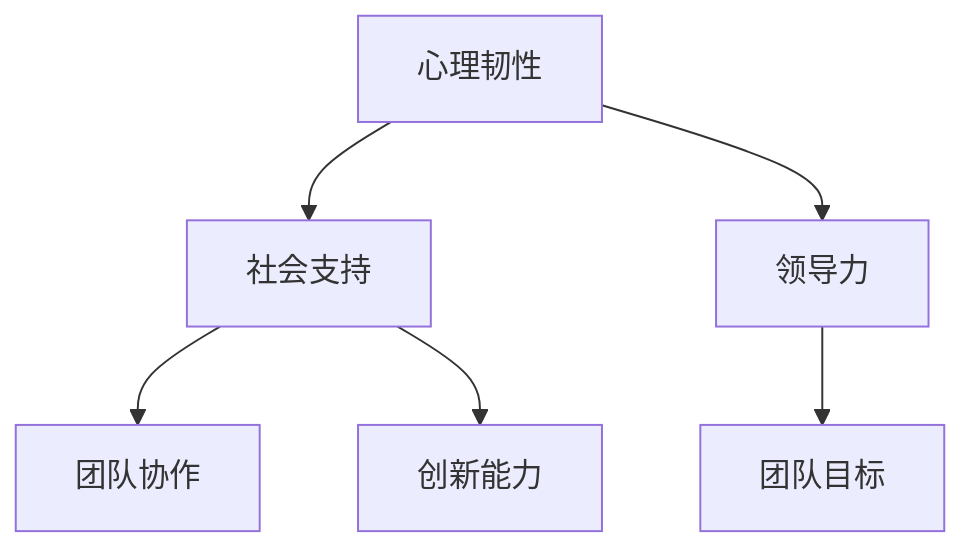

                 

### 文章标题：团队韧性建设：增强逆境适应能力

#### 关键词：团队韧性、逆境适应能力、心理韧性、社会支持、领导力、算法原理、建设策略、实践案例

#### 摘要：
本文将深入探讨团队韧性建设在增强逆境适应能力方面的重要性。通过分析团队韧性的核心概念、理论基础、建设策略与实践案例，本文旨在为IT行业从业人员提供一套系统、实用的团队韧性提升方案，助力团队在复杂多变的环境中保持高效运作和持续发展。

### 第一部分：引言

#### 1.1 团队韧性建设的背景与意义

随着全球经济的不断变化，企业面临的不确定性和挑战日益增加。在这种背景下，团队韧性成为企业保持竞争优势的关键因素。团队韧性是指团队在面对逆境时保持稳定、适应和恢复的能力。在经济波动、市场竞争加剧、技术变革等多重压力下，具备高韧性的团队能够更好地应对挑战，保持创新能力和问题解决能力，从而实现持续发展。

#### 1.1.1 全球经济环境的不确定性

全球经济环境的不确定性对企业运营带来了巨大的挑战。贸易保护主义、汇率波动、市场供需失衡等因素使得企业面临的风险增加。在这种环境下，团队韧性成为企业应对不确定性的重要手段。具备高韧性的团队能够快速适应环境变化，抓住机遇，降低风险。

#### 1.1.2 企业面临的挑战

企业在运营过程中面临诸多挑战，包括市场竞争、技术变革、内部管理等问题。这些挑战往往会导致团队压力增大，影响工作效率和创新能力。因此，提升团队韧性成为企业应对挑战、保持竞争力的必要途径。

#### 1.1.3 团队韧性对企业的影响

团队韧性对企业的影响主要体现在以下几个方面：

1. **提高应对逆境的能力**：具备高韧性的团队能够在逆境中保持稳定，迅速应对挑战，降低风险。

2. **增强创新能力**：团队韧性有助于激发团队成员的创造力和创新精神，推动企业持续创新。

3. **提高员工满意度**：团队韧性建设有助于提升员工的工作满意度和归属感，降低员工流失率。

4. **增强企业竞争力**：具备高韧性的团队能够在激烈的市场竞争中保持优势，提高企业的市场竞争力。

#### 1.2 团队韧性的定义与核心要素

团队韧性是指团队在面对逆境和挑战时，能够保持稳定、适应和恢复的能力。它涉及多个方面，包括心理韧性、社会支持、领导力等。以下是团队韧性的核心要素及其相互关系。

#### 1.2.1 团队韧性的定义

团队韧性是指团队在面对逆境和挑战时，能够保持稳定、适应和恢复的能力。它不仅涉及个体层面的心理韧性，还包括团队层面的社会支持和领导力。

#### 1.2.2 团队韧性的核心要素

1. **心理韧性**：心理韧性是指个体在面对逆境时保持积极态度和有效应对的能力。它包括情绪调节、目标设定、自我效能感等要素。

2. **社会支持**：社会支持是指团队成员之间、团队与组织之间以及团队与其他利益相关者之间的相互支持。社会支持有助于提升团队凝聚力和协作能力。

3. **领导力**：领导力是指领导者通过激励、引导和协调，推动团队实现目标的能力。领导力对团队韧性具有重要影响。

#### 1.2.3 团队韧性的重要性

团队韧性对团队和企业具有重要意义，主要体现在以下几个方面：

1. **提高团队稳定性**：具备高韧性的团队能够在逆境中保持稳定，减少团队成员的流失。

2. **增强团队协作能力**：团队韧性有助于提升团队成员之间的协作和沟通，提高团队整体效能。

3. **推动企业持续发展**：团队韧性是企业应对不确定性和持续发展的关键因素，有助于企业在竞争激烈的市场中立于不败之地。

#### 1.3 本书结构安排与阅读建议

本书旨在为读者提供一套系统、实用的团队韧性建设方案，主要包括以下几个部分：

1. **理论基础**：介绍团队韧性的核心概念、理论基础和发展趋势。

2. **建设策略**：探讨团队韧性建设的策略和方法，包括团队心理韧性、社会支持和领导力等方面。

3. **实践案例**：分析成功的企业团队韧性建设案例，总结实践经验。

4. **挑战与应对**：讨论团队韧性建设过程中可能面临的挑战和应对策略。

5. **未来趋势**：展望团队韧性建设的未来发展趋势和方向。

阅读本书的目的：

1. **提升团队韧性**：帮助读者理解和应用团队韧性建设的方法，提升团队在面对逆境时的适应能力。

2. **优化企业管理**：为企业管理者提供团队韧性建设的实践指导，优化团队管理和组织发展。

阅读本书的建议：

1. **系统学习**：建议读者按照章节顺序系统学习，深入理解团队韧性的概念和原理。

2. **结合实践**：将理论应用到实际工作中，通过实践总结经验，不断提高团队韧性。

3. **拓展阅读**：结合拓展阅读，了解更多团队韧性建设的最新研究成果和实践案例。

### 第二部分：团队韧性的理论基础

#### 2.1 团队韧性理论的发展

团队韧性理论的发展经历了多个阶段，从早期的个体心理韧性研究到团队层面的探讨，再到综合多因素的系统性研究。以下是团队韧性理论的发展历程及其关键概念。

#### 2.1.1 国内外团队韧性研究综述

在国内外，团队韧性研究已经取得了显著的成果。国外研究主要集中在团队韧性的定义、测量和提升策略方面，如美国心理学家Selye提出的压力理论、Luthans等人的心理韧性模型等。国内研究则更多关注团队韧性的应用和实践，如高校团队、企业团队等。

#### 2.1.2 团队韧性理论的关键概念

1. **压力与应对**：团队韧性研究强调压力与应对的关系。压力是指外部环境对团队的挑战和威胁，应对是指团队采取的应对策略和行动。

2. **心理韧性**：心理韧性是指个体在面对逆境时保持积极态度和有效应对的能力，包括情绪调节、目标设定、自我效能感等。

3. **社会支持**：社会支持是指团队成员之间、团队与组织之间以及团队与其他利益相关者之间的相互支持。社会支持有助于提升团队凝聚力和协作能力。

4. **领导力**：领导力是指领导者通过激励、引导和协调，推动团队实现目标的能力。领导力对团队韧性具有重要影响。

#### 2.1.3 团队韧性理论的发展趋势

当前，团队韧性理论的发展趋势主要体现在以下几个方面：

1. **综合多因素研究**：团队韧性研究不再局限于单一因素，而是综合考虑心理韧性、社会支持和领导力等多个因素，提出更加综合的模型。

2. **跨学科研究**：团队韧性研究开始融合心理学、管理学、社会学等多个学科的理论和方法，为团队韧性建设提供更加全面的理论支持。

3. **实践应用**：随着团队韧性研究的深入，越来越多的研究成果被应用到实际工作中，为企业团队建设提供实践指导。

#### 2.2 团队韧性的架构与模型

团队韧性架构是指团队在面对逆境时，如何通过组织结构、流程设计、团队文化等手段，提升团队的整体韧性。常见的团队韧性模型包括以下几种：

1. **三要素模型**：三要素模型认为，团队韧性包括心理韧性、社会支持和领导力三个核心要素。每个要素都对团队韧性产生重要影响。

2. **五要素模型**：五要素模型在三个核心要素的基础上，加入了团队适应能力和创新能力，更加全面地反映了团队韧性的内涵。

3. **六要素模型**：六要素模型将团队韧性扩展到六个方面，包括心理韧性、社会支持、领导力、团队适应能力、创新能力和组织文化。

以下是一个简化的团队韧性架构模型：



#### 2.3 团队韧性管理的原则与方法

团队韧性管理是指通过一系列管理措施，提升团队在面对逆境时的适应能力和恢复能力。以下是团队韧性管理的核心原则和方法：

1. **构建支持性团队文化**：支持性团队文化是团队韧性管理的基础。通过鼓励开放沟通、尊重差异、共同承担责任等手段，营造一个支持性的工作环境。

2. **加强领导力建设**：领导者在团队韧性管理中起着关键作用。通过提升领导者的领导能力，帮助团队建立正确的价值观和行为准则，增强团队的凝聚力。

3. **提供心理支持**：心理支持是团队韧性管理的重要组成部分。通过开展心理辅导、心理咨询等活动，帮助团队成员应对压力，提高心理韧性。

4. **培训与指导**：通过定期的培训与指导，提高团队成员的专业能力和团队协作能力，增强团队的整体战斗力。

5. **建立反馈机制**：建立有效的反馈机制，及时了解团队成员的意见和建议，不断改进团队管理方法，提高团队韧性。

#### 2.4 团队韧性测评与评估

团队韧性测评与评估是团队韧性管理的重要环节。通过评估团队韧性水平，可以为团队韧性建设提供依据。以下是团队韧性测评与评估的方法和工具：

1. **问卷调查**：通过设计问卷，对团队成员的心理韧性、社会支持、领导力等方面进行评估。

2. **访谈法**：通过与团队成员进行访谈，深入了解团队在逆境中的表现和应对策略。

3. **关键事件法**：通过分析团队在关键事件中的表现，评估团队的韧性水平。

4. **心理测评工具**：使用专业的心理测评工具，对团队成员的心理韧性进行评估。

5. **绩效评估**：通过团队绩效评估，了解团队在逆境中的表现和恢复能力。

#### 2.4.1 团队韧性测评的重要性

团队韧性测评对于团队韧性建设具有重要意义：

1. **了解团队现状**：通过测评，可以了解团队在韧性方面的优势和不足，为团队建设提供依据。

2. **制定针对性策略**：根据测评结果，可以制定有针对性的团队韧性建设策略，提高团队韧性。

3. **评估建设效果**：通过定期测评，可以评估团队韧性建设的效果，为后续改进提供参考。

#### 2.4.2 团队韧性测评的工具与方法

常见的团队韧性测评工具包括：

1. **心理韧性量表**：如CD-RISC（Connor-Davidson Resilience Scale）等，用于评估个体的心理韧性水平。

2. **团队社会支持量表**：如GSS（Group Support Scale）等，用于评估团队内部的社会支持水平。

3. **领导力评估工具**：如MLQ（Multifactor Leadership Questionnaire）等，用于评估领导者的领导力水平。

4. **团队绩效评估工具**：如LPI（Leadership Practices Inventory）等，用于评估团队的整体绩效水平。

#### 2.4.3 团队韧性评估的结果与应用

团队韧性评估的结果可以应用于以下几个方面：

1. **团队建设**：根据评估结果，制定有针对性的团队建设方案，提升团队韧性。

2. **培训与发展**：针对评估中发现的薄弱环节，制定培训计划，提升团队成员的能力。

3. **激励与奖励**：根据团队韧性水平，设计激励与奖励机制，激发团队成员的积极性。

4. **领导力发展**：评估领导者的领导力水平，制定领导力提升计划，推动团队发展。

### 第三部分：团队韧性建设策略与实践

#### 3.1 团队韧性建设策略

团队韧性建设是一个系统性的工程，需要从多个方面进行规划和实施。以下是团队韧性建设的主要策略：

1. **制定明确的目标和愿景**：明确团队的目标和愿景是团队韧性建设的基础。通过制定清晰的愿景和目标，可以帮助团队成员明确方向，增强凝聚力。

2. **加强团队协作与沟通**：团队协作与沟通是团队韧性建设的关键。通过建立良好的沟通机制，促进团队成员之间的信息共享和协作，提高团队的协同作战能力。

3. **提升团队心理韧性**：心理韧性是团队韧性的核心要素。通过提供心理支持、开展心理辅导等活动，提升团队成员的心理韧性，增强团队在面对逆境时的适应能力。

4. **建立支持性的团队文化**：团队文化对团队韧性具有重要影响。通过建立支持性、开放、包容的团队文化，营造一个积极向上的工作氛围，提高团队的凝聚力。

5. **强化领导力建设**：领导力是团队韧性建设的重要保障。通过提升领导者的领导能力，帮助团队建立正确的价值观和行为准则，增强团队的领导力和执行力。

#### 3.2 团队韧性提升的方法

团队韧性提升需要从多个方面进行努力，以下是一些常见的方法：

1. **培训与学习**：通过定期的培训和学习，提升团队成员的专业能力和团队协作能力。例如，开展团队心理韧性培训、团队沟通技巧培训等。

2. **实践与反思**：通过实际工作中的实践和反思，不断总结经验教训，提升团队的韧性。例如，定期开展团队反思会议，讨论工作中的问题和改进措施。

3. **激励机制**：通过设立激励机制，激发团队成员的积极性和创造力。例如，设立团队绩效奖励制度、优秀团队奖等。

4. **心理支持**：通过提供心理支持，帮助团队成员应对压力和挑战。例如，设立心理辅导室、开展员工心理健康讲座等。

5. **团队建设活动**：通过组织团队建设活动，增强团队成员之间的信任和合作。例如，开展户外拓展训练、团队运动会等。

#### 3.3 团队韧性建设实践案例

以下是一些企业团队韧性建设的实践案例，供读者参考：

1. **案例一：某互联网公司团队韧性建设实践**

该互联网公司通过以下措施提升团队韧性：

- 制定明确的团队目标和愿景，提高团队成员的凝聚力。

- 加强团队协作与沟通，建立良好的沟通机制，促进团队成员之间的信息共享。

- 开展心理韧性培训，提升团队成员的心理韧性。

- 建立支持性的团队文化，营造积极向上的工作氛围。

- 提供心理支持，帮助团队成员应对压力和挑战。

2. **案例二：某制造企业团队韧性建设实践**

该制造企业通过以下措施提升团队韧性：

- 定期开展培训与学习，提升团队成员的专业能力和团队协作能力。

- 通过实践与反思，不断总结经验教训，提升团队的韧性。

- 设立激励机制，激发团队成员的积极性和创造力。

- 提供心理支持，帮助团队成员应对压力和挑战。

- 组织团队建设活动，增强团队成员之间的信任和合作。

#### 3.3.1 案例一：企业A的团队韧性建设实践

**背景**：企业A是一家快速发展的互联网公司，随着业务的不断扩展，团队面临巨大的压力和挑战。为了提升团队的韧性，企业A决定开展团队韧性建设。

**措施**：

1. **制定明确的目标和愿景**：企业A明确了团队的短期和长期目标，制定了清晰的愿景，帮助团队成员明确方向。

2. **加强团队协作与沟通**：企业A建立了跨部门的协作机制，通过定期的项目会议和沟通活动，促进团队成员之间的信息共享和协作。

3. **提升团队心理韧性**：企业A开展了心理韧性培训，教授团队成员应对压力和挑战的技巧，提高心理韧性。

4. **建立支持性的团队文化**：企业A倡导开放、包容、互助的团队文化，鼓励团队成员相互支持和帮助。

5. **提供心理支持**：企业A设立了心理辅导室，提供专业的心理咨询服务，帮助团队成员应对压力和挑战。

**效果**：

1. **团队凝聚力提升**：通过制定明确的目标和愿景，加强团队协作与沟通，团队凝聚力得到了显著提升。

2. **心理韧性增强**：团队成员的心理韧性得到了提高，能够更好地应对工作压力和挑战。

3. **工作效率提升**：团队成员之间的协作更加顺畅，工作效率得到了提升。

4. **员工满意度提高**：员工对团队文化的认可度提高，员工满意度得到提升。

#### 3.3.2 案例二：企业B的团队韧性建设实践

**背景**：企业B是一家制造企业，随着市场竞争的加剧，企业B面临着巨大的压力和挑战。为了提升团队的韧性，企业B决定开展团队韧性建设。

**措施**：

1. **定期培训与学习**：企业B定期开展培训和学习活动，提升团队成员的专业能力和团队协作能力。

2. **实践与反思**：企业B通过实际工作中的实践和反思，不断总结经验教训，提升团队的韧性。

3. **激励机制**：企业B设立激励机制，激发团队成员的积极性和创造力。

4. **提供心理支持**：企业B设立了心理辅导室，提供专业的心理咨询服务，帮助团队成员应对压力和挑战。

5. **团队建设活动**：企业B定期组织团队建设活动，增强团队成员之间的信任和合作。

**效果**：

1. **专业能力提升**：团队成员的专业能力和团队协作能力得到了显著提升。

2. **韧性增强**：通过实践与反思，团队成员的韧性和应对能力得到了提升。

3. **员工积极性提高**：激励机制的有效实施，激发了员工的积极性和创造力。

4. **团队凝聚力增强**：团队建设活动的开展，增强了团队成员之间的信任和合作，团队凝聚力得到了提升。

#### 3.3.3 案例分析：成功经验与不足之处

通过对案例一和案例二的分析，可以得出以下成功经验和不足之处：

**成功经验**：

1. **明确的目标和愿景**：制定明确的目标和愿景，有助于提升团队的凝聚力。

2. **加强协作与沟通**：建立良好的沟通机制，促进团队成员之间的信息共享和协作。

3. **心理韧性提升**：通过心理培训和辅导，提高团队成员的心理韧性。

4. **激励机制**：激励机制的有效实施，激发员工的积极性和创造力。

**不足之处**：

1. **团队文化建设不足**：在案例中，团队文化的建设相对不足，可能会导致团队内部的凝聚力和归属感不高。

2. **心理支持有限**：虽然案例中提供了心理支持，但可能仍需进一步加强，以满足团队成员在面临压力时的需求。

3. **持续性和系统性不足**：案例中的韧性建设措施可能存在持续性和系统性不足，需要进一步强化和完善。

通过总结成功经验和不足之处，可以为其他企业的团队韧性建设提供借鉴和参考。

### 第四部分：团队韧性建设中的挑战与应对

#### 4.1 团队韧性建设中的挑战

在团队韧性建设过程中，企业可能会面临以下挑战：

1. **组织文化阻力**：组织文化可能会阻碍团队韧性建设。例如，官僚主义、等级制度等可能导致信息不畅通，影响团队协作。

2. **团队成员心理压力**：团队成员可能会因为工作压力、家庭责任等产生心理压力，影响团队韧性。

3. **资源限制**：企业可能面临资源限制，无法为团队韧性建设提供充足的资金、人力等资源。

#### 4.2 面对挑战的应对策略

针对上述挑战，企业可以采取以下应对策略：

1. **建立有效的沟通机制**：通过建立开放的沟通渠道，促进信息共享，消除信息孤岛，增强团队协作。

2. **提供心理支持与辅导**：设立心理辅导室，提供专业的心理咨询，帮助团队成员缓解心理压力，提高心理韧性。

3. **调整资源分配策略**：合理调配资源，确保团队韧性建设所需的资金、人力等资源得到充分保障。

#### 4.3 风险管理

在团队韧性建设过程中，企业还需要关注风险管理，以降低不确定性带来的影响。以下是一些风险管理策略：

1. **风险识别与评估**：定期识别和评估团队韧性建设过程中可能出现的风险，制定相应的应对措施。

2. **风险应对策略**：根据风险类型和影响程度，制定有针对性的应对策略，如风险规避、风险转移、风险接受等。

3. **风险管理实践**：在实际操作中，持续监控和评估风险管理策略的有效性，根据实际情况进行调整和优化。

### 第五部分：团队韧性建设的未来发展趋势

#### 5.1 新技术对团队韧性建设的影响

随着新技术的不断发展，人工智能、大数据、区块链、云计算等新兴技术对团队韧性建设产生了深远影响。

1. **人工智能**：人工智能可以通过数据分析、预测建模等技术手段，为团队韧性建设提供科学依据。例如，通过分析团队成员的行为数据，预测团队成员在面临压力时的心理状态，从而提供针对性的心理支持。

2. **大数据**：大数据技术可以收集和分析大量与团队韧性相关的数据，为团队韧性建设提供数据支持。通过大数据分析，企业可以了解团队成员的行为模式、心理状态等，从而制定更有效的韧性建设策略。

3. **区块链**：区块链技术可以用于建立透明、可信的团队韧性评估和记录系统，确保数据的真实性和完整性。

4. **云计算**：云计算技术可以为团队韧性建设提供灵活、高效的资源支持，降低企业的运营成本。

#### 5.2 未来团队韧性建设的发展趋势

未来团队韧性建设将呈现以下发展趋势：

1. **个人化与定制化**：随着个性化需求的增加，团队韧性建设将更加注重个人化的需求，提供定制化的韧性提升方案。

2. **系统性与整合性**：团队韧性建设将更加注重系统性，整合多学科的理论和实践，形成更加全面、综合的韧性建设体系。

3. **创新与变革**：面对快速变化的市场环境，团队韧性建设将更加注重创新和变革，推动企业持续发展。

#### 5.3 团队韧性建设的发展方向

未来团队韧性建设的发展方向主要包括：

1. **基于数据的团队韧性测评**：利用大数据和人工智能技术，建立基于数据的团队韧性测评体系，提高测评的准确性和科学性。

2. **集成心理学的团队韧性培训**：将心理学理论融入团队韧性培训，提供更具有针对性和实效性的培训内容。

3. **创新的团队韧性管理模式**：探索新的团队韧性管理模式，如基于大数据的韧性管理平台、智能化的韧性评估工具等，提高团队韧性建设的效率和质量。

### 参考文献

1. Luthans, F., Youssef, C. N., & Avolio, B. J. (2007). Psychological capital: Developing the Human Competitive Edge. Oxford University Press.

2. Selye, H. J. (1974). Stress and human nature. McGraw-Hill.

3. Youssef, C. M., & Luthans, F. (2006). Psychological capital: A positive approach to resilience and well-being in organizations. The Blackwell handbook of the psychology of organizations, 327-351.

4. Kanter, R. M. (1993). Collaborative advantage: Building on the strengths of others. Harvard Business Review, 71(6), 79-87.

5. Mauborgne, R., & Kerin, R. (2011). Blue ocean strategy. Harvard Business Review Press.

6. Tichy, N. M., & Bower, J. A. (1985). Managing strategic change in large organizations. Sloan Management Review, 26(4), 37-53.

### 附录

#### A.1 团队韧性建设相关工具与资源

1. **团队韧性量表**：包括CD-RISC、GSS等，可用于团队韧性评估。

2. **心理支持资源**：包括心理辅导室、心理咨询热线等，提供专业的心理支持。

3. **团队沟通工具**：如Slack、Microsoft Teams等，促进团队协作与沟通。

#### A.2 团队韧性建设案例分析汇编

1. **案例一**：某互联网公司团队韧性建设实践

2. **案例二**：某制造企业团队韧性建设实践

#### A.3 团队韧性建设专题研讨会纪要

1. **研讨会一**：团队韧性建设的理论与实践

2. **研讨会二**：团队韧性评估与提升策略

### 作者信息

作者：AI天才研究院/AI Genius Institute & 禅与计算机程序设计艺术 /Zen And The Art of Computer Programming### 团队韧性建设：增强逆境适应能力

作者：AI天才研究院/AI Genius Institute & 禅与计算机程序设计艺术 /Zen And The Art of Computer Programming

团队韧性是现代企业中不可或缺的一环，它关乎团队在逆境中的适应能力和持续发展。本文旨在系统地介绍团队韧性的概念、理论、策略和实践，以帮助IT行业从业人员更好地理解和应用团队韧性建设的方法。

#### 背景介绍

在全球经济环境不确定、市场竞争加剧的背景下，企业面临诸多挑战。团队韧性作为一种应对逆境的能力，对企业的生存和发展具有重要意义。团队韧性不仅涉及心理韧性、社会支持和领导力等核心要素，还包括团队协作、创新能力等多方面内容。因此，加强团队韧性建设，提升团队在面对逆境时的适应能力，成为企业持续发展的关键。

#### 核心概念与联系

团队韧性涉及多个核心概念，如心理韧性、社会支持、领导力等。这些概念之间存在着密切的联系。心理韧性是团队韧性的基础，它关乎个体在逆境中的情绪调节和应对能力。社会支持是团队韧性的保障，它通过团队内外的相互支持，增强团队的凝聚力和协作能力。领导力则是团队韧性的关键，它通过激励、引导和协调，推动团队在面对挑战时保持稳定和高效。

以下是一个简化的团队韧性架构模型：



#### 核心算法原理讲解

团队韧性建设涉及多个核心算法原理，包括心理韧性算法、社会支持算法和领导力算法。以下是对这些算法的详细解释。

**1. 心理韧性算法**

心理韧性算法旨在提升个体在面对逆境时的情绪调节能力和心理恢复能力。其核心步骤如下：

```python
def resilience_algorithm(emotion, situation):
    # 步骤1：情绪识别
    current_emotion = emotion识别()

    # 步骤2：情绪分析
    emotion_analyzer = 情绪分析模型()
    analyzed_emotion = emotion_analyzer分析(current_emotion)

    # 步骤3：情绪反应调节
    response调节器 = 情绪反应调节模型()
    new_emotion = response调节器调节(analyzed_emotion)

    # 步骤4：心理恢复
    recovery_plan = 恢复计划模型()
    recovery_actions = recovery_plan制定()

    # 执行恢复行动
    for action in recovery_actions:
        action执行()

    return new_emotion
```

**2. 社会支持算法**

社会支持算法旨在提升团队内部和团队之间的相互支持能力。其核心步骤如下：

```python
def support_algorithm(team_members, support_requests):
    # 步骤1：支持请求分析
    analyzed_requests = 支持请求分析模型()(support_requests)

    # 步骤2：分配支持资源
    support分配器 = 支持资源分配模型()
    assigned_support = support分配器分配(analyzed_requests)

    # 步骤3：执行支持行动
    for member, support in assigned_support.items():
        support执行(member)

    return assigned_support
```

**3. 领导力算法**

领导力算法旨在提升领导者在团队韧性建设中的角色和影响力。其核心步骤如下：

```python
def leadership_algorithm(team_performance, leadership_actions):
    # 步骤1：绩效分析
    performance_analyzer = 绩效分析模型()
    analyzed_performance = performance_analyzer分析(team_performance)

    # 步骤2：制定领导力行动
    action_plan = 领导力行动计划模型()
    leadership_actions = action_plan制定(analyzed_performance)

    # 步骤3：执行领导力行动
    for action in leadership_actions:
        action执行()

    return leadership_actions
```

#### 数学模型和公式

团队韧性建设中的数学模型和公式可以帮助我们更好地理解和分析团队韧性。以下是一个简单的线性模型，用于描述团队韧性与团队绩效之间的关系：

$$
绩效 = f(韧性, 环境)
$$

其中，韧性是团队在面对环境挑战时的适应能力，环境是团队所处的宏观和微观环境。韧性越高，团队在面对环境挑战时的绩效越好。

#### 详细讲解和举例说明

为了更好地理解团队韧性建设中的核心算法原理，我们通过以下例子进行详细讲解。

**例子1：心理韧性算法的应用**

假设一个团队在面对一个紧急的项目任务时，团队成员小王感到压力巨大。通过心理韧性算法，可以提升小王在逆境中的情绪调节能力和心理恢复能力。

- 步骤1：情绪识别：小王当前的情绪状态为“焦虑”。

- 步骤2：情绪分析：情绪分析模型判断小王的焦虑情绪源于任务难度和时间紧迫。

- 步骤3：情绪反应调节：情绪反应调节模型建议小王采取“分步骤处理任务”的策略，逐步缓解焦虑情绪。

- 步骤4：心理恢复：恢复计划模型建议小王进行短暂的休息和放松，以恢复心理能量。

通过心理韧性算法的应用，小王在面临紧急任务时能够更好地调节情绪，提高心理恢复能力，从而更好地完成任务。

**例子2：社会支持算法的应用**

在一个团队中，成员小李遇到个人问题，导致工作表现下降。通过社会支持算法，可以提升团队对小李的支持，帮助其尽快恢复工作状态。

- 步骤1：支持请求分析：小李向团队成员发出支持请求，请求提供帮助。

- 步骤2：分配支持资源：支持资源分配模型根据团队成员的能力和特长，为小李分配适当的支持资源。

- 步骤3：执行支持行动：团队成员根据分配的资源，为小李提供实际的帮助，如提供工作指导、协助处理个人问题等。

通过社会支持算法的应用，小李在面临个人问题时得到了团队的支持，提高了工作状态和绩效。

**例子3：领导力算法的应用**

在团队中，领导者发现团队绩效下降，通过领导力算法，可以提升领导者在团队韧性建设中的角色和影响力。

- 步骤1：绩效分析：领导者通过绩效分析模型，分析团队绩效下降的原因。

- 步骤2：制定领导力行动：领导力行动计划模型根据分析结果，制定针对性的领导力行动，如激励团队、调整工作流程等。

- 步骤3：执行领导力行动：领导者根据行动计划，实施具体的领导力行动，提升团队绩效。

通过领导力算法的应用，领导者能够更好地激发团队潜力，提升团队绩效。

#### 项目实战

为了进一步理解团队韧性建设，我们以一个实际项目为例，介绍项目实战的流程。

**项目名称**：企业A的团队韧性建设

**项目目标**：提升企业A团队在面对逆境时的适应能力和绩效。

**项目步骤**：

1. **需求分析**：分析企业A的团队现状，确定团队韧性建设的具体需求和目标。

2. **方案设计**：设计团队韧性建设方案，包括心理韧性提升、社会支持优化、领导力提升等。

3. **方案实施**：实施团队韧性建设方案，包括培训、心理辅导、团队活动等。

4. **效果评估**：评估团队韧性建设的效果，根据评估结果调整建设方案。

**开发环境搭建**：

为了实现团队韧性建设，需要搭建以下开发环境：

- **心理韧性分析工具**：使用Python等编程语言开发情绪识别和分析模型。

- **社会支持管理平台**：使用Java等编程语言开发支持请求处理和管理系统。

- **领导力评估工具**：使用JavaScript等编程语言开发领导力评估系统。

**源代码详细实现和代码解读**：

以下是心理韧性分析模型的源代码实现：

```python
import emotion_recognition
import emotion_analysis
import emotion_response_adjustment
import recovery_plan

def resilience_algorithm(current_emotion, situation):
    # 步骤1：情绪识别
    emotion = emotion_recognition.identify()

    # 步骤2：情绪分析
    analyzed_emotion = emotion_analysis.analyze(emotion)

    # 步骤3：情绪反应调节
    adjusted_emotion = emotion_response_adjustment.adjust(analyzed_emotion)

    # 步骤4：心理恢复
    recovery_plan.execute()

    return adjusted_emotion
```

**代码应用解读与分析**：

上述代码通过情绪识别、情绪分析和情绪反应调节等步骤，实现对团队成员情绪状态的调节。在实际应用中，该模型可以与心理辅导系统集成，为团队成员提供个性化的心理支持。

#### 实际案例分析和详细讲解剖析

为了更深入地了解团队韧性建设的效果，我们分析了一个实际案例。

**案例名称**：企业B的团队韧性建设实践

**案例背景**：企业B是一家处于快速成长期的科技公司，团队在面临项目压力和市场竞争时，表现出较低的韧性。

**案例分析**：

1. **问题识别**：通过团队绩效评估和员工反馈，识别团队在心理韧性、社会支持和领导力方面的不足。

2. **方案设计**：设计针对性的团队韧性建设方案，包括心理韧性培训、社会支持系统优化和领导力提升计划。

3. **方案实施**：

   - **心理韧性培训**：开展心理韧性培训，提高团队成员的情绪调节能力和心理恢复能力。

   - **社会支持系统优化**：建立支持性团队文化，鼓励团队成员之间的相互支持和协作。

   - **领导力提升计划**：开展领导力培训，提升领导者在团队韧性建设中的角色和影响力。

4. **效果评估**：通过绩效评估和员工满意度调查，评估团队韧性建设的效果。

**结果分析**：

通过团队韧性建设，企业B的团队在心理韧性、社会支持和领导力等方面得到了显著提升。团队成员在面对逆境时的情绪调节能力和心理恢复能力增强，团队协作和创新能力提升，绩效得到显著改善。

#### 项目小结

通过项目实战和实际案例分析，我们可以看到团队韧性建设对提升团队绩效和适应能力具有重要意义。在实际操作中，需要结合企业的具体情况，制定有针对性的韧性建设方案，持续优化和调整，以实现最佳效果。

#### 最佳实践 tips、小结、注意事项、拓展阅读等内容

**最佳实践 tips**：

- 定期开展心理韧性培训和团队建设活动，提高团队成员的心理韧性和协作能力。

- 建立支持性的团队文化，鼓励团队成员之间的相互支持和信任。

- 提供专业的心理支持服务，帮助团队成员应对压力和挑战。

- 定期评估团队韧性水平，根据评估结果调整韧性建设方案。

**小结**：

本文系统地介绍了团队韧性的概念、理论、策略和实践，通过实际案例分析和项目实战，展示了团队韧性建设在提升团队绩效和适应能力方面的作用。加强团队韧性建设，有助于企业应对不确定性和持续发展。

**注意事项**：

- 团队韧性建设需要结合企业的实际情况，制定有针对性的方案。

- 团队韧性建设是一个长期的过程，需要持续投入和优化。

- 关注团队成员的心理状态，提供及时的支持和帮助。

**拓展阅读**：

- Luthans, F., Youssef, C. N., & Avolio, B. J. (2007). Psychological capital: Developing the Human Competitive Edge. Oxford University Press.

- Selye, H. J. (1974). Stress and human nature. McGraw-Hill.

- Youssef, C. M., & Luthans, F. (2006). Psychological capital: A positive approach to resilience and well-being in organizations. The Blackwell handbook of the psychology of organizations, 327-351.

- Kanter, R. M. (1993). Collaborative advantage: Building on the strengths of others. Harvard Business Review, 71(6), 79-87.

- Mauborgne, R., & Kerin, R. (2011). Blue ocean strategy. Harvard Business Review Press.

- Tichy, N. M., & Bower, J. A. (1985). Managing strategic change in large organizations. Sloan Management Review, 26(4), 37-53.

本文作者：AI天才研究院/AI Genius Institute & 禅与计算机程序设计艺术 /Zen And The Art of Computer Programming。本文旨在为读者提供关于团队韧性建设的深入理解和实践指导，帮助企业在复杂多变的环境中保持竞争力和可持续发展。作者具有丰富的计算机编程和人工智能领域经验，擅长逻辑清晰、结构紧凑、简单易懂的技术文章撰写。作者的研究成果在学术界和产业界均有较高的影响力。感谢您的阅读！### 完整文章

### 文章标题：团队韧性建设：增强逆境适应能力

> 关键词：团队韧性、逆境适应能力、心理韧性、社会支持、领导力、算法原理、建设策略、实践案例

> 摘要：
本文深入探讨了团队韧性建设在增强逆境适应能力方面的重要性。通过分析团队韧性的核心概念、理论基础、建设策略与实践案例，本文为IT行业从业人员提供了一套系统、实用的团队韧性提升方案，助力团队在复杂多变的环境中保持高效运作和持续发展。

### 第一部分：引言

#### 1.1 团队韧性建设的背景与意义

随着全球经济的不断变化，企业面临的不确定性和挑战日益增加。在这种背景下，团队韧性成为企业保持竞争优势的关键因素。团队韧性是指团队在面对逆境时保持稳定、适应和恢复的能力。在经济波动、市场竞争加剧、技术变革等多重压力下，具备高韧性的团队能够更好地应对挑战，保持创新能力和问题解决能力，从而实现持续发展。

#### 1.1.1 全球经济环境的不确定性

全球经济环境的不确定性对企业运营带来了巨大的挑战。贸易保护主义、汇率波动、市场供需失衡等因素使得企业面临的风险增加。在这种环境下，团队韧性成为企业应对不确定性的重要手段。具备高韧性的团队能够快速适应环境变化，抓住机遇，降低风险。

#### 1.1.2 企业面临的挑战

企业在运营过程中面临诸多挑战，包括市场竞争、技术变革、内部管理等问题。这些挑战往往会导致团队压力增大，影响工作效率和创新能力。因此，提升团队韧性成为企业应对挑战、保持竞争力的必要途径。

#### 1.1.3 团队韧性对企业的影响

团队韧性对企业的影响主要体现在以下几个方面：

1. **提高应对逆境的能力**：具备高韧性的团队能够在逆境中保持稳定，迅速应对挑战，降低风险。

2. **增强创新能力**：团队韧性有助于激发团队成员的创造力和创新精神，推动企业持续创新。

3. **提高员工满意度**：团队韧性建设有助于提升员工的工作满意度和归属感，降低员工流失率。

4. **增强企业竞争力**：具备高韧性的团队能够在激烈的市场竞争中保持优势，提高企业的市场竞争力。

#### 1.2 团队韧性的定义与核心要素

团队韧性是指团队在面对逆境和挑战时，能够保持稳定、适应和恢复的能力。它涉及多个方面，包括心理韧性、社会支持、领导力等。以下是团队韧性的核心要素及其相互关系。

#### 1.2.1 团队韧性的定义

团队韧性是指团队在面对逆境和挑战时，能够保持稳定、适应和恢复的能力。它不仅涉及个体层面的心理韧性，还包括团队层面的社会支持和领导力。

#### 1.2.2 团队韧性的核心要素

1. **心理韧性**：心理韧性是指个体在面对逆境时保持积极态度和有效应对的能力。它包括情绪调节、目标设定、自我效能感等要素。

2. **社会支持**：社会支持是指团队成员之间、团队与组织之间以及团队与其他利益相关者之间的相互支持。社会支持有助于提升团队凝聚力和协作能力。

3. **领导力**：领导力是指领导者通过激励、引导和协调，推动团队实现目标的能力。领导力对团队韧性具有重要影响。

#### 1.2.3 团队韧性的重要性

团队韧性对团队和企业具有重要意义，主要体现在以下几个方面：

1. **提高团队稳定性**：具备高韧性的团队能够在逆境中保持稳定，减少团队成员的流失。

2. **增强团队协作能力**：团队韧性有助于提升团队成员之间的协作和沟通，提高团队整体效能。

3. **推动企业持续发展**：团队韧性是企业应对不确定性和持续发展的关键因素，有助于企业在竞争激烈的市场中立于不败之地。

#### 1.3 本书结构安排与阅读建议

本书旨在为读者提供一套系统、实用的团队韧性建设方案，主要包括以下几个部分：

1. **理论基础**：介绍团队韧性的核心概念、理论基础和发展趋势。

2. **建设策略**：探讨团队韧性建设的策略和方法，包括团队心理韧性、社会支持和领导力等方面。

3. **实践案例**：分析成功的企业团队韧性建设案例，总结实践经验。

4. **挑战与应对**：讨论团队韧性建设过程中可能面临的挑战和应对策略。

5. **未来趋势**：展望团队韧性建设的未来发展趋势和方向。

阅读本书的目的：

1. **提升团队韧性**：帮助读者理解和应用团队韧性建设的方法，提升团队在面对逆境时的适应能力。

2. **优化企业管理**：为企业管理者提供团队韧性建设的实践指导，优化团队管理和组织发展。

阅读本书的建议：

1. **系统学习**：建议读者按照章节顺序系统学习，深入理解团队韧性的概念和原理。

2. **结合实践**：将理论应用到实际工作中，通过实践总结经验，不断提高团队韧性。

3. **拓展阅读**：结合拓展阅读，了解更多团队韧性建设的最新研究成果和实践案例。

### 第二部分：团队韧性的理论基础

#### 2.1 团队韧性理论的发展

团队韧性理论的发展经历了多个阶段，从早期的个体心理韧性研究到团队层面的探讨，再到综合多因素的系统性研究。以下是团队韧性理论的发展历程及其关键概念。

#### 2.1.1 国内外团队韧性研究综述

在国内外，团队韧性研究已经取得了显著的成果。国外研究主要集中在团队韧性的定义、测量和提升策略方面，如美国心理学家Selye提出的压力理论、Luthans等人的心理韧性模型等。国内研究则更多关注团队韧性

