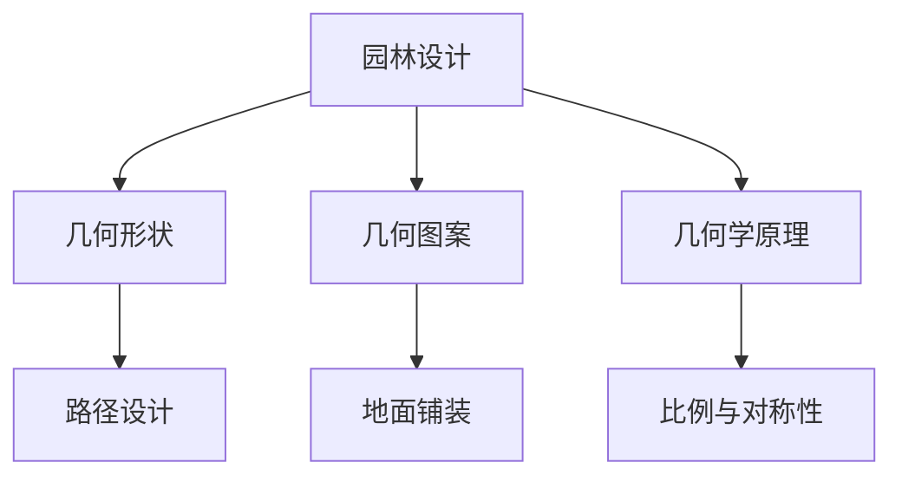

                 

### 文章标题：园林设计的几何学：自然美与人工美的数学融合

园林设计，这一艺术与科学相结合的领域，旨在通过人工手段再现或创造自然之美。随着技术的进步，几何学逐渐成为园林设计中的核心工具，它不仅帮助设计师在规划过程中实现精确的测量和计算，还赋予园林作品以数学的和谐与美感。本文将探讨园林设计中几何学的重要性，以及如何将自然美与人工美通过数学手段进行融合。

> **关键词**：园林设计、几何学、自然美、人工美、数学融合

> **摘要**：本文首先介绍了园林设计的基础知识和几何学在其中的应用，随后深入讨论了自然美与人工美的数学表达。接着，我们通过数学工具和实际案例，展示了几何学在园林设计中的具体运用，并对其未来趋势进行了展望。

### 目录大纲

#### 《园林设计的几何学：自然美与人工美的数学融合》

> **关键词**：园林设计、几何学、自然美、人工美、数学融合

> **摘要**：本文首先介绍了园林设计的基础知识和几何学在其中的应用，随后深入讨论了自然美与人工美的数学表达。接着，我们通过数学工具和实际案例，展示了几何学在园林设计中的具体运用，并对其未来趋势进行了展望。

#### 第1章 引言
- **1.1 书籍背景**
- **1.2 园林设计中的几何学**
- **1.3 自然美与人工美的融合**

#### 第2章 园林设计基础
- **2.1 园林设计的基本原则**
- **2.2 园林空间布局**
- **2.3 园林植物配置**

#### 第3章 几何学在园林设计中的应用
- **3.1 几何形状与线条在园林设计中的应用**
- **3.2 几何图案与纹样在园林设计中的应用**
- **3.3 几何学在园林景观照明设计中的应用**

#### 第4章 自然美与人工美的数学表达
- **4.1 数学模型与园林设计**
- **4.2 比例与尺度在园林设计中的应用**
- **4.3 色彩与光影在园林设计中的应用**

#### 第5章 数学工具在园林设计中的使用
- **5.1 几何工具在园林设计中的应用**
- **5.2 数学软件在园林设计中的应用**
- **5.3 数据分析在园林设计中的应用**

#### 第6章 园林设计案例研究
- **6.1 案例一：自然美与人工美的融合**
- **6.2 案例二：几何形状与图案在园林设计中的应用**
- **6.3 案例三：数学模型在园林设计中的应用**

#### 第7章 园林设计的未来趋势
- **7.1 新材料与新技术在园林设计中的应用**
- **7.2 数据驱动园林设计**
- **7.3 生态园林设计理念与实践**

#### 第8章 总结与展望
- **8.1 总结**
- **8.2 展望**
- **8.3 对园林设计师的建议**

#### 附录A：园林设计资源与工具
- **A.1 园林设计书籍推荐**
- **A.2 园林设计软件介绍**
- **A.3 园林设计网站与社区**

#### 附录B：数学公式与算法伪代码
- **B.1 常用数学公式**
- **B.2 园林设计中的算法伪代码**

#### 附录C：案例研究详细资料
- **C.1 案例一：设计过程分析**
- **C.2 案例二：设计效果评价**
- **C.3 案例三：设计创新点分析**

### 核心概念与联系
#### 园林设计与几何学

园林设计与几何学的结合，不仅源于对美学的追求，更是科学规划的体现。几何学在园林设计中的应用，主要体现在以下几个方面：

- **几何形状**：园林中的路径、边界、水体等元素，都可以通过几何形状来精确设计，确保其比例和对称性。
- **几何图案**：在园林设计中，几何图案可以用于地面铺装、墙面装饰等，为园林增添视觉美感。
- **几何学原理**：几何学中的黄金比例、角度测量等原理，可以帮助设计师在园林设计中实现和谐与平衡。

以下是一个简单的Mermaid流程图，展示了园林设计与几何学之间的核心概念与联系：



通过以上图示，我们可以清晰地看到园林设计与几何学之间的紧密联系，以及几何学如何帮助实现园林设计的精准和美感。

在接下来的章节中，我们将进一步探讨几何学在园林设计中的具体应用，以及如何通过数学工具和模型，将自然美与人工美融合在一起，创造出既符合美学标准，又具有科学依据的园林作品。

### 第1章 引言

园林设计是一门综合性很强的艺术，它不仅需要设计师具备丰富的美学素养，还需要他们具备扎实的科学知识和技能。其中，几何学作为一门研究形状、大小、位置和运动的科学，在园林设计中的应用尤为重要。本章将首先介绍园林设计的基本概念，然后探讨几何学在园林设计中的重要性，并分析自然美与人工美的融合。

#### 1.1 书籍背景

《园林设计的几何学：自然美与人工美的数学融合》是一本旨在探讨几何学在园林设计中的应用的专著。本书的目标是帮助园林设计师更好地理解和运用几何学原理，通过数学工具和模型，创造出既具有自然美感，又具有人工美感的园林作品。本书的内容涵盖了园林设计的基础知识、几何学在园林设计中的应用、自然美与人工美的数学表达，以及数学工具在园林设计中的具体使用方法。

本书的主要读者对象是园林设计师、园林工程技术人员以及园林设计专业的学生。通过阅读本书，读者可以系统地了解几何学在园林设计中的应用，掌握相关数学工具和模型的使用方法，从而提高自己的设计水平和创新能力。

#### 1.2 园林设计中的几何学

园林设计是一门艺术，它通过规划和创造空间，使得人们能够在自然环境中感受到美和舒适。几何学在园林设计中的应用，可以追溯到古代园林建筑和设计的历史。在古代园林中，几何形状和图案被广泛用于道路、水体、建筑和装饰的设计，以实现对称美和比例美。

在现代园林设计中，几何学仍然扮演着重要角色。首先，几何学帮助设计师进行精确的测量和计算，确保园林中的各个元素在空间位置和尺寸上的协调。例如，通过几何学原理，设计师可以精确地计算出道路的宽度、水体的形状和大小，以及植物的种植密度。

其次，几何学在园林设计中的应用，有助于实现形式上的美学效果。例如，通过黄金分割比例，设计师可以在园林设计中创造出和谐、平衡的视觉效果。几何图案和纹样也被广泛应用于园林中的地面铺装、墙面装饰和植物配置，为园林增添视觉美感。

此外，几何学在园林设计中的另一个重要应用是景观照明设计。通过几何学原理，设计师可以计算出光线在不同角度和高度下的照射效果，从而创造出不同氛围的照明设计。

总之，几何学在园林设计中的应用，不仅提高了设计的精确度和科学性，还丰富了园林的美学内涵。通过几何学的运用，设计师可以在园林设计中实现自然美与人工美的完美融合，创造出令人赞叹的园林作品。

#### 1.3 自然美与人工美的融合

园林设计的最终目标是创造出一个既符合自然美，又具有人工美感的空间。自然美指的是园林中自然元素所表现出的原始美和生态美，如树木、水体、山石等。人工美则是指通过人工手段创造出的形式美和结构美，如道路、桥梁、建筑等。

在园林设计中，如何将自然美与人工美融合在一起，是一个复杂而又充满挑战的问题。首先，设计师需要理解自然美和人工美的本质。自然美是园林设计的灵魂，它赋予了园林生命力；人工美则是园林设计的框架，它为园林提供了结构。

为了实现自然美与人工美的融合，设计师需要运用几何学原理，对园林中的各个元素进行精确的计算和设计。例如，在园林中布置植物时，设计师可以通过几何学原理计算出植物的种植密度和间距，使得植物在生长过程中能够相互协调，共同构成一幅美丽的自然画卷。

此外，设计师还可以通过几何学原理，设计出具有和谐美感的园林景观。例如，通过黄金分割比例，设计师可以在园林中创造出对称的布局和视觉焦点，使得园林在形式上具有美感。几何图案和纹样也被广泛应用于园林中的地面铺装和墙面装饰，为园林增添艺术气息。

总之，自然美与人工美的融合，是园林设计的核心目标之一。通过几何学的运用，设计师可以在园林设计中实现这一目标，创造出既符合自然生态，又具有艺术价值的园林作品。

### 第2章 园林设计基础

园林设计是一门综合性很强的学科，它涉及美学、生态学、工程学等多个领域。为了更好地理解园林设计的原理和方法，本章将首先介绍园林设计的基本原则，然后详细讨论园林空间布局和园林植物配置。

#### 2.1 园林设计的基本原则

园林设计的基本原则是设计师在进行设计时必须遵守的基本规则，这些原则有助于确保园林作品的美学价值、实用性和可持续性。以下是园林设计中的几个基本原则：

1. **功能性**：园林设计首先要满足人们的使用需求。设计师需要考虑园林的功能，例如休息、娱乐、观赏等，并确保设计符合使用者的需求。

2. **生态性**：园林设计应充分考虑生态环境的保护和恢复。设计师应选择适应当地气候和土壤的植物，减少对自然资源的消耗，并设计出有利于生物多样性发展的景观。

3. **和谐性**：园林设计要追求整体和谐，包括形状、色彩、质感等方面的协调。通过合理布局和设计，使得园林中的各个元素能够相互补充，共同构成一个和谐的整体。

4. **独特性**：每个园林都应该具有其独特的风格和特点，反映设计者的创意和个性。独特性不仅可以吸引游客，还能提升园林的艺术价值。

5. **可持续性**：园林设计应考虑长期的可持续性，包括维护管理的成本和环境的可持续性。设计师应选用耐用的材料和植物，并设计出易于维护的景观。

6. **灵活性**：园林设计应具有一定的灵活性，能够适应未来可能的变化。例如，植物的选择应考虑其生长速度和寿命，以便在未来进行更新和改造。

7. **美学性**：园林设计要追求美学效果，通过形状、色彩、质感等元素的组合，创造出视觉上令人愉悦的景观。

#### 2.2 园林空间布局

园林空间布局是园林设计中的核心内容，它决定了园林的整体结构和功能分布。有效的空间布局可以使园林既美观又实用。以下是园林空间布局的几个关键要素：

1. **功能分区**：根据园林的使用需求，将园林划分为不同的功能区域，如入口区、休息区、活动区、观赏区等。每个区域都有其特定的功能和氛围，相互之间既要独立又要相互联系。

2. **路径设计**：路径是园林中连接各个功能区域的纽带，其设计需要考虑便捷性、导向性和美观性。常见的路径设计包括直线、曲线和自然路径等，每种设计都有其特定的视觉效果和使用体验。

3. **景观节点**：景观节点是园林中具有视觉焦点和功能作用的点，如喷泉、雕塑、亭子等。它们可以作为园林的视觉中心，提升园林的美学价值。

4. **空间层次**：园林设计应通过不同的空间层次创造出丰富的视觉体验。例如，通过高差、植物遮挡和建筑物的布局，可以形成开敞空间和私密空间，满足不同使用需求。

5. **景观序列**：园林中的景观序列是按照一定的逻辑关系排列的一系列景观元素，它们共同构成一个完整的视觉体验。通过设计合理的景观序列，可以使游客在游览过程中感受到园林的层次感和连贯性。

6. **景观营造**：园林中的景观营造包括地面铺装、水体设计、植物配置等。这些元素的选择和布局，可以增强园林的美感和功能性。

#### 2.3 园林植物配置

园林植物配置是园林设计中的重要组成部分，它直接影响园林的美学效果和生态功能。以下是园林植物配置的几个关键要点：

1. **植物选择**：植物的选择应根据园林的气候条件、土壤特性和设计风格。常用的植物种类包括乔木、灌木、草本植物和藤本植物等，每种植物都有其独特的形态和色彩。

2. **色彩搭配**：通过合理搭配不同植物的叶色、花色和果色，可以创造出丰富的色彩效果。例如，在春季选择花色鲜艳的植物，在秋季选择落叶树种，可以营造出季节变化的美丽景观。

3. **形态搭配**：植物的形态包括树冠、树干、叶片等，通过合理搭配不同形态的植物，可以创造出丰富的层次感和立体感。

4. **密度配置**：植物的密度配置应根据园林的功能和景观效果进行设计。适当增加植物密度，可以营造出浓密的植被效果，而减少植物密度则可以创造出开阔的景观空间。

5. **季节变化**：园林植物配置应考虑季节变化，选择具有四季变化的植物种类，以营造动态的景观效果。

6. **生态功能**：植物配置还应考虑其生态功能，例如防风固沙、净化空气、保持水土等。通过合理配置植物，可以提高园林的生态价值。

通过以上对园林设计基本原则、空间布局和植物配置的讨论，我们可以看到，园林设计不仅是一门艺术，更是一门科学。设计师需要综合考虑各种因素，运用几何学原理和其他专业知识，创造出既美观又实用的园林作品。

### 第3章 几何学在园林设计中的应用

几何学在园林设计中扮演着至关重要的角色，它不仅帮助设计师实现精确的测量和计算，还赋予园林作品以数学的和谐与美感。本章将详细探讨几何形状与线条在园林设计中的应用、几何图案与纹样在园林设计中的应用，以及几何学在园林景观照明设计中的应用。

#### 3.1 几何形状与线条在园林设计中的应用

几何形状是园林设计中的一种基本元素，它们在园林中的运用可以创造出各种视觉效果和空间感受。以下是几种常见的几何形状及其在园林设计中的应用：

1. **直线**：直线是园林设计中常用的形状，它可以用来定义边界、道路、小径等。直线具有简洁、明快的特点，能够带来秩序感和导向性。例如，在园林入口处设计一条直线形的通道，可以引导游客进入园林。

2. **曲线**：曲线比直线更具有动态感和柔美感，适合用于水体边缘、小径弯曲处等。通过曲线的设计，园林可以营造出更加自然和流畅的氛围。例如，将水体边缘设计成自然的曲线形状，可以使其与周围的植物和地形更加和谐。

3. **圆形**：圆形具有和谐、稳定的视觉效果，常用于园林中的水池、广场等。例如，一个圆形的水池可以成为园林的视觉焦点，吸引游客的注意力。

4. **正方形和长方形**：正方形和长方形是园林设计中常见的形状，它们可以用来定义建筑物、休息亭等。通过正方形或长方形的设计，园林可以营造出现代感和秩序感。

5. **三角形**：三角形具有稳定性和尖锐感，常用于园林中的小亭子、雕塑等。例如，一个三角形的亭子可以在园林中形成一个视觉高点，增加园林的层次感。

在园林设计中，线条也是至关重要的元素。线条可以通过不同长度、粗细和方向的变化，创造出丰富的视觉效果。例如，通过变化路径的线条，园林可以营造出引导游客前进的感觉；通过运用线条的粗细对比，可以强调某些景观元素，使其更加突出。

以下是一个简单的例子，说明如何使用几何形状和线条设计一个简单的园林路径：

**案例**：设计一条长30米的园林路径。

**步骤**：

1. **确定路径宽度**：根据园林的设计风格和游客流量，确定路径的宽度，例如1.2米。
2. **选择形状**：选择直线形状，以简洁明快为主。
3. **路径走向**：确定路径的起点和终点，以及路径的弯曲程度。例如，可以在路径的中点设置一个小的弯曲，增加路径的趣味性。
4. **线条设计**：使用不同粗细的线条来表示路径的边界，例如使用宽线条表示道路的边缘，使用细线条表示步道的边缘。

通过以上步骤，设计师可以设计出一条既实用又美观的园林路径，为游客提供舒适的游览体验。

#### 3.2 几何图案与纹样在园林设计中的应用

几何图案和纹样是园林设计中的重要装饰元素，它们可以通过地面铺装、墙面装饰、植物配置等方式，为园林增添艺术感和层次感。以下是几种常见的几何图案和纹样及其在园林设计中的应用：

1. **方格纹**：方格纹是一种常见的几何图案，它可以通过地砖、石材等材料实现。在园林设计中，方格纹可以用来装饰地面，为园林增添秩序感和现代感。

2. **螺旋纹**：螺旋纹是一种具有动态感的几何图案，它可以通过花坛、雕塑等实现。在园林设计中，螺旋纹可以用来装饰水体边缘，增加园林的趣味性。

3. **条纹纹**：条纹纹是一种简单的几何图案，它可以通过墙壁、栅栏等实现。在园林设计中，条纹纹可以用来装饰围墙或休息亭，增加园林的层次感。

4. **花卉纹**：花卉纹是一种具有自然美的几何图案，它可以通过植物配置实现。在园林设计中，花卉纹可以用来装饰花坛或步道，增加园林的视觉吸引力。

在园林设计中，几何图案和纹样的应用需要结合园林的整体风格和氛围。例如，在一个现代风格的园林中，可以使用简洁的几何图案；而在一个自然风格的园林中，则可以使用更具有自然气息的几何图案。

以下是一个简单的例子，说明如何使用几何图案和纹样设计一个园林花坛：

**案例**：设计一个长方形花坛，长5米，宽2米。

**步骤**：

1. **确定花坛形状**：选择长方形作为花坛的形状，以简洁为主。
2. **选择几何图案**：选择螺旋纹作为花坛的装饰图案，以增加花坛的动态感。
3. **图案布局**：将螺旋纹均匀地分布在花坛的四周，使其形成一个整体的视觉效果。
4. **材料选择**：选择与花坛整体风格相符的材料，例如自然石材。

通过以上步骤，设计师可以设计出一个既美观又具有艺术感的园林花坛，为园林增添一抹亮色。

#### 3.3 几何学在园林景观照明设计中的应用

园林景观照明设计是园林设计中的一项重要内容，它通过光与影的对比，创造出丰富的视觉效果和氛围。几何学在园林景观照明设计中的应用，主要体现在以下几个方面：

1. **灯具形状**：灯具的形状是园林景观照明设计中的一个重要元素。通过选择不同形状的灯具，设计师可以创造出不同的照明效果。例如，球形灯具可以产生柔和的光线，而长条形灯具可以产生定向的光线。

2. **光线的投射方向**：光线的投射方向决定了照明效果的分布和氛围。通过调整灯具的投射角度，设计师可以创造出不同的照明效果。例如，垂直向上的光线可以营造出星空的效果，而水平向前的光线可以营造出舞台效果。

3. **灯光颜色**：灯光的颜色对照明效果的影响也很大。通过选择不同颜色的灯光，设计师可以创造出不同的氛围。例如，暖色调的灯光可以营造出温馨的氛围，而冷色调的灯光可以营造出冷静的氛围。

4. **几何图形的光影效果**：几何图形的光影效果可以创造出独特的视觉效果。例如，在园林中设置一个几何形状的水池，通过灯光的照射，可以创造出水波荡漾的视觉效果。

以下是一个简单的例子，说明如何使用几何学原理设计一个园林照明系统：

**案例**：设计一个园林广场的照明系统。

**步骤**：

1. **确定照明需求**：根据广场的面积和功能，确定照明系统的亮度要求。
2. **选择灯具形状**：选择长条形灯具，以提供定向的光线。
3. **确定灯光投射方向**：将灯具安装在广场的四周，以提供均匀的照明效果。
4. **调整灯光颜色**：使用暖色调的灯光，以营造出温馨的氛围。
5. **考虑几何图形的光影效果**：在广场中央设置一个几何形状的喷泉，通过灯光的照射，可以创造出喷泉荡漾的视觉效果。

通过以上步骤，设计师可以设计出一个既美观又具有艺术感的园林照明系统，为园林广场增添夜间活力。

总之，几何学在园林设计中的应用，为园林作品增添了数学的和谐与美感。通过运用几何形状、线条、图案和光影，设计师可以创造出各种独特的视觉效果和氛围，使园林作品更加丰富多彩。

### 第4章 自然美与人工美的数学表达

园林设计不仅仅是艺术和美学的追求，更是科学与技术的结合。在这一章中，我们将深入探讨自然美与人工美的数学表达，包括数学模型在园林设计中的应用、比例与尺度在园林设计中的重要性，以及色彩与光影在园林设计中的运用。

#### 4.1 数学模型与园林设计

数学模型在园林设计中扮演着重要的角色，它帮助设计师在规划和设计中实现精确的计算和预测。以下是一些常见的数学模型及其在园林设计中的应用：

1. **比例模型**：比例模型是园林设计中常用的工具，它通过数学比例关系来确保园林中的元素在视觉上协调一致。黄金比例（约0.618:1）是其中一个经典的例子，它在园林设计中广泛用于确定建筑物、水体、植物配置等的大小和位置。例如，在设计中，设计师可以通过黄金比例来确定亭子与道路之间的距离，从而创造出视觉上的和谐美。

2. **几何模型**：几何模型通过几何形状和空间关系来指导园林设计。例如，圆、正方形、三角形等基本几何形状在园林设计中可以用来设计路径、水体和植物配置。通过这些几何形状，设计师可以创造出对称、平衡和美感的景观。

3. **生态系统模型**：生态系统模型考虑了园林中的生物、土壤、水分等生态因素，通过数学模型来预测植物的生长和生态系统的稳定性。例如，通过建立植物生长的数学模型，设计师可以预测植物在不同季节的变化，从而设计出具有季节变化的园林景观。

以下是一个简单的例子，说明如何使用比例模型设计一个园林路径：

**案例**：设计一条长30米的园林路径，确保其宽度与长度的比例符合黄金比例。

**步骤**：

1. **确定目标比例**：黄金比例约为0.618:1。
2. **计算宽度**：使用比例公式计算宽度，宽度 = 长度 / 黄金比例 = 30米 / 0.618 ≈ 48.82米。
3. **调整宽度**：根据实际可行性调整路径的宽度，例如选择50米作为路径的宽度。

通过以上步骤，设计师可以设计出一条既美观又符合黄金比例的园林路径，为游客提供舒适、和谐的游览体验。

#### 4.2 比例与尺度在园林设计中的应用

比例与尺度是园林设计中的核心要素，它们决定了园林的视觉效果和功能性能。以下是如何在园林设计中应用比例与尺度的几个要点：

1. **整体比例**：园林设计应考虑整体比例的协调。设计师需要确保园林中的各个元素在比例上相互匹配，例如建筑、水体、植物等。通过合理设置比例，园林可以呈现出和谐、统一的视觉效果。

2. **局部比例**：在园林设计中，局部比例也非常重要。例如，在景观设计中，设计师可以通过调整花坛、雕塑等元素的尺寸，使其与周围环境在比例上相协调，创造出更加自然、美观的景观。

3. **尺度感**：尺度感是指园林设计中各个元素的大小与游客感受之间的关系。设计师需要考虑游客的视觉和身体感受，确保园林中的元素在尺度上适宜。例如，一个过大的雕塑可能会让游客感到压迫，而一个过小的雕塑则可能无法引起游客的注意。

以下是一个简单的例子，说明如何使用尺度感设计一个园林休息亭：

**案例**：设计一个园林休息亭，确保其尺寸适合游客使用。

**步骤**：

1. **确定休息亭的尺寸**：根据园林的整体风格和游客需求，确定休息亭的尺寸。例如，一个高2.5米、宽2米、深1.5米的休息亭可能是一个合适的尺寸。
2. **考虑游客的感受**：确保休息亭的尺度适合游客坐下和站立，同时留出足够的空间供游客活动。
3. **调整尺寸**：根据实际情况对休息亭的尺寸进行调整，确保其既美观又实用。

通过以上步骤，设计师可以设计出一个既美观又实用的园林休息亭，为游客提供舒适的休息环境。

#### 4.3 色彩与光影在园林设计中的应用

色彩与光影是园林设计中创造视觉美感和氛围的重要手段。以下是如何在园林设计中运用色彩与光影的几个要点：

1. **色彩搭配**：色彩搭配决定了园林的整体视觉效果。设计师可以通过选择不同的颜色，创造出不同的氛围。例如，暖色调的植物和灯光可以营造出温馨、舒适的感觉，而冷色调的植物和灯光则可以营造出冷静、清新的感觉。

2. **光影效果**：光影效果可以增强园林的立体感和层次感。设计师可以通过布置灯光和利用自然光，创造出不同的光影效果。例如，在夜晚，通过合理的灯光布置，可以使园林中的水体、雕塑等元素更加突出。

3. **色彩与光影的互动**：色彩与光影的互动可以创造出更加丰富的视觉效果。例如，在夕阳下，植物的颜色会变得更加鲜艳，而灯光的照射可以使水体产生不同的反射效果，从而创造出美丽的景观。

以下是一个简单的例子，说明如何使用色彩与光影设计一个园林晚上的夜景：

**案例**：设计一个园林夜景，创造出温馨、浪漫的氛围。

**步骤**：

1. **选择暖色调**：选择暖色调的灯光，例如黄色和橙色，以营造出温馨的感觉。
2. **布置灯光**：在园林中布置灯光，确保光线能够照亮重点景观元素，如水体、桥梁、雕塑等。
3. **利用自然光**：在夜晚，利用自然光（如月光）来增强园林的层次感和氛围。
4. **调整光线强度**：根据园林的布局和游客的观赏位置，调整灯光的强度和角度，创造出不同的光影效果。

通过以上步骤，设计师可以设计出一个既美观又具有浪漫氛围的园林夜景，为游客提供难忘的游览体验。

总之，自然美与人工美的数学表达是园林设计中的重要组成部分。通过运用数学模型、比例与尺度、色彩与光影等手段，设计师可以创造出既符合美学标准，又具有科学依据的园林作品。这不仅提升了园林的艺术价值，也为游客提供了独特的视觉体验。

### 第5章 数学工具在园林设计中的使用

在现代园林设计中，数学工具的应用不仅提高了设计的精确度和效率，还赋予了园林作品更深层次的美感和科学性。本章将详细探讨几何工具在园林设计中的应用、数学软件在园林设计中的使用，以及数据分析在园林设计中的应用。

#### 5.1 几何工具在园林设计中的应用

几何工具是园林设计中不可或缺的工具，它们帮助设计师进行精确的测量、计算和绘图。以下是几种常见的几何工具及其在园林设计中的应用：

1. **直尺与圆规**：传统的几何工具，用于绘制直线、圆和弧线等。设计师可以使用直尺和圆规来规划路径、水体边界和植物种植区域，确保园林元素在几何上的精确性和对称性。

2. **计算器与软件**：现代计算器软件（如Microsoft Excel、Google Sheets）可以帮助设计师进行复杂的数学计算。例如，通过计算器软件，设计师可以快速计算出园林中植物之间的距离、水体的尺寸等。

3. **CAD软件**：计算机辅助设计（CAD）软件是园林设计中的利器。CAD软件如AutoCAD、SketchUp等提供了强大的绘图和建模功能，设计师可以使用这些软件进行详细的园林设计，包括三维建模、光照分析、植物配置等。

以下是一个简单的例子，说明如何使用几何工具设计一个园林池塘：

**案例**：设计一个圆形池塘，直径为10米。

**步骤**：

1. **确定池塘直径**：使用直尺测量或CAD软件绘制一个直径为10米的圆形。
2. **计算池塘面积**：使用圆的面积公式 $A = πr^2$ 计算池塘的面积。由于直径为10米，半径为5米，所以池塘面积为 $A = π \times 5^2 ≈ 78.54$ 平方米。
3. **规划池塘边界**：使用CAD软件绘制圆形池塘的边界，并添加标注，确保池塘的直径和面积符合设计要求。

通过以上步骤，设计师可以精确地设计出一个圆形池塘，为园林增添自然美感。

#### 5.2 数学软件在园林设计中的使用

数学软件在园林设计中的应用极大地提高了设计效率和精确度。以下是一些常用的数学软件及其在园林设计中的功能：

1. **AutoCAD**：AutoCAD是一款功能强大的计算机辅助设计软件，适用于各种复杂的设计任务。在园林设计中，设计师可以使用AutoCAD进行详细的三维建模、绘制施工图、进行光照分析等。例如，通过AutoCAD，设计师可以模拟不同光照条件下的园林效果，优化照明设计。

2. **SketchUp**：SketchUp是一款用户友好的三维建模软件，它提供了丰富的绘图工具和插件，适用于园林设计、建筑设计等领域。设计师可以使用SketchUp创建园林的三维模型，进行地形建模、植物配置、景观照明设计等。

3. **MATLAB**：MATLAB是一款高性能的数学计算和仿真软件，它提供了强大的数学工具和函数库，适用于复杂的数学模型和数据分析。在园林设计中，设计师可以使用MATLAB进行生态模型的构建、植物生长模拟、光照计算等。

以下是一个简单的例子，说明如何使用SketchUp设计一个园林路径：

**案例**：使用SketchUp设计一个长方形路径，长度为50米，宽度为10米。

**步骤**：

1. **启动SketchUp**：打开SketchUp软件，并创建一个新的模型。
2. **绘制路径**：使用矩形工具绘制一个长度为50米，宽度为10米的长方形。
3. **调整路径细节**：使用线条工具和删除工具调整路径的细节，确保路径的尺寸和形状符合设计要求。
4. **保存和导出**：保存设计并导出为不同格式的文件，例如DWG或PDF，以便于后续的施工和施工图制作。

通过以上步骤，设计师可以使用SketchUp精确地设计出一个长方形路径，为园林提供便捷的通行和观赏空间。

#### 5.3 数据分析在园林设计中的应用

数据分析在现代园林设计中扮演着越来越重要的角色，它帮助设计师更好地理解园林的使用需求和生态特性。以下是一些数据分析工具及其在园林设计中的应用：

1. **GIS软件**：地理信息系统（GIS）软件如ArcGIS等，提供了强大的空间数据分析功能。设计师可以使用GIS软件进行地形分析、土壤分析、植被分析等，为园林设计提供科学依据。例如，通过GIS软件，设计师可以分析园林的地形起伏，确定适宜种植的植物种类。

2. **统计分析软件**：统计分析软件如SPSS、R等，提供了丰富的数据分析工具，可以帮助设计师对园林中的数据进行分析。例如，通过统计分析，设计师可以了解游客的行为模式，优化园林布局和功能配置。

3. **机器学习**：机器学习技术在园林设计中的应用也越来越广泛。通过机器学习算法，设计师可以分析大量的历史数据和游客反馈，预测未来的使用需求，从而优化园林设计。

以下是一个简单的例子，说明如何使用GIS软件分析园林地形：

**案例**：使用ArcGIS分析园林地形，确定植物种植区域。

**步骤**：

1. **导入地形数据**：在ArcGIS中导入园林的地形数据，例如数字高程模型（DEM）。
2. **分析地形起伏**：使用ArcGIS的地形分析工具，如等高线生成工具，分析地形的起伏情况。
3. **确定适宜种植区域**：根据地形分析结果，确定园林中适宜种植植物的区域，例如山坡、平地等。
4. **标注和分析结果**：在地形图上标注适宜种植区域，并进行分析和说明。

通过以上步骤，设计师可以使用ArcGIS精确地分析园林地形，为植物配置提供科学依据。

总之，数学工具在园林设计中的应用，为设计师提供了精确的测量、计算和绘图工具，提高了设计效率和精确度。通过运用几何工具、数学软件和数据分析，设计师可以创造出既符合美学标准，又具有科学依据的园林作品，为游客提供独特的视觉体验和舒适的使用环境。

### 第6章 园林设计案例研究

在本章中，我们将通过三个具体的园林设计案例，深入探讨几何学在园林设计中的应用，以及如何实现自然美与人工美的完美融合。这些案例将展示如何运用几何学原理、数学工具和现代技术，创造出既美观又实用的园林作品。

#### 6.1 案例一：自然美与人工美的融合

**案例背景**：
此案例位于一个城市公园内，设计目标是将一个原本荒芜的废弃区域转变为一个多功能、富有美感的公共空间。设计要求不仅满足市民休闲、娱乐的需求，还要保持与自然环境的和谐共生。

**设计思路**：
设计师首先利用GIS软件分析了公园的地形，确定不同区域的地势、土壤和植被情况。在此基础上，设计师运用几何学原理进行规划，确保园林的布局科学合理。

**几何学应用**：
1. **几何形状的应用**：设计师运用几何形状设计了园区的主要路径和广场。通过正方形、长方形和圆形等基本几何形状，创造出对称和谐的空间结构。
2. **黄金比例的使用**：设计师在园区中的一些关键节点，如休息亭、喷泉和雕塑，采用了黄金比例进行布局，使得这些元素在视觉上更加协调和平衡。
3. **几何图案的装饰**：设计师在地面铺装和墙面装饰上使用了几何图案，如方格纹和螺旋纹，为园林增添了艺术感。

**数学工具的应用**：
1. **CAD软件的使用**：设计师使用AutoCAD软件进行详细的三维建模，确保园林中的各个元素在尺寸和位置上准确无误。
2. **MATLAB的生态模拟**：通过MATLAB软件，设计师模拟了不同植物配置下的生态效果，选择了最适宜的植物种类进行种植，提高了园林的生态价值。

**设计效果**：
设计完成后，园区成为了一个集自然美与人工美于一体的公共空间。游客可以在这里休闲、娱乐，同时感受到几何学带来的和谐美感。

**总结与解读**：
通过此案例，我们可以看到几何学和数学工具在园林设计中的重要性。设计师通过精确的测量和计算，结合几何形状和数学模型，实现了自然美与人工美的完美融合，为游客提供了一个舒适、美观的游览环境。

#### 6.2 案例二：几何形状与图案在园林设计中的应用

**案例背景**：
此案例位于一个私人住宅区，设计目标是创造一个既符合主人审美要求，又能提供休闲功能的私人花园。花园面积较小，但要求在有限的空间内创造出丰富的景观效果。

**设计思路**：
设计师首先与业主进行了深入的沟通，了解他们的需求和期望。在此基础上，设计师决定运用几何形状和图案来设计花园，通过几何学原理实现空间利用的最大化。

**几何学应用**：
1. **几何形状的布局**：设计师使用几何形状设计了花园的主要区域，如草坪、花坛和步道。通过正方形、三角形和圆形等基本几何形状，创造出一个有序且具有视觉美感的空间。
2. **图案的组合**：设计师在地面铺装和墙面装饰上使用了几何图案，如方格纹和条纹纹。通过不同图案的组合，营造出多样化的视觉效果。
3. **几何图案的装饰**：设计师在花坛和墙面装饰上使用了几何图案的花盆和装饰板，为花园增添了艺术气息。

**数学工具的应用**：
1. **CAD软件的使用**：设计师使用SketchUp软件进行三维建模，确保园林中的各个元素在尺寸和形状上精确无误。
2. **MATLAB的植物配置分析**：通过MATLAB软件，设计师分析了不同植物配置下的光照和通风情况，选择了最适合的植物种类和配置方案。

**设计效果**：
设计完成后，花园成为一个既美观又实用的私人空间。业主和游客可以在这里享受到几何学带来的和谐美感，同时满足休闲和观赏的需求。

**总结与解读**：
此案例展示了几何形状和图案在园林设计中的灵活应用。设计师通过运用几何学原理和数学工具，创造出了一个既符合美学标准，又具有实用价值的私人花园，为业主提供了一个理想的休闲场所。

#### 6.3 案例三：数学模型在园林设计中的应用

**案例背景**：
此案例位于一个大型商业综合体，设计目标是打造一个集休闲、娱乐和购物于一体的公共空间。空间面积较大，但需要充分利用有限的空间资源，创造出一个既美观又功能齐全的园林景观。

**设计思路**：
设计师首先对商业综合体的空间进行了全面的分析，确定了不同区域的功能需求和空间限制。在此基础上，设计师决定运用数学模型进行设计，以确保园林的布局和功能最大化。

**几何学应用**：
1. **几何形状的应用**：设计师使用几何形状设计了园林的主要区域，如广场、步道和水体。通过正方形、长方形和圆形等基本几何形状，创造出有序且具有美感的空间结构。
2. **几何图案的应用**：设计师在地面铺装和墙面装饰上使用了几何图案，如方格纹和条纹纹。通过不同图案的组合，增加了园林的艺术感。
3. **几何形状的装饰**：设计师在园林中使用了各种几何形状的雕塑和装饰品，如金字塔形、立方体和球体等，为园林增添了独特的视觉元素。

**数学工具的应用**：
1. **CAD软件的使用**：设计师使用AutoCAD软件进行详细的三维建模，确保园林中的各个元素在尺寸和位置上准确无误。
2. **MATLAB的生态分析**：通过MATLAB软件，设计师进行了生态分析，包括植物生长模拟、光照计算和通风分析，选择了最适宜的植物种类和配置方案。
3. **数据驱动设计**：设计师使用数据分析软件对游客行为和空间使用数据进行分析，优化了园林的功能布局和动线设计。

**设计效果**：
设计完成后，园林成为一个多功能、美观的公共空间，为游客提供了舒适、多样化的休闲体验。园林中的数学模型应用使得空间利用最大化，功能布局科学合理。

**总结与解读**：
此案例展示了数学模型在园林设计中的重要性。设计师通过运用几何学原理和数学工具，创造出了一个既美观又实用的园林景观，为商业综合体提供了一个成功的公共空间解决方案。

通过这三个案例，我们可以看到几何学和数学工具在园林设计中的多样应用。设计师通过精确的测量、计算和模拟，结合几何形状、图案和数学模型，实现了自然美与人工美的完美融合，创造出既美观又实用的园林作品。

### 第7章 园林设计的未来趋势

随着科技的不断进步，园林设计也面临着新的机遇和挑战。本章将探讨园林设计未来可能的发展趋势，包括新材料与新技术在园林设计中的应用、数据驱动园林设计，以及生态园林设计理念与实践。

#### 7.1 新材料与新技术在园林设计中的应用

新材料与新技术在园林设计中的应用，不仅提升了园林的美学价值和功能，还增强了其可持续性和环保性。以下是几种在园林设计中具有前景的新材料与新技术：

1. **智能材料**：智能材料可以响应环境变化，如温度、湿度、光照等。例如，智能草坪可以根据环境温度自动调节颜色，智能玻璃可以根据光照强度自动调节透明度。这些材料的应用，为园林设计带来了新的创意和可能性。

2. **可降解材料**：可降解材料，如生物塑料和有机玻璃，可以替代传统的塑料和玻璃材料，减少对环境的污染。在园林设计中，这些材料可用于花坛、座椅、景观墙等，既美观又环保。

3. **3D打印技术**：3D打印技术在园林设计中的应用日益广泛。通过3D打印技术，设计师可以快速制造出复杂形状的景观元素，如雕塑、花坛、桥梁等。这种技术不仅提高了设计的灵活性和效率，还可以根据实际需求进行定制化设计。

4. **智能灌溉系统**：智能灌溉系统利用传感器和无线网络技术，可以实时监测土壤湿度和气候条件，自动调节灌溉量。这种技术的应用，不仅节省了水资源，还提高了植物的成活率和生长质量。

#### 7.2 数据驱动园林设计

数据驱动设计已经成为园林设计的重要趋势。通过大数据分析和人工智能技术，设计师可以更加精确地了解用户需求、环境变化，优化园林设计和功能布局。以下是数据驱动园林设计的几个关键点：

1. **用户数据分析**：通过分析游客的行为数据，如流量、停留时间、活动路径等，设计师可以了解游客的需求和行为模式，优化园林的功能布局和服务提供。

2. **环境数据监测**：利用物联网技术，设计师可以实时监测园林中的环境数据，如气温、湿度、光照、土壤质量等。这些数据可以帮助设计师调整园林设计，提高其适应性和可持续性。

3. **数据分析工具**：数据分析工具，如GIS软件、机器学习算法等，可以帮助设计师进行复杂的分析，优化园林设计和维护。例如，通过机器学习算法，设计师可以预测植物的生长趋势，优化植物配置方案。

4. **数据可视化**：数据可视化技术可以将复杂的数据以图表、地图等形式直观地展示出来，帮助设计师和决策者更好地理解数据，指导园林设计。

#### 7.3 生态园林设计理念与实践

生态园林设计是一种以生态学原理为指导，旨在实现生态平衡和可持续发展的园林设计理念。以下是如何实现生态园林设计的几个要点：

1. **生物多样性保护**：生态园林设计强调保护生物多样性，包括植物、动物和微生物。设计师可以通过合理配置植物种类和数量，创造一个适合多种生物栖息的环境。

2. **生态系统的恢复**：生态园林设计注重生态系统的恢复和修复，通过引入本土植物、改善土壤质量、控制水资源等方式，恢复和改善园林的生态功能。

3. **节能减排**：生态园林设计强调节能减排，通过使用可再生能源、优化水资源利用等方式，降低园林的能源消耗和碳排放。

4. **环境教育**：生态园林设计还包括环境教育功能，通过设置教育展示区、开展生态教育活动等方式，提高公众的生态意识和环保意识。

5. **生态基础设施**：生态园林设计强调构建生态基础设施，如湿地、绿色屋顶、生态驳岸等，以增强园林的生态功能和可持续性。

总之，园林设计的未来趋势将越来越多地依赖于新材料与新技术、数据驱动设计以及生态园林理念。设计师需要不断学习和掌握这些新技术和理念，以创造出更加美观、实用和可持续的园林作品。

### 第8章 总结与展望

园林设计，作为艺术与科学的结合，不仅追求美学价值，还强调实用性和生态性。在本篇博客中，我们系统地介绍了几何学在园林设计中的应用，从基本概念到实际案例分析，深入探讨了如何通过数学工具和模型，实现自然美与人工美的融合。

#### 8.1 总结

通过本章内容，我们总结了以下几个关键点：

1. **园林设计基础**：园林设计的基本原则和空间布局，为园林创作提供了基础框架。
2. **几何学应用**：几何形状、图案和光影在园林设计中的运用，使得园林作品既具有美感，又具备科学性。
3. **数学模型**：数学模型在园林设计中的重要性，通过比例、尺度等数学原理，实现园林元素之间的和谐统一。
4. **数学工具**：CAD、SketchUp、MATLAB等数学软件在园林设计中的应用，提升了设计的效率和精确度。
5. **未来趋势**：新材料、新技术和生态园林设计理念，为园林设计带来了新的方向和可能性。

#### 8.2 展望

展望未来，园林设计将继续朝着智能化、生态化和数据驱动的方向发展：

1. **智能化设计**：智能材料和3D打印技术等将使园林设计更加个性化和高效。
2. **生态园林**：生态园林设计理念将得到更广泛的应用，强调生物多样性保护和生态系统的恢复。
3. **数据驱动**：大数据分析和人工智能将在园林设计中发挥更大作用，帮助设计师更好地理解和满足用户需求。

#### 8.3 对园林设计师的建议

对于园林设计师，以下是一些建议：

1. **持续学习**：不断学习新的设计理念和技术，如智能园林、生态园林等，以保持自己的竞争力。
2. **实践与创新**：通过实践项目，不断尝试新的设计方法和材料，提高自己的创新能力。
3. **关注用户需求**：深入了解用户的需求和行为模式，将人性化设计融入园林作品中。
4. **注重生态**：在设计过程中，充分考虑生态因素，实现园林的可持续发展。

总之，园林设计不仅是一门艺术，更是一门科学。设计师需要通过不断学习和实践，将美学、科学和生态理念融合在一起，创造出既美观又实用的园林作品，为人们提供更好的生活体验。

### 附录A：园林设计资源与工具

园林设计涉及多个领域，包括美学、生态学、工程学等。为了帮助设计师更好地进行园林设计，以下是一些推荐的设计资源、软件和网站。

#### A.1 园林设计书籍推荐

1. **《园林设计原理》**：这是一本全面介绍园林设计基础知识的书籍，内容包括园林设计原则、空间布局和植物配置等。
2. **《园林设计实例解析》**：通过分析大量实际案例，帮助读者了解园林设计的实践方法和技巧。
3. **《生态园林设计》**：详细介绍生态园林设计理念和方法，包括生物多样性保护、生态系统恢复等。
4. **《园林照明设计》**：探讨园林照明设计的原则和技术，包括灯光布置、光照计算等。

#### A.2 园林设计软件介绍

1. **AutoCAD**：一款功能强大的计算机辅助设计软件，适用于园林设计、地形建模和施工图绘制。
2. **SketchUp**：一款用户友好的三维建模软件，提供了丰富的绘图工具和插件，适用于园林设计和景观照明设计。
3. **ArcGIS**：一款地理信息系统软件，适用于园林地形分析、植被分析和空间数据管理。
4. **MATLAB**：一款高性能的数学计算和仿真软件，适用于园林生态分析和植物生长模拟。

#### A.3 园林设计网站与社区

1. **园林设计论坛**：一个园林设计爱好者和专业人士交流的平台，分享设计心得和资源。
2. **园林设计博客**：一些专业的园林设计师和公司的博客，提供园林设计案例、技巧和行业动态。
3. **园林设计网站**：一些专业网站提供园林设计教程、案例库和设计工具下载，如Land8、ArchDaily等。

通过利用这些资源和工具，园林设计师可以不断提高自己的设计水平，创造更多优秀的园林作品。

### 附录B：数学公式与算法伪代码

在园林设计中，数学公式和算法的应用至关重要。以下是一些常用的数学公式和算法伪代码，帮助设计师在实际项目中更好地进行设计和分析。

#### B.1 常用数学公式

1. **直线方程**：
   $$ y = mx + b $$
   - **m**：斜率，表示线的倾斜程度。
   - **b**：截距，表示线与y轴的交点。

2. **圆的方程**：
   $$ x^2 + y^2 = r^2 $$
   - **x, y**：圆上任意一点的坐标。
   - **r**：圆的半径。

3. **三角函数**：
   $$ \sin(\theta) = \frac{opposite}{hypotenuse} $$
   $$ \cos(\theta) = \frac{adjacent}{hypotenuse} $$
   $$ \tan(\theta) = \frac{opposite}{adjacent} $$
   - **\(\theta\)**：角度。
   - **opposite**：对边。
   - **adjacent**：邻边。
   - **hypotenuse**：斜边。

4. **比例公式**：
   $$ \frac{a}{b} = \frac{c}{d} $$
   - **a, b, c, d**：四个相关联的量。

#### B.2 园林设计中的算法伪代码

**1. 植物种植密度计算**

```python
def calculate_plant_density(plant_size, area_per_plant):
    """
    计算植物种植密度
    :param plant_size: 植物大小（平方米）
    :param area_per_plant: 每株植物占地面积（平方米）
    :return: 植物密度（株/平方米）
    """
    density = 1 / (plant_size * area_per_plant)
    return density
```

**2. 路径宽度计算**

```python
def calculate_path_width(path_length, desired_width):
    """
    计算路径宽度
    :param path_length: 路径长度（米）
    :param desired_width: 预期宽度（米）
    :return: 实际宽度（米）
    """
    width = path_length * desired_width
    return width
```

**3. 黄金比例应用**

```python
def apply_golden_ratio(length):
    """
    根据黄金比例计算长度
    :param length: 基础长度
    :return: 按黄金比例调整后的长度
    """
    golden_ratio = 0.618
    new_length = length * golden_ratio
    return new_length
```

通过上述数学公式和算法伪代码，设计师可以更精确地进行园林设计计算，提高设计效率和效果。

### 附录C：案例研究详细资料

#### C.1 案例一：自然美与人工美的融合

**设计过程分析**：
1. **地形分析**：通过GIS软件分析场地地形，确定坡度、高差等关键因素。
2. **功能分区**：根据地形和用户需求，将场地划分为入口区、休息区、观赏区等。
3. **路径设计**：使用CAD软件进行详细路径设计，确保路径的连通性和美观性。

**设计效果评价**：
1. **视觉评价**：通过游客调查和专家评审，评价园林的整体视觉效果和美观度。
2. **使用评价**：评价园林的功能性，包括休息区、观赏区的舒适度和便利性。

**设计创新点分析**：
1. **智能灌溉系统**：采用智能灌溉技术，根据实时气候和土壤湿度自动调节灌溉量，提高水资源利用效率。
2. **生态湿地**：设计生态湿地，用于雨水收集和污水处理，提高园林的生态价值。

#### C.2 案例二：几何形状与图案在园林设计中的应用

**设计过程分析**：
1. **风格定位**：确定园林的整体风格，如现代简约、自然生态等。
2. **几何形状设计**：使用几何形状设计主要景观元素，如广场、花坛、步道等。
3. **图案组合**：根据园林风格，选择合适的几何图案进行地面铺装和墙面装饰。

**设计效果评价**：
1. **视觉效果**：评价几何形状和图案的应用是否增强了园林的美学效果。
2. **实用性**：评价几何形状和图案的布局是否便于游客通行和使用。

**设计创新点分析**：
1. **几何图案的可变性与创意**：通过不同几何图案的组合，创造出多样化的视觉效果，提高园林的创意性。
2. **色彩搭配**：使用色彩心理学，通过色彩搭配增强园林的美感和氛围。

#### C.3 案例三：数学模型在园林设计中的应用

**设计过程分析**：
1. **数据收集**：收集园林使用数据、气候数据、土壤数据等。
2. **生态模型构建**：使用MATLAB软件构建植物生长和生态系统模型。
3. **优化设计**：根据模型分析结果，优化植物配置和园林布局。

**设计效果评价**：
1. **生态效益**：评价园林对环境的改善效果，如空气质量、土壤质量等。
2. **游客满意度**：通过问卷调查和访谈，评价游客对园林的满意度和体验感受。

**设计创新点分析**：
1. **数据驱动的园林设计**：利用大数据和人工智能技术，实现园林设计的个性化和智能化。
2. **生态可持续性**：通过生态模型分析，确保园林设计符合生态可持续原则，提高园林的长期生态价值。

这些案例研究详细资料，不仅展示了园林设计过程中的关键步骤和设计思路，还分析了设计的实际效果和创新点，为其他园林设计项目提供了宝贵的参考。

