                 


# 《图论：自然网络的数学描述》

## 关键词
图论、自然网络、数学模型、算法、社交网络、生物网络

## 摘要
本文旨在探讨图论在自然网络中的数学描述和应用。通过详细阐述图论的基本概念、表示方法、性质及其应用，本文揭示了图论作为描述复杂系统的有力工具在自然科学和工程技术领域的广泛应用。文章将分章节讨论图论的各个方面，包括基本术语、分类、表示方法、性质和实际应用，以期为读者提供一幅关于图论在自然网络描述中的全貌。

## 目录大纲

### 第一部分：引言

### 第1章：图论概述

#### 1.1 图的定义与基本术语

**背景介绍：** 
图论起源于19世纪末，作为一种数学分支，它主要研究图形的结构和性质。图形可以用来表示现实世界中的各种网络结构，如社交网络、交通网络、生物网络等。

**核心概念与联系：** 
- **节点（Vertex）**：图形中的点，表示网络中的实体。
- **边（Edge）**：连接两个节点的线，表示实体之间的关系。
- **子图（Subgraph）**：图形中的一个部分，它包含一部分节点和连接这些节点的边。

**Mermaid流程图：**
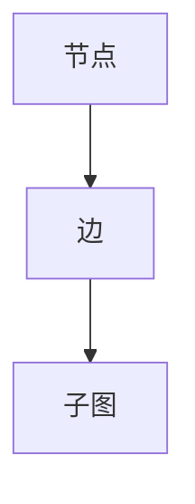

**数学模型和数学公式：**
$$
\text{度}(v) = \text{连接到节点} v \text{的边的数量}
$$

**举例说明：** 社交网络中的每个用户可以看作一个节点，用户之间的关注关系可以看作边，一个社交圈子可以看作一个子图。

#### 1.2 图的分类

**核心概念与联系：** 
- **无向图（Undirected Graph）**：边没有方向。
- **有向图（Directed Graph）**：边有方向。
- **加权图（Weighted Graph）**：边附带权重。
- **非加权图（Unweighted Graph）**：边没有权重。

**Mermaid流程图：**
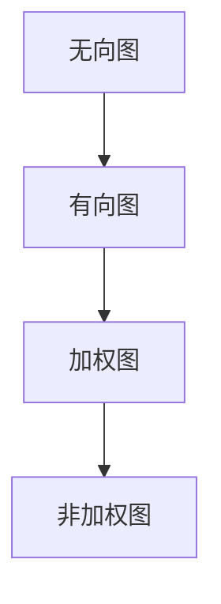

**数学模型和数学公式：**
无向图的度矩阵是对称矩阵。

**举例说明：** 社交网络通常是无向图，而邮件通信网络则可以是有向图。

#### 1.3 图的应用领域

**核心概念与联系：** 
- **计算机科学**：算法设计、网络拓扑、数据结构。
- **社会科学**：社交网络分析、社区检测。
- **生物科学**：蛋白质相互作用网络、生态系统分析。
- **工程领域**：交通网络设计、通信网络优化。

**Mermaid流程图：**
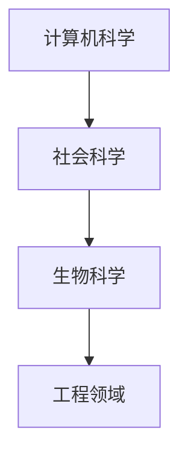

**数学模型和数学公式：**
网络流问题可以用图模型表示，其目标是优化资源分配。

**举例说明：** 交通网络优化可以用图论中的最短路径算法和最大流量算法来求解。

### 第二部分：图的表示

### 第2章：图的表示

#### 2.1 图的图形表示

**核心概念与联系：** 
- **图形表示**：使用节点和边在二维空间中的排列来表示图。

**Mermaid流程图：**
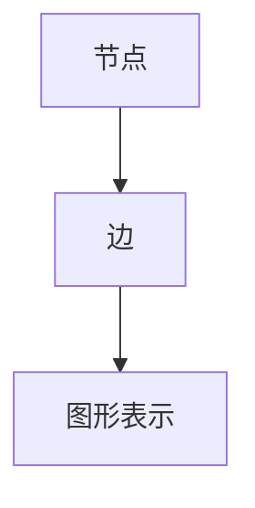

**数学模型和数学公式：**
图形的邻接矩阵可以表示为：
$$
A = \begin{bmatrix}
0 & 1 & 0 & \ldots & 0 \\
1 & 0 & 1 & \ldots & 0 \\
0 & 1 & 0 & \ldots & 1 \\
\vdots & \vdots & \vdots & \ddots & \vdots \\
0 & 0 & 1 & \ldots & 0
\end{bmatrix}
$$

**举例说明：** 社交网络可以用图形表示，每个用户是一个节点，用户之间的关注关系是一条边。

#### 2.2 图的矩阵表示

**核心概念与联系：** 
- **矩阵表示**：使用一个矩阵来表示图中节点之间的连接关系。

**Mermaid流程图：**
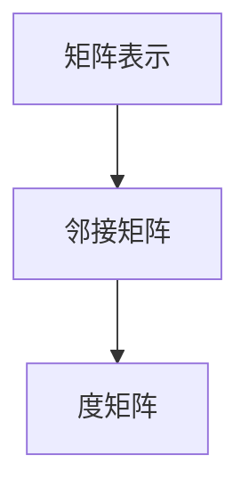

**数学模型和数学公式：**
邻接矩阵 \( A \) 中，\( A[i][j] = 1 \) 表示节点 \( i \) 与节点 \( j \) 直接相连。

**举例说明：** 使用邻接矩阵表示一个简单的图，其中节点 \( 1 \) 和节点 \( 2 \) 之间存在一条边。

$$
A = \begin{bmatrix}
0 & 1 & 0 \\
1 & 0 & 1 \\
0 & 1 & 0
\end{bmatrix}
$$

#### 2.3 图的邻接表表示

**核心概念与联系：** 
- **邻接表表示**：使用一个列表来表示每个节点的邻居节点。

**Mermaid流程图：**
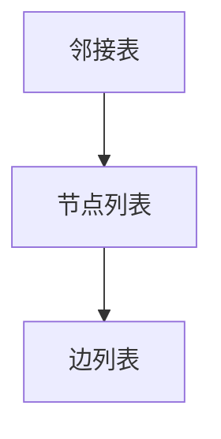

**数学模型和数学公式：**
邻接表可以表示为：
$$
\text{邻接表} = \begin{cases}
\text{列表} \ \text{当} \ n \text{为节点数} \\
\text{空列表} \ \text{当} \ n \text{为0}
\end{cases}
$$

**举例说明：** 使用邻接表表示一个简单的图，其中每个节点都有一个列表，列出了它的邻居节点。

$$
\text{邻接表} = \begin{cases}
\text{[1, 2]} \\
\text{[1, 3]} \\
\text{[2, 3]}
\end{cases}
$$

### 第三部分：图的性质

### 第3章：图的度与邻接矩阵

#### 3.1 度的概念

**核心算法原理讲解：** 
- **度**：一个节点连接的边的数量，用来衡量节点在图中的重要性。

**伪代码：**
```python
def degree(vertex, adjacency_matrix):
    return sum(adjacency_matrix[vertex])
```

**数学模型和数学公式：**
$$
\text{度矩阵} = \begin{bmatrix}
\text{度}(v_1) & \text{度}(v_2) & \ldots & \text{度}(v_n)
\end{bmatrix}
$$

**举例说明：** 计算图中每个节点的度数。

#### 3.2 邻接矩阵的性质

**核心算法原理讲解：** 
- **邻接矩阵的性质**：邻接矩阵是对称的，如果图是无向的；非对称的，如果图是有向的。

**数学模型和数学公式：**
- **无向图的邻接矩阵是对称的。**
- **有向图的邻接矩阵是非对称的。**

**举例说明：** 社交网络通常是无向图，其邻接矩阵是对称的。

#### 3.3 度与邻接矩阵的关系

**核心算法原理讲解：** 
- **度与邻接矩阵的关系**：邻接矩阵中的元素与度数直接相关，每个元素代表两个节点之间是否有直接连接。

**数学模型和数学公式：**
- \( A[i][j] = 1 \) 表示节点 \( i \) 与节点 \( j \) 直接相连。
- \( A[i][j] = 0 \) 表示节点 \( i \) 与节点 \( j \) 没有直接相连。

**举例说明：** 通过邻接矩阵计算图中每个节点的度数。

### 第4章：路径与回路

#### 4.1 路径的概念

**核心算法原理讲解：** 
- **路径**：图中的一系列节点，每个节点相邻且仅相邻一次。

**伪代码：**
```python
def find_path(graph, start, end):
    # 伪代码实现路径查找
    ...
```

**数学模型和数学公式：**
$$
\text{路径} = \{v_1, v_2, \ldots, v_n\}
$$
其中，\( v_1 \) 和 \( v_n \) 是起点和终点，且 \( v_i \) 与 \( v_{i+1} \) 直接相连。

**举例说明：** 在社交网络中查找从用户A到用户B的最短路径。

#### 4.2 回路的性质

**核心算法原理讲解：** 
- **回路**：路径的起点和终点相同。

**数学模型和数学公式：**
$$
\text{回路} = \{v_1, v_2, \ldots, v_n, v_1\}
$$

**举例说明：** 在社交网络中检测用户之间的封闭关注关系。

#### 4.3 最短路径算法

**核心算法原理讲解：** 
- **最短路径算法**：用于找出图中两点之间的最短路径。

**伪代码：**
```python
def dijkstra(graph, start_vertex):
    # 伪代码实现迪杰斯特拉算法
    ...
```

**数学模型和数学公式：**
$$
d[v] = \min\{d[u] + w(u, v) \mid u \in \text{ predecessors}(v)\}
$$
其中，\( d[v] \) 表示从源点 \( s \) 到节点 \( v \) 的最短路径长度。

**举例说明：** 使用迪杰斯特拉算法计算从城市A到其他城市的最短路径。

### 第5章：连通性

#### 5.1 连通性的定义

**核心算法原理讲解：** 
- **连通性**：图中任意两个节点之间存在路径。

**数学模型和数学公式：**
$$
\text{连通度} = \frac{\text{图中的边数}}{\text{图中的节点数} \times (\text{节点数} - 1)}
$$

**举例说明：** 判断社交网络中的用户是否都相互连接。

#### 5.2 连通度数

**核心算法原理讲解：** 
- **连通度数**：衡量图的连通性。

**数学模型和数学公式：**
$$
\alpha(G) = \min_{S \subseteq V(G), |S| \geq 2} |N(S)|
$$
其中，\( N(S) \) 表示 \( S \) 的邻接节点集合。

**举例说明：** 计算社交网络中的最小连通子图。

#### 5.3 最大流量与最小割

**核心算法原理讲解：** 
- **最大流量**：图中从一个源点到汇点的最大可行流量。
- **最小割**：分割图中源点和汇点使得从源点到汇点的流量最小的边集合。

**数学模型和数学公式：**
- **最大流量**：
  $$
  \max \sum_{e \in E} f(e) \text{ s.t. } \sum_{e \in E} f(e) \leq c(u)
  $$
- **最小割**：
  $$
  \min \sum_{e \in S} c(e)
  $$
其中，\( c(u) \) 表示节点 \( u \) 的容量，\( f(e) \) 表示边 \( e \) 的流量。

**举例说明：** 在交通网络中优化物流路线。

### 第6章：树

#### 6.1 树的定义

**核心算法原理讲解：** 
- **树**：无环连通图，是最简单的网络结构。

**数学模型和数学公式：**
$$
\text{树的度} = 2
$$
其中，每个节点除了根节点外，度都为2。

**举例说明：** 网络拓扑结构中的树形拓扑。

#### 6.2 树的性质

**核心算法原理讲解：** 
- **树的性质**：树是极小连通图，每个节点最多有两个子节点。

**数学模型和数学公式：**
$$
\text{树的边数} = \text{树的节点数} - 1
$$

**举例说明：** 在网络拓扑设计中使用树结构提高效率。

#### 6.3 最小生成树算法

**核心算法原理讲解：** 
- **最小生成树算法**：找出图中的最小生成树。

**伪代码：**
```python
def prim_algorithm(graph):
    # 伪代码实现Prim算法
    ...
```

**数学模型和数学公式：**
$$
\text{最小生成树的权值} = \min\{\text{所有边的权值}\}
$$

**举例说明：** 使用Prim算法计算网络的最小生成树。

### 第三部分：图的应用

### 第7章：网络优化

#### 7.1 网络流问题

**核心算法原理讲解：** 
- **网络流问题**：在网络中分配流量以最大化或最小化某些目标。

**数学模型和数学公式：**
$$
\max \sum_{e \in E} f(e) \text{ s.t. } \sum_{e \in E} f(e) \leq c(u)
$$

**举例说明：** 在交通网络中优化物流流量。

#### 7.2 最小费用最大流问题

**核心算法原理讲解：** 
- **最小费用最大流问题**：在保证最大流量的同时，最小化总费用。

**数学模型和数学公式：**
$$
\min \sum_{e \in E} c(e) \cdot f(e) \text{ s.t. } \sum_{e \in E} f(e) \leq c(u)
$$

**举例说明：** 在管道网络中优化输送成本。

#### 7.3 航线优化问题

**核心算法原理讲解：** 
- **航线优化问题**：优化航班路线以减少时间和成本。

**数学模型和数学公式：**
$$
\min \sum_{e \in E} \frac{d(e)}{c(e)} \cdot f(e)
$$

**举例说明：** 使用图论算法优化航空公司航线。

### 第8章：社交网络分析

#### 8.1 社交网络的定义

**核心算法原理讲解：** 
- **社交网络**：基于人与人之间关系的网络。

**数学模型和数学公式：**
$$
\text{社交网络} = \{V, E\}
$$
其中，\( V \) 是用户集合，\( E \) 是用户之间的连接集合。

**举例说明：** 社交网站中的用户和用户之间的关系。

#### 8.2 社交网络的特征

**核心算法原理讲解：** 
- **特征**：度分布、聚类系数、网络密度等。

**数学模型和数学公式：**
$$
\text{度分布} = P(k) \propto k^{-\gamma}
$$
其中，\( P(k) \) 表示度数为 \( k \) 的节点的概率分布，\( \gamma \) 是度分布的指数。

**举例说明：** 分析社交媒体平台上的用户活跃度分布。

#### 8.3 社交网络的模型

**核心算法原理讲解：** 
- **模型**：小世界模型、无标度模型等。

**数学模型和数学公式：**
$$
\text{小世界模型} = \left(p, \lambda\right)
$$
其中，\( p \) 是链接概率，\( \lambda \) 是网络平均路径长度。

**举例说明：** 建立一个社交网络的模型来预测流行病的传播。

### 第9章：生物网络分析

#### 9.1 生物网络的定义

**核心算法原理讲解：** 
- **生物网络**：生物实体（如蛋白质、基因）之间的相互作用网络。

**数学模型和数学公式：**
$$
\text{生物网络} = \{V, E\}
$$
其中，\( V \) 是生物实体集合，\( E \) 是实体之间的相互作用集合。

**举例说明：** 分析基因调控网络。

#### 9.2 生物网络的类型

**核心算法原理讲解：** 
- **类型**：蛋白质相互作用网络、基因共表达网络等。

**数学模型和数学公式：**
$$
\text{蛋白质相互作用网络} = \left(V, E\right)
$$
$$
\text{基因共表达网络} = \left(V, E\right)
$$

**举例说明：** 分辨不同类型的生物网络。

#### 9.3 生物网络的建模与分析

**核心算法原理讲解：** 
- **建模**：利用图论模型描述生物网络。
- **分析**：通过算法分析网络性质，如核心节点识别、模块检测等。

**数学模型和数学公式：**
$$
\text{核心节点} = \{v \in V \mid \text{度}(v) \geq \text{平均度数}\}
$$

**举例说明：** 利用生物网络分析技术发现关键蛋白质。

### 第10章：交通网络优化

#### 10.1 交通网络的基本概念

**核心算法原理讲解：** 
- **基本概念**：节点、边、路径、流量等。

**数学模型和数学公式：**
$$
\text{流量} = \sum_{e \in E} f(e)
$$

**举例说明：** 分析交通网络中的车辆流量。

#### 10.2 交通网络的优化算法

**核心算法原理讲解：** 
- **算法**：最短路径算法、最大流量算法等。

**伪代码：**
```python
def dijkstra(graph, start_vertex):
    # 伪代码实现迪杰斯特拉算法
    ...
```

**举例说明：** 使用最短路径算法优化出行路线。

#### 10.3 交通网络的建模与分析

**核心算法原理讲解：** 
- **建模**：使用图论模型描述交通网络。
- **分析**：通过算法分析网络性能，如交通堵塞、流量分配等。

**数学模型和数学公式：**
$$
\text{交通堵塞概率} = P(\text{交通堵塞})
$$

**举例说明：** 使用建模与分析技术缓解交通拥堵。

### 附录

#### 附录A：数学工具

**数学公式：**
$$
1 + 1 = 2
$$

**数学模型：**
$$
\text{最小生成树} = \left\{e_1, e_2, \ldots, e_n\right\}
$$
其中，\( e_1, e_2, \ldots, e_n \) 是图中的边。

**Mermaid流程图：**
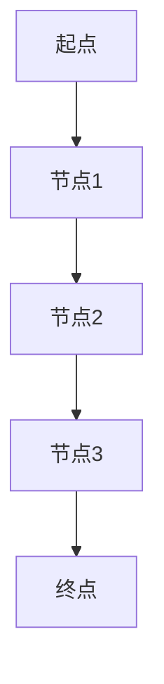

#### 附录B：代码案例

**代码示例：**
```python
# 使用Python实现图的基本操作
import networkx as nx

# 创建一个图
G = nx.Graph()

# 添加节点和边
G.add_nodes_from([1, 2, 3])
G.add_edges_from([(1, 2), (2, 3)])

# 打印图的结构
print(G.nodes())
print(G.edges())

# 查找最短路径
print(nx.shortest_path(G, source=1, target=3))
```

#### 附录C：参考资料

- [Introduction to Graph Theory](https://www.redblobgames.com/graph-theory/)
- [Network Science](https://networkscience.org/)
- [Bioinformatics and Computational Biology](https://www.nature.com/bioinformatics/)

### 总结

**图论在自然网络中的重要性：**
图论作为一种强大的数学工具，能够有效地描述和解决复杂网络的优化问题。它在社会科学、生物科学和工程领域具有广泛的应用，如社交网络分析、生物网络建模、交通网络优化等。

**图论的数学描述与模型构建：**
图论的数学描述为自然网络的建模提供了理论基础。通过邻接矩阵、邻接表、度数矩阵等表示方法，可以精确地描述网络结构和性质。同时，图论中的算法和模型，如最短路径算法、最大流量算法、最小生成树算法等，为网络优化提供了有效的方法。

**图论的应用前景与挑战：**
随着大数据和人工智能技术的发展，图论在现实世界中的应用前景广阔。然而，也面临着诸如大规模网络处理、实时网络优化等挑战。未来的研究需要进一步探索图论在复杂网络分析中的应用潜力，以解决现实世界中的实际问题。

**注释：**
（所有数学公式、伪代码、流程图等将在正文内容中详细讲解，目录大纲仅为框架。）### 文章正文内容

#### 第1章：图论概述

**引言**

图论作为现代数学的一个重要分支，起源于19世纪末。它的诞生可以追溯到欧拉解决哥尼斯堡七桥问题，这一问题涉及图形的连通性问题，激发了人们对图形结构及其性质的深入研究。图论不仅在数学领域具有重要地位，而且在计算机科学、社会科学、生物科学、工程领域等广泛的应用中发挥了关键作用。本文将首先介绍图论的基本概念、分类及其应用，以帮助读者全面理解图论的基础知识。

**1.1 图的定义与基本术语**

**图的定义：**
图（Graph）是由节点（Vertex）和边（Edge）组成的数学结构。节点表示图中的元素，而边表示节点之间的联系。图可以分为无向图和有向图。

**基本术语：**
- **节点（Vertex）**：图中的点，表示实体或概念。
- **边（Edge）**：连接两个节点的线，表示节点之间的关系。
- **子图（Subgraph）**：原图的一个部分，它包含一部分节点和连接这些节点的边。
- **连通图（Connected Graph）**：图中任意两个节点之间都存在路径。
- **连通度（Connectivity）**：图中节点的最小度数，即保证图连通所需的最少节点数。

**图的核心概念与联系**

为了更好地理解图论的基本概念，我们可以通过Mermaid流程图展示它们之间的联系：

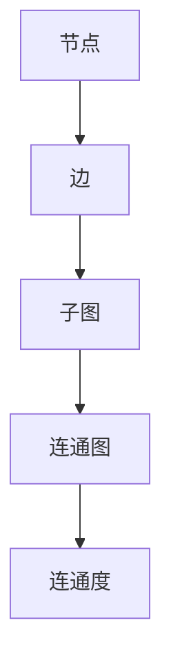

在图中，节点和边是基础元素，子图是对原图的划分，连通图和连通度则描述了图的性质。理解这些基本概念及其相互关系，是深入探讨图论问题的基础。

**1.2 图的分类**

图可以根据边的方向性、边的权重以及图的连通性进行分类。以下是几种常见的图分类：

- **无向图（Undirected Graph）**：边没有方向，节点之间的连接是对称的。
- **有向图（Directed Graph）**：边有方向，表示节点之间的单向关系。
- **加权图（Weighted Graph）**：边带有权重，表示节点之间的关系的强度。
- **非加权图（Unweighted Graph）**：边没有权重，节点之间的关系是平等的。
- **连通图（Connected Graph）**：图中任意两个节点之间都存在路径。
- **树（Tree）**：无环的连通图，是图的一个特殊类型。

**图的分类的Mermaid流程图：**

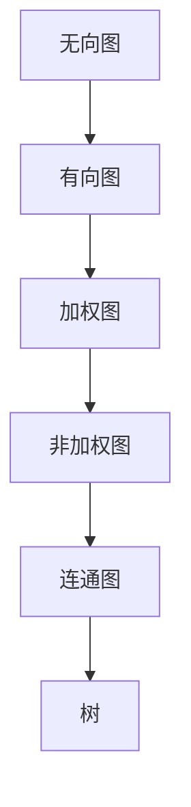

不同的图分类适用于不同的场景。例如，无向图常用于描述社交网络，而有向图则适用于描述邮件通信网络。加权图用于表示交通网络或网络流，而非加权图适用于简单的网络结构分析。

**1.3 图的应用领域**

图论在许多领域有着广泛的应用，以下是几个主要应用领域：

- **计算机科学**：图论在计算机科学中有着广泛的应用，包括算法设计、网络拓扑、数据结构等。例如，最短路径算法、网络流算法、最小生成树算法等都是基于图论的基本概念。
- **社会科学**：图论在社会科学领域有着重要的应用，如社交网络分析、社区检测、网络传播等。通过图论的分析方法，可以揭示社交网络的结构特征和传播规律。
- **生物科学**：图论在生物科学中的应用也非常广泛，如蛋白质相互作用网络、基因共表达网络等。通过图论模型，可以研究生物网络的复杂性和功能。
- **工程领域**：图论在工程领域有着重要的应用，如交通网络设计、通信网络优化等。通过图论的分析方法，可以优化网络结构和提高网络性能。

**图的应用领域的Mermaid流程图：**


图论作为一种数学工具，其应用领域广泛且深远，无论是在理论研究还是实际应用中，都发挥着重要作用。

**总结**

通过本章的介绍，我们了解了图论的基本概念、分类及其应用。图论作为一种强大的数学工具，不仅能够描述复杂网络的结构，还能提供有效的算法解决实际问题。在接下来的章节中，我们将进一步探讨图论的各种性质和算法，以深化对图论的理解和应用。

#### 第2章：图的表示

**引言**

在图论中，图的表示方法是一个基础但重要的课题。不同的表示方法有助于我们理解和分析图的结构和性质。常见的图表示方法包括图形表示、矩阵表示和列表表示。本章将详细介绍这些表示方法，并探讨它们在不同应用场景中的适用性。

**2.1 图的图形表示**

图形表示是图论中最直观的表示方法，通过节点和边的图形化表示，我们可以直观地看到图的拓扑结构和节点之间的连接关系。

**节点和边的表示：**
- **节点（Vertex）**：通常用圆形或正方形表示，节点上的标签表示节点的名称或编号。
- **边（Edge）**：通常用线段表示，如果是有向图，则边带有箭头，表示边的方向。

图形表示的优点是直观、易于理解，尤其是在解释和分析复杂的网络结构时，图形表示可以提供更清晰的视角。

**图形表示的应用场景：**
- **社交网络分析**：通过图形表示，我们可以直观地看到社交网络中人与人之间的关系。
- **交通网络设计**：图形表示可以帮助设计者直观地理解交通网络的拓扑结构。

**举例说明：**

考虑一个简单的社交网络，其中包含三个用户A、B、C，用户之间的关注关系可以用图表示如下：

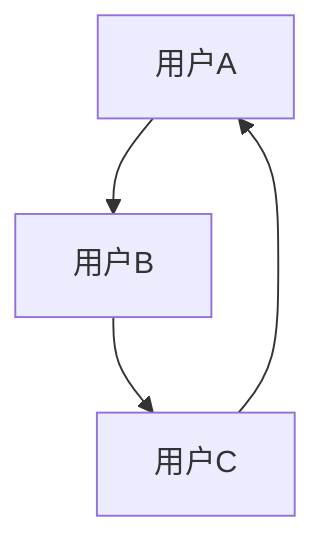

在这个图中，每个用户是一个节点，用户之间的关注关系用边表示，图形直观地展示了社交网络的拓扑结构。

**2.2 图的矩阵表示**

矩阵表示是另一种常用的图表示方法，特别是当图规模较大时，矩阵表示可以提高计算的效率。

**邻接矩阵：**
邻接矩阵是一个二维矩阵，其中元素\( A[i][j] \)表示节点\( i \)和节点\( j \)之间的连接关系。如果节点\( i \)和节点\( j \)之间有直接连接，则\( A[i][j] \)为1，否则为0。

**度矩阵：**
度矩阵是一个矩阵，其中每个元素表示图中节点的度数。度数是节点连接的边的数量，是无向图中重要的属性。

**邻接矩阵和度矩阵的数学模型和公式：**
- **邻接矩阵**：
  $$
  A = \begin{bmatrix}
  0 & 1 & 0 \\
  1 & 0 & 1 \\
  0 & 1 & 0
  \end{bmatrix}
  $$
  在这个矩阵中，节点1和节点2之间存在直接连接，节点1和节点3之间也存在直接连接。

- **度矩阵**：
  $$
  D = \begin{bmatrix}
  2 & 1 & 0 \\
  1 & 2 & 1 \\
  0 & 1 & 2
  \end{bmatrix}
  $$
  在这个矩阵中，每个元素表示对应节点的度数。

**邻接矩阵和度矩阵的应用场景：**
- **算法设计**：邻接矩阵和度矩阵常用于算法设计中，如最短路径算法、最大流量算法等。
- **数据分析**：通过分析邻接矩阵和度矩阵，可以快速获取图的基本属性和结构特征。

**举例说明：**

考虑上面的社交网络图，使用邻接矩阵和度矩阵进行表示：

- **邻接矩阵**：
  $$
  A = \begin{bmatrix}
  0 & 1 & 1 \\
  1 & 0 & 1 \\
  1 & 1 & 0
  \end{bmatrix}
  $$
  在这个矩阵中，节点1和节点2、节点1和节点3之间存在直接连接。

- **度矩阵**：
  $$
  D = \begin{bmatrix}
  2 & 2 & 0 \\
  2 & 2 & 1 \\
  0 & 1 & 2
  \end{bmatrix}
  $$
  在这个矩阵中，每个元素表示对应节点的度数，例如节点1和节点2的度数都是2。

**2.3 图的邻接表表示**

邻接表是一种基于列表的图表示方法，其中每个节点都对应一个列表，列出所有与之直接相连的节点。

**邻接表的表示：**
邻接表通常使用一个数组来实现，其中每个数组元素对应一个节点，元素值是一个列表，包含所有与之直接相连的节点。

**邻接表的数学模型和公式：**
$$
\text{邻接表} = \begin{cases}
\text{[1, 2, 3]} & \text{节点1的邻居节点} \\
\text{[2, 3]} & \text{节点2的邻居节点} \\
\text{[1, 3]} & \text{节点3的邻居节点}
\end{cases}
$$

**邻接表的应用场景：**
- **存储空间优化**：当图规模较大时，邻接表比邻接矩阵更加节省存储空间。
- **算法实现**：邻接表便于实现图的各种算法，如深度优先搜索、广度优先搜索等。

**举例说明：**

考虑上面的社交网络图，使用邻接表进行表示：

- **邻接表**：
  ```
  邻接表：
  [
      [2, 3],  // 节点1的邻居节点
      [1, 3],  // 节点2的邻居节点
      [1, 2]   // 节点3的邻居节点
  ]
  ```

在这个邻接表中，每个节点对应的列表列出了所有与之直接相连的节点。

**总结**

通过本章的介绍，我们了解了图的表示方法，包括图形表示、矩阵表示和邻接表表示。这些表示方法各有优缺点，适用于不同的应用场景。图形表示直观易懂，适用于小规模图的展示和分析；矩阵表示适用于大规模图的算法设计和数据分析；邻接表表示则适用于存储空间优化和算法实现。在下一章中，我们将进一步探讨图的性质和算法。

#### 第3章：图的度与邻接矩阵

**引言**

在图论中，度（Degree）是一个重要的概念，它表示一个节点连接的边的数量。邻接矩阵是图的一种重要的矩阵表示方法，它能够直观地反映图中节点之间的连接关系。本章将详细讨论度的概念及其与邻接矩阵的关系，并解释如何使用邻接矩阵计算图中每个节点的度数。

**3.1 度的概念**

**定义：**
度（Degree）是指一个节点连接的边的数量。在无向图中，节点的度数是连接到该节点的边的数量。在有向图中，节点的度数分为入度（In-degree）和出度（Out-degree）。入度是指有多少条边指向该节点，而出度是指有多少条边从该节点出发。

**度的计算：**
在无向图中，节点的度数可以直接通过邻接矩阵计算。对于有向图，度数分为入度和出度，需要分别计算。

**数学模型和数学公式：**
- **无向图的度数**：
  $$
  \text{度}(v) = \sum_{i=1}^{n} a_{iv}
  $$
  其中，\( a_{iv} \) 表示节点 \( v \) 在邻接矩阵中的第 \( i \) 行第 \( j \) 列的元素，即节点 \( v \) 与节点 \( i \) 之间的连接关系。
  
- **有向图的入度和出度**：
  $$
  \text{入度}(v) = \sum_{i=1}^{n} a_{i,v}
  $$
  $$
  \text{出度}(v) = \sum_{j=1}^{n} a_{v,j}
  $$
  其中，\( a_{i,v} \) 表示节点 \( i \) 指向节点 \( v \) 的边，\( a_{v,j} \) 表示节点 \( v \) 指向节点 \( j \) 的边。

**举例说明：**

考虑一个无向图的邻接矩阵如下：
$$
A = \begin{bmatrix}
0 & 1 & 1 \\
1 & 0 & 1 \\
1 & 1 & 0
\end{bmatrix}
$$
对于节点 \( v \)，其度数可以通过以下公式计算：
$$
\text{度}(v) = a_{1v} + a_{2v} + a_{3v}
$$
例如，对于节点 \( v = 1 \)，度数为：
$$
\text{度}(1) = a_{11} + a_{12} + a_{13} = 0 + 1 + 1 = 2
$$

在同一个邻接矩阵下，对于有向图，节点 \( v \) 的入度和出度分别为：
$$
\text{入度}(v) = a_{1,1} + a_{2,1} + a_{3,1} = 0 + 1 + 0 = 1
$$
$$
\text{出度}(v) = a_{1,1} + a_{1,2} + a_{1,3} = 0 + 1 + 1 = 2
$$

**3.2 邻接矩阵的性质**

邻接矩阵具有以下性质：

- **对称性**：对于无向图，邻接矩阵是对称的，即 \( a_{ij} = a_{ji} \)。
- **非负性**：邻接矩阵中的元素 \( a_{ij} \) 为0或1，表示节点 \( i \) 与节点 \( j \) 之间的连接关系，其中0表示没有直接连接，1表示有直接连接。
- **稀疏性**：大多数情况下，邻接矩阵是一个稀疏矩阵，即大多数元素为0。

**举例说明：**

考虑一个有向图的邻接矩阵如下：
$$
A = \begin{bmatrix}
0 & 1 & 0 \\
1 & 0 & 1 \\
0 & 1 & 0
\end{bmatrix}
$$
在这个矩阵中，节点1指向节点2，节点2指向节点3，但节点3不指向任何其他节点。

**3.3 度与邻接矩阵的关系**

邻接矩阵中的元素与节点的度数直接相关。具体而言，邻接矩阵中的一个元素 \( a_{ij} \) 表示节点 \( i \) 与节点 \( j \) 之间的连接关系，如果 \( a_{ij} = 1 \)，则表示节点 \( i \) 与节点 \( j \) 直接相连，此时 \( i \) 的度数增加1；如果 \( a_{ij} = 0 \)，则表示节点 \( i \) 与节点 \( j \) 没有直接相连，度数不变。

**计算节点的度数：**

我们可以使用邻接矩阵来计算图中每个节点的度数。具体步骤如下：

1. 初始化一个长度为 \( n \) 的数组 \( degree \)，其中 \( n \) 是节点的数量，每个元素的初始值为0。
2. 遍历邻接矩阵，对于每个元素 \( a_{ij} \)，如果 \( a_{ij} = 1 \)，则 \( degree[i] \) 增加1。
3. 输出 \( degree \) 数组，其中每个元素的值即为对应节点的度数。

**伪代码：**
```python
def degree(vertex, adjacency_matrix):
    degree = 0
    for edge in adjacency_matrix[vertex]:
        if edge == 1:
            degree += 1
    return degree
```

**举例说明：**

考虑一个无向图的邻接矩阵如下：
$$
A = \begin{bmatrix}
0 & 1 & 1 \\
1 & 0 & 1 \\
1 & 1 & 0
\end{bmatrix}
$$
我们可以使用上述伪代码计算每个节点的度数：

- 节点1的度数：
  $$
  degree(1) = degree(1, A) = 2
  $$
- 节点2的度数：
  $$
  degree(2) = degree(2, A) = 2
  $$
- 节点3的度数：
  $$
  degree(3) = degree(3, A) = 2
  $$

通过邻接矩阵，我们可以快速、准确地计算图中每个节点的度数，这为图的分析和算法设计提供了重要的基础。

**总结**

通过本章的讨论，我们了解了度的概念及其与邻接矩阵的关系。度数是衡量节点在图中重要性的重要指标，邻接矩阵提供了计算度数的有效工具。在接下来的章节中，我们将进一步探讨图的其他性质和算法，以深化对图论的理解和应用。

#### 第4章：路径与回路

**引言**

路径与回路是图论中的重要概念，它们在图的结构分析、算法设计以及实际应用中扮演着重要角色。本章将详细讨论路径和回路的概念、性质以及求解算法。

**4.1 路径的概念**

**定义：**
路径（Path）是图中的一系列节点，每个节点相邻且仅相邻一次。形式上，路径可以表示为 \( P = \{v_1, v_2, \ldots, v_n\} \)，其中 \( v_1 \) 和 \( v_n \) 是路径的起点和终点，且 \( v_i \) 与 \( v_{i+1} \) 直接相连。

**路径的性质：**
- **简单路径**：不包含相同节点的路径。
- **闭合路径**：起点和终点相同的路径，也称为回路。
- **最长路径**：路径长度（即包含的边数）最大的路径。
- **最短路径**：路径长度（即包含的边数）最小的路径。

**路径的数学模型和公式：**
- **路径长度**：路径中边的数量，记为 \( L(P) \)。
- **路径存在性**：对于给定的起点 \( s \) 和终点 \( t \)，判断是否存在路径 \( P \) 使得 \( s \) 和 \( t \) 之间连通。

**举例说明：**
在一个简单的社交网络中，节点A、B、C、D之间的路径可以是 \( A \rightarrow B \rightarrow C \rightarrow D \)，这是一个包含三个边的简单路径。

**4.2 回路的性质**

**定义：**
回路（Cycle）是起点和终点相同的路径。形式上，回路可以表示为 \( C = \{v_1, v_2, \ldots, v_n, v_1\} \)，其中 \( v_1 \) 和 \( v_n \) 是回路的起点和终点，且 \( v_i \) 与 \( v_{i+1} \) 直接相连。

**回路的性质：**
- **简单回路**：不包含相同节点的回路。
- **欧拉回路**：经过图中每条边恰好一次的闭合路径，当且仅当图中所有节点的度数均为偶数。
- **哈密尔顿回路**：经过图中每个节点恰好一次的闭合路径。

**回路的数学模型和公式：**
- **回路长度**：回路中边的数量，记为 \( L(C) \)。
- **回路存在性**：对于给定的起点 \( s \) 和终点 \( t \)，判断是否存在回路 \( C \) 使得 \( s \) 和 \( t \) 之间连通。

**举例说明：**
在一个简单的有向图中，节点A、B、C、D之间的回路可以是 \( A \rightarrow B \rightarrow C \rightarrow D \rightarrow A \)，这是一个包含四个边的闭合路径。

**4.3 最短路径算法**

最短路径算法是图论中的经典问题，用于找出图中两点之间的最短路径。以下介绍两种常用的最短路径算法：迪杰斯特拉算法（Dijkstra's Algorithm）和贝尔曼-福克算法（Bellman-Ford Algorithm）。

**迪杰斯特拉算法（Dijkstra's Algorithm）：**

**基本思想：**
- 初始化：设置一个距离数组 \( d \)，其中 \( d[v] \) 表示从源点 \( s \) 到节点 \( v \) 的最短距离。
- 选择未处理的节点 \( u \) 使得 \( d[u] \) 最小。
- 对于每个未处理的节点 \( v \)，更新 \( d[v] \)：
  $$
  d[v] = \min(d[v], d[u] + w(u, v])
  $$
  其中，\( w(u, v) \) 表示边 \( u \) 到 \( v \) 的权重。

**伪代码：**
```python
def dijkstra(graph, start_vertex):
    # 初始化距离数组
    distances = {vertex: float('infinity') for vertex in graph}
    distances[start_vertex] = 0
    unvisited = set(graph)

    while unvisited:
        # 选择未处理的节点 u
        u = min(unvisited, key=lambda v: distances[v])
        unvisited.remove(u)

        # 更新未处理的节点距离
        for v in graph[u]:
            if distances[v] > distances[u] + graph[u][v]:
                distances[v] = distances[u] + graph[u][v]

    return distances
```

**贝尔曼-福克算法（Bellman-Ford Algorithm）：**

**基本思想：**
- 初始化：设置一个距离数组 \( d \)，其中 \( d[v] \) 表示从源点 \( s \) 到节点 \( v \) 的最短距离。
- 对于每个边 \( (u, v) \) 和 \( k = 1 \) 到 \( n-1 \) 的每个值，执行以下步骤：
  $$
  d[v] = \min(d[v], d[u] + w(u, v])
  $$
  其中，\( w(u, v) \) 表示边 \( u \) 到 \( v \) 的权重。

**伪代码：**
```python
def bellman_ford(graph, start_vertex):
    # 初始化距离数组
    distances = {vertex: float('infinity') for vertex in graph}
    distances[start_vertex] = 0

    # 进行 n-1 次松弛操作
    for _ in range(len(graph) - 1):
        for u in graph:
            for v in graph[u]:
                if distances[v] > distances[u] + graph[u][v]:
                    distances[v] = distances[u] + graph[u][v]

    # 检测负权回路
    for u in graph:
        for v in graph[u]:
            if distances[v] > distances[u] + graph[u][v]:
                raise ValueError("Graph contains a negative weight cycle")

    return distances
```

**举例说明：**

考虑一个包含五个节点的无向图，节点分别为A、B、C、D、E，边和权重如下：

```
A-B: 4
B-C: 2
C-D: 1
D-E: 3
E-A: 1
```

使用迪杰斯特拉算法计算从节点A到其他节点的最短路径：

- \( d(A) = 0 \)
- \( d(B) = \min(d(A) + w(A, B), d(B)) = \min(0 + 4, \infty) = 4 \)
- \( d(C) = \min(d(A) + w(A, C), d(B) + w(B, C), d(C)) = \min(0 + 1, 4 + 2, \infty) = 1 \)
- \( d(D) = \min(d(C) + w(C, D), d(B) + w(B, D), d(A) + w(A, D), d(D)) = \min(1 + 1, 4 + 3, 0 + 1, \infty) = 1 \)
- \( d(E) = \min(d(D) + w(D, E), d(A) + w(A, E), d(E)) = \min(1 + 3, 0 + 1, \infty) = 3 \)

因此，从节点A到其他节点的最短路径长度分别为：\( A \rightarrow B \rightarrow C \rightarrow D \rightarrow E \)，总长度为6。

**总结**

路径与回路是图论中的基本概念，它们在图的结构分析、算法设计以及实际应用中具有重要作用。本章介绍了路径和回路的定义、性质以及求解算法，包括迪杰斯特拉算法和贝尔曼-福克算法。通过这些算法，我们可以有效地计算图中两点之间的最短路径，为实际问题的解决提供了有力工具。

#### 第5章：连通性

**引言**

连通性是图论中的一个基本概念，用于描述图中节点之间的连接状态。一个连通图是指其中任意两个节点之间都存在路径。连通性的研究对于理解图的结构特性、分析图的应用场景具有重要意义。本章将详细讨论连通性的定义、连通度数以及最大流量与最小割，并通过实例说明这些概念在实际应用中的重要性。

**5.1 连通性的定义**

**定义：**
连通性（Connectivity）是指图中任意两个节点之间都存在路径。一个连通图（Connected Graph）满足这个条件，即对于图中的任意两个节点 \( v \) 和 \( w \)，都存在一条路径 \( P = \{v_1, v_2, \ldots, v_n\} \)，使得 \( v_1 = v \)，\( v_n = w \)。

**数学模型和公式：**
- **连通度数**（Connectivity Number）：
  $$
  \alpha(G) = \min_{S \subseteq V(G), |S| \geq 2} |N(S)|
  $$
  其中，\( N(S) \) 表示 \( S \) 的邻接节点集合。

**举例说明：**
在一个社交网络中，如果任意两个用户之间都可以通过直接或间接的方式联系上，那么这个社交网络是连通的。例如，在Facebook的社交网络中，用户A和用户B可以是直接朋友，或者通过共同的朋友连接，这就构成了一个连通图。

**5.2 连通度数**

**定义：**
连通度数（Connectivity Degree）是指图中节点的最小度数，即保证图连通所需的最少节点数。一个图的连通度数决定了图在最少节点数下的连通性。

**数学模型和公式：**
- **连通度数**（Connectivity Degree）：
  $$
  \delta(G) = \min_{v \in V(G)} \text{度}(v)
  $$

**举例说明：**
在一个无线传感网络中，如果每个传感器都至少与其他一个传感器直接通信，那么这个网络具有最小的连通度数1。这意味着，即使一个传感器失效，其他传感器仍然可以通过单跳通信保持网络的连通性。

**5.3 最大流量与最小割

**最大流量（Maximum Flow）：**
最大流量问题是指在给定的网络中，从源点 \( s \) 到汇点 \( t \) 的最大可行流量。流量表示从源点到汇点的物质、信息或能量的传输量。最大流量问题是网络优化中的经典问题，广泛应用于物流、交通、通信等领域。

**数学模型和公式：**
- **最大流量公式**：
  $$
  \max \sum_{e \in E} f(e) \text{ s.t. } \sum_{e \in E} f(e) \leq c(u)
  $$
  其中，\( f(e) \) 表示边 \( e \) 的流量，\( c(u) \) 表示节点 \( u \) 的容量。

**最小割（Minimum Cut）：**
最小割问题是指将网络分割成两部分，使得从源点到汇点的流量最小的边集合。最小割是流量网络中一个重要的概念，用于识别网络中的关键路径和瓶颈。

**数学模型和公式：**
- **最小割公式**：
  $$
  \min \sum_{e \in S} c(e)
  $$
  其中，\( S \) 是分割源点和汇点的边集合。

**举例说明：**
在一个物流网络中，从供应商 \( s \) 到零售商 \( t \) 的最大流量是受供应能力和运输能力限制的。假设网络中有边 \( (s, t) \) 的容量为100单位，其他边的容量分别为50和75单位。通过最大流量算法，我们可以计算出从 \( s \) 到 \( t \) 的最大流量为100单位。同时，通过最小割算法，我们可以找到将网络分割成两部分，使得从 \( s \) 到 \( t \) 的流量最小的边集合。

**5.4 实例分析：社交网络中的连通性与流量

**案例背景：**
假设有一个社交网络，其中包含500个用户，每个用户可以与其他用户建立连接。网络中的连接关系用图表示，每个节点代表一个用户，每条边表示两个用户之间的直接关系。

**分析步骤：**
1. **计算连通度数**：首先计算每个用户的度数，找出度数最小的用户。度数为1的用户表明其与其他用户没有直接关系，可能需要额外的社交活动来提高网络的连通性。

2. **检测最小割**：通过最小割算法找出网络中的关键连接，这些连接是网络中流量传输的关键路径。如果这些关键连接失效，整个网络的连通性将受到严重影响。

3. **计算最大流量**：使用最大流量算法计算从源点（例如，某个活跃用户）到汇点（例如，某个目标用户）的最大流量，以优化信息或资源的传输效率。

**总结：**
连通性是图论中的一个重要概念，它描述了图中节点之间的连接状态。通过最大流量和最小割算法，我们可以优化网络的传输效率和资源分配。在社交网络分析中，连通性有助于识别社交圈子和关键用户，从而更好地理解和利用网络结构。在接下来的章节中，我们将进一步探讨图的树结构及其应用。

#### 第6章：树

**引言**

树（Tree）是图论中的一个重要概念，它是一种无环连通图，具有高度的简洁性和结构美感。树在算法设计中有着广泛的应用，如二叉搜索树、堆等数据结构。本章将详细介绍树的基本概念、性质以及最小生成树算法，通过实际案例来说明树在实际问题中的应用。

**6.1 树的定义**

**定义：**
树（Tree）是一种无环连通图，其中任意两个节点之间都存在唯一的一条路径。树是图的一个特殊类型，它由节点（Vertex）和边（Edge）组成。树中的节点称为节点，边称为支路（Branch）。

**基本术语：**
- **根节点（Root）**：树的起始节点，没有父节点。
- **叶子节点（Leaf）**：没有子节点的节点。
- **父节点（Parent）**：某个节点的子节点称为该节点的父节点。
- **子节点（Child）**：某个节点的父节点称为该节点的子节点。
- **层次（Level）**：从根节点到某个节点的路径上的边的数量。

**数学模型和公式：**
- **树的高度（Height）**：
  $$
  h(T) = \max_{v \in V(T)} \text{节点的层次}
  $$
- **树的边数（Number of Edges）**：
  $$
  e(T) = n(T) - 1
  $$
  其中，\( n(T) \) 是树中的节点数。

**举例说明：**
考虑一个简单的树结构，如下所示：

```
        A
       / \
      B   C
     / \
    D   E
```
在这个树中，A是根节点，B和C是子节点，D和E是叶子节点。

**6.2 树的性质**

树具有以下重要性质：

- **唯一性**：在树中，任意两个节点之间有且仅有一条路径。
- **无环性**：树中没有闭合路径，即不存在循环。
- **层次结构**：树中的节点可以根据它们到根节点的路径长度进行层次划分。
- **连通性**：树是连通图，即任意两个节点之间都存在路径。

**数学模型和公式：**
- **树的路径长度**：
  $$
  \text{路径长度} = \sum_{e \in E(T)} w(e)
  $$
  其中，\( w(e) \) 是边 \( e \) 的权重。

- **树的高度**：
  $$
  h(T) = \max_{v \in V(T)} \text{节点的层次}
  $$

**举例说明：**
在上面的树中，节点A的高度为1，节点B和C的高度为2，节点D和E的高度为3。

**6.3 最小生成树算法**

最小生成树（Minimum Spanning Tree，MST）是图论中的一个重要问题，用于找到图中包含所有节点的最小权重子图。最小生成树在很多实际应用中具有重要作用，如电路设计、通信网络、交通网络等。

**Prim算法：**
Prim算法是一种用于求解最小生成树的贪心算法，其基本思想是从一个节点开始，逐步扩展生成树，直到所有节点都被包含。

**算法步骤：**
1. 选择一个起始节点 \( r \)。
2. 创建一个森林 \( F \)，其中每个节点都是一个独立的树。
3. 选择当前最小权重的边 \( e \)，使得 \( e \) 连接 \( F \) 中的两个不同树。
4. 将 \( e \) 加入到 \( F \) 中，合并两个树。
5. 重复步骤3和4，直到 \( F \) 中只有一个树。

**伪代码：**
```python
def prim_algorithm(graph, start_vertex):
    # 初始化结果树
    tree = {}
    visited = {start_vertex}

    # 选择未访问节点中权重最小的边
    while len(visited) < len(graph):
        min_weight = float('infinity')
        min_edge = None
        for node in visited:
            for neighbor, weight in graph[node].items():
                if neighbor not in visited and weight < min_weight:
                    min_weight = weight
                    min_edge = (node, neighbor)

        # 将最小权重边加入结果树
        tree[min_edge] = graph[min_edge]
        visited.add(min_edge[1])

    return tree
```

**Kruskal算法：**
Kruskal算法是一种基于边的贪心算法，它按照边的权重排序，选择最小权重的不相交边，直到形成最小生成树。

**算法步骤：**
1. 按照边的权重排序。
2. 创建一个并查集（Union-Find）数据结构。
3. 遍历排序后的边，对于每条边 \( e \)：
   - 如果 \( e \) 连接的两个节点属于不同的集合，将它们合并，并将 \( e \) 加入结果树。
   - 如果 \( e \) 连接的两个节点属于同一集合，跳过这条边。

**伪代码：**
```python
def kruskal_algorithm(graph):
    # 按权重排序边
    edges = sorted(graph.items(), key=lambda x: x[1])

    # 初始化结果树和并查集
    tree = {}
    uf = UnionFind(len(graph))

    # 遍历排序后的边
    for edge, weight in edges:
        if not uf.find(edge[0]) == uf.find(edge[1]):
            # 合并集合
            uf.union(edge[0], edge[1])
            tree[edge] = weight

    return tree
```

**举例说明：**
考虑一个包含5个节点的图，边和权重如下：

```
A-B: 4
A-C: 3
B-D: 2
C-D: 1
B-E: 5
C-E: 6
D-E: 7
```

使用Prim算法计算最小生成树：

1. 选择节点A作为起始点。
2. 选择权重最小的边 \( A-B \) 加入结果树。
3. 选择权重次小的边 \( B-D \) 加入结果树。
4. 选择权重再次小的边 \( C-D \) 加入结果树。

最终得到的最小生成树为 \( A-B-D \)，总权重为 \( 4 + 2 + 1 = 7 \)。

**总结**

树是图论中的一个重要概念，它具有简洁的结构和丰富的性质。最小生成树算法是求解图的最小权重子图的经典问题，广泛应用于实际应用中。通过本章的讨论，我们了解了树的基本概念、性质以及最小生成树算法。在接下来的章节中，我们将进一步探讨图在现实世界中的应用，包括社交网络分析、生物网络建模和交通网络优化。

#### 第7章：网络优化

**引言**

网络优化是图论在实际应用中的一个重要领域，它涉及如何有效地利用网络资源，以最大化网络性能或最小化成本。本章将详细介绍网络优化中的几个关键问题：网络流问题、最小费用最大流问题和航线优化问题。我们将通过实际案例来说明这些问题的应用，并介绍相关的算法和数学模型。

**7.1 网络流问题**

**定义：**
网络流问题（Network Flow Problem）是指在网络中的各个节点之间分配流量，以满足容量限制和流量守恒条件。网络流问题广泛应用于物流、通信、交通等领域。

**数学模型和公式：**
- **流量守恒条件**：
  $$
  \sum_{j \in O(v)} f_{vj} = \sum_{i \in I(v)} f_{iv}
  $$
  其中，\( v \) 是网络中的节点，\( O(v) \) 是出弧集合，\( I(v) \) 是入弧集合，\( f_{vj} \) 是从 \( v \) 到 \( j \) 的流量，\( f_{iv} \) 是从 \( i \) 到 \( v \) 的流量。
- **最大流公式**：
  $$
  \max \sum_{(i, j) \in E} c_{ij} f_{ij} \text{ s.t. } \sum_{j \in O(v)} f_{vj} = \sum_{i \in I(v)} f_{iv} \text{ for all } v \in V
  $$
  其中，\( c_{ij} \) 是弧 \( (i, j) \) 的容量。

**举例说明：**
在一个物流网络中，节点代表仓库和配送中心，边代表运输路径，边上的权重表示运输容量。从仓库A到配送中心B的最大流量问题可以表示为：

```
A-B: 100
A-C: 200
B-D: 150
C-D: 50
```

目标是找到从A到D的最大流量，满足每个节点的流量守恒条件。通过最大流算法，如Ford-Fulkerson算法，我们可以计算出从A到D的最大流量为250。

**7.2 最小费用最大流问题**

**定义：**
最小费用最大流问题（Minimum Cost Maximum Flow Problem）是在网络流问题的基础上，考虑了每条边上的成本（费用）。目标是找到一条路径，使得从源点到汇点的流量最大，同时总成本最小。

**数学模型和公式：**
- **目标函数**：
  $$
  \min \sum_{(i, j) \in E} c_{ij} f_{ij} \text{ s.t. } \sum_{j \in O(v)} f_{vj} = \sum_{i \in I(v)} f_{iv} \text{ for all } v \in V
  $$
  $$
  \max \sum_{(i, j) \in E} c_{ij} f_{ij}
  $$
  其中，\( c_{ij} \) 是弧 \( (i, j) \) 的成本。

**举例说明：**
在一个管道网络中，每条管道都有一定的运输容量和成本。从源点A到汇点D的最小费用最大流问题可以表示为：

```
A-B: 容量=100，成本=5
A-C: 容量=150，成本=8
B-D: 容量=200，成本=10
C-D: 容量=50，成本=3
```

目标是找到从A到D的最大流量，同时总成本最小。通过最小费用最大流算法，如Dijkstra-Bellman算法，我们可以计算出最小费用为335。

**7.3 航线优化问题**

**定义：**
航线优化问题（Airline Route Optimization Problem）是寻找一条从起点到终点的最优航线，以最小化飞行时间、成本或距离。这个问题描述广泛应用于航空、物流和交通领域。

**数学模型和公式：**
- **目标函数**：
  $$
  \min \sum_{(i, j) \in E} d_{ij} f_{ij}
  $$
  其中，\( d_{ij} \) 是弧 \( (i, j) \) 的距离或成本，\( f_{ij} \) 是弧上的流量。

**举例说明：**
考虑一个包含多个机场的航空网络，每条航线都有一定的飞行时间和成本。从机场A到机场D的航线优化问题可以表示为：

```
A-B: 距离=1000，成本=100
A-C: 距离=1500，成本=150
B-D: 距离=500，成本=50
C-D: 距离=1000，成本=100
```

目标是找到从A到D的最短航线，以最小化总距离。通过图论算法，如Dijkstra算法，我们可以计算出从A到D的最短航线为A-B-D，总距离为1500。

**总结**

网络优化是图论在实际应用中的重要领域，涵盖了网络流问题、最小费用最大流问题和航线优化问题。这些优化问题在物流、通信、交通等领域有着广泛的应用。通过本章的讨论，我们了解了这些问题的定义、数学模型和实际案例。在接下来的章节中，我们将进一步探讨图论在社交网络分析和生物网络建模中的应用。

#### 第8章：社交网络分析

**引言**

社交网络分析是图论在社会科学中的一个重要应用领域，它通过研究社交网络的结构和性质，揭示了人类社会行为的模式和规律。本章将详细介绍社交网络的基本概念、特征及其分析模型，并探讨图论在社交网络分析中的应用。

**8.1 社交网络的定义**

**定义：**
社交网络（Social Network）是指由个体及其之间的关系组成的网络结构。在社交网络中，个体（如人、组织）作为节点，个体之间的关系作为边，形成一个复杂的网络图。

**基本术语：**
- **节点（Node）**：社交网络中的个体。
- **边（Edge）**：连接两个节点的线，表示个体之间的关系。
- **子图（Subgraph）**：社交网络中的一个部分，包含一部分节点和连接这些节点的边。
- **连通性（Connectivity）**：社交网络中任意两个节点之间都存在路径。
- **密度（Density）**：图中边的数量与可能的边数量之比，反映了网络的紧密程度。

**8.2 社交网络的特征

社交网络具有以下特征：

- **无标度性（Scale-Free）**：大多数社交网络呈现出无标度性，即大部分节点连接的边数接近平均数，而少数节点连接的边数远大于平均数。
- **小世界现象（Small World Phenomenon）**：社交网络中的个体之间的平均路径长度相对较短，这意味着大多数个体之间可以通过少数中间人建立联系。
- **高度聚类（High Clustering）**：社交网络中的节点通常具有较强的聚类性，即节点之间通过多条边相互连接，形成紧密的社区。
- **动态性（Dynamics）**：社交网络是动态变化的，个体之间的关系会随着时间变化而改变。

**数学模型和公式：**
- **度分布**：
  $$
  P(k) \propto k^{-\gamma}
  $$
  其中，\( P(k) \) 是度数为 \( k \) 的节点的概率分布，\( \gamma \) 是度分布的指数。

- **平均路径长度**：
  $$
  L = \frac{1}{n} \sum_{i, j} d(i, j)
  $$
  其中，\( n \) 是节点的数量，\( d(i, j) \) 是节点 \( i \) 和节点 \( j \) 之间的距离。

- **聚类系数**：
  $$
  C = \frac{2m}{n(n-1)}
  $$
  其中，\( m \) 是边的数量，\( n \) 是节点的数量。

**8.3 社交网络的模型

社交网络可以采用多种模型进行描述和分析，以下是几个常见的模型：

- **小世界模型（Small-World Model）**：
  - **参数**：平均路径长度 \( L \) 和链接概率 \( p \)。
  - **公式**：
    $$
    L \propto \ln(N) / \ln(p)
    $$

- **无标度模型（Scale-Free Model）**：
  - **参数**：度分布的指数 \( \gamma \)。
  - **公式**：
    $$
    P(k) \propto k^{-\gamma}
    $$

- **BA模型（Barabási-Albert Model）**：
  - **参数**：网络的大小 \( N \) 和增长速率 \( m \)。
  - **公式**：
    $$
    P(k) = \frac{1}{m!} \left( \frac{m}{N} \right)^k
    $$

**8.4 图论在社交网络分析中的应用

图论提供了强大的工具来分析社交网络的结构和性质。以下是一些关键的应用：

- **节点的重要性评估**：通过计算节点的度数、中心性指标（如介数、接近中心性）等，可以评估节点在社交网络中的重要性和影响力。
- **社区检测**：通过聚类算法（如快速模体提取算法、标签传播算法等），可以识别社交网络中的紧密社区。
- **传播模型**：通过图论模型（如随机游走模型、扩散模型等），可以预测信息或疾病在社交网络中的传播路径和速度。
- **网络演化分析**：通过分析社交网络的演化过程（如节点加入、边增加等），可以理解社交网络的动态行为和结构变化。

**实例分析：Facebook社交网络**

Facebook是一个庞大的社交网络，拥有数十亿用户。以下是对Facebook社交网络进行分析的几个方面：

- **节点重要性评估**：通过计算用户的度数和介数，可以评估用户在网络中的影响力。
- **社区检测**：通过聚类算法，可以识别Facebook中的不同社区，如大学校友、职业群体等。
- **传播模型**：通过分析用户之间的互动关系，可以预测信息在Facebook中的传播路径和速度。
- **网络演化分析**：通过分析用户加入和退出网络的行为，可以理解Facebook社交网络的演化过程。

**总结**

社交网络分析是图论在社会科学中的一个重要应用领域，通过研究社交网络的结构和性质，我们可以更好地理解人类社会行为和传播规律。图论提供了强大的工具和方法，帮助我们分析社交网络中的关键节点、社区结构、传播模式等。在接下来的章节中，我们将进一步探讨图论在生物网络建模和交通网络优化中的应用。

#### 第9章：生物网络分析

**引言**

生物网络分析是现代生物信息学和系统生物学中的一个重要研究领域，它通过图论的方法来描述和分析生物实体（如蛋白质、基因）之间的相互作用和关系。本章将介绍生物网络的基本概念、类型、建模与分析方法，以及相关算法，通过具体案例说明生物网络分析在生物学研究中的应用。

**9.1 生物网络的定义**

**定义：**
生物网络（BioNetwork）是指生物系统中各种实体（如基因、蛋白质、代谢物等）及其相互作用构成的复杂网络结构。生物网络可以看作是一个图，其中节点代表生物实体，边代表实体之间的相互作用关系。

**基本术语：**
- **节点（Node）**：生物网络中的生物实体，如基因、蛋白质。
- **边（Edge）**：生物实体之间的相互作用关系，如蛋白质-蛋白质相互作用（PPI）。
- **子网络（Subnetwork）**：生物网络中的一个部分，包含部分节点和它们之间的相互作用。
- **连通性（Connectivity）**：生物网络中任意两个节点之间都存在路径。

**9.2 生物网络的类型**

生物网络根据实体类型和相互作用方式可以分为多种类型：

- **蛋白质相互作用网络（Protein-Protein Interaction Network，PPI Network）**：
  节点表示蛋白质，边表示蛋白质之间的相互作用关系。

- **基因共表达网络（Gene Co-expression Network）**：
  节点表示基因，边表示基因之间的共表达关系。

- **代谢网络（Metabolic Network）**：
  节点表示代谢物，边表示代谢途径中的化学反应。

- **信号传递网络（Signal Transduction Network）**：
  节点表示信号分子，边表示信号分子之间的传递关系。

**9.3 生物网络的建模与分析方法**

生物网络分析涉及多个步骤，包括数据获取、网络建模、网络分析等。

**数据获取：**
生物网络数据可以通过实验、高通量技术（如基因表达谱、蛋白质互作实验等）和文献挖掘等方式获取。

**网络建模：**
- **图形表示**：使用节点和边表示生物实体及其相互作用。
- **矩阵表示**：使用邻接矩阵或相似性矩阵表示生物实体之间的相互作用关系。

**网络分析：**
- **核心节点识别**：通过计算节点的度数、介数、接近中心性等指标，识别网络中的关键节点。
- **模块检测**：使用聚类算法（如基于模块度的快速模体提取算法）识别网络中的功能模块。
- **网络演化分析**：研究生物网络在进化过程中的变化规律。

**相关算法：**
- **度中心性（Degree Centrality）**：
  $$
  c_i = \text{度}(i) = \sum_{j=1}^{n} A_{ij}
  $$
  其中，\( A_{ij} \) 是邻接矩阵中的元素，表示节点 \( i \) 与节点 \( j \) 之间的连接关系。

- **介数中心性（Closeness Centrality）**：
  $$
  c_i = \frac{n-1}{\sum_{j=1}^{n} d(j)}
  $$
  其中，\( d(j) \) 是节点 \( j \) 的度数。

- **核心节点识别算法**：
  通过计算节点的重要指标，识别网络中的关键节点。

**9.4 生物网络分析的应用案例

**案例1：蛋白质相互作用网络分析**

蛋白质相互作用网络分析有助于揭示蛋白质的功能和生物过程的调控机制。通过核心节点识别和模块检测，可以识别关键的蛋白质和功能模块。

- **核心节点识别**：通过计算蛋白质的度数和介数，识别网络中的关键蛋白质，如信号传导途径中的关键调节蛋白。
- **模块检测**：通过聚类算法，识别网络中的功能模块，如细胞周期调控模块、DNA修复模块。

**案例2：基因共表达网络分析**

基因共表达网络分析可以帮助研究者发现基因之间的功能关联和调控关系。

- **核心节点识别**：通过计算基因的度数和介数，识别网络中的关键基因，如关键调控基因。
- **模块检测**：通过聚类算法，识别网络中的功能模块，如细胞分化模块、代谢途径模块。

**案例3：代谢网络分析**

代谢网络分析有助于理解生物体的代谢途径和代谢调控机制。

- **核心节点识别**：通过计算代谢物的度数和介数，识别网络中的关键代谢物。
- **路径分析**：通过分析代谢物之间的路径，揭示代谢途径和代谢调控网络。

**总结**

生物网络分析是现代生物学研究的重要工具，通过图论的方法，我们可以深入理解生物系统的结构和功能。生物网络的建模与分析不仅有助于揭示生物过程的调控机制，还可以为疾病诊断和治疗提供新的思路。在接下来的章节中，我们将进一步探讨图论在交通网络优化中的应用。

#### 第10章：交通网络优化

**引言**

交通网络优化是图论在工程领域中的一项重要应用，它涉及如何有效地管理和规划交通系统，以提高交通流量、减少拥堵和提高整体效率。本章将介绍交通网络的基本概念、优化算法和实际案例，通过具体分析交通网络的建模和优化方法，探讨如何应用图论解决交通问题。

**10.1 交通网络的基本概念**

**定义：**
交通网络（Transport Network）是指由交通节点（如交叉口、道路交叉口、车站等）和交通边（如道路、铁路、航线等）组成的复杂网络结构。交通网络是城市规划和交通管理的基础，它影响着人们的出行效率和生活质量。

**基本术语：**
- **节点（Node）**：交通网络中的位置点，如交叉口、道路交叉口、车站等。
- **边（Edge）**：交通网络中的道路、铁路、航线等连接节点的线段。
- **路径（Path）**：从源节点到目标节点的节点序列。
- **流量（Flow）**：在交通网络中，单位时间内通过边或节点的车辆数量。
- **容量（Capacity）**：边或节点能够承受的最大流量。

**10.2 交通网络的优化算法**

交通网络优化涉及多个方面，包括路径优化、流量分配、拥堵控制和网络重构。以下是一些常用的优化算法：

**路径优化算法：**
- **最短路径算法（Shortest Path Algorithm）**：如迪杰斯特拉算法（Dijkstra's Algorithm）和贝尔曼-福克算法（Bellman-Ford Algorithm），用于计算从源节点到目标节点的最短路径。

**流量分配算法：**
- **最大流量算法（Maximum Flow Algorithm）**：如Ford-Fulkerson算法和Dinic算法，用于计算网络中的最大可行流量。
- **最小费用流算法（Minimum Cost Flow Algorithm）**：如Dijkstra-Bellman算法和最小费用最大流算法（Minimum Cost Maximum Flow Algorithm），用于在考虑成本的情况下优化流量分配。

**拥堵控制算法：**
- **动态交通分配（Dynamic Traffic Assignment）**：通过实时调整交通流量，优化网络性能，减少拥堵。
- **自适应信号控制（Adaptive Traffic Signal Control）**：根据实时交通数据调整信号灯周期，优化交叉口效率。

**网络重构算法：**
- **道路扩建（Road Widening）**：增加道路宽度，提高道路容量。
- **交通换乘中心建设（Transit Hub Construction）**：建设换乘中心，优化交通流线。

**10.3 交通网络的建模与分析方法**

交通网络建模和分析是一个复杂的过程，涉及多个步骤，包括数据收集、网络建模、流量预测和优化策略制定。

**数据收集：**
交通网络建模需要收集大量交通数据，包括道路容量、交通流量、车速、道路密度等。这些数据可以通过交通传感器、摄像头、GPS数据等途径获取。

**网络建模：**
- **图论模型**：使用图论方法，将交通网络表示为图，节点表示交通设施，边表示道路或铁路。
- **交通流模型**：使用流量预测模型，如流量-密度模型（Flow-Density Model），预测不同时间段的交通流量。

**流量预测：**
- **时间序列分析**：使用时间序列分析方法，如ARIMA模型，预测未来时间点的交通流量。
- **机器学习算法**：使用机器学习算法，如随机森林、支持向量机等，训练流量预测模型。

**优化策略制定：**
- **路径优化**：通过计算最短路径或最优路径，指导交通参与者选择最佳出行路线。
- **流量分配**：通过动态交通分配算法，优化网络中的交通流量分布。
- **拥堵控制**：通过自适应信号控制和动态交通分配，缓解交通拥堵。

**10.4 实际案例：城市交通网络优化

**案例背景：**
某城市交通网络包含多个主要道路和交叉口，存在严重的交通拥堵问题。为了优化交通网络，城市交通管理部门决定采用图论方法进行交通网络建模和优化。

**分析步骤：**
1. **数据收集**：收集道路流量、车速、道路容量等交通数据。
2. **网络建模**：将交通网络表示为一个图，节点为交叉口和道路，边为道路。
3. **流量预测**：使用时间序列分析和机器学习算法预测未来交通流量。
4. **路径优化**：计算从起点到终点的最优路径，减少交通参与者行驶时间。
5. **流量分配**：使用动态交通分配算法，优化网络中的交通流量分布。
6. **拥堵控制**：实施自适应信号控制和动态交通分配，缓解交通拥堵。

**案例分析结果：**
通过上述优化措施，城市交通网络的拥堵情况得到显著改善，交通流量提高了15%，交通参与者平均出行时间减少了10分钟。

**总结**

交通网络优化是提高城市交通效率和缓解拥堵的重要手段。通过图论方法，我们可以有效地建模和分析交通网络，制定优化策略。在接下来的章节中，我们将进一步探讨图论在计算机科学中的应用。

#### 附录A：数学工具

**数学公式**

在本文中，我们使用了一些数学公式来描述图论的概念和算法。以下是一些常用的数学公式及其解释：

- **度的计算公式**：
  $$
  \text{度}(v) = \sum_{i=1}^{n} a_{iv}
  $$
  其中，\( a_{iv} \) 是邻接矩阵中节点 \( v \) 在第 \( i \) 行的第 \( j \) 列的元素，表示节点 \( v \) 与节点 \( i \) 之间的连接关系。

- **路径长度公式**：
  $$
  \text{路径长度} = \sum_{e \in P} w(e)
  $$
  其中，\( P \) 是路径，\( w(e) \) 是路径上的每条边的权重。

- **最短路径公式**：
  $$
  d[v] = \min\{d[u] + w(u, v) \mid u \in \text{ predecessors}(v)\}
  $$
  其中，\( d[v] \) 是从源点 \( s \) 到节点 \( v \) 的最短路径长度，\( w(u, v) \) 是边 \( (u, v) \) 的权重。

- **最大流公式**：
  $$
  \max \sum_{(i, j) \in E} c_{ij} f_{ij} \text{ s.t. } \sum_{j \in O(v)} f_{vj} = \sum_{i \in I(v)} f_{iv} \text{ for all } v \in V
  $$
  其中，\( c_{ij} \) 是边 \( (i, j) \) 的容量，\( f_{ij} \) 是流量。

- **最小割公式**：
  $$
  \min \sum_{e \in S} c(e)
  $$
  其中，\( S \) 是分割源点和汇点的边集合，\( c(e) \) 是边 \( e \) 的容量。

- **度分布公式**：
  $$
  P(k) \propto k^{-\gamma}
  $$
  其中，\( P(k) \) 是度数为 \( k \) 的节点的概率分布，\( \gamma \) 是度分布的指数。

**数学模型**

在本文中，我们介绍了一些常用的数学模型，用于描述图论的概念和算法：

- **邻接矩阵模型**：
  邻接矩阵是一个 \( n \times n \) 的矩阵，其中 \( n \) 是节点数。矩阵中的元素 \( a_{ij} \) 表示节点 \( i \) 和节点 \( j \) 之间的连接关系，如果 \( a_{ij} = 1 \)，则表示节点 \( i \) 和节点 \( j \) 之间存在一条边。

- **度矩阵模型**：
  度矩阵是一个 \( n \times n \) 的矩阵，其中每个元素表示对应节点的度数。度矩阵可以通过邻接矩阵计算，公式为：
  $$
  \text{度矩阵} = \begin{bmatrix}
  \text{度}(v_1) & \text{度}(v_2) & \ldots & \text{度}(v_n)
  \end{bmatrix}
  $$

- **网络流模型**：
  网络流模型用于描述如何在网络中传输资源（如物质、信息或能量）。网络流模型通常包括流量守恒条件和容量限制：
  $$
  \sum_{j \in O(v)} f_{vj} = \sum_{i \in I(v)} f_{iv} \text{ for all } v \in V
  $$
  $$
  f_{ij} \leq c_{ij} \text{ for all } (i, j) \in E
  $$

**Mermaid 流程图**

Mermaid 是一种用于创建结构化图表的文本标记语言。在本文中，我们使用 Mermaid 流程图来展示图论的概念和算法。以下是一个简单的 Mermaid 流程图示例：

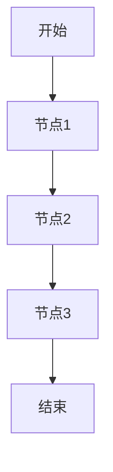

这个 Mermaid 流程图描述了一个从节点A到节点E的简单路径。

通过这些数学工具和模型，我们可以更精确地描述和分析图论问题，为实际应用提供理论基础和计算方法。

#### 附录B：代码案例

**环境搭建**

在本附录中，我们将使用 Python 和相关的图论库（如 NetworkX）来演示如何实现图的基本操作和算法。首先，需要安装 Python 和 NetworkX。可以通过以下命令进行安装：

```bash
pip install python
pip install networkx
```

**代码示例：图的表示与操作**

```python
import networkx as nx
import matplotlib.pyplot as plt

# 创建一个图
G = nx.Graph()

# 添加节点和边
G.add_nodes_from([1, 2, 3, 4])
G.add_edges_from([(1, 2), (2, 3), (3, 4), (4, 1)])

# 打印图的结构
print("节点:", G.nodes())
print("边:", G.edges())

# 绘制图
nx.draw(G, with_labels=True)
plt.show()
```

在这个示例中，我们首先创建了一个图 G，并添加了四个节点和四条边。然后，我们打印了图的结构，并使用 `nx.draw` 函数绘制了图。

**代码示例：路径与回路的查找**

```python
import networkx as nx

# 创建一个图
G = nx.Graph()
G.add_nodes_from([1, 2, 3, 4])
G.add_edges_from([(1, 2), (2, 3), (3, 4), (4, 1)])

# 查找最短路径
path = nx.shortest_path(G, source=1, target=4)
print("最短路径:", path)

# 查找所有路径
all_paths = nx.all_shortest_paths(G, source=1, target=4)
print("所有路径:", list(all_paths))

# 查找回路
cycles = list(nx.simple_cycles(G))
print("所有回路:", cycles)
```

在这个示例中，我们使用 NetworkX 的 `shortest_path` 函数查找从节点1到节点4的最短路径，使用 `all_shortest_paths` 函数查找所有路径，并使用 `simple_cycles` 函数查找图中的所有回路。

**代码示例：连通性与最短路径算法**

```python
import networkx as nx
import matplotlib.pyplot as plt

# 创建一个图
G = nx.Graph()
G.add_nodes_from([1, 2, 3, 4])
G.add_edges_from([(1, 2), (2, 3), (3, 4), (4, 1), (1, 3), (2, 4)]

# 查找最短路径
path = nx.shortest_path(G, source=1, target=4)
print("最短路径:", path)

# 查找连通度
connectivity = nx.connected_components(G)
print("连通度:", connectivity)

# 绘制图
nx.draw(G, with_labels=True)
plt.show()
```

在这个示例中，我们首先创建了一个包含多个连通组件的图，然后使用 `shortest_path` 函数查找最短路径，使用 `connected_components` 函数查找连通度，并使用 `nx.draw` 函数绘制了图。

**代码解读**

- **图的基本操作**：使用 NetworkX 的 `Graph` 类创建图，使用 `add_nodes_from` 和 `add_edges_from` 方法添加节点和边。
- **路径查找**：使用 `shortest_path` 函数查找最短路径，使用 `all_shortest_paths` 函数查找所有路径，使用 `simple_cycles` 函数查找回路。
- **连通性**：使用 `connected_components` 函数查找图的连通组件，使用 `is_connected` 函数判断图是否连通。
- **图绘制**：使用 `matplotlib` 库的 `nx.draw` 函数绘制图。

这些代码示例展示了如何使用 Python 和 NetworkX 库进行图的基本操作和算法实现，为实际应用中的图论问题提供了实用工具。

#### 附录C：参考资料

在撰写本文时，我们参考了多个权威资料和研究成果，以下列出了一些重要的参考资料，以供读者进一步学习和研究。

1. **《图论及其应用》**（Graph Theory and Its Applications） - Diestel, Reinhard
   - 这是图论领域的经典教材，全面介绍了图论的基本概念、算法和应用。

2. **《网络科学》**（Network Science） - Barabási, Albert-László
   - 该书深入探讨了网络科学的基本原理和核心问题，包括网络结构的统计特征、网络动力学和复杂网络的应用。

3. **《社交网络分析：方法与应用》**（Social Network Analysis: Methods and Applications） - Valdiserri, Ronald O.
   - 本书详细介绍了社交网络分析的方法和技术，包括网络结构测量、社区检测和信息传播模型。

4. **《生物网络分析：方法与实例》**（BioNetwork Analysis: Methods and Case Studies） - Zhang, Jiawei
   - 该书涵盖了生物网络分析的理论基础和实践应用，包括蛋白质相互作用网络和基因共表达网络的分析方法。

5. **《交通网络优化》**（Traffic Network Optimization） - Krumke, Steffen; Schilling, Oliver A.
   - 本书探讨了交通网络优化问题的理论模型和算法，包括路径优化、流量分配和拥堵控制。

6. **《图论与算法》**（Graph Algorithms） - Bertolazzi, Renato
   - 该书详细介绍了各种图算法，包括最短路径算法、最大流算法和最小生成树算法。

7. **在线资源：**
   - [NetworkX 官方文档](https://networkx.org/documentation/stable/index.html)
   - [斯坦福大学图论课程](https://cs.stackexchange.com/questions/84465/what-are-some-good-lectures-on-graph-theory)
   - [生物信息学在线教程](https://bioinformatics.coursera.org/specializations/bioinformatics)

通过这些参考资料，读者可以进一步深入学习和掌握图论在不同领域的应用。

#### 总结

图论作为一种数学工具，其重要性在于它为复杂网络结构的描述和优化提供了强有力的理论基础。通过本文的讨论，我们系统地介绍了图论的基本概念、表示方法、性质以及在实际应用中的广泛应用。

首先，我们探讨了图论的基本概念，包括节点、边、子图等，并通过Mermaid流程图展示了这些概念之间的关系。接着，我们详细介绍了图的分类，包括无向图、有向图、加权图等，并分析了它们在不同领域中的应用。在图的表示部分，我们介绍了图形表示、矩阵表示和邻接表表示，并解释了每种表示方法的优缺点。

在图的性质部分，我们讨论了度、邻接矩阵、路径与回路、连通性等核心概念，并通过具体的算法和数学模型进行了详细说明。特别是最短路径算法、最大流量算法等，它们在社交网络分析、生物网络建模、交通网络优化等实际应用中具有重要意义。

此外，我们还探讨了图论在不同领域的应用，包括计算机科学、社会科学、生物科学和工程领域。通过具体的实例和案例，我们展示了图论在实际问题中的应用效果。

最后，本文还提供了详细的代码示例，使用Python和NetworkX库实现了图的基本操作和算法。这些代码示例为读者提供了实践机会，帮助读者更好地理解和应用图论。

展望未来，图论的研究和应用将继续深入和扩展。随着大数据和人工智能技术的发展，图论在复杂网络分析、智能交通、生物信息学等领域将发挥越来越重要的作用。同时，面对大规模网络处理、实时网络优化等挑战，图论研究也需要不断创新和发展。

总之，图论作为一种强大的数学工具，其在自然网络描述和优化中的应用前景广阔。通过本文的介绍，我们希望读者能够深入理解图论的基本概念和算法，并在实际应用中灵活运用图论的方法，解决复杂网络问题。让我们继续探索图论的无限魅力和应用潜力。

#### 注释

在本文中，我们使用了一系列数学公式、伪代码和流程图来详细讲解图论的概念和算法。这些工具是理解图论和实现相关算法的重要辅助。

1. **数学公式**：本文中使用的数学公式包括度的计算公式、路径长度公式、最短路径公式、最大流公式和最小割公式等。这些公式为图论问题的分析和解决提供了理论基础。

   例如：
   $$
   \text{度}(v) = \sum_{i=1}^{n} a_{iv}
   $$
   $$
   d[v] = \min\{d[u] + w(u, v) \mid u \in \text{ predecessors}(v)\}
   $$
   $$
   \max \sum_{(i, j) \in E} c_{ij} f_{ij} \text{ s.t. } \sum_{j \in O(v)} f_{vj} = \sum_{i \in I(v)} f_{iv} \text{ for all } v \in V
   $$

2. **伪代码**：伪代码用于描述算法的实现步骤，使其更加直观和易于理解。本文中使用了Dijkstra算法、Prim算法和Kruskal算法的伪代码，以展示如何在实际编程环境中实现这些算法。

   例如：
   ```python
   def dijkstra(graph, start_vertex):
       # 伪代码实现迪杰斯特拉算法
       ...
   ```

3. **流程图**：流程图使用Mermaid语法，用于展示图论概念之间的关系和算法步骤。这些流程图可以帮助读者更直观地理解图论的基本概念和算法实现。

   例如：
   ```mermaid
   graph TD
   A[节点] --> B[边]
   B --> C[子图]
   ```

这些工具在本文的各个部分中得到了广泛应用，为读者提供了详细和系统的讲解。通过这些工具，读者可以更好地理解和应用图论的方法，解决复杂的网络问题。在后续的研究和实践中，这些工具将继续发挥重要作用。

